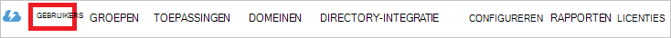

<properties
    pageTitle="Zelfstudie: Azure Active Directory-integratie met Proofpoint op aanvraag | Microsoft Azure"
    description="Informatie over het configureren van eenmalige aanmelding tussen Azure Active Directory en Proofpoint op aanvraag."
    services="active-directory"
    documentationCenter=""
    authors="jeevansd"
    manager="femila"
    editor=""/>

<tags
    ms.service="active-directory"
    ms.workload="identity"
    ms.tgt_pltfrm="na"
    ms.devlang="na"
    ms.topic="article"
    ms.date="10/05/2016"
    ms.author="jeedes"/>

# Zelfstudie: Azure Active Directory-integratie met Proofpoint op aanvraag

In deze zelfstudie leert u hoe Proofpoint op verzoek integreren met Azure Active Directory (AD Azure).

Proofpoint op verzoek integreren met AD Azure biedt de volgende voordelen:

- U kunt bepalen in Azure AD die toegang tot Proofpoint op aanvraag heeft.
- U kunt gebruikers automatisch ophalen aangemeld bij Proofpoint op aanvraag (single sign-on of eenmalige aanmelding) met hun Azure AD-accounts inschakelen.
- U kunt uw rekeningen op één centrale locatie, de klassieke Azure portal beheren.

Als u wilt weten meer informatie over SaaS app integratie met AD Azure, [Wat is toegang tot toepassingen en eenmalige aanmelding met Active Directory Azure?](active-directory-appssoaccess-whatis.md).

## Vereisten

Azure AD-integratie configureren met Proofpoint op verzoek, moet u de volgende items:

- Een abonnement op Azure AD
- Een Proofpoint op één vraag aanmelding abonnement

Test de stappen in deze zelfstudie, volgt u deze aanbevelingen:

- Gebruik niet uw productieomgeving, tenzij dat noodzakelijk is.
- Als u een evaluatieversie AD Azure-omgeving niet hebt, kunt u [krijgen een proefperiode van een maand](https://azure.microsoft.com/pricing/free-trial/).

## Beschrijving van het scenario
In deze zelfstudie test u Azure AD eenmalige aanmelding in een testomgeving.

Het scenario dat is beschreven in deze zelfstudie bestaat uit twee voornaamste bouwstenen:

1. Proofpoint op verzoek van de galerie toevoegen.
2. Configureren en testen Azure AD eenmalige aanmelding.

## Proofpoint op aanvraag toevoegen uit de galerie
De integratie van Proofpoint op verzoek configureren in Azure AD, moet u Proofpoint op verzoek vanuit de galerie toevoegen aan de lijst met beheerde SaaS-apps.

1. Klik in de klassieke Azure portal, in het linkernavigatievenster op **Active Directory**.

    ![Active Directory-pictogram][1]
2. Selecteer in de lijst **map** de map die u wilt inschakelen van directory-integratie.

3. Als de toepassingen in de weergave opent in de mapweergave, klik op **toepassingen** in het menu aan de bovenkant.

    ![Menu-item toepassingen][2]

4. Klik op **toevoegen** onder aan de pagina.

    ![Knop toevoegen][3]

5. **Wat wilt u doen** in het dialoogvenster, klik op **een toepassing uit de galerie toevoegen**.

    ![Keuze van een toepassing uit de galerie toe te voegen.][4]

6. Typ in het zoekvak **Proofpoint op aanvraag**.

    

7. **Proofpoint op afroep**selecteren in het resultatendeelvenster en klik op **Voltooien** als de toepassing wilt toevoegen.

##  Configureren en testen van eenmalige aanmelding Azure AD
In deze sectie kunt u configureren en testen Azure AD single sign-on met Proofpoint op aanvraag op basis van een testgebruiker met de naam Britta Simon.

Voor eenmalige aanmelding wilt werken, moet AD Azure weten wat de gebruiker tegenhanger in Proofpoint op verzoek aan een gebruiker in AD Azure. Met andere woorden, moet u de relatie tot stand brengen een koppeling tussen een Azure AD-gebruiker en de gebruiker in Proofpoint op aanvraag.

U instellen deze relatie koppeling door de waarde van **gebruikersnaam** toewijzen in Azure AD als de waarde van de **gebruikersnaam** in het Proofpoint op verzoek.

Als u wilt configureren en testen Azure AD single sign-on met Proofpoint op verzoek, moet u de volgende procedures uitvoeren:

1. [Eenmalige aanmelding configureren Azure AD](#configuring-azure-ad-single-sign-on), zodat de gebruikers deze functie wilt gebruiken.
2. [Maak een testgebruiker Azure AD](#creating-an-azure-ad-test-user), Azure AD single sign-on met Britta Simon testen.
3. [Maak een Proofpoint op het testgebruiker vraag](#creating-a-proofpoint-ondemand-test-user), hebben een tegenhanger van Britta Simon in Proofpoint op de vraag die is gekoppeld aan de weergave Azure AD van haar.
4. [Het testgebruiker Azure AD toewijzen](#assigning-the-azure-ad-test-user), Britta Simon gebruik van eenmalige aanmelding Azure AD inschakelen.
5. [Eenmalige aanmelding test](#testing-single-sign-on)om te controleren of de configuratie werkt.

### Azure AD eenmalige aanmelding configureren

In deze sectie, Azure AD eenmalige aanmelding in de klassieke portal inschakelen en configureren op in uw Proofpoint op verzoek van de vraag.

1. Klik in de klassieke portal op de pagina **Proofpoint op verzoek** application integration **eenmalige aanmelding configureren** om het dialoogvenster **Configureren van eenmalige aanmelding** te openen.

    ![Knop "Eenmalige aanmelding configureren"][6]

2. Selecteer **Microsoft Azure AD Single Sign-On**op de pagina **Hoe wilt u dat gebruikers aanmelden bij Proofpoint op verzoek** en klik op **volgende**.

    

3. Voer de volgende stappen uit op de pagina **Toepassingsinstellingen configureren** :

    

    een. Typ in het vak **URL voor aanmelding op** de URL waar gebruikers bij uw Proofpoint op verzoek van de vraag aanmelden. Gebruik het volgende patroon: **https://\<hostnaam\>.pphosted.com/ppssamlsp_hostname**

    b. Typ de URL in het vak **id** volgens het volgende patroon: **https://\<hostnaam / >.pphosted.com/ppssamlsp**

    c. Typ de URL in het vak **URL van antwoord** volgens het volgende patroon: **https://\<hostnaam / >.pphosted.com:portnumber/v1/samlauth/samlconsumer**

    d. Klik op **volgende**.

4. Klik op de pagina **configureren eenmalige aanmelding bij Proofpoint op verzoek** kunt u de volgende stappen uitvoeren:

    

    een. Klik op **certificaat downloaden**en sla het bestand op uw computer.

    b. Klik op **volgende**.

5. Als u eenmalige aanmelding configureren voor uw toepassing, neem contact op met de Proofpoint op vraag ondersteuningsteam en geeft u het volgende:

    • Het gedownloade certificaat

    • De entiteit-ID

    • De SAML SSO-URL

6. In de klassieke portal, selecteert u de bevestiging van enkele aanmelding-configuratie en klik op **volgende**.

    ![Selectievakje dat bevestigt dat u eenmalige aanmelding hebt geconfigureerd][10]

7. Klik op **Voltooien**op de pagina **bevestiging van één aanmelding** .  

    ![Bevestigingspagina][11]

### Azure AD test gebruikers maken
In deze sectie kunt maken u een testgebruiker Britta Simon met de naam in de klassieke portal.

![Het testgebruiker in de lijst met gebruikers][20]

1. Klik in de klassieke Azure portal, in het linkernavigatievenster op **Active Directory**.

    

2. Selecteer in de lijst **map** de map die u wilt inschakelen van directory-integratie.

3. De lijst met gebruikers, in het menu aan de bovenkant, klikt u op **gebruikers**.

    

4. Klik op **Gebruiker toevoegen**om te openen op de werkbalk onder in het dialoogvenster **Gebruiker toevoegen** .

    

5. Klik op de pagina **ons over deze gebruiker** de volgende stappen uitvoeren:  

    een. Selecteer in het vak **TYPE van gebruiker** , **nieuwe gebruiker in uw organisatie**.

    b. Typ **BrittaSimon**in het vak **Gebruikersnaam** .

    c. Klik op **volgende**.

6.  Klik op de pagina **gebruikersprofiel** als volgt: 

    een. Typ in het vak **VOORNAAM** **Britta**.  

    b. Typ in het vak **ACHTERNAAM** **Simon**.

    c. Typ in het vak **WEERGAVENAAM** **Britta Simon**.

    d. Selecteer de **gebruiker**in de lijst **functie** .

    e. Klik op **volgende**.

7. Klik op **maken**op de pagina **tijdelijke wachtwoord opvragen** .

    

8. Op de pagina **tijdelijke wachtwoord ophalen** , moet u de volgende stappen uitvoeren:

    

    een. Noteer de waarde in het vak **Nieuw wachtwoord** .

    b. Klik op **Voltooien**.   

### Maak een Proofpoint op het testgebruiker vraag

In dit gedeelte maakt u Britta Simon genoemd in Proofpoint op verzoek van een gebruiker. Neem werken met Proofpoint op vraag ondersteuningsteam gebruikers toe te voegen in de Proofpoint op vraag platform.

### Het testgebruiker Azure AD toewijzen

In dit gedeelte vindt inschakelen u Britta Simon voor de Azure eenmalige aanmelding toegang verlenen aan Proofpoint op verzoek.

![Gebruikersgegevens, met toegang via de directe methode is ingeschakeld][200]

1. Klik in de klassieke portal in de map **toepassingen** in het menu aan de bovenkant om de weergave van de toepassingen te openen.

    ![Menu-item toepassingen][201]

2. Selecteer in de lijst met toepassingen, **Proofpoint op aanvraag**.

    

3. Klik op **gebruikers**in het menu aan de bovenkant.

    ![GEBRUIKERS menu-item][203]

4. Selecteer in de lijst met gebruikers, **Britta Simon**.

5. Klik op **toewijzen**op de werkbalk aan de onderkant.

    ![Knop toewijzen][205]

### Test-on

In dit gedeelte kunt u uw Azure AD één aanmelding-configuratie via het Configuratiescherm toegang testen.

Wanneer u op de tegel **Proofpoint op verzoek** in het Access-venster, moet u worden automatisch aangemeld bij uw Proofpoint op verzoek van de vraag.

## Aanvullende bronnen

* [Lijst met zelfstudies over het integreren van SaaS-toepassingen met Azure Active Directory](active-directory-saas-tutorial-list.md)
* [Wat is toegang tot toepassingen en eenmalige aanmelding met Azure Active Directory?](active-directory-appssoaccess-whatis.md)

<!--Image references-->

[1]: ./media/active-directory-saas-proofpoint-ondemand-tutorial/tutorial_general_01.png
[2]: ./media/active-directory-saas-proofpoint-ondemand-tutorial/tutorial_general_02.png
[3]: ./media/active-directory-saas-proofpoint-ondemand-tutorial/tutorial_general_03.png
[4]: ./media/active-directory-saas-proofpoint-ondemand-tutorial/tutorial_general_04.png

[6]: ./media/active-directory-saas-proofpoint-ondemand-tutorial/tutorial_general_05.png
[10]: ./media/active-directory-saas-proofpoint-ondemand-tutorial/tutorial_general_06.png
[11]: ./media/active-directory-saas-proofpoint-ondemand-tutorial/tutorial_general_07.png
[20]: ./media/active-directory-saas-proofpoint-ondemand-tutorial/tutorial_general_100.png

[200]: ./media/active-directory-saas-proofpoint-ondemand-tutorial/tutorial_general_200.png
[201]: ./media/active-directory-saas-proofpoint-ondemand-tutorial/tutorial_general_201.png
[203]: ./media/active-directory-saas-proofpoint-ondemand-tutorial/tutorial_general_203.png
[204]: ./media/active-directory-saas-proofpoint-ondemand-tutorial/tutorial_general_204.png
[205]: ./media/active-directory-saas-proofpoint-ondemand-tutorial/tutorial_general_205.png
