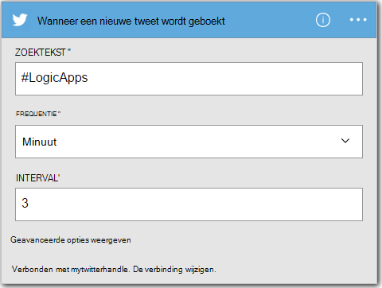
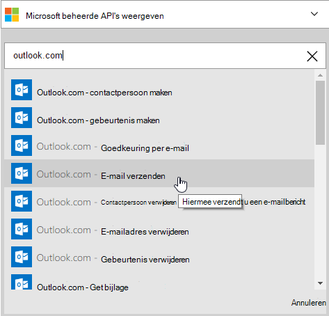
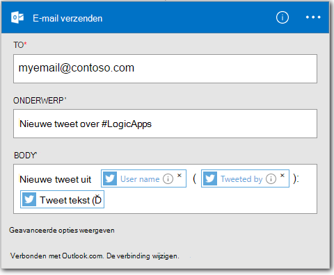

<properties
    pageTitle="Maken van een App logica | Microsoft Azure"
    description="Informatie over het maken van een logica App SaaS services verbinding maken"
    authors="jeffhollan"
    manager="dwrede"
    editor=""
    services="logic-apps"
    documentationCenter=""/>

<tags
    ms.service="logic-apps"
    ms.workload="na"
    ms.tgt_pltfrm="na"
    ms.devlang="na"
    ms.topic="get-started-article"
    ms.date="10/18/2016"
    ms.author="jehollan"/>

# Een nieuwe logica app SaaS services verbinding maken

In dit onderwerp wordt beschreven hoe, in een paar minuten, u kunt aan de slag met [Azure logica Apps](app-service-logic-what-are-logic-apps.md). We zien door middel van een eenvoudige werkstroom waarmee u interessante tweets naar je e-mailadres te verzenden.

In dit scenario, hebt u nodig:

- Een abonnement op Azure
- Een Twitter-account
- Een Outlook.com of gehoste Office 365-postbus

## Maak een nieuwe app logica om te e-mailen tweets

1. Selecteer **Nieuw**in het [dashboard van Azure portal](https://portal.azure.com). 
2. In de zoekbalk 'logica app' Zoek en selecteer **App logica**. Ook kunt u **Nieuw** **Web + Mobile**selecteren en **Logica App**selecteren. 
3. Voer een naam voor uw app logica en selecteer een locatie, een resourcegroep **maken**selecteren.  Als u de **pincode voor Dashboard** selecteert wordt de logica app automatisch geopend na implementatie.  
4. Na het openen van uw app logica voor de eerste keer kunt u met een sjabloon om te starten.  Nu klikt u op **Lege logica App** voor het opbouwen van dit geheel. 
1. Het eerste item dat u wilt maken, is de trigger.  Dit is de gebeurtenis die uw app logica wordt gestart.  Zoeken naar **twitter** in het zoekvak trigger en selecteer deze.
7. Nu voert u een zoekterm te activeren op.  De **frequentie** en **Interval** bepaalt hoe vaak uw logica app wordt gecontroleerd op nieuwe tweets (en alle tweets tijdens die periode tijd terug).
    

5. Klik op de knop **nieuwe stap** en kies vervolgens **een actie toevoegen** of **een voorwaarde toevoegen**
6. Wanneer u **een actie toevoegen**selecteert, kunt u zoeken in de [Beschikbare connectors](../connectors/apis-list.md) een actie te kiezen. Selecteer bijvoorbeeld **Outlook.com - e-mailbericht verzenden** om e-mail te verzenden vanaf een outlook.com-adres:  
    

7. Nu hebt u de parameters voor het e-mailbericht dat u wilt invullen:  

8. Ten slotte kunt u **Opslaan** om uw logica app live.

## Beheren van uw app logica na aanmaak

Nu is uw logica app actief. Het controleert regelmatig op tweets met de zoekterm ingevoerd. Als er een overeenkomende tweet, stuurt het u een e-mailbericht. Ten slotte zult u zien hoe de app uitschakelen of zien hoe presteert.

1. Ga naar de [Azure Portal](https://portal.azure.com)

1. Klik op **Bladeren** aan de linkerkant van het scherm en selecteer **Logica Apps**.

2. Klik op de nieuwe logica app die u zojuist hebt gemaakt als u wilt zien van de huidige status en algemene informatie.

3. Als u wilt uw nieuwe logica app bewerken, klikt u op **bewerken**.

5. Als u wilt de app uitschakelen, klikt u op **uitschakelen** in de opdrachtbalk.

1. Bekijk geschiedenis en trigger uitvoeren om te controleren wanneer uw app logica wordt uitgevoerd.  U kunt klikken op **vernieuwen** om de nieuwste gegevens.

In minder dan 5 minuten konden u voor het instellen van een eenvoudige logica app uitgevoerd in de cloud. Zie voor meer informatie over het gebruik van Apps logische functies, [functies voor bedrijfslogica app gebruiken]. Zie meer informatie over de definities van logica App zelf, [auteur logica App definities](app-service-logic-author-definitions.md).

<!-- Shared links -->
[Azure portal]: https://portal.azure.com
[Functies voor bedrijfslogica app gebruiken]: app-service-logic-create-a-logic-app.md
