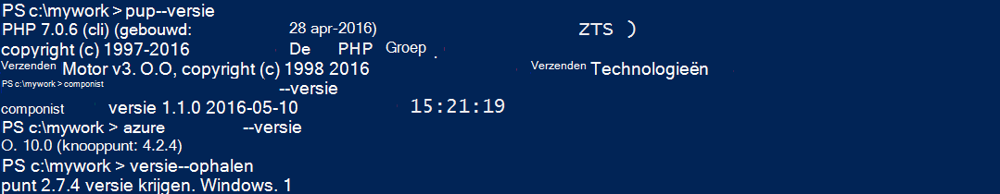
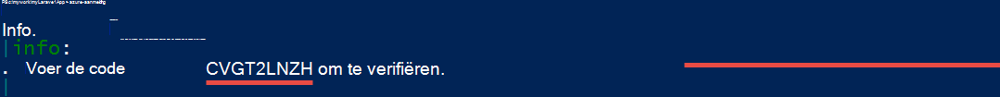
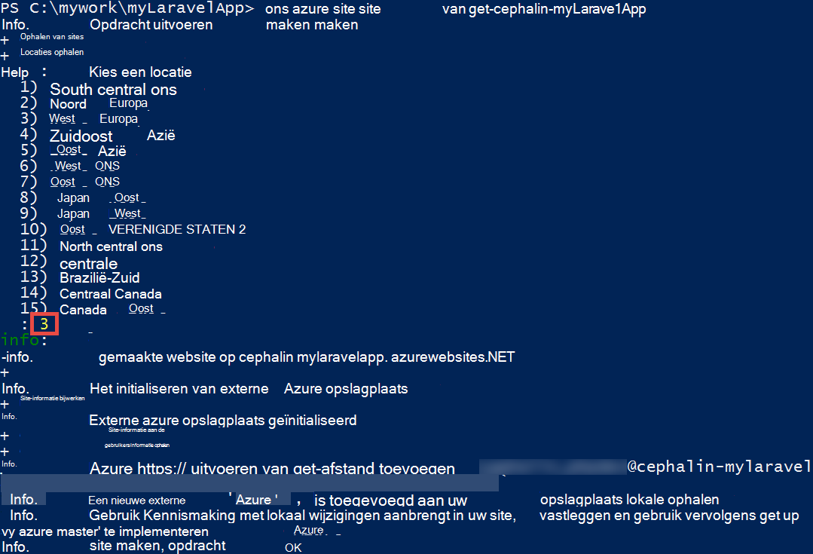
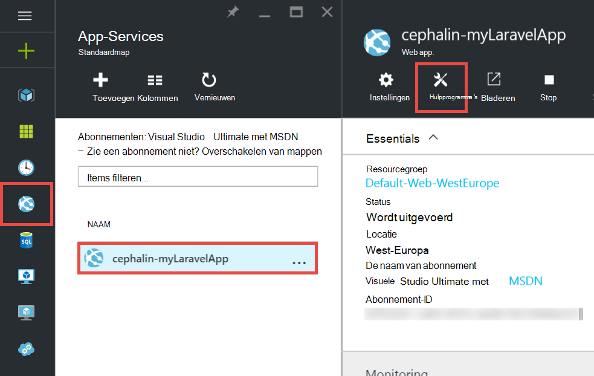
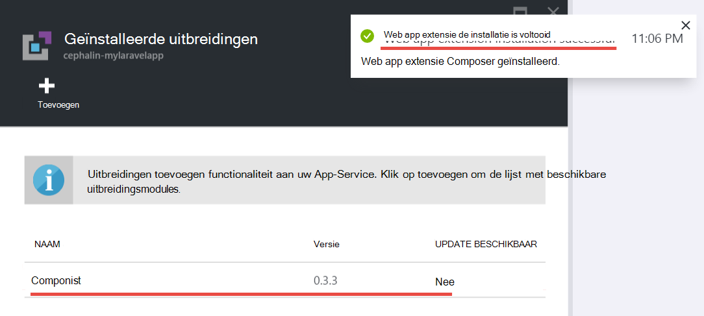
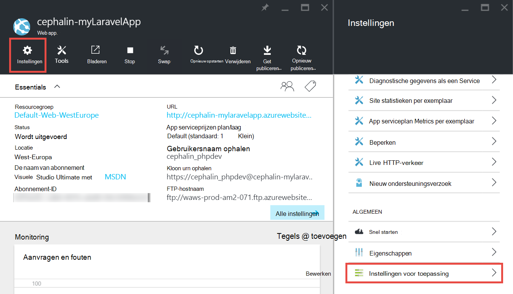
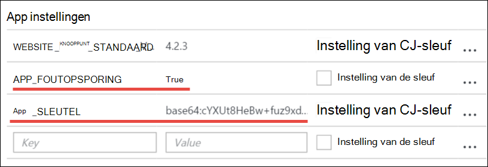
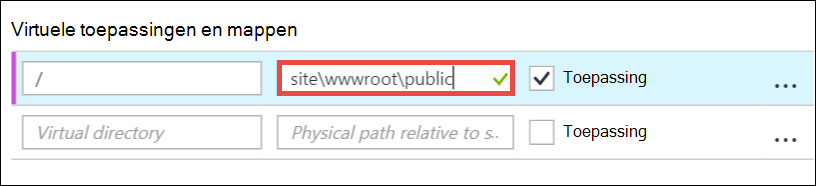
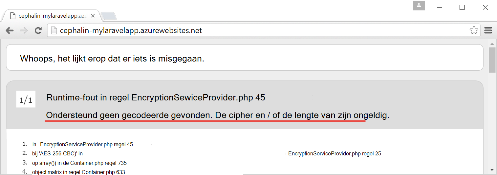

<properties
    pageTitle="Maken, configureren en implementeren van een PHP web app voor Azure"
    description="Een zelfstudie waarin wordt uitgelegd hoe u een (Laravel) PHP web app in Azure App-Service uitvoeren. Informatie over het configureren van Azure App-Service om te voldoen aan de eisen van de PHP framework dat u kiest."
    services="app-service\web"
    documentationCenter="php"
    authors="cephalin"
    manager="wpickett"
    editor=""
    tags="mysql"/>

<tags
    ms.service="app-service-web"
    ms.workload="web"
    ms.tgt_pltfrm="na"
    ms.devlang="PHP"
    ms.topic="article"
    ms.date="06/03/2016" 
    ms.author="cephalin"/>

# Maken, configureren en implementeren van een PHP web app voor Azure

[AZURE.INCLUDE [tabs](../../includes/app-service-web-get-started-nav-tabs.md)]

Deze zelfstudie toont u maken, configureren en implementeren van een PHP web app voor Azure en Azure App-Service om te voldoen aan de eisen van de PHP web app configureren. Aan het einde van de zelfstudie hebt u een werkende [Laravel](https://www.laravel.com/) web app met live in [Azure App-Service](../app-service/app-service-value-prop-what-is.md).

U kunt uw favoriete PHP framework als PHP ontwikkelaar overbrengen naar Azure. In deze zelfstudie wordt Laravel als voorbeeld van een concrete toepassing. U leert: 

- Implementeren met behulp van Git
- PHP versie
- Een start-bestand gebruiken dat zich niet in de hoofdmap van de toepassing
- Toegang tot milieu-specifieke variabelen
- Bijwerken van uw app in Azure

U kunt toepassen wat u leert hier aan andere PHP web apps die u met Azure implementeert.

>[AZURE.INCLUDE [app-service-linux](../../includes/app-service-linux.md)] 

## Vereisten

- Installeer [PHP 5.6.x](http://php.net/downloads.php) (PHP 7 support is beta)
- [Composer](https://getcomposer.org/download/) installeren
- [Azure CLI](../xplat-cli-install.md) installeren
- [Git](http://www.git-scm.com/downloads) installeren
- Een Microsoft Azure-account aanvragen. Als u geen account hebt, kunt u [uw voordelen van Visual Studio abonnee activeren](/pricing/member-offers/msdn-benefits-details/?WT.mc_id=A261C142F)of [registreren voor een gratis proefversie](/pricing/free-trial/?WT.mc_id=A261C142F) .

>[AZURE.NOTE] Zie een web app in actie. [App-Service probeert](http://go.microsoft.com/fwlink/?LinkId=523751) onmiddellijk en maak een tijdelijk starter app, geen creditcard vereist, geen verplichtingen.

## Maak een PHP (Laravel) app op uw machine dev

1. Open een nieuwe opdrachtprompt van Windows PowerShell-venster, Linux shell of OS X terminal. Voer de volgende opdrachten om te controleren of de benodigde's goed zijn geïnstalleerd op uw computer. 

        php --version
        composer --version
        azure --version
        git --version

    

    Als u de hulpprogramma's hebt geïnstalleerd, Zie [vereisten](#Prerequisites) voor downloadkoppelingen.
    
2. Installatie Laravel zoals:

        composer global require "laravel/installer

3. `CD`in een werkmap en een nieuwe Laravel-toepassing maken als volgt:

        cd <working_directory>
        laravel new <app_name>

4. `CD`in het zojuist gemaakte `<app_name>` map en test de app als volgt:

        cd <app_name>
        php artisan serve
        
    U moet mogelijk naar http://localhost:8000 in een browser nu en Zie het beginscherm Laravel.
    
    
    
Zo ver, maar de regelmatige Laravel workflow en u bent niet hier voor <a href="https://laravel.com/docs/5.2" rel="nofollow">meer informatie over Laravel</a>. Dus laten we doorgaan.

## Een Azure web app maken en instellen van de Git distributie

>[AZURE.NOTE] 'Wachten! Wat gebeurt er als ik wil implementeren met FTP?" Er is een [FTP-zelfstudie](web-sites-php-mysql-deploy-use-ftp.md) voor uw behoeften. 

U kunt met de CLI Azure een web app in Azure App-Service maken en instellen voor Git implementatie met één regel van opdracht. Laten we dit doen.

1. ASM-modus wijzigen en zich aanmelden bij Azure:

        azure config mode asm
        azure login
    
    Volg de help-bericht om te gaan met de aanmelding.
    
    

4. Voer de opdracht de Azure web app met Git implementatie te maken. Wanneer dat wordt gevraagd, geeft u het nummer van het gewenste gebied.

        azure site create --git <app_name>
    
    
    
    >[AZURE.NOTE] Als u hebt nooit implementatie referenties voor uw abonnement op Azure, wordt u gevraagd om deze te maken. Deze referenties niet uw accountreferenties Azure worden alleen voor Git implementaties en FTP-aanmeldingen door App-Service gebruikt. 
    
    Met deze opdracht maakt u een nieuw Git repository op de huidige map (met `git init`) en koppelt deze aan de opslagplaats in Azure als een externe Git (met `git remote add`).

<a name="configure"/>
## Configureer de Azure web app.

Uw app Laravel werken in Azure, moet u aandacht te besteden aan verschillende dingen. Doet u deze oefening ongeveer voor uw PHP framework van keuze.

- Configureer PHP 5.5.9 of hoger. Zie [Laatste Laravel 5.2 vereisten](https://laravel.com/docs/5.2#server-requirements) voor de hele lijst met vereisten voor de server. De rest van de lijst worden de uitbreidingen die al zijn ingeschakeld door de Azure PHP installaties. 
- Instellen van de omgevingsvariabelen die uw app nodig heeft. Laravel maakt gebruik van de `.env` -bestand voor het eenvoudig instellen van omgevingsvariabelen. Echter omdat dit niet moet worden vastgelegd in het besturingselement (Zie [Configuratie van Laravel omgeving](https://laravel.com/docs/5.2/configuration#environment-configuration), wordt u in plaats daarvan de instellingen app van uw Azure web app instellen.
- Zorg ervoor dat de Laravel-app ingangspunt, `public/index.php`, eerst wordt geladen. Zie [Laravel Lifecycle-Overzicht](https://laravel.com/docs/5.2/lifecycle#lifecycle-overview). Met andere woorden, moet u de web-app root URL om te verwijzen naar de `public` directory.
- De extensie Composer in Azure, inschakelen nadat u een composer.json hebt. Op die manier kunt u zorgen te maken over het verkrijgen van de vereiste pakketten wanneer u met implementeert componist `git push`. Het is een kwestie van gemak. Als u de Composer automatisering niet inschakelt, hoeft u slechts te verwijderen `/vendor` van de `.gitignore` zodat Git bevat het bestand ("un-negeert ') alles in de `vendor` map wanneer wordt doorgevoerd en de code implementeert.

Laten we deze taken opeenvolgend configureren.

4. De PHP-versie waarvoor uw app Laravel instellen.

        azure site set --php-version 5.6

    U klaar bent met het instellen van de PHP-versie! 
    
4. Genereren van een nieuw `APP_KEY` voor uw Azure web app en stel deze in als een instelling app voor uw Azure web app.

        php artisan key:generate --show
        azure site appsetting add APP_KEY="<output_of_php_artisan_key:generate_--show>"

4. Ook Laravel om voorrang te nemen op een cryptische foutopsporing inschakelen `Whoops, looks like something went wrong.` pagina.

        azure site appsetting add APP_DEBUG=true

    Omgevingsvariabelen instellen klaar is Kees!
    
    >[AZURE.NOTE] Wacht laten we een beetje vertragen en wat Laravel doet en wat Azure Hier wordt uitgelegd. Laravel maakt gebruik van de `.env` bestand in de hoofdmap om omgevingsvariabelen App, u de regel vindt `APP_DEBUG=true` (en ook `APP_KEY=...`). Deze variabele wordt geopend vanuit de `config/app.php` door de code     `'debug' => env('APP_DEBUG', false),`. [env()](https://laravel.com/docs/5.2/helpers#method-env) is een Laravel die gebruikmaakt van de PHP- [getenv()](http://php.net/manual/en/function.getenv.php) achter de.
    >
    >Echter `.env` Git genegeerd omdat het wordt genoemd door de `.gitignore` bestand in de hoofdmap. Eenvoudig gezegd, `.env`  
 in uw lokale Git repository is niet doorgevoerd in de Azure met de rest van de bestanden. Natuurlijk kunt u alleen die lijn uit verwijderen `.gitignore`, maar we hebben al vastgesteld dat dit bestand wordt doorgevoerd in het besturingselement wordt niet aanbevolen. Niettemin moet u nog steeds een manier om op te geven van deze omgevingsvariabelen in Azure. 
    >
    >Het goede nieuws is dat de toepassingsinstellingen in Azure App-Service ondersteunt [getenv()](http://php.net/manual/en/function.getenv.php)  
 in PHP. Terwijl u kunt FTP- of andere middelen handmatig uploaden in dat geval een `.env` bestand in Azure, kunt u alleen de variabelen die u wilt opgeven als Azure app instellingen zonder een `.env` in Azure, zoals u zojuist hebt gedaan. Bovendien, als een variabele in beide is een `.env` -bestand en in Azure app instellingen, de instelling van de Azure app wint.     

4. De laatste twee taken (het instellen van de virtuele map en het inschakelen van componist) vereist de [Azure portal](https://portal.azure.com), dus Meld u aan bij de [portal](https://portal.azure.com) met uw account Azure.

4. Starten in het menu links klikt u op **App Services** > **&lt;Naam_toepassing >** > **Extra**.

    
    
    >[AZURE.TIP] Als u op **Instellingen** in plaats van **hulpprogramma's**, kunt u waarschijnlijk gewoon toegang krijgen tot de **Instellingen van de toepassing**  
 blade, waarmee u kunt versies van PHP, app-instellingen instellen en virtuele mappen, zoals u zojuist hebt. 
    
4. Klik op **extensies** > **toevoegen** aan een extensie toevoegen.

4. Selecteer **componist** in de **extensie kiezen** [blade](../azure-portal-overview.md) (*blade*: een portal-pagina wordt horizontaal geopend).

4. Klik op **OK** in het blad van **de juridische voorwaarden accepteren** . 

5. Klik op **OK** in het blad **extensie toevoegen** .

    Azure gebeurt wanneer de extensie toevoegt, ziet u een beschrijvende pop-up bericht in de hoek, ook  **Composer** in de blade **extensies** weergegeven.

    

    Composer inschakelen klaar is Kees!
    
4. Terug in uw webtoepassing blade, klikt u op **Instellingen** > **Toepassingsinstellingen**.

    

    Noteer de PHP-versie die u eerder hebt ingesteld in de blade **Toepassingsinstellingen** :

    

    en de instellingen van de app toegevoegd:
    
    

4. Ga naar de onderkant van het blad en wijzig de virtuele hoofdmap om te verwijzen naar **site\wwwroot\public** in plaats van **site\wwwroot**.

    

4. Klik op **Opslaan** op de bovenkant van het blad.

    U klaar bent met het instellen van de virtuele map! 

## Uw web app met Git (en het instellen van omgevingsvariabelen) implementeren

Bent u klaar voor de implementatie van de code nu. U doet dit in de opdrachtprompt of terminal.

4. Alle wijzigingen doorvoeren en uw code implementeren op de Azure web app zoals u zou in een Git repository doen:

        git add .
        git commit -m "Hurray! My first commit for my Azure app!"
        git push azure master 

    Bij het uitvoeren van `git push`, wordt u gevraagd uw implementatie Git wachtwoord op te geven. Als u gevraagd om referenties van de implementatie op `azure site create` eerder, typ het wachtwoord dat u gebruikt.
    
5. We zien in de browser worden uitgevoerd door het uitvoeren van deze opdracht:

        azure site browse

    Uw browser moet het beginscherm Laravel weergegeven.
    
    
    
    Gefeliciteerd, u bent nu een Laravel web app in Azure.
             
## Algemene fouten oplossen

Hier volgen enkele fouten die u tegenkomen kunt als u deze zelfstudie te volgen:

- [Azure CLI toont '' locatie' is niet een azure-opdracht'](#clierror)
- [Web app HTTP 403-fout wordt weergegeven](#http403)
- [Web app toont 'Whoops, ziet er als er iets misgegaan is.'](#whoops)
- [Web app geeft "Geen ondersteunde encryptor gevonden."](#encryptor)

### Azure CLI toont '' locatie' is niet een azure-opdracht'

Bij het uitvoeren van `azure site *` in de opdrachtregel terminal, ziet u de fout`error:   'site' is not an azure command. See 'azure help'.` 

Dit is meestal een gevolg van het als u overschakelt naar de modus 'ARM' (Azure Resource Manager). U kunt dit oplossen door schakelen terug naar de modus 'ASM"(Azure Service Management) door het uitvoeren van `azure config mode asm`.

### Web app HTTP 403-fout wordt weergegeven

U hebt uw web app met Azure geïmplementeerd, maar wanneer u naar uw Azure web app, krijgt u een `HTTP 403` of`You do not have permission to view this directory or page.`

Dit komt waarschijnlijk omdat de web app kan het ingangspunt Laravel App niet vinden. Zorg ervoor dat u hebt ingesteld dat de virtuele hoofdmap om te verwijzen naar `site\wwwroot\public`, waarbij de Laravel `index.php` is (Zie [de Azure web app configureren](#configure)).

### Web app toont 'Whoops, ziet er als er iets misgegaan is.'

U hebt uw web app met Azure geïmplementeerd, maar wanneer u naar uw Azure web app, krijgt u het cryptisch bericht`Whoops, looks like something went wrong.`

Als u een meer beschrijvend foutbericht, Laravel foutopsporing inschakelen door `APP_DEBUG` omgevingsvariabele `true` (Zie [de Azure web app configureren](#configure)).

### Web app geeft "Geen ondersteunde encryptor gevonden."

U hebt uw web app met Azure geïmplementeerd, maar wanneer u naar uw Azure web app, u krijgt het volgende foutbericht weergegeven:

    
Dat is een vervelende fout, maar ten minste het is niet cryptisch sinds u de Laravel foutopsporing ingeschakeld. Een snelle zoekactie fouttekenreeks van de in de forums Laravel leert u is als gevolg van instelling van de APP_KEY in `.env`, of in uw geval geen `.env` in Azure helemaal. U kunt dit oplossen door de instelling toe te voegen `APP_KEY` als een Azure app instellen (Zie [de Azure web app configureren](#configure)).
    
## Volgende stappen

Informatie over het toevoegen van gegevens aan uw app door het [maken van een MySQL-database in Azure](../store-php-create-mysql-database.md). Raadpleeg ook eens meer nuttige links voor PHP in Azure hieronder:

- [PHP Developer Center](/develop/php/).
- [Maken van een web app van Azure Marketplace](app-service-web-create-web-app-from-marketplace.md)
- [PHP in Azure App Service Web Apps configureren](web-sites-php-configure.md)
- [WordPress converteren naar meerdere locaties in Azure App-Service](web-sites-php-convert-wordpress-multisite.md)
- [Bedrijfsniveau WordPress Azure App-service](web-sites-php-enterprise-wordpress.md)
