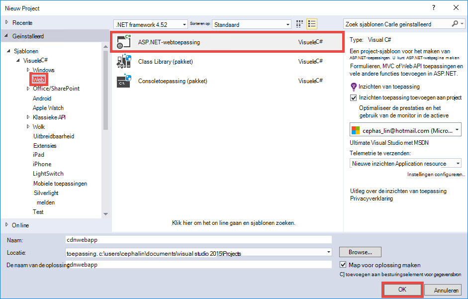

<properties 
    pageTitle="Azure CDN in Azure App-Service gebruiken" 
    description="Een zelfstudie over u het implementeren van een web app met Azure App-Service die de inhoud van een geïntegreerde Azure CDN eindpunt dient" 
    services="app-service\web,cdn" 
    documentationCenter=".net" 
    authors="cephalin" 
    manager="wpickett" 
    editor="jimbe"/>

<tags 
    ms.service="app-service" 
    ms.workload="tbd" 
    ms.tgt_pltfrm="na" 
    ms.devlang="dotnet" 
    ms.topic="article" 
    ms.date="07/01/2016" 
    ms.author="cephalin"/>


# <a name="use-azure-cdn-in-azure-app-service"></a>Azure CDN in Azure App-Service gebruiken

[App-Service](http://go.microsoft.com/fwlink/?LinkId=529714) kan worden geïntegreerd met [Azure CDN](/services/cdn/), toe te voegen aan de globale schaal mogelijkheden die inherent zijn aan [App Service Web Apps](http://go.microsoft.com/fwlink/?LinkId=529714) door webinhoud van serverknooppunten in de buurt van uw klanten wereldwijd app bedienen (een bijgewerkte lijst van alle huidige knooppunt locaties vindt u [hier](http://msdn.microsoft.com/library/azure/gg680302.aspx)). In scenario's zoals statische afbeeldingen ophalen door deze integratie kan drastisch verhogen de prestaties van uw Azure App Service Web Apps en aanzienlijk verbetert de gebruikerservaring van uw web app overal ter wereld. 

Web Apps integreren met Azure CDN biedt de volgende voordelen:

- Inhoudsdistributie (afbeeldingen, scripts en stylesheets) integreren als onderdeel van de [continue](app-service-continuous-deployment.md) implementatieproces van uw web app
- Eenvoudige upgrade NuGet pakketten in uw web app in Azure App-Service, zoals jQuery of Bootstrap versies 
- Uw webtoepassing en uw inhoud CDN betekend beheren vanaf dezelfde interface voor Visual Studio
- Bundeling van ASP.NET en minification integreren met Azure CDN

[AZURE.INCLUDE [app-service-web-to-api-and-mobile](../../includes/app-service-web-to-api-and-mobile.md)] 

## <a name="what-you-will-build"></a>Wordt opgebouwd ##

U implementeert een web app met Azure App-Service met behulp van de sjabloon voor ASP.NET MVC in Visual Studio, code toevoegen om te dienen inhoud van een geïntegreerde Azure CDN, zoals een afbeelding, controller actie resultaten, en de standaard van JavaScript en CSS-bestanden, en ook code schrijven voor het fallback mechanisme configureren voor bundels betekend in het geval dat de CDN off line is.

## <a name="what-you-will-need"></a>Wat moet u ##

Deze zelfstudie bevat de volgende vereisten:

-   Een actieve [account Microsoft Azure](/account/)
-   Visual Studio 2015 met de [Azure SDK voor .NET](http://go.microsoft.com/fwlink/p/?linkid=323510&clcid=0x409). Als u Visual Studio, kunnen de stappen verschillen.

> [AZURE.NOTE] Een Azure-account voor het voltooien van deze zelfstudie hebt u nodig:
> + U kunt [gratis een Azure account openen](/pricing/free-trial/) - credits dat u kunt u uitproberen betaalde Azure services en zelfs nadat u ze gebruikt kunt u de account en gebruik gratis Azure services, zoals Web Apps.
> + U kunt [Visual Studio abonnee voordelen activeren](/pricing/member-offers/msdn-benefits-details/) - Visual Studio uw abonnement geeft u credits elke maand die u voor betaalde Azure services gebruiken kunt.
>
> Als u wilt aan de slag met Azure App-Service voordat u aanmelden voor een account met Azure, gaat u naar de [App-Service probeert](http://go.microsoft.com/fwlink/?LinkId=523751), waar u direct een starter tijdelijk web app in de App-Service maken kunt. Geen creditcard vereist; geen verplichtingen.

## <a name="deploy-a-web-app-to-azure-with-an-integrated-cdn-endpoint"></a>Een web app op Azure implementeren met een geïntegreerde CDN eindpunt ##

In dit gedeelte vindt u standaard ASP.NET MVC sjabloon in Visual Studio 2015 App service implementeren, en vervolgens integreren met een nieuw CDN eindpunt. Volg de onderstaande instructies:

1. Maak in Visual Studio 2015, een nieuwe ASP.NET-webtoepassing in het menu gaat u naar **Bestand > Nieuw > Project > Web > ASP.NET Web Application**. Geef het een naam en klik op **OK**.

    

3. **MVC** en klik op **OK**.

    

4. Als u nog niet hebt aangemeld in uw Azure-account, klikt u op het pictogram in de rechterbovenhoek en gaat u als volgt het dialoogvenster aan te melden bij uw account Azure. Zodra u klaar bent, uw app configureren zoals hieronder wordt weergegeven en klik vervolgens op **Nieuw** om een nieuw plan App Service voor uw app maken.  

    

5. Een nieuw plan voor App-Service configureren in het dialoogvenster, zoals hieronder wordt weergegeven en klik op **OK**. 

    

8. Klik op **maken** om het maken van de web app.

    

9. Als uw ASP.NET-toepassing is gemaakt, publiceren naar Azure in het deelvenster Azure App serviceactiviteit door te klikken op **publiceren `<app name>` voor dit Web App nu**. Klik op **publiceren** om het proces te voltooien.

    

    Uw gepubliceerde web app in de browser wordt weergegeven wanneer het publiceren voltooid is. 

1. Om een eindpunt CDN maken, zich aanmelden bij de [Azure portal](https://portal.azure.com). 
2. Klik op **+ nieuwe** > **Media + CDN** > **CDN**.

    

3. Geef de **CDN**, **locatie**, **resourcegroep**, **prijzen laag**en klik op **maken**

       

4. In het **Profiel van CDN** blade Klik op **+ eindpunt** . Een naam geven, selecteert u **Web App** in de vervolgkeuzelijst **Type oorsprong** en uw web app in de vervolgkeuzelijst **hostnaam van oorsprong** , klik op **toevoegen**.  

    


    > [AZURE.NOTE] Zodra uw CDN-eindpunt is gemaakt, ziet de blade **eindpunt** u de URL van de CDN en het domein van oorsprong dat geïntegreerd met. Het kost echter tijd voor de configuratie van het nieuwe CDN endpoint volledig worden doorgegeven aan alle locaties van de CDN knooppunt. 

3. Klik op de naam van de CDN eindpunt dat u zojuist hebt gemaakt in het blad **eindpunt** .

    

3. Klik op de knop **configureren** . **Cache van elke unieke URL** selecteren in de vervolgkeuzelijst **queryreeks caching gedrag** in de blade **configureren** en klik op de knop **Opslaan** .


    

Als u dit inschakelt, worden dezelfde koppeling met andere query-tekenreeksen wordt geopend als afzonderlijke items in de cache opgeslagen.

>[AZURE.NOTE] Tijdens het inschakelen van de query-tekenreeks is niet nodig voor deze zelfstudie sectie, wilt u dit doen als u niet dat alle inhoud niet query-tekenreeks-ingeschakelde vervuilen de CDN-cache wilt (bijwerken CDN inhoud zal worden besproken later) en vroeg mogelijk voor het gemak na elke wijziging hier duren gaat doorgeven aan alle knooppunten CDN.

2. Ga nu naar het eindpunt CDN adres. Als het eindpunt gereed is, ziet u uw web app weergegeven. Als u een **HTTP 404** -fout krijgt, is het eindpunt CDN niet gereed. Wellicht moet u wachten tot een uur voor de configuratie van CDN worden doorgegeven aan alle knooppunten van de rand. 

    

1. Probeer vervolgens toegang tot het bestand **~/Content/bootstrap.css** in uw ASP.NET-project. Ga in het browservenster naar * *http://*&lt;cdnName >*.azureedge.net/Content/bootstrap.css**. In mijn setup is deze URL:

        http://az673227.azureedge.net/Content/bootstrap.css

    Dat komt overeen met de volgende URL oorsprong op het eindpunt van de CDN:

        http://cdnwebapp.azurewebsites.net/Content/bootstrap.css

    Wanneer u navigeren naar * *http://*&lt;cdnName >*.azureedge.net/Content/bootstrap.css**, wordt u gevraagd om te downloaden van de bootstrap.css die afkomstig van uw web app in Azure is. 

    

U ook toegang tot een openbaar toegankelijke URL bij * *http://*&lt;servicenaam >*.cloudapp.net/** rechte lijn vanuit het eindpunt van de CDN. Bijvoorbeeld:

-   Een JS-bestand van het pad/script
-   Een bestand uit de/Content pad
-   Elke controller/actie 
-   Als de query-tekenreeks is ingeschakeld op het eindpunt van de CDN, een URL met de query-tekenreeks
-   De hele Azure web app, als alle inhoud openbaar is.

Houd er rekening mee dat deze mogelijk niet altijd een goed idee (of in het algemeen een goed idee) een hele Azure web app via Azure CDN fungeren. Enkele valkuilen zijn:

-   Hiervoor is de gehele site omdat Azure CDN kan niet aan alle vertrouwelijke gegevens voldoen openbaar worden.
-   Als het eindpunt CDN voor een of andere reden off line gaat of gepland onderhoud of gebruikersfouten, uw gehele web app offline gaat tenzij de klanten kunnen worden omgeleid naar de oorspronkelijke URL * *http://*&lt;sitenaam >*.azurewebsites.net/**. 
-   Zelfs met de aangepaste Cache-instellingen (Zie [Cacheopties voor configureren voor statische bestanden in uw Azure web app](#configure-caching-options-for-static-files-in-your-azure-web-app)), een CDN-eindpunt de prestaties van zeer dynamische inhoud niet worden verbeterd. Als u de startpagina van uw eindpunt CDN laden als hierboven aangetoond aankondiging die ten minste 5 seconden kostte de standaardintroductiepagina het eerst een tamelijk eenvoudige pagina is laden probeert. Stel, wat gebeurt er met de clientervaring als deze pagina bevat dynamische inhoud die moet worden elke minuut bijgewerkt. Dynamische inhoud vanuit het eindpunt van een CDN vereist korte cache vervaldatum, die wordt vertaald naar frequente Cachemissers op het eindpunt van de CDN. Dit kwaad de prestaties van uw Azure web app en het doel van een CDN defeats.

Het alternatief is om te bepalen welke inhoud van Azure CDN dienen op basis van per geval in uw Azure web app. Te dien einde hebt u toegang tot afzonderlijke bestanden vanuit het eindpunt CDN al gezien. Leest u hoe u een specifieke controller actie via het eindpunt CDN dienen in de [inhoud van de acties via Azure CDN domeincontroller fungeren](#serve-content-from-controller-actions-through-azure-cdn).

## <a name="configure-caching-options-for-static-files-in-your-azure-web-app"></a>Opties voor opslaan in cache voor statische bestanden in uw Azure web app configureren ##

Met Azure CDN integratie in uw Azure web app, kunt u aangeven hoe u statische inhoud in de cache opgeslagen in de CDN-eindpunt. Hiertoe opent u *Web.config* van uw ASP.NET-project (bv. **cdnwebapp**) en voeg een `<staticContent>` element `<system.webServer>`. De onderstaande XML configureert u de cache om de 3 dagen vervalt.  

    <system.webServer>
      <staticContent>
        <clientCache cacheControlMode="UseMaxAge" cacheControlMaxAge="3.00:00:00"/>
      </staticContent>
      ...
    </system.webServer>

Als u dit doet, zien alle statische bestanden in uw Azure web app dezelfde regel in de cache CDN. Voor meer gedetailleerde controle van de cache-instellingen, een *Web.config* -bestand in een map en voeg er uw instellingen. Bijvoorbeeld een *Web.config* -bestand toevoegen aan de map *\Content* en de inhoud vervangen door de volgende XML:

    <?xml version="1.0"?>
    <configuration>
      <system.webServer>
        <staticContent>
          <clientCache cacheControlMode="UseMaxAge" cacheControlMaxAge="15.00:00:00"/>
        </staticContent>
      </system.webServer>
    </configuration>

Deze instelling zorgt ervoor dat alle statische bestanden uit de map *\Content* in de cache opgeslagen gedurende 15 dagen.

Voor meer informatie over het configureren van de `<clientCache>` -element, Zie [clientcache &lt;clientCache >](http://www.iis.net/configreference/system.webserver/staticcontent/clientcache).

In het volgende gedeelte ook leest u hoe u de cache-instellingen voor de controller actie resultaten in de cache CDN kunt configureren.

## <a name="serve-content-from-controller-actions-through-azure-cdn"></a>Inhoud van de controller acties via Azure CDN ##

Wanneer u Web Apps met Azure CDN integreren, is het betrekkelijk eenvoudig inhoud tegen acties via het CDN Azure controller. Nogmaals, als u de hele Azure web app via uw CDN fungeren, u hoeft te doen dit helemaal aangezien alle acties van de controller al bereikbaar via de CDN zijn. Maar om de redenen die ik al in het [implementeren van een Azure web app met een geïntegreerde CDN eindpunt uiteengezet](#deploy-a-web-app-to-azure-with-an-integrated-cdn-endpoint)u kan tegen dit besluit en in plaats daarvan selecteert u de controller actie die u wilt gebruiken in Azure CDN. [Maarten Balliauw](https://twitter.com/maartenballiauw) laat zien hoe u dit doen met een leuke MemeGenerator-controller in [degressieve latentie op het web met de CDN Azure](http://channel9.msdn.com/events/TechDays/Techdays-2014-the-Netherlands/Reducing-latency-on-the-web-with-the-Windows-Azure-CDN). Ik zal gewoon reproduceren deze hier.

Stel dat u in uw web app die u wilt genereren op basis van een afbeelding van een jonge chucks Norris (foto door [Alan licht](http://www.flickr.com/photos/alan-light/218493788/)) als volgt memes:


U hebt een eenvoudige `Index` de meme actie waarmee de klanten op te geven van de items in de afbeelding wordt gegenereerd zodra ze boeken aan de actie. Aangezien het chucks Norris, verwacht u op deze pagina wereldwijd sterk populair geworden. Dit is een goed voorbeeld van een semi-dynamische inhoud die met Azure CDN. 

De stappen uit om deze controller actie in te stellen:

1. Maak een nieuw:. cs-bestand genaamd *MemeGeneratorController.cs* in de map *\Controllers* en de inhoud vervangen door de volgende code. Vervang het pad voor `~/Content/chuck.bmp` en de naam van uw CDN voor `yourCDNName`.


        using System;
        using System.Collections.Generic;
        using System.Diagnostics;
        using System.Drawing;
        using System.IO;
        using System.Net;
        using System.Web.Hosting;
        using System.Web.Mvc;
        using System.Web.UI;

        namespace cdnwebapp.Controllers
        {
          public class MemeGeneratorController : Controller
          {
            static readonly Dictionary<string, Tuple<string ,string>> Memes = new Dictionary<string, Tuple<string, string>>();

            public ActionResult Index()
            {
              return View();
            }

            [HttpPost, ActionName("Index")]
            public ActionResult Index_Post(string top, string bottom)
            {
              var identifier = Guid.NewGuid().ToString();
              if (!Memes.ContainsKey(identifier))
              {
                Memes.Add(identifier, new Tuple<string, string>(top, bottom));
              }

              return Content("<a href=\"" + Url.Action("Show", new {id = identifier}) + "\">here's your meme</a>");
            }

            [OutputCache(VaryByParam = "*", Duration = 1, Location = OutputCacheLocation.Downstream)]
            public ActionResult Show(string id)
            {
              Tuple<string, string> data = null;
              if (!Memes.TryGetValue(id, out data))
              {
                return new HttpStatusCodeResult(HttpStatusCode.NotFound);
              }

              if (Debugger.IsAttached) // Preserve the debug experience
              {
                return Redirect(string.Format("/MemeGenerator/Generate?top={0}&bottom={1}", data.Item1, data.Item2));
              }
              else // Get content from Azure CDN
              {
                return Redirect(string.Format("http://<yourCDNName>.azureedge.net/MemeGenerator/Generate?top={0}&bottom={1}", data.Item1, data.Item2));
              }
            }

            [OutputCache(VaryByParam = "*", Duration = 3600, Location = OutputCacheLocation.Downstream)]
            public ActionResult Generate(string top, string bottom)
            {
              string imageFilePath = HostingEnvironment.MapPath("~/Content/chuck.bmp");
              Bitmap bitmap = (Bitmap)Image.FromFile(imageFilePath);

              using (Graphics graphics = Graphics.FromImage(bitmap))
              {
                SizeF size = new SizeF();
                using (Font arialFont = FindBestFitFont(bitmap, graphics, top.ToUpperInvariant(), new Font("Arial Narrow", 100), out size))
                {
                    graphics.DrawString(top.ToUpperInvariant(), arialFont, Brushes.White, new PointF(((bitmap.Width - size.Width) / 2), 10f));
                }
                using (Font arialFont = FindBestFitFont(bitmap, graphics, bottom.ToUpperInvariant(), new Font("Arial Narrow", 100), out size))
                {
                    graphics.DrawString(bottom.ToUpperInvariant(), arialFont, Brushes.White, new PointF(((bitmap.Width - size.Width) / 2), bitmap.Height - 10f - arialFont.Height));
                }
              }
              MemoryStream ms = new MemoryStream();
              bitmap.Save(ms, System.Drawing.Imaging.ImageFormat.Png);
              return File(ms.ToArray(), "image/png");
            }

            private Font FindBestFitFont(Image i, Graphics g, String text, Font font, out SizeF size)
            {
              // Compute actual size, shrink if needed
              while (true)
              {
                size = g.MeasureString(text, font);

                // It fits, back out
                if (size.Height < i.Height &&
                     size.Width < i.Width) { return font; }

                // Try a smaller font (90% of old size)
                Font oldFont = font;
                font = new Font(font.Name, (float)(font.Size * .9), font.Style);
                oldFont.Dispose();
              }
            }
          }
        }

2. Klik met de rechtermuisknop in de standaard `Index()` actie en selecteer **Weergave toevoegen**.

    

3.  Accepteer de volgende instellingen en klik op **toevoegen**.

    

4. De nieuwe *Views\MemeGenerator\Index.cshtml* te openen en de inhoud vervangen door de volgende eenvoudige HTML-code voor het indienen van de items:

        <h2>Meme Generator</h2>
        
        <form action="" method="post">
            <input type="text" name="top" placeholder="Enter top text here" />
            <br />
            <input type="text" name="bottom" placeholder="Enter bottom text here" />
            <br />
            <input class="btn" type="submit" value="Generate meme" />
        </form>

5. Opnieuw publiceren naar de Azure web app en Ga naar * *http://*&lt;servicenaam >*.cloudapp.net/MemeGenerator/Index** in uw browser. 

Wanneer u de formulierwaarden te verzenden `/MemeGenerator/Index`, de `Index_Post` actie-methode geeft als resultaat een koppeling naar de `Show` methode van de actie met de desbetreffende invoer-ID. Wanneer u op de koppeling klikt, kunt u bereiken met de volgende code:  

    [OutputCache(VaryByParam = "*", Duration = 1, Location = OutputCacheLocation.Downstream)]
    public ActionResult Show(string id)
    {
      Tuple<string, string> data = null;
      if (!Memes.TryGetValue(id, out data))
      {
        return new HttpStatusCodeResult(HttpStatusCode.NotFound);
      }

      if (Debugger.IsAttached) // Preserve the debug experience
      {
        return Redirect(string.Format("/MemeGenerator/Generate?top={0}&bottom={1}", data.Item1, data.Item2));
      }
      else // Get content from Azure CDN
      {
        return Redirect(string.Format("http://<yourCDNName>.azureedge.net/MemeGenerator/Generate?top={0}&bottom={1}", data.Item1, data.Item2));
      }
    }

Als uw lokale debugger is aangesloten, krijgt u de normale debug ervaring met een lokale omleiding. Als het wordt uitgevoerd in de Azure web app, wordt naar het omleiden:

    http://<yourCDNName>.azureedge.net/MemeGenerator/Generate?top=<formInput>&bottom=<formInput>

Dat komt overeen met de volgende URL oorsprong op het eindpunt van de CDN:

    http://<yourSiteName>.azurewebsites.net/cdn/MemeGenerator/Generate?top=<formInput>&bottom=<formInput>

Nadat URL herschrijven regel eerder is toegepast, wordt het bestand wordt opgeslagen in uw CDN-eindpunt:

    http://<yourSiteName>.azurewebsites.net/MemeGenerator/Generate?top=<formInput>&bottom=<formInput>

U kunt de `OutputCacheAttribute` van het kenmerk op de `Generate` methode om aan te geven hoe het resultaat van de actie moet worden in de cache die Azure CDN wordt gerespecteerd. De volgende code geeft een Vervaltijd van de cache van 1 uur (3600 seconden).

    [OutputCache(VaryByParam = "*", Duration = 3600, Location = OutputCacheLocation.Downstream)]

Ook kan u dienen om de inhoud van elke controller actie in uw Azure web app via uw Azure CDN, met de gewenste optie voor opslaan in cache.

In de volgende sectie leest u hoe u de gebundelde en minified scripts en CSS via Azure CDN dienen. 

## <a name="integrate-aspnet-bundling-and-minification-with-azure-cdn"></a>Bundeling van ASP.NET en minification integreren met Azure CDN ##

Scripts en CSS-opmaakmodellen niet vaak worden gewijzigd en zijn voornaamste kandidaten voor de Azure CDN-cache. Voor het gehele web app via uw CDN Azure is de gemakkelijkste manier voor bundeling en minification integratie met Azure CDN. Echter, als u ervoor tegen deze aanpak om de redenen die worden beschreven in [een eindpunt Azure CDN met uw Azure web app en dienen statische inhoud in uw webpagina's CDN Azure integreren kiest kan](#deploy-a-web-app-to-azure-with-an-integrated-cdn-endpoint), leest u hoe het behoud van de ervaring van de gewenste ontwikkelaars van ASP.NET bundeling en minification, zoals:

-   Geweldige debug modus ervaring
-   Gestroomlijnde implementatie
-   Directe updates van clients voor script/CSS versie-upgrades
-   Fallback mechanisme wanneer uw eindpunt CDN mislukt
-   Codewijzigingen minimaliseren

Open in de ASP.NET-project dat u hebt gemaakt in [een eindpunt Azure CDN met uw Azure web app en dienen statische inhoud in uw webpagina's CDN Azure integreren](#deploy-a-web-app-to-azure-with-an-integrated-cdn-endpoint), *App_Start\BundleConfig.cs* en een kijkje nemen op de `bundles.Add()` methodeaanroepen.

    public static void RegisterBundles(BundleCollection bundles)
    {
        bundles.Add(new ScriptBundle("~/bundles/jquery").Include(
                    "~/Scripts/jquery-{version}.js"));
        ...
    }

De eerste `bundles.Add()` instructie voegt u een bundel script op de virtuele map `~/bundles/jquery`. Vervolgens opent u *Views\Shared\_Layout.cshtml* om te zien hoe de code script bundel wordt weergegeven. U moet de volgende regel code Razor vinden:

    @Scripts.Render("~/bundles/jquery")

Wanneer deze Razor-code wordt uitgevoerd in de Azure web app, krijgt deze een `<script>` de bundel script vergelijkbaar met de volgende code: 

    <script src="/bundles/jquery?v=FVs3ACwOLIVInrAl5sdzR2jrCDmVOWFbZMY6g6Q0ulE1"></script>

Echter, als deze wordt uitgevoerd in Visual Studio door `F5`, het elk scriptbestand in de bundel afzonderlijk worden weergegeven (in het geval slechts één scriptbestand staat in de bundel):

    <script src="/Scripts/jquery-1.10.2.js"></script>

Hiermee kunt u fouten opsporen in de JavaScript-code in uw ontwikkelomgeving terwijl minder gelijktijdige clientverbindingen (bundeling) en het bestand verbeteren prestaties (minification) van de productie downloaden. Het is een geweldige functie voor het behoud van de integratie van de Azure CDN. Voorts omdat de gesmolten bundel al een automatisch gegenereerde tekenreeks bevat, wilt u dat de functionaliteit repliceren, zodat telkens wanneer u uw versie van jQuery via NuGet bijwerkt, deze kan worden bijgewerkt op de client zo spoedig mogelijk.

Voer de onderstaande stappen voor bundeling van integratie van ASP.NET en minification met uw eindpunt CDN.

1. Wijzigen in *App_Start\BundleConfig.cs*, de `bundles.Add()` methoden om een andere [constructor bundel](http://msdn.microsoft.com/library/jj646464.aspx), die een CDN-adres gebruiken. Hiervoor vervangen door de `RegisterBundles` methodedefinitie met de volgende code:  
    
        public static void RegisterBundles(BundleCollection bundles)
        {
          bundles.UseCdn = true;
          var version = System.Reflection.Assembly.GetAssembly(typeof(Controllers.HomeController))
            .GetName().Version.ToString();
          var cdnUrl = "http://<yourCDNName>.azureedge.net/{0}?" + version;

          bundles.Add(new ScriptBundle("~/bundles/jquery", string.Format(cdnUrl, "bundles/jquery")).Include(
                "~/Scripts/jquery-{version}.js"));

          bundles.Add(new ScriptBundle("~/bundles/jqueryval", string.Format(cdnUrl, "bundles/jqueryval")).Include(
                "~/Scripts/jquery.validate*"));

          // Use the development version of Modernizr to develop with and learn from. Then, when you're
          // ready for production, use the build tool at http://modernizr.com to pick only the tests you need.
          bundles.Add(new ScriptBundle("~/bundles/modernizr", string.Format(cdnUrl, "bundles/modernizr")).Include(
                "~/Scripts/modernizr-*"));

          bundles.Add(new ScriptBundle("~/bundles/bootstrap", string.Format(cdnUrl, "bundles/bootstrap")).Include(
                "~/Scripts/bootstrap.js",
                "~/Scripts/respond.js"));

          bundles.Add(new StyleBundle("~/Content/css", string.Format(cdnUrl, "Content/css")).Include(
                "~/Content/bootstrap.css",
                "~/Content/site.css"));
        }


    Zorg ervoor dat u vervangen `<yourCDNName>` met de naam van uw CDN Azure.

    In duidelijke taal instellen `bundles.UseCdn = true` en een zorgvuldig samengestelde CDN-URL toegevoegd aan elke bundel. Bijvoorbeeld de eerste constructor in de code:

        new ScriptBundle("~/bundles/jquery", string.Format(cdnUrl, "bundles/jquery"))

    is hetzelfde als: 

        new ScriptBundle("~/bundles/jquery", string.Format(cdnUrl, "http://<yourCDNName>.azureedge.net/bundles/jquery?<W.X.Y.Z>"))

    Deze constructor doorgegeven ASP.NET bundeling en minification Renderbestanden afzonderlijke script als lokaal worden opgespoord, maar het opgegeven CDN-adres gebruiken voor toegang tot het desbetreffende script. Let echter twee belangrijke kenmerken met deze zorgvuldig vervaardigde CDN-URL:
    
    - De oorsprong van deze CDN-URL is `http://<yourSiteName>.azurewebsites.net/bundles/jquery?<W.X.Y.Z>`, die daadwerkelijk op de virtuele map van de bundel script in uw webtoepassing is.
    - Aangezien u de constructor CDN, bevat de CDN scriptcode voor de bundel niet meer de automatisch gegenereerde tekenreeks in de URL weergegeven. Telkens wanneer de bundel script als u wilt dat een cache-missers bij uw CDN Azure is aangepast, moet u handmatig een unieke tekenreeks genereren. Deze unieke tekenreeks moet blijven constant gedurende de hele levenscyclus van de implementatie te maximaliseren treffers in cache op uw CDN Azure nadat de bundel is geïmplementeerd op hetzelfde moment.

3. De query-tekenreeks `<W.X.Y.Z>` van *Properties\AssemblyInfo.cs* in uw ASP.NET-project wordt getrokken. U kunt een werkstroom voor implementatie met de assembly-versie wordt verhoogd telkens wanneer u naar Azure publiceert hebben. Of u kunt *Properties\AssemblyInfo.cs* alleen wijzigen in uw project aan de tekenreeks automatisch opgehoogd telkens wanneer u bouwt met het jokerteken ' *'. Wijzig bijvoorbeeld `AssemblyVersion` zoals hieronder wordt weergegeven:
    
        [assembly: AssemblyVersion("1.0.0.*")]
    
    Een andere strategie voor het stroomlijnen van het genereren van een unieke tekenreeks voor de duur van een implementatie werkt hier.

3. De ASP.NET-toepassing publiceren en toegang tot de introductiepagina.
 
4. De HTML-code voor de pagina weergeven. U moet mogelijk de CDN-URL weergegeven, met een unieke tekenreeks telkens wanneer u wijzigingen naar uw Azure web app publiceren ziet. Bijvoorbeeld:  
    
        ...
        <link href="http://az673227.azureedge.net/Content/css?1.0.0.25449" rel="stylesheet"/>
        <script src="http://az673227.azureedge.net/bundles/modernizer?1.0.0.25449"></script>
        ...
        <script src="http://az673227.azureedge.net/bundles/jquery?1.0.0.25449"></script>
        <script src="http://az673227.azureedge.net/bundles/bootstrap?1.0.0.25449"></script>
        ...

5. Foutopsporing in Visual Studio de ASP.NET-toepassing in Visual Studio door `F5`., 

6. De HTML-code voor de pagina weergeven. Elk scriptbestand afzonderlijk weergegeven zodat u een consistent foutopsporing in Visual Studio ervaring wordt nog steeds weergegeven.  
    
        ...
        <link href="/Content/bootstrap.css" rel="stylesheet"/>
        <link href="/Content/site.css" rel="stylesheet"/>
        <script src="/Scripts/modernizr-2.6.2.js"></script>
        ...
        <script src="/Scripts/jquery-1.10.2.js"></script>
        <script src="/Scripts/bootstrap.js"></script>
        <script src="/Scripts/respond.js"></script>
        ...    

## <a name="fallback-mechanism-for-cdn-urls"></a>Fallback mechanisme voor CDN URL 's ##

Als uw eindpunt Azure CDN voor een of andere reden mislukt, wilt u uw webpagina's zijn slim genoeg om de toegang tot uw webserver oorsprong als de optie voor het laden van de JavaScript- of Bootstrap voor terugval. Ernstige verliezen van afbeeldingen op uw web app door CDN niet beschikbaar, maar veel meer ernstige verliezen pagina essentiële functionaliteit van uw scripts en stylesheets is.

De klasse [bundel](http://msdn.microsoft.com/library/system.web.optimization.bundle.aspx) bevat een eigenschap met de naam [CdnFallbackExpression](http://msdn.microsoft.com/library/system.web.optimization.bundle.cdnfallbackexpression.aspx) waarmee de terugval mechanisme CDN niet configureren. Volg de onderstaande stappen voor het gebruik van deze eigenschap:

1. Open *App_Start\BundleConfig.cs*, waar u een URL CDN in elke [bundel constructor](http://msdn.microsoft.com/library/jj646464.aspx)toegevoegd, in een ASP.NET-project en voeg `CdnFallbackExpression` code op vier plaatsen, zoals een terugval mechanisme toevoegen aan de standaard bundels.  
    
        public static void RegisterBundles(BundleCollection bundles)
        {
          var version = System.Reflection.Assembly.GetAssembly(typeof(BundleConfig))
            .GetName().Version.ToString();
          var cdnUrl = "http://cdnurl.azureedge.net/.../{0}?" + version;
          bundles.UseCdn = true;

          bundles.Add(new ScriptBundle("~/bundles/jquery", string.Format(cdnUrl, "bundles/jquery")) 
                { CdnFallbackExpression = "window.jquery" }
                .Include("~/Scripts/jquery-{version}.js"));

          bundles.Add(new ScriptBundle("~/bundles/jqueryval", string.Format(cdnUrl, "bundles/jqueryval")) 
                { CdnFallbackExpression = "$.validator" }
                .Include("~/Scripts/jquery.validate*"));

          // Use the development version of Modernizr to develop with and learn from. Then, when you're
          // ready for production, use the build tool at http://modernizr.com to pick only the tests you need.
          bundles.Add(new ScriptBundle("~/bundles/modernizr", string.Format(cdnUrl, "bundles/modernizer")) 
                { CdnFallbackExpression = "window.Modernizr" }
                .Include("~/Scripts/modernizr-*"));

          bundles.Add(new ScriptBundle("~/bundles/bootstrap", string.Format(cdnUrl, "bundles/bootstrap"))     
                { CdnFallbackExpression = "$.fn.modal" }
                .Include(
                        "~/Scripts/bootstrap.js",
                        "~/Scripts/respond.js"));

          bundles.Add(new StyleBundle("~/Content/css", string.Format(cdnUrl, "Content/css")).Include(
                "~/Content/bootstrap.css",
                "~/Content/site.css"));
        }

    Wanneer `CdnFallbackExpression` is niet nul, script wordt geïnjecteerd in de HTML-code om te testen of de bundel met succes is geladen en als dat niet rechtstreeks toegang tot de bundel vanuit de oorsprong webserver. Deze eigenschap moet worden ingesteld op een JavaScript-expressie waarmee wordt getest of de respectieve CDN bundel correct wordt geladen. De expressie die nodig is voor het testen van elke bundel is afhankelijk van de inhoud. Voor de standaard bundels hierboven:
    
    - `window.jquery`is gedefinieerd in jquery-{versie,} js
    - `$.validator`is gedefinieerd in jquery.validate.js
    - `window.Modernizr`is gedefinieerd in de modernizer-{versie,} js
    - `$.fn.modal`is gedefinieerd in bootstrap.js
    
    U hebt waarschijnlijk al gemerkt dat ik niet ingesteld CdnFallbackExpression voor de `~/Cointent/css` bundel. Dit komt doordat er is momenteel een [bug in System.Web.Optimization](https://aspnetoptimization.codeplex.com/workitem/104) die injects een `<script>` -tag voor de terugval CSS in plaats van de verwachte `<link>` code.
    
    Er is echter een goede [Stijl bundel terugval](https://github.com/EmberConsultingGroup/StyleBundleFallback) aangeboden door [Ember Consulting Group](https://github.com/EmberConsultingGroup). 

2. De oplossing voor CSS gebruikt, maakt een nieuw:. cs-bestand in uw ASP.NET-project *App_Start* map met de naam *StyleBundleExtensions.cs*en de inhoud vervangen door de [code van GitHub](https://github.com/EmberConsultingGroup/StyleBundleFallback/blob/master/Website/App_Start/StyleBundleExtensions.cs). 

4. In de *App_Start\StyleFundleExtensions.cs*, de naam van de naamruimte-naamruimte van uw ASP.NET-toepassing (bv. **cdnwebapp**). 

3. Ga terug naar `App_Start\BundleConfig.cs` en vervangt u de laatste `bundles.Add` -instructie met de volgende code:  

        bundles.Add(new StyleBundle("~/Content/css", string.Format(cdnUrl, "Content/css"))
          .IncludeFallback("~/Content/css", "sr-only", "width", "1px")
          .Include(
            "~/Content/bootstrap.css",
            "~/Content/site.css"));

    Deze nieuwe uitbreidingsmethode het hetzelfde idee wordt vanaf een script in de HTML-code te controleren van de DOM voor het een overeenkomende naam, naam van de regel en regel waarde die is gedefinieerd in de CSS-bundel en valt terug naar de oorsprong webserver als niet aan de overeenkomst.

4. Opnieuw publiceren op uw Azure web app en toegang tot de introductiepagina. 
5. De HTML-code voor de pagina weergeven. Zult u ingespoten scripts met de volgende strekking:    
    
    ```
    ...
    <link href="http://az673227.azureedge.net/Content/css?1.0.0.25474" rel="stylesheet"/>
<script>(function() {
                var loadFallback,
                    len = document.styleSheets.length;
                for (var i = 0; i < len; i++) {
                    var sheet = document.styleSheets[i];
                    if (sheet.href.indexOf('http://az673227.azureedge.net/Content/css?1.0.0.25474') !== -1) {
                        var meta = document.createElement('meta');
                        meta.className = 'sr-only';
                        document.head.appendChild(meta);
                        var value = window.getComputedStyle(meta).getPropertyValue('width');
                        document.head.removeChild(meta);
                        if (value !== '1px') {
                            document.write('<link href="/Content/css" rel="stylesheet" type="text/css" />');
                        }
                    }
                }
                return true;
            }())||document.write('<script src="/Content/css"><\/script>');</script>

    <script src="http://az673227.azureedge.net/bundles/modernizer?1.0.0.25474"></script>
    <script>(window.Modernizr)||document.write('<script src="/bundles/modernizr"><\/script>');</script>
    ... 
    <script src="http://az673227.azureedge.net/bundles/jquery?1.0.0.25474"></script>
    <script>(window.jquery)||document.write('<script src="/bundles/jquery"><\/script>');</script>

    <script src="http://az673227.azureedge.net/bundles/bootstrap?1.0.0.25474"></script>
    <script>($.fn.modal)||document.write('<script src="/bundles/bootstrap"><\/script>');</script>
    ...
    ```

    Ingevoegd script voor de CSS-bundel bevat nog steeds de onjuiste overblijfsel van het `CdnFallbackExpression` eigenschap in de regel:

        }())||document.write('<script src="/Content/css"><\/script>');</script>

    Maar sinds het eerste deel van de || expressie retourneert altijd true (in de regel die direct boven), de functie document.write() wordt nooit uitgevoerd.

6. Als u wilt testen of de terugval script werkt, gaat u terug naar de blade uw CDN-eindpunt en klik op **stoppen**.

    

7. Vernieuw het browservenster voor de Azure web app. U ziet nu dat alle scripts en stylesheets correct worden geladen.

## <a name="more-information"></a>Meer informatie 
- [Overzicht van de Azure Content Delivery Network (CDN)](../cdn/cdn-overview.md)
- [Met behulp van Azure CDN](../cdn/cdn-create-new-endpoint.md)
- [Een cloud-service geïntegreerd met Azure CDN](../cdn/cdn-cloud-service-with-cdn.md)
- [Bundeling van ASP.NET en Minification](http://www.asp.net/mvc/tutorials/mvc-4/bundling-and-minification)

