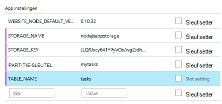

<properties
    pageTitle="Node.js web app met behulp van de tabel Azure Service"
    description="Deze zelfstudie leert u hoe u de tabel Azure-service gebruiken voor het opslaan van gegevens van een toepassing Node.js dat wordt gehost in Azure App Service Web Apps."
    tags="azure-portal"
    services="app-service\web, storage"
    documentationCenter="nodejs"
    authors="rmcmurray"
    manager="wpickett"
    editor=""/>

<tags
    ms.service="storage"
    ms.workload="storage"
    ms.tgt_pltfrm="na"
    ms.devlang="nodejs"
    ms.topic="article"
    ms.date="08/11/2016"
    ms.author="robmcm"/>

# Node.js web app met behulp van de tabel Azure Service

## Overzicht

In deze zelfstudie wordt beschreven hoe u service van gegevensbeheer Azure tabel gebruiken om te slaan en toegang tot gegevens in een [knooppunt] application gehost in [Azure App Service](http://go.microsoft.com/fwlink/?LinkId=529714) Web Apps. In deze zelfstudie wordt ervan uitgegaan dat u enige voorafgaande ervaring met knooppunt en [Git].

U leert:

* Het gebruik van npm (knooppunt package manager) op het knooppunt modules installeren

* Het werken met de tabel Azure service

* Het gebruik van de CLI Azure voor het maken van een web app.

Door deze zelfstudie te volgen, bouwt u een eenvoudige web gebaseerde toepassing "taakoverzicht" waarmee maken, ophalen en het uitvoeren van taken. De taken worden opgeslagen in de tabel service.

Hier ziet u de voltooide toepassing:

![Een webpagina met een lege tasklist][node-table-finished]

>[AZURE.NOTE] Als u wilt aan de slag met Azure App-Service voordat u aanmelden voor een account met Azure, gaat u naar de [App-Service probeert](http://go.microsoft.com/fwlink/?LinkId=523751), waar u direct een starter tijdelijk web app in de App-Service maken kunt. Geen creditcard vereist; geen verplichtingen.

## Vereisten

Voordat u de instructies in dit artikel, zorg ervoor dat de volgende programma's:

* [knooppunt] versie 0.10.24 of hoger

* [GIT]

[AZURE.INCLUDE [create-account-and-websites-note](../../includes/create-account-and-websites-note.md)]

## Maak een account voor opslag

Maak een account Azure opslag. De app gebruikt deze account voor het opslaan van de taakitems.

1.  Meld u aan bij de [Azure Portal](https://portal.azure.com/).

2. Klik op het pictogram **Nieuw** op de linkerbenedenhoek van de portal en klik vervolgens op **gegevens- en** > **opslag**. De opslag-account een unieke naam geven en een nieuwe [resourcegroep](../azure-resource-manager/resource-group-overview.md) maken voor het.

    

    Wanneer de opslag-account is gemaakt, de knop **meldingen** knippert groen **SUCCES** en blade opslag-account is geopend om te tonen dat het deel uitmaakt van de nieuwe resourcegroep die u hebt gemaakt.

5. Klik op **Instellingen**in de opslag van de account-blade > **sleutels**. De van primaire toegangssleutel naar het Klembord kopiëren.

    ![Toegangstoets][portal-storage-access-keys]

##Installeren van modules en het genereren van steigers

In dit gedeelte u een nieuw knooppunt toepassing maken en npm module pakketten toevoegen gebruikt. Voor deze toepassing gebruikt u de modules [Express] en [Azure] . De Express-module biedt een kader Model-View-Controller voor knooppunt, terwijl de modules voor Azure biedt connectiviteit met de service van de tabel.

### Express installeren en het genereren van steigers

1. Vanaf de opdrachtregel, maakt u een nieuwe map met de naam **tasklist** en switch naar die map.  

2. Voer de volgende opdracht om de module Express installeren.

        npm install express-generator@4.2.0 -g

    Afhankelijk van het besturingssysteem moet u 'sudo' voordat u de opdracht plaatsen:

        sudo npm install express-generator@4.2.0 -g

    Zoals in het volgende voorbeeld wordt de uitvoer weergegeven:

        express-generator@4.2.0 /usr/local/lib/node_modules/express-generator
        ├── mkdirp@0.3.5
        └── commander@1.3.2 (keypress@0.1.0)

    > [AZURE.NOTE] De "-g" parameter wordt de module globaal geïnstalleerd. Op die manier kunnen we kunt **express** web app steigers zonder te typen in de extra padgegevens te genereren.

4. Wilt de steiger voor de toepassing maken, voert u de opdracht **express** :

        express

    De uitvoer van deze opdracht weergegeven de volgende strekking:

           create : .
           create : ./package.json
           create : ./app.js
           create : ./public
           create : ./public/images
           create : ./routes
           create : ./routes/index.js
           create : ./routes/users.js
           create : ./public/stylesheets
           create : ./public/stylesheets/style.css
           create : ./views
           create : ./views/index.jade
           create : ./views/layout.jade
           create : ./views/error.jade
           create : ./public/javascripts
           create : ./bin
           create : ./bin/www

           install dependencies:
             $ cd . && npm install

           run the app:
             $ DEBUG=my-application ./bin/www

    U hebt nu enkele nieuwe mappen en bestanden in de map **tasklist** .

### Extra modules installeren

Een van de bestanden die **express** maakt is **package.json**. Dit bestand bevat een overzicht van de module afhankelijkheden. Later, wanneer u de toepassing op het Web Apps van App-Service implementeert, bepaalt dit bestand welke modules moeten worden geïnstalleerd op Azure.

Voer de volgende opdracht om de modules beschreven in het bestand **package.json** te installeren vanaf de opdrachtregel. Wellicht moet u 'sudo' te gebruiken.

    npm install

De uitvoer van deze opdracht weergegeven de volgende strekking:

    debug@0.7.4 node_modules\debug

    cookie-parser@1.0.1 node_modules\cookie-parser
    ├── cookie-signature@1.0.3
    └── cookie@0.1.0

    [...]

Voer de volgende opdracht om de [azure], [knooppunt uuid], [nconf] en [asynchrone] modules te installeren:

    npm install azure-storage node-uuid async nconf --save

De **--Opslaan** vlag posten voor deze modules toegevoegd aan het bestand **package.json** .

De uitvoer van deze opdracht weergegeven de volgende strekking:

    async@0.9.0 node_modules\async

    node-uuid@1.4.1 node_modules\node-uuid

    nconf@0.6.9 node_modules\nconf
    ├── ini@1.2.1
    ├── async@0.2.9
    └── optimist@0.6.0 (wordwrap@0.0.2, minimist@0.0.10)

    [...]

## De toepassing maken

Nu we gaan de toepassing te bouwen.

### Een model maken

Een *model* is een object dat de gegevens in uw toepassing vertegenwoordigt. Voor de toepassing is het enige model een taakobject een item in de takenlijst vertegenwoordigt. Taken zijn de volgende velden:

- PartitionKey
- RowKey
- naam (tekenreeks)
- categorie (tekenreeks)
- voltooide (Boolean)

**PartitionKey** en **RowKey** worden gebruikt door de Service tabel als tabelsleutels. Zie [Wat zijn de gegevens van tabel servicemodel](https://msdn.microsoft.com/library/azure/dd179338.aspx)voor meer informatie.

1. Maak een nieuwe map met de naam **modellen**in de directory **tasklist** .

2. Maak een nieuw bestand met de naam **task.js**in de map **modellen** . Dit bestand bevat het model voor de taken die door uw toepassing zijn gemaakt.

3. Voeg de volgende code als u verwijst naar de vereiste bibliotheken aan het begin van het bestand **task.js** :

        var azure = require('azure-storage');
        var uuid = require('node-uuid');
        var entityGen = azure.TableUtilities.entityGenerator;

4. Voeg de volgende code om te definiëren en exporteren het Task-object. Dit object is verantwoordelijk voor het maken van verbinding met de tabel.

        module.exports = Task;

        function Task(storageClient, tableName, partitionKey) {
          this.storageClient = storageClient;
          this.tableName = tableName;
          this.partitionKey = partitionKey;
          this.storageClient.createTableIfNotExists(tableName, function tableCreated(error) {
            if(error) {
              throw error;
            }
          });
        };

5. Voeg de volgende code om aanvullende methoden voor het Task-object definiëren waardoor interacties met de gegevens die zijn opgeslagen in de tabel:

        Task.prototype = {
          find: function(query, callback) {
            self = this;
            self.storageClient.queryEntities(this.tableName, query, null, function entitiesQueried(error, result) {
              if(error) {
                callback(error);
              } else {
                callback(null, result.entries);
              }
            });
          },

          addItem: function(item, callback) {
            self = this;
            // use entityGenerator to set types
            // NOTE: RowKey must be a string type, even though
            // it contains a GUID in this example.
            var itemDescriptor = {
              PartitionKey: entityGen.String(self.partitionKey),
              RowKey: entityGen.String(uuid()),
              name: entityGen.String(item.name),
              category: entityGen.String(item.category),
              completed: entityGen.Boolean(false)
            };
            self.storageClient.insertEntity(self.tableName, itemDescriptor, function entityInserted(error) {
              if(error){  
                callback(error);
              }
              callback(null);
            });
          },

          updateItem: function(rKey, callback) {
            self = this;
            self.storageClient.retrieveEntity(self.tableName, self.partitionKey, rKey, function entityQueried(error, entity) {
              if(error) {
                callback(error);
              }
              entity.completed._ = true;
              self.storageClient.updateEntity(self.tableName, entity, function entityUpdated(error) {
                if(error) {
                  callback(error);
                }
                callback(null);
              });
            });
          }
        }

6. Opslaan en sluiten van het bestand **task.js** .

### Een domeincontroller maken

Een *controller* HTTP-verzoeken verwerkt en wordt het HTML-antwoord.

1. Maak een nieuw bestand met de naam **tasklist.js** in de map **tasklist/routes** en openen in een teksteditor.

2. De volgende code toevoegen aan de **tasklist.js**. Dit laadt de azure en asynchrone modules, die worden gebruikt door **tasklist.js**. Hiermee definieert u ook de functie **TaskList** , die een exemplaar van het **Task** -object dat we eerder gedefinieerd wordt doorgegeven:

        var azure = require('azure-storage');
        var async = require('async');

        module.exports = TaskList;

3. Definieer een **TaskList** -object.

        function TaskList(task) {
          this.task = task;
        }

4. De volgende methoden toevoegen aan **TaskList**:

        TaskList.prototype = {
          showTasks: function(req, res) {
            self = this;
            var query = new azure.TableQuery()
              .where('completed eq ?', false);
            self.task.find(query, function itemsFound(error, items) {
              res.render('index',{title: 'My ToDo List ', tasks: items});
            });
          },

          addTask: function(req,res) {
            var self = this;
            var item = req.body.item;
            self.task.addItem(item, function itemAdded(error) {
              if(error) {
                throw error;
              }
              res.redirect('/');
            });
          },

          completeTask: function(req,res) {
            var self = this;
            var completedTasks = Object.keys(req.body);
            async.forEach(completedTasks, function taskIterator(completedTask, callback) {
              self.task.updateItem(completedTask, function itemsUpdated(error) {
                if(error){
                  callback(error);
                } else {
                  callback(null);
                }
              });
            }, function goHome(error){
              if(error) {
                throw error;
              } else {
               res.redirect('/');
              }
            });
          }
        }

### App.js wijzigen

1. Open het bestand **app.js** in de map **tasklist** . Dit bestand is eerder gemaakt door de **uitdrukkelijke** opdracht uit te voeren.

2. Voeg de volgende de azure module te laden, de tabelnaam en partitiesleutel instellen en de opslag referenties die worden gebruikt door in het volgende voorbeeld wordt ingesteld aan het begin van het bestand:

        var azure = require('azure-storage');
        var nconf = require('nconf');
        nconf.env()
             .file({ file: 'config.json', search: true });
        var tableName = nconf.get("TABLE_NAME");
        var partitionKey = nconf.get("PARTITION_KEY");
        var accountName = nconf.get("STORAGE_NAME");
        var accountKey = nconf.get("STORAGE_KEY");

    > [AZURE.NOTE] nconf laadt de configuratiewaarden van omgevingsvariabelen of het bestand **config.json** , dat we later gaan maken.

3. Schuif in het bestand app.js naar waar u de volgende regel ziet:

        app.use('/', routes);
        app.use('/users', users);

    De bovenstaande regels vervangen door de onderstaande code. Dit wordt een exemplaar van de <strong>taak</strong> met een verbinding met uw account opslag initialiseren. Dit wordt doorgegeven aan de <strong>TaskList</strong>, die gebruiken zal om te communiceren met de service van de tabel:

        var TaskList = require('./routes/tasklist');
        var Task = require('./models/task');
        var task = new Task(azure.createTableService(accountName, accountKey), tableName, partitionKey);
        var taskList = new TaskList(task);

        app.get('/', taskList.showTasks.bind(taskList));
        app.post('/addtask', taskList.addTask.bind(taskList));
        app.post('/completetask', taskList.completeTask.bind(taskList));

4. Sla het bestand **app.js** .

### De weergave van de index wijzigen

1. Open het bestand **tasklist/views/index.jade** in een teksteditor.

2. Vervang de gehele inhoud van het bestand met de volgende code. Hiermee definieert u een weergave die bestaande taken worden weergegeven en bevat een formulier voor het toevoegen van nieuwe taken en bestaande markeren als voltooid.

        extends layout

        block content
          h1= title
          br

          form(action="/completetask", method="post")
            table.table.table-striped.table-bordered
              tr
                td Name
                td Category
                td Date
                td Complete
              if (typeof tasks === "undefined")
                tr
                  td
              else
                each task in tasks
                  tr
                    td #{task.name._}
                    td #{task.category._}
                    - var day   = task.Timestamp._.getDate();
                    - var month = task.Timestamp._.getMonth() + 1;
                    - var year  = task.Timestamp._.getFullYear();
                    td #{month + "/" + day + "/" + year}
                    td
                      input(type="checkbox", name="#{task.RowKey._}", value="#{!task.completed._}", checked=task.completed._)
            button.btn(type="submit") Update tasks
          hr
          form.well(action="/addtask", method="post")
            label Item Name:
            input(name="item[name]", type="textbox")
            label Item Category:
            input(name="item[category]", type="textbox")
            br
            button.btn(type="submit") Add item

3. Opslaan en sluiten **index.jade** bestand.

### De algemene lay-out wijzigen

Het bestand **layout.jade** in de map **weergaven** is een algemene sjabloon voor andere bestanden **.jade** . In deze stap wijzigt u het gebruik van [Twitter Bootstrap](https://github.com/twbs/bootstrap), namelijk een toolkit waarmee u gemakkelijk een leuk uitziende web app ontwerpen.

Downloaden en uitpakken van de bestanden voor [Twitter Bootstrap](http://getbootstrap.com/). Kopieer het bestand **bootstrap.min.css** van de Bootstrap **css** map naar de map **openbaar/stylesheets** van uw toepassing.

**Layout.jade** openen vanuit de map **weergaven** en de gehele inhoud vervangen door de volgende:

    doctype html
    html
      head
        title= title
        link(rel='stylesheet', href='/stylesheets/bootstrap.min.css')
        link(rel='stylesheet', href='/stylesheets/style.css')
      body.app
        nav.navbar.navbar-default
          div.navbar-header
          a.navbar-brand(href='/') My Tasks
        block content

### Een configuratiebestand maken

Als u wilt uitvoeren de app lokaal, plaatst we Azure opslag referenties in een configuratiebestand. Maak een bestand met de naam * *config.json* *met de volgende JSON:

    {
        "STORAGE_NAME": "<storage account name>",
        "STORAGE_KEY": "<storage access key>",
        "PARTITION_KEY": "mytasks",
        "TABLE_NAME": "tasks"
    }

**Opslag naam** vervangen door de naam van de account die u eerder hebt gemaakt voor opslag en **opslag toegangstoets** vervangen door de primaire toegangstoets voor uw opslag-account. Bijvoorbeeld:

    {
        "STORAGE_NAME": "nodejsappstorage",
        "STORAGE_KEY": "KG0oDd..."
        "PARTITION_KEY": "mytasks",
        "TABLE_NAME": "tasks"
    }

Sla dit bestand *één mapniveau hoger* dan de map **tasklist** , als volgt:

    parent/
      |-- config.json
      |-- tasklist/

De reden hiervoor is om te voorkomen dat het config-bestand controleren in het besturingselement, waar kan worden openbare. Wanneer we de app op Azure implementeren, we omgevingsvariabelen gebruiken in plaats van een configuratiebestand.

## De toepassing lokaal uitvoeren

Als u wilt testen van de toepassing op uw lokale computer, moet u de volgende stappen uitvoeren:

1. Wijzigen de **tasklist** directory mappen vanaf de opdrachtregel.

2. Gebruik de volgende opdracht om de toepassing lokaal te starten:

        npm start

3. Open een webbrowser en Ga naar http://127.0.0.1:3000.

    Een pagina met de volgende strekking wordt weergegeven.

    ![Een webpagina met een lege tasklist][node-table-finished]

4. U maakt een nieuw taakitem, een naam en een categorie en klik op **Item toevoegen**. 

6. Als u een taak als voltooid markeert, **voltooid** en klik op **Taken bijwerken**.

    ![Een afbeelding van het nieuwe item in de lijst met taken][node-table-list-items]

Hoewel de toepassing lokaal wordt uitgevoerd, wordt het opslaan van de gegevens in de tabel Azure service.

## Uw Azure-toepassing implementeren

De stappen in deze sectie de Azure opdrachtregelprogramma's gebruiken voor het maken van een nieuwe web app in App-Service en vervolgens Git gebruiken voor de implementatie van uw toepassing. Als u deze stappen uitvoert, moet u een Azure-abonnement hebben.

> [AZURE.NOTE] Deze stappen kunnen ook worden uitgevoerd met behulp van de [Portal Azure](https://portal.azure.com/). Zie [bouwen en implementeren van een Node.js web app in Azure App-Service].
>
> Als dit de eerste web app die u hebt gemaakt, moet u de Azure Portal gebruiken voor de implementatie van deze toepassing.

Om te beginnen de [Azure CLI] te installeren door de volgende opdracht vanaf de opdrachtregel:

    npm install azure-cli -g

### Publicatie-instellingen importeren

In deze stap wordt een bestand met informatie over uw abonnement gedownload.

1. Voer de volgende opdracht:

        azure account download

    Met deze opdracht wordt een browser gestart en gaat u naar de downloadpagina. Als u wordt gevraagd, meld u aan met de account die is gekoppeld aan uw abonnement op Azure.

    <!-- ![The download page][download-publishing-settings] -->

    Downloaden van het bestand wordt automatisch begonnen met; Als dit niet het geval is, kunt u de koppeling aan het begin van de pagina handmatig het bestand te downloaden. Sla het bestand op en noteer het pad naar het bestand.

2. Voer de volgende opdracht om de instellingen te importeren:

        azure account import <path-to-file>

    Geef het pad en de naam van het gedownloade instellingenbestand publiceren in de vorige stap.

3. Nadat de instellingen zijn geïmporteerd, verwijdert u het instellingenbestand publiceren. Het is niet meer nodig en bevat vertrouwelijke informatie omtrent uw abonnement Azure.

### Maken van een web app App-Service.

1. Wijzigen de **tasklist** directory mappen vanaf de opdrachtregel.

2. Gebruik de volgende opdracht maakt u een nieuw web app.

        azure site create --git

    U wordt gevraagd voor de web app naam en locatie. Geef een unieke naam en selecteer dezelfde geografische locatie als uw account Azure opslag.

    De `--git` parameter maakt een Git repository op Azure voor dit web app. Het initialiseert een Git repository in de huidige map ook als geen bestaat en u een [Git remote] met de naam 'azure', dat wordt gebruikt voegt voor het publiceren van de toepassing op Azure. Ten slotte wordt een **web.config** -bestand instellingen waarmee Azure hosttoepassingen knooppunt bevat gemaakt. Als u geen waarde opgeeft de `--git` parameter, maar de map bevat een Git repository, de opdracht wordt nog steeds maken 'azure' RAS.

    Nadat deze opdracht is voltooid, ziet u uitvoer van de volgende strekking. Houd er rekening mee dat de regel die begint met het **Website gemaakt op** de URL van de web app bevat.

        info:   Executing command site create
        help:   Need a site name
        Name: TableTasklist
        info:   Using location southcentraluswebspace
        info:   Executing `git init`
        info:   Creating default .gitignore file
        info:   Creating a new web site
        info:   Created web site at  tabletasklist.azurewebsites.net
        info:   Initializing repository
        info:   Repository initialized
        info:   Executing `git remote add azure https://username@tabletasklist.azurewebsites.net/TableTasklist.git`
        info:   site create command OK

    > [AZURE.NOTE] Als dit de eerste App Service web app voor uw abonnement, wordt u gevraagd de Azure Portal gebruiken voor het maken van de web app. Zie voor meer informatie, [bouwen en implementeren van een Node.js web app in Azure App-Service].

### Omgevingsvariabelen instellen

In deze stap voegt u omgevingsvariabelen in de configuratie van uw web app op Azure.
Voer de volgende vanaf de opdrachtregel:

    azure site appsetting add
        STORAGE_NAME=<storage account name>;STORAGE_KEY=<storage access key>;PARTITION_KEY=mytasks;TABLE_NAME=tasks

Vervangen **<storage account name>** rekening met de naam van de opslag die u eerder hebt gemaakt en de plaats van **<storage access key>** met de primaire toegangstoets voor uw opslag-account. (Gebruik dezelfde waarden als het bestand config.json dat u eerder hebt gemaakt.)

Ook kunt u omgevingsvariabelen instellen in de [Azure Portal](https://portal.azure.com/):

1.  De web-app blade openen door te klikken op **Bladeren** > **Web Apps** > de naam van uw web app.

1.  Klik op **Alle instellingen**in uw webtoepassing blade, > **Toepassingsinstellingen**.

    <!--  -->

1.  Ga naar de sectie **Instellingen voor toepassing** en voeg de sleutel/waarde-paren.

    

1. Klik op **Opslaan**.

### Publiceer de toepassing

Als u wilt publiceren in de app, de codebestanden naar Git commit en vervolgens duw azure/model.

1. Stel uw referenties voor de implementatie.

        azure site deployment user set <name> <password>

2. Toevoegen en het doorvoeren van de toepassingsbestanden.

        git add .
        git commit -m "adding files"

3. De commit push App Service web App:

        git push azure master

    **Master** als de target-structuur gebruiken. Aan het einde van de implementatie van weergegeven een overzicht van de volgende strekking:

        To https://username@tabletasklist.azurewebsites.net/TableTasklist.git
         * [new branch]      master -> master

4. Als de push-bewerking is voltooid, gaat u naar de URL van het web app die eerder is geretourneerd door de `azure create site` de opdracht om de toepassing weer te geven.

## Volgende stappen

Terwijl u de stappen in dit artikel wordt beschreven met behulp van de tabel Service informatie op te slaan, kunt u ook [MongoDB](https://mlab.com/azure/). 

## Aanvullende bronnen

[Azure CLI]

## Wat er veranderd
* Zie voor een handleiding voor het wijzigen van Websites met App-Service: [Azure App Service en de Impact op de bestaande Azure Services](http://go.microsoft.com/fwlink/?LinkId=529714)

<!-- URLs -->

[Bouwen en implementeren van een Node.js in Azure App Service web app]: web-sites-nodejs-develop-deploy-mac.md
[Azure Developer Center]: /develop/nodejs/

[knooppunt]: http://nodejs.org
[GIT]: http://git-scm.com
[Express]: http://expressjs.com
[for free]: http://windowsazure.com
[GIT remote]: http://git-scm.com/docs/git-remote

[Azure CLI]: ../xplat-cli-install.md

[Azure]: https://github.com/Azure/azure-sdk-for-node
[knooppunt-uuid]: https://www.npmjs.com/package/node-uuid
[nconf]: https://www.npmjs.com/package/nconf
[asynchrone]: https://www.npmjs.com/package/async

[Azure Portal]: https://portal.azure.com

[Create and deploy a Node.js application to an Azure Web Site]: web-sites-nodejs-develop-deploy-mac.md
 
<!-- Image References -->

[node-table-finished]: ./media/storage-nodejs-use-table-storage-web-site/table_todo_empty.png
[node-table-list-items]: ./media/storage-nodejs-use-table-storage-web-site/table_todo_list.png
[download-publishing-settings]: ./media/storage-nodejs-use-table-storage-web-site/azure-account-download-cli.png
[portal-new]: ./media/storage-nodejs-use-table-storage-web-site/plus-new.png
[portal-storage-account]: ./media/storage-nodejs-use-table-storage-web-site/new-storage.png
[portal-quick-create-storage]: ./media/storage-nodejs-use-table-storage-web-site/quick-storage.png
[portal-storage-access-keys]: ./media/storage-nodejs-use-table-storage-web-site/manage-access-keys.png
[go-to-dashboard]: ./media/storage-nodejs-use-table-storage-web-site/go_to_dashboard.png
[web-configure]: ./media/storage-nodejs-use-table-storage-web-site/sql-task-configure.png
[app-settings-save]: ./media/storage-nodejs-use-table-storage-web-site/savebutton.png
[app-settings]: ./media/storage-nodejs-use-table-storage-web-site/storage-tasks-appsettings.png
