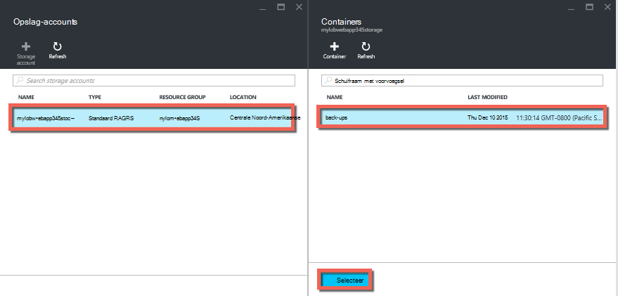
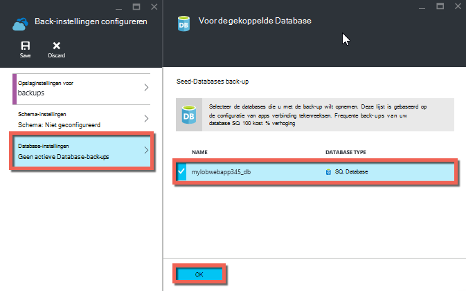
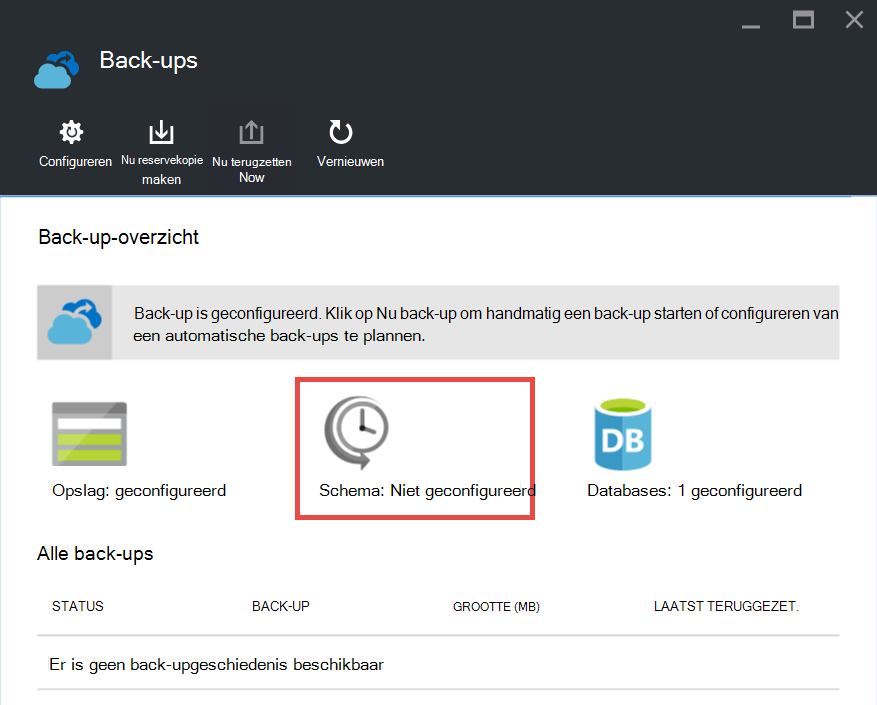

<properties 
    pageTitle="Back-up van uw app in Azure" 
    description="Informatie over het maken van back-ups van uw toepassingen in Azure App-Service." 
    services="app-service" 
    documentationCenter="" 
    authors="cephalin" 
    manager="wpickett" 
    editor="jimbe"/>

<tags 
    ms.service="app-service" 
    ms.workload="na" 
    ms.tgt_pltfrm="na" 
    ms.devlang="na" 
    ms.topic="article" 
    ms.date="07/06/2016" 
    ms.author="cephalin"/>

# Back-up van uw app in Azure

De functie back-up en terugzetten in [Azure App-Service](../app-service/app-service-value-prop-what-is.md) kunt u eenvoudig app back-ups maken, handmatig of automatisch. U kunt uw app terugzetten in een vorige staat of een nieuwe toepassing op basis van uw oorspronkelijke app back-ups maken. 

Voor meer informatie over een app van back-up terugzetten Zie [terugzetten van een app in Azure](web-sites-restore.md).

## Wat met deze eigenschap wordt een back-up 
App-Service kan back-up van de volgende informatie:

* App-configuratie
* Inhoud van bestand
* Alle Azure SQL-Databases of Azure MySQL (ClearDB)-databases die zijn verbonden met uw app (kunt u kiezen welke u wilt opnemen in de back-up)

Deze gegevens back-up de Azure opslag account en de container die u opgeeft. 

> [AZURE.NOTE] Elke back-up is een off line kopie van uw app, niet een incrementele update.

## Vereisten en beperkingen

* De functie back-up en terugzetten is het abonnement App in de **standaard** laag of hoger vereist. Zie [schalen in Azure een app](web-sites-scale.md)voor meer informatie over het schalen van uw serviceplan App gebruik van een hoger niveau. Opmerking dat **Premium** laag kan een groter aantal dagelijkse back-ups dan **standaard** laag.
* U moet een Azure opslag- en container in het abonnement hetzelfde als de toepassing die u back wilt-up. Zie de [koppelingen](#moreaboutstorage) aan het einde van dit artikel voor meer informatie over Azure opslag rekeningen.
* Back-ups kunnen worden tot 10GB app en database-inhoud. U krijgt een fout als de back-up groter is dan deze limiet. 

## Een handmatige back-up maken

2. Ga naar blade van uw app, selecteer achtereenvolgens **Instellingen**en **back-ups**in [Azure Portal](https://portal.azure.com). De blade **back-ups** worden weergegeven.
    
    ![Back-ups van pagina][ChooseBackupsPage]

    >[AZURE.NOTE]Als u onderstaand bericht ziet, klikt u op het upgraden van uw serviceplan App voordat u verder kunt gaan met de back-ups.
Zie [schalen in Azure een app](web-sites-scale.md) voor meer informatie.  
    >

3. Klik in de blade **back-ups** op **opslag: niet geconfigureerd** een opslag-account configureren.

    ![Opslag account kiezen][ChooseStorageAccount]
    
4. Bestemming voor de reservekopie kiezen door het selecteren van een **Opslag** - en **Container**. De opslag-account moet deel uitmaken van het abonnement hetzelfde als de toepassing die u back wilt-up. Als u wilt, kunt u een nieuwe account voor opslag of een nieuwe container in de respectieve blades. Wanneer u klaar bent, klikt u op **selecteren**.
    
    
    
5. Klik op **Database-instellingen**in de blade **Back-up instellingen configureren** die nog geopend blijft, selecteer de databases die u wilt opnemen in de back-ups (SQL-database of MySQL) en klik op **OK**.  

    

    > [AZURE.NOTE]  Voor een database in deze lijst wordt weergegeven, moet de verbindingsreeks in de sectie **Connection strings** van de bladeserver **Toepassingsinstellingen** voor uw app bestaan.

6. Klik op **Opslaan**in het blad **Back-up-instellingen configureren** .  

7. Klik op **Nu back-up**op de opdrachtbalk van de bladeserver **back-ups** .
    
    ![BackUpNow-knop][BackUpNow]
    
    U ziet een voortgangsbericht tijdens het back-upproces.

Nadat u een opslag- en container voor back-ups hebt geconfigureerd, kunt u een handmatige back-up op elk gewenst moment.  

## Automatische back-ups configureren

1. Klik in de blade **back-ups** op **planning: niet**. 

    
    
1. Op het blad **Instellingen back-up schema** **Geplande back-** ingesteld op **op**, en vervolgens het back-upschema naar wens configureren en klik op **OK**.
    
    ![Automatische back-ups][SetAutomatedBackupOn]
    
4. In de blade **-Back-instellingen configureren** die nog geopend blijft, klikt u op **Instellingen voor opslag**, en kies vervolgens bestemming voor de reservekopie op een **Opslag** - en **Container**selecteren. De opslag-account moet deel uitmaken van het abonnement hetzelfde als de toepassing die u back wilt-up. Als u wilt, kunt u een nieuwe account voor opslag of een nieuwe container in de respectieve blades. Wanneer u klaar bent, klikt u op **selecteren**.
    
    
    
5. Klik op **Database-instellingen**in de blade **-Back-up instellingen configureren** , selecteert u de databases die u wilt opnemen in de back-ups (SQL-database of MySQL) en klik op **OK**.  

    

    > [AZURE.NOTE]  Voor een database in deze lijst wordt weergegeven, moet de verbindingsreeks in de sectie **Connection strings** van de bladeserver **Toepassingsinstellingen** voor uw app bestaan.

6. Klik op **Opslaan**in het blad **Back-up-instellingen configureren** .  

## Back-up slechts een deel van uw app

Soms wilt u geen back-up van alles op uw app. Hier volgen enkele voorbeelden:

-   U [set wekelijkse back-ups](web-sites-backup.md#configure-automated-backups) van uw app met statische inhoud die nooit, zoals oude blogberichten of afbeeldingen verandert.
-   Uw app heeft meer dan 10GB inhoud (het maximale bedrag dat kunt u een back-up op een moment).
-   U wilt een back-up van de logboekbestanden.

Gedeeltelijke back-ups kunt u precies welke bestanden u een reservekopie wilt maken.

### Sluit bestanden uit de back-up

Als u wilt uitsluiten van bestanden en mappen van de back-ups, maken een `_backup.filter` -bestand in de map D:\home\site\wwwroot van uw app en geef de lijst met bestanden en mappen die u wilt uitsluiten er. Er is een eenvoudige manier toegang krijgt tot deze via de [Console van de Kudu](https://github.com/projectkudu/kudu/wiki/Kudu-console). 

Stel dat u hebt een app met logboekbestanden en statische afbeeldingen van afgelopen jaar die nooit gaat wijzigen. U hebt al een volledige back-up van de app die de oude beelden bevat. Nu wilt u een back-up de app elke dag, maar u niet wilt betalen voor het opslaan van logboekbestanden of statische afbeeldingsbestanden nooit wijzigen.

![Map met Logboeken voor][LogsFolder]
![map afbeeldingen][ImagesFolder]
    
De onderstaande stappen tonen hoe u deze bestanden uit de back-up wilt uitsluiten.

1. Ga naar `http://{yourapp}.scm.azurewebsites.net/DebugConsole` en de mappen die u wilt uitsluiten van uw back-ups te identificeren. In dit voorbeeld zou u wilt uitsluiten van de volgende bestanden en mappen weergegeven in de gebruikersinterface die:

        D:\home\site\wwwroot\Logs
        D:\home\LogFiles
        D:\home\site\wwwroot\Images\2013
        D:\home\site\wwwroot\Images\2014
        D:\home\site\wwwroot\Images\brand.png

    [AZURE.NOTE] De laatste regel geeft u zowel personen bestanden als mappen kunt uitsluiten.

2. Maak een bestand met de naam `_backup.filter` en de lijst boven in het bestand plaatsen, maar verwijderen `D:\home`. Een overzicht van een map of bestand per regel. De inhoud van het bestand moet worden:

    \site\wwwroot\Logs \LogFiles \site\wwwroot\Images\2013 \site\wwwroot\Images\2014 \site\wwwroot\Images\brand.PNG

3. Uploaden van dit bestand op de `D:\home\site\wwwroot\` map van uw site via [ftp](web-sites-deploy.md#ftp) of een andere methode. Als u wilt, kunt u het bestand rechtstreeks in `http://{yourapp}.scm.azurewebsites.net/DebugConsole` en de inhoud er in te voegen.

4. Back-ups van de dezelfde manier zou normaal gesproken het, [handmatig](#create-a-manual-backup) of [automatisch](#configure-automated-backups)uitgevoerd.

Nu, alle bestanden en mappen die zijn opgegeven in `_backup.filter` worden uitgesloten van de back-up. In dit voorbeeld wordt de logboekbestanden en afbeeldingsbestanden 2013 en 2014 zal niet langer worden back-up gemaakt en brand.png.

>[AZURE.NOTE] U gedeeltelijke back-ups van uw site op de dezelfde manier als [een normale back-up](web-sites-restore.md)terugzetten. Het herstelproces zal doen.
>
>Wanneer u een volledige back-up is hersteld, wordt alle inhoud op de site met de in de back-up vervangen. Als een bestand op de site, maar niet in de back-up wordt het verwijderd. Maar wanneer een gedeeltelijke back-up wordt teruggezet, alle inhoud die zich in een van de zwarte lijst mappen of een zwarte lijst bestand is ongewijzigd.

## Hoe back-ups worden opgeslagen

Als u een of meer back-ups hebt gemaakt voor uw app, zijn de back-ups op het blad **Containers** van uw account voor opslag, als uw app zichtbaar. Elke back-up bestaat in de opslag-account van een ZIP-bestand met de gegevens van de back-up en een XML-bestand een overzicht van de inhoud van het ZIP-bestand bevat. U kunt unzip en deze bestanden bladeren als u toegang wilt tot uw back-ups zonder daadwerkelijk uitvoeren van een toepassing te herstellen.

De databaseback-up voor de toepassing wordt opgeslagen in de hoofdmap van het ZIP-bestand. Voor een SQL-database is een Bacpac-bestand (zonder extensie) en kunnen worden geïmporteerd. Zie maken van een nieuwe SQL-database op basis van de export Bacpac- [Bacpac-bestand maken van een nieuwe gebruiker-Database importeren](http://technet.microsoft.com/library/hh710052.aspx).

> [AZURE.WARNING] Wijzigen van de bestanden in de container **websitebackups** kan leiden tot de back-up worden ongeldig en bijgevolg niet-terug te zetten.

## Volgende stappen
Zie voor informatie over een app terugzetten vanaf een back-up [herstellen van een app in Azure](web-sites-restore.md). Ook een back-up en terugzetten App Service apps met REST API (Zie [Overige gebruik een back-up en terugzetten App Service apps](websites-csm-backup.md)).

>[AZURE.NOTE] Als u wilt aan de slag met Azure App-Service voordat u aanmelden voor een account met Azure, gaat u naar de [App-Service probeert](http://go.microsoft.com/fwlink/?LinkId=523751), waar u direct een starter tijdelijk web app in de App-Service maken kunt. Geen creditcard vereist; geen verplichtingen.

<!-- IMAGES -->
[ChooseBackupsPage]: ./media/web-sites-backup/01ChooseBackupsPage.png
[ChooseStorageAccount]: ./media/web-sites-backup/02ChooseStorageAccount.png
[IncludedDatabases]: ./media/web-sites-backup/03IncludedDatabases.png
[BackUpNow]: ./media/web-sites-backup/04BackUpNow.png
[BackupProgress]: ./media/web-sites-backup/05BackupProgress.png
[SetAutomatedBackupOn]: ./media/web-sites-backup/06SetAutomatedBackupOn.png
[Frequency]: ./media/web-sites-backup/07Frequency.png
[StartDate]: ./media/web-sites-backup/08StartDate.png
[StartTime]: ./media/web-sites-backup/09StartTime.png
[SaveIcon]: ./media/web-sites-backup/10SaveIcon.png
[ImagesFolder]: ./media/web-sites-backup/11Images.png
[LogsFolder]: ./media/web-sites-backup/12Logs.png
[GhostUpgradeWarning]: ./media/web-sites-backup/13GhostUpgradeWarning.png
 
