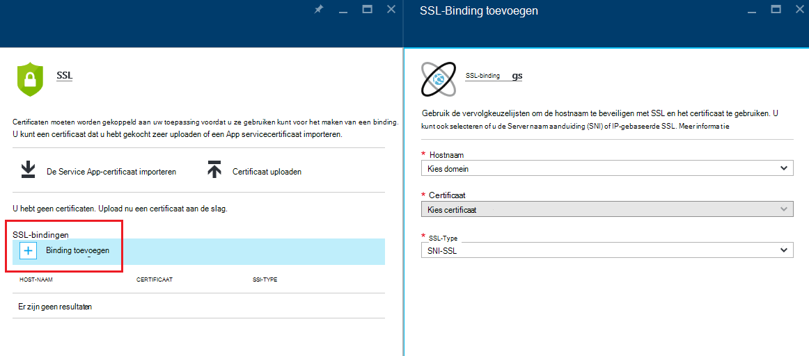
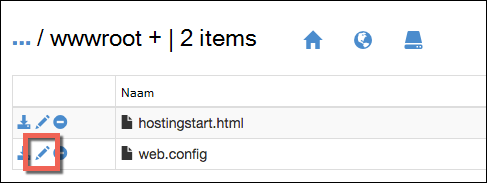

<properties
    pageTitle="Beveiligen van uw app aangepaste domein met HTTPS | Microsoft Azure"
    description="Informatie over hoe veilig de aangepaste domeinnaam voor uw app in Azure App-Service door de binding van een SSL-certificaat configureren. Ook leert u hoe u een SSL-certificaat van meerdere hulpprogramma's."
    services="app-service"
    documentationCenter=".net"
    authors="cephalin"
    manager="wpickett"
    editor="jimbe"
    tags="top-support-issue"/>

<tags
    ms.service="app-service"
    ms.workload="na"
    ms.tgt_pltfrm="na"
    ms.devlang="na"
    ms.topic="article"
    ms.date="08/08/2016"
    ms.author="cephalin"/>

# Beveiligen van uw app aangepaste domein met HTTPS

> [AZURE.SELECTOR]
- [SSL-cert in Azure kopen](web-sites-purchase-ssl-web-site.md)
- [Gebruik SSL-certificaat van elders](web-sites-configure-ssl-certificate.md)

In dit artikel wordt beschreven hoe u HTTPS inschakelen voor een web app, een mobiele app back-end of een API app in [Azure App Service](../app-service/app-service-value-prop-what-is.md) die gebruikmaakt van een aangepast domeinnaam. Ze omvatten alleen server-verificatie. Als u wederzijdse verificatie (met inbegrip van verificatie van de client), Zie [Hoe te configureren TLS wederzijdse verificatie voor App-Service](app-service-web-configure-tls-mutual-auth.md).

Als u wilt beveiligen met HTTPS een app die een aangepaste domeinnaam heeft, kunt u een certificaat voor die domeinnaam toevoegen. Standaard Azure beveiligt de ** \*. azurewebsites.net** wildcard domein met één SSL certificaat, zodat uw clients al toegang heeft tot uw app op * *https://*&lt;appname >*. azurewebsites.net**. Maar als u een aangepast domein te gebruiken, zoals **www.contoso.com contoso.com,**, ****, en ** \*. contoso.com**, die het standaardcertificaat niet beveiligen die. Voorts, net als alle [certificaten met jokerteken](https://casecurity.org/2014/02/26/pros-and-cons-of-single-domain-multi-domain-and-wildcard-certificates/), het standaardcertificaat is niet zo veilig als met behulp van een aangepaste domein en een certificaat voor het aangepaste domein.   

>[AZURE.NOTE] U kunt help opvragen van Azure experts op elk gewenst moment op de [Azure forums](https://azure.microsoft.com/support/forums/). Ga voor de [Ondersteuning van Azure](https://azure.microsoft.com/support/options/) en klik op **Ondersteuning krijgen**voor meer persoonlijke ondersteuning.

## Wat u nodig hebt
Beveiliging van uw aangepaste domeinnaam met HTTPS, kunt u een aangepaste SSL-certificaat koppelt aan aangepaste domein in Azure. Voordat het binden van een aangepaste certificaat, moet u het volgende doen:

- **Het aangepaste domein configureren** - App-Service kunt u alleen een certificaat voor een domeinnaam die al geconfigureerd in uw app toe te voegen. Zie [een aangepaste domeinnaam aan een Azure app toewijzen](web-sites-custom-domain-name.md)voor meer informatie. 
- **Schalen op het fundamentele niveau of hoger** App serviceplannen in lagere prijzen lagen ondersteunen geen aangepaste SSL-certificaten. Zie voor instructies de [schaal van een app in Azure](web-sites-scale.md). 
- **Een SSL-certificaat ophalen** - als u nog geen een, moet u een van een vertrouwde [certificeringsinstantie](http://en.wikipedia.org/wiki/Certificate_authority) (CA). Het certificaat moet voldoen aan de volgende eisen voldoen:

    - Het is ondertekend door een vertrouwde Certificeringsinstantie (geen persoonlijke CA-servers).
    - Het bevat een persoonlijke sleutel.
    - Het is gemaakt voor sleuteluitwisseling en geëxporteerd naar een. PFX-bestand.
    - Een minimum van 2048-bits codering wordt gebruikt.
    - De naam komt overeen met het aangepaste domein dat moet worden beveiligd. Beveiliging van meerdere domeinen met een certificaat, moet u de jokertekennaam van een gebruiken (bijv. ** \*. contoso.com**) of subjectAltName waarden op te geven.
    - Deze wordt samengevoegd met alle **[tussenliggende certificaten](http://en.wikipedia.org/wiki/Intermediate_certificate_authorities)** door de Certificeringsinstantie gebruikt. Anders wordt u mogelijk problemen ondervonden irreproducible interoperabiliteit op bepaalde clients.

        >[AZURE.NOTE] De eenvoudigste manier om een SSL-certificaat dat voldoet aan alle vereisten is         [een in Azure portal direct](web-sites-purchase-ssl-web-site.md)kopen. In dit artikel wordt beschreven hoe u handmatig doen en deze vervolgens binden aan uw aangepaste domein in App-Service.
        >   
        > **Elliptic Curve Cryptography (ECC) certificaten** kunt werken met App-Service, maar buiten het bestek van dit artikel. Werken met uw Certificeringsinstantie op de exacte procedure voor het maken van ECC-certificaten.

## Stap 1. Een SSL-certificaat ophalen

Omdat de verschillende typen SSL certificaat op een andere Prijspunten verstrekt, moet u eerst bepalen welk type SSL-certificaat aan te schaffen. Beveiliging van één domeinnaam (**www.contoso.com**), hoeft u slechts een eenvoudige certificaat. Meerdere domeinnamen te beveiligen (**contoso.com** *en* **www.contoso.com** 
*en* **mail.contoso.com**), moet u een [jokerteken certificaat](http://en.wikipedia.org/wiki/Wildcard_certificate) of een certificaat met een [Alternatieve naam voor onderwerp](http://en.wikipedia.org/wiki/SubjectAltName) (`subjectAltName`).

Als u eenmaal welke SSL-certificaat aan te schaffen weet, kunt u een certificaat ondertekenen Request (CSR) bij een CA indienen. Wanneer u aangevraagde certificaat uit de CA terughalen, genereert u vervolgens een pfx-bestand van het certificaat. U kunt deze stappen met behulp van het hulpprogramma van uw keuze uitvoeren. Hier vindt u instructies voor de algemene hulpprogramma's:

- [Certreq.exe stappen](#bkmk_certreq) - het Windows-hulpprogramma voor het maken van certificaataanvragen. Het is onderdeel van Windows sinds Windows XP of Windows Server 2000.
- [Werk in IIS-beheer](#bkmk_iismgr) - het programma van uw keuze als u al vertrouwd met het bent.
- [OpenSSL-stappen](#bkmk_openssl) - een [open source, cross-platform tool](https://www.openssl.org). Hiermee kunt u een SSL-certificaat ophalen uit een willekeurig platform.
- [subjectAltName stappen met behulp van OpenSSL](#bkmk_subjectaltname) - stappen voor het verkrijgen van `subjectAltName` certificaten.

Als u de instellingen testen in App-Service voordat u koopt een certificaat wilt, kunt u een [zelfondertekend certificaat](https://en.wikipedia.org/wiki/Self-signed_certificate)te genereren. Deze zelfstudie kunt u op twee manieren gegenereerd:

- [Zelf-ondertekend certificaat, Certreq.exe stappen](#bkmk_sscertreq)
- [Zelf-ondertekend certificaat, OpenSSL, stappen](#bkmk_ssopenssl)

### Een certificaat met Certreq.exe

1. Maak een bestand (bijvoorbeeld **myrequest.txt**), en kopieert u de volgende tekst naar het opslaan in een werkmap. Vervang de `<your-domain>` tijdelijke aanduiding met de aangepaste domeinnaam van uw app.

        [NewRequest]
        Subject = "CN=<your-domain>"  ; E.g. "CN=www.contoso.com", or "CN=*.contoso.com" for a wildcard certificate
        Exportable = TRUE
        KeyLength = 2048              ; Required minimum is 2048
        KeySpec = 1
        KeyUsage = 0xA0
        MachineKeySet = True
        ProviderName = "Microsoft RSA SChannel Cryptographic Provider"
        ProviderType = 12
        HashAlgorithm = SHA256

        [EnhancedKeyUsageExtension]
        OID=1.3.6.1.5.5.7.3.1         ; Server Authentication

    Zie de [Certreq-documentatie](https://technet.microsoft.com/library/dn296456.aspx)voor meer informatie over de opties in de CSR en andere beschikbare opties.

4. In een MS-DOS-prompt, `CD` in uw werkmap en de volgende opdracht voor het maken van de Medewerker uitvoeren:

        certreq -new myrequest.txt myrequest.csr

    **myrequest.CSR** is nu gemaakt in de huidige werkmap.

5. **Myrequest.csr** bij een Certificeringsinstantie ophalen van een SSL-certificaat indienen. U het bestand uploaden, of de inhoud van een teksteditor kopiëren in een webformulier.

    Zie voor een lijst van certificeringsinstanties die worden vertrouwd door Microsoft [Microsoft Root Certificate Program vertrouwd: deelnemers][cas].

6. Nadat de CA u heeft gereageerd met een certificaat (. (CER)-bestand opslaan in uw werkmap. Voer de volgende opdracht voor het voltooien van de certificaataanvraag in behandeling.

        certreq -accept -user <certificate-name>.cer

    Met deze opdracht wordt het voltooide certificaat opgeslagen in het Windows-certificaatarchief.

6. Als de Certificeringsinstantie wordt gebruikt voor de tussenliggende certificaten, deze installeren voordat u verdergaat. Ze komen doorgaans als een afzonderlijke download van uw Certificeringsinstantie en in verschillende notaties voor verschillende web servertypen. Selecteer de versie van Microsoft IIS.

    Als u de certificaten hebt gedownload, elk van hen in Windows Verkenner met de rechtermuisknop op en selecteer het  **certificaat installeren**. De standaardwaarden in de **Wizard Certificaat importeren**te gebruiken en doorgaan met het **volgende** selecteren tot het importeren is voltooid.

7. U exporteert uw SSL-certificaat uit het certificaatarchief, drukt u op `Win` + `R` en uitvoeren **certmgr.msc** om Certificaatbeheer te starten. Selecteer **persoonlijke** > **certificaten**. In de kolom **Verleend aan** vindt u een vermelding met de naam van uw aangepaste domein en de Certificeringsinstantie die u gebruikt voor het genereren van het certificaat in de kolom **Verleend door** .

    ![afbeelding van Certificaatbeheer hier invoegen][certmgr]

9. Klik met de rechtermuisknop op het certificaat en selecteer **All Tasks** > **exporteren**. Klik op **volgende**in de **Wizard Certificaat exporteren**en vervolgens selecteert u **Ja, de persoonlijke sleutel exporteren**en klik vervolgens nogmaals op **volgende** .

    ![De persoonlijke sleutel exporteren][certwiz1]

10. Selecteer **Personal Information Exchange - PKCS #12**, **alle certificaten in het certificeringspad indien mogelijk opnemen**en **alle uitgebreide eigenschappen exporteren**. Klik vervolgens op **volgende**.

    ![alle certificaten en uitgebreide eigenschappen][certwiz2]

11. Selecteer **wachtwoord**, typ en Bevestig het wachtwoord. Klik op **volgende**.

    ![een wachtwoord opgeven][certwiz3]

12. Geef een pad en bestandsnaam voor het geëxporteerde certificaat met de extensie **.pfx**. Klik op **volgende** om te voltooien.

    ![Geef een pad][certwiz4]

U bent nu gereed voor de geëxporteerde PFX-bestand uploaden naar App-Service. Zie [stap 2. Uploaden en bind het SSL-certificaat van aangepaste](#bkmk_configuressl).

### Een certificaat met de IIS-beheer

1. Genereer een CSR met IIS-beheer naar de Certificeringsinstantie te verzenden. Zie voor meer informatie over het genereren van een medewerker van de Klantenservice, [vraag een servercertificaat van Internet (IIS 7)][iiscsr].

3. Dien uw Medewerker bij een Certificeringsinstantie ophalen van een SSL-certificaat. Zie voor een lijst van certificeringsinstanties die worden vertrouwd door Microsoft [Microsoft Root Certificate Program vertrouwd: deelnemers][cas].

3. De CSR met het certificaat dat de Certificeringsinstantie wordt verzonden naar u terug te voltooien. Zie voor meer informatie over het invullen van de CSR [Installeer een servercertificaat van Internet (IIS 7)][installcertiis].

4. Als de Certificeringsinstantie wordt gebruikt voor de tussenliggende certificaten, deze installeren voordat u verdergaat. Ze komen doorgaans als een afzonderlijke download van uw Certificeringsinstantie en in verschillende notaties voor verschillende web servertypen. Selecteer de versie van Microsoft IIS.

    Als u de certificaten hebt gedownload, elk van hen in Windows Verkenner met de rechtermuisknop op en selecteer het **certificaat installeren**. 
    De standaardwaarden in de **Wizard Certificaat importeren**te gebruiken en doorgaan met het **volgende** selecteren tot het importeren is voltooid.

4. SSL-certificaat exporteren vanuit IIS-beheer. Zie voor meer informatie over het exporteren van het certificaat [exporteren van een certificaat (IIS 7)][exportcertiis]. 

    >[AZURE.IMPORTANT] Controleer in de **Wizard Certificaat exporteren**, selecteert u **Ja, de persoonlijke sleutel exporteren**  
    >
    >![De persoonlijke sleutel exporteren][certwiz1]  
    >
    > en ook Selecteer **Personal Information Exchange - PKCS #12**, **alle certificaten in het certificeringspad indien mogelijk opnemen**en     **alle uitgebreide eigenschappen exporteren**.
    >
    >![alle certificaten en uitgebreide eigenschappen][certwiz2]

U bent nu gereed voor de geëxporteerde PFX-bestand uploaden naar App-Service. Zie [stap 2. Uploaden en bind het SSL-certificaat van aangepaste](#bkmk_configuressl).

### Een certificaat met behulp van OpenSSL

1. In een opdrachtregel terminal `CD` genereren in een werkmap een persoonlijke sleutel en een CSR met de volgende opdracht:

        openssl req -sha256 -new -nodes -keyout myserver.key -out server.csr -newkey rsa:2048

2. Wanneer dat wordt gevraagd, voert u de juiste informatie. Bijvoorbeeld:

        Country Name (2 letter code)
        State or Province Name (full name) []: Washington
        Locality Name (eg, city) []: Redmond
        Organization Name (eg, company) []: Microsoft
        Organizational Unit Name (eg, section) []: Azure
        Common Name (eg, YOUR name) []: www.microsoft.com
        Email Address []:

        Please enter the following 'extra' attributes to be sent with your certificate request

        A challenge password []:

    Wanneer u klaar bent, moet u twee bestanden hebt in uw werkmap: **myserver.key** en **server.csr**. 
    De **server.csr** bevat de CSR en u **myserver.key** later nodig hebt.

3. Dien uw Medewerker bij een Certificeringsinstantie ophalen van een SSL-certificaat. Zie voor een lijst van certificeringsinstanties die worden vertrouwd door Microsoft [Microsoft Root Certificate Program vertrouwd: deelnemers][cas].

4. Wanneer de Certificeringsinstantie u het aangevraagde certificaat stuurt, kunt u deze naar een bestand genaamd **myserver.crt** in uw werkmap opslaan. Als uw CA in een tekstindeling aanbiedt, kopieert u de inhoud naar de **myserver.crt** in een teksteditor en sla het. Het bestand ziet er als volgt uit:

        -----BEGIN CERTIFICATE-----
        MIIDJDCCAgwCCQCpCY4o1LBQuzANBgkqhkiG9w0BAQUFADBUMQswCQYDVQQGEwJV
        UzELMAkGA1UECBMCV0ExEDAOBgNVBAcTB1JlZG1vbmQxEDAOBgNVBAsTB0NvbnRv
        c28xFDASBgNVBAMTC2NvbnRvc28uY29tMB4XDTE0MDExNjE1MzIyM1oXDTE1MDEx
        NjE1MzIyM1owVDELMAkGA1UEBhMCVVMxCzAJBgNVBAgTAldBMRAwDgYDVQQHEwdS
        ZWRtb25kMRAwDgYDVQQLEwdDb250b3NvMRQwEgYDVQQDEwtjb250b3NvLmNvbTCC
        ASIwDQYJKoZIhvcNAQEBBQADggEPADCCAQoCggEBAN96hBX5EDgULtWkCRK7DMM3
        enae1LT9fXqGlbA7ScFvFivGvOLEqEPD//eLGsf15OYHFOQHK1hwgyfXa9sEDPMT
        3AsF3iWyF7FiEoR/qV6LdKjeQicJ2cXjGwf3G5vPoIaYifI5r0lhgOUqBxzaBDZ4
        xMgCh2yv7NavI17BHlWyQo90gS2X5glYGRhzY/fGp10BeUEgIs3Se0kQfBQOFUYb
        ktA6802lod5K0OxlQy4Oc8kfxTDf8AF2SPQ6BL7xxWrNl/Q2DuEEemjuMnLNxmeA
        Ik2+6Z6+WdvJoRxqHhleoL8ftOpWR20ToiZXCPo+fcmLod4ejsG5qjBlztVY4qsC
        AwEAATANBgkqhkiG9w0BAQUFAAOCAQEAVcM9AeeNFv2li69qBZLGDuK0NDHD3zhK
        Y0nDkqucgjE2QKUuvVSPodz8qwHnKoPwnSrTn8CRjW1gFq5qWEO50dGWgyLR8Wy1
        F69DYsEzodG+shv/G+vHJZg9QzutsJTB/Q8OoUCSnQS1PSPZP7RbvDV9b7Gx+gtg
        7kQ55j3A5vOrpI8N9CwdPuimtu6X8Ylw9ejWZsnyy0FMeOPpK3WTkDMxwwGxkU3Y
        lCRTzkv6vnHrlYQxyBLOSafCB1RWinN/slcWSLHADB6R+HeMiVKkFpooT+ghtii1
        A9PdUQIhK9bdaFicXPBYZ6AgNVuGtfwyuS5V6ucm7RE6+qf+QjXNFg==
        -----END CERTIFICATE-----

5. In de opdrachtregel terminal de volgende opdracht voor het exporteren van **myserver.pfx** van **myserver.key** en **myserver.crt**:

        openssl pkcs12 -export -out myserver.pfx -inkey myserver.key -in myserver.crt

    Wanneer dat wordt gevraagd, definieert u een wachtwoord voor de beveiliging van het pfx-bestand.

    > [AZURE.NOTE] Als de Certificeringsinstantie wordt gebruikt voor de tussenliggende certificaten, moet u opnemen met de `-certfile` parameter. Ze komen doorgaans als een afzonderlijke download van uw Certificeringsinstantie en in verschillende notaties voor verschillende web servertypen. Selecteer de versie met de `.pem` extensie.
    >
    > Uw `openssl -export` opdracht ziet er nu het volgende voorbeeld wordt een pfx-bestand met de tussenliggende certificaten van de **tussenliggende cets.pem** -bestand gemaakt:
    >  
    > `openssl pkcs12 -chain -export -out myserver.pfx -inkey myserver.key -in myserver.crt -certfile intermediate-cets.pem`

U bent nu gereed voor de geëxporteerde PFX-bestand uploaden naar App-Service. Zie [stap 2. Uploaden en bind het SSL-certificaat van aangepaste](#bkmk_configuressl).

### Met behulp van OpenSSL SubjectAltName certificaat ophalen

1. Maak een bestand met de naam **sancert.cnf**en kopieer de volgende tekst in het opslaan in een werkmap:

        # -------------- BEGIN custom sancert.cnf -----
        HOME = .
        oid_section = new_oids
        [ new_oids ]
        [ req ]
        default_days = 730
        distinguished_name = req_distinguished_name
        encrypt_key = no
        string_mask = nombstr
        req_extensions = v3_req # Extensions to add to certificate request
        [ req_distinguished_name ]
        countryName = Country Name (2 letter code)
        countryName_default =
        stateOrProvinceName = State or Province Name (full name)
        stateOrProvinceName_default =
        localityName = Locality Name (eg, city)
        localityName_default =
        organizationalUnitName  = Organizational Unit Name (eg, section)
        organizationalUnitName_default  =
        commonName              = Your common name (eg, domain name)
        commonName_default      = www.mydomain.com
        commonName_max = 64
        [ v3_req ]
        subjectAltName=DNS:ftp.mydomain.com,DNS:blog.mydomain.com,DNS:*.mydomain.com
        # -------------- END custom sancert.cnf -----

    In de regel die met begint `subjectAltName`, de waarde vervangen door alle domeinnamen die u wilt beveiligen (in aanvulling op  `commonName`). Bijvoorbeeld:

        subjectAltName=DNS:sales.contoso.com,DNS:support.contoso.com,DNS:fabrikam.com

    U hoeft niet naar een ander veld wijzigen met inbegrip van `commonName`. U wordt gevraagd deze opgeven in de volgende stappen.

1. In een opdrachtregel terminal `CD` in uw werkmap en de volgende opdracht uitvoeren:

        openssl req -sha256 -new -nodes -keyout myserver.key -out server.csr -newkey rsa:2048 -config sancert.cnf

2. Wanneer dat wordt gevraagd, voert u de juiste informatie. Bijvoorbeeld:

        Country Name (2 letter code) []: US
        State or Province Name (full name) []: Washington
        Locality Name (eg, city) []: Redmond
        Organizational Unit Name (eg, section) []: Azure
        Your common name (eg, domain name) []: www.microsoft.com

    Zodra u klaar bent, moet u twee bestanden hebt in uw werkmap: **myserver.key** en **server.csr**. 
    De **server.csr** bevat de CSR en u **myserver.key** later nodig hebt.

3. Dien uw Medewerker bij een Certificeringsinstantie ophalen van een SSL-certificaat. Zie voor een lijst van certificeringsinstanties die worden vertrouwd door Microsoft [Microsoft Root Certificate Program vertrouwd: deelnemers][cas].

4. Nadat de Certificeringsinstantie u het aangevraagde certificaat, opslaan in een bestand stuurt met de naam **myserver.crt**. Als uw CA in een tekstindeling aanbiedt, kopieert u de inhoud naar de **myserver.crt** in een teksteditor en sla het. Het bestand ziet er als volgt uit:

        -----BEGIN CERTIFICATE-----
        MIIDJDCCAgwCCQCpCY4o1LBQuzANBgkqhkiG9w0BAQUFADBUMQswCQYDVQQGEwJV
        UzELMAkGA1UECBMCV0ExEDAOBgNVBAcTB1JlZG1vbmQxEDAOBgNVBAsTB0NvbnRv
        c28xFDASBgNVBAMTC2NvbnRvc28uY29tMB4XDTE0MDExNjE1MzIyM1oXDTE1MDEx
        NjE1MzIyM1owVDELMAkGA1UEBhMCVVMxCzAJBgNVBAgTAldBMRAwDgYDVQQHEwdS
        ZWRtb25kMRAwDgYDVQQLEwdDb250b3NvMRQwEgYDVQQDEwtjb250b3NvLmNvbTCC
        ASIwDQYJKoZIhvcNAQEBBQADggEPADCCAQoCggEBAN96hBX5EDgULtWkCRK7DMM3
        enae1LT9fXqGlbA7ScFvFivGvOLEqEPD//eLGsf15OYHFOQHK1hwgyfXa9sEDPMT
        3AsF3iWyF7FiEoR/qV6LdKjeQicJ2cXjGwf3G5vPoIaYifI5r0lhgOUqBxzaBDZ4
        xMgCh2yv7NavI17BHlWyQo90gS2X5glYGRhzY/fGp10BeUEgIs3Se0kQfBQOFUYb
        ktA6802lod5K0OxlQy4Oc8kfxTDf8AF2SPQ6BL7xxWrNl/Q2DuEEemjuMnLNxmeA
        Ik2+6Z6+WdvJoRxqHhleoL8ftOpWR20ToiZXCPo+fcmLod4ejsG5qjBlztVY4qsC
        AwEAATANBgkqhkiG9w0BAQUFAAOCAQEAVcM9AeeNFv2li69qBZLGDuK0NDHD3zhK
        Y0nDkqucgjE2QKUuvVSPodz8qwHnKoPwnSrTn8CRjW1gFq5qWEO50dGWgyLR8Wy1
        F69DYsEzodG+shv/G+vHJZg9QzutsJTB/Q8OoUCSnQS1PSPZP7RbvDV9b7Gx+gtg
        7kQ55j3A5vOrpI8N9CwdPuimtu6X8Ylw9ejWZsnyy0FMeOPpK3WTkDMxwwGxkU3Y
        lCRTzkv6vnHrlYQxyBLOSafCB1RWinN/slcWSLHADB6R+HeMiVKkFpooT+ghtii1
        A9PdUQIhK9bdaFicXPBYZ6AgNVuGtfwyuS5V6ucm7RE6+qf+QjXNFg==
        -----END CERTIFICATE-----

5. In de opdrachtregel terminal de volgende opdracht voor het exporteren van **myserver.pfx** van **myserver.key** en **myserver.crt**:

        openssl pkcs12 -export -out myserver.pfx -inkey myserver.key -in myserver.crt

    Wanneer dat wordt gevraagd, definieert u een wachtwoord voor de beveiliging van het pfx-bestand.

    > [AZURE.NOTE] Als de Certificeringsinstantie wordt gebruikt voor de tussenliggende certificaten, moet u opnemen met de `-certfile` parameter. Ze komen doorgaans als een afzonderlijke download van uw Certificeringsinstantie en in verschillende notaties voor verschillende web servertypen. Selecteer de versie met de `.pem` extensie).
    >
    > Uw `openssl -export` opdracht ziet er nu het volgende voorbeeld wordt een pfx-bestand met de tussenliggende certificaten van de **tussenliggende cets.pem** -bestand gemaakt:
    >  
    > `openssl pkcs12 -chain -export -out myserver.pfx -inkey myserver.key -in myserver.crt -certfile intermediate-cets.pem`

U bent nu gereed voor de geëxporteerde PFX-bestand uploaden naar App-Service. Zie [stap 2. Uploaden en bind het SSL-certificaat van aangepaste](#bkmk_configuressl).

### Met Certreq.exe zelfondertekende certificaten genereren ###

>[AZURE.IMPORTANT] Zelf-ondertekende certificaten zijn alleen ter test. De meeste browsers retourneren fouten wanneer het bezoeken van een website die beveiligd met een zelfondertekend certificaat. Sommige browsers kunnen zelfs weigeren om naar de site te navigeren. 

1. Maak een tekstbestand (bijvoorbeeld **mycert.txt**), kopieert u de volgende tekst naar het en het bestand opslaan in een werkmap. Vervang de `<your-domain>` tijdelijke aanduiding met de aangepaste domeinnaam van uw app.

        [NewRequest]
        Subject = "CN=<your-domain>"  ; E.g. "CN=www.contoso.com", or "CN=*.contoso.com" for a wildcard certificate
        Exportable = TRUE
        KeyLength = 2048              ; KeyLength can be 2048, 4096, 8192, or 16384 (required minimum is 2048)
        KeySpec = 1
        KeyUsage = 0xA0
        MachineKeySet = True
        ProviderName = "Microsoft RSA SChannel Cryptographic Provider"
        ProviderType = 12
        HashAlgorithm = SHA256
        RequestType = Cert            ; Self-signed certificate
        ValidityPeriod = Years
        ValidityPeriodUnits = 1

        [EnhancedKeyUsageExtension]
        OID=1.3.6.1.5.5.7.3.1         ; Server Authentication

    Belangrijke parameter is `RequestType = Cert`, die aangeeft dat een zelfondertekend certificaat. 
    Zie de [Certreq-documentatie](https://technet.microsoft.com/library/dn296456.aspx)voor meer informatie over de opties in de CSR en andere beschikbare opties.

4. In het opdrachtpromptvenster `CD` aan de werkmap en de volgende opdracht uitvoeren:

        certreq -new mycert.txt mycert.crt
    
    Uw nieuwe zelfondertekende certificaat is nu geïnstalleerd in het certificaatarchief.

7. Als u wilt exporteren van het certificaat uit het certificaatarchief, drukt u op `Win` + `R` en uitvoeren **certmgr.msc** om Certificaatbeheer te starten. Selecteer **persoonlijke** > **certificaten**. In de kolom **Verleend aan** vindt u een vermelding met de naam van uw aangepaste domein en de Certificeringsinstantie die u gebruikt voor het genereren van het certificaat in de kolom **Verleend door** .

    ![afbeelding van Certificaatbeheer hier invoegen][certmgr]

9. Klik met de rechtermuisknop op het certificaat en selecteer **All Tasks** > **exporteren**. Klik op **volgende**in de **Wizard Certificaat exporteren**en vervolgens selecteert u **Ja, de persoonlijke sleutel exporteren**en klik vervolgens nogmaals op **volgende** .

    ![De persoonlijke sleutel exporteren][certwiz1]

10. Selecteer **Personal Information Exchange - PKCS #12**, **alle certificaten in het certificeringspad indien mogelijk opnemen**en **alle uitgebreide eigenschappen exporteren**. Klik vervolgens op **volgende**.

    ![alle certificaten en uitgebreide eigenschappen][certwiz2]

11. Selecteer **wachtwoord**, typ en Bevestig het wachtwoord. Klik op **volgende**.

    ![een wachtwoord opgeven][certwiz3]

12. Geef een pad en bestandsnaam voor het geëxporteerde certificaat met de extensie **.pfx**. Klik op **volgende** om te voltooien.

    ![Geef een pad][certwiz4]

U bent nu gereed voor de geëxporteerde PFX-bestand uploaden naar App-Service. Zie [stap 2. Uploaden en bind het SSL-certificaat van aangepaste](#bkmk_configuressl).

###OpenSSL met zelfondertekende certificaten genereren ###

>[AZURE.IMPORTANT] Zelf-ondertekende certificaten zijn alleen ter test. De meeste browsers retourneren fouten wanneer het bezoeken van een website die beveiligd met een zelfondertekend certificaat. Sommige browsers kunnen zelfs weigeren om naar de site te navigeren. 

1. Maak een tekstbestand met de naam **serverauth.cnf**, en vervolgens de volgende inhoud in het kopiëren en vervolgens opslaan in een werkmap:

        [ req ]
        default_bits           = 2048
        default_keyfile        = privkey.pem
        distinguished_name     = req_distinguished_name
        attributes             = req_attributes
        x509_extensions        = v3_ca

        [ req_distinguished_name ]
        countryName         = Country Name (2 letter code)
        countryName_min         = 2
        countryName_max         = 2
        stateOrProvinceName     = State or Province Name (full name)
        localityName            = Locality Name (eg, city)
        0.organizationName      = Organization Name (eg, company)
        organizationalUnitName      = Organizational Unit Name (eg, section)
        commonName          = Common Name (eg, your app's domain name)
        commonName_max          = 64
        emailAddress            = Email Address
        emailAddress_max        = 40

        [ req_attributes ]
        challengePassword       = A challenge password
        challengePassword_min       = 4
        challengePassword_max       = 20

        [ v3_ca ]
         subjectKeyIdentifier=hash
         authorityKeyIdentifier=keyid:always,issuer:always
         basicConstraints = CA:false
         keyUsage=nonRepudiation, digitalSignature, keyEncipherment
         extendedKeyUsage = serverAuth

2. In een opdrachtregel terminal `CD` in uw werkmap en de volgende opdracht uitvoeren:

        openssl req -sha256 -x509 -nodes -days 365 -newkey rsa:2048 -keyout myserver.key -out myserver.crt -config serverauth.cnf

    Met deze opdracht worden twee bestanden gemaakt: **myserver.crt** (zelf-ondertekend certificaat) en **myserver.key** (de persoonlijke sleutel), op basis van de instellingen in **serverauth.cnf**.

3. Exporteer het certificaat naar een pfx-bestand door de volgende opdracht uit te voeren:

        openssl pkcs12 -export -out myserver.pfx -inkey myserver.key -in myserver.crt

    Wanneer dat wordt gevraagd, definieert u een wachtwoord voor de beveiliging van het pfx-bestand.

U bent nu gereed voor de geëxporteerde PFX-bestand uploaden naar App-Service. Zie [stap 2. Uploaden en bind het SSL-certificaat van aangepaste](#bkmk_configuressl).

## Stap 2. Uploaden en bind het aangepaste SSL-certificaat

Voordat u op verplaatsen, Raadpleeg de sectie [Wat u nodig hebt](#bkmk_domainname) en controleer:

- u hebt een aangepaste domein dat is toegewezen aan uw Azure app
- uw app in de **elementaire** fase of hoger wordt uitgevoerd en
- u hebt een SSL-certificaat voor het aangepaste domein van een Certificeringsinstantie.

1. Open het **in uw browser [Portal Azure.](https://portal.azure.com/)**
2.  Klik op de optie **App Service** aan de linkerkant van de pagina.
3.  Klik op de naam van uw app die u wilt dit certificaat toewijzen. 
4.  Klik in de **Instellingen**op **SSL-certificaten**
5.  Klik op **certificaat uploaden**
6.  Selecteer het pfx-bestand dat u hebt geëxporteerd in [stap 1](#bkmk_getcert) en geef het wachtwoord dat u hebt gemaakt voordat. Klik vervolgens op **uploaden** om het certificaat te uploaden. U ziet nu uw geüploade certificaat terug in de blade **SSL-certificaat** .
7. In de **serverbindingen voor ssl** -afdeling Klik op **Bindingen toevoegen**
8. Gebruik de vervolgkeuzelijsten te selecteren de naam van het domein te beveiligen met SSL en het certificaat te gebruiken in de blade **SSL-Binding toevoegen** . U kunt ook selecteren of u de **[Server naam aanduiding (SNI)](http://en.wikipedia.org/wiki/Server_Name_Indication)** of IP-gebaseerde SSL.

    

       •    IP based SSL associates a certificate with a domain name by mapping the dedicated public IP address of the server to the domain name. This requires each domain name (contoso.com, fabricam.com, etc.) associated with your service to have a dedicated IP address. This is the traditional          method of associating SSL certificates with a web server.
       •    SNI based SSL is an extension to SSL and **[Transport Layer Security](http://en.wikipedia.org/wiki/Transport_Layer_Security)** (TLS) that allows multiple domains to share the same IP address, with separate security certificates for each domain. Most modern browsers (including Internet Explorer, Chrome, Firefox and Opera) support SNI, however older browsers may not support SNI. For more information on SNI, see the **[Server Name Indication](http://en.wikipedia.org/wiki/Server_Name_Indication)** article on Wikipedia.
     
9. Klik op **Binding toevoegen** om de wijzigingen opslaan en SSL in te schakelen.

## Stap 3. Wijzig de toewijzing van uw domein (IP gebaseerde SSL alleen)

Als u alleen bindingen **SNI SSL** gebruikt, kunt u deze sectie overslaan. Meerdere **SSL SNI** -bindingen kunnen samenwerken aan het bestaande gedeelde IP-adres toegewezen aan uw app. Echter als u een **IP-gebaseerde SSL** -binding maakt, App-Service maakt een specifieke IP-adres voor de binding omdat de **IP-gebaseerde SSL** is vereist. Alleen een specifiek IP adres kan worden gemaakt, dus slechts één **IP-gebaseerde SSL** -binding kan worden toegevoegd.

Vanwege deze specifieke IP-adres moet u uw app verder configureren als:

- Een **IP-gebaseerde SSL** -binding [gebruikt een A-record om uw aangepaste domein toewijzen](web-sites-custom-domain-name.md#a) aan uw Azure app en u zojuist hebt toegevoegd. In dit scenario moet u opnieuw de bestaande record om te verwijzen naar de specifieke IP-adres door de volgende stappen:

    1. Na het configureren van een IP-gebaseerde SSL-binding, een specifieke IP-adres is toegewezen aan uw app. Dit IP-adres kunt u vinden op de pagina **aangepaste domein** onder instellingen van uw app, rechts boven de sectie **hostnamen** . Deze wordt weergegeven als het **Externe IP-adres**
    
        

    2. [De A-record voor uw aangepaste domeinnaam aan deze nieuwe IP-adres toewijzen](web-sites-custom-domain-name.md#a).

- U hebt al een of meer **SSL SNI** -bindingen in uw app en u zojuist hebt toegevoegd een **IP-gebaseerde SSL** -binding. Wanneer de binding voltooid en is de * &lt;appname >*. azurewebsites.net domein naam verwijst naar het nieuwe IP-adres. Daarom bestaande [CNAME-toewijzing van het aangepaste domein](web-sites-custom-domain-name.md#cname) naar * &lt;appname >*. azurewebsites.net, met inbegrip van degene die de **SNI SSL** secure, ontvangt ook verkeer op het nieuwe adres, voor de **IP-gebaseerde SSL** alleen is gemaakt. In dit scenario moet u de **SNI SSL** -verkeer verzenden naar de oorspronkelijke gedeelde IP-adres door de volgende stappen:

    1. Identificeren van alle [CNAME-toewijzingen van aangepaste domeinen](web-sites-custom-domain-name.md#cname) aan uw app die een **SNI SSL** -binding heeft.

    2. Elke CNAME-record aan REMAP **sni.** &lt;appname >. azurewebsites.net in plaats van &lt;appname >. azurewebsites.net.

## Stap 4. Test HTTPS voor uw aangepaste domein

Alle die nog moet doen is nu om ervoor te zorgen dat HTTPS voor uw aangepaste domein werkt. In verschillende browsers, Ga naar `https://<your.custom.domain>` om te zien dat het dient om uw app.

- Als uw app geeft u validatiefouten certificaat, u gebruikt waarschijnlijk een zelfondertekend certificaat.

- Als dat niet het geval is, wellicht u hebt weggelaten tussenliggende certificaten bij het exporteren van uw certificaat .pfx. Ga terug naar [Wat u nodig hebt](#bkmk_domainname) om te controleren of uw Medewerker voldoet aan de eisen die door de App Service.

## HTTPS afdwingen op uw app

Als u nog steeds voor HTTP-toegang tot uw app wilt, kunt u deze stap overslaan. App-Service wordt *niet* afgedwongen HTTPS, zodat bezoekers kunnen nog steeds toegang tot uw app via HTTP. Als u afdwingen van HTTPS voor uw app wilt, kunt u een regel opnieuw in het `web.config` -bestand voor uw app. Elk app App-Service heeft dit bestand, ongeacht het kader van de taal van uw app.

> [AZURE.NOTE] Er is een taal-specifieke omleiding van aanvragen. ASP.NET MVC het [https vereisen](http://msdn.microsoft.com/library/system.web.mvc.requirehttpsattribute.aspx) filter kunt gebruiken in plaats van de regel opnieuw in `web.config` (Zie [implementeren een beveiligde ASP.NET MVC 5 app aan een web app](web-sites-dotnet-deploy-aspnet-mvc-app-membership-oauth-sql-database.md)).

Ga als volgt te werk:

1. Ga naar de Foutopsporingsconsole Kudu voor uw app. Het adres is `https://<appname>.scm.azurewebsites.net/DebugConsole`.

2. In de Foutopsporingsconsole, CD `D:\home\site\wwwroot`.

3. Open `web.config` door te klikken op de knop Potlood.

    

    Als u uw toepassing met Visual Studio of Git, App Service genereert automatisch de juiste `web.config` voor uw toepassing .NET, PHP, Node.js of Python in de hoofdmap van de toepassing. 
    Als `web.config` niet bestaat, uitvoeren van `touch web.config` in de MS-DOS-prompt op het web aan te maken. Of u kunt maken in het lokale project en implementeren van uw code.

4. Als u voor het maken van een `web.config`en kopieer de volgende code in het opslaan. Als u een bestaande web.config hebt geopend, moet u alleen voor het kopiëren van het volledige `<rule>` code in uw `web.config`van `configuration/system.webServer/rewrite/rules` element.

        <?xml version="1.0" encoding="UTF-8"?>
        <configuration>
          <system.webServer>
            <rewrite>
              <rules>
                <!-- BEGIN rule TAG FOR HTTPS REDIRECT -->
                <rule name="Force HTTPS" enabled="true">
                  <match url="(.*)" ignoreCase="false" />
                  <conditions>
                    <add input="{HTTPS}" pattern="off" />
                  </conditions>
                  <action type="Redirect" url="https://{HTTP_HOST}/{R:1}" appendQueryString="true" redirectType="Permanent" />
                </rule>
                <!-- END rule TAG FOR HTTPS REDIRECT -->
              </rules>
            </rewrite>
          </system.webServer>
        </configuration>

    Deze regel geeft als resultaat een HTTP 301 (permanente omleiding) het HTTPS-protocol wanneer de gebruiker een pagina met behulp van HTTP-aanvragen. Leidt van http://contoso.com naar https://contoso.com.

    >[AZURE.IMPORTANT] Als er al andere `<rule>` codes in de `web.config`, plaatst u de gekopieerde `<rule>` code vóór de andere `<rule>` tags.

4. Sla het bestand in de Foutopsporingsconsole Kudu. Het effect moet duren onmiddellijk alle aanvragen omleiden naar HTTPS.

Zie de documentatie bij het [Herschrijven van URL](http://www.iis.net/downloads/microsoft/url-rewrite) voor meer informatie over de module IIS herschrijven van URL's.

## Meer bronnen ##
- [Microsoft Azure Vertrouwenscentrum](/support/trust-center/security/)
- [Configuratie-opties in Azure websites ontgrendeld](/blog/2014/01/28/more-to-explore-configuration-options-unlocked-in-windows-azure-web-sites/)
- [Diagnostische logboekregistratie inschakelen](web-sites-enable-diagnostic-log.md)
- [Web apps in Azure App-Service configureren](web-sites-configure.md)
- [Azure Management Portal](https://manage.windowsazure.com)

>[AZURE.NOTE] Als u wilt aan de slag met Azure App-Service voordat u aanmelden voor een account met Azure, gaat u naar de [App-Service probeert](http://go.microsoft.com/fwlink/?LinkId=523751), waar u direct een app tijdelijk starter in de App-Service maken kunt. Geen creditcard vereist; geen verplichtingen.

[customdomain]: web-sites-custom-domain-name.md
[iiscsr]: http://technet.microsoft.com/library/cc732906(WS.10).aspx
[cas]: http://social.technet.microsoft.com/wiki/contents/articles/31634.microsoft-trusted-root-certificate-program-participants-v-2016-april.aspx
[installcertiis]: http://technet.microsoft.com/library/cc771816(WS.10).aspx
[exportcertiis]: http://technet.microsoft.com/library/cc731386(WS.10).aspx
[openssl]: http://www.openssl.org/
[portal]: https://manage.windowsazure.com/
[tls]: http://en.wikipedia.org/wiki/Transport_Layer_Security
[staticip]: ./media/web-sites-configure-ssl-certificate/staticip.png
[website]: ./media/web-sites-configure-ssl-certificate/sslwebsite.png
[scale]: ./media/web-sites-configure-ssl-certificate/sslscale.png
[standard]: ./media/web-sites-configure-ssl-certificate/sslreserved.png
[pricing]: /pricing/details/
[configure]: ./media/web-sites-configure-ssl-certificate/sslconfig.png
[uploadcert]: ./media/web-sites-configure-ssl-certificate/ssluploadcert.png
[uploadcertdlg]: ./media/web-sites-configure-ssl-certificate/ssluploaddlg.png
[sslbindings]: ./media/web-sites-configure-ssl-certificate/sslbindings.png
[sni]: http://en.wikipedia.org/wiki/Server_Name_Indication
[certmgr]: ./media/web-sites-configure-ssl-certificate/waws-certmgr.png
[certwiz1]: ./media/web-sites-configure-ssl-certificate/waws-certwiz1.png
[certwiz2]: ./media/web-sites-configure-ssl-certificate/waws-certwiz2.png
[certwiz3]: ./media/web-sites-configure-ssl-certificate/waws-certwiz3.png
[certwiz4]: ./media/web-sites-configure-ssl-certificate/waws-certwiz4.png

