<properties
    pageTitle="Een web app in de App-Service Azure cache bestand Vgx. verbinding via het protocol Memcache | Microsoft Azure"
    description="Verbinding maken met een web app in de App Azure service bestand Vgx. Cache via het protocol Memcache"
    services="app-service\web"
    documentationCenter="php"
    authors="SyntaxC4"
    manager="wpickett"
    editor="riande"/>

<tags
    ms.service="app-service-web"
    ms.devlang="php"
    ms.topic="get-started-article"
    ms.tgt_pltfrm="windows"
    ms.workload="na"
    ms.date="02/29/2016"
    ms.author="cfowler"/>

# <a name="connect-a-web-app-in-azure-app-service-to-redis-cache-via-the-memcache-protocol"></a>Een web app in Azure App Service verbinding via het protocol Memcache-Cache bestand Vgx.

In dit artikel leert u hoe u verbinding maken met een WordPress web app in de [App-Service Azure](http://go.microsoft.com/fwlink/?LinkId=529714) [Azure bestand Vgx. Cache] [ 12] met de [Memcache] [ 13] protocol. Als u een bestaande web-app die gebruikmaakt van een server Memcached cache in het geheugen hebt, kunt u migreren naar Azure App Service en de directe cache-oplossing in Microsoft Azure gebruiken met weinig of geen wijziging aan uw toepassingscode. Bovendien kunt u uw bestaande Memcache expertise uiterst schaalbaar maken apps in Azure App Service met Azure bestand Vgx. Cache voor de cache in het geheugen bij het gebruik van populaire toepassingskaders zoals .NET, PHP, Java, Node.js en Python verdeeld.  

App-Service Web Apps kan dit scenario van toepassing met het Web Apps-Memcache-shim een lokale Memcached-server die als proxy Memcache is fungeert voor oproepen naar Azure bestand Vgx. Cache caching. Hiermee kunt elke toepassing die communiceert met het Memcache-protocol om cachegegevens met Cache bestand Vgx.. Deze shim Memcache werkt op het protocolniveau van het, zodat deze kan worden gebruikt door toepassingen of application framework, zolang deze communiceert via het protocol Memcache.

[AZURE.INCLUDE [app-service-web-to-api-and-mobile](../../includes/app-service-web-to-api-and-mobile.md)] 

## <a name="prerequisites"></a>Vereisten

Het Web Apps Memcache shim kan worden gebruikt met elke toepassing mits deze communiceert via het protocol Memcache. Voor dit voorbeeld is de toepassing van de verwijzing een schaalbare WordPress site die op de Azure Marketplace kan worden ingericht.

Volg de stappen die worden beschreven in de volgende artikelen:

* [Inrichten van een exemplaar van de Service-Cache van Azure bestand Vgx.][0]
* [Implementatie van een schaalbare WordPress-site in Azure][1]

Als u de schaalbare WordPress site geïmplementeerd en een exemplaar van het bestand Vgx. Cache ingericht hebt kunt u zijn klaar om te gaan met het inschakelen van de shim Memcache in Azure App Service Web Apps.

## <a name="enable-the-web-apps-memcache-shim"></a>Het Web Apps Memcache shim inschakelen

Voordat de shim Memcache kunt configureren, moet u drie toepassingsinstellingen. U kunt dit doen met behulp van verschillende methoden, met inbegrip van de [Portal in Azure](http://go.microsoft.com/fwlink/?LinkId=529715), de [klassieke portal][3], de [Azure PowerShell Cmdlets] [ 5] of de [opdrachtregelinterface Azure][5]. Voor de toepassing van deze post, ga ik gebruiken de [Azure Portal] [ 4] de app instellingen. De volgende waarden kunnen worden opgehaald van blade **Instellingen** van uw exemplaar van het bestand Vgx. Cache.


### <a name="add-redishost-app-setting"></a>REDIS_HOST app instelling toevoegen

De eerste app u wilt maken is het **bestand Vgx.\_HOST** instelling app. Deze instelling bepaalt de bestemming waarnaar de shim de cache-informatie stuurt. De waarde die nodig zijn voor de instelling van de REDIS_HOST app kan worden opgehaald uit het blad van de **Eigenschappen** van uw exemplaar van het bestand Vgx. Cache.

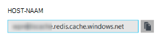

Stel de sleutel van de instelling van app **bestand Vgx.\_HOST** en de waarde van de instelling van de **host-naam** van het exemplaar van het bestand Vgx. Cache app.

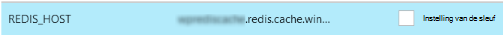

### <a name="add-rediskey-app-setting"></a>REDIS_KEY app instelling toevoegen

De tweede app maken is het **bestand Vgx.\_sleutel** instelling app. Deze instelling biedt dat de verificatietoken vereist voor veilig het exemplaar van het bestand Vgx. Cache. U kunt de waarde die nodig zijn voor de instelling van de REDIS_KEY app op de **toegangstoetsen** blade van het exemplaar van het bestand Vgx. Cache ophalen.

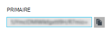

Stel de sleutel van de instelling van app **bestand Vgx.\_sleutel** en de waarde van de instelling van de app op de **Primaire sleutel** van het exemplaar van het bestand Vgx. Cache.

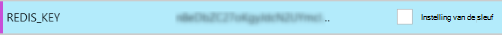

### <a name="add-memcacheshimredisenable-app-setting"></a>MEMCACHESHIM_REDIS_ENABLE app instelling toevoegen

De laatste instelling van de app wordt gebruikt om de Memcache Shim in Web Apps die gebruikmaakt van de REDIS_HOST en de REDIS_KEY verbinding maken met de Azure bestand Vgx. Cache en de cache sturen oproepen. Stel de sleutel van de instelling van app **MEMCACHESHIM\_bestand Vgx.\_inschakelen** en de waarde op **true**.

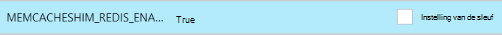

Zodra u klaar bent met de instellingen app drie (3) toe te voegen, klikt u op **Opslaan**.

## <a name="enable-memcache-extension-for-php"></a>Memcache-extensie inschakelen voor PHP

Om ervoor te zorgen dat de toepassing het protocol Memcache spreken, is het noodzakelijk de extensie Memcache voor PHP--het kader van de taal voor uw site WordPress installeren.

### <a name="download-the-phpmemcache-extension"></a>De uitbreiding van de php_memcache downloaden

Ga naar [PECL][6]. Klik onder de categorie in het cachegeheugen op [memcache][7]. Klik op de koppeling van het DLL-bestand onder de kolom downloads.


De koppeling niet Thread veilige (NTS) x86 voor de versie van PHP ingeschakeld in Web Apps downloaden. (Standaard is PHP 5.4)

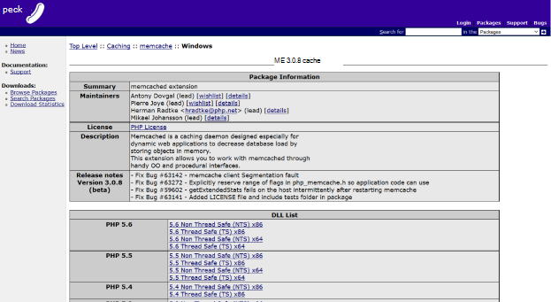

### <a name="enable-the-phpmemcache-extension"></a>De php_memcache-extensie inschakelen

Nadat u het bestand hebt gedownload, unzip en upload de **php\_memcache.dll** in de **d:\\home\\site\\wwwroot\\bin\\ext\\ ** directory. Nadat de php_memcache.dll in de web app is geüpload, moet u de extensie voor de PHP-Runtime inschakelen. Zodat de extensie Memcache in Azure Portal de blade **Toepassingsinstellingen** voor het web app te openen en vervolgens een nieuwe app-instelling toevoegen met de sleutel van **PHP\_EXTENSIES** en de waarde **bin\\ext\\php_memcache.dll**.


> [AZURE.NOTE] Als de web app laden meerdere extensies van PHP moet, is de waarde van PHP_EXTENSIONS moet een door komma's gescheiden lijst met relatieve paden naar dll-bestanden.

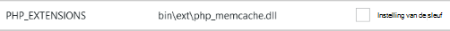

Zodra u klaar bent, klikt u op **Opslaan**.

## <a name="install-memcache-wordpress-plugin"></a>Memcache WordPress plugin installeren

> [AZURE.NOTE] U kunt ook de [Invoegtoepassing voor Memcached Object Cache](https://wordpress.org/plugins/memcached/) downloaden van WordPress.org.

Klik op **Nieuwe toevoegen**op de pagina WordPress plugins.


**Memcached** typt in het zoekvak en druk op **Enter**.

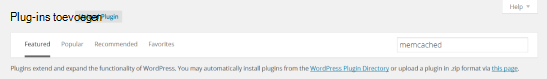

**Memcached Object Cache** vinden in de lijst en klik vervolgens op **Nu installeren**.

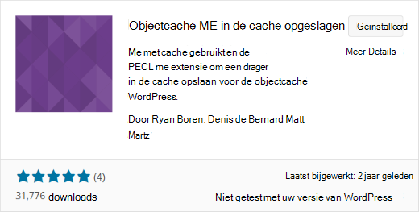

### <a name="enable-the-memcache-wordpress-plugin"></a>De plugin Memcache WordPress inschakelen

>[AZURE.NOTE] Volg de instructies in deze blog voor [het inschakelen van een Site-extensie in Web Apps] [ 8] Visual Studio Team Services installeren.

In de `wp-config.php` bestand, voeg de volgende code boven de kleurstop opmerking aan het einde van het bestand te bewerken.

```php
$memcached_servers = array(
    'default' => array('localhost:' . getenv("MEMCACHESHIM_PORT"))
);
```

Nadat deze code is gekoppeld, wordt het document automatisch opgeslagen in monaco.

De volgende stap is het inschakelen van de invoegtoepassing voor cache-objecten. Dit wordt gedaan door te slepen **object cache.php** uit **wp-inhoud/plugins/memcached** -map naar de map **wp-inhoud** de objectcache Memcache functionaliteit in te schakelen.

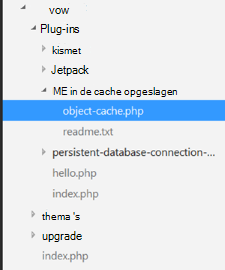

Nu dat het **object cache.php** bestand in de map **wp-inhoud** , wordt het Object Memcached Cache is nu ingeschakeld.

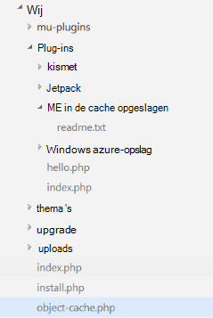

## <a name="verify-the-memcache-object-cache-plugin-is-functioning"></a>Controleer of dat de invoegtoepassing Memcache objectcache werkt

De stappen voor het inschakelen van de shim Web Apps-Memcache zijn nu voltooid. Hoeft u alleen nog is om te controleren of de gegevens invullen van uw exemplaar van het bestand Vgx. Cache.

### <a name="enable-the-non-ssl-port-support-in-azure-redis-cache"></a>De ondersteuning van niet-SSL-poort in Azure bestand Vgx. Cache inschakelen

>[AZURE.NOTE] Op het moment van schrijven van dit artikel, biedt het bestand Vgx. CLI geen ondersteuning voor SSL-connectiviteit, dus de volgende stappen zijn nodig.

Blader naar het bestand Vgx. Cache-exemplaar die u hebt gemaakt voor dit web app in de Portal Azure. Als de cache van de bladeserver geopend is, klikt u op het pictogram **Instellingen** .

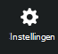

**Access-poorten** in de lijst selecteren.

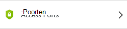

Klik op **Nee** voor **toegang via SSL alleen toestaan**.

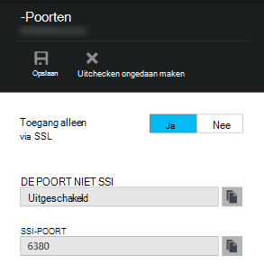

Ziet u de niet-SSL-poort is nu ingesteld. Klik op **Opslaan**.

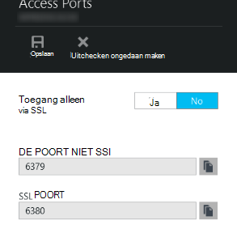

### <a name="connect-to-azure-redis-cache-from-redis-cli"></a>Verbinding maken met Azure bestand Vgx. Cache vanuit bestand Vgx. cli

>[AZURE.NOTE] Deze stap wordt ervan uitgegaan dat bestand Vgx. lokaal is geïnstalleerd op de ontwikkelcomputer. [Installeer het bestand Vgx. lokaal met behulp van deze instructies][9].

Open de console vanaf de opdrachtregel van keuze en typ de volgende opdracht:

```shell
redis-cli –h <hostname-for-redis-cache> –a <primary-key-for-redis-cache> –p 6379
```

Vervang de ** &lt;hostname-voor-bestand Vgx.-cache&gt; ** met de hostnaam van de werkelijke xxxxx.redis.cache.windows.net en de ** &lt;primaire-sleutel-voor-bestand Vgx.-cache&gt; ** met de sneltoets voor de cache, druk vervolgens op **Enter**. Zodra de CLI is verbonden met het exemplaar van het bestand Vgx. Cache, geeft u de opdracht bestand Vgx.. In het screenshot hieronder hebt ik gekozen om de sleutels.

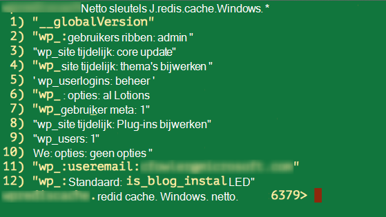

De oproep om de sleutels moet een waarde retourneren. Als niet, probeer het navigeren naar de web app opnieuw te proberen.

## <a name="conclusion"></a>Conclusie

Gefeliciteerd! De app WordPress heeft nu een centrale cache in het geheugen om de doorvoer te verhogen. Vergeet niet de Shim Web Apps Memcache kan worden gebruikt met elke client Memcache programmeertaal of application framework. Feedback geven of vragen stellen over de shim Web Apps Memcache boeken naar [MSDN Forums] [ 10] of [Stackoverflow][11].

>[AZURE.NOTE] Als u wilt aan de slag met Azure App-Service voordat u aanmelden voor een account met Azure, gaat u naar de [App-Service probeert](http://go.microsoft.com/fwlink/?LinkId=523751), waar u direct een starter tijdelijk web app in de App-Service maken kunt. Geen creditcard vereist; geen verplichtingen.

## <a name="whats-changed"></a>Wat er veranderd
* Zie voor een handleiding voor het wijzigen van Websites met App-Service: [Azure App Service en de gevolgen voor bestaande Azure Services](http://go.microsoft.com/fwlink/?LinkId=529714)


[0]: ../redis-cache/cache-dotnet-how-to-use-azure-redis-cache.md#create-a-cache
[1]: http://bit.ly/1t0KxBQ
[2]: http://manage.windowsazure.com
[3]: http://portal.azure.com
[4]: ../powershell-install-configure.md
[5]: /downloads
[6]: http://pecl.php.net
[7]: http://pecl.php.net/package/memcache
[8]: http://blog.syntaxc4.net/post/2015/02/05/how-to-enable-a-site-extension-in-azure-websites.aspx
[9]: http://redis.io/download#installation
[10]: https://social.msdn.microsoft.com/Forums/home?forum=windowsazurewebsitespreview
[11]: http://stackoverflow.com/questions/tagged/azure-web-sites
[12]: /services/cache/
[13]: http://memcached.org
