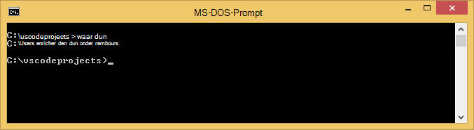
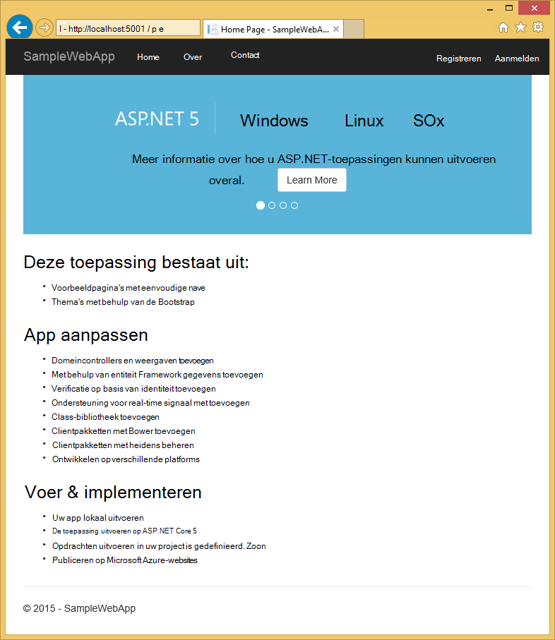
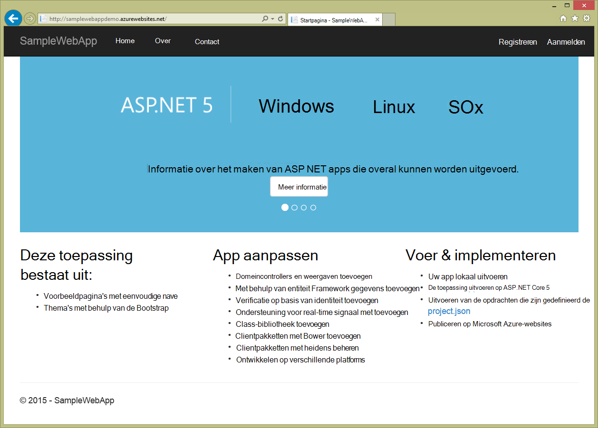

<properties
   pageTitle="Een 5 ASP.NET-webtoepassing maken in Visual Studio-Code"
   description="Deze zelfstudie laat zien hoe een 5 ASP.NET web app met behulp van Visual Studio Code maken."
   services="app-service\web"
   documentationCenter=".net"
   authors="erikre"
   manager="wpickett"
   editor="jimbe"/>

<tags
    ms.service="app-service-web" 
    ms.workload="web" 
    ms.tgt_pltfrm="dotnet" 
    ms.devlang="na" 
    ms.topic="article" 
    ms.date="02/26/2016" 
    ms.author="cephalin"/>

# Een 5 ASP.NET-webtoepassing maken in Visual Studio-Code

## Overzicht

In deze zelfstudie wordt beschreven hoe u een ASP.NET-5 web app met behulp van [Visual Studio Code (VS Code)](http://code.visualstudio.com//Docs/whyvscode) maken en deze implementeren in [Azure App-Service](../app-service/app-service-value-prop-what-is.md). 

> [AZURE.NOTE] Hoewel in dit artikel wordt verwezen naar het web apps, wordt ook toegepast op API apps en mobiele toepassingen. 

ASP.NET 5 is een belangrijke herstructurering van ASP.NET. ASP.NET 5 is een nieuw kader voor de open-source en cross-platform voor het bouwen van moderne cloud-gebaseerde web apps met behulp van .NET. Zie [Inleiding tot ASP.NET 5](http://docs.asp.net/en/latest/conceptual-overview/aspnet.html)voor meer informatie. Zie voor informatie over Azure App Service web apps, [Web Apps-overzicht](app-service-web-overview.md).

[AZURE.INCLUDE [app-service-web-try-app-service.md](../../includes/app-service-web-try-app-service.md)]

## Vereisten  

* [VS-Code](http://code.visualstudio.com/Docs/setup)te installeren.
* Installatie [Node.js](http://nodejs.org) - Node.js is een platform voor het bouwen van snelle en schaalbare toepassingen met behulp van JavaScript. Knooppunt is de runtime (knooppunt) en [npm](http://www.npmjs.com/) is de Package Manager voor knooppunt modules. U kunt npm scaffold een 5 ASP.NET-webtoepassing in deze zelfstudie.
* Git - installeren kunt u het installeren van een van deze locaties: [Chocolatey](https://chocolatey.org/packages/git) of [git scm.com](http://git-scm.com/downloads). Bent u nieuw in Git, [git scm.com](http://git-scm.com/downloads) kiezen en selecteert u de optie aan **Git gebruiken vanaf de opdrachtprompt van Windows**. Zodra u Git installeren, moet u ook de gebruikersnaam Git instellen en een e-mail als je later in de zelfstudie (bij het uitvoeren van een commit van VS Code).  

## ASP.NET 5 en DNX installeren
ASP.NET 5 DNX (.NET Execution Environment) is een lean .NET-stack voor het bouwen van moderne cloud en webtoepassingen die worden uitgevoerd op OS X, Linux en Windows. Het heeft zijn opgebouwd uit de bodem te voorzien in een ontwikkelingskader van geoptimaliseerde toepassingen die worden gedistribueerd naar de cloud of op locatie worden uitgevoerd. Het bestaat uit modulaire onderdelen met een minimale overhead, zodat u de flexibiliteit behouden tijdens het samenstellen van uw oplossingen.

Deze zelfstudie is ontworpen om u aan de slag met het bouwen van toepassingen met de nieuwste versies van de ontwikkeling van ASP.NET 5 en DNX. De volgende instructies gelden voor Windows. Zie voor meer gedetailleerde installatie-instructies voor OS X, Linux en Windows [installeren van ASP.NET 5 en DNX](https://code.visualstudio.com/Docs/ASPnet5#_installing-aspnet-5-and-dnx). 

1. .NET versie Manager (DNVM) installeren in Windows, open een opdrachtprompt en voer de volgende opdracht uit.

        @powershell -NoProfile -ExecutionPolicy unrestricted -Command "&{$Branch='dev';iex ((new-object net.webclient).DownloadString('https://raw.githubusercontent.com/aspnet/Home/dev/dnvminstall.ps1'))}"

    Dit wordt het script DNVM downloaden en plaatsen in uw map voor het gebruikersprofiel. 

2. **Windows opnieuw starten** om de DNVM-installatie te voltooien. 

    Nadat u Windows opnieuw is gestart, kunt u de opdrachtprompt om te controleren of de locatie van DNVM door te voeren de volgende openen:

        where dnvm

    De MS-DOS-prompt wordt een pad met de volgende strekking weergegeven.

    

3. Nu dat u DNVM hebt, moet u deze DNX om uw toepassingen te downloaden. Voer de volgende opdracht bij de opdrachtprompt:

        dnvm upgrade

    Controleer of uw DNVM en de actieve runtime bekijken door het volgende achter de opdrachtprompt:

        dnvm list

    De MS-DOS-prompt wordt weergegeven de gegevens van de actieve runtime.

    

    Als meer dan één DNX runtime wordt weergegeven, kunt u opgeven voor de volgende (of een recentere versie) op de opdrachtregel voor het instellen van de actieve DNX-runtime. Stel deze in op dezelfde versie die door de ASP.NET 5 generator wordt gebruikt bij het maken van uw web app verderop in deze handleiding. *Mogelijk moet u niet de actieve runtime wijzigen als deze is ingesteld op de meest recente beschikbare.*

        dnvm use 1.0.0-update1 –p

> [AZURE.NOTE] Zie voor meer gedetailleerde installatie-instructies voor OS X, Linux en Windows [installeren van ASP.NET 5 en DNX](https://code.visualstudio.com/Docs/ASPnet5#_installing-aspnet-5-and-dnx). 

## Maken van de web app. 

In deze sectie wordt beschreven hoe u een nieuwe app ASP.NET web app scaffold. U kunt het knooppunt package manager (npm) installeren [Yeoman](http://yeoman.io/) (steiger programma - equivalent van de VS Code van Visual Studio **Bestand > Nieuw Project** bewerking), [knorvis](http://gruntjs.com/) (JavaScript taak runner) en [Bower](http://bower.io/) (client side package manager). 

1. Open een opdrachtprompt met beheerdersbevoegdheden en navigeer naar de locatie waar u de ASP.NET-project te maken. Maak bijvoorbeeld een map *vscodeprojects* in de hoofdmap van C:\.

2. Voer de volgende opdracht bij de opdrachtprompt om Yeoman en de ondersteunende hulpprogramma's te installeren.

        npm install -g yo grunt-cli generator-aspnet bower

    > [AZURE.NOTE] U krijgt mogelijk een waarschuwing suggereren dat het npm-versie verouderd is. Deze waarschuwing mag geen afbreuk doen aan deze zelfstudie.

3. Voer de volgende opdracht bij de opdrachtprompt naar de projectmap maken en de app scaffold.

        yo aspnet

4. De pijltoetsen gebruiken om te selecteren van het type **Web toepassing standaard** uit de ASP.NET 5 generator menu en druk op ** &lt;Enter >**.

    

5. De naam van uw nieuwe ASP.NET web app ingesteld op **SampleWebApp**. Als deze naam wordt gebruikt in de zelfstudie, als u een andere naam selecteert, moet u in plaats van elk exemplaar van **SampleWebApp**. Wanneer u drukt op ** &lt;Enter >**, Yeoman maakt een nieuwe map met de naam **SampleWebApp** en de benodigde bestanden voor uw nieuwe app.

6. Wijzig mappen naar uw nieuwe projectmap achter de opdrachtprompt:

        cd SampleWebApp

7. Ook bij de opdrachtprompt om de nodige NuGet pakketten om uit te voeren van de toepassing hebt geïnstalleerd, voer de volgende opdracht:

        dnu restore

8. VS Code openen door het volgende achter de opdrachtprompt:

        code .

## De web app lokaal uitvoeren

Nu dat u hebt gemaakt van de web app en de NuGet pakketten voor de app opgehaald, kunt u de web app lokaal uitvoeren.

1. In het **Palet van de opdracht** in de Code van de VS, voer het volgende om de opdracht beschikbare opties weer te geven:

        dnx: Run Command

    > [AZURE.NOTE] Als de server Omnisharp is momenteel niet actief, wordt het gestart. Voer de bovenstaande opdracht opnieuw in.

    Selecteer vervolgens de volgende opdracht uit te voeren van uw web app:
        
        dnx web - (SampleWebApp)

    De opdracht wordt weergegeven dat de toepassing is gestart. Als de opdrachtvenster dit bericht niet wordt weergegeven, controleert u de onderste links corning VS code op fouten in uw project.
    
    > [AZURE.NOTE]De opdracht in het **Palet van de opdracht** alleen een **>** teken aan het begin van de opdrachtregel. U kunt de gegevens die verband houden met de opdracht **web** in het bestand *project.json* bekijken.   
    > Als de opdracht niet wordt weergegeven of niet beschikbaar is, moet u mogelijk de C#-extensie installeren. Uitvoeren van `>Extensions: Install Extension` en `ext install c#` de C#-extensies installeren.

2. Open een browser en Ga naar de volgende URL.

    **http://localhost:5000**

    De standaardpagina van de web app verschijnt.

    

3. Sluit de browser. Druk op **Ctrl + C** om de toepassing sluiten en sluit het **Venster van de opdracht**in het **Opdrachtvenster**. 

## Een webtoepassing maken in de Portal Azure

De volgende stappen begeleidt u bij het maken van een web app in de Portal Azure.

1. Log in op de [Azure Portal](https://portal.azure.com).

2. Klik op **Nieuw** boven links van de Portal.

3. Klik op **Web Apps > Web App**.

    

4. Voer een waarde voor **naam**, bijvoorbeeld **SampleWebAppDemo**. Merk op dat deze naam moet uniek zijn en de portal wordt afdwingen dat wanneer u probeert de naam op te geven. Dus als u een andere waarde invoeren, moet u ook die waarde voor elk exemplaar van de **SampleWebAppDemo** die u in deze zelfstudie ziet. 

5. Selecteer een bestaande **App Service plannen** of een nieuwe maken. Als u een nieuw plan maken, de prijzen laag, locatie en andere opties selecteren. Zie het artikel, [Azure App Service plannen diepgaand overzicht](../app-service/azure-web-sites-web-hosting-plans-in-depth-overview.md)voor meer informatie over App serviceplannen.

    

6. Klik op **maken**.

    

## Git publiceren voor de nieuwe web app inschakelen

GIT is een gedistribueerd versiebeheersysteem die u gebruiken kunt voor de implementatie van uw web app in Azure App-Service. Slaat u de code die u voor uw web app in een lokaal Git repository schrijft en u zult uw code op Azure implementeren door te drukken op een externe dataopslag.   

1. Meld u aan bij de [Azure Portal](https://portal.azure.com).

2. Klik op **Bladeren**.

3. Klik op **Web Apps** voor een lijst van de webtoepassingen die zijn gekoppeld aan uw abonnement op Azure.

4. Selecteer de web app dat u in deze zelfstudie hebt gemaakt.

5. Klik op **Instellingen**in de web app-blade > **continu implementatie**. 

    

6. Klik op **bron kiezen > lokale Git Repository**.

7. Klik op **OK**.

    

8. Als u eerder geen referenties voor het publiceren van een web app of andere App Service app implementatie hebt ingesteld, ze nu instellen:

    * Klik op **Instellingen** > **implementatie referenties**. De blade **implementatie referenties instellen** wordt weergegeven.

    * Maak een gebruikersnaam en wachtwoord.  U moet dit wachtwoord later bij het instellen van Git.

    * Klik op **Opslaan**.

9. Klik in uw webtoepassing blade, **Instellingen > Eigenschappen van**. De URL van de externe Git opslagplaats die u naar distribueren kunt wordt onder **GIT URL**weergegeven.

10. Kopieer de **GIT URL** -waarde voor later gebruik in de zelfstudie.

    

## Uw web app publiceren naar Azure App Service

In dit gedeelte maakt u een lokaal Git repository en push uit de opslagplaats die naar Azure kunt implementeren van uw web app met Azure.

1. Selecteer de optie **Git** in de linkernavigatiebalk in VS-Code.

    

2. Selecteer de **git repository initialiseren** om ervoor te zorgen dat uw werkruimte is git bronbesturing. 

    

3. Open het venster en verplaats de mappen naar de map van uw web app. Voer de volgende opdracht:

        git config core.autocrlf false

    Met deze opdracht voorkomt u dat een probleem over tekst wanneer CRLF-uitgangen en LF-uitgangen betreft.

4. VS-Code een commit bericht toevoegen en klik op het pictogram voor **Alle Commit** .

    

5. Nadat de Git is verwerkt, ziet u dat er geen bestanden weergegeven in het venster Git onder **wijzigingen**zijn. 

    

6. Wijzigen in het venster waar de MS-DOS-prompt naar de map verwijst waar uw web app zich bevindt.

7. Maak een externe verwijzing voor updates pushen naar uw web app via de URL Git (eindigend op ".git") die u eerder hebt gekopieerd.

        git remote add azure [URL for remote repository]

8. Git om uw referenties lokaal opslaan, zodat ze automatisch toegevoegd aan uw gegenereerd op basis van de Code van de VS push-opdrachten configureren.

        git config credential.helper store

9. Push-uw wijzigingen door te voeren met de volgende opdracht op Azure. Na deze eerste push naar Azure zijn u hebt voor alle push-opdrachten uit de VS-Code. 

        git push -u azure master

    U wordt gevraagd het wachtwoord dat u eerder in Azure gemaakt. **Opmerking: Uw wachtwoord is niet meer zichtbaar.**

    De uitvoer van de bovenstaande opdracht wordt afgesloten met een bericht dat de implementatie voltooid is.

        remote: Deployment successful.
        To https://user@testsite.scm.azurewebsites.net/testsite.git
        [new branch]      master -> master

> [AZURE.NOTE] Als u wijzigingen in uw toepassing aanbrengt, kunt u rechtstreeks in de VS-Code met behulp van de ingebouwde functionaliteit van Git door de **Verbindt zich ertoe alle** optie gevolgd door de optie **Push** opnieuw publiceren. Vindt u de **Push-** optie in de vervolgkeuzelijst naast de knoppen **Alle doorvoeren** en **vernieuwen** .

Als u samenwerken aan een project moet, kunt u overwegen op GitHub tussen pushen naar Azure duwen.

## De toepassing uitvoeren in Azure
Nu dat u uw web app hebt geïmplementeerd, zullen we de app terwijl gehost in Azure worden uitgevoerd. 

Dit kan op twee manieren doen:

* Open een browser en typ de naam van uw web app als volgt.   

        http://SampleWebAppDemo.azurewebsites.net
 
* Zoek de blade web app voor uw web app in de Portal Azure en klikt u op **Bladeren** om de toepassing weer te geven 
* in de browser.

## Samenvatting
In deze zelfstudie hebt u geleerd hoe een web app in de VS Code maken en deze implementeren in Azure. Zie het artikel, voor meer informatie over de Code van de VS, [Waarom Visual Studio Code?](https://code.visualstudio.com/Docs/) Zie voor meer informatie over App Service web-apps [Web Apps-overzicht](app-service-web-overview.md). 
