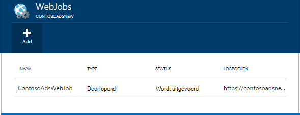
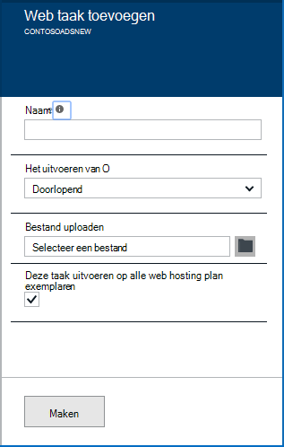
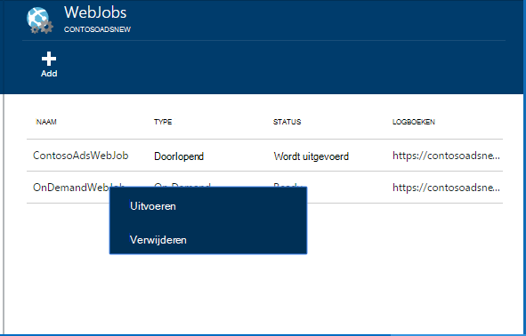
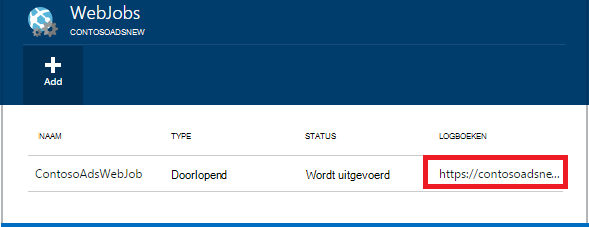

<properties 
    pageTitle="Achtergrondtaken uitvoeren met WebJobs" 
    description="Informatie over het uitvoeren van achtergrondtaken in Azure web apps." 
    services="app-service" 
    documentationCenter="" 
    authors="tdykstra" 
    manager="wpickett" 
    editor="jimbe"/>

<tags 
    ms.service="app-service" 
    ms.workload="na" 
    ms.tgt_pltfrm="na" 
    ms.devlang="na" 
    ms.topic="article" 
    ms.date="04/27/2016" 
    ms.author="tdykstra"/>

# <a name="run-background-tasks-with-webjobs"></a>Achtergrondtaken uitvoeren met WebJobs

## <a name="overview"></a>Overzicht

U kunt programma's of scripts in WebJobs uitvoeren in uw web app in [App-Service](http://go.microsoft.com/fwlink/?LinkId=529714) op drie manieren: op aanvraag, of volgens een planning. Er is zonder extra kosten voor het gebruik van WebJobs.

In dit artikel ziet u hoe WebJobs implementeren met behulp van de [Portal Azure](https://portal.azure.com). Zie [Azure-WebJobs naar Web Apps implementeren](websites-dotnet-deploy-webjobs.md)voor meer informatie over het implementeren met behulp van Visual Studio of een proces van continue levering.

De SDK Azure WebJobs vereenvoudigt veel WebJobs programmeertaken. Zie [Wat is de WebJobs SDK](websites-dotnet-webjobs-sdk.md)voor meer informatie.

 Azure functies (momenteel in het voorbeeld) is een andere manier uit te voeren programma's en scripts in Azure App-Service. Zie [functies van Azure-overzicht](../azure-functions/functions-overview.md)voor meer informatie.

[AZURE.INCLUDE [app-service-web-to-api-and-mobile](../../includes/app-service-web-to-api-and-mobile.md)] 

## <a name="acceptablefiles"></a>Toegestane bestandstypen voor scripts of programma 's

De volgende bestandstypen worden geaccepteerd:

* .cmd, .bat, .exe (met behulp van windows cmd)
* .ps1 (met powershell)
* .sh (met behulp van bash)
* .php (met behulp van php)
* .PY (met python)
* js (met behulp van knooppunt)
* de JAR (java met)

## <a name="CreateOnDemand"></a>Een op verzoek van WebJob maken in de portal

1. Klik in de **Web App** blade van de [Azure Portal](https://portal.azure.com), **alle instellingen > WebJobs** de blade **WebJobs** weergeven.
    
    
    
5. Klik op **toevoegen**. Het dialoogvenster **WebJob toevoegen** verschijnt.
    
    
    
2. Geef een naam voor de WebJob onder **de naam**. De naam moet beginnen met een letter of een getal en dan mag geen speciale tekens bevatten '-' en '_'.
    
4. Kies **op aanvraag uitvoeren**in het vak van de **procedure uit te voeren** .
    
3. Klik op het mappictogram en blader naar het zip-bestand met het script in het **Bestand uploaden** . Het zip-bestand, moet het uitvoerbare bestand (.exe .cmd .bat .sh .php .py .js) en de ondersteunende bestanden die nodig zijn voor het uitvoeren van het programma of script bevatten.
    
5. Controleer **maken** om het script uploaden naar uw web app. 
    
    De naam die u hebt opgegeven voor het WebJob wordt weergegeven in de lijst op het blad **WebJobs** .
    
6. De WebJob wordt uitgevoerd, met de rechtermuisknop op de naam in de lijst en klikt u op **uitvoeren**.
    
    
    
## <a name="CreateContinuous"></a>Maak een continu actief WebJob

1. Volg dezelfde stappen voor het maken van een WebJob dat wordt uitgevoerd één keer, maar in het vak **uitvoeren het** kiezen **doorlopend**wilt maken van een continu uitvoerende WebJob.

2. Als u wilt starten of stoppen van een continue WebJob, met de rechtermuisknop op de WebJob in de lijst en klikt u op **starten** of **stoppen**.
    
> [AZURE.NOTE] Als uw web app op meer dan één exemplaar wordt uitgevoerd, wordt een continu actief WebJob uitgevoerd op alle van de instanties. Op verzoek en geplande WebJobs uitvoeren op één exemplaar geselecteerd voor taakverdeling door Microsoft Azure.
    
> Inschakelen voor continue WebJobs uit te voeren op alle exemplaren en op betrouwbare wijze de altijd op * configuratie-instelling voor het web app anders ze stoppen kunnen wanneer de hostsite SCM al lang inactief is geweest.

## <a name="CreateScheduledCRON"></a>Een geplande WebJob met behulp van een CRON expressie maken

Deze techniek is beschikbaar voor Web Apps in Basic, Standard of Premium-modus en is **Altijd op** zijn ingeschakeld op de app.

Als u een vraag op WebJob in een geplande WebJob, simpelweg omvatten een `settings.job` bestand in de hoofdmap van uw zip-bestand WebJob. Dit bestand JSON moet bevatten een `schedule` eigenschap met een [CRON expressie](https://en.wikipedia.org/wiki/Cron), per voorbeeld hieronder.

De CRON expressie bestaat uit 6 velden: `{second} {minute} {hour} {day} {month} {day of the week}`.

Bijvoorbeeld voor het starten van de WebJob elke 15 minuten, de `settings.job` hebben:

```json
{
    "schedule": "0 */15 * * * *"
}
``` 

Andere voorbeelden van CRON schedule:

- Elk uur (dat wil zeggen wanneer het aantal minuten is ingesteld op 0):`0 0 * * * *` 
- Elk uur van 9 AM tot 5 PM:`0 0 9-17 * * *` 
- Om 9:30 AM elke dag:`0 30 9 * * *`
- Om 9:30 AM elke dag van de week:`0 30 9 * * 1-5`

**Opmerking**: bij het implementeren van een WebJob van Visual Studio moet markeren uw `settings.job` bestandseigenschappen als kopie als nieuwere.


## <a name="CreateScheduled"></a>Maak een geplande WebJob met behulp van de Taakplanner Azure

De volgende alternatieve techniek wordt gebruik gemaakt van de Scheduler Azure. In dit geval de WebJob geen directe kennis van de planning. In plaats daarvan wordt de Scheduler Azure activeren de WebJob volgens een schema geconfigureerd. 

De Portal Azure wordt niet nog de mogelijkheid voor het maken van een geplande WebJob, maar tot die functie is toegevoegd, dat kunt u dit doen met behulp van de [klassieke portal](http://manage.windowsazure.com).

1. Ga naar de pagina WebJob in de [klassieke portal](http://manage.windowsazure.com) en klik op **toevoegen**.

1. Kies **uitvoeren volgens een schema**in het vak van de **procedure uit te voeren** .
    
    ![Nieuwe geplande taak][NewScheduledJob]
    
2. Kies de **Scheduler regio** voor uw project en klik vervolgens op de pijl op de onderste rechts in het dialoogvenster om door te gaan naar het volgende scherm.

3. Kies het type **Terugkeerpatroon** dat u wilt dat in het dialoogvenster **Taak maken** : **eenmalige** of **terugkerende taak**.
    
    ![Terugkeerpatroon plannen][SchdRecurrence]
    
4. Kies ook **een begintijd** : **nu** of **op een bepaald tijdstip**.
    
    ![Geplande begintijd][SchdStart]
    
5. Als u wilt laten beginnen op een bepaald tijdstip, kiest u de beginwaarden tijd onder **Beginnen op**.
    
    ![Start op een bepaald moment plannen][SchdStartOn]
    
6. Als u een terugkerende taak hebt gekozen, hebt u de **herhalen elke** kunt u de frequentie van het optreden en de optie **Eindigt op** een eindtijd opgeven.
    
    ![Terugkeerpatroon plannen][SchdRecurEvery]
    
7. Als u **weken**kiest, kunt u het **Op een bepaald schema** en geeft u de dagen van de week waarop u de taak wilt uitvoeren.
    
    ![Schema dagen van de Week][SchdWeeksOnParticular]
    
8. Als u **maanden** selecteert en het vak **Op een bepaald schema** , kunt u instellen dat de taak uit te voeren op bepaalde genummerde **dagen** in de maand. 
    
    ![Plannen van bepaalde datums in de maand][SchdMonthsOnPartDays]
    
9. Als u de **Dagen van de Week**kiest, kunt u die dag of dagen van de week in de maand die u uitvoeren wilt op de taak.
    
    ![Bepaalde weekdagen in een maand plannen][SchdMonthsOnPartWeekDays]
    
10. Ten slotte kun je de optie **exemplaren** te kiezen welke week van de maand (eerste, tweede, derde enz.) u de taak wilt uitvoeren op de weekdagen die u hebt opgegeven.
    
    ![Bepaalde weekdagen op bepaalde weken in een maand plannen][SchdMonthsOnPartWeekDaysOccurences]
    
11. Nadat u een of meer taken hebt gemaakt, worden hun namen worden weergegeven op het tabblad WebJobs met hun status, schema en andere informatie. Historische informatie over de laatste 30 WebJobs wordt gehandhaafd.
    
    ![Takenlijst met][WebJobsListWithSeveralJobs]
    
### <a name="Scheduler"></a>Geplande taken en Azure planner

Geplande taken kunnen verder worden geconfigureerd in de [klassieke portal](http://manage.windowsazure.com)Azure Scheduler's.

1.  Klik op de koppeling van **planning** van de taak om te navigeren naar de Azure Scheduler portal-pagina op de pagina WebJobs. 
    
    ![Koppeling naar Azure Scheduler][LinkToScheduler]
    
2. Klik op de pagina Taakplanner op de taak.
    
    ![Taak op de portaalpagina van Taakplanner][SchedulerPortal]
    
3. De pagina **actie project** wordt geopend, waar u kunt de taak verder configureren. 
    
    ![Actie voor taak PageInScheduler][JobActionPageInScheduler]
    
## <a name="ViewJobHistory"></a>De geschiedenis weergeven

1. De geschiedenis van de uitvoering van een project, met inbegrip van taken die zijn gemaakt met de WebJobs SDK, klikt u op de desbetreffende koppeling in de kolom van de **Logboeken** van het blad WebJobs. (U kunt het pictogram van het Klembord de URL van de pagina naar het Klembord kopiëren als u wilt.)
    
    
        
2. De detailpagina te klikken op de koppeling voor de WebJob worden geopend. Deze pagina geeft u de naam van de opdracht uitvoeren, de laatste keer uitgevoerd, en zijn geslaagd of mislukt. Onder **recente taak wordt uitgevoerd**, klikt u op een tijdstip voor verdere details.
    
    ![WebJobDetails][WebJobDetails]
    
3. De pagina **Details voor WebJob uitvoeren** wordt weergegeven. Klik op de **Uitvoer van in-of uitschakelen** om te zien de tekst van de inhoud van het logboek. Het logboek van de output is tekst zonder opmaak. 
    
    ![Web taak details][WebJobRunDetails]
    
4. Overzicht van de uitgevoerde tekst in een apart browservenster, klikt u op de koppeling **downloaden** . Klik met de rechtermuisknop op de koppeling voor het downloaden van de tekst zelf, en opties van uw browser gebruiken om de inhoud van het bestand opslaan.
    
    ![De uitvoer van downloaden][DownloadLogOutput]
    
5. Op de bovenkant van de pagina de koppeling **WebJobs** biedt een handige manier om een lijst met WebJobs op het dashboard geschiedenis te bereiken.
    
    ![Een koppeling naar de lijst WebJobs][WebJobsLinkToDashboardList]
    
    ![Lijst met WebJobs in de geschiedenis van dashboard][WebJobsListInJobsDashboard]
    
    Klik op een van deze koppelingen gaat u naar de pagina met WebJob voor de taak die u hebt geselecteerd.


## <a name="WHPNotes"></a>Notities
    
- Web apps in de gratis modus kunnen een time-out na 20 minuten als er geen aanvragen naar de site van scm (deployment) en de web-app portal niet is geopend in Azure. Aanvragen voor de werkelijke site opnieuw niet in deze.
- Code voor een continue functie moet worden geschreven in een eindeloze lus uit te voeren.
- Continue taken doorlopend alleen als de web app.
- Basic en standaard modi bieden de altijd op die, wanneer ingeschakeld, voorkomt u dat web apps niet langer actief.
- U kunt alleen voor foutopsporing is continu actief WebJobs. Geplande of bellen op WebJobs foutopsporing wordt niet ondersteund.

## <a name="NextSteps"></a>Volgende stappen
 
Voor meer informatie Zie [Azure WebJobs aanbevolen bronnen][WebJobsRecommendedResources].

[PSonWebJobs]:http://blogs.msdn.com/b/nicktrog/archive/2014/01/22/running-powershell-web-jobs-on-azure-websites.aspx
[WebJobsRecommendedResources]:http://go.microsoft.com/fwlink/?LinkId=390226

[OnDemandWebJob]: ./media/web-sites-create-web-jobs/01aOnDemandWebJob.png
[WebJobsList]: ./media/web-sites-create-web-jobs/02aWebJobsList.png
[NewContinuousJob]: ./media/web-sites-create-web-jobs/03aNewContinuousJob.png
[NewScheduledJob]: ./media/web-sites-create-web-jobs/04aNewScheduledJob.png
[SchdRecurrence]: ./media/web-sites-create-web-jobs/05SchdRecurrence.png
[SchdStart]: ./media/web-sites-create-web-jobs/06SchdStart.png
[SchdStartOn]: ./media/web-sites-create-web-jobs/07SchdStartOn.png
[SchdRecurEvery]: ./media/web-sites-create-web-jobs/08SchdRecurEvery.png
[SchdWeeksOnParticular]: ./media/web-sites-create-web-jobs/09SchdWeeksOnParticular.png
[SchdMonthsOnPartDays]: ./media/web-sites-create-web-jobs/10SchdMonthsOnPartDays.png
[SchdMonthsOnPartWeekDays]: ./media/web-sites-create-web-jobs/11SchdMonthsOnPartWeekDays.png
[SchdMonthsOnPartWeekDaysOccurences]: ./media/web-sites-create-web-jobs/12SchdMonthsOnPartWeekDaysOccurences.png
[RunOnce]: ./media/web-sites-create-web-jobs/13RunOnce.png
[WebJobsListWithSeveralJobs]: ./media/web-sites-create-web-jobs/13WebJobsListWithSeveralJobs.png
[WebJobLogs]: ./media/web-sites-create-web-jobs/14WebJobLogs.png
[WebJobDetails]: ./media/web-sites-create-web-jobs/15WebJobDetails.png
[WebJobRunDetails]: ./media/web-sites-create-web-jobs/16WebJobRunDetails.png
[DownloadLogOutput]: ./media/web-sites-create-web-jobs/17DownloadLogOutput.png
[WebJobsLinkToDashboardList]: ./media/web-sites-create-web-jobs/18WebJobsLinkToDashboardList.png
[WebJobsListInJobsDashboard]: ./media/web-sites-create-web-jobs/19WebJobsListInJobsDashboard.png
[LinkToScheduler]: ./media/web-sites-create-web-jobs/31LinkToScheduler.png
[SchedulerPortal]: ./media/web-sites-create-web-jobs/32SchedulerPortal.png
[JobActionPageInScheduler]: ./media/web-sites-create-web-jobs/33JobActionPageInScheduler.png
 
