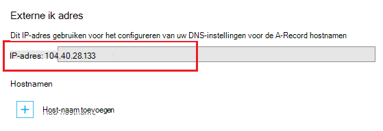

<properties
    pageTitle="Een aangepaste domeinnaam toewijzen aan een Azure app"
    description="Informatie over het toewijzen van aangepaste domeinnaam (aangepaste domein) aan uw app in Azure App-Service."
    services="app-service"
    documentationCenter=""
    authors="cephalin"
    manager="wpickett"
    editor="jimbe"
    tags="top-support-issue"/>

<tags
    ms.service="app-service"
    ms.workload="na"
    ms.tgt_pltfrm="na"
    ms.devlang="na"
    ms.topic="article"
    ms.date="07/27/2016"
    ms.author="cephalin"/>

# Een aangepaste domeinnaam toewijzen aan een Azure app

[AZURE.INCLUDE [web-selector](../../includes/websites-custom-domain-selector.md)]

In dit artikel wordt beschreven hoe u handmatig een aangepaste domeinnaam toewijzen aan uw web app, mobiele app back-end of API app in [Azure App-Service](../app-service/app-service-value-prop-what-is.md). 

Uw app is al voorzien van een unieke subdomein van azurewebsites.net. Als de naam van uw app **contoso**, vervolgens is de domeinnaam bijvoorbeeld **contoso.azurewebsites.net**. U kunt echter een aangepaste domein toewijzen de naam van app zodanig dat de URL, zoals `www.contoso.com`, komt overeen met het merk van uw.

>[AZURE.NOTE] Hulp van Azure experts op de [Azure forums](https://azure.microsoft.com/support/forums/). Ga naar de [site ondersteuning van Azure](https://azure.microsoft.com/support/options/) en klik op **Ondersteuning krijgen**voor een nog hoger niveau van ondersteuning.

[AZURE.INCLUDE [introfooter](../../includes/custom-dns-web-site-intro-notes.md)]

## Een nieuwe aangepaste domein kopen in Azure portal

Als u al een aangepaste domeinnaam nog niet hebt gekocht, kunt u een kopen en deze rechtstreeks in de instellingen van uw app in de [Azure portal](https://portal.azure.com)beheren. Deze optie gemakkelijk een aangepast domein koppelen aan uw app, of uw app [Azure verkeer Manager](web-sites-traffic-manager-custom-domain-name.md) wordt gebruikt of niet. 

Zie [een aangepaste domeinnaam voor App Service kopen](custom-dns-web-site-buydomains-web-app.md)voor instructies.

## Een aangepaste domein dat u extern gekocht toewijzen

Als u een aangepast domein al van [Azure DNS](https://azure.microsoft.com/services/dns/) of van een andere provider gekocht hebt, zijn er drie belangrijke stappen voor het aangepaste domein toewijzen aan uw app:

1. [ *(Alleen een record)* Get app van IP-adres](#vip).
2. [De DNS-records die wijzen op uw domein om uw app te maken](#createdns). 
    - **Waar**: uw domein registrar eigen hulpprogramma (bijvoorbeeld DNS-Azure, GoDaddy, enz.).
    - **Waarom**: zodat uw domeinregistratieservice naar lost de gewenste aangepaste domein dat u wilt uw Azure app weet.
1. [De aangepaste domeinnaam voor uw Azure app inschakelen](#enable).
    - **Waar**: de [Azure portal](https://portal.azure.com).
    - **Waarom**: zodat uw app weet om te reageren op aanvragen voor de naam van het aangepaste domein.
3. [Controleer of DNS-doorgifte](#verify).

### Typen domeinen die u toewijzen kunt.

Azure App-Service kunt u de volgende categorieën van aangepaste domeinen toewijzen aan uw app.

- **Root domain** - naam van het domein dat u met de domeinregistratieservice gereserveerd (vertegenwoordigd door de `@` record, meestal host). Bijvoorbeeld **contoso.com**.
- **Subdomein** - een domein dat zich onder het hoofddomein. Bijvoorbeeld **www.contoso.com** (vertegenwoordigd door de `www` host record).  U kunt verschillende subdomeinen van het hoofddomein dezelfde toewijzen aan verschillende apps in Azure.
- **Wildcard domein** - [elk subdomein waarvan de meest linkse DNS-label is `*` ](https://en.wikipedia.org/wiki/Wildcard_DNS_record) (bijvoorbeeld host records `*` en `*.blogs`). Bijvoorbeeld: ** \*. contoso.com**.

### Typen DNS-records die u gebruiken kunt.

Afhankelijk van uw behoeften, kunt u twee soorten standaard DNS-records van uw aangepaste domein toewijzen: 

- [A](https://en.wikipedia.org/wiki/List_of_DNS_record_types#A) - kaarten uw aangepaste domeinnaam aan de Azure app virtueel IP-adres direct. 
- [CNAME](https://en.wikipedia.org/wiki/CNAME_record) - uw aangepaste domeinnaam toegewezen aan de domeinnaam van uw app van Azure, * *&lt;*appname*>. azurewebsites.net**. 

Het voordeel van CNAME is dat blijft bestaan tussen het IP-adres wijzigingen. Als u verwijderen en opnieuw maken van uw app of terug te vanaf een hogere prijzen laag naar de **gedeelde** laag zetten kan van uw app virtueel IP-adres veranderen. Door middel van een wijziging een CNAME-record nog steeds geldig is, dat een A-record moet worden bijgewerkt. 

De zelfstudie bevat stappen voor het gebruik van de A-record en voor het gebruik van de CNAME-record.

>[AZURE.IMPORTANT] Maak geen een CNAME-record voor uw domein (dat wil zeggen de "root-record'). Zie voor meer informatie, [Waarom kan niet een CNAME-record worden gebruikt bij het hoofddomein](http://serverfault.com/questions/613829/why-cant-a-cname-record-be-used-at-the-apex-aka-root-of-a-domain).
Een hoofddomein worden toegewezen aan uw app in Azure, gebruikt u een A-record.

## Stap 1. *(Alleen een record)* App van IP-adres ophalen
Een aangepaste domeinnaam met een A-record toewijzen, moet u uw Azure app IP-adres. Als u in plaats daarvan gebruik van een CNAME-record koppelt, wordt deze stap overslaan en verplaatsen naar de volgende sectie.

1.  Log in op de [Azure portal](https://portal.azure.com).

2.  Klik op **Toepassing Services** in het menu links.

4.  Uw app, klik op **aangepaste domeinen**.

6.  Noteer het IP-adres boven de sectie hostnamen...

    

7.  Deze portal blade openhouden. U wordt hiernaar terug nadat u de DNS-records maken.

## Stap 2. De DNS-record (s) maken

Log in op uw domeinregistratieservice en gebruiken voor het toevoegen van een A record of CNAME-record. Van elke registratieservice UI is iets anders, dus u moet in de documentatie van uw provider. Hier zijn echter enkele algemene richtlijnen.

1.  Zoek de pagina voor het beheren van DNS-records. Zoek naar koppelingen of gedeelten van de site met de naam **Domeinnaam**, **DNS**of **Name Server Management**. Vaak vindt u de koppeling met uw accountgegevens bekijken en klik vervolgens op zoek naar een koppeling zoals **Mijn domeinen**.
2.  Zoek naar een koppeling waarmee u DNS-records toevoegt of bewerkt. Dit kan zijn een **zonebestand** of de **DNS-Records** koppelen of een koppeling **Geavanceerd** configuratie.
3.  De record te maken en uw wijzigingen opslaan.
    - [Hier vindt u instructies voor een A-record](#a).
    - [Hier vindt u instructies voor een CNAME-record](#cname).

### Een A-record maken

Als u een A-record wilt toewijzen aan een IP-adres van uw app Azure, moet u een TXT-record en een A-record maken. De A-record voor de DNS-omzetting zelf is en de TXT-record is voor Azure om te verifiëren dat u de eigenaar van de naam van het aangepaste domein. 

Configureer als volgt de A-record (@ vertegenwoordigt het hoofddomein):
 
<table cellspacing="0" border="1">
  <tr>
    <th>Voorbeeld van de FQDN-naam</th>
    <th>Een Host</th>
    <th>Een waarde</th>
  </tr>
  <tr>
    <td>Contoso.com (root)</td>
    <td>@</td>
    <td>IP-adres van <a href="#vip">stap 1</a></td>
  </tr>
  <tr>
    <td>www.contoso.com (sub)</td>
    <td>www</td>
    <td>IP-adres van <a href="#vip">stap 1</a></td>
  </tr>
  <tr>
    <td>*. contoso.com (jokertekens)</td>
    <td>*</td>
    <td>IP-adres van <a href="#vip">stap 1</a></td>
  </tr>
</table>

Het Verdrag dat de kaarten uit uw extra TXT-record krijgt &lt; *subdomein*>. &lt; *rootdomain*> naar &lt; *appname*>. azurewebsites.net. De TXT-record als volgt configureren:

<table cellspacing="0" border="1">
  <tr>
    <th>Voorbeeld van de FQDN-naam</th>
    <th>TXT-Host</th>
    <th>TXT-waarde</th>
  </tr>
  <tr>
    <td>Contoso.com (root)</td>
    <td>@</td>
    <td>&lt;<i>AppName</i>>. azurewebsites.net</td>
  </tr>
  <tr>
    <td>www.contoso.com (sub)</td>
    <td>www</td>
    <td>&lt;<i>AppName</i>>. azurewebsites.net</td>
  </tr>
  <tr>
    <td>*. contoso.com (jokertekens)</td>
    <td>*</td>
    <td>&lt;<i>AppName</i>>. azurewebsites.net</td>
  </tr>
</table>

###Een CNAME-record maken

Als u een CNAME-record toe te wijzen aan uw Azure app standaarddomeinnaam gebruikt, hoeft u niet een extra TXT-record als u met een A-record doen. 

>[AZURE.IMPORTANT] Maak geen een CNAME-record voor uw domein (dat wil zeggen de "root-record'). Zie voor meer informatie, [Waarom kan niet een CNAME-record worden gebruikt bij het hoofddomein](http://serverfault.com/questions/613829/why-cant-a-cname-record-be-used-at-the-apex-aka-root-of-a-domain).
Een hoofddomein worden toegewezen aan uw app in Azure, gebruikt u een [A-record](#a) .

Configureer als volgt de CNAME-record (@ vertegenwoordigt het hoofddomein):

<table cellspacing="0" border="1">
  <tr>
    <th>Voorbeeld van de FQDN-naam</th>
    <th>CNAME-Host</th>
    <th>CNAME-waarde</th>
  </tr>
  <tr>
    <td>www.contoso.com (sub)</td>
    <td>www</td>
    <td>&lt;<i>AppName</i>>. azurewebsites.net</td>
  </tr>
  <tr>
    <td>*. contoso.com (jokertekens)</td>
    <td>*</td>
    <td>&lt;<i>AppName</i>>. azurewebsites.net</td>
  </tr>
</table>

##Stap 3. De aangepaste naam van uw app inschakelen

Terug in de **Aangepaste domeinen** blade in Azure portal (Zie [stap 1](#vip)), moet u de volledig gekwalificeerde domeinnaam (FQDN) van uw aangepaste domein toevoegen aan de lijst.

1.  Als u nog niet hebt gedaan, meld u aan op de [Azure portal](https://portal.azure.com).

2.  Klik in het portal voor Azure **App Services** in het menu links.

3.  Uw app Klik op **Custom domains** > **host-naam toevoegen**.

4.  De FQDN-naam van uw aangepaste domein toevoegen aan de lijst (bijvoorbeeld **www.contoso.com**).

    

    >[AZURE.NOTE] Azure zal proberen om te controleren of de domeinnaam die u hier gebruiken. Zorg ervoor dat het dezelfde naam van het domein waarvoor u een DNS-record hebt gemaakt in [stap 2](#createdns). 

5.  Klik op **valideren**.

6.  Na het klikken op **valideren** Azure zal ere van domeinverificatie workflow. Dit wordt gecontroleerd op eigendom van domein als Hostname beschikbaarheid en rapport succes of gedetailleerde fout met duidelijke guidence voor het oplossen van de fout.    

7.  Na een succesvolle validatie **host-naam toevoegen** knop wordt actief wordt en is het mogelijk om de host-naam toewijzen. 

8.  Nadat de Azure is voltooid op uw aangepaste domeinnaam configureren, gaat u naar uw aangepaste domeinnaam in een browser. De browser opent uw Azure app, wat betekent dat uw aangepaste domeinnaam goed is geconfigureerd.

> [AZURE.NOTE] Als DNS-record al is in gebruik (actieve domein portie verkeer scenario) en u moet uw web app preemptively binden aan voor domeinverificatie, gewoon maakt u een TXT-records als voorbeelden in de volgende tabel wordt weergegeven. Het Verdrag dat de kaarten uit uw extra TXT-record krijgt &lt; *subdomein*>. &lt; *rootdomain*> naar &lt; *appname*>. azurewebsites.net. 
> <table cellspacing="0" border="1">
  <tr>
    <th>Voorbeeld van de FQDN-naam</th>
    <th>TXT-Host</th>
    <th>TXT-waarde</th>
  </tr>
  <tr>
    <td>Contoso.com (root)</td>
    <td>awverify.contoso.com</td>
    <td>&lt;<i>AppName</i>>. azurewebsites.net</td>
  </tr>
  <tr>
    <td>www.contoso.com (sub)</td>
    <td>awverify.www.contoso.com</td>
    <td>&lt;<i>AppName</i>>. azurewebsites.net</td>
  </tr>
    <tr>
    <td>*. contoso.com (sub)</td>
    <td>awverify.*.contoso.com</td>
    <td>&lt;<i>AppName</i>>. azurewebsites.net</td>
  </tr>
</table>
Als deze DNS-record is gemaakt, gaat u terug naar Azure portal en uw aangepaste domeinnaam toevoegen aan uw web app.
 

##Controleer of DNS-doorgifte

Nadat u de configuratieprocedures hebt voltooid, het kan even duren voordat de wijzigingen worden doorgegeven, afhankelijk van uw DNS-provider. U kunt controleren of het doorgeven van de DNS-functioneert zoals verwacht met behulp van [http://digwebinterface.com/](http://digwebinterface.com/). Nadat u naar de site bladert, wordt de host-namen opgeven in het tekstvak en klik op **graven**. Controleer of de resultaten om te bevestigen als de recente wijzigingen van kracht zijn.  

> [AZURE.NOTE] Het doorgeven van de DNS-vermeldingen kan maximaal 48 uur (en soms langer) duren. Als u alles correct hebt geconfigureerd, moet u nog steeds te wachten tot het doorgeven is voltooid.

## Volgende stappen
Informatie over het beveiligen van uw aangepaste domeinnaam met HTTPS door [een SSL-certificaat in Azure kopen](web-sites-purchase-ssl-web-site.md) of [met behulp van een SSL-certificaat van elders](web-sites-configure-ssl-certificate.md).

>[AZURE.NOTE] Als u wilt aan de slag met Azure App-Service voordat u aanmelden voor een account met Azure, gaat u naar de [App-Service probeert](http://go.microsoft.com/fwlink/?LinkId=523751), waar u direct een starter tijdelijk web app in de App-Service maken kunt. Geen creditcard vereist; geen verplichtingen.

[Aan de slag met Azure DNS](../dns/dns-getstarted-create-dnszone.md)  
[DNS-records voor een web app in een aangepast domein te maken](../dns/dns-web-sites-custom-domain.md)  
[Gemachtigde Azure DNS-domein](../dns/dns-domain-delegation.md)

<!-- Images -->
[subdomain]: media/web-sites-custom-domain-name/azurewebsites-subdomain.png
