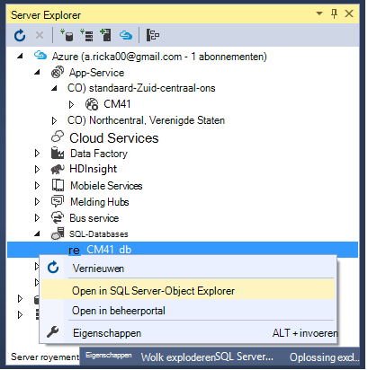

<properties 
    pageTitle="Een ASP.NET-MVC app met verificatie en SQL DB maken en implementeren met Azure App Service" 
    description="Informatie over het ontwikkelen van een app ASP.NET MVC 5 met een SQL-Database back-end, verificatie en machtiging toevoegen en deze implementeren in Azure." 
    services="app-service\web" 
    documentationCenter=".net" 
    authors="Rick-Anderson" 
    writer="Rick-Anderson" 
    manager="wpickett" 
    editor=""/>

<tags 
    ms.service="app-service-web" 
    ms.workload="web" 
    ms.tgt_pltfrm="na" 
    ms.devlang="dotnet" 
    ms.topic="article" 
    ms.date="03/21/2016" 
    ms.author="riande"/> 

# Een ASP.NET-MVC app met verificatie en SQL DB maken en implementeren met Azure App Service

Deze zelfstudie toont hoe u een beveiligde ASP.NET MVC 5 web app waarmee gebruikers zich aanmelden met de referenties van Facebook of Google. De app is een eenvoudige lijst met contactpersonen die gebruikmaakt van het kader van de entiteit ADO.NET voor toegang tot de database. U zult de app implementeren met [Azure App-Service](http://go.microsoft.com/fwlink/?LinkId=529714). 

In de zelfstudie is voltooid, hebt u een beveiligde gegevensgestuurde webtoepassing up in de cloud en uitgevoerd met behulp van de database van een wolk. De volgende afbeelding ziet u de aanmeldingspagina voor de voltooide toepassing.

![Login pagina][rxb]

U leert:

* Het maken van een beveiligde ASP.NET MVC 5 webproject in Visual Studio.
* Informatie over het verifiëren en machtigen van gebruikers die zich aanmelden met de referenties van hun rekeningen Google of Facebook (sociale provider verificatie met [OAuth 2.0](http://oauth.net/2 "http://oauth.net/2")).
* Informatie over het verifiëren en machtigen van gebruikers die zich registreren in een database die wordt beheerd door de toepassing (lokale verificatie met behulp van [ASP.NET identiteit](http://asp.net/identity/)).
* Het gebruik van de eerste ADO.NET entiteit kader 6 Code om te lezen en schrijven van gegevens in een SQL-database.
* Het eerste migraties van entiteit Framework-Code gebruiken voor de implementatie van een database.
* Het opslaan van relationele gegevens in de cloud via Azure SQL-Database.
* Het implementeren van een webproject dat gebruikmaakt van een database naar een [web app](http://go.microsoft.com/fwlink/?LinkId=529714) in Azure App-Service.

>[AZURE.NOTE] Dit is een lange zelfstudie. Als u een korte inleiding Azure App Service en Visual Studio webprojecten, Zie [maken een ASP.NET-webtoepassing in Azure App-Service](web-sites-dotnet-get-started.md). Raadpleeg de sectie [problemen oplossen](#troubleshooting) voor meer info.
>
>Of als u wilt aan de slag met Azure App-Service voordat u aanmelden voor een account met Azure, Ga naar de [App-Service probeert](http://go.microsoft.com/fwlink/?LinkId=523751), waar u direct een starter tijdelijk web app in de App-Service maken kunt. Geen creditcard vereist; geen verplichtingen.

## Vereisten

Als u deze zelfstudie hebt voltooid, moet u een account van Microsoft Azure. Als u geen account hebt, kunt u [uw voordelen van Visual Studio abonnee te activeren](/pricing/member-offers/msdn-benefits-details/?WT.mc_id=A261C142F) of [Aanmelden voor een gratis proefversie](/pricing/free-trial/?WT.mc_id=A261C142F).

Als u uw ontwikkelomgeving instellen, moet u [Visual Studio 2013 Update 5](http://go.microsoft.com/fwlink/?LinkId=390521) of hoger, en de meest recente versie van de [SDK voor .NET Azure](http://go.microsoft.com/fwlink/?linkid=324322&clcid=0x409). Dit artikel is geschreven voor Visual Studio Update 4 en de SDK van punt 2.8.1. Dezelfde instructies werken voor Visual Studio 2015 met de nieuwste [Azure SDK voor .NET](http://go.microsoft.com/fwlink/?linkid=518003&clcid=0x409) is geïnstalleerd, maar sommige schermen zal er anders uitzien dan de illustraties.

## Een toepassing van ASP.NET MVC 5 maken

### Het project maken

1. Klik in het menu **bestand** op **Nieuw Project**.

    

1. Vouw **C#** in het dialoogvenster **Nieuw Project** **Web** onder **Geïnstalleerde sjablonen**selecteren en selecteert u **ASP.NET-webtoepassingen**. Naam van de toepassing **ContactManager**en klik vervolgens op **OK**.

    
 
    **Opmerking:** Zorg ervoor dat u "ContactManager" invoeren. Codeblokken die u later zult kopiëren wordt ervan uitgegaan dat de naam van het project ContactManager. 

1. Selecteer in het dialoogvenster **Nieuw Project voor ASP.NET** de **MVC** -sjabloon. Controleer of **verificatie** is ingesteld op **Afzonderlijke gebruikersaccounts**, **Host in de cloud** wordt gecontroleerd en **App-Service** is ingeschakeld.

    

1. Klik op **OK**.

1. Verschijnt het dialoogvenster **Microsoft Azure Web App-instellingen configureren** . Wellicht moet u uw referenties opnieuw invoeren als uw aanmelding is verlopen of log in als u dat nog niet hebt gedaan.

1. Optioneel - wijziging de waarde in de **naam van de Web App** vak (Zie onderstaande afbeelding).

    De URL van de web app is {name} .azurewebsites .net, zodat de naam moet uniek zijn in het domein azurewebsites.net. De configuratiewizard van een unieke naam voorgesteld door een getal toe te voegen aan de naam van het project "ContactManager" en dat is geen probleem voor deze zelfstudie.

5. Selecteer in de **resourcegroep** vervolgkeuzelijst een bestaande groep of een **nieuwe resourcegroep maken**(Zie onderstaande afbeelding). 

    Als u wilt, kunt u een resourcegroep die u al hebt. Maar als u een nieuwe bronnengroep maken en deze alleen voor deze zelfstudie gebruiken, het eenvoudig verwijderen van alle Azure resources die u hebt gemaakt voor de zelfstudie als u met hen bent klaar. Zie voor meer informatie over resourcegroepen [Azure Resource Manager-overzicht](../azure-resource-manager/resource-group-overview.md). 

5. In de **App serviceplan** vervolgkeuzelijst selecteren selecteert u een bestaande plan of **plannen maken nieuwe App-Service**(Zie onderstaande afbeelding).

    Als u wilt, kunt u een App serviceplan dat u al hebt. Zie voor meer informatie over App serviceplannen [Azure App Service plannen diepgaand overzicht](../app-service/azure-web-sites-web-hosting-plans-in-depth-overview.md). 

1. Tik op **Extra Azure services verkennen** voor het toevoegen van een SQL-database.

    

1. Tik op de **+** pictogram van een SQL-database toevoegen.

    

1. Tik op **Nieuw** in het dialoogvenster **SQL-Database configureren** :

    

1. Voer een naam voor de beheerder en een sterk wachtwoord.

    

    De naam moet uniek zijn. Kan bevatten kleine letters, cijfers en streepjes. Het mag niet een streepje. Zijn nieuwe referenties die voor de nieuwe server als u de gebruikersnaam en het wachtwoord. 

    Als u al een databaseserver, kunt u die in plaats van een maken. Databaseservers zijn een kostbare bron en in het algemeen wilt maken van meerdere databases op dezelfde server voor testen en ontwikkeling in plaats van een databaseserver per database maken. Maar voor deze zelfstudie hoeft u alleen de server tijdelijk en door het maken van de server in dezelfde bronnengroep als de website u kunt u gemakkelijk zowel web app en database-bronnen verwijderen door de resourcegroep verwijderen wanneer u met de zelfstudie bent klaar. 

    Als u een bestaande databaseserver, Controleer of uw web app en de database in dezelfde regio.

    

4. Tik op **maken**.

    Visual Studio maakt het webproject ContactManager, maakt de resourcegroep en App serviceplan dat u hebt opgegeven, en wordt gemaakt van een web app in Azure App-Service met de naam die u hebt opgegeven.

### De paginakoptekst en -voettekst instellen

1. Open het bestand *Layout.cshtml* in de map *Views\Shared* in de **Solution Explorer** .

    ![_Layout.cshtml in de Solution Explorer][newapp004]

1. De ActionLink in het *Layout.cshtml* -bestand vervangen door de volgende code.

    @Html.ActionLink("CMDemo","Index","Contactpersonen", nieuwe {gebied =" "}, nieuw { @class ="navbar-merk"})
                   

    Zorg ervoor dat u de derde parameter van 'Thuis' "Contactpersonen". De bovenstaande code maakt een koppeling 'Contacts' op elke pagina met de methode Index van de contactpersonen controller. De naam van de toepassing in de koptekst en de voettekst van 'Mijn ASP.NET-toepassing' en 'Naam toepassing' wijzigen in "Contact Manager" en "Demo CM". 
 
### De toepassing lokaal uitvoeren

1. Druk op CTRL + F5 voor het uitvoeren van de app.

    De introductiepagina van de toepassing wordt weergegeven in de standaardbrowser.

    

Dit is hoeft u nu voor het maken van de toepassing die u naar Azure distribueren kunt. 

## De Azure-toepassing implementeren

1. In Visual Studio het project in de **Solution Explorer** met de rechtermuisknop en selecteer **publiceren** in het snelmenu.

    
    
    De wizard **Publiceren** wordt geopend.

1. Klik op **publiceren**in het dialoogvenster **Web publiceren** .

    

    De toepassing die u hebt gemaakt, is nu actief in de cloud. De volgende keer dat u de toepassing implementeert worden alleen de gewijzigde (of nieuwe) bestanden geïmplementeerd.

    

## SSL inschakelen voor het Project ##

1. In de **Solution Explorer**, klikt u op het project **ContactManager** en klik u vervolgens op F4 om **het eigenschappenvenster** te openen.

3. Wijzig de **SSL ingeschakeld** op **True**. 

4. Kopieer de **URL van SSL**.

    De SSL-URL is https://localhost:44300 / tenzij u SSL web apps eerder hebt gemaakt.

    ![SSL inschakelen][rxSSL]
 
1. Klik met de rechtermuisknop op het project **Contact Manager** in de **Solution Explorer**en klik op **Eigenschappen**.

1. Klik op het tabblad **Web** .

1. Wijzig de **Project Url** de **URL van de SSL** -en sla de pagina (Control-S).

    
 
1. Controleer of Internet Explorer de browser die Visual Studio wordt gestart, zoals wordt weergegeven in de onderstaande afbeelding:

    

    De browser kiezer geeft u de browser Visual Studio start. U kunt meerdere browsers selecteren en Visual Studio elke browser worden bijgewerkt wanneer u wijzigingen aanbrengt. Zie voor meer informatie de [Browser verbinding met behulp van Visual Studio 2013](http://www.asp.net/visual-studio/overview/2013/using-browser-link).

    

1. Druk op CTRL + F5 om de toepassing te starten. Klik op **Ja** om het te starten van het vertrouwen van de zelf-ondertekend certificaat dat IIS Express is gegenereerd.

     

1. Lezen van het dialoogvenster **Beveiligingswaarschuwing** en klik op **Ja** als u wilt dat het certificaat voor **localhost**te installeren.

    

1. Internet Explorer bevat *de introductiepagina* en er zijn geen waarschuwingen voor SSL.

     

     Internet Explorer is een goede keuze als u SSL gebruikt, omdat het het certificaat accepteert en HTTPS-inhoud zonder een waarschuwing wordt weergegeven. Microsoft Edge en Google Chrome ook het certificaat te accepteren. Firefox wordt gebruikt een eigen certificaatarchief, wordt er een waarschuwingsbericht weergegeven.

     

## Een database toevoegen aan de toepassing

Vervolgens kunt u de app om toe te voegen kunnen weergeven en bijwerken van contactpersonen en de gegevens opslaan in een database bijwerken. De app gebruikt de entiteit Framework (EF) om de database te maken en te lezen en gegevens bijwerken.

### Model-gegevensklassen voor de contactpersonen toevoegen

U begint met het maken van een eenvoudige gegevensmodel in code.

1. In de **Solution Explorer**met de rechtermuisknop op de map modellen, klikt u op **toevoegen**en **klasse**.

    

2. Geef het klassebestand de nieuwe *Contact.cs*in het dialoogvenster **Add New Item** en klik vervolgens op **toevoegen**.

    ![Het dialoogvenster Nieuw Item toevoegen][adddb002]

3. De inhoud van het bestand Contact.cs met de volgende code vervangen.

        using System.ComponentModel.DataAnnotations;
        using System.Globalization;
        namespace ContactManager.Models
        {
            public class Contact
            {
                public int ContactId { get; set; }
                public string Name { get; set; }
                public string Address { get; set; }
                public string City { get; set; }
                public string State { get; set; }
                public string Zip { get; set; }
                [DataType(DataType.EmailAddress)]
                public string Email { get; set; }
            }
        }
De klasse **contactpersoon** definieert de gegevens die u voor elke contactpersoon, plus een primaire sleutel *ContactID*, die nodig is door de database wilt opslaan.

### Maken van webpagina's waarmee gebruikers werken met de contacten app

De functie van ASP.NET MVC steigers code die wordt uitgevoerd automatisch genereren maken, lezen, bijwerken en verwijderen (CRUD) acties. 

1. Compileer het project **(Ctrl + Shift + B)**. (U moet het project samenstellen voordat het mechanisme steigers.)
 
1. In de **Solution Explorer**met de rechtermuisknop op de map met domeincontrollers en klik op **toevoegen**en klik op **domeincontroller**.

    ![Domeincontroller toevoegen in het contextmenu Controllers][addcode001]

5. Klik in het dialoogvenster **Toevoegen Scaffold** **MVC 5 Controller met EF met weergaven** selecteren en klik op **toevoegen**.
    
    

1. Selecteer in het vak van de vervolgkeuzelijst **Model klasse** **contactpersoon (ContactManager.Models)**. (Zie de onderstaande afbeelding).

1. Selecteer in de **klasse context**, **ApplicationDbContext (ContactManager.Models)**. De **ApplicationDbContext** wordt gebruikt voor het lidmaatschap DB en onze contactgegevens.

    

1. Klik op **toevoegen**.

   Visual Studio maakt een domeincontroller met de methoden en weergaven voor databasebewerkingen CRUD voor **contactpersoonobjecten** .

## Inschakelen van migraties, maken van de database, voorbeeldgegevens en een initialiseren gegevens toevoegen ##

De volgende taak is de [Eerste migraties Code](http://msdn.microsoft.com/library/hh770484.aspx) inschakelen om te kunnen maken van de databasetabellen op basis van het gegevensmodel dat u hebt gemaakt.

1. Selecteer in het menu **Extra** **NuGet Package Manager** en **Package Manager-Console**.

    

2. Voer de volgende opdracht in het consolevenster **Package Manager** :

        enable-migrations

    Met de opdracht **enable migraties** maakt een map *migraties* en wordt geplaatst in de map een bestand *Configuration.cs* dat u bewerken kunt voor het vullen van de database en het configureren van migraties. 

2. Voer de volgende opdracht in het consolevenster **Package Manager** :

        add-migration Initial

    De **eerste toevoegen migratie** opdracht genereert u een bestand met de naam ** &lt;date_stamp&gt;eerste** in de map *migraties* . De code in dit bestand worden de databasetabellen. De eerste parameter ( **eerste** ) wordt gebruikt voor het maken van de naam van het bestand. Hier ziet u de nieuwe klassenbestanden in de **Solution Explorer**.

    De methode **van** de tabel contactpersonen maakt in de **eerste** klasse en de **beneden** -methode (wordt gebruikt als u wilt terugkeren naar de vorige staat) daalt het.

3. Open het bestand *Migrations\Configuration.cs* . 

4. Voeg de volgende `using` instructie. 

         using ContactManager.Models;

5. De methode *Seed* vervangen door de volgende code:

        protected override void Seed(ContactManager.Models.ApplicationDbContext context)
        {
            context.Contacts.AddOrUpdate(p => p.Name,
               new Contact
               {
                   Name = "Debra Garcia",
                   Address = "1234 Main St",
                   City = "Redmond",
                   State = "WA",
                   Zip = "10999",
                   Email = "debra@example.com",
               },
                new Contact
                {
                    Name = "Thorsten Weinrich",
                    Address = "5678 1st Ave W",
                    City = "Redmond",
                    State = "WA",
                    Zip = "10999",
                    Email = "thorsten@example.com",
                },
                new Contact
                {
                    Name = "Yuhong Li",
                    Address = "9012 State st",
                    City = "Redmond",
                    State = "WA",
                    Zip = "10999",
                    Email = "yuhong@example.com",
                },
                new Contact
                {
                    Name = "Jon Orton",
                    Address = "3456 Maple St",
                    City = "Redmond",
                    State = "WA",
                    Zip = "10999",
                    Email = "jon@example.com",
                },
                new Contact
                {
                    Name = "Diliana Alexieva-Bosseva",
                    Address = "7890 2nd Ave E",
                    City = "Redmond",
                    State = "WA",
                    Zip = "10999",
                    Email = "diliana@example.com",
                }
                );
        }

    Deze code initialiseert (zaden) de database met contactgegevens. Zie voor meer informatie over de seeding van de database, [Seeding en DBs foutopsporing entiteit Framework (EF)](http://blogs.msdn.com/b/rickandy/archive/2013/02/12/seeding-and-debugging-entity-framework-ef-dbs.aspx). Compileer het project om te controleren of dat er geen compilatiefouten zijn.

6. Voer de opdracht in de **Package Manager-Console** :

        update-database

    ![Package Manager-opdrachten][addcode009]

    De **update-database** wordt uitgevoerd de eerste migratie waarmee de database wordt gemaakt. Standaard wordt de database gemaakt als een database van SQL Server Express-LocalDB. 

7. Druk op CTRL + F5 om de toepassing te starten en klik op de koppeling **Demo CM** ; of Ga naar:(port#) https://localhost/Cm. 

    De toepassing geeft de gegevens en koppelingen bewerken, details en verwijderen. U kunt maken, bewerken, verwijderen en weergeven van gegevens.

    ![MVC-weergave van gegevens][rx2]

## Een OAuth2-Provider toevoegen

>[AZURE.NOTE] Voor gedetailleerde instructies voor het gebruik van de Google en Facebook developer portal-sites, deze zelfstudie bevat koppelingen naar cursussen op de ASP.NET-website. Echter, Google en Facebook hun sites vaker veranderen dan deze zelfstudies zijn bijgewerkt en nu verouderd zijn. Als u problemen ondervindt bij het volgen van de instructies, Zie de aanbevolen Disqus opmerking aan het einde van deze handleiding voor een lijst van wat er is gewijzigd. 

[OAuth] (http://oauth.net/ "http://OAuth.NET/") is een open protocol waarmee beveiligde verificatie in een eenvoudige en standaard-methode van het web, mobiele en desktop toepassingen. De sjabloon ASP.NET MVC internet gebruikt OAuth voor Facebook, Twitter, Google en Microsoft openbaren als verificatieproviders. In deze zelfstudie wordt gebruikt als de verificatieprovider alleen Google, kunt u de code voor het gebruik van een van deze providers eenvoudig wijzigen. De stappen voor het implementeren van andere aanbieders zijn vergelijkbaar met de stappen die u in deze zelfstudie ziet. Gebruik Facebook als een verificatieprovider, Zie [MVC 5 App met Facebook, Twitter, LinkedIn en Google OAuth2 aanmelding ](http://www.asp.net/mvc/tutorials/mvc-5/create-an-aspnet-mvc-5-app-with-facebook-and-google-oauth2-and-openid-sign-on).

Naast verificatie gebruikt deze zelfstudie rollen voor de uitvoering van de vergunning. Alleen gebruikers die u aan de rol van *canEdit toevoegt* kunnen gegevens wijzigen zijn (dat wil zeggen, maken, bewerken of verwijderen van contactpersonen).

1. Volg de instructies in [MVC 5 App met Facebook, Twitter, LinkedIn en Google OAuth2 aanmelding](http://www.asp.net/mvc/tutorials/mvc-5/create-an-aspnet-mvc-5-app-with-facebook-and-google-oauth2-and-openid-sign-on#goog) bij het **maken van een Google-app voor OAuth 2 voor het instellen van een Google-app voor OAuth2**.

3. Uitvoeren en testen van de toepassing om te controleren of kunt aanmelden met Google-verificatie.

2. Sociaal inloggen om knoppen te maken met de provider-specifieke pictogrammen, Zie de [knoppen voor ASP.NET MVC 5 heel sociale login](http://www.jerriepelser.com/blog/pretty-social-login-buttons-for-asp-net-mvc-5)

## Met behulp van de API-lidmaatschap

In deze sectie voegt u een lokale gebruiker en de rol van *canEdit* in de database van het lidmaatschap. Alleen gebruikers met de rol van *canEdit* is mogelijk om gegevens te bewerken. Beste is aan rollen door de acties die te uitvoeren kunnen, de naam *canEdit* heeft de voorkeur boven een rol *admin*genoemd. Wanneer uw toepassing ontwikkeld, kunt u nieuwe functies zoals *canDeleteMembers* in plaats van het minder beschrijvend *superAdmin*toevoegen.

1. Open het bestand *migrations\configuration.cs* en voeg de volgende `using` instructies:

        using Microsoft.AspNet.Identity;
        using Microsoft.AspNet.Identity.EntityFramework;

1. De volgende **AddUserAndRole** methode toevoegen aan de klasse:

        bool AddUserAndRole(ContactManager.Models.ApplicationDbContext context)
        {
            IdentityResult ir;
            var rm = new RoleManager<IdentityRole>
                (new RoleStore<IdentityRole>(context));
            ir = rm.Create(new IdentityRole("canEdit"));
            var um = new UserManager<ApplicationUser>(
                new UserStore<ApplicationUser>(context));
            var user = new ApplicationUser()
            {
                UserName = "user1@contoso.com",
            };
            ir = um.Create(user, "P_assw0rd1");
            if (ir.Succeeded == false)
                return ir.Succeeded;
            ir = um.AddToRole(user.Id, "canEdit");
            return ir.Succeeded;
        }

1. De nieuwe methode aanroepen van de methode **zaad** :

        protected override void Seed(ContactManager.Models.ApplicationDbContext context)
        {
            AddUserAndRole(context);
            context.Contacts.AddOrUpdate(p => p.Name,
                // Code removed for brevity
        }

    De volgende afbeeldingen ziet u de wijzigingen in *zaad* :

    

    Deze code maakt u een nieuwe rol *canEdit*genoemd, maakt een nieuwe lokale gebruiker *user1@contoso.com*, en voegt *user1@contoso.com* aan de rol van *canEdit* . Zie de [identiteit van de ASP.NET-zelfstudies](http://www.asp.net/identity/overview/features-api) op de ASP.NET-website voor meer informatie.

## Tijdelijke Code gebruiken om nieuwe sociale aanmelding gebruikers toevoegen aan de rol van canEdit  ##

In dit gedeelte wijzigt u tijdelijk de methode **ExternalLoginConfirmation** in de controller Account toevoegen van nieuwe gebruikers registreren bij een provider OAuth aan de rol van *canEdit* . Hopelijk programma vergelijkbaar met [WSAT](http://msdn.microsoft.com/library/ms228053.aspx) in de toekomst kunt maken en bewerken van gebruikersaccounts en rollen. Tot die tijd kunt u dezelfde functie uitvoeren met behulp van tijdelijke code.

1. Open het bestand **Controllers\AccountController.cs** en Ga naar de **ExternalLoginConfirmation** -methode.

1. Voeg de volgende aanroep van **AddToRoleAsync** vlak voor het aanroepen van **SignInAsync** .

        await UserManager.AddToRoleAsync(user.Id, "canEdit");

   De bovenstaande code voegt de nieuw ingeschreven gebruiker toe aan de rol van 'canEdit', waarmee ze toegang krijgt tot de methoden voor actie (bewerken) gegevens wijzigen. Het volgende fragment toont de nieuwe coderegel in context.

          // POST: /Account/ExternalLoginConfirmation
          [HttpPost]
          [AllowAnonymous]
          [ValidateAntiForgeryToken]
          public async Task ExternalLoginConfirmation(ExternalLoginConfirmationViewModel model, string returnUrl)
          {
             if (User.Identity.IsAuthenticated)
             {
                return RedirectToAction("Index", "Manage");
             }
             if (ModelState.IsValid)
             {
                // Get the information about the user from the external login provider
                var info = await AuthenticationManager.GetExternalLoginInfoAsync();
                if (info == null)
                {
                   return View("ExternalLoginFailure");
                }
                var user = new ApplicationUser { UserName = model.Email, Email = model.Email };
                var result = await UserManager.CreateAsync(user);
                if (result.Succeeded)
                {
                   result = await UserManager.AddLoginAsync(user.Id, info.Login);
                   if (result.Succeeded)
                   {
                      await UserManager.AddToRoleAsync(user.Id, "canEdit");
                      await SignInManager.SignInAsync(user, isPersistent: false, rememberBrowser: false);
                      return RedirectToLocal(returnUrl);
                   }
                }
                AddErrors(result);
             }
             ViewBag.ReturnUrl = returnUrl;
             return View(model);
          }

Later in de zelfstudie implementeert u de toepassing op Azure, waar u wordt aanmelden met Google of een andere derde partij-verificatieprovider. Hierdoor wordt uw account nieuw ingeschreven toegevoegd aan de rol van *canEdit* . Iedereen die de URL van uw web app zoekt en heeft een Google-ID kan vervolgens uw database bijwerken en registreren. Als u wilt voorkomen dat andere mensen dat doet, kunt u de website stoppen. U zult kunnen verifiëren wie er in de rol van *canEdit* door het onderzoeken van de database.

Klik op de pijltoets-omhoog om de volgende opdracht in de **Package Manager-Console** :

        Update-Database

De opdracht **Database bijwerken** de **Seed** -methode wordt uitgevoerd en die wordt uitgevoerd met de **AddUserAndRole** methode die u eerder hebt toegevoegd. De methode **AddUserAndRole** wordt gemaakt voor de gebruiker *user1@contoso.com* en haar wordt toegevoegd aan de rol van *canEdit* .

## Beveiligen met SSL en het kenmerk machtigen de-toepassing ##

In deze sectie kunt u het kenmerk [machtigen](http://msdn.microsoft.com/library/system.web.mvc.authorizeattribute.aspx) om toegang te beperken tot de methoden van de actie toepassen. Anonieme gebruikers is mogelijk alleen de **Index** actie-methode van de controller thuis bekijken. Geregistreerde gebruikers kunnen contactgegevens (de ** **Index** - en** pagina's van de controller Cm) en de pagina over de Contact-pagina zien. Alleen gebruikers met de rol *canEdit* wordt mogelijk actie methoden die gegevens wijzigen.

1. Open het bestand *App_Start\FilterConfig.cs* en de methode *RegisterGlobalFilters* vervangen door de volgende (die twee filters toevoegen):

        public static void RegisterGlobalFilters(GlobalFilterCollection filters)
        {
            filters.Add(new HandleErrorAttribute());
            filters.Add(new System.Web.Mvc.AuthorizeAttribute());
            filters.Add(new RequireHttpsAttribute());
        }
        
    Deze code wordt de [machtigen](http://msdn.microsoft.com/library/system.web.mvc.authorizeattribute.aspx) en het filter de [https vereisen](http://msdn.microsoft.com/library/system.web.mvc.requirehttpsattribute.aspx) toegevoegd aan de toepassing. Het [machtigen](http://msdn.microsoft.com/library/system.web.mvc.authorizeattribute.aspx) filter voorkomt u dat anonieme gebruikers toegang tot alle methoden van de toepassing. U kunt het kenmerk [AllowAnonymous](http://blogs.msdn.com/b/rickandy/archive/2012/03/23/securing-your-asp-net-mvc-4-app-and-the-new-allowanonymous-attribute.aspx) niet deelnemen aan de vergunning in een aantal methoden, zodat anonieme gebruikers zich aanmelden kunnen en de introductiepagina kunnen bekijken. De [https vereisen](http://msdn.microsoft.com/library/system.web.mvc.requirehttpsattribute.aspx) is vereist dat alle toegang tot de web app via HTTPS.

    Een alternatieve methode wordt het kenmerk [machtigen](http://msdn.microsoft.com/library/system.web.mvc.authorizeattribute.aspx) en het kenmerk [https vereisen](http://msdn.microsoft.com/library/system.web.mvc.requirehttpsattribute.aspx) om elke controller, maar deze heeft veiligheidsoverwegingen toepassen op de hele toepassing beschouwd. Elke nieuwe controller en actie methode die u toevoegt wordt automatisch beveiligd door ze toe te voegen globaal,--hoeft u niet te onthouden ze toe te passen. Zie [beveiliging van uw ASP.NET MVC App en het nieuwe AllowAnonymous kenmerk](http://blogs.msdn.com/b/rickandy/archive/2012/03/23/securing-your-asp-net-mvc-4-app-and-the-new-allowanonymous-attribute.aspx)voor meer informatie. 

1. Het kenmerk [AllowAnonymous](http://blogs.msdn.com/b/rickandy/archive/2012/03/23/securing-your-asp-net-mvc-4-app-and-the-new-allowanonymous-attribute.aspx) toevoegen aan de **Index** -methode van de controller thuis. Het kenmerk [AllowAnonymous](http://blogs.msdn.com/b/rickandy/archive/2012/03/23/securing-your-asp-net-mvc-4-app-and-the-new-allowanonymous-attribute.aspx) kunt u witte lijst de methoden die u wilt niet deelnemen aan een vergunning. 

        public class HomeController : Controller
        {
          [AllowAnonymous]
          public ActionResult Index()
          {
             return View();
          }

    Als u een algemene zoekactie voor *AllowAnonymous*doet, ziet u dat het wordt gebruikt in de methoden voor aanmelding en registratie van de rekening-controller.

1. Voeg in de *CmController.cs*, `[Authorize(Roles = "canEdit")]` aan de methoden HttpGet en HttpPost die gegevens (maken, bewerken, verwijderen, elke actie-methode, behalve de Index en Details) in de controller *Cm wijzigen* . Een gedeelte van de voltooide code wordt hieronder weergegeven: 

        // GET: Cm/Create
        [Authorize(Roles = "canEdit")]
        public ActionResult Create()
        {
           return View(new Contact { Address = "123 N 456 W",
            City="Great Falls", Email = "ab@cd.com", Name="Joe Smith", State="MT",
           Zip = "59405"});
        }
        // POST: Cm/Create
        // To protect from overposting attacks, please enable the specific properties you want to bind to, for 
        // more details see http://go.microsoft.com/fwlink/?LinkId=317598.
        [HttpPost]
        [ValidateAntiForgeryToken]
         [Authorize(Roles = "canEdit")]
        public ActionResult Create([Bind(Include = "ContactId,Name,Address,City,State,Zip,Email")] Contact contact)
        {
            if (ModelState.IsValid)
            {
                db.Contacts.Add(contact);
                db.SaveChanges();
                return RedirectToAction("Index");
            }
            return View(contact);
        }
        // GET: Cm/Edit/5
        [Authorize(Roles = "canEdit")]
        public ActionResult Edit(int? id)
        {
            if (id == null)
            {
                return new HttpStatusCodeResult(HttpStatusCode.BadRequest);
            }
            Contact contact = db.Contacts.Find(id);
            if (contact == null)
            {
                return HttpNotFound();
            }
            return View(contact);
        }
        
1. Druk op CTRL + F5 om de toepassing te starten.

1. Als u nog steeds bent aangemeld bij een vorige sessie, klik op de koppeling voor **Afmelden** .

1. Klik op de **over** - of **contactpersoon** koppelingen. U wordt omgeleid naar de aanmeldingspagina omdat anonieme gebruikers die pagina's niet weergeven.

1. Klik op de koppeling **als een nieuwe gebruiker registreren** en een lokale gebruikersaccount met e-mailadres toevoegen *joe@contoso.com*. Controleer of *Joe* thuis, ongeveer bekijken en neem contact op met pagina's. 

    

1. Klik op de koppeling *CM Demo* en controleer of u de gegevens bekijken.

1. Klik op een bewerkingskoppeling op de pagina, u wordt omgeleid naar de aanmeldingspagina (omdat een nieuwe lokale gebruiker is niet toegevoegd aan de rol van *canEdit* ).

1. Meld u aan als *user1@contoso.com* met het wachtwoord van 'P_assw0rd1' (de "0" in "word" een nul is). U wordt omgeleid naar de pagina bewerken die u eerder hebt geselecteerd. 
2. 

    Als u zich niet aanmelden met die account en het wachtwoord, voer het wachtwoord van de code kopiëren en plakken. Als u nog steeds niet kunt aanmelden, controleert u de kolom **gebruikersnaam** van de **AspNetUsers** -tabel om te controleren of *user1@contoso.com* is toegevoegd. 

1. Controleer of dat u de wijzigingen kunt aanbrengen.

## De app voor Azure implementeren

1. In Visual Studio het project in de **Solution Explorer** met de rechtermuisknop en selecteer **publiceren** in het snelmenu.

    ![In het contextmenu project publiceren][firsdeploy003]

    De wizard **Publiceren** wordt geopend.

1. Klik op het tabblad **Instellingen** aan de linkerkant van het dialoogvenster **Web publiceren** . 

2. Selecteer de database die u hebt gemaakt toen u het project hebt gemaakt onder de **ApplicationDbContext** .
   

1. Selecteer onder **ContactManagerContext**, **Eerste migraties Code uitvoeren**.

    

1. Klik op **publiceren**.

1. Meld u aan als *user1@contoso.com* (met het wachtwoord van 'P_assw0rd1') en controleer of u de gegevens kunt bewerken.

1. Meld u af.

1. Ga naar de [Google-ontwikkelaars Console](https://console.developers.google.com/) en klik op de **referenties** tabblad update de redirect URI's en Orgins het Azure URL gebruiken JavaScript.

1. Meld u aan met behulp van Google of Facebook. Die de Google of Facebook-account wordt toegevoegd aan de rol van **canEdit** . Als u een foutbericht HTTP 400 met het bericht *in de aanvraag voor het omleiden van URI: https://contactmanager {mijn version}.azurewebsites.net/signin-google komt niet overeen met een geregistreerde redirect URI.*, u hoeft te wachten totdat de wijzigingen zijn doorgevoerd. Als u deze fout na meer dan een paar minuten krijgt, Controleer de URI's.

### Stop de web app als u wilt voorkomen dat andere mensen zich kunnen registreren.  

1. In **Server Explorer**, gaat u naar **Azure > App Service > {de resourcegroep} > {uw web app}**.

4. Klik met de rechtermuisknop op de web app en selecteer **stoppen**. 

    U kunt ook vanuit de [Portal Azure](https://portal.azure.com/), gaat u naar de web-app blade vervolgens klikt u op het pictogram **niet meer** aan de bovenkant van het blad.

    

### Verwijderen van AddToRoleAsync, publiceren en testen

1. Uitschakelen of verwijderen met de volgende code van de methode **ExternalLoginConfirmation** in het bedieningspaneel voor de Account:

        await UserManager.AddToRoleAsync(user.Id, "canEdit");

1. Compileer het project (dat de wijzigingen worden opgeslagen en wordt gecontroleerd of er geen eventuele compileerfouten).

5. Het project in de **Solution Explorer** met de rechtermuisknop en selecteer **publiceren**.

       
    
4. Klik op de knop **Start** . Alleen de bestanden die moeten worden bijgewerkt, worden geïmplementeerd.

5. De web app start vanuit Visual Studio of vanaf de Portal. **Niet mogelijk om te publiceren, terwijl de web app is gestopt**.

    

5. Ga terug naar Visual Studio en klik op **publiceren**.

3. Uw App Azure wordt geopend in uw standaardbrowser. Als u bent aangemeld, afmelden zodat u kunt de introductiepagina als een anonieme gebruiker bekijken.  

4. Klik op de koppeling **over** . U zult worden omgeleid naar het logboek in de pagina.

5. Klik op de link **registreren** in het logboek in de pagina en de lokale account maken. We gebruiken deze lokale account om te controleren of u toegang hebt tot het lezen alleen pagina's, maar u geen toegang tot pagina's met gegevens (die worden beveiligd door de functie *canEdit* ) wijzigen. In de zelfstudie wordt later op lokale accounttoegang worden verwijderd. 

    

1. Controleer of u kunt navigeren naar de pagina's *over* en *Contact* .

    

1. Klik op de koppeling **CM Demo** om te navigeren naar de controller **Cm** . U kunt ook *Cm* toevoegen aan de URL. 

    
 
1. Klik op een bewerkingskoppeling. 

    U wordt omgeleid naar de aanmeldingspagina. 

2. Bij **gebruik van een andere service aan te melden**, klikt u op Google of Facebook en met de account die u eerder hebt geregistreerd. (Als u snel werkt en niet uw sessiecookie is verlopen, u wordt automatisch aangemeld met het Google of Facebook-account die u eerder hebt gebruikt.)

2. Controleer of u gegevens terwijl u die account ingelogd kunt bewerken.

    **Opmerking:** U kan niet af te melden Google van dit app en het logboek naar een andere google-account met dezelfde browser. Als u een browser gebruikt, wordt er naar Google en meld u af. U kunt aanmelden met een andere account van de dezelfde verificator derde partij (zoals Google) met behulp van een andere browser.

    Als u niet de eerste en laatste naam van de gegevens van uw Google-account hebt ingevuld, wordt een NullReferenceException optreden.

## Controleer de SQL Azure DB ##

1. In **Server Explorer**, gaat u naar **Azure > SQL-Databases > {uw database}**

2. De database met de rechtermuisknop op en selecteer vervolgens **geopend in de SQL Server-Object Explorer**.
 
    
 
3. Als u nog niet eerder verbinding met deze database, wordt u mogelijk gevraagd een firewallregel voor toegang voor uw huidige IP-adres toevoegen. Het IP-adres zijn al ingevuld. Klik op **Firewallregel toevoegen** voor toegang.

    

3. Log in op de database met de gebruikersnaam en het wachtwoord die u hebt opgegeven bij het maken van de databaseserver. 
 
1. Klik met de rechtermuisknop in de tabel **AspNetUsers** en selecteer **Gegevens weergeven**.

    
 
1. De Id van de Google-account die u in de rol van **canEdit** bij geregistreerd en de Id van *user1@contoso.com*. Deze moet de enige gebruikers met de rol van **canEdit** . (U moet controleren of die in de volgende stap.)

    
 
2. In **SQL Server Object Explorer**, klik met de rechtermuisknop op **AspNetUserRoles** en selecteer **Gegevens weergeven**.

    
 
3. Controleer of de **gebruikers-id** is van *user1@contoso.com* en de Google-account die u hebt geregistreerd. 

## Het oplossen van problemen

Als u op problemen stuit, vindt hier u enkele suggesties voor mogelijke oplossingen.

* Fouten inrichten SQL Database - Zorg ervoor dat u beschikt over de huidige SDK is geïnstalleerd. Versies vóór punt 2.8.1 bevatten een fout die in sommige gevallen fouten veroorzaakt bij VS probeert te maken van de database of de databaseserver.
* Foutbericht "bewerking wordt niet ondersteund voor het abonnementstype dat voorstel" wanneer maken Azure bronnen - zoals boven.
* Fouten bij het implementeren van - kunt u het beste het artikel [standaard ASP.NET-distributie](web-sites-dotnet-get-started.md) . Dat implementatiescenario eenvoudiger is en als u hetzelfde probleem hebben er kunnen er zijn eenvoudiger te isoleren. Bijvoorbeeld in sommige bedrijfsomgevingen kan firewall van een bedrijf voorkomen Web implementeren de soorten verbindingen Azure die is vereist.
* Geen optie te selecteren verbindingsreeks in de wizard Publiceren als u - als u een andere methode gebruikt voor het maken van uw Azure resources (bijvoorbeeld u wilt implementeren op een web app en een SQL-database gemaakt in de Portal), de SQL-database kan niet worden gekoppeld aan de web app. De gemakkelijkste oplossing is een nieuwe web app en de database maken met behulp van VS, zoals in de handleiding. U hoeft de zelfstudie starten via--in de wizard Publiceren kunt u ervoor kiezen om een nieuwe web app maken en krijgt u het dialoogvenster voor dezelfde Azure resource maken die u krijgt wanneer u het project maken.
* Aanwijzingen voor Google of Facebook developer-portal zijn verouderd - Bekijk de aanbevolen Disqus opmerking aan het einde van deze zelfstudie.

## Volgende stappen

U kunt een eenvoudige webtoepassing voor ASP.NET MVC die gebruikers verifieert hebt gemaakt. Zie de volgende zelfstudies voor meer informatie over algemene verificatietaken en het beveiligen van gevoelige gegevens.

- [Maken van een beveiligde ASP.NET MVC 5 web app met logboek in e-bevestiging en het wachtwoord opnieuw instellen](http://www.asp.net/mvc/overview/getting-started/create-an-aspnet-mvc-5-web-app-with-email-confirmation-and-password-reset)
- [ASP.NET MVC 5 app met SMS en e-mailadres verificatie met twee factoren](http://www.asp.net/mvc/overview/getting-started/aspnet-mvc-5-app-with-sms-and-email-two-factor-authentication)
- [Aanbevolen procedures voor het implementeren van wachtwoorden en andere vertrouwelijke gegevens naar ASP.NET en Azure](http://www.asp.net/identity/overview/features-api/best-practices-for-deploying-passwords-and-other-sensitive-data-to-aspnet-and-azure) 
- [Maak een ASP.NET-MVC 5 App met Facebook en Google OAuth2](http://www.asp.net/mvc/tutorials/mvc-5/create-an-aspnet-mvc-5-app-with-facebook-and-google-oauth2-and-openid-sign-on ) Dit geldt ook voor instructies over het toevoegen van gegevens aan de gebruikersregistratie DB en voor gedetailleerde instructies over het gebruik van Facebook als een verificatieprovider.
- [Aan de slag met ASP.NET MVC 5](http://www.asp.net/mvc/tutorials/mvc-5/introduction/getting-started)

Zie voor een zelfstudie over het gebruik van het kader van de entiteit voor meer geavanceerde, [Aan de slag met EF en MVC](http://www.asp.net/mvc/tutorials/getting-started-with-ef-using-mvc/creating-an-entity-framework-data-model-for-an-asp-net-mvc-application).

Deze zelfstudie is geschreven door [Rick Anderson](http://blogs.msdn.com/b/rickandy/) (Twitter [@RickAndMSFT](https://twitter.com/RickAndMSFT)) met hulp van Tom Dykstra en Barry Dorrans (Twitter [@blowdart](https://twitter.com/blowdart)). 

***Geef feedback geven*** voor u interessant vond of wat u zou willen zien verbeterd, niet alleen over de zelfstudie zelf, maar ook over de producten die laat. Uw feedback kunnen we prioriteren verbeteringen. U kunt ook aanvragen en stemmen over nieuwe onderwerpen [geven Me hoe met](http://aspnet.uservoice.com/forums/228522-show-me-how-with-code)code.

## Wat er veranderd

* Zie voor een handleiding voor het wijzigen van Websites met App-Service: [Azure App Service en de Impact op de bestaande Azure Services](http://go.microsoft.com/fwlink/?LinkId=529714)

<!-- bookmarks -->
[Add an OAuth Provider]: #addOauth
[Using the Membership API]:#mbrDB
[Create a Data Deployment Script]:#ppd
[Update the Membership Database]:#ppd2

[setupwindowsazureenv]: #bkmk_setupwindowsazure
[createapplication]: #bkmk_createmvc4app
[deployapp1]: #bkmk_deploytowindowsazure1
[deployapp11]: #bkmk_deploytowindowsazure11
[adddb]: #bkmk_addadatabase

<!-- images-->
[rx2]: ./media/web-sites-dotnet-deploy-aspnet-mvc-app-membership-oauth-sql-database/rx2.png

[rx5]: ./media/web-sites-dotnet-deploy-aspnet-mvc-app-membership-oauth-sql-database-vs2013/rx5.png
[rx6]: ./media/web-sites-dotnet-deploy-aspnet-mvc-app-membership-oauth-sql-database-vs2013/rx6.png
[rx7]: ./media/web-sites-dotnet-deploy-aspnet-mvc-app-membership-oauth-sql-database-vs2013/rx7.png
[rx8]: ./media/web-sites-dotnet-deploy-aspnet-mvc-app-membership-oauth-sql-database-vs2013/rx8.png
[rx9]: ./media/web-sites-dotnet-deploy-aspnet-mvc-app-membership-oauth-sql-database-vs2013/rx9.png

[rxb]: ./media/web-sites-dotnet-deploy-aspnet-mvc-app-membership-oauth-sql-database/rxb.png

[rxSSL]: ./media/web-sites-dotnet-deploy-aspnet-mvc-app-membership-oauth-sql-database/rxSSL.png

[rxNOT]: ./media/web-sites-dotnet-deploy-aspnet-mvc-app-membership-oauth-sql-database-vs2013/rxNOT.png
[rxNOT2]: ./media/web-sites-dotnet-deploy-aspnet-mvc-app-membership-oauth-sql-database-vs2013/rxNOT2.png

[rxNOT]: ./media/web-sites-dotnet-deploy-aspnet-mvc-app-membership-oauth-sql-database-vs2013/rxNOT.png
[rxNOT]: ./media/web-sites-dotnet-deploy-aspnet-mvc-app-membership-oauth-sql-database-vs2013/rxNOT.png
[rxNOT]: ./media/web-sites-dotnet-deploy-aspnet-mvc-app-membership-oauth-sql-database-vs2013/rxNOT.png
[rr1]: ./media/web-sites-dotnet-deploy-aspnet-mvc-app-membership-oauth-sql-database-vs2013/rr1.png

[rxPrevDB]: ./media/web-sites-dotnet-deploy-aspnet-mvc-app-membership-oauth-sql-database-vs2013/rxPrevDB.png

[rxWSnew]: ./media/web-sites-dotnet-deploy-aspnet-mvc-app-membership-oauth-sql-database-vs2013/rxWSnew2.png
[rxCreateWSwithDB]: ./media/web-sites-dotnet-deploy-aspnet-mvc-app-membership-oauth-sql-database-vs2013/rxCreateWSwithDB.png

[setup007]: ./media/web-sites-dotnet-deploy-aspnet-mvc-app-membership-oauth-sql-database-vs2013/dntutmobile-setup-azure-site-004.png

[newapp004]: ./media/web-sites-dotnet-deploy-aspnet-mvc-app-membership-oauth-sql-database/dntutmobile-createapp-004.png

[firsdeploy003]: ./media/web-sites-dotnet-deploy-aspnet-mvc-app-membership-oauth-sql-database/dntutmobile-deploy1-publish-001.png

[adddb002]: ./media/web-sites-dotnet-deploy-aspnet-mvc-app-membership-oauth-sql-database/dntutmobile-adddatabase-002.png
[addcode001]: ./media/web-sites-dotnet-deploy-aspnet-mvc-app-membership-oauth-sql-database/dntutmobile-controller-add-context-menu.png

[addcode008]: ./media/web-sites-dotnet-deploy-aspnet-mvc-app-membership-oauth-sql-database-vs2013/dntutmobile-migrations-package-manager-menu.png
[addcode009]: ./media/web-sites-dotnet-deploy-aspnet-mvc-app-membership-oauth-sql-database/dntutmobile-migrations-package-manager-console.png

[Important information about ASP.NET in Azure web apps]: #aspnetwindowsazureinfo
[Next steps]: #nextsteps

[ImportPublishSettings]: ./media/web-sites-dotnet-deploy-aspnet-mvc-app-membership-oauth-sql-database-vs2013/ImportPublishSettings.png
 
