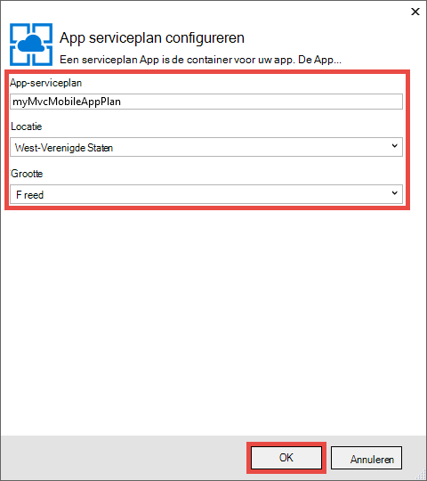
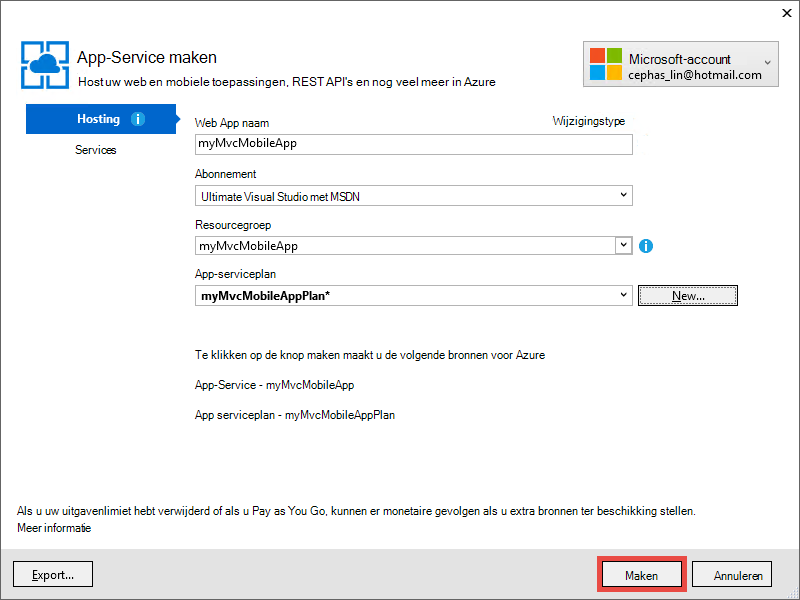

<properties 
    pageTitle="Een ASP.NET MVC 5 mobiele web app in Azure App Service implementeren" 
    description="Een zelfstudie leert u hoe u een web app met Azure App Service implementeren met mobiele functies van ASP.NET MVC 5-webtoepassing." 
    services="app-service" 
    documentationCenter=".net" 
    authors="cephalin" 
    manager="wpickett" 
    editor="jimbe"/>

<tags 
    ms.service="app-service" 
    ms.workload="na" 
    ms.tgt_pltfrm="na" 
    ms.devlang="dotnet" 
    ms.topic="article" 
    ms.date="01/12/2016" 
    ms.author="cephalin;riande"/>

# Een ASP.NET MVC 5 mobiele web app in Azure App Service implementeren

In deze zelfstudie leert u de basisbeginselen van het bouwen van een ASP.NET MVC 5 web app die mobiel vriendelijk is en deze implementeren in Azure App-Service. Voor deze zelfstudie, moet u [Visual Studio Express 2013 voor Web] [ Visual Studio Express 2013] of de professional edition van Visual Studio als u dat al hebt. U kunt [Visual Studio 2015] maar de schermopnamen afwijken en moet u de sjablonen ASP.NET 4.x.

[AZURE.INCLUDE [create-account-and-websites-note](../../includes/create-account-and-websites-note.md)]

## Wat u gaat bouwen

Voor deze zelfstudie, zult u mobiele functies toevoegen aan eenvoudige conferentie-aanvraag voor een vermelding die wordt verstrekt in de [starter project][StarterProject]. Het volgende screenshot toont de ASP.NET-sessies in de voltooide toepassing, zoals weergegeven in de browser-emulator in Internet Explorer 11 F12 ontwikkelhulpprogramma's.

![][FixedSessionsByTag]

Kunt u de ontwikkelhulpprogramma's van Internet Explorer 11 F12 en het [hulpprogramma Fiddler] [ Fiddler] om de toepassing te debuggen. 

## Vaardigheden u leert

Dit is wat u leert:

-   Het gebruik van Visual Studio 2013 voor het publiceren van uw webtoepassing rechtstreeks naar een web app in Azure App-Service.
-   Hoe de ASP.NET MVC 5 sjablonen Bootstrap CSS-framework gebruiken voor het verbeteren van de weergave op mobiele apparaten
-   Hoe specifieke mobiele weergaven maken om te richten op bepaalde mobiele browsers, zoals de iPhone en Android
-   Het maken van reactieve weergaven (views die op verschillende browsers verschillende apparaten reageren)

## De ontwikkelomgeving instellen

Instellen van uw ontwikkelomgeving door de Azure SDK installeren voor .NET 2.5.1 of hoger. 

1. Klik op de onderstaande koppeling om de Azure SDK voor .NET. Als u geen Visual Studio 2013 nog is geïnstalleerd, wordt deze geïnstalleerd door de koppeling. Deze zelfstudie vereist Visual Studio 2013. [Azure SDK voor Visual Studio 2013][AzureSDKVs2013]
1. In het venster Web Platform Installer, klikt u op **installeren** en ga verder met de installatie.

U moet ook een mobiele browser-emulator. Een van de volgende werken:

-   Browser-Emulator in [Internet Explorer 11 F12 ontwikkelprogramma's] [ EmulatorIE11] (gebruikt in alle mobiele browser screenshots). Gebruiker-agent-tekenreeks voorinstellingen is voor Windows Phone 8 en Windows Phone 7 de iPad van Apple.
-   Browser-Emulator in [Google Chrome DevTools][EmulatorChrome]. Voorinstellingen voor vele Android apparaten, alsmede Apple iPhone, Apple iPad en Amazon Kindle Fire bevat. Deze emuleert gebeurtenissen touch ook.
-   [Opera mobiele Emulator][EmulatorOpera]

Visual Studio-projecten met een C\# broncode zijn beschikbaar bij dit onderwerp:

-   [Download voor project Starter][StarterProject]
-   [Download voor project voltooid][CompletedProject]

##De starter project implementeren op een Azure web app.

1.  Downloaden van de Conferentie aanbieding toepassing [starter project][StarterProject].

2.  Klik in Windows Verkenner met de rechtermuisknop op het gedownloade ZIP-bestand en kies *Eigenschappen*.

3.  Kies in het dialoogvenster **Eigenschappen van** de knop **deblokkeren** . (Opheffen van de blokkering wordt voorkomen dat een waarschuwing dat optreedt wanneer u probeert een *.zip-* bestand dat u hebt gedownload van het web.)

4.  Klik met de rechtermuisknop op het ZIP-bestand en selecteer **Alles uitpakken** voor het uitpakken van het bestand. 

5.  Open het bestand *C#\Mvc5Mobile.sln* in Visual Studio.

6.  In de Solution Explorer met de rechtermuisknop op het project en klik op **publiceren**.

    ![][DeployClickPublish]

7.  In het Web publiceren, klikt u op **Microsoft Azure App-Service**.

    ![][DeployClickWebSites]

8.  Als u al Azure nog niet hebt aangemeld, klikt u op **een account toevoegen**.

    ![][DeploySignIn]

9.  Volg de aanwijzingen om aan te melden bij uw account Azure.

11. Het dialoogvenster App Service moet laten u nu zien als u ingelogd. Klik op **Nieuw**.

    ![][DeployNewWebsite]  

12. Geef in het veld **Naam van Web App** een voorvoegsel uniek app. Uw volledige web app naam * &lt;prefix >*. azurewebsites.net. Ook selecteren of de naam van een nieuwe resource in een **resourcegroep**opgeven. Klik vervolgens op **Nieuw** om een nieuwe App Service plan te maken.

    ![][DeploySiteSettings]

13. Het nieuwe plan voor App-Service configureren en klik op **OK**. 

    

13. Klik op **maken**in het dialoogvenster App-Service maken.

     

13. Na de Azure worden resources gemaakt, het Web publiceren dialoogvenster met de instellingen voor de nieuwe toepassing wordt ingevuld. Klik op **publiceren**.

    ![][DeployPublishSite]

    Als Visual Studio is voltooid het starter project publiceren naar de Azure web app, de desktop browser wordt geopend met de live web app weergeven.

14. Start de emulator mobiele browser, kopieert u de URL voor de toepassing van de Conferentie (*<prefix>*. azurewebsites.net) in de emulator, en klik op de knop rechts bovenaan en selecteer **Zoeken op label**. Als u Internet Explorer 11 als standaardbrowser gebruikt, hoeft u slechts te typen `F12`, vervolgens `Ctrl+8`, en wijzig het profiel van de browser in **Windows Phone**. De onderstaande afbeelding ziet de weergave van *AllTags* in de modus Staand (van **Bladeren door code**te kiezen).

    ![][AllTags]

>[AZURE.TIP] Terwijl u uw toepassing MVC 5 vanuit Visual Studio opsporen kunt, kunt u uw web app publiceren naar Azure opnieuw om te controleren of de live web app rechtstreeks vanaf uw mobiele browser of een browser-emulator.

De weergave is erg leesbaar is op een mobiel apparaat. Ook al ziet u enkele visuele effecten toegepast door het Bootstrap-CSS framework.
Klik op de koppeling van **ASP.NET** .

![][SessionsByTagASP.NET]

Het ASP.NET-code is in-/ uitzoomen op het scherm Bootstrap automatisch voor u wordt gemonteerd. Echter, kunt u deze weergave nog verder aanpassen van de mobiele browser verbeteren. De kolom **datum** is bijvoorbeeld moeilijk te lezen. Later in de zelfstudie wijzigt u de weergave van de *AllTags* zodat het mobile-friendly.

##Bootstrap CSS-Framework

Nieuw in de 5 MVC is sjabloon ingebouwde ondersteuning voor Bootstrap. U hebt reeds gezien hoe direct verbetert de verschillende weergaven in uw toepassing. De navigatiebalk aan de bovenkant is automatisch inklapbaar de browser breedte kleiner is. Wijzig het formaat van het browservenster en zien hoe de navigatiebalk verandert het uiterlijk van de desktop browser. Dit is de responsief webontwerp die is ingebouwd in de Bootstrap.

Openen als u wilt zien hoe de Web app zou zonder de Bootstrap, *App\_Start\\BundleConfig.cs* en het commentaar van de regels die *bootstrap.js* en *bootstrap.css*bevatten. De volgende code ziet u de laatste twee overzichten van de `RegisterBundles` methode na de wijziging:

     bundles.Add(new ScriptBundle("~/bundles/bootstrap").Include(
              //"~/Scripts/bootstrap.js",
              "~/Scripts/respond.js"));

    bundles.Add(new StyleBundle("~/Content/css").Include(
              //"~/Content/bootstrap.css",
              "~/Content/site.css"));

Druk op `Ctrl+F5` voor de toepassing.

Bekijk de inklapbare navigatiebalk is nu gewoon een normale niet-geordende lijst. **Blader door tag** klikt u opnieuw op en klik vervolgens op **ASP.NET**.
In de emulatorweergave mobiele ziet u nu dat u opzij schuiven moet om te zien aan de rechterkant van de tabel en het is niet langer op het scherm in-/ uitzoomen gemonteerd.

![][SessionsByTagASP.NETNoBootstrap]

Uw wijzigingen ongedaan maken en vernieuwen van de mobiele browser om te controleren of het beeldscherm van de mobiele-vriendelijke is hersteld.

Bootstrap is niet specifiek voor ASP.NET MVC 5 en kunt u profiteren van deze functies in een webtoepassing. Maar is nu ingebouwd in de projectsjabloon ASP.NET MVC 5 zodat uw webtoepassing MVC 5 van de Bootstrap standaard profiteren kan.

Voor meer informatie over de Bootstrap, gaat u naar de [Bootstrap] [ BootstrapSite] site.

In het volgende gedeelte ziet u hoe u specifieke weergaven mobiele browser.

##De weergaven, indelingen en gedeeltelijke weergave overschrijven

U kunt een willekeurige weergave (inclusief lay-outs en gedeeltelijke weergaven) voor mobiele browsers in het algemeen voor een afzonderlijke mobiele browser, of voor een bepaalde browser overschrijven. U kunt voor een specifieke mobiele weergave kopiëren van een bestand weergeven en *toevoegen. Mobiele* aan de bestandsnaam. Bijvoorbeeld, een mobiele weergave van de *Index* wilt maken, kunt u *weergaven\\Home\\Index.cshtml* te *weergaven\\Home\\Index.Mobile.cshtml*.

In dit gedeelte maakt u een indelingsbestand mobile-specifieke.

Kopiëren starten, *weergaven\\gedeelde\\\_Layout.cshtml* te *weergaven\\gedeelde\\\_Layout.Mobile.cshtml*. Open * \_Layout.Mobile.cshtml* en wijzig de titel van **Toepassing voor MVC5** in **MVC5 toepassing (mobiel)**.

In elk `Html.ActionLink` voor de navigatiebalk bel, 'Bladeren door' in de *ActionLink*van elke koppeling verwijderen. De volgende code ziet u de voltooide `<ul class="nav navbar-nav">` code van het bestand mobiele lay-out.

    <ul class="nav navbar-nav">
        <li>@Html.ActionLink("Home", "Index", "Home")</li>
        <li>@Html.ActionLink("Date", "AllDates", "Home")</li>
        <li>@Html.ActionLink("Speaker", "AllSpeakers", "Home")</li>
        <li>@Html.ActionLink("Tag", "AllTags", "Home")</li>
    </ul>

Kopie de *weergaven\\Home\\AllTags.cshtml* van het bestand in *weergaven\\Home\\AllTags.Mobile.cshtml*. Open het nieuwe bestand en wijzig de `<h2>` -element van de "Tags" naar "Tags (M)":

    <h2>Tags (M)</h2>

Blader naar de pagina labels met behulp van een desktop browser en het gebruik van de mobiele browser-emulator. Ziet u de twee wijzigingen in de mobiele browser-emulator (de titel van * \_Layout.Mobile.cshtml* en de titel van *AllTags.Mobile.cshtml*).

![][AllTagsMobile_LayoutMobile]

Het beeldscherm is daarentegen niet gewijzigd (met de titels van * \_Layout.cshtml* en *AllTags.cshtml*).

![][AllTagsMobile_LayoutMobileDesktop]

##Browser-specifieke weergaven maken

U kunt naast de specifieke mobile en desktop-specifieke weergaven voor een afzonderlijke browser maken. U kunt bijvoorbeeld weergaven die specifiek voor de iPhone of de Android-browser zijn maken. In dit gedeelte maakt u een lay-out voor de iPhone-browser en een iPhone-versie van de weergave van de *AllTags* .

Open het bestand *Global.asax* en voeg de volgende code aan de onderkant van de `Application_Start` methode.

    DisplayModeProvider.Instance.Modes.Insert(0, new DefaultDisplayMode("iPhone")
    {
        ContextCondition = (context => context.GetOverriddenUserAgent().IndexOf
            ("iPhone", StringComparison.OrdinalIgnoreCase) >= 0)
    });

Deze code definieert een nieuwe modus genaamd "iPhone", die wordt vergeleken met de inkomende aanvragen. Als de binnenkomende aanvraag voldoet aan de voorwaarde die u hebt gedefinieerd (als de gebruikersagent bevat de tekenreeks 'iPhone'), zoekt ASP.NET MVC weergaven waarvan de naam het achtervoegsel "iPhone" bevat.

>[AZURE.NOTE] Wanneer u mobiele browser-specifieke weergavemodi toevoegt, zoals iPhone en Android, zorg dat het eerste argument ingesteld op `0` (Voeg boven aan de lijst) om ervoor te zorgen dat de browser-specifieke modus voorrang heeft op het mobile-sjabloon (*. Mobile.cshtml). Als de sjabloon mobiele boven aan de lijst in plaats daarvan, wordt deze geselecteerd via de beoogde modus (de eerste overeenkomst wins en de sjabloon mobiele komt overeen met alle mobiele browsers). 

Met de rechtermuisknop in de code, `DefaultDisplayMode`, kies **omzetten**en kies `using System.Web.WebPages;`. Hiermee wordt een verwijzing naar de `System.Web.WebPages` naamruimte, is de locatie de `DisplayModeProvider` en `DefaultDisplayMode` typen zijn gedefinieerd.

![][ResolveDefaultDisplayMode]

U kunt ook gewoon handmatig toevoegen de volgende regel om de `using` sectie van het bestand.

    using System.Web.WebPages;

De wijzigingen worden opgeslagen. Kopie de *weergaven\\gedeelde\\\_Layout.Mobile.cshtml* van het bestand in *weergaven\\gedeelde\\\_Layout.iPhone.cshtml*. Open het nieuwe bestand en wijzig de titel van `MVC5 Application (Mobile)` op `MVC5 Application (iPhone)`.

Kopie de *weergaven\\Home\\AllTags.Mobile.cshtml* van het bestand in *weergaven\\Home\\AllTags.iPhone.cshtml*. In het nieuwe bestand, wijzigt u de `<h2>` element van "Tags (M)" 'Labels (iPhone)'.

De toepassing wordt uitgevoerd. Een mobiele browser-emulator worden uitgevoerd, controleert u of dat de gebruikersagent is ingesteld op 'iPhone' en Ga naar de weergave *AllTags* . Als u de emulator in Internet Explorer 11 F12 ontwikkelprogramma's gebruikt, configureert u de emulatie van de volgende:

-   Browser profiel = **Windows Phone**
-   Tekenreeks van de gebruikersagent = **aangepast**
-   Aangepaste tekenreeks **Apple-iPhone5C1/1001.525** =

Het volgende screenshot toont het *AllTags* beeld weergegeven in de emulator in Internet Explorer 11 F12 ontwikkelprogramma's met de aangepaste tekenreeks van de gebruikersagent (dit is een tekenreeks van de gebruikersagent iPhone 5 C).

![][AllTagsIPhone_LayoutIPhone]

Selecteer de koppeling van de **luidsprekers** in de mobiele browser. Omdat er niet een mobiele weergave (*AllSpeakers.Mobile.cshtml*), de standaardweergave luidsprekers (*AllSpeakers.cshtml*) wordt weergegeven met behulp van de mobiele weergave (*\_Layout.Mobile.cshtml*). Zoals hieronder wordt weergegeven, de titel **MVC5 toepassing (mobiel)** is gedefinieerd in * \_Layout.Mobile.cshtml*.

![][AllSpeakers_LayoutMobile]

Globaal kunt u een standaardweergave (niet-mobiele) uit de weergave in een mobiele indeling uitschakelen door `RequireConsistentDisplayMode` voor `true` in de *weergaven\\\_ViewStart.cshtml* -bestand, als volgt:

    @{
        Layout = "~/Views/Shared/_Layout.cshtml";
        DisplayModeProvider.Instance.RequireConsistentDisplayMode = true;
    }

Wanneer `RequireConsistentDisplayMode` is ingesteld op `true`, de mobiele lay-out (*\_Layout.Mobile.cshtml*) wordt alleen gebruikt voor mobiele weergaven (dat wil zeggen als de weergave van het formulier * **viewnaam is**. Mobile.cshtml*). U wilt instellen `RequireConsistentDisplayMode` naar `true` als uw mobiele lay-out niet goed met de niet-mobiele weergaven werkt. Het screenshot hieronder toont hoe *luidsprekers* behalve wanneer `RequireConsistentDisplayMode` is ingesteld op `true` (zonder de tekenreeks "(mobiel)" in de navigatie balk aan de bovenkant).

![][AllSpeakers_LayoutMobileOverridden]

Kunt u consistente weergavemodus in een bepaalde weergave uitschakelen door `RequireConsistentDisplayMode` voor `false` in het bestand weergeven. De volgende opmaak in de *weergaven\\Home\\AllSpeakers.cshtml* wordt het bestand `RequireConsistentDisplayMode` te `false`:

    @model IEnumerable<string>

    @{
        ViewBag.Title = "All speakers";
        DisplayModeProvider.Instance.RequireConsistentDisplayMode = false;
    }

In deze sectie hebben we gezien mobiele indelingen en weergaven maken en het maken van lay-outs en weergaven voor specifieke apparaten zoals de iPhone.
Het belangrijkste voordeel van het Bootstrap-CSS-kader is echter de responsieve lay-out, wat betekent dat een enkele stylesheet kan worden toegepast op het bureaublad, telefoon en tablet browsers voor het maken van een consistent uiterlijk. In het volgende gedeelte ziet u hoe gebruikmaken van de Bootstrap om mobile-friendly weergaven maken.

##Verbetering van de lijst van de luidsprekers

Zoals u zojuist hebt gezien, wordt de weergave van de *luidsprekers* kan worden gelezen, maar de koppelingen zijn klein en moeilijk te tikken op een mobiel apparaat. In dit gedeelte maakt u de weergave van de *AllSpeakers* mobile-friendly die grote, gemakkelijk te tikken koppelingen worden weergegeven en bevat een zoekvak om snel te zoeken luidsprekers.

U kunt de Bootstrap [groep gekoppelde lijst][] opmaken voor het verbeteren van de weergave van de *luidsprekers* . In *weergaven\\Home\\AllSpeakers.cshtml*, de inhoud van het bestand Razor vervangen door de onderstaande code.

     @model IEnumerable<string>

    @{
        ViewBag.Title = "All Speakers";
    }

    <h2>Speakers</h2>

    

        @foreach (var speaker in Model)
        {
            @Html.ActionLink(speaker, "SessionsBySpeaker", new { speaker }, new { @class = "list-group-item" })
        }
    

De `class="list-group"` van het kenmerk de `
` code past de stijl lijst Bootstrap en de `class="input-group-item"` kenmerk Bootstrap lijst item opmaak wordt toegepast op elke koppeling.

De mobiele browser vernieuwen. De weergave van bijgewerkte ziet er zo uit:

![][AllSpeakersFixed]

De vormgeving van de Bootstrap [gekoppelde lijstgroep][] wordt het hele vak voor elke koppeling klikbaar, dat een veel betere ervaring is. Overschakelen naar de weergave van het bureaublad en houd rekening met de consistente uitstraling.

![][AllSpeakersFixedDesktop]

De mobiele browser-weergave is verbeterd, is het moeilijk om te navigeren van de lange lijst van luidsprekers. Bootstrap biedt een search filter functionaliteit out-of-the-box niet, maar kunt u deze met een paar regels code toevoegen. U wordt eerst een zoekvak toevoegen aan de weergave vervolgens aansluiten met de JavaScript-code voor de filter-functie. In *weergaven\\Home\\AllSpeakers.cshtml*, voegen een \<formulier\> code vlak na de \<h2\> labels, zoals hieronder wordt weergegeven:

    @model IEnumerable<string>

    @{
        ViewBag.Title = "All Speakers";
    }

    <h2>Speakers</h2>

    <form class="input-group">
        
        <input type="text" class="form-control" placeholder="Search speaker">
    </form>
     
    

        @foreach (var speaker in Model)
        {
            @Html.ActionLink(speaker, 
                             "SessionsBySpeaker", 
                             new { speaker }, 
                             new { @class = "list-group-item" })
        }
    

Merk op dat de `<form>` en `<input>` beide codes hebben de Bootstrap stijlen zijn toegepast. De `` element een Bootstrap- [glyphicon][] toegevoegd aan het zoekvak.

In de map *Scripts* toevoegen een JavaScript-bestand *filter.js*aangeroepen. Open het bestand en plak de volgende code in het:

    $(function () {

        // reset the search form when the page loads
        $("form").each(function () {
            this.reset();
        });

        // wire up the events to the <input> element for search/filter
        $("input").bind("keyup change", function () {
            var searchtxt = this.value.toLowerCase();
            var items = $(".list-group-item");

            // show all speakers that begin with the typed text and hide others
            for (var i = 0; i < items.length; i++) {
                var val = items[i].text.toLowerCase();
                val = val.substring(0, searchtxt.length);
                if (val == searchtxt) {
                    $(items[i]).show();
                }
                else {
                    $(items[i]).hide();
                }
            }
        });
    });

U moet ook filter.js opnemen in uw geregistreerde bundels. Open *App\_Start\\BundleConfig.cs* en wijzigt u de eerste bundels. Wijzigen van de eerste `bundles.Add` -instructie (voor de **jquery** -bundel) op te nemen *Scripts\\filter.js*, als volgt:

     bundles.Add(new ScriptBundle("~/bundles/jquery").Include(
                "~/Scripts/jquery-{version}.js",
                "~/Scripts/filter.js"));

De bundel **jquery** al wordt weergegeven door de standaard * \_lay-out* weergeven. Later kunt u dezelfde code JavaScript om de filterfunctionaliteit wordt toegepast naar andere lijstweergaven gebruiken.

Vernieuwen van de mobiele browser en Ga naar de weergave van de *AllSpeakers* . Typ in het zoekvak 'sc'. De lijst van de luidsprekers moet nu worden gefilterd op basis van uw tekenreeks.

![][AllSpeakersFixedSearchBySC]

##Verbetering van de lijst labels

Als de *luidsprekers* in de weergave de weergave met *Tags* leesbaar is, maar de koppelingen zijn klein en moeilijk te tikken op een mobiel apparaat. U kunt de weergave van *labels* oplossen dezelfde manier als u de weergave *luidsprekers* oplossen als u de codewijzigingen die eerder zijn beschreven, maar met de volgende `Html.ActionLink` in syntaxis van de methode *weergaven\\Home\\AllTags.cshtml*:

    @Html.ActionLink(tag, 
                     "SessionsByTag", 
                     new { tag }, 
                     new { @class = "list-group-item" })

De vernieuwde desktop browser ziet er als volgt uit:

![][AllTagsFixedDesktop]

En de vernieuwde mobiele browser er als volgt uit: 

![][AllTagsFixed]

>[AZURE.NOTE] Als u merkt dat de oorspronkelijke lijstopmaak er nog in de mobiele browser en vraagt zich af wat is er gebeurd met de mooie vormgeving van de Bootstrap, is dit een onderdeel van uw eerdere actie mobiele specifieke weergaven maken. Nu dat u de Bootstrap CSS-framework gebruikt voor het maken van een responsief webontwerp, hoofd gaan en deze specifieke mobiele weergaven en de mobile-specifieke lay-out verwijderen. Nadat u dit hebt gedaan, wordt het vernieuwde mobiele browser de Bootstrap stijl weergegeven.

##Verbetering van de lijst met datums

U kunt de weergave van *datums* verbeteren als u de *luidsprekers* en *Tags* weergaven verbeterd als u de codewijzigingen die eerder zijn beschreven, maar met de volgende `Html.ActionLink` in syntaxis van de methode *weergaven\\Home\\AllDates.cshtml*:

    @Html.ActionLink(date.ToString("ddd, MMM dd, h:mm tt"), 
                     "SessionsByDate", 
                     new { date }, 
                     new { @class = "list-group-item" })

U krijgt een mobiele browser vernieuwd weergave zoals deze:

![][AllDatesFixed]

U kunt de weergave van *datums* verder verbeteren door het organiseren van de datum / tijd-waarden op datum. Dit kan worden gedaan en de Bootstrap [deelvensters][] vormgeving. De inhoud van de *weergaven\\Home\\AllDates.cshtml* -bestand met de volgende code:

    @model IEnumerable<DateTime>

    @{
        ViewBag.Title = "All Dates";
    }

    <h2>Dates</h2>

    @foreach (var dategroup in Model.GroupBy(x=>x.Date))
    {
        

            

                @dategroup.Key.ToString("ddd, MMM dd")
            

            

                @foreach (var date in dategroup)
                {
                    @Html.ActionLink(date.ToString("h:mm tt"), 
                                     "SessionsByDate", 
                                     new { date }, 
                                     new { @class = "list-group-item" })
                }
            

        

    }

Deze code maakt u een afzonderlijke `
` code voor elke afzonderlijke datum in de lijst en maakt gebruik van de [gekoppelde lijstgroep][] voor de respectieve koppelingen als voorheen. Hier ziet u hoe de mobiele browser uitziet wanneer deze code wordt uitgevoerd:

![][AllDatesFixed2]

Ga naar de desktop browser. Opmerking, consistent uiterlijk.

![][AllDatesFixed2Desktop]

##De weergave van de SessionsTable verbeteren

In dit gedeelte maakt u de weergave van de *SessionsTable* mobile friendly. Deze wijziging is uitgebreider eerdere wijzigingen.

In de mobiele browser, tikt u op de knop **label** , voert u `asp` in het zoekvak.

![][AllTagsFixedSearchByASP]

Tik op de **ASP.NET** -koppeling.

![][SessionsTableTagASP.NET]

Zoals u ziet, wordt de weergave opgemaakt als een tabel, die op dit moment is ontworpen om te worden weergegeven in de browser van het bureaublad. Het is echter een beetje moeilijk te lezen op een mobiele browser. U kunt dit oplossen, opent u *weergaven\\Home\\SessionsTable.cshtml* en vervolgens de inhoud van het bestand vervangen door de volgende code:

    @model IEnumerable<Mvc5Mobile.Models.Session>

    <h2>@ViewBag.Title</h2>

    

        

            @foreach (var session in Model)
            {
                

                    

                        @Html.ActionLink(session.Title, 
                                         "SessionByCode", 
                                         new { session.Code }, 
                                         new { @class="list-group-item active" })
                        

                            

                                @Html.Partial("_SpeakersLinks", session)
                            

                            

                                @session.DateText
                            

                            

                                @Html.Partial("_TagsLinks", session)
                            

                        

                    

                

            }
        

    

De code doet 3 dingen:

-   gebruikt de Bootstrap [gekoppelde lijst aangepaste groep][] notatie de sessiegegevens verticaal, zodat deze informatie kan gelezen op een mobiele browser worden (met klassen als lijst groep-object tekst)
-   het [rastersysteem][] geldt voor de lay-out, zodat de sessie-items horizontaal laten doorlopen in de browser voor desktop en verticaal in de mobiele browser (met behulp van de klasse col-md-4)
-   de [responsieve hulpprogramma's][] gebruikt om de labels van de sessie weergegeven in de mobiele browser (met behulp van de klasse verborgen xs) verbergen

U kunt ook een Titelkoppeling naar de desbetreffende sessie tikken. De onderstaande afbeelding bevat de codewijzigingen.

![][FixedSessionsByTag]

Het Bootstrap rastersysteem dat u automatisch wordt toegepast worden de sessies in de mobiele browser verticaal gerangschikt. U ziet ook dat de codes niet worden weergegeven. Ga naar de desktop browser.

![][SessionsTableFixedTagASP.NETDesktop]

In de desktop browser, ziet u de tags worden nu weergegeven. U kunt ook zien dat het Bootstrap rastersysteem dat u toegepast de sessie-items in twee kolommen rangschikt. Als u de browser vergroot, ziet u dat de regeling wordt gewijzigd in drie kolommen.

##De weergave van de SessionByCode verbeteren

Ten slotte kunt u de weergave van de *SessionByCode* zodat het mobile-friendly verhelpen.

In de mobiele browser, tikt u op de knop **label** , voert u `asp` in het zoekvak.

![][AllTagsFixedSearchByASP]

Tik op de **ASP.NET** -koppeling. Sessies voor de ASP.NET-tag worden weergegeven.

![][FixedSessionsByTag]

Kies de koppeling voor het **bouwen van de toepassing van een enkele pagina met ASP.NET en AngularJS** .

![][SessionByCode3-644]

De standaardweergave van de pc werkt prima, maar kunt u eenvoudig het uiterlijk verbeteren met behulp van enkele onderdelen van het Bootstrap-GUI.

Open *weergaven\\Home\\SessionByCode.cshtml* en de inhoud vervangen door de volgende opmaak:

    @model Mvc5Mobile.Models.Session

    @{
        ViewBag.Title = "Session details";
    }
    <h3>@Model.Title (@Model.Code)</h3>
    

        <strong>@Model.DateText</strong> in <strong>@Model.Room</strong>
    

    

        

            Speakers
        

        @foreach (var speaker in Model.Speakers)
        {
            @Html.ActionLink(speaker, 
                             "SessionsBySpeaker", 
                             new { speaker }, 
                             new { @class="panel-body" })
        }
    

    
@Model.Abstract

    

        

            Tags
        

        @foreach (var tag in Model.Tags)
        {
            @Html.ActionLink(tag, 
                             "SessionsByTag", 
                             new { tag }, 
                             new { @class = "panel-body" })
        }
    

De nieuwe opmaak wordt gebruikt voor Bootstrap panelen ter verbetering van de mobiele weergave opmaken. 

De mobiele browser vernieuwen. De volgende afbeelding geeft de codewijzigingen die u zojuist hebt gemaakt:

![][SessionByCodeFixed3-644]

## Inpakken en bekijken

Deze zelfstudie is gebleken hoe u ASP.NET MVC 5 om mobile-friendly webtoepassingen te ontwikkelen. Deze omvatten:

-   Een toepassing van ASP.NET MVC 5 aan een web app App-Service.
-   Gebruik de Bootstrap responsieve weblay-out maken in uw toepassing MVC 5
-   Vervangen van lay-out, weergaven en gedeeltelijke weergaven, globaal en voor de weergave van een afzonderlijke
-   Indeling voor besturingselementen als gedeeltelijk overschrijven afdwingen met behulp van de `RequireConsistentDisplayMode` eigenschap
-   Weergaven die gericht zijn op specifieke browsers, zoals de iPhone browser maken
-   Bootstrap opmaaktaken in code Razor toepassen

## Zie ook

-   [9 grondbeginselen van responsief webontwerp](http://blog.froont.com/9-basic-principles-of-responsive-web-design/)
-   [Bootstrap][BootstrapSite]
-   [Officiële Bootstrap Blog][]
-   [Twitter Bootstrap zelfstudie van zelfstudie Republiek][]
-   [De Bootstrap Speelplaats][]
-   [Aanbevolen procedures voor W3C aanbeveling mobiele Web Application][]
-   [Aanbeveling van W3C kandidaat voor query's media][]

## Wat er veranderd
* Zie voor een handleiding voor het wijzigen van Websites met App-Service: [Azure App Service en de Impact op de bestaande Azure Services](http://go.microsoft.com/fwlink/?LinkId=529714)

<!-- Internal Links -->
[Deploy the starter project to an Azure web app]: #bkmk_DeployStarterProject
[Bootstrap CSS Framework]: #bkmk_bootstrap
[Override the Views, Layouts, and Partial Views]: #bkmk_overrideviews
[Create Browser-Specific Views]:#bkmk_browserviews
[Improve the Speakers List]: #bkmk_Improvespeakerslist
[Improve the Tags List]: #bkmk_improvetags
[Improve the Dates List]: #bkmk_improvedates
[Improve the SessionsTable View]: #bkmk_improvesessionstable
[Improve the SessionByCode View]: #bkmk_improvesessionbycode

<!-- External Links -->
[Visual Studio Express 2013]: http://www.visualstudio.com/downloads/download-visual-studio-vs#d-express-web
[Visual Studio 2015]: https://www.visualstudio.com/downloads/download-visual-studio-vs
[AzureSDKVs2013]: http://go.microsoft.com/fwlink/p/?linkid=323510&clcid=0x409
[Fiddler]: http://www.fiddler2.com/fiddler2/
[EmulatorIE11]: http://msdn.microsoft.com/library/ie/dn255001.aspx
[EmulatorChrome]: https://developers.google.com/chrome-developer-tools/docs/mobile-emulation
[EmulatorOpera]: http://www.opera.com/developer/tools/mobile/
[StarterProject]: http://go.microsoft.com/fwlink/?LinkID=398780&clcid=0x409
[CompletedProject]: http://go.microsoft.com/fwlink/?LinkID=398781&clcid=0x409
[BootstrapSite]: http://getbootstrap.com/
[WebPIAzureSdk23NetVS13]: ./media/web-sites-dotnet-deploy-aspnet-mvc-mobile-app/WebPIAzureSdk23NetVS13.png
[gekoppelde lijstgroep]: http://getbootstrap.com/components/#list-group-linked
[glyphicon]: http://getbootstrap.com/components/#glyphicons
[panelen]: http://getbootstrap.com/components/#panels
[aangepaste met gekoppelde lijstgroep]: http://getbootstrap.com/components/#list-group-custom-content
[raster]: http://getbootstrap.com/css/#grid
[responsieve hulpprogramma 's]: http://getbootstrap.com/css/#responsive-utilities
[Officiële Bootstrap Blog]: http://blog.getbootstrap.com/
[Twitter Bootstrap zelfstudie van zelfstudie Republiek]: http://www.tutorialrepublic.com/twitter-bootstrap-tutorial/
[De Bootstrap Speelplaats]: http://www.bootply.com/
[Aanbevolen procedures voor W3C aanbeveling mobiele Web Application]: http://www.w3.org/TR/mwabp/
[Aanbeveling van W3C kandidaat voor query's media]: http://www.w3.org/TR/css3-mediaqueries/

<!-- Images -->
[DeployClickPublish]: ./media/web-sites-dotnet-deploy-aspnet-mvc-mobile-app/deploy-to-azure-website-1.png
[DeployClickWebSites]: ./media/web-sites-dotnet-deploy-aspnet-mvc-mobile-app/deploy-to-azure-website-2.png
[DeploySignIn]: ./media/web-sites-dotnet-deploy-aspnet-mvc-mobile-app/deploy-to-azure-website-3.png
[DeployUsername]: ./media/web-sites-dotnet-deploy-aspnet-mvc-mobile-app/deploy-to-azure-website-4.png
[DeployPassword]: ./media/web-sites-dotnet-deploy-aspnet-mvc-mobile-app/deploy-to-azure-website-5.png
[DeployNewWebsite]: ./media/web-sites-dotnet-deploy-aspnet-mvc-mobile-app/deploy-to-azure-website-6.png
[DeploySiteSettings]: ./media/web-sites-dotnet-deploy-aspnet-mvc-mobile-app/deploy-to-azure-website-7.png
[DeployPublishSite]: ./media/web-sites-dotnet-deploy-aspnet-mvc-mobile-app/deploy-to-azure-website-8.png
[MobileHomePage]: ./media/web-sites-dotnet-deploy-aspnet-mvc-mobile-app/mobile-home-page.png
[FixedSessionsByTag]: ./media/web-sites-dotnet-deploy-aspnet-mvc-mobile-app/SessionsByTag-ASP.NET-Fixed.png
[AllTags]: ./media/web-sites-dotnet-deploy-aspnet-mvc-mobile-app/AllTags.png
[SessionsByTagASP.NET]: ./media/web-sites-dotnet-deploy-aspnet-mvc-mobile-app/SessionsByTag-ASP.NET.png
[SessionsByTagASP.NETNoBootstrap]: ./media/web-sites-dotnet-deploy-aspnet-mvc-mobile-app/SessionsByTag-ASP.NET-NoBootstrap.png
[AllTagsMobile_LayoutMobile]: ./media/web-sites-dotnet-deploy-aspnet-mvc-mobile-app/AllTagsMobile-_LayoutMobile.png
[AllTagsMobile_LayoutMobileDesktop]: ./media/web-sites-dotnet-deploy-aspnet-mvc-mobile-app/AllTagsMobile-_LayoutMobile-Desktop.png
[ResolveDefaultDisplayMode]: ./media/web-sites-dotnet-deploy-aspnet-mvc-mobile-app/Resolve-DefaultDisplayMode.png
[AllTagsIPhone_LayoutIPhone]: ./media/web-sites-dotnet-deploy-aspnet-mvc-mobile-app/AllTagsIPhone-_LayoutIPhone.png
[AllSpeakers_LayoutMobile]: ./media/web-sites-dotnet-deploy-aspnet-mvc-mobile-app/AllSpeakers-_LayoutMobile.png
[AllSpeakers_LayoutMobileOverridden]: ./media/web-sites-dotnet-deploy-aspnet-mvc-mobile-app/AllSpeakers-_LayoutMobile-Overridden.png
[AllSpeakersFixed]: ./media/web-sites-dotnet-deploy-aspnet-mvc-mobile-app/AllSpeakers-Fixed.png
[AllSpeakersFixedDesktop]: ./media/web-sites-dotnet-deploy-aspnet-mvc-mobile-app/AllSpeakers-Fixed-Desktop.png
[AllSpeakersFixedSearchBySC]: ./media/web-sites-dotnet-deploy-aspnet-mvc-mobile-app/AllSpeakers-Fixed-SearchBySC.png
[AllTagsFixedDesktop]: ./media/web-sites-dotnet-deploy-aspnet-mvc-mobile-app/AllTags-Fixed-Desktop.png 
[AllTagsFixed]: ./media/web-sites-dotnet-deploy-aspnet-mvc-mobile-app/AllTags-Fixed.png
[AllDatesFixed]: ./media/web-sites-dotnet-deploy-aspnet-mvc-mobile-app/AllDates-Fixed.png
[AllDatesFixed2]: ./media/web-sites-dotnet-deploy-aspnet-mvc-mobile-app/AllDates-Fixed2.png
[AllDatesFixed2Desktop]: ./media/web-sites-dotnet-deploy-aspnet-mvc-mobile-app/AllDates-Fixed2-Desktop.png
[AllTagsFixedSearchByASP]: ./media/web-sites-dotnet-deploy-aspnet-mvc-mobile-app/AllTags-Fixed-SearchByASP.png
[SessionsTableTagASP.NET]: ./media/web-sites-dotnet-deploy-aspnet-mvc-mobile-app/SessionsTable-Tag-ASP.NET.png
[SessionsTableFixedTagASP.NETDesktop]: ./media/web-sites-dotnet-deploy-aspnet-mvc-mobile-app/SessionsTable-Fixed-Tag-ASP.NET-Desktop.png
[SessionByCode3-644]: ./media/web-sites-dotnet-deploy-aspnet-mvc-mobile-app/SessionByCode-3-644.png
[SessionByCodeFixed3-644]: ./media/web-sites-dotnet-deploy-aspnet-mvc-mobile-app/SessionByCode-Fixed-3-644.png
 
