<properties
    pageTitle="Een ASP.NET-toepassing implementeren op Azure App Service met behulp van Visual Studio | Microsoft Azure"
    description="Informatie over het implementeren van een ASP.NET-webproject op een nieuwe web app in App-Azure Service, met behulp van Visual Studio."
    services="app-service\web"
    documentationCenter=".net"
    authors="tdykstra"
    manager="wpickett"
    editor=""/>

<tags
    ms.service="app-service-web"
    ms.workload="web"
    ms.tgt_pltfrm="na"
    ms.devlang="dotnet"
    ms.topic="get-started-article"
    ms.date="07/22/2016"
    ms.author="rachelap"/>

# Implementeren van een ASP.NET-webtoepassing op Azure App Service, met behulp van Visual Studio

[AZURE.INCLUDE [tabs](../../includes/app-service-web-get-started-nav-tabs.md)]

## Overzicht

Deze zelfstudie laat zien hoe een ASP.NET-webtoepassing op een [web app in Azure App-Service](app-service-web-overview.md) implementeren met behulp van Visual Studio 2015.

De zelfstudie wordt ervan uitgegaan dat u een ASP.NET-ontwikkelaar die met geen ervaring met het gebruik van Azure. Wanneer u klaar bent, hebt u een eenvoudige webtoepassing omhoog en uitgevoerd in de cloud.

U leert:

* Het maken van een nieuwe App-Service web app tijdens het maken van een nieuwe webproject in Visual Studio.
* Het implementeren van een webproject op een web App Service app met behulp van Visual Studio.

Het diagram laat zien wat u in de zelfstudie doen.

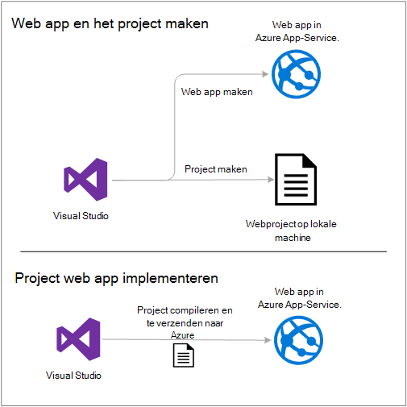

Aan het einde van de zelfstudie geeft een sectie [Troubleshooting](#troubleshooting) tips over wat te doen als er iets niet werkt en een sectie van de [volgende stappen](#next-steps) bevat koppelingen naar andere zelfstudies die in meer diepte over het gebruik van App-Service Azure.

Dit is een introductie zelfstudie, is het webproject hoe implementeren eenvoudig maakt geen gebruik van een database die geen verificatie of machtiging. Zie voor koppelingen naar onderwerpen met meer geavanceerde implementatie, [het implementeren van een Azure web app](web-sites-deploy.md).

De benodigde tijd voor de Azure SDK voor .NET installeren, met uitzondering van zal deze zelfstudie duren ongeveer 10-15 minuten.

## Vereisten

* De zelfstudie wordt ervan uitgegaan dat u hebt gewerkt met ASP.NET MVC en Visual Studio. Als u een inleiding, Zie [Aan de slag met ASP.NET MVC 5](http://www.asp.net/mvc/overview/getting-started/introduction/getting-started).

* U moet een account met Azure. U kunt [gratis Azure-account te openen](/pricing/free-trial/?WT.mc_id=A261C142F) of [activeren met Visual Studio abonnee vergoedingen](/pricing/member-offers/msdn-benefits-details/?WT.mc_id=A261C142F). 

    Als u aan de slag met Azure App-Service wilt voordat u zich voor een account met Azure aanmeldt, gaat u naar de [App-Service probeert](http://go.microsoft.com/fwlink/?LinkId=523751). U kunt er een tijdelijk starter app maken in App-Service — geen creditcard vereist en geen verplichtingen.

## De ontwikkelomgeving instellen

De zelfstudie is geschreven voor Visual Studio 2015 met de [SDK voor .NET Azure](../dotnet-sdk.md) 2,9 of hoger. 

* [Download de meest recente Azure SDK voor Visual Studio 2015](http://go.microsoft.com/fwlink/?linkid=518003). De SDK installeert Visual Studio 2015 als u nog geen hebt.

    >[AZURE.NOTE] Afhankelijk van hoeveel van de SDK-afhankelijkheden er al op uw computer, kan installeert de SDK lang duren, van enkele minuten tot een half uur of meer.

Als u beschikt over Visual Studio 2013 en de voorkeur geeft aan dat, kunt u [downloaden van de nieuwste Azure SDK voor Visual Studio 2013](http://go.microsoft.com/fwlink/?LinkID=324322). Sommige schermen kunnen er anders uitzien dan de illustraties.

## Configureer een nieuwe webproject

Uw volgende stap is het maken van een webproject in Visual Studio en een web app in Azure App-Service. In deze sectie van de handleiding configureert u het nieuwe webproject. 

1. Open de Visual Studio 2015.

2. Klik op **Bestand > Nieuw > Project**.

3. Klik in het dialoogvenster **Nieuw Project** **Visual C# > Web > ASP.NET Web Application**.

3. Zorg ervoor dat **.NET Framework 4.5.2** is geselecteerd als de target-kader.

4.  [Azure toepassing inzichten](../application-insights/app-insights-overview.md) bewaakt uw web app voor beschikbaarheid, prestaties en het gebruik. De **Inzichten van toepassing toevoegen aan Project** selectievakje door standaard de eerste keer dat u een webproject maken na de installatie van Visual Studio. Schakel het selectievakje in als deze optie geselecteerd, maar u niet wilt proberen de inzichten van toepassing.

4. Naam van de toepassing **MyExample**en klik vervolgens op **OK**.

    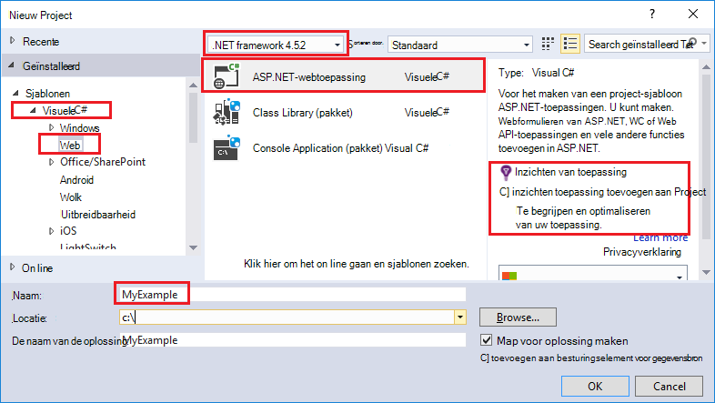

5. Klik in het dialoogvenster **Nieuw Project voor ASP.NET** de **MVC** sjabloon selecteren en klik op **Verificatie wijzigen**.

    U implementeert een ASP.NET MVC web-project voor deze zelfstudie. Zie de sectie [volgende stappen](#next-steps) als u voor meer informatie over het implementeren van een project voor ASP.NET Web API. 

    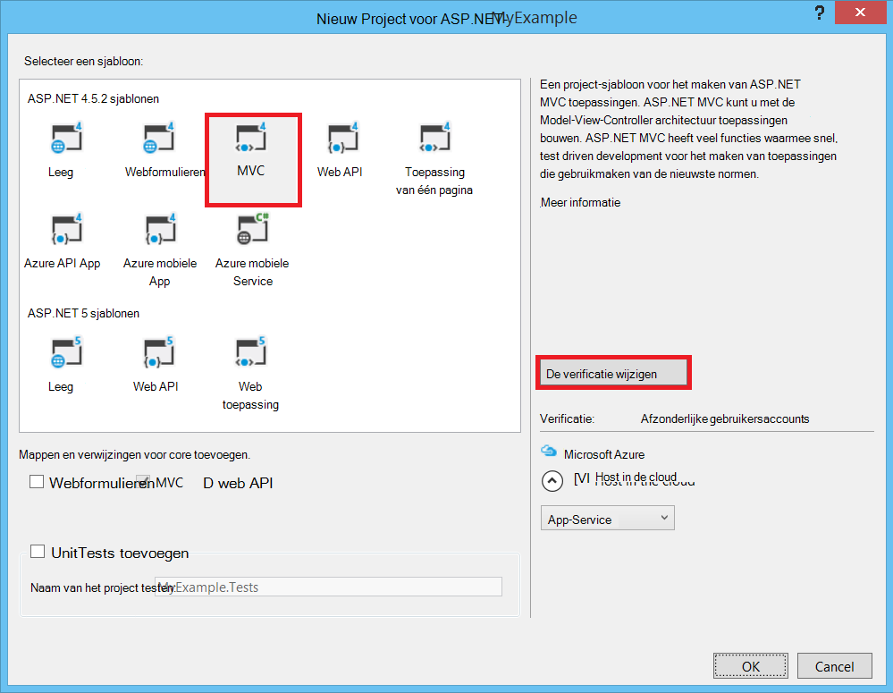

6. Klik op **Geen verificatie**in het dialoogvenster **Verificatie wijzigen** en klik op **OK**.

    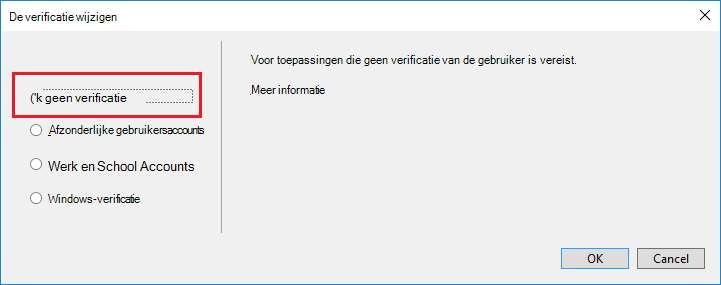

    Voor deze zelfstudie introductie bent u een eenvoudige app die aanmelding niet implementeren.

5. In de sectie **Microsoft Azure** van het dialoogvenster **Nieuw Project voor ASP.NET** moet **opnemen in de cloud** is geselecteerd en dat de **App-Service** is geselecteerd in de vervolgkeuzelijst.

    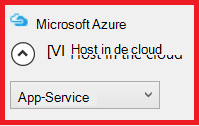

    Deze instellingen rechtstreeks Visual Studio voor het maken van een Azure web app voor uw webproject.

6. Klik op **OK**

## Azure bronnen voor een nieuwe web app configureren

U kunt nu Visual Studio vertellen over de Azure bronnen die u wilt maken.

5. Klik op **een account toevoegen**in het dialoogvenster **App-Service maken** en meldt u zich aan Azure met de ID en het wachtwoord van de account die u gebruikt voor het beheren van uw abonnement Azure.

    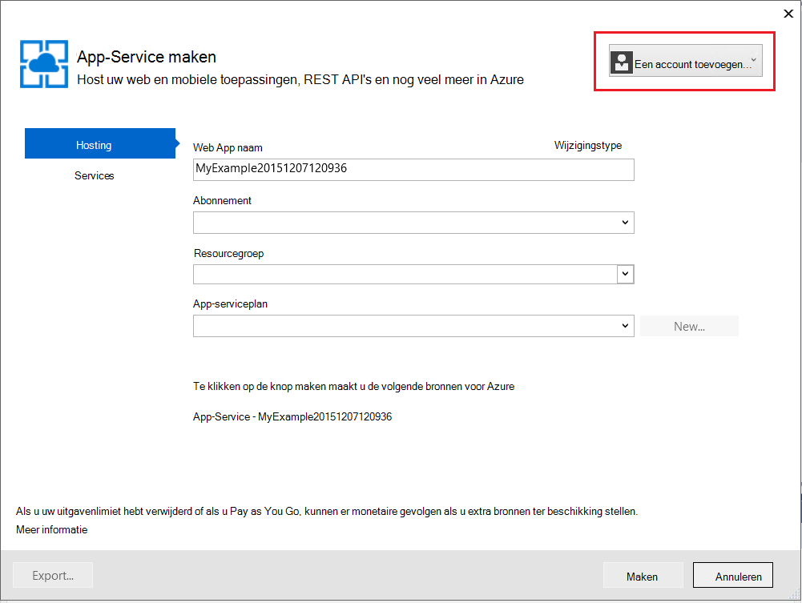

    Als u al aangemeld eerder op dezelfde computer, ziet u mogelijk niet de knop **een account toevoegen** . In dat geval kunt u deze stap overslaan of moet u mogelijk uw referenties opnieuw invoeren.
 
3. Voer een **Web App naam** die uniek is in het domein *azurewebsites.net* . Bijvoorbeeld: u kunt naam gebruiken die MyExample getallen rechts zodat deze uniek zijn, zoals MyExample810. Als een standaardnaam voor u wordt gemaakt, is uniek en kunt u die.

    Als iemand anders al de naam die u invoert gebruikt, ziet u een rood uitroepteken rechts in plaats van een groen vinkje en u moet een andere naam invoeren.

    De URL voor uw toepassing, wordt deze naam plus *. azurewebsites.net*. Als de naam bijvoorbeeld `MyExample810`, de URL is `myexample810.azurewebsites.net`.

    U kunt ook een aangepast domein met een Azure web app. Zie [een aangepaste domeinnaam in Azure App-Service configureren](web-sites-custom-domain-name.md)voor meer informatie.

6. Klik op de knop **Nieuw** naast het vak **Bronnengroep** en voert u "MyExample" of een andere naam als u de voorkeur geeft. 

    

    Een resourcegroep is een verzameling van Azure bronnen als webtoepassingen, databases en VMs. Voor een zelfstudie is het meestal verstandig een nieuwe resourcegroep maken omdat die gemakkelijk te verwijderen in één stap Azure bronnen die u voor de zelfstudie maakt. Zie [Bronbeheer Azure-overzicht](../azure-resource-manager/resource-group-overview.md)voor meer informatie.

4. Klik op de knop **Nieuw** naast de **App Service Plan** vervolgkeuzelijst.

    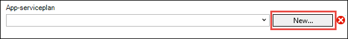

    Het dialoogvenster **Configureren App Service Plan** verschijnt.

    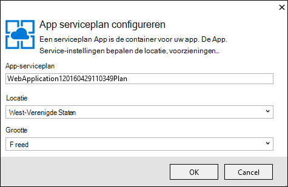

    In de volgende stappen kunt u een App Service plan voor de nieuwe resourcegroep configureren. Een serviceplan App geeft de compute-bronnen die op uw web app wordt uitgevoerd. Bijvoorbeeld als u de vrij laag, de API-app wordt uitgevoerd op gedeelde VMs, terwijl voor sommige betaalde lagen deze wordt uitgevoerd op specifieke VMs. Zie [App Service plannen-overzicht](../app-service/azure-web-sites-web-hosting-plans-in-depth-overview.md)voor meer informatie.

5. Voer in het dialoogvenster **Configureren App Service Plan** "MyExamplePlan" of een andere naam als u liever.

5. Kies de locatie die zich het dichtst bij u in de vervolgkeuzelijst **locatie** .

    Deze instelling bepaalt welke Azure datacenter in uw toepassing wordt uitgevoerd. Voor deze zelfstudie kunt u elk gebied en het won't merkbaar verschil maken. Maar voor een productie-app u uw server moet zo dicht mogelijk aan de clients die van deze gebruikmaken om de [Latentie](http://www.bing.com/search?q=web%20latency%20introduction&qs=n&form=QBRE&pq=web%20latency%20introduction&sc=1-24&sp=-1&sk=&cvid=eefff99dfc864d25a75a83740f1e0090)minimaliseren.

5. Klik in de vervolgkeuzelijst **grootte** **vrij**.

    Voor deze zelfstudie biedt de prijzen vrij laag goede krachtig genoeg.

6. Klik op **OK**in het dialoogvenster **Configureren App Service Plan** .

7. Klik op **maken**in het dialoogvenster **App-Service maken** .

## Visual Studio maakt het project en het web app

In een korte periode, meestal minder dan een minuut, maakt Visual Studio het webproject en de web app.  

Het venster **Solution Explorer** ziet u de bestanden en mappen in het nieuwe project.

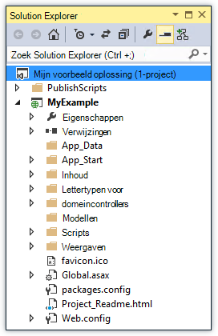

Het venster **Azure App serviceactiviteit** wordt gemaakt van de web app.

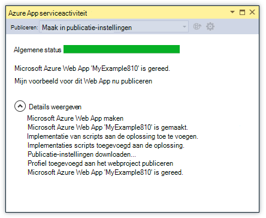

De **Cloud Explorer** -venster kunt u bekijken en beheren van Azure bronnen, met inbegrip van de nieuwe web app dat u zojuist hebt gemaakt.

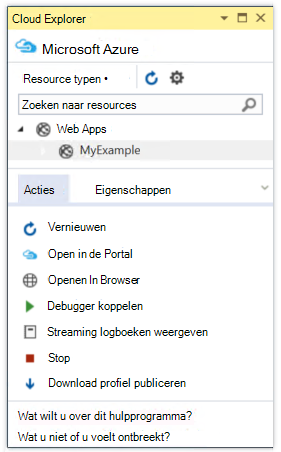
    
## Het webproject implementeren op de Azure web app.

In deze sectie kunt implementeren u het webproject web App.

1. Klik met de rechtermuisknop op het project in de **Solution Explorer**en kies **publiceren**.

    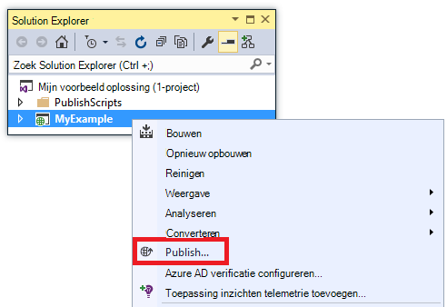

    In een paar seconden verschijnt de wizard **Publiceren** . Hiermee opent u de wizard een *profiel publiceren* met instellingen voor het implementeren van het webproject nieuwe web App.

    Het publicatieprofiel bevat een gebruikersnaam en wachtwoord voor de implementatie.  Deze referenties zijn gegenereerd voor u, en u hoeft deze kunnen worden ingevoerd. Het wachtwoord wordt gecodeerd in een verborgen gebruiker-specifieke bestand in de `Properties\PublishProfiles` map.
 
8. Klik op het tabblad **verbinding** van de wizard **Publiceren** op **volgende**.

    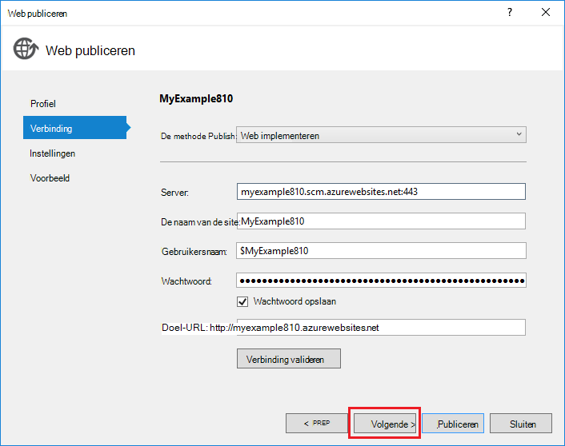

    Vervolgens wordt het tabblad **Instellingen** . Hier kunt u de configuratie voor de implementatie van een foutopsporingsversie voor [Foutopsporing op afstand](../app-service-web/web-sites-dotnet-troubleshoot-visual-studio.md#remotedebug). Het tabblad biedt ook verschillende [Opties voor publiceren](https://msdn.microsoft.com/library/dd465337.aspx#Anchor_2).

10. Op het tabblad **Instellingen** en klik op **volgende**.

    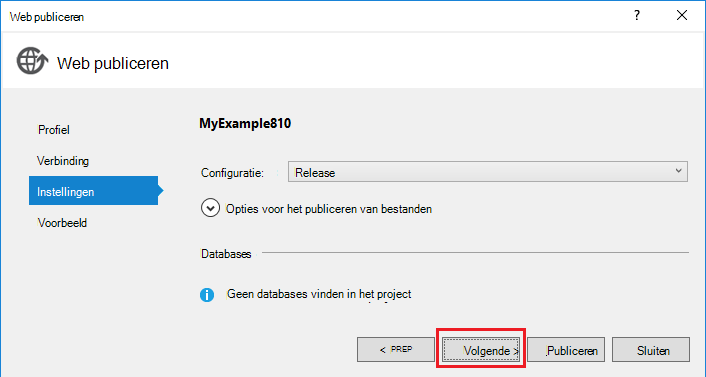

    Het tabblad **voorbeeld** is het volgende. Hier hebt u de mogelijkheid om te zien bestanden gaat het project worden gekopieerd naar de API-app. Wanneer u een project naar een API-toepassing die u al geïmplementeerd op eerder introduceert, worden alleen de gewijzigde bestanden worden gekopieerd. Als u een overzicht van wat wordt gekopieerd, kunt u de knop **Start** .

11. Klik op **publiceren**op het tabblad **voorbeeld** .

    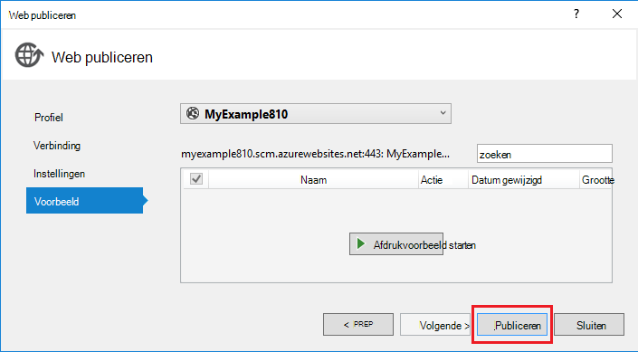

    Wanneer u op **publiceren**klikt, begint het proces van het kopiëren van de bestanden naar de server Azure de Visual Studio. Dit kan een paar minuten duren.

    De **uitvoer** en **Azure App serviceactiviteit** windows weergeven welke acties implementatie zijn genomen en rapporteren van de installatie is voltooid.

    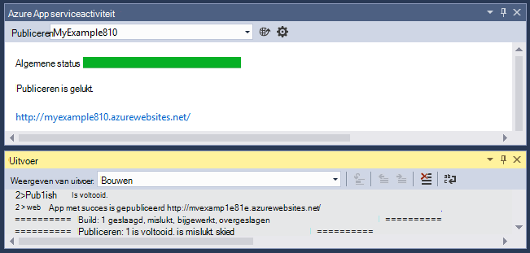

    De standaardbrowser wordt automatisch geopend op de URL van de geïmplementeerde web app bij succesvolle implementatie en de toepassing die u hebt gemaakt, is nu actief in de cloud. De URL in de adresbalk van de browser ziet u dat de web app via Internet wordt geladen.

    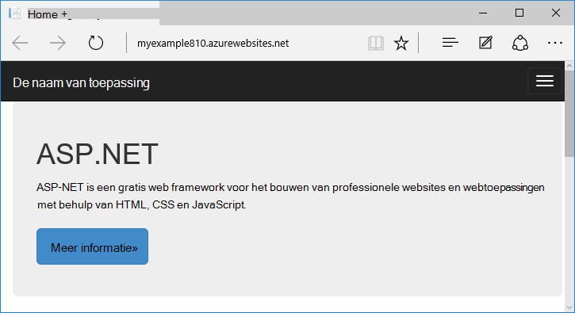

    > [AZURE.TIP]Hier kunt u de werkbalk **Web één klik publiceren** voor snelle distributie. Klik op **Beeld > Werkbalken**, en selecteer vervolgens **Web één klikt u op publiceren**. Een profiel selecteren, klikt u op een knop te publiceren of klik op een knop om de wizard **Publiceren** kunt u de werkbalk.
    > 

## Het oplossen van problemen

Als u een probleem als u deze zelfstudie hebt doorlopen, zorg dat u de meest recente versie van de Azure SDK voor .NET. De eenvoudigste manier om dat te doen is [De Azure SDK voor Visual Studio 2015](http://go.microsoft.com/fwlink/?linkid=518003)downloaden. Als u de huidige versie geïnstalleerd hebt, wordt het installatieprogramma van de Web-Platform kunt u weten dat er geen installatie nodig is.

Als u gebruikmaakt van een bedrijfsnetwerk wilt implementeren met Azure App-Service via een firewall, moet poort 443 en 8172 openstaan voor webonderdelen implementeren. Als u deze poorten niet kunt openen, Zie de volgende stappen hieronder voor andere opties voor distributie.

Nadat u uw ASP.NET-webtoepassing in Azure App-Service wordt uitgevoerd hebt, wilt u mogelijk meer informatie over functies van Visual Studio die het oplossen van problemen vereenvoudigen. Zie [problemen met Azure web apps in Visual Studio](web-sites-dotnet-troubleshoot-visual-studio.md)voor meer informatie over logboekregistratie foutopsporing op afstand, en nog veel meer.

## Volgende stappen

In deze zelfstudie hebt u gezien hoe een eenvoudige webtoepassing maken en deze implementeren in een Azure web app. Hier zijn enkele Verwante onderwerpen en bronnen voor meer informatie over Azure App-Service:

* Bewaken en beheren van uw web app in de [portal Azure](https://portal.azure.com/). 

    Zie voor meer informatie, [een overzicht van de portal Azure](/services/management-portal/) en [webtoepassingen configureren in Azure App-Service](web-sites-configure.md).

* Implementeren van een webproject op een nieuwe webtoepassing met behulp van Visual Studio

    Het project in de **Solution Explorer**met de rechtermuisknop en klik vervolgens op **publiceren**. Kies **Microsoft Azure App Service** als het doel van het publiceren en klik vervolgens op **Nieuw**. De dialoogvensters zijn hetzelfde als wat u hebt gezien in deze zelfstudie.

* Een webproject van het besturingselement implementeren

    Zie [aan de slag met web apps in Azure App Service](app-service-web-get-started.md) en [het implementeren van een Azure web app](web-sites-deploy.md)voor meer informatie over het [automatiseren van de implementatie](http://www.asp.net/aspnet/overview/developing-apps-with-windows-azure/building-real-world-cloud-apps-with-windows-azure/continuous-integration-and-continuous-delivery) van een [bronbeheersysteem](http://www.asp.net/aspnet/overview/developing-apps-with-windows-azure/building-real-world-cloud-apps-with-windows-azure/source-control).

* Een API-app in Azure App-Service een ASP.NET-webpagina API implementeren

    U hebt gezien hoe u een exemplaar van Azure App Service die voornamelijk is bedoeld voor het hosten van een website te maken. App-Service biedt ook functies voor het hosten van Web-API's, zoals ondersteuning voor CORS en API-ondersteuning voor metagegevens voor het genereren van client-code. U kunt API-functies gebruiken in een web app, maar als u vooral wilt voor het hosten van een exemplaar van App-Service-API, een **API app** een betere keuze zou zijn. Zie voor meer informatie, [aan de slag met API Apps en ASP.NET in Azure App-Service](../app-service-api/app-service-api-dotnet-get-started.md). 

* Voeg een aangepaste domeinnaam en SSL

    Zie de volgende bronnen voor meer informatie over het gebruik van SSL en uw eigen domein (bijvoorbeeld www.contoso.com in plaats van contoso.azurewebsites.net):

    * [Een aangepaste domeinnaam in Azure App-Service configureren](web-sites-custom-domain-name.md)
    * [HTTPS inschakelen voor een website Azure](web-sites-configure-ssl-certificate.md)

* Verwijder de bronnengroep met de web-app en verwante Azure bronnen wanneer u met hen bent klaar.

    Zie voor informatie over het werken met resourcegroepen in de portal Azure, [resources, distribueren met sjablonen Resource Manager en Azure portal](../resource-group-template-deploy-portal.md).   

*   Zie voor meer voorbeelden van het maken van een ASP.NET Web App in de App-Service [maken en implementeren van een ASP.NET-webtoepassing in Azure App Service](https://github.com/Microsoft/HealthClinic.biz/wiki/Create-and-deploy-an-ASP.NET-web-app-in-Azure-App-Service) en [maken en implementeren van een mobiele app in Azure App Service](https://github.com/Microsoft/HealthClinic.biz/wiki/Create-and-deploy-a-mobile-app-in-Azure-App-Service) van de [HealthClinic.biz](https://github.com/Microsoft/HealthClinic.biz) 2015 Connect [demo](https://blogs.msdn.microsoft.com/visualstudio/2015/12/08/connectdemos-2015-healthclinic-biz/). Zie voor meer QuickStart uit de HealthClinic.biz-demo [Azure Developer Tools QuickStart](https://github.com/Microsoft/HealthClinic.biz/wiki/Azure-Developer-Tools-Quickstarts).
