<properties 
    pageTitle="Een bedrijfs Azure app met AD FS-verificatie maken | Microsoft Azure" 
    description="Informatie over het maken van een bedrijfs app in Azure App-Service verifieert met lokale STS. Deze handleiding is bedoeld voor AD FS als de lokale STS." 
    services="app-service\web" 
    documentationCenter=".net" 
    authors="cephalin" 
    manager="wpickett" 
    editor=""/>

<tags 
    ms.service="app-service-web" 
    ms.devlang="dotnet" 
    ms.topic="article" 
    ms.tgt_pltfrm="na" 
    ms.workload="web" 
    ms.date="08/31/2016" 
    ms.author="cephalin"/>

# Een bedrijfs Azure app maken met AD FS-verificatie

In dit artikel wordt beschreven hoe u een ASP.NET-MVC line of business-toepassing maken in [Azure App-Service](../app-service/app-service-value-prop-what-is.md) een op ruimten [Active Directory Federation Services](http://technet.microsoft.com/library/hh831502.aspx) gebruiken als de id-provider. In dit scenario kunt werken wanneer uw organisatie vereist dat Active directory-gegevens ter plaatse worden opgeslagen, maar u wilt maken van branchespecifieke toepassingen in Azure App-Service.

>[AZURE.NOTE] Zie voor een overzicht van de andere onderneming verificatie en machtiging voor Azure App-Service, [verificatie bij Active Directory op de ruimten in uw Azure app](web-sites-authentication-authorization.md).

## Wordt opgebouwd ##

Bouwt u een standaard ASP.NET-toepassing in Azure App Service Web Apps met de volgende functies:

- Gebruikers aan de hand van AD FS wordt geverifieerd
- Maakt gebruik van `[Authorize]` voor het machtigen van gebruikers voor verschillende acties
- Statische configuratie voor foutopsporing in Visual Studio en publiceren op het Web Apps van App-Service (eenmaal configureren, foutopsporing en op elk gewenst moment publiceren)  

## Wat u nodig hebt ##

[AZURE.INCLUDE [free-trial-note](../../includes/free-trial-note.md)]

De volgende voor het voltooien van deze zelfstudie hebt u nodig:

- Een bedrijf op AD FS-implementatie (Zie voor een overzicht van de end-to-end van het testlab gebruikt in deze zelfstudie, [Test Lab: zelfstandige STS met AD FS in Azure VM (voor test)](https://blogs.msdn.microsoft.com/cephalin/2014/12/21/test-lab-standalone-sts-with-ad-fs-in-azure-vm-for-test-only/))
- Machtigingen voor het maken van vertrouwen partij vertrouwensrelaties in AD FS beheren
- Visual Studio 2013 Update 4 of hoger
- [Azure SDK van punt 2.8.1](http://go.microsoft.com/fwlink/p/?linkid=323510&clcid=0x409) of hoger

## Gebruik de voorbeeldtoepassing voor bedrijfs sjabloon ##

De voorbeeldtoepassing in deze zelfstudie [WebApp-WSFederation-DotNet)](https://github.com/AzureADSamples/WebApp-WSFederation-DotNet), wordt gemaakt door het team Azure Active Directory. Omdat AD FS WS-Federation ondersteunt, kunt u deze als een sjabloon van branchespecifieke toepassingen maken met gemak. Heeft de volgende functies:

- [WS-Federation](http://msdn.microsoft.com/library/bb498017.aspx) gebruikt voor verificatie van een bedrijf op AD FS-implementatie
- Aanmeldings- en afmeldingstijden functionaliteit
- Gebruik [Microsoft.Owin](http://www.asp.net/aspnet/overview/owin-and-katana/an-overview-of-project-katana) (in plaats van Windows Identity Foundation), die de toekomstige ASP.NET en veel eenvoudiger om in te stellen voor verificatie en autorisatie dan WIF

## Instellen van de voorbeeldtoepassing ##

2.  Klonen of de monsteroplossing op [WebApp-WSFederation-DotNet](https://github.com/AzureADSamples/WebApp-WSFederation-DotNet) downloaden naar uw lokale map.

    > [AZURE.NOTE] De instructies op de [README.md](https://github.com/AzureADSamples/WebApp-WSFederation-DotNet/blob/master/README.md) laten zien hoe u de toepassing met Azure Active Directory instellen. Maar in deze zelfstudie u instellen met AD FS, zodat de stappen hier in plaats daarvan.

3.  Open de oplossing en open Controllers\AccountController.cs in de **Solution Explorer**.

    U ziet dat de code een verificatievraag geverifieerd met behulp van WS-Federation, gewoon problemen. Alle verificatie is geconfigureerd in de App_Start\Startup.Auth.cs.

4.  Open App_Start\Startup.Auth.cs. In de `ConfigureAuth` methode, Let op de regel:

        app.UseWsFederationAuthentication(
            new WsFederationAuthenticationOptions
            {
                Wtrealm = realm,
                MetadataAddress = metadata                                      
            });

    Dit fragment is in de wereld OWIN echt minimaal moet u WS-Federation-verificatie configureren. Het is veel eenvoudiger en elegantere dan WIF, waar Web.config met XML wordt geïnjecteerd in de plaats. De enige informatie die u nodig hebt, is het van de partij (RP)-ID en de URL van het bestand met metagegevens van uw AD FS-service. Hier volgt een voorbeeld:

    -   RP-id:`https://contoso.com/MyLOBApp`
    -   Metagegevensadres:`http://adfs.contoso.com/FederationMetadata/2007-06/FederationMetadata.xml`

5.  Wijzigen in App_Start\Startup.Auth.cs, de volgende definities van statische tekenreeks:  
    <pre class="prettyprint">
    persoonlijke statische string realm = ConfigurationManager.AppSettings["ida:<mark>RPIdentifier</mark>"]; <mark><del>persoonlijke statische string aadInstance ConfigurationManager.AppSettings["ida:AADInstance ="];</del></mark> 
     <mark><del>private statische string huurder ConfigurationManager.AppSettings["ida:Tenant ="];</del></mark> 
     <mark><del>private statische reeks metagegevens = tekenreeks. Format ("{0} / {1} /federationmetadata/2007-06/federationmetadata.xml", aadInstance, huurder);</del></mark> 
     <mark>private statische reeks metagegevens = tekenreeks. Format ("https:// {0} /federationmetadata/2007-06/federationmetadata.xml", ConfigurationManager.AppSettings["ida:ADFS"]);</mark>

    <mark><del>instantie String = String.Format (CultureInfo.InvariantCulture, aadInstance, de huurder);</del></mark>
    </pre>

6.  Controleer nu de corresponderende wijzigingen aangebracht in Web.config. Open het bestand Web.config en wijzigt u de volgende app-instellingen:  
    <pre class="prettyprint">
    &lt;appSettings&gt;
    &lt;add key="webpages:Version" value="3.0.0.0" /&gt;
    &lt;add key="webpages:Enabled" value="false" /&gt;
    &lt;add key="ClientValidationEnabled" value="true" /&gt;
    &lt;add key="UnobtrusiveJavaScriptEnabled" value="true" /&gt;
      <mark><del>&lt;add key="ida:Wtrealm" value="[Enter the App ID URI of WebApp-WSFederation-DotNet https://contoso.onmicrosoft.com/WebApp-WSFederation-DotNet]" /&gt;</del></mark>
      <mark><del>&lt;add key="ida:AADInstance" value="https://login.windows.net" /&gt;</del></mark>
      <mark><del>&lt;add key="ida:Tenant" value="[Enter tenant name, e.g. contoso.onmicrosoft.com]" /&gt;</del></mark>
      <mark>&lt;add key="ida:RPIdentifier" value="[Enter the relying party identifier volgens de configuratie van AD FS, bv. https://localhost:44320 /] "/&gt;</mark>
      <mark>&lt;sleutel = waarde"ida: AD FS"="[Typ de FQDN-naam van de service van AD FS, bijvoorbeeld adfs.contoso.com]"/&gt; </mark>        

    &lt;/appSettings&gt;
    </pre>

    Vul de waarden op basis van de desbetreffende omgeving.

7.  Bouwen van de toepassing om te controleren of dat er geen fouten zijn.

Dat is. De voorbeeldtoepassing is nu gereed voor gebruik met AD FS. Moet u toch een RP vertrouwensrelatie configureren met deze toepassing in AD FS.

## De voorbeeldtoepassing voor Azure App Service Web Apps implementeren

Hier u de toepassing uitgeeft aan een web app in App Service Web Apps behoud de debug-omgeving. Houd er rekening mee dat u de toepassing te publiceren gaat voordat er een vertrouwensrelatie RP met AD FS, zodat verificatie nog steeds niet nog werkt. Als u deze kunt nu u wel de URL van de web app kunt u later de RP vertrouwensrelatie configureren.

1. Klik met de rechtermuisknop op het project en selecteer **publiceren**.

    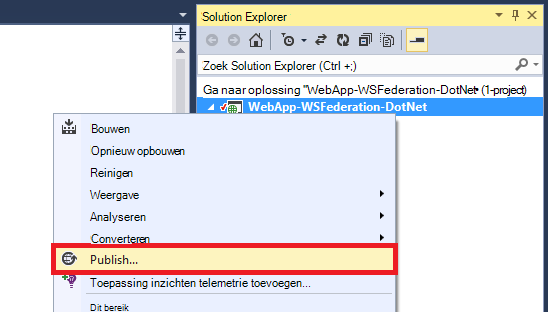

2. Selecteer **Microsoft Azure App-Service**.
3. Als u nog niet hebt aangemeld bij Azure, klik op **Aanmelden** en het Microsoft-account voor uw abonnement op Azure aan te melden.
4. Eenmaal aangemeld, klikt u op **Nieuw** om te maken van een web app.
5. Vul alle vereiste velden in. U wilt verbinding maken met de lokale gegevens, zodat het niet maken van een database voor dit web app.

    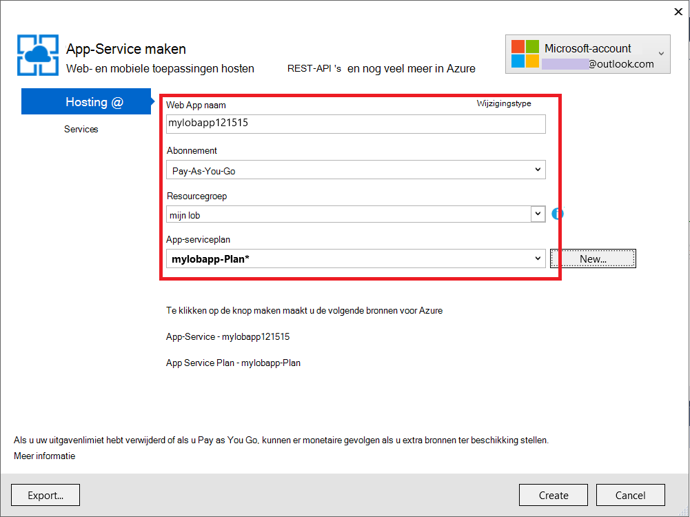

6. Klik op **maken**. Zodra de web app is gemaakt, wordt het dialoogvenster Web publiceren wordt geopend.
7. Wijzigen in de **Doel-URL**, **http** in **https**. Kopieer de volledige URL naar een teksteditor voor later gebruik. Klik vervolgens op **publiceren**.

    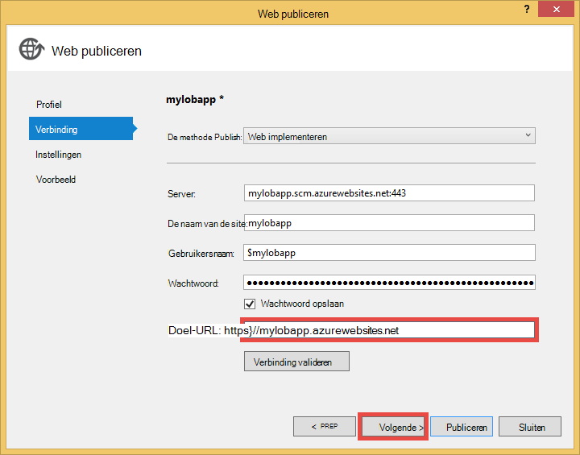

11. Open **Web.Release.config** in uw project in Visual Studio. Voeg de volgende XML-code in de `<configuration>` van label en de waarde van de sleutel vervangen door de URL van uw publiceren web app.  
    <pre class="prettyprint">
&lt;appSettings&gt;
   &lt;sleutel = waarde "ida: RPIdentifier" = "<mark>[bv. https://mylobapp.azurewebsites.net/]</mark>' xdt:Transform 'SetAttributes' xdt:Locator="Match(key) = "/&gt;
&lt;/appSettings&gt;</pre>

Wanneer u bent klaar, hebt u twee RP-id's in uw project, één voor uw omgeving voor foutopsporing in Visual Studio en één voor de gepubliceerde web app in Azure is geconfigureerd. U kunt een vertrouwensrelatie RP wordt instellen voor elk van de twee omgevingen in AD FS. Tijdens de foutopsporing, worden de instellingen app in Web.config gebruikt om de configuratie van **Debug** werkt met AD FS. Wanneer deze wordt gepubliceerd (standaard de **Release** -configuratie wordt gepubliceerd), een getransformeerde Web.config is geüpload die is uitgerust met de app de instelling gewijzigd in Web.Release.config.

Als u wilt dat de gepubliceerde web app in Azure te koppelen de debugger (dat wil zeggen moet je uploaden symbolen van de code in de gepubliceerde web app), kunt u een kloon van de configuratie van de foutopsporing voor foutopsporing in Azure, maar met een eigen aangepaste Web.config transformatie (bv. Web.AzureDebug.config) met de instellingen van de app van Web.Release.config. Hiermee kunt u een statische configuratie behouden tussen de verschillende omgevingen.

## Gebruikmakende partij vertrouwensrelaties in beheer van AD FS configureren ##

U moet nu een vertrouwensrelatie RP beheer van AD FS configureren voordat u kunt de voorbeeldtoepassing en daadwerkelijk worden geverifieerd met AD FS. U moet twee afzonderlijke RP-vertrouwensrelaties, één voor uw omgeving voor foutopsporing en één voor uw gepubliceerde web app instellen.

> [AZURE.NOTE] Zorg ervoor dat u de volgende stappen herhalen voor uw omgeving.

4.  Meld u aan met de referenties die het beheer van voor AD FS rechten op de AD FS-server.
5.  Open beheer van AD FS. Met de rechtermuisknop op de **AD FS\Trusted Relationships\Relying partij vertrouwt** en selecteer **Toevoegen vertrouwen partij vertrouwen**.

    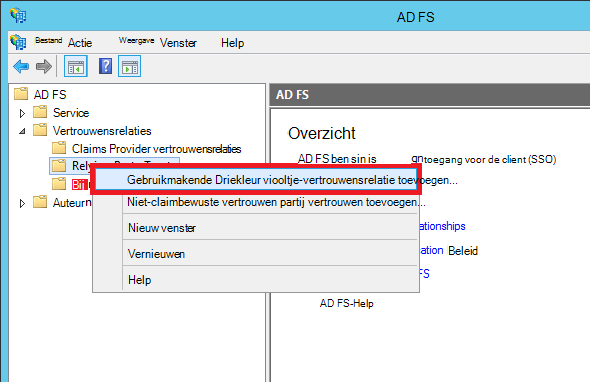

5.  **Gegevensbron selecteren** op de pagina Selecteer **handmatig invoeren van gegevens over de gebruikmakende partij**. 

    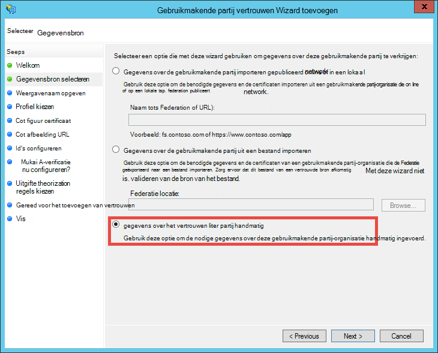

6.  Typ een weergavenaam voor de toepassing op de pagina **Weergegeven naam opgeeft** en op **volgende**.
7.  Klik op **volgende**op de pagina **Kies Protocol** .
8.  Klik op **volgende**op de pagina **Certificaat configureren** .

    > [AZURE.NOTE] Aangezien u moet werken met HTTPS al, is gecodeerd tokens zijn optioneel. Als u echt coderen tokens van AD FS op deze pagina wilt, moet u ook token decoderen logica toevoegen in uw code. Voor meer informatie, Zie [OWIN WS-Federation middleware handmatig configureren en gecodeerde tokens te accepteren](http://chris.59north.com/post/2014/08/21/Manually-configuring-OWIN-WS-Federation-middleware-and-accepting-encrypted-tokens.aspx).
  
5.  Voordat u naar de volgende stap hebt verplaatst, moet u de gegevens vanuit de Visual Studio-project. Let op de **SSL-URL** van de toepassing in de Projecteigenschappen van het. 

    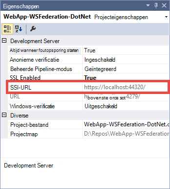

6.  Selecteer terug in AD FS beheren op de pagina **URL configureren** van **Vertrouwen partij vertrouwen Wizard toevoegen**, **ondersteuning voor het protocol WS-Federation Passive** en typt u de SSL-URL van de Visual Studio-project dat u in de vorige stap hebt genoteerd. Klik vervolgens op **volgende**.

    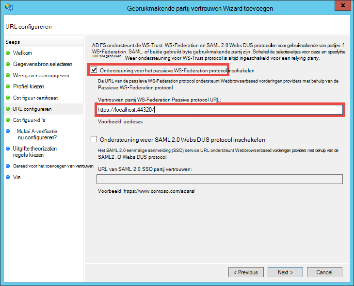

    > [AZURE.NOTE] URL geeft aan waar de client verzenden nadat de verificatie is geslaagd. Voor de debug-omgeving dient te worden <code>https://localhost:&lt;port&gt;/</code>. Voor de gepubliceerde web app, moet web app-URL worden.

7.  **Id's configureren** op de pagina SSL-URL van uw project wordt reeds vermeld en klik op **volgende**. Klik op **volgende** helemaal aan het einde van de wizard met de standaardinstellingen.

    > [AZURE.NOTE] Deze id wordt in de App_Start\Startup.Auth.cs van de Visual Studio-project, vergeleken met de waarde van <code>WsFederationAuthenticationOptions.Wtrealm</code> tijdens de federatieve verificatie. Standaard wordt de URL van de toepassing van de vorige stap als RP-id toegevoegd.

8.  U bent nu klaar om de RP-toepassing configureren voor uw project in AD FS. Vervolgens configureert u deze toepassing voor het verzenden van de claims die nodig is voor uw toepassing. Het dialoogvenster **Bewerken Claim regels** wordt standaard geopend voor u aan het einde van de wizard zodat u onmiddellijk kunt beginnen. We configureren ten minste de volgende claims (met schema's tussen haakjes):

    -   Naam (http://schemas.xmlsoap.org/ws/2005/05/identity/claims/name) - door ASP.NET hydrate `User.Identity.Name`.
    -   UPN-naam (http://schemas.xmlsoap.org/ws/2005/05/identity/claims/upn) - gebruikt als unieke identificatie van gebruikers in de organisatie.
    -   Groepslidmaatschappen als (http://schemas.microsoft.com/ws/2008/06/identity/claims/role) - rollen kunnen worden gebruikt met `[Authorize(Roles="role1, role2,...")]` decoratie controllers/handelingen toe te staan. Deze aanpak mogelijk in werkelijkheid niet de meeste zodat rol vergunning. Als uw gebruikers AD tot beveiligingsgroepen honderden behoren, honderden rol vorderingen in het SAML-token worden. Een alternatieve methode is voor het verzenden van een enkele rol claim voorwaardelijk afhankelijk van het lidmaatschap van de gebruiker in een bepaalde groep. Maar zullen we Houd het simpel voor deze zelfstudie.
    -   Gebruikersnaam (http://schemas.xmlsoap.org/ws/2005/05/identity/claims/nameidentifier) - kan worden gebruikt voor validatie tegen vervalsing. Zie de sectie **van bedrijfs-functionaliteit toevoegen** van [een regel zakelijke Azure app met verificatie van Azure Active Directory maken](web-sites-dotnet-lob-application-azure-ad.md#bkmk_crud)voor meer informatie over het maken van werken met validatie ter voorkoming.

    > [AZURE.NOTE] Het type claim moet u configureren voor de toepassing wordt bepaald door de behoeften van uw toepassing. Zie voor een overzicht van vorderingen die worden ondersteund door Azure Active Directory-toepassingen (dat wil zeggen RP vertrouwensrelaties), bijvoorbeeld [Token ondersteund en typen](http://msdn.microsoft.com/library/azure/dn195587.aspx).

8.  Klik in het dialoogvenster bewerken Claim regels **Regel toevoegen**.
9.  De naam, functie en UPN-claims configureren zoals in de screenshot en klik op **Voltooien**.

    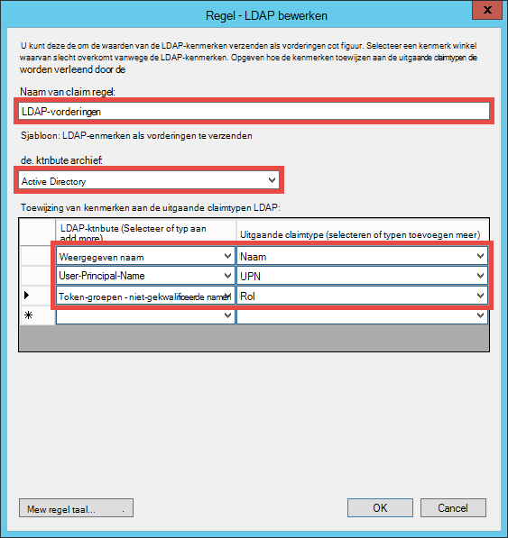

    Vervolgens maakt u een tijdelijke naam ID claimen via de stappen in [Naam-id's in de SAML-assertions](http://blogs.msdn.com/b/card/archive/2010/02/17/name-identifiers-in-saml-assertions.aspx)aangetoond.

9.  Klik nogmaals op **Regel toevoegen** .
10. **Vorderingen met behulp van een aangepaste regel verzenden** en klik op **volgende**.
11. De taal van de volgende regel in het vak **aangepaste regel** plakken, naam voor de regel **Per sessie-id** en klik op **Voltooien**.  
    <pre class="prettyprint">
    C1: [Type == "http://schemas.microsoft.com/ws/2008/06/identity/claims/windowsaccountname"] &amp; &amp; 
    c2: [Type == "http://schemas.microsoft.com/ws/2008/06/identity/claims/authenticationinstant"] = > toevoegen (opslaan = "_OpaqueIdStore", typen ("<mark>http://contoso.com/internal/sessionid</mark>") = query = '{0} { 1}; {2}; {3}; {4} ', param = "useEntropy", param = c1. Waarde, param = c1. OriginalIssuer, param = "", param = c2. Waarde);
    </pre>

    De aangepaste regel ziet dit screenshot:

    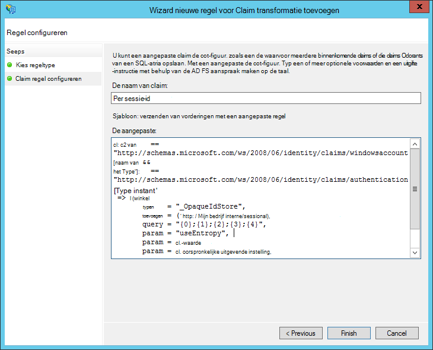

9.  Klik nogmaals op **Regel toevoegen** .
10. Selecteer **een binnenkomende Claim transformeren** en klik op **volgende**.
11. De regel configureren zoals in de screenshot (met behulp van het type identiteitsclaim dat u in de aangepaste regel hebt gemaakt) en klik op **Voltooien**.

    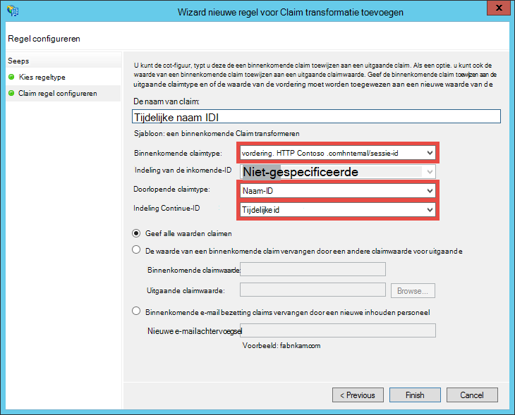

    Zie voor gedetailleerde informatie over de stappen voor de tijdelijke naam ID claim [Naam-id's in de SAML-bevestigingen](http://blogs.msdn.com/b/card/archive/2010/02/17/name-identifiers-in-saml-assertions.aspx).

12. Klik op **toepassen** in het dialoogvenster **Claim regels bewerken** . Nu ziet de volgende schermafdruk:

    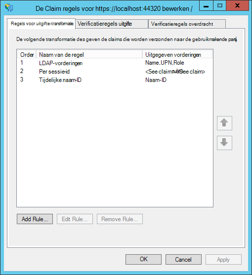

    > [AZURE.NOTE] Zorg ervoor dat u deze stappen herhalen voor uw omgeving voor foutopsporing en de gepubliceerde web app.

## Federatieve verificatie voor uw toepassing testen

Bent u klaar voor het testen van uw toepassing verificatie logica ten opzichte van AD FS. In de testomgeving voor AD FS heb ik een testgebruiker die tot een groep in Active Directory (AD behoort).

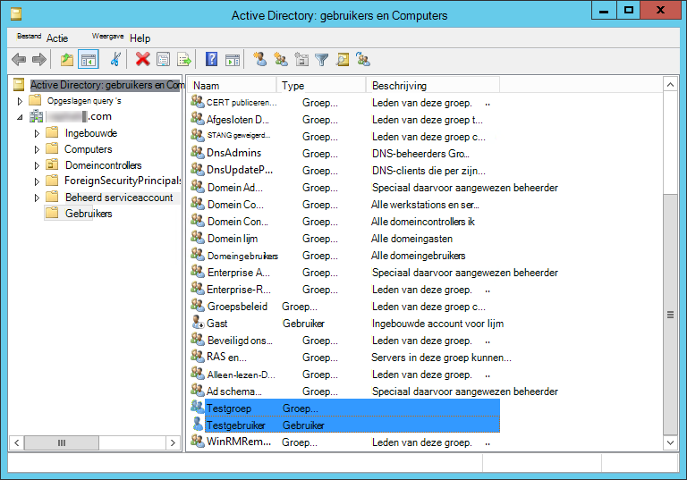

Verificatie in de debugger test, hoeft u nu is `F5`. Als u testen van verificatie in de gepubliceerde web app wilt, Ga naar de URL.

Nadat de webtoepassing is geladen, klikt u op **Aanmelden**. Nu ontvangt u een dialoogvenster voor aanmelding of de aanmeldingspagina die door AD FS is afhankelijk van de verificatiemethode die is gekozen door AD FS wordt bediend. Hier is wat ik krijg in Internet Explorer 11.

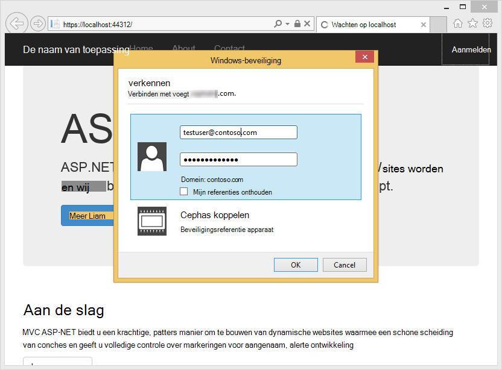

Zodra u zich met een gebruiker in het domein van de advertentie van de AD FS-implementatie aanmelden, u ziet nu de introductiepagina opnieuw met **Hallo, <User Name>!** in de hoek. Hier is wat ik krijg.

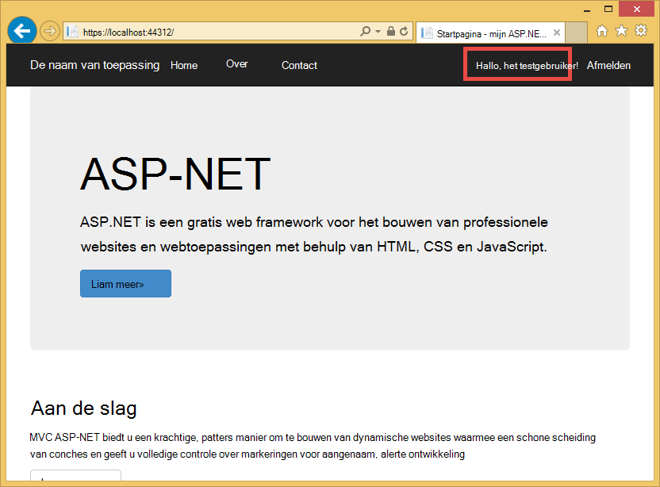

U hebt tot nu toe is voltooid op de volgende manieren:

- Uw toepassing AD FS heeft bereikt en een overeenkomende RP-id wordt gevonden in de AD FS-database
- AD FS is geverifieerd een AD-gebruiker en u terug naar de introductiepagina van de toepassing omleiden
- AD FS als verzonden de claim (http://schemas.xmlsoap.org/ws/2005/05/identity/claims/name) voor uw toepassing, zoals aangegeven door het feit dat de gebruikersnaam wordt weergegeven in de hoek. 

Als de claim weergegeven wordt, u zou hebben gezien **Hello,!**. Als u naar Views\Shared kijkt\_LoginPartial.cshtml, vindt u dat gebruikt `User.Identity.Name` om de gebruikersnaam van de weer te geven. Zoals gezegd, als het beroep op de naam van de geverifieerde gebruiker in het SAML-token beschikbaar is, wordt in ASP.NET deze eigenschap met het hydrates. Overzicht van de claims die door AD FS worden verzonden, een onderbrekingspunt in Controllers\HomeController.cs, te plaatsen in de methode voor Index-actie. Nadat de gebruiker is geverifieerd, controleren de `System.Security.Claims.Current.Claims` collectie.

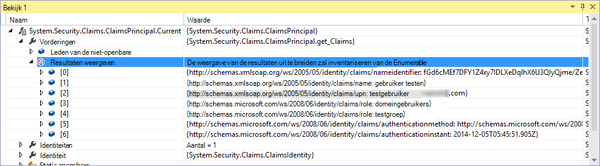 

## Toestaan dat gebruikers voor specifieke domeincontrollers of acties

Omdat u groepslidmaatschappen als rol vorderingen in uw configuratie RP vertrouwen opgenomen hebt, kunt u nu gebruiken ze rechtstreeks in de `[Authorize(Roles="...")]` decoratie voor domeincontrollers en acties. In een bedrijfs toepassing met het patroon maken, lezen, bijwerken, verwijderen (CRUD), kunt u specifieke functies voor toegang tot elke actie machtigen. Op dit moment wordt u alleen deze functie op de bestaande introductiepagina controller uitproberen.

1. Open Controllers\HomeController.cs.
2. Versieren de `About` en `Contact` actie methoden vergelijkbaar met de volgende code, beveiliging met groepslidmaatschappen die de geverifieerde gebruiker heeft.  
    <pre class="prettyprint">
    <mark>[Toestaan (rollen = "Groep")]</mark> 
    About() van openbare ActionResult {ViewBag.Message = "Uw toepassing beschrijving pagina.";

        return View();
    }

    <mark>[Toestaan (rollen = 'domeinbeheerders')]</mark> 
    Contact() van openbare ActionResult {ViewBag.Message = "Uw contactpersoon pagina.";

        return View();
    }  </pre>

    Aangezien ik in mijn testomgeving voor AD FS **Testen gebruiker** toegevoegd aan **De groep Test** ik testgroep gebruikt om de vergunning te testen op `About`. Voor `Contact`, test ik het negatieve geval **Domeinadministrators**, die **Gebruiker testen** hoort niet.

3. Start het foutopsporingsprogramma door `F5` en log in en klik vervolgens op **Info**. U moet nu worden weergegeven, de `~/About/Index` pagina, als de geverifieerde gebruiker gemachtigd is voor die actie.
4. Klik op **contactpersoon**, die in mijn geval dienen niet toe te staan **De gebruiker Test** voor de actie. Echter, de browser wordt omgeleid naar AD FS die uiteindelijk ziet u dit bericht:

    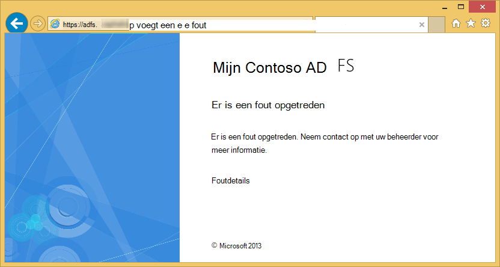

    Als u deze fout in Logboeken op de AD FS-server, ziet u dit Uitzonderingsbericht:  
    <pre class="prettyprint">
   Microsoft.IdentityServer.Web.InvalidRequestException: MSIS7042: <mark>dezelfde browsersessie client '6' aanvragen heeft ingediend in de laatste 11 seconden.</mark> Neem contact op met uw beheerder voor meer informatie.
   bij Microsoft.IdentityServer.Web.Protocols.PassiveProtocolHandler.UpdateLoopDetectionCookie (WrappedHttpListenerContext context) bij Microsoft.IdentityServer.Web.Protocols.WSFederation.WSFederationProtocolHandler.SendSignInResponse (WSFederationContext context, MSISSignInResponse reactie) op Microsoft.IdentityServer.Web.PassiveProtocolListener.ProcessProtocolRequest (ProtocolContext, protocolContext, PassiveProtocolHandler-protocolHandler) bij Microsoft.IdentityServer.Web.PassiveProtocolListener.OnGetContext (WrappedHttpListenerContext context) </pre>

    De reden voor deze fout is dat standaard MVC retourneert een 401 Unauthorized wanneer de rollen van de gebruiker niet gemachtigd zijn. Hierdoor wordt een aanvraag opnieuw verifiëren met uw identiteitsprovider (AD FS). Nadat de gebruiker is al geverifieerd, wordt AD FS dezelfde pagina, die vervolgens een andere 401, een redirect lus maken. U overschrijft de AuthorizeAttribute `HandleUnauthorizedRequest` methode met eenvoudige logica iets weergeven die zinvol in plaats van de redirect lus voortgezet.

5. Een bestand maken in het project met de naam AuthorizeAttribute.cs en plak de volgende code in het.

        using System;
        using System.Web.Mvc;
        using System.Web.Routing;
        
        namespace WebApp_WSFederation_DotNet
        {
            [AttributeUsage(AttributeTargets.Class | AttributeTargets.Method, Inherited = true, AllowMultiple = true)]
            public class AuthorizeAttribute : System.Web.Mvc.AuthorizeAttribute
            {
                protected override void HandleUnauthorizedRequest(AuthorizationContext filterContext)
                {
                    if (filterContext.HttpContext.Request.IsAuthenticated)
                    {
                        filterContext.Result = new System.Web.Mvc.HttpStatusCodeResult((int)System.Net.HttpStatusCode.Forbidden);
                    }
                    else
                    {
                        base.HandleUnauthorizedRequest(filterContext);
                    }
                }
            }
        }

    De override code stuurt een HTTP 403 (niet toegestaan) in plaats van HTTP 401 (Unauthorized) in geverifieerde maar onbevoegde aanvragen.

6. Uitvoeren van de debugger opnieuw met `F5`. Te klikken op **contactpersoon** nu ziet u een meer informatieve (zij het zwartwitprinter) foutbericht weergegeven:

    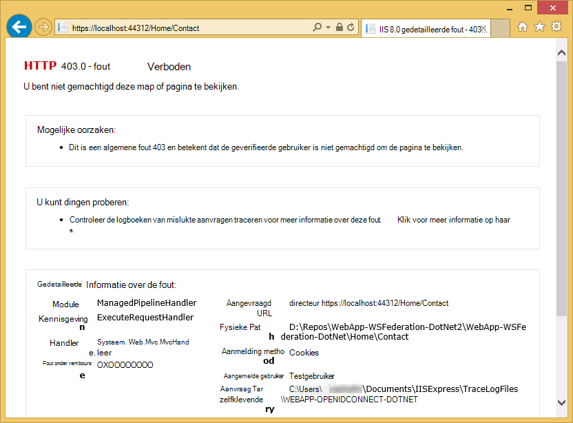

7. De toepassing uitgeeft aan Azure App Service Web Apps opnieuw en test het gedrag van de actieve toepassing.

## Verbinding maken met gegevens voor gebouwen

Een reden zou willen implementeren van uw bedrijfs toepassing met AD FS in plaats van Azure Active Directory is de compatibiliteit met met het houden van de organisatie gegevens uit de lokale. Dit kan ook betekenen dat uw web app in Azure toegang krijgen lokale databases, tot moet aangezien u niet mag gebruiken [SQL-Database](/services/sql-database/) als de gegevenslaag voor uw web-apps.

Azure App Service Web Apps ondersteunt toegang tot lokale databases met twee benaderingen: [Hybride verbindingen](../biztalk-services/integration-hybrid-connection-overview.md) en [Virtuele netwerken](web-sites-integrate-with-vnet.md). Zie [integratie met behulp van VNET en hybride verbindingen met Azure App Service Web Apps](https://azure.microsoft.com/blog/2014/10/30/using-vnet-or-hybrid-conn-with-websites/)voor meer informatie.

## Verdere informatie

- [Beveiligen met SSL en het kenmerk machtigen de-toepassing](web-sites-dotnet-deploy-aspnet-mvc-app-membership-oauth-sql-database.md#protect-the-application-with-ssl-and-the-authorize-attribute)
- [Geverifieerd door Active Directory in uw Azure app on-premises](web-sites-authentication-authorization.md)
- [Een bedrijfs Azure app maken met Azure Active Directory-verificatie](web-sites-dotnet-lob-application-azure-ad.md)
- [De On-Premises organisatie-verificatie-optie (AD FS) gebruiken met ASP.NET in Visual Studio 2013](http://www.cloudidentity.com/blog/2014/02/12/use-the-on-premises-organizational-authentication-option-adfs-with-asp-net-in-visual-studio-2013/)
- [Een webproject VS2013 WIF migreren naar Katana](http://www.cloudidentity.com/blog/2014/09/15/MIGRATE-A-VS2013-WEB-PROJECT-FROM-WIF-TO-KATANA/)
- [Active Directory Federation Services-overzicht](http://technet.microsoft.com/library/hh831502.aspx)
- [De specificatie WS-Federation 1.1](http://download.boulder.ibm.com/ibmdl/pub/software/dw/specs/ws-fed/WS-Federation-V1-1B.pdf?S_TACT=105AGX04&S_CMP=LP)

