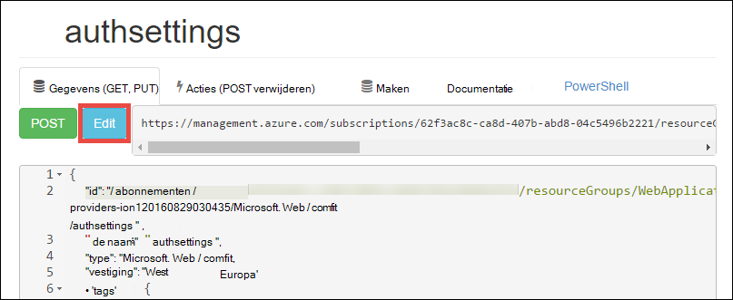

<properties 
    pageTitle="Een bedrijfs Azure app maken met verificatie van Active Directory Azure | Microsoft Azure" 
    description="Informatie over het maken van een ASP.NET-MVC bedrijfs app in Azure App-Service verifieert met Azure Active Directory" 
    services="app-service\web, active-directory" 
    documentationCenter=".net" 
    authors="cephalin" 
    manager="wpickett" 
    editor=""/>

<tags 
    ms.service="app-service-web" 
    ms.devlang="dotnet" 
    ms.topic="article" 
    ms.tgt_pltfrm="na" 
    ms.workload="web" 
    ms.date="09/01/2016" 
    ms.author="cephalin"/>

# Een bedrijfs Azure app maken met Azure Active Directory-verificatie #

In dit artikel wordt beschreven hoe u een .NET bedrijfs app in [Azure App Service Web Apps](http://go.microsoft.com/fwlink/?LinkId=529714) gebruik maken u het [Authentication / Authorization](../app-service/app-service-authentication-overview.md) functie. Ook ziet u hoe de [Azure Active Directory Graph API](https://msdn.microsoft.com/Library/Azure/Ad/Graph/api/api-catalog) query directory-gegevens in de toepassing.

De huurder Azure Active Directory die u gebruikt kan een directory Azure alleen-lezen zijn. Of kan deze worden [gesynchroniseerd met uw lokale Active Directory](../active-directory/active-directory-aadconnect.md) een ervaring voor één maken voor werknemers die in de lokalen en extern. In dit artikel wordt de standaardmap voor uw Azure-account gebruikt.

## Wordt opgebouwd ##

Bouwt u een eenvoudige toepassing van bedrijfs maken, lezen, bijwerken, verwijderen (CRUD) in App Service Web Apps dat nummers items met de volgende functies werken:

- Verifieert gebruikers tegen Azure Active Directory
- Query's Directory: gebruikers en groepen met [Azure Active Directory Graph API](http://msdn.microsoft.com/library/azure/hh974476.aspx)
- De sjabloon ASP.NET MVC *Geen verificatie* gebruiken

Als u op rollen gebaseerde toegangscontrole (RBAC) nodig voor uw bedrijfs app in Azure, Zie de [Volgende stap](#next).

## Wat u nodig hebt ##

[AZURE.INCLUDE [free-trial-note](../../includes/free-trial-note.md)]

De volgende voor het voltooien van deze zelfstudie hebt u nodig:

- Een huurder Azure Active Directory aan gebruikers in verschillende groepen.
- Machtigingen voor het maken van toepassingen op de huurder Azure Active Directory
- Visual Studio 2013 Update 4 of hoger
- [Azure SDK van punt 2.8.1 of hoger](https://azure.microsoft.com/downloads/)

## Maken en implementeren van een web app voor Azure ##

1. Vanuit Visual Studio, klikt u op het **bestand** > **Nieuw** > **Project**.

2. **ASP.NET-webtoepassing**selecteren, Geef uw project en klik op **OK**.

3. Selecteer de sjabloon **MVC** en wijzig de verificatie **Geen**verificatie. Controleer of **dat de Host in de Cloud** is geselecteerd en klik op **OK**.

    

4. In het dialoogvenster **App Service maken** , klikt u op **een account toevoegen** (en vervolgens op **een account toevoegen** in de vervolgkeuzelijst) aan te melden bij uw account Azure.

5. Configureer uw web app nadat u bent aangemeld. Een resourcegroep en een nieuwe toepassing maken door te klikken op de desbetreffende knop **Nieuw** . Klik op **Extra Azure services verkennen** om door te gaan.

    

6. Klik op het tabblad **Services** op **+** voor uw app in een SQL-Database toevoegen. 

    

7. Klik op **Nieuw** om een exemplaar van SQL Server te maken in een **SQL-Database configureren**.

8. Configureer uw exemplaar van SQL Server in **SQL Server configureren**. Klik vervolgens op **OK**, **OK**en **maken** ere van het maken van app in Azure.

9. **Azure App serviceactiviteit**, kunt u zien wanneer het maken van de app is voltooid. Klik op * *publiceren &lt; *appname*> dit Web App nu**klikt u op **publiceren **. 

    Als u Visual Studio is voltooid, wordt de app publiceren in de browser geopend. 

    

## Verificatie- en -toegang configureren

1. Log in op de [Azure portal](https://portal.azure.com).

2. Klik in het linkermenu op **App Services** > **&lt;*appname*>** > **Authentication / Authorization **.

    

3. Azure Active Directory-verificatie inschakelen door te klikken **op** > **Azure Active Directory** > **Express** > **OK**.

    

4. Klik in de werkbalk op **Opslaan** .

    

    Nadat de verificatie-instellingen zijn opgeslagen, probeert u navigeren naar de app opnieuw in de browser. De standaardinstellingen voor afdwingen verificatie op de hele app. Als u al niet zijn aangemeld, wordt u omgeleid naar een loginscherm. Nadat u bent aangemeld, ziet u uw app beveiligd door middel van HTTPS. Vervolgens moet u toegang tot Active directory-gegevens. 

5. Ga naar de [klassieke portal](https://manage.windowsazure.com).

6. Klik in het linkermenu op **Active Directory** > **Default Directory** > **toepassingen** > **&lt;*appname*> **.

    

    Dit is de Azure Active Directory-toepassing die App Service voor u gemaakt zodat de vergunning / functie voor verificatie.

7. Klik op **gebruikers** en **groepen** om ervoor te zorgen dat er bepaalde gebruikers en groepen in Active directory. Zo niet, maak een paar testgebruikers en groepen.

    

7. Klik op **configureren** om deze toepassing te configureren.

8. Ga naar de sectie **sleutels** en het toevoegen van een sleutel door het selecteren van een duur. Klik op **Machtigingen overgedragen** en selecteer vervolgens **de Active directory-gegevens lezen**. Klik op **Opslaan**.

    

8. Als uw instellingen zijn opgeslagen, Ga terug naar de sectie **sleutels** en klik op de knop **kopiëren** als u wilt kopiëren van de sleutel van de client. 

    

    >[AZURE.IMPORTANT] Als u deze pagina nu afsluit, niet mogelijk toegang krijgen tot deze sleutel client ooit opnieuw.

9. Vervolgens moet u uw web app configureren met deze sleutel. Log in op de [Azure Resource Explorer](https://resources.azure.com) met uw account Azure.

10. Klik boven aan de pagina, **Lezen/schrijven** als u wilt wijzigen in de Azure Resource Explorer.

    

11. De verificatie-instellingen voor uw app, te vinden op abonnementen zoeken > * *&lt;*subscriptionname*>** > **resourceGroups** > **&lt;*resourcegroupname*>** > **aanbieders van** > **Microsoft.Web** > **sites** > **&lt;*appname*>** > **config** > **authsettings **.

12. Klik op **bewerken**.

    

13. In het deelvenster bewerken, stelt u de `clientSecret` en `additionalLoginParams` eigenschappen als volgt.

        ...
        "clientSecret": "<client key from the Azure Active Directory application>",
        ...
        "additionalLoginParams": ["response_type=code id_token", "resource=https://graph.windows.net"],
        ...

14. Klik boven aan het indienen van uw wijzigingen op **plaatsen** .

    

14. Nu, om te testen of u hebt de Autorisatietoken toegang te krijgen tot de Azure Active Directory Graph API, alleen gaat u naar * *https://&lt;*appname*>.azurewebsites.net/.auth/me** in uw browser. Als u alles correct geconfigureerd, ziet u de `access_token` eigenschap in de JSON-reactie.

    De `~/.auth/me` URL-pad wordt beheerd door App Service verificatie / toestemming om alle informatie gerelateerd aan de geverifieerde sessie. Zie [verificatie en autorisatie in Azure App-Service](../app-service/app-service-authentication-overview.md)voor meer informatie.

    >[AZURE.NOTE] De `access_token` is een vervalperiode. Echter, App-Service verificatie / vergunning biedt functionaliteit voor token vernieuwen met `~/.auth/refresh`. Zie voor meer informatie over het gebruik van deze     [App opslag Token](https://cgillum.tech/2016/03/07/app-service-token-store/).

Vervolgens doet u iets nuttigs doen met Active directory-gegevens.

## Bedrijfs functionaliteit toevoegen aan uw app

Maak nu een eenvoudige CRUD werk artikelen vastleggen.  

5.  WorkItem.cs aangeroepen klassebestand maken in de map ~\Models en vervangen `public class WorkItem {...}` met de volgende code:

        using System.ComponentModel.DataAnnotations;

        public class WorkItem
        {
            [Key]
            public int ItemID { get; set; }
            public string AssignedToID { get; set; }
            public string AssignedToName { get; set; }
            public string Description { get; set; }
            public WorkItemStatus Status { get; set; }
        }

        public enum WorkItemStatus
        {
            Open,
            Investigating,
            Resolved,
            Closed
        }

7.  Bouw het model van uw nieuwe om toegankelijk te maken aan de logica van de steiger in Visual Studio-project.

8.  Een nieuw punt scaffolded toegevoegd `WorkItemsController` naar de map ~\Controllers (Klik met de rechtermuisknop op **domeincontrollers**, wijs **toevoegen**en selecteer **nieuwe scaffolded item**). 

9.  **MVC 5 Controller met weergaven, entiteit Framework gebruiken** en klik op **toevoegen**.

10. Selecteer het model dat is gemaakt en klik op **+** en vervolgens **toevoegen** aan een data context toevoegen en klik vervolgens op **toevoegen**.

    

14. Zoeken in ~\Views\WorkItems\Create.cshtml (een artikel automatisch scaffolded), de `Html.BeginForm` helpmethode en de volgende gemarkeerde wijzigingen aanbrengen:  
<pre class="prettyprint">
    @modelWebApplication1.Models.WorkItem

    @{ViewBag.Title = &quot;maken&quot;; }

    &lt;H2&gt;maken&lt;/h2&gt;

    @using(Html.BeginForm (<mark>&quot;Create&quot;, &quot;WorkItems&quot;, FormMethod.Post, nieuwe {id = &quot;main formulier&quot; }</mark>)) {@Html.AntiForgeryToken()

        &lt;div class=&quot;form-horizontal&quot;&gt;
            &lt;h4&gt;WorkItem&lt;/h4&gt;
            &lt;hr /&gt;
            @Html.ValidationSummary(true, &quot;&quot;, new { @class = &quot;text-danger&quot; })
            &lt;div class=&quot;form-group&quot;&gt;
                @Html.LabelFor(model =&gt; model.AssignedToID, htmlAttributes: new { @class = &quot;control-label col-md-2&quot; })
                &lt;div class=&quot;col-md-10&quot;&gt;
                    @Html.EditorFor(model =&gt; model.AssignedToID, new { htmlAttributes = new { @class = &quot;form-control&quot;<mark>, @type = &quot;hidden&quot;</mark> } })
                    @Html.ValidationMessageFor(model =&gt; model.AssignedToID, &quot;&quot;, new { @class = &quot;text-danger&quot; })
                &lt;/div&gt;
            &lt;/div&gt;

            &lt;div class=&quot;form-group&quot;&gt;
                @Html.LabelFor(model =&gt; model.AssignedToName, htmlAttributes: new { @class = &quot;control-label col-md-2&quot; })
                &lt;div class=&quot;col-md-10&quot;&gt;
                    @Html.EditorFor(model =&gt; model.AssignedToName, new { htmlAttributes = new { @class = &quot;form-control&quot; } })
                    @Html.ValidationMessageFor(model =&gt; model.AssignedToName, &quot;&quot;, new { @class = &quot;text-danger&quot; })
                &lt;/div&gt;
            &lt;/div&gt;

            &lt;div class=&quot;form-group&quot;&gt;
                @Html.LabelFor(model =&gt; model.Description, htmlAttributes: new { @class = &quot;control-label col-md-2&quot; })
                &lt;div class=&quot;col-md-10&quot;&gt;
                    @Html.EditorFor(model =&gt; model.Description, new { htmlAttributes = new { @class = &quot;form-control&quot; } })
                    @Html.ValidationMessageFor(model =&gt; model.Description, &quot;&quot;, new { @class = &quot;text-danger&quot; })
                &lt;/div&gt;
            &lt;/div&gt;

            &lt;div class=&quot;form-group&quot;&gt;
                @Html.LabelFor(model =&gt; model.Status, htmlAttributes: new { @class = &quot;control-label col-md-2&quot; })
                &lt;div class=&quot;col-md-10&quot;&gt;
                    @Html.EnumDropDownListFor(model =&gt; model.Status, htmlAttributes: new { @class = &quot;form-control&quot; })
                    @Html.ValidationMessageFor(model =&gt; model.Status, &quot;&quot;, new { @class = &quot;text-danger&quot; })
                &lt;/div&gt;
            &lt;/div&gt;

            &lt;div class=&quot;form-group&quot;&gt;
                &lt;div class=&quot;col-md-offset-2 col-md-10&quot;&gt;
                    &lt;input type=&quot;submit&quot; value=&quot;Create&quot; class=&quot;btn btn-default&quot;<mark> id=&quot;submit-button&quot;</mark> /&gt;
                &lt;/div&gt;
            &lt;/div&gt;
        &lt;/div&gt;
    }

    &lt;div&gt;
    @Html.ActionLink(&quot;terug naar de lijst&quot;, &quot;Index&quot;) &lt;/div    &gt;

    @sectionScripts { @Scripts.Render( &quot;~/bundles/jqueryval&quot;)     <mark> &lt;script&gt; 
     / / personen of groepen kiezen Code var maxResultsPerPage = 14;         var input = document.getElementById (&quot;AssignedToName&quot;);

            // Access token from request header, and tenantID from claims identity
            var token = &quot;@Request.Headers[&quot;X-MS-TOKEN-AAD-ACCESS-TOKEN&quot;]&quot;;
            var tenant =&quot;@(System.Security.Claims.ClaimsPrincipal.Current.Claims
                            .Where(c => c.Type == &quot;http://schemas.microsoft.com/identity/claims/tenantid&quot;)
                            .Select(c => c.Value).SingleOrDefault())&quot;;

            var picker = new AadPicker(maxResultsPerPage, input, token, tenant);

            // Submit the selected user/group to be asssigned.
            $(&quot;#submit-button&quot;).click({ picker: picker }, function () {
                if (!picker.Selected())
                    return;
                $(&quot;#main-form&quot;).get()[0].elements[&quot;AssignedToID&quot;].value = picker.Selected().objectId;
            });
        &lt;/script&gt;</mark>
    }
    </pre>
    
    Houd rekening met het `token` en `tenant` worden gebruikt door de `AadPicker` object, zodat de Azure Active Directory Graph API-aanroepen. U voegt `AadPicker` later.   
    
    >[AZURE.NOTE] Kunt u net zo goed krijgen `token` en `tenant` van de client-zijde met `~/.auth/me`, maar dat is een oproep voor een extra server. Bijvoorbeeld:
    >  
    >     $.ajax({
    >         dataType: "json",
    >         url: "/.auth/me",
    >         success: function (data) {
    >             var token = data[0].access_token;
    >             var tenant = data[0].user_claims
    >                             .find(c => c.typ === 'http://schemas.microsoft.com/identity/claims/tenantid')
    >                             .val;
    >         }
    >     });
    
15. Breng de wijzigingen aan met dezelfde ~ \Views\WorkItems\Edit.cshtml.

15. De `AadPicker` -object is gedefinieerd in een script dat u wilt toevoegen aan uw project. Klik met de rechtermuisknop op de map ~\Scripts en **JavaScript-bestand**klikt u op **toevoegen**. Type `AadPickerLibrary` voor de bestandsnaam en klik op **OK**.

16. Kopieer de inhoud van [hier](https://raw.githubusercontent.com/cephalin/active-directory-dotnet-webapp-roleclaims/master/WebApp-RoleClaims-DotNet/Scripts/AadPickerLibrary.js) naar ~ \Scripts\AadPickerLibrary.js.

    In het script, de `AadPicker` object roept [Azure Active Directory Graph API](https://msdn.microsoft.com/Library/Azure/Ad/Graph/api/api-catalog) om te zoeken naar gebruikers en groepen die overeenkomen met de invoer.  

17. ~\Scripts\AadPickerLibrary.js maakt ook gebruik van de [jQuery UI AutoAanvullen widget](https://jqueryui.com/autocomplete/). Zo moet u jQuery UI toevoegen aan het project. Klik met de rechtermuisknop op het project in en klik op **Beheren NuGet pakketten**.

18. In NuGet Package Manager klikt u op Bladeren, **jquery ui** typt in de zoekbalk en klik op **jQuery.UI.Combined**.

    

19. In het rechterdeelvenster **installeren**, klik op **OK** om door te gaan.

19. Open ~\App_Start\BundleConfig.cs en de volgende gemarkeerde wijzigingen aanbrengen:  
    <pre class="prettyprint">
    openbare statische void RegisterBundles(BundleCollection bundles) {bundels. Toevoegen (nieuwe ScriptBundle (&quot;~/bundles/jquery&quot;). Opnemen ( &quot;~/Scripts/jquery-{version}.js&quot;<mark>, &quot;~/Scripts/jquery-ui-{version}.js&quot;, &quot;~/Scripts/AadPickerLibrary.js&quot;</mark>));

        bundles.Add(new ScriptBundle(&quot;~/bundles/jqueryval&quot;).Include(
                    &quot;~/Scripts/jquery.validate*&quot;));

        // Use the development version of Modernizr to develop with and learn from. Then, when you&#39;re
        // ready for production, use the build tool at http://modernizr.com to pick only the tests you need.
        bundles.Add(new ScriptBundle(&quot;~/bundles/modernizr&quot;).Include(
                    &quot;~/Scripts/modernizr-*&quot;));

        bundles.Add(new ScriptBundle(&quot;~/bundles/bootstrap&quot;).Include(
                    &quot;~/Scripts/bootstrap.js&quot;,
                    &quot;~/Scripts/respond.js&quot;));

        bundles.Add(new StyleBundle(&quot;~/Content/css&quot;).Include(
                    &quot;~/Content/bootstrap.css&quot;,
                    &quot;~/Content/site.css&quot;<mark>,
                    &quot;~/Content/themes/base/jquery-ui.css&quot;</mark>));
    }
    </pre>

    Er zijn meer manieren zodat JavaScript en CSS-bestanden in uw app beheren. Echter voor eenvoud gaat alleen u de bundels die worden geladen met alle weergaven worden gemaakt.

12. Ten slotte in ~ \Global.asax, voeg de volgende regel code in de `Application_Start()` methode. `Ctrl`+`.`op elke resolutie fout te herstellen.

        AntiForgeryConfig.UniqueClaimTypeIdentifier = ClaimTypes.NameIdentifier;
    
    > [AZURE.NOTE] Nodig aangezien u met deze coderegel maakt gebruik van de standaardsjabloon MVC <code>[ValidateAntiForgeryToken]</code> decoratie op sommige van de acties. Als gevolg van het gedrag beschreven door [Brock Allen](https://twitter.com/BrockLAllen)     [MVC 4, AntiForgeryToken](http://brockallen.com/2012/07/08/mvc-4-antiforgerytoken-and-claims/) en vorderingen mislukt uw HTTP POST ter voorkoming token validatie omdat:

    > - De http://schemas.microsoft.com/accesscontrolservice/2010/07/claims/identityprovider, die standaard wordt vereist door de token ter voorkoming verzendt Azure Active Directory geen.
    > - Als Azure Active Directory is de directory, gesynchroniseerd met AD FS, verzendt de vertrouwensrelatie AD FS standaard geen de claim http://schemas.microsoft.com/accesscontrolservice/2010/07/claims/identityprovider, hoewel AD FS voor het verzenden van deze claim kunt u handmatig configureren.

    > `ClaimTypes.NameIdentifies`Hiermee geeft u de claim `http://schemas.xmlsoap.org/ws/2005/05/identity/claims/nameidentifier`, dat levert Azure Active Directory.  

20. Nu uw wijzigingen publiceren. Klik met de rechtermuisknop op het project en klik op **publiceren**.

21. Klik op **Instellingen**, zorg ervoor dat er een verbindingsreeks voor de SQL-Database, selecteer **Database bijwerken** naar het schema wijzigen voor het model en klik op **publiceren**.

    

22. Ga in de browser naar https://&lt;*appname*>.azurewebsites.net/workitems en klik op **Nieuw**.

23. Klik in het vak **AssignedToName** . U ziet nu gebruikers en groepen uit uw huurder Azure Active Directory in een vervolgkeuzelijst. Typ als u wilt filteren of gebruik de `Up` of `Down` sleutel of Selecteer de gebruiker of groep. 

    

24. Klik op **maken** als de wijzigingen wilt opslaan. Klik vervolgens op **bewerken** in het artikel gemaakt om het effect hetzelfde.

Gefeliciteerd, u nu gebruikt een bedrijfs app in Azure met toegang tot Active directory! Er is veel meer dat kunt u doen met de API van de grafiek. Zie [Azure AD Graph API reference](https://msdn.microsoft.com/library/azure/ad/graph/api/api-catalog).

## Volgende stap

Als u op rollen gebaseerde toegangscontrole (RBAC) nodig voor uw bedrijfs app in azure, Zie [WebApp-RoleClaims-DotNet](https://github.com/Azure-Samples/active-directory-dotnet-webapp-roleclaims) voor een voorbeeld van het team Azure Active Directory. Het laat zien hoe u rollen voor de toepassing van Azure Active Directory inschakelen en autorisatie van gebruikers met de `[Authorize]` decoratie.

Als uw bedrijfs app toegang tot gegevens voor gebouwen moet, Zie [toegang op-premises bronnen met behulp van hybride verbindingen in Azure App-Service](web-sites-hybrid-connection-get-started.md).

## Verdere informatie

- [Verificatie en autorisatie in Azure App-Service](../app-service/app-service-authentication-overview.md)
- [Geverifieerd door Active Directory in uw Azure app on-premises](web-sites-authentication-authorization.md)
- [Een bedrijfs app in Azure maken met AD FS-verificatie](web-sites-dotnet-lob-application-adfs.md)
- [App-Service, verificatie en de Azure AD Graph API](https://cgillum.tech/2016/03/25/app-service-auth-aad-graph-api/)
- [Microsoft Azure Active Directory-voorbeelden en documentatie](https://github.com/AzureADSamples)
- [Azure Active Directory ondersteund Token en typen](http://msdn.microsoft.com/library/azure/dn195587.aspx)

[Protect the Application with SSL and the Authorize Attribute]: web-sites-dotnet-deploy-aspnet-mvc-app-membership-oauth-sql-database.md#protect-the-application-with-ssl-and-the-authorize-attribute
