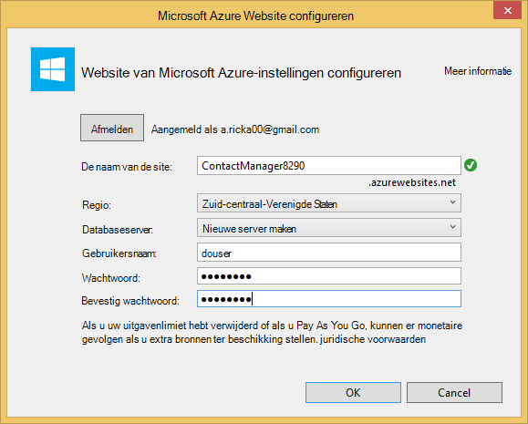

<properties 
    pageTitle="Een REST-service met behulp van ASP.NET Web API en de SQL-Database in Azure App-Service maken" 
    description="Een zelfstudie over u het implementeren van een toepassing die gebruikmaakt van de ASP.NET-Web-API aan een Azure web app met behulp van Visual Studio." 
    services="app-service\web" 
    documentationCenter=".net" 
    authors="Rick-Anderson" 
    writer="Rick-Anderson" 
    manager="wpickett" 
    editor=""/>

<tags 
    ms.service="app-service-web" 
    ms.workload="web" 
    ms.tgt_pltfrm="na" 
    ms.devlang="dotnet" 
    ms.topic="article" 
    ms.date="02/29/2016" 
    ms.author="riande"/>

# Een REST-service met behulp van ASP.NET Web API en de SQL-Database in Azure App-Service maken

Deze zelfstudie laat zien hoe een ASP.NET-webtoepassing een [Azure App Service](http://go.microsoft.com/fwlink/?LinkId=529714) implementeren met behulp van de wizard Publiceren in Visual Studio 2013 of Community Edition van Visual Studio 2013. 

Kunt u gratis een Azure account openen en als u nog niet Visual Studio 2013, de SDK installeert automatisch Visual Studio 2013 voor Web Express. Zo kunt u gaan ontwikkelen voor Azure volledig voor gratis.

In deze zelfstudie wordt ervan uitgegaan dat er geen eerdere ervaringen met Azure. Voor het voltooien van deze zelfstudie hebt u een eenvoudige web app omhoog en uitgevoerd in de cloud.
 
U leert:

* Het inschakelen van de computer voor de ontwikkeling van Azure door de Azure SDK installeren.
* Het maken van een project van Visual Studio ASP.NET MVC 5 en publiceren op een Azure app.
* De ASP.NET-Web-API gebruiken voor het inschakelen van Restful API-aanroepen.
* Het gebruik van een SQL-database voor het opslaan van gegevens in Azure.
* Het publiceren van updates voor toepassingen met Azure.

U kunt een eenvoudige lijst met contactpersonen van een webtoepassing die is gebaseerd op ASP.NET MVC 5 en ADO.NET entiteit Framework wordt gebruikt voor toegang tot de database gaat maken. In de volgende afbeelding ziet u de voltooide toepassing:

![Screenshot van website][intro001]

<!-- the next line produces the "Set up the development environment" section as see at http://azure.microsoft.com/documentation/articles/web-sites-dotnet-get-started/ -->
[AZURE.INCLUDE [create-account-and-websites-note](../../includes/create-account-and-websites-note.md)]

### Het project maken

1. Start Visual Studio 2013.
1. Klik in het menu **bestand** op **Nieuw Project**.
3. Vouw **Visual C#** en selecteert u **Web** in het dialoogvenster **Nieuw Project** en schakelt u **ASP.NET-webtoepassingen**. Naam van de toepassing **ContactManager** en klik op **OK**.

    

1. Selecteer de sjabloon **MVC** in het dialoogvenster **Nieuw Project voor ASP.NET** , **Web-API** controleren en klik op **Verificatie wijzigen**.

1. Klik op **Geen verificatie**in het dialoogvenster **Verificatie wijzigen** en klik op **OK**.

    

    De voorbeeldtoepassing die u maakt, hebben geen functies die gebruikers moeten zich aanmelden. Zie de sectie [Volgende stappen](#nextsteps) aan het einde van deze handleiding voor meer informatie over het implementeren van de functies voor verificatie en machtiging. 

1. Controleer of dat de **Host in de Cloud** is ingeschakeld en klik op **OK**in het dialoogvenster **Nieuw Project voor ASP.NET** .

Als u hebt niet eerder aangemeld bij Azure, wordt u gevraagd aan te melden.

1. De configuratiewizard wordt voorgesteld een unieke naam gebaseerd op *ContactManager* (Zie de onderstaande afbeelding). Selecteer een gebied in de buurt. [Azurespeed.com](http://www.azurespeed.com/ "AzureSpeed.com") kunt u zoeken naar de laagste latentie Datacenter. 
2. Als u een database-server voordat u hebt gemaakt, selecteert u **de nieuwe server maken**, een database-gebruikersnaam en wachtwoord opgeven.

    

Als u een databaseserver hebt, een nieuwe database maken gebruiken. Databaseservers zijn een kostbare bron en in het algemeen wilt maken van meerdere databases op dezelfde server voor testen en ontwikkeling in plaats van een databaseserver per database maken. Zorg ervoor dat uw website en database in dezelfde regio.

### De paginakoptekst en -voettekst instellen

1. Vouw de map *Views\Shared* in de **Solution Explorer**en open het bestand *_Layout.cshtml* .

    ![_Layout.cshtml in de Solution Explorer][newapp004]

1. De inhoud van het bestand *Views\Shared_Layout.cshtml* vervangen door de volgende code:

        <!DOCTYPE html>
        <html lang="en">
        <head>
            <meta charset="utf-8" />
            <title>@ViewBag.Title - Contact Manager</title>
            <link href="~/favicon.ico" rel="shortcut icon" type="image/x-icon" />
            <meta name="viewport" content="width=device-width" />
            @Styles.Render("~/Content/css")
            @Scripts.Render("~/bundles/modernizr")
        </head>
        <body>
            <header>
                

                    

                        
@Html.ActionLink("Contact Manager", "Index", "Home")

                    

                

            </header>
            

                @RenderSection("featured", required: false)
                <section class="content-wrapper main-content clear-fix">
                    @RenderBody()
                </section>
            

            <footer>
                

                    

                        
&copy; @DateTime.Now.Year - Contact Manager

                    

                

            </footer>
            @Scripts.Render("~/bundles/jquery")
            @RenderSection("scripts", required: false)
        </body>
        </html>
            
De markering boven de naam van de app van "Mijn toep" voor de ASP.NET "Contact Manager" gewijzigd en worden de koppelingen naar de **introductiepagina**, **over** en **contactpersoon**verwijderd.

### De toepassing lokaal uitvoeren

1. Druk op CTRL + F5 om de toepassing te starten.
De introductiepagina van de toepassing wordt weergegeven in de standaardbrowser.
    

Dit is hoeft u nu voor het maken van de toepassing die u naar Azure distribueren kunt. Later zult u databasefunctionaliteit toevoegt.

## De Azure-toepassing implementeren

1. In Visual Studio het project in de **Solution Explorer** met de rechtermuisknop en selecteer **publiceren** in het snelmenu.

    ![In het contextmenu project publiceren][PublishVSSolution]

    De wizard **Publiceren** wordt geopend.

12. Klik op **publiceren**.

Visual Studio begint het proces van het kopiëren van bestanden naar de server Azure. Het venster **uitvoer** wordt aangegeven welke acties implementatie zijn genomen en rapporten de implementatie is voltooid.

14. De standaardbrowser wordt automatisch geopend op de URL van de site geïmplementeerd.

    De toepassing die u hebt gemaakt, is nu actief in de cloud.
    
    ![Naar de homepage van takenlijst uitgevoerd in Azure][rxz2]

## Een database toevoegen aan de toepassing

Vervolgens kunt u de toepassing MVC toe te voegen kunnen weergeven en bijwerken van contactpersonen en de gegevens opslaan in een database bijwerken. Het kader van de entiteit de toepassing gebruikt om de database te maken en te lezen en bijwerken van gegevens in de database.

### Model-gegevensklassen voor de contactpersonen toevoegen

U begint met het maken van een eenvoudige gegevensmodel in code.

1. In de **Solution Explorer**met de rechtermuisknop op de map modellen, klikt u op **toevoegen**en **klasse**.

    ![Klasse toevoegen aan het contextmenu modellen][adddb001]

2. Geef het klassebestand de nieuwe *Contact.cs*in het dialoogvenster **Add New Item** en klik vervolgens op **toevoegen**.

    ![Het dialoogvenster Nieuw Item toevoegen][adddb002]

3. De inhoud van het bestand Contacts.cs met de volgende code vervangen.

        using System.Globalization;
        namespace ContactManager.Models
        {
            public class Contact
            {
                public int ContactId { get; set; }
                public string Name { get; set; }
                public string Address { get; set; }
                public string City { get; set; }
                public string State { get; set; }
                public string Zip { get; set; }
                public string Email { get; set; }
                public string Twitter { get; set; }
                public string Self
                {
                    get { return string.Format(CultureInfo.CurrentCulture,
                         "api/contacts/{0}", this.ContactId); }
                    set { }
                }
            }
        }

De klasse **contactpersoon** definieert de gegevens die u voor elke contactpersoon, plus een primaire sleutel ContactID die nodig is door de database wilt opslaan. U krijgt meer informatie over de gegevens in de sectie [Volgende stappen](#nextsteps) aan het einde van deze zelfstudie.

### Maken van webpagina's waarmee gebruikers werken met de contacten app

De ASP.NET-MVC de steiger functie automatisch genereren code waarmee maken, lezen, bijwerken en verwijderen (CRUD) acties.

## Een domeincontroller en een weergave voor de gegevens toevoegen

1. Vouw de map Controllers in de **Solution Explorer**.

3. Compileer het project **(Ctrl + Shift + B)**. (U moet het project samenstellen voordat steigers mechanisme.) 

4. Klik met de rechtermuisknop op de map met domeincontrollers en klik op **toevoegen**en klik op **domeincontroller**.

    ![Domeincontroller toevoegen in het contextmenu Controllers][addcode001]

1. In het dialoogvenster **Toevoegen Scaffold** **MVC-Controller met weergaven met Framework entiteit** te selecteren en op **toevoegen**.

 

6. De naam van de domeincontroller ingesteld op **HomeController**. Selecteer de **contactpersoon die** als uw klasse model. Klik op de knop **nieuwe gegevenscontext voor** en accepteer de standaardinstelling 'ContactManager.Models.ContactManagerContext' voor het **nieuwe gegevenstype context**. Klik op **toevoegen**.

    Een dialoogvenster wordt gevraagd: "een bestand met de naam HomeController bestaat al. Wilt u het vervangen? ". Klik op **Ja**. We wilt de Home-Controller die is gemaakt met het nieuwe project overschrijven. De nieuwe start-Controller gebruiken we voor onze lijst met contactpersonen.

    Visual Studio controller methoden en weergaven voor databasebewerkingen CRUD voor **Contact** -objecten gemaakt.

## Inschakelen van migraties, maken van de database, voorbeeldgegevens en een initialiseren gegevens toevoegen ##

De volgende taak is de [Eerste migraties Code](http://curah.microsoft.com/55220) inschakelen om te kunnen maken van de database op basis van het gegevensmodel dat u hebt gemaakt.

1. In het menu **Extra** en selecteer **Library Package Manager** en vervolgens op **Package Manager-Console**.

    ![Package Manager-Console in het menu Extra][addcode008]

2. Voer de volgende opdracht in het consolevenster **Package Manager** :

        enable-migrations 
  
    Met de opdracht **enable migraties** maakt een map *migraties* en wordt geplaatst in de map een bestand *Configuration.cs* dat u bewerken kunt om de migratie te configureren. 

2. Voer de volgende opdracht in het consolevenster **Package Manager** :

        add-migration Initial

    De opdracht **toevoegen migratie eerste** genereert een klasse met de naam ** &lt;date_stamp&gt;eerste** dat de database wordt gemaakt. De eerste parameter ( *eerste* ) is een willekeurige en die wordt gebruikt voor het maken van de naam van het bestand. Hier ziet u de nieuwe klassenbestanden in de **Solution Explorer**.

    De methode **van** de tabel contactpersonen maakt in de **eerste** klasse en de **beneden** -methode (wordt gebruikt als u wilt terugkeren naar de vorige staat) daalt het.

3. Open het bestand *Migrations\Configuration.cs* . 

4. Voeg de volgende naamruimten. 

         using ContactManager.Models;

5. De methode *Seed* vervangen door de volgende code:
        
        protected override void Seed(ContactManager.Models.ContactManagerContext context)
        {
            context.Contacts.AddOrUpdate(p => p.Name,
               new Contact
               {
                   Name = "Debra Garcia",
                   Address = "1234 Main St",
                   City = "Redmond",
                   State = "WA",
                   Zip = "10999",
                   Email = "debra@example.com",
                   Twitter = "debra_example"
               },
                new Contact
                {
                    Name = "Thorsten Weinrich",
                    Address = "5678 1st Ave W",
                    City = "Redmond",
                    State = "WA",
                    Zip = "10999",
                    Email = "thorsten@example.com",
                    Twitter = "thorsten_example"
                },
                new Contact
                {
                    Name = "Yuhong Li",
                    Address = "9012 State st",
                    City = "Redmond",
                    State = "WA",
                    Zip = "10999",
                    Email = "yuhong@example.com",
                    Twitter = "yuhong_example"
                },
                new Contact
                {
                    Name = "Jon Orton",
                    Address = "3456 Maple St",
                    City = "Redmond",
                    State = "WA",
                    Zip = "10999",
                    Email = "jon@example.com",
                    Twitter = "jon_example"
                },
                new Contact
                {
                    Name = "Diliana Alexieva-Bosseva",
                    Address = "7890 2nd Ave E",
                    City = "Redmond",
                    State = "WA",
                    Zip = "10999",
                    Email = "diliana@example.com",
                    Twitter = "diliana_example"
                }
                );
        }

    Deze bovenstaande code initialiseert de database met gegevens van de contactpersoon. Zie voor meer informatie over de seeding van de database, [DBs foutopsporing entiteit Framework (EF)](http://blogs.msdn.com/b/rickandy/archive/2013/02/12/seeding-and-debugging-entity-framework-ef-dbs.aspx).

1. Voer de opdracht in de **Package Manager-Console** :

        update-database

    ![Package Manager-opdrachten][addcode009]

    De **update-database** wordt uitgevoerd de eerste migratie waarmee de database wordt gemaakt. Standaard wordt de database gemaakt als een database van SQL Server Express-LocalDB.

1. Druk op CTRL + F5 om de toepassing te starten. 

De toepassing geeft de gegevens en koppelingen bewerken, details en verwijderen.

![MVC-weergave van gegevens][rxz3]

## De weergave bewerken

1. Open het bestand *Views\Home\Index.cshtml* . In de volgende stap zullen we de gegenereerde aantekeningen vervangen door code die gebruikmaakt van [jQuery](http://jquery.com/) en [Knockout.js](http://knockoutjs.com/). Deze nieuwe code haalt de lijst met contactpersonen uit met behulp van web-API en JSON en vervolgens de gegevens gebonden aan de gebruikersinterface met knockout.js. Zie de sectie [Volgende stappen](#nextsteps) aan het einde van deze handleiding voor meer informatie. 

2. De inhoud van het bestand met de volgende code vervangen.

        @model IEnumerable<ContactManager.Models.Contact>
        @{
            ViewBag.Title = "Home";
        }
        @section Scripts {
            @Scripts.Render("~/bundles/knockout")
            
        }
        <ul id="contacts" data-bind="foreach: contacts">
            <li class="ui-widget-content ui-corner-all">
                <h1 data-bind="text: Name" class="ui-widget-header"></h1>
                

                

                    ,
                    
                    
                

                

                
Email?

                

                
Twitter?

                
<a data-bind="attr: { href: Self }, click: $root.removeContact" class="removeContact ui-state-default ui-corner-all">Remove</a>

            </li>
        </ul>
        <form id="addContact" data-bind="submit: addContact">
            <fieldset>
                <legend>Add New Contact</legend>
                <ol>
                    <li>
                        <label for="Name">Name</label>
                        <input type="text" name="Name" />
                    </li>
                    <li>
                        <label for="Address">Address</label>
                        <input type="text" name="Address" >
                    </li>
                    <li>
                        <label for="City">City</label>
                        <input type="text" name="City" />
                    </li>
                    <li>
                        <label for="State">State</label>
                        <input type="text" name="State" />
                    </li>
                    <li>
                        <label for="Zip">Zip</label>
                        <input type="text" name="Zip" />
                    </li>
                    <li>
                        <label for="Email">E-mail</label>
                        <input type="text" name="Email" />
                    </li>
                    <li>
                        <label for="Twitter">Twitter</label>
                        <input type="text" name="Twitter" />
                    </li>
                </ol>
                <input type="submit" value="Add" />
            </fieldset>
        </form>

3. Klik met de rechtermuisknop op de map met inhoud en klikt u op **toevoegen**en klik vervolgens op **Nieuw Item...**.

    ![Opmaakmodel toevoegen in het contextmenu van de map met inhoud][addcode005]

4. **Stijl** in de bovenste rechts zoekvak invoeren in het dialoogvenster **Add New Item** en selecteer **Stijlpagina**.
    ![Het dialoogvenster Nieuw Item toevoegen][rxStyle]

5. Geef het bestand *Contacts.css* en klik op **toevoegen**. De inhoud van het bestand met de volgende code vervangen.
    
        .column {
            float: left;
            width: 50%;
            padding: 0;
            margin: 5px 0;
        }
        form ol {
            list-style-type: none;
            padding: 0;
            margin: 0;
        }
        form li {
            padding: 1px;
            margin: 3px;
        }
        form input[type="text"] {
            width: 100%;
        }
        #addContact {
            width: 300px;
            float: left;
            width:30%;
        }
        #contacts {
            list-style-type: none;
            margin: 0;
            padding: 0;
            float:left;
            width: 70%;
        }
        #contacts li {
            margin: 3px 3px 3px 0;
            padding: 1px;
            float: left;
            width: 300px;
            text-align: center;
            background-image: none;
            background-color: #F5F5F5;
        }
        #contacts li h1
        {
            padding: 0;
            margin: 0;
            background-image: none;
            background-color: Orange;
            color: White;
            font-family: Trebuchet MS, Tahoma, Verdana, Arial, sans-serif;
        }
        .removeContact, .viewImage
        {
            padding: 3px;
            text-decoration: none;
        }

    Voor de opmaak, kleuren en stijlen die worden gebruikt in de app contactpersoonbeheer gebruiken we dit opmaakmodel.

6. Open het bestand *App_Start\BundleConfig.cs* .

7. Voeg de volgende code om de [uitname](http://knockoutjs.com/index.html "KO") -invoegtoepassing registreren.

        bundles.Add(new ScriptBundle("~/bundles/knockout").Include(
                    "~/Scripts/knockout-{version}.js"));
    In dit voorbeeld met uitname te vereenvoudigen, dynamische JavaScript-code die de scherm-sjablonen worden verwerkt.

8. Wijzig de vermelding inhoud/CSS-opmaakmodel van het *contacts.css* registreren. Wijzig de volgende regel:

                 bundles.Add(new StyleBundle("~/Content/css").Include(
                   "~/Content/bootstrap.css",
                   "~/Content/site.css"));
Aan:

        bundles.Add(new StyleBundle("~/Content/css").Include(
                   "~/Content/bootstrap.css",
                   "~/Content/contacts.css",
                   "~/Content/site.css"));

1. In de Package Manager-Console de volgende opdracht installeren uitnemen.

        Install-Package knockoutjs

## Een domeincontroller voor het Web API Restful interface toevoegen

1. In de **Solution Explorer**met de rechtermuisknop op domeincontrollers en klik op **toevoegen** en vervolgens **Controller...** 

1. **Web API 2-Controller met acties, met behulp van entiteit Framework** opgeven in het dialoogvenster **Scaffold toevoegen** en klik op **toevoegen**.

    

4. Voer in het dialoogvenster **Domeincontroller toevoegen** "ContactsController" Als de naam van de domeincontroller. Selecteer 'Contactpersoon (ContactManager.Models)' voor de **klasse Model**.  De standaardwaarde voor de **klasse verband**houden. 

6. Klik op **toevoegen**.

### De toepassing lokaal uitvoeren

1. Druk op CTRL + F5 om de toepassing te starten.

    ![Pagina index][intro001]

2. Een contactpersoon en klik op **toevoegen**. De app wordt naar de introductiepagina en de contactpersoon die u hebt ingevoerd worden.

    ![Indexpagina met een lijst van taken][addwebapi004]

3. Toevoegen aan **/api/contacts** om de URL in de browser.

    De resulterende URL zal lijken op api-http://localhost:1234/contactpersonen. Het RESTful web API die u hebt toegevoegd, retourneert de contactpersonen opgeslagen. Firefox en Chrome worden de gegevens in XML-indeling weergegeven.

    ![Indexpagina met een lijst van taken][rxFFchrome]
    

    IE wordt gevraagd of u wilt openen of opslaan van de contactpersonen.

    ![Web API dialoogvenster Opslaan][addwebapi006]
    
    
    U kunt de geretourneerde contactpersonen openen in Kladblok of in een browser.
    
    Deze uitvoer kan worden gebruikt door een andere toepassing zoals mobiele website of toepassing.

    ![Web API dialoogvenster Opslaan][addwebapi007]

    **Waarschuwing**: op dit punt, uw toepassing is onveilig en kwetsbaar voor CSRF-aanval. Verderop in de zelfstudie voor wordt dit beveiligingslek verwijderd. Voor meer informatie Zie [aanvallen voorkomen Cross-Site Request vervalsing (CSRF)][prevent-csrf-attacks].
## XSRF beveiliging toevoegen

Cross-site request vervalsing (ook bekend als XSRF of CSRF) is een aanval op het web gehoste toepassingen waarbij een schadelijke website invloed hebben op de interactie tussen de browser van een client en een website die wordt vertrouwd door die browser. Deze aanvallen zijn mogelijk gemaakt omdat webbrowsers verificatietokens automatisch bij elke aanvraag naar een website sturen. Het canonieke voorbeeld is een verificatiecookie zoals ASP. NET van Forms-verificatie ticket. Websites die gebruikmaken van een permanente verificatiemechanisme (zoals Windows-verificatie, Basic, enzovoort) kunnen echter van deze aanvallen worden gericht.

Een XSRF aanval verschilt van een phishing-aanval. Phishingaanvallen vereist interactie van het slachtoffer. In een phishing-aanval, de doelwebsite wordt nagebootst door een schadelijke website en het slachtoffer is in het verstrekken van gevoelige informatie aan de aanvaller misleiden. Bij een aanval van een XSRF is vaak geen interactie van het slachtoffer nodig. De aanvaller is in plaats daarvan vertrouwen op de browser automatisch alle relevante cookies naar de website van bestemming wordt verzonden.

Zie voor meer informatie het [Geopende Web Application Security-Project](https://www.owasp.org/index.php/Main_Page) (OWASP) [XSRF](https://www.owasp.org/index.php/Cross-Site_Request_Forgery_(CSRF)).

1. Rechts **ContactManager** project in de **Solution Explorer**en klik op **toevoegen** en klik op **klasse**.

2. Geef het bestand *ValidateHttpAntiForgeryTokenAttribute.cs* en voeg de volgende code toe:

        using System;
        using System.Collections.Generic;
        using System.Linq;
        using System.Net;
        using System.Net.Http;
        using System.Web.Helpers;
        using System.Web.Http.Controllers;
        using System.Web.Http.Filters;
        using System.Web.Mvc;
        namespace ContactManager.Filters
        {
            public class ValidateHttpAntiForgeryTokenAttribute : AuthorizationFilterAttribute
            {
                public override void OnAuthorization(HttpActionContext actionContext)
                {
                    HttpRequestMessage request = actionContext.ControllerContext.Request;
                    try
                    {
                        if (IsAjaxRequest(request))
                        {
                            ValidateRequestHeader(request);
                        }
                        else
                        {
                            AntiForgery.Validate();
                        }
                    }
                    catch (HttpAntiForgeryException e)
                    {
                        actionContext.Response = request.CreateErrorResponse(HttpStatusCode.Forbidden, e);
                    }
                }
                private bool IsAjaxRequest(HttpRequestMessage request)
                {
                    IEnumerable<string> xRequestedWithHeaders;
                    if (request.Headers.TryGetValues("X-Requested-With", out xRequestedWithHeaders))
                    {
                        string headerValue = xRequestedWithHeaders.FirstOrDefault();
                        if (!String.IsNullOrEmpty(headerValue))
                        {
                            return String.Equals(headerValue, "XMLHttpRequest", StringComparison.OrdinalIgnoreCase);
                        }
                    }
                    return false;
                }
                private void ValidateRequestHeader(HttpRequestMessage request)
                {
                    string cookieToken = String.Empty;
                    string formToken = String.Empty;
                    IEnumerable<string> tokenHeaders;
                    if (request.Headers.TryGetValues("RequestVerificationToken", out tokenHeaders))
                    {
                        string tokenValue = tokenHeaders.FirstOrDefault();
                        if (!String.IsNullOrEmpty(tokenValue))
                        {
                            string[] tokens = tokenValue.Split(':');
                            if (tokens.Length == 2)
                            {
                                cookieToken = tokens[0].Trim();
                                formToken = tokens[1].Trim();
                            }
                        }
                    }
                    AntiForgery.Validate(cookieToken, formToken);
                }
            }
        }

1. Toevoegen aan de controller contracten met de volgende instructie voor het *gebruik van* zodat u toegang tot het kenmerk **[ValidateHttpAntiForgeryToken hebt]** .

        using ContactManager.Filters;

1. Voeg het kenmerk **[ValidateHttpAntiForgeryToken]** aan de methoden van de Post van de **ContactsController** te beschermen tegen bedreigingen van de XSRF. U zal deze toevoegen aan de actie 'PutContact', 'PostContact' en **DeleteContact** methoden.

        [ValidateHttpAntiForgeryToken]
            public IHttpActionResult PutContact(int id, Contact contact)
            {

1. De *Scripts* sectie van het bestand *Views\Home\Index.cshtml* op te nemen van de code voor de XSRF-tokens worden bijgewerkt.

         @section Scripts {
            @Scripts.Render("~/bundles/knockout")
            
         }

## De update naar Azure en SQL-Database publiceren

Voor het publiceren van de toepassing, herhaalt u de procedure die u eerder hebt uitgevoerd.

1. Klik met de rechtermuisknop op het project in de **Solution Explorer**en selecteer **publiceren**.

    ![Publiceren][rxP]

5. Klik op het tabblad **Instellingen** .
    

1. Klik op het pictogram **v** *externe verbindingsreeks* wijzigen in de verbindingsreeks voor de database met contactpersonen onder **ContactsManagerContext(ContactsManagerContext)**. Klik op **ContactDB**.

    

7. Schakel het selectievakje in voor het **Uitvoeren van Code eerste migraties (wordt uitgevoerd op start van toepassing)**.

1. Klik op **volgende** en klik vervolgens op **voorbeeld**. Visual Studio geeft een lijst van de bestanden die worden toegevoegd of bijgewerkt.

8. Klik op **publiceren**.
Nadat de installatie is voltooid, opent u de browser naar de introductiepagina van de toepassing.

    ![Indexpagina met geen contactpersonen][intro001]

    De Visual Studio proces automatisch publiceren de verbindingsreeks in de geïmplementeerde *Web.config* -bestand om te verwijzen naar de SQL-database geconfigureerd. Het eerste migraties Code om automatisch de database bijwerken naar de nieuwste versie voor het eerst dat de toepassing gebruikmaakt van de database na implementatie ook geconfigureerd.

    Als gevolg van deze configuratie Code eerst de database is gemaakt door het uitvoeren van de code in de **eerste** klasse die u eerder hebt gemaakt. Het is dit de eerste keer die de toepassing probeert toegang te krijgen tot de database na de implementatie.

9. Geef een contactpersoon als u lokaal, de app hebt uitgevoerd om te verifiëren toen dat de implementatie van de database is voltooid.

Wanneer u ziet dat het artikel dat u opgeeft wordt opgeslagen en op de pagina contact manager weergegeven, weet u dat deze is opgeslagen in de database.

![Pagina index met contactpersonen][addwebapi004]

De toepassing wordt nu uitgevoerd in de cloud, met behulp van SQL-Database voor het opslaan van de gegevens. Nadat u de toepassing testen in Azure, verwijderen. De toepassing is openbaar en heeft geen mechanisme om toegang te beperken.

>[AZURE.NOTE] Als u wilt aan de slag met Azure App-Service voordat u aanmelden voor een account met Azure, gaat u naar de [App-Service probeert](http://go.microsoft.com/fwlink/?LinkId=523751), waar u direct een starter tijdelijk web app in de App-Service maken kunt. Geen creditcard vereist; geen verplichtingen.

## Volgende stappen

Een echte toepassing vereist verificatie en autorisatie en gebruikt u de database lidmaatschap voor dat doel. De zelfstudie [Secure ASP.NET MVC met OAuth, lidmaatschap en SQL-Database-toepassingen distribueren](web-sites-dotnet-deploy-aspnet-mvc-app-membership-oauth-sql-database.md) op basis van deze zelfstudie en het implementeren van een webtoepassing met de database van het lidmaatschap geeft.

Een andere manier voor het opslaan van gegevens in een toepassing Azure is Azure opslag, gebruiken die niet-relationele gegevensopslag in de vorm van BLOB's en tabellen bevatten. De volgende koppelingen bieden meer informatie over Web-API, ASP.NET MVC en venster Azure.
 

* [Aan de slag met gebruik van MVC entiteit-Framework][EFCodeFirstMVCTutorial]
* [Inleiding tot ASP.NET MVC 5](http://www.asp.net/mvc/tutorials/mvc-5/introduction/getting-started)
* [Uw eerste ASP.NET Web API](http://www.asp.net/web-api/overview/getting-started-with-aspnet-web-api/tutorial-your-first-web-api)
* [Foutopsporing in WAWS](web-sites-dotnet-troubleshoot-visual-studio.md)

Deze zelfstudie en de voorbeeldtoepassing is geschreven door [Rick Anderson](http://blogs.msdn.com/b/rickandy/) (Twitter [@RickAndMSFT](https://twitter.com/RickAndMSFT)) met hulp van Tom Dykstra en Barry Dorrans (Twitter [@blowdart](https://twitter.com/blowdart)). 

Neem verbeterd verlof feedback over u interessant vond of wat u zou willen zien, niet alleen over de zelfstudie zelf, maar ook over de producten die laat. Uw feedback kunnen we prioriteren verbeteringen. We zijn vooral geïnteresseerd in hoe u kunt nagaan hoeveel rente meer automatisering voor het proces van de configuratie en implementatie van de database van het lidmaatschap is. 

## Wat er veranderd
* Zie voor een handleiding voor het wijzigen van Websites met App-Service: [Azure App Service en de Impact op de bestaande Azure Services](http://go.microsoft.com/fwlink/?LinkId=529714)

<!-- bookmarks -->
[Add an OAuth Provider]: #addOauth
[Add Roles to the Membership Database]:#mbrDB
[Create a Data Deployment Script]:#ppd
[Update the Membership Database]:#ppd2
[setupdbenv]: #bkmk_setupdevenv
[setupwindowsazureenv]: #bkmk_setupwindowsazure
[createapplication]: #bkmk_createmvc4app
[deployapp1]: #bkmk_deploytowindowsazure1
[adddb]: #bkmk_addadatabase
[addcontroller]: #bkmk_addcontroller
[addwebapi]: #bkmk_addwebapi
[deploy2]: #bkmk_deploydatabaseupdate

<!-- links -->
[EFCodeFirstMVCTutorial]: http://www.asp.net/mvc/tutorials/getting-started-with-ef-using-mvc/creating-an-entity-framework-data-model-for-an-asp-net-mvc-application
[dbcontext-link]: http://msdn.microsoft.com/library/system.data.entity.dbcontext(v=VS.103).aspx

<!-- images-->
[rxE]: ./media/web-sites-dotnet-rest-service-aspnet-api-sql-database/rxE.png
[rxP]: ./media/web-sites-dotnet-rest-service-aspnet-api-sql-database/rxP.png
[rx22]: ./media/web-sites-dotnet-rest-service-aspnet-api-sql-database/
[rxb2]: ./media/web-sites-dotnet-rest-service-aspnet-api-sql-database/rxb2.png
[rxz]: ./media/web-sites-dotnet-rest-service-aspnet-api-sql-database/rxz.png
[rxzz]: ./media/web-sites-dotnet-rest-service-aspnet-api-sql-database/rxzz.png
[rxz2]: ./media/web-sites-dotnet-rest-service-aspnet-api-sql-database/rxz2.png
[rxz3]: ./media/web-sites-dotnet-rest-service-aspnet-api-sql-database/rxz3.png
[rxStyle]: ./media/web-sites-dotnet-rest-service-aspnet-api-sql-database/rxStyle.png
[rxz4]: ./media/web-sites-dotnet-rest-service-aspnet-api-sql-database/rxz4.png
[rxz44]: ./media/web-sites-dotnet-rest-service-aspnet-api-sql-database/rxz44.png
[rxNewCtx]: ./media/web-sites-dotnet-rest-service-aspnet-api-sql-database/rxNewCtx.png
[rxPrevDB]: ./media/web-sites-dotnet-rest-service-aspnet-api-sql-database/rxPrevDB.png
[rxOverwrite]: ./media/web-sites-dotnet-rest-service-aspnet-api-sql-database/rxOverwrite.png
[rxPWS]: ./media/web-sites-dotnet-rest-service-aspnet-api-sql-database/rxPWS.png
[rxNewCtx]: ./media/web-sites-dotnet-rest-service-aspnet-api-sql-database/rxNewCtx.png
[rxAddApiController]: ./media/web-sites-dotnet-rest-service-aspnet-api-sql-database/rxAddApiController.png
[rxFFchrome]: ./media/web-sites-dotnet-rest-service-aspnet-api-sql-database/rxFFchrome.png
[intro001]: ./media/web-sites-dotnet-rest-service-aspnet-api-sql-database/dntutmobil-intro-finished-web-app.png
[rxCreateWSwithDB]: ./media/web-sites-dotnet-rest-service-aspnet-api-sql-database/rxCreateWSwithDB.png
[setup007]: ./media/web-sites-dotnet-rest-service-aspnet-api-sql-database/dntutmobile-setup-azure-site-004.png
[setup009]: ../Media/dntutmobile-setup-azure-site-006.png
[newapp002]: ./media/web-sites-dotnet-rest-service-aspnet-api-sql-database/dntutmobile-createapp-002.png
[newapp004]: ./media/web-sites-dotnet-rest-service-aspnet-api-sql-database/dntutmobile-createapp-004.png
[firsdeploy007]: ./media/web-sites-dotnet-rest-service-aspnet-api-sql-database/dntutmobile-deploy1-publish-005.png
[firsdeploy009]: ./media/web-sites-dotnet-rest-service-aspnet-api-sql-database/dntutmobile-deploy1-publish-007.png
[adddb001]: ./media/web-sites-dotnet-rest-service-aspnet-api-sql-database/dntutmobile-adddatabase-001.png
[adddb002]: ./media/web-sites-dotnet-rest-service-aspnet-api-sql-database/dntutmobile-adddatabase-002.png
[addcode001]: ./media/web-sites-dotnet-rest-service-aspnet-api-sql-database/dntutmobile-controller-add-context-menu.png
[addcode002]: ./media/web-sites-dotnet-rest-service-aspnet-api-sql-database/dntutmobile-controller-add-controller-dialog.png
[addcode004]: ./media/web-sites-dotnet-rest-service-aspnet-api-sql-database/dntutmobile-controller-modify-index-context.png
[addcode005]: ./media/web-sites-dotnet-rest-service-aspnet-api-sql-database/dntutmobile-controller-add-contents-context-menu.png
[addcode007]: ./media/web-sites-dotnet-rest-service-aspnet-api-sql-database/dntutmobile-controller-modify-bundleconfig-context.png
[addcode008]: ./media/web-sites-dotnet-rest-service-aspnet-api-sql-database/dntutmobile-migrations-package-manager-menu.png
[addcode009]: ./media/web-sites-dotnet-rest-service-aspnet-api-sql-database/dntutmobile-migrations-package-manager-console.png
[addwebapi004]: ./media/web-sites-dotnet-rest-service-aspnet-api-sql-database/dntutmobile-webapi-added-contact.png
[addwebapi006]: ./media/web-sites-dotnet-rest-service-aspnet-api-sql-database/dntutmobile-webapi-save-returned-contacts.png
[addwebapi007]: ./media/web-sites-dotnet-rest-service-aspnet-api-sql-database/dntutmobile-webapi-contacts-in-notepad.png
[Add XSRF Protection]: #xsrf
[WebPIAzureSdk20NetVS12]: ./media/web-sites-dotnet-rest-service-aspnet-api-sql-database/WebPIAzureSdk20NetVS12.png
[Add XSRF Protection]: #xsrf
[ImportPublishSettings]: ./media/web-sites-dotnet-rest-service-aspnet-api-sql-database/ImportPublishSettings.png
[ImportPublishProfile]: ./media/web-sites-dotnet-rest-service-aspnet-api-sql-database/ImportPublishProfile.png
[PublishVSSolution]: ./media/web-sites-dotnet-rest-service-aspnet-api-sql-database/PublishVSSolution.png
[ValidateConnection]: ./media/web-sites-dotnet-rest-service-aspnet-api-sql-database/ValidateConnection.png
[WebPIAzureSdk20NetVS12]: ./media/web-sites-dotnet-rest-service-aspnet-api-sql-database/WebPIAzureSdk20NetVS12.png
[prevent-csrf-attacks]: http://www.asp.net/web-api/overview/security/preventing-cross-site-request-forgery-(csrf)-attacks
 
