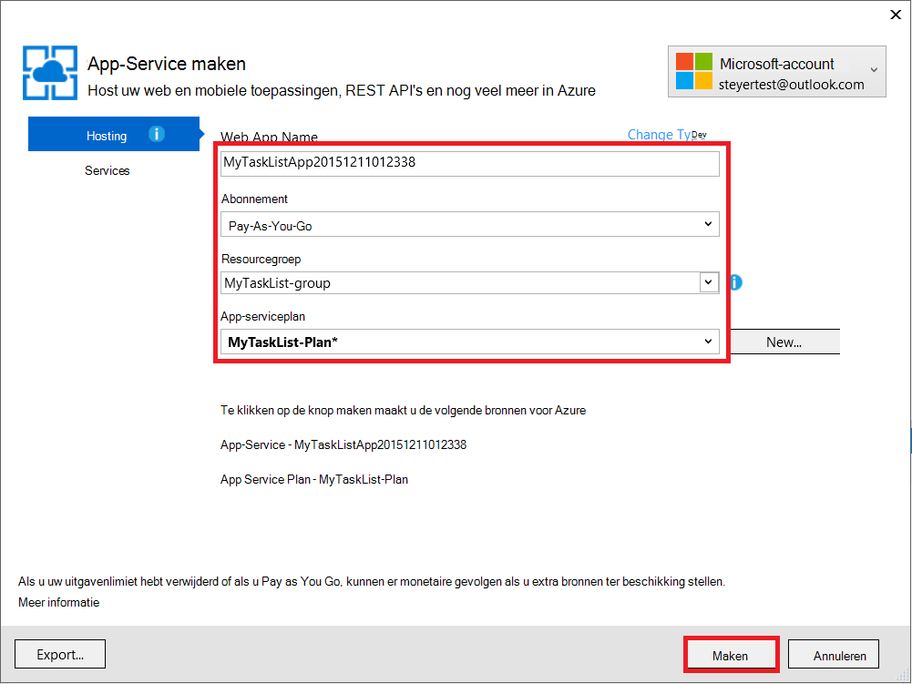
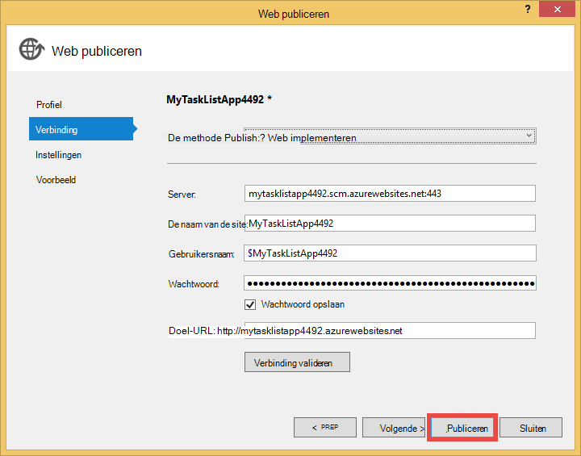

<properties 
    pageTitle="Een web app in Azure die is verbonden met MongoDB uitgevoerd op een virtuele machine maken" 
    description="Een zelfstudie over u het gebruik van Git een ASP.NET-toepassing implementeren op Azure App Service, verbonden met MongoDB op een Azure Virtual Machine."
    tags="azure-portal" 
    services="app-service\web, virtual-machines" 
    documentationCenter=".net" 
    authors="cephalin" 
    manager="wpickett" 
    editor=""/>

<tags 
    ms.service="app-service-web" 
    ms.workload="web" 
    ms.tgt_pltfrm="na" 
    ms.devlang="dotnet" 
    ms.topic="article" 
    ms.date="02/29/2016" 
    ms.author="cephalin"/>

# Een web app in Azure die is verbonden met MongoDB uitgevoerd op een virtuele machine maken

Git gebruikt, kunt u een ASP.NET-toepassing naar Azure App Service Web Apps implementeren. In deze zelfstudie bouwt u een eenvoudige front-ASP.NET MVC taak lijst toepassing die verbinding maakt met een database MongoDB is uitgevoerd op een virtuele machine in Azure.  [MongoDB] [ MongoDB] is een populaire open-source, krachtige NoSQL database. Na het uitvoeren en testen van de ASP.NET-toepassing op de computer, wordt u de toepassing op App Service Web Apps met behulp van Git uploaden.

>[AZURE.NOTE] Als u wilt aan de slag met Azure App-Service voordat u aanmelden voor een account met Azure, gaat u naar de [App-Service probeert](http://go.microsoft.com/fwlink/?LinkId=523751), waar u direct een starter tijdelijk web app in de App-Service maken kunt. Geen creditcard vereist; geen verplichtingen.

## Achtergrondkennis ##

Kennis van de volgende is handig voor deze zelfstudie, maar niet vereist:

* De C# stuurprogramma voor MongoDB. Zie voor meer informatie over het ontwikkelen van C#-toepassingen tegen MongoDB MongoDB [CSharp Language Center][MongoC#LangCenter]. 
* ASP .NET web application framework. U kunt meer te weten over het op de [website van de ASP.net]-[ASP.NET].
* ASP .NET MVC web application framework. Meer over het op de [website van ASP.NET MVC]-[MVCWebSite].
* Azure. U kunt aan de slag met [Azure]lezen[WindowsAzure].

## Vereisten ##

- [Visual Studio Express 2013 voor Web]  [ VSEWeb] of [Visual Studio 2013] [VSUlt]
- [Azure SDK voor .NET](http://go.microsoft.com/fwlink/p/?linkid=323510&clcid=0x409)
- Een abonnement op Microsoft Azure active

[AZURE.INCLUDE [create-account-and-websites-note](../../includes/create-account-and-websites-note.md)]

 
## Een virtuele machine maken en installeren van MongoDB ##

In deze zelfstudie wordt ervan uitgegaan dat u een virtuele machine hebt gemaakt in Azure. Nadat u de virtuele machine hebt gemaakt, moet u MongoDB installeren op de virtuele machine:

* Zie [MongoDB installeren op een virtuele machine met Windows Server in Azure]wilt maken van een virtuele Windows-computer en installeer MongoDB,[InstallMongoOnWindowsVM].

Nadat u de virtuele machine gemaakt in Azure en MongoDB geïnstalleerd, moet u de DNS-naam van de virtuele machine ("testlinuxvm.cloudapp.net", bijvoorbeeld) en de externe poort voor MongoDB die u hebt opgegeven in het eindpunt te onthouden.  U moet deze informatie later in de zelfstudie.

## De toepassing maken ##

In deze sectie wordt u een ASP.NET-toepassing naam "Mijn taak lijst" met behulp van Visual Studio en uitvoeren van een eerste implementatie naar Azure App Service Web Apps. U de toepassing lokaal wordt uitgevoerd, maar wordt deze verbinding maken met de virtuele machine op Azure en er gebruik van het MongoDB-exemplaar dat u hebt gemaakt.

1. Klik op **Nieuw Project**in Visual Studio.

    ![Pagina Nieuw Project starten][StartPageNewProject]

1. Selecteer **Visual C#**in het venster **Nieuw Project** in het linkerdeelvenster en selecteer **Web**. Selecteer in het middelste deelvenster **ASP.NET-webtoepassingen**. Onder de naam van het project 'MyTaskListApp' en klik op **OK**.

    ![Dialoogvenster New Project][NewProjectMyTaskListApp]

1. In het dialoogvenster **Nieuw Project voor ASP.NET** **MVC**selecteren en klik vervolgens op **OK**.

    ![Selecteer de sjabloon MVC][VS2013SelectMVCTemplate]

1. Als u nog niet hebt aangemeld in Microsoft Azure, wordt u gevraagd aan te melden. Volg de aanwijzingen om aan te melden in Azure.
2. Zodra u bent ingelogd, kunt u beginnen met het configureren van uw web app in App-Service. Geef de **naam Web App** **App serviceplan**, **resourcegroep**en **regio**en klik vervolgens op **maken**.

    

1. Nadat het project maken is voltooid, wacht de web app in Azure App-Service worden gemaakt, zoals aangegeven in het venster **Activiteit App Azure** . Klik vervolgens op **Publiceren MyTaskListApp voor dit Web App nu**.

1. Klik op **publiceren**.

    

    Als de standaard ASP.NET-toepassing naar Azure App Service Web Apps is gepubliceerd, wordt deze in de browser worden gestart.

## Installeer het stuurprogramma MongoDB C#

MongoDB biedt client-ondersteuning voor C#-toepassingen met een stuurprogramma dat u wilt installeren op de lokale computer. De C#-stuurprogramma is beschikbaar via NuGet.

Het stuurprogramma MongoDB C#:

1. In de **Solution Explorer**met de rechtermuisknop op het project **MyTaskListApp** en **NuGetPackages beheren**selecteren.

    ![NuGet pakketten beheren][VS2013ManageNuGetPackages]

2. Klik in het venster **NuGet pakketten beheren** in het linkerdeelvenster op **Online**. Typ in het vak **Zoeken Online** rechts 'mongodb.driver'.  Klik op **installeren** om het stuurprogramma te installeren.

    ![Zoeken naar C# MongoDB-stuurprogramma][SearchforMongoDBCSharpDriver]

3. Klik op **ik ga akkoord** om de 10gen, Inc. licentievoorwaarden accepteren.

4. Klik op **sluiten** nadat het stuurprogramma is geïnstalleerd.
    ![C# MongoDB-stuurprogramma geïnstalleerd][MongoDBCsharpDriverInstalled]

Het stuurprogramma MongoDB C# is nu geïnstalleerd.  Verwijzingen naar bibliotheken van de **MongoDB.Bson**, **MongoDB.Driver**en **MongoDB.Driver.Core** zijn toegevoegd aan het project.

![MongoDB-stuurprogramma C#-verwijzingen][MongoDBCSharpDriverReferences]

## Een model toevoegen ##
In de **Solution Explorer**met de rechtermuisknop op de map van de *modellen* en het **toevoegen** van een nieuwe **klasse** en geef deze de naam *TaskModel.cs*.  In *TaskModel.cs*, door de bestaande code te vervangen door de volgende code:

    using System;
    using System.Collections.Generic;
    using System.Linq;
    using System.Web;
    using MongoDB.Bson.Serialization.Attributes;
    using MongoDB.Bson.Serialization.IdGenerators;
    using MongoDB.Bson;
    
    namespace MyTaskListApp.Models
    {
        public class MyTask
        {
            [BsonId(IdGenerator = typeof(CombGuidGenerator))]
            public Guid Id { get; set; }
    
            [BsonElement("Name")]
            public string Name { get; set; }
    
            [BsonElement("Category")]
            public string Category { get; set; }
    
            [BsonElement("Date")]
            public DateTime Date { get; set; }
    
            [BsonElement("CreatedDate")]
            public DateTime CreatedDate { get; set; }
    
        }
    }

## De data-access laag toevoegen ##
In de **Solution Explorer**met de rechtermuisknop op het *MyTaskListApp* -project en het **toevoegen** van een **Nieuwe map** met de naam *DAL*.  Met de rechtermuisknop op de map *DAL* en het **toevoegen** van een nieuwe **klasse**. Geef het klassebestand *Dal.cs*.  In *Dal.cs*, door de bestaande code te vervangen door de volgende code:

    using System;
    using System.Collections.Generic;
    using System.Linq;
    using System.Web;
    using MyTaskListApp.Models;
    using MongoDB.Driver;
    using MongoDB.Bson;
    using System.Configuration;
    
    
    namespace MyTaskListApp
    {
        public class Dal : IDisposable
        {
            private MongoServer mongoServer = null;
            private bool disposed = false;
    
            // To do: update the connection string with the DNS name
            // or IP address of your server. 
            //For example, "mongodb://testlinux.cloudapp.net"
            private string connectionString = "mongodb://mongodbsrv20151211.cloudapp.net";
    
            // This sample uses a database named "Tasks" and a 
            //collection named "TasksList".  The database and collection 
            //will be automatically created if they don't already exist.
            private string dbName = "Tasks";
            private string collectionName = "TasksList";
    
            // Default constructor.        
            public Dal()
            {
            }
    
            // Gets all Task items from the MongoDB server.        
            public List<MyTask> GetAllTasks()
            {
                try
                {
                    var collection = GetTasksCollection();
                    return collection.Find(new BsonDocument()).ToList();
                }
                catch (MongoConnectionException)
                {
                    return new List<MyTask>();
                }
            }
    
            // Creates a Task and inserts it into the collection in MongoDB.
            public void CreateTask(MyTask task)
            {
                var collection = GetTasksCollectionForEdit();
                try
                {
                    collection.InsertOne(task);
                }
                catch (MongoCommandException ex)
                {
                    string msg = ex.Message;
                }
            }
    
            private IMongoCollection<MyTask> GetTasksCollection()
            {
                MongoClient client = new MongoClient(connectionString);
                var database = client.GetDatabase(dbName);
                var todoTaskCollection = database.GetCollection<MyTask>(collectionName);
                return todoTaskCollection;
            }
    
            private IMongoCollection<MyTask> GetTasksCollectionForEdit()
            {
                MongoClient client = new MongoClient(connectionString);
                var database = client.GetDatabase(dbName);
                var todoTaskCollection = database.GetCollection<MyTask>(collectionName);
                return todoTaskCollection;
            }
    
            # region IDisposable
    
            public void Dispose()
            {
                this.Dispose(true);
                GC.SuppressFinalize(this);
            }
    
            protected virtual void Dispose(bool disposing)
            {
                if (!this.disposed)
                {
                    if (disposing)
                    {
                        if (mongoServer != null)
                        {
                            this.mongoServer.Disconnect();
                        }
                    }
                }
    
                this.disposed = true;
            }
    
            # endregion
        }
    }

## Een domeincontroller toevoegen ##
Open het bestand *Controllers\HomeController.cs* in de **Solution Explorer** en de bestaande code te vervangen door het volgende:

    using System;
    using System.Collections.Generic;
    using System.Linq;
    using System.Web;
    using System.Web.Mvc;
    using MyTaskListApp.Models;
    using System.Configuration;
    
    namespace MyTaskListApp.Controllers
    {
        public class HomeController : Controller, IDisposable
        {
            private Dal dal = new Dal();
            private bool disposed = false;
            //
            // GET: /MyTask/
    
            public ActionResult Index()
            {
                return View(dal.GetAllTasks());
            }
    
            //
            // GET: /MyTask/Create
    
            public ActionResult Create()
            {
                return View();
            }
    
            //
            // POST: /MyTask/Create
    
            [HttpPost]
            public ActionResult Create(MyTask task)
            {
                try
                {
                    dal.CreateTask(task);
                    return RedirectToAction("Index");
                }
                catch
                {
                    return View();
                }
            }
    
            public ActionResult About()
            {
                return View();
            }
    
            # region IDisposable
    
            new protected void Dispose()
            {
                this.Dispose(true);
                GC.SuppressFinalize(this);
            }
    
            new protected virtual void Dispose(bool disposing)
            {
                if (!this.disposed)
                {
                    if (disposing)
                    {
                        this.dal.Dispose();
                    }
                }
    
                this.disposed = true;
            }
    
            # endregion
    
        }
    }

## De stijlen instellen ##
De titel boven aan de pagina wilt wijzigen, opent u de *Views\Shared\\_Layout.cshtml* -bestand in de **Solution Explorer** en vervangen door 'Naam toepassing' in de koptekst van de navigatiebalk "Mijn taak lijst Application" zodat deze er als volgt uitziet:

    @Html.ActionLink("My Task List Application", "Index", "Home", null, new { @class = "navbar-brand" })

Open het bestand *\Views\Home\Index.cshtml* wilt instellen op het menu van de lijst met taken, en de bestaande code te vervangen door de volgende code:
    
    @model IEnumerable<MyTaskListApp.Models.MyTask>
    
    @{
        ViewBag.Title = "My Task List";
    }
    
    <h2>My Task List</h2>
    
    <table border="1">
        <tr>
            <th>Task</th>
            <th>Category</th>
            <th>Date</th>
            
        </tr>
    
    @foreach (var item in Model) {
        <tr>
            <td>
                @Html.DisplayFor(modelItem => item.Name)
            </td>
            <td>
                @Html.DisplayFor(modelItem => item.Category)
            </td>
            <td>
                @Html.DisplayFor(modelItem => item.Date)
            </td>
            
        </tr>
    }
    
    </table>
    
  @Html.Partial("Create", new MyTaskListApp.Models.MyTask())

Als u wilt de mogelijkheid om een nieuwe taak toevoegen, met de rechtermuisknop op de *Views\Home\\ * map en een **weergave** **toevoegen** .  Naam van de weergave *maken*. De code vervangen door het volgende:

    @model MyTaskListApp.Models.MyTask
    
    
    
    
    
    @using (Html.BeginForm("Create", "Home")) {
        @Html.ValidationSummary(true)
        <fieldset>
            <legend>New Task</legend>
    
            

                @Html.LabelFor(model => model.Name)
            

            

                @Html.EditorFor(model => model.Name)
                @Html.ValidationMessageFor(model => model.Name)
            

    
            

                @Html.LabelFor(model => model.Category)
            

            

                @Html.EditorFor(model => model.Category)
                @Html.ValidationMessageFor(model => model.Category)
            

    
            

                @Html.LabelFor(model => model.Date)
            

            

                @Html.EditorFor(model => model.Date)
                @Html.ValidationMessageFor(model => model.Date)
            

    
            

                <input type="submit" value="Create" />
            

        </fieldset>
    }

**Solution Explorer** ziet er zo uit:

![Solution Explorer][SolutionExplorerMyTaskListApp]

## De verbindingsreeks MongoDB instellen ##
Open het bestand *DAL/Dal.cs* in de **Solution Explorer**. Zoek de volgende regel code:

    private string connectionString = "mongodb://<vm-dns-name>";

Vervangen `<vm-dns-name>` met de DNS-naam van de virtuele machine met MongoDB die u hebt gemaakt in de stap [maken van een virtuele machine en installeren van MongoDB][] van deze zelfstudie.  Als u de DNS-naam van de virtuele machine zoekt, gaat u naar de Portal Azure **DNS-naam**zoeken en selecteer **virtuele Machines**.

Als de DNS-naam van de virtuele machine is 'testlinuxvm.cloudapp.net' en MongoDB op de standaardpoort 27017 luistert, eruit de regel van de verbindingstekenreeks code:

    private string connectionString = "mongodb://testlinuxvm.cloudapp.net";

Als het eindpunt van de virtuele machine een andere externe poort voor MongoDB bevat, kunt u de poort in de verbindingsreeks opgeeft:

    private string connectionString = "mongodb://testlinuxvm.cloudapp.net:12345";

Zie [verbindingen]voor meer informatie over verbindingsreeksen MongoDB[MongoConnectionStrings].

## Lokale implementatie testen ##

**Foutopsporing starten** vanuit het menu **Foutopsporing** te selecteren of druk op **F5**om de toepassing uitvoeren op de computer. IIS Express wordt gestart en een browser wordt geopend en wordt de introductiepagina van de toepassing wordt gestart.  U kunt een nieuwe taak toevoegt, die wordt toegevoegd aan de database MongoDB op uw virtuele machine in Azure.

![Mijn taak lijst toepassing][TaskListAppBlank]

## Publiceren naar Azure App Service Web Apps

In deze sectie kunt u uw wijzigingen wilt publiceren naar Azure App Service Web Apps.

1. In de Solution Explorer, opnieuw met de rechtermuisknop op **MyTaskListApp** en klik op **publiceren**.
2. Klik op **publiceren**.

    U ziet nu uw web app in Azure App-Service wordt uitgevoerd en toegang tot de database MongoDB Azure virtuele Machines.

## Samenvatting ##

U hebt nu uw ASP.NET-toepassing Azure App Service Web Apps met succes geïmplementeerd. De web app bekijken:

1. Meld u aan bij de Azure Portal.
2. Klik op **Web apps**. 
3. Selecteer uw web app in de lijst van **Web Apps** .

Zie voor meer informatie over het ontwikkelen van C#-toepassingen tegen MongoDB [CSharp Language Center][MongoC#LangCenter]. 

[AZURE.INCLUDE [app-service-web-whats-changed](../../includes/app-service-web-whats-changed.md)]
 

<!-- HYPERLINKS -->

[AzurePortal]: http://manage.windowsazure.com
[WindowsAzure]: http://www.windowsazure.com
[MongoC#LangCenter]: http://docs.mongodb.org/ecosystem/drivers/csharp/
[MVCWebSite]: http://www.asp.net/mvc
[ASP.NET]: http://www.asp.net/
[MongoConnectionStrings]: http://www.mongodb.org/display/DOCS/Connections
[MongoDB]: http://www.mongodb.org
[InstallMongoOnWindowsVM]: ../virtual-machines/virtual-machines-windows-classic-install-mongodb.md
[VSEWeb]: http://www.microsoft.com/visualstudio/eng/2013-downloads#d-2013-express
[VSUlt]: http://www.microsoft.com/visualstudio/eng/2013-downloads

<!-- IMAGES -->

[StartPageNewProject]: ./media/web-sites-dotnet-store-data-mongodb-vm/NewProject.png
[NewProjectMyTaskListApp]: ./media/web-sites-dotnet-store-data-mongodb-vm/NewProjectMyTaskListApp.png
[VS2013SelectMVCTemplate]: ./media/web-sites-dotnet-store-data-mongodb-vm/VS2013SelectMVCTemplate.png
[VS2013DefaultMVCApplication]: ./media/web-sites-dotnet-store-data-mongodb-vm/VS2013DefaultMVCApplication.png
[VS2013ManageNuGetPackages]: ./media/web-sites-dotnet-store-data-mongodb-vm/VS2013ManageNuGetPackages.png
[SearchforMongoDBCSharpDriver]: ./media/web-sites-dotnet-store-data-mongodb-vm/SearchforMongoDBCSharpDriver.png
[MongoDBCsharpDriverInstalled]: ./media/web-sites-dotnet-store-data-mongodb-vm/MongoDBCsharpDriverInstalled.png
[MongoDBCSharpDriverReferences]: ./media/web-sites-dotnet-store-data-mongodb-vm/MongoDBCSharpDriverReferences.png
[SolutionExplorerMyTaskListApp]: ./media/web-sites-dotnet-store-data-mongodb-vm/SolutionExplorerMyTaskListApp.png
[TaskListAppBlank]: ./media/web-sites-dotnet-store-data-mongodb-vm/TaskListAppBlank.png
[WAWSCreateWebSite]: ./media/web-sites-dotnet-store-data-mongodb-vm/WAWSCreateWebSite.png
[WAWSDashboardMyTaskListApp]: ./media/web-sites-dotnet-store-data-mongodb-vm/WAWSDashboardMyTaskListApp.png
[Image9]: ./media/web-sites-dotnet-store-data-mongodb-vm/RepoReady.png
[Image10]: ./media/web-sites-dotnet-store-data-mongodb-vm/GitInstructions.png
[Image11]: ./media/web-sites-dotnet-store-data-mongodb-vm/GitDeploymentComplete.png

<!-- TOC BOOKMARKS -->
[Een virtuele machine maken en installeren van MongoDB]: #virtualmachine
[Create and run the My Task List ASP.NET application on your development computer]: #createapp
[Create an Azure web site]: #createwebsite
[Deploy the ASP.NET application to the web site using Git]: #deployapp
 