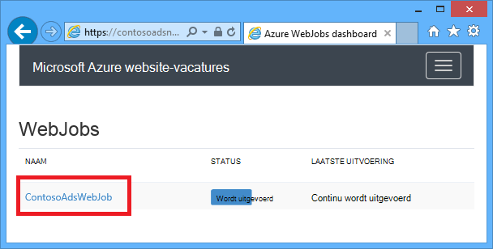
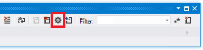
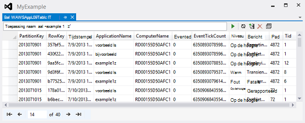

<properties 
    pageTitle="Problemen oplossen met een web app in Azure App-Service met behulp van Visual Studio." 
    description="Informatie over het oplossen van problemen met een Azure web app met behulp van foutopsporing op afstand, tracering en logboekregistratie van hulpmiddelen die zijn ingebouwd Visual Studio 2013." 
    services="app-service" 
    documentationCenter=".net" 
    authors="tdykstra" 
    manager="wpickett" 
    editor=""/>

<tags 
    ms.service="app-service" 
    ms.workload="na" 
    ms.tgt_pltfrm="na" 
    ms.devlang="dotnet" 
    ms.topic="article" 
    ms.date="08/29/2016" 
    ms.author="rachelap"/>

# Problemen oplossen met een web app in Azure App-Service met behulp van Visual Studio.

## Overzicht

Deze zelfstudie toont hoe u met Visual Studio tools voor foutopsporing van een web app in de [App-Service](http://go.microsoft.com/fwlink/?LinkId=529714), door te voeren in de [modus Foutopsporing](http://www.visualstudio.com/get-started/debug-your-app-vs.aspx) op afstand of door toepassingen en web server logs te bekijken.

[AZURE.INCLUDE [app-service-web-to-api-and-mobile](../../includes/app-service-web-to-api-and-mobile.md)]

U leert:

* Welke Azure web app management-functies zijn beschikbaar in Visual Studio.
* Het gebruik van Visual Studio externe weergave snel wijzigingen aanbrengen in een externe web app.
* Het uitvoeren van de foutopsporingsmodus op afstand tijdens een project wordt uitgevoerd in Azure, voor een web app en een WebJob.
* Toepassing traceerlogboeken maken en bekijken terwijl de toepassing maakt ze.
* Het weergeven van web server logs, met inbegrip van gedetailleerde foutberichten en tracering van de aanvraag is mislukt.
* Het verzenden van diagnostische logboeken naar een opslag Azure rekening en ze er weer.

Als u Visual Studio Ultimate, kunt u ook [IntelliTrace](http://msdn.microsoft.com/library/vstudio/dd264915.aspx) gebruiken voor foutopsporing. IntelliTrace is niet beschreven in deze zelfstudie.

## Vereisten

Deze zelfstudie werkt samen met de ontwikkelomgeving, Azure web app die u hebt ingesteld in [aan de slag met Azure en ASP.NET]en webproject[GetStarted]. Voor de WebJobs-secties, moet u de toepassing die u in [Aan de slag met de SDK Azure WebJobs maakt][GetStartedWJ].

De codevoorbeelden in deze zelfstudie wordt weergegeven voor een webtoepassing MVC C#, maar de procedures voor probleemoplossing zijn hetzelfde voor webformulieren en Visual Basic-toepassingen.

De zelfstudie wordt ervan uitgegaan dat u Visual Studio 2015 of 2013. Als u Visual Studio 2013, de WebJobs-functies vereisen [Update 4](http://go.microsoft.com/fwlink/?LinkID=510314) of hoger. 

De logboeken van streaming functie werkt alleen voor toepassingen die .NET Framework 4 of hoger.

## Web app-configuratie en beheer

Visual Studio biedt toegang tot een subset van de functies van web app beheer en configuratie-instellingen in de [Portal Azure](http://go.microsoft.com/fwlink/?LinkId=529715). In dit gedeelte ziet u wat er beschikbaar is via de **Server Explorer**. Voor een overzicht van de nieuwste integratiefuncties van de van de Azure, **Cloud Explorer** ook uitproberen. U kunt beide vensters openen in het menu **Beeld** . 

1. Als u nog niet hebt aangemeld voor Azure in Visual Studio, klikt u op de knop **verbinding maken met Azure** in **Server Explorer**.

    Een alternatief is het installeren van een certificaat waarmee toegang tot uw account. Als u ervoor kiest om een certificaat te installeren, klik met de rechtermuisknop op het knooppunt **Azure** in **Server Explorer**en klik vervolgens op **beheren en Filter abonnementen** in het contextmenu. In het dialoogvenster **Azure abonnementen beheren** , klikt u op het tabblad **certificaten** en klik op **importeren**. Volg de instructies voor het downloaden en vervolgens een abonnementsbestand (ook wel een *.publishsettings* -bestand) importeren voor uw account Azure.

    > [AZURE.NOTE]
    > Als u een abonnementsbestand downloaden, opslaan in een map buiten uw mappen bron code (bijvoorbeeld in de map Downloads) en verwijderd nadat het importeren is voltooid. Een kwaadwillende gebruiker die toegang tot het abonnementsbestand krijgt kunt bewerken, maken en verwijderen van uw Azure services.

    Zie voor meer informatie over verbinding maken met bronnen Azure vanuit Visual Studio [Accounts beheren, abonnementen, en administratieve rollen](http://go.microsoft.com/fwlink/?LinkId=324796#BKMK_AccountVCert).

2. In **Server Explorer** **Azure** vouwen en vouw **App-Service**.

3. Vouw de bronnengroep met de web-app die u hebt gemaakt in het [aan de slag met Azure en ASP.NET][GetStarted], en vervolgens met de rechtermuisknop op het knooppunt web app en klik op **Weergave-instellingen**.

    

    Het tabblad **Azure Web App** wordt weergegeven en u ziet er de web app beheer- en taken die beschikbaar in Visual Studio zijn.

    

    In deze zelfstudie hebt u de logboekregistratie en tracering-keuzelijsten gebruiken. U zult ook gebruiken voor foutopsporing op afstand, maar gebruikt u een andere methode om de.
   
    Zie voor meer informatie over de instellingen van de App en verbindingsreeksen vakken in dit venster [Azure Web Apps: hoe tekenreeksen van toepassingen en verbinding tekenreeksen werken](http://blogs.msdn.com/b/windowsazure/archive/2013/07/17/windows-azure-web-sites-how-application-strings-and-connection-strings-work.aspx).

    Als u uitvoeren van een web app beheren die in dit venster kan niet worden uitgevoerd wilt, klikt u op **openen in de Portal beheren** om te openen van een browservenster op de Azure portal.

## Toegang tot web app bestanden in Server Explorer

Normaal implementeren van een webproject met de `customErrors` vlag in het bestand Web.config is ingesteld op `On` of `RemoteOnly`, wat betekent dat er geen een handig foutbericht als er iets misgaat. Voor veel fouten is alle krijgt u een pagina als een van de volgende velden.

**Serverfout in toepassing '/ ''**

**Er is een fout opgetreden:**

**De pagina weergeven niet**

De eenvoudigste manier om te zoeken naar de oorzaak van de fout is vaak gedetailleerde foutberichten worden weergegeven, waarin de eerste van de voorgaande screenshots wordt uitgelegd hoe u inschakelen. Dat is een wijziging in de geïmplementeerde Web.config-bestand vereist. U kan bewerken van het bestand *Web.config* in het project en implementeren van het project, of een [transformatie Web.config](http://www.asp.net/mvc/tutorials/deployment/visual-studio-web-deployment/web-config-transformations) maken en implementeren een foutopsporingsversie, maar er is een snellere manier: in de **Solution Explorer** kunt u rechtstreeks weergeven en bewerken van bestanden in de externe web app met de functie *externe weergave* .

1. In **Server Explorer**Vouw van **Azure**, **App-Service**uit, vouw de resourcegroep die zich in uw web app en vouw het knooppunt voor uw web app.

    Ziet u de knooppunten die u toegang tot bestanden met inhoud en de logboekbestanden van de web app geven.

2. Vouw het knooppunt **bestanden** en dubbelklik op het bestand *Web.config* .

    

    Visual Studio het Web.config-bestand opent vanuit de externe web app en [extern] naast de bestandsnaam in de titelbalk weergegeven.

3. Voeg de volgende regel aan de `system.web` element:

    `<customErrors mode="Off"></customErrors>`

    

4. Vernieuwen van de browser dat het unhelpful foutbericht wordt weergegeven, en nu krijgt u een gedetailleerd foutbericht, zoals in het volgende voorbeeld:

    

    (Het weergegeven foutbericht is gemaakt door het toevoegen van de regel met *Views\Home\Index.cshtml*in rood weergegeven.)

Bewerken van het bestand Web.config is slechts één voorbeeld van scenario's waarin de mogelijkheid om te lezen en bewerken van bestanden op uw Azure web app maken probleemoplossing te vergemakkelijken.

## Externe foutopsporing web apps

Als het gedetailleerde foutbericht niet voldoende informatie geven en u kunt geen lokaal de fout opnieuw maken, is een andere manier oplossen in de foutopsporingsmodus op afstand kunnen uitvoeren. U kunt onderbrekingspunten instellen, geheugen rechtstreeks manipuleren code doorlopen en zelfs het codepad te wijzigen. 

Externe debugging werkt niet in de Express-edities van Visual Studio.

Deze sectie wordt beschreven hoe u foutopsporing op afstand met behulp van het project dat u in [aan de slag met Azure en ASP.NET]maakt[GetStarted].

1. Open het webproject die u hebt gemaakt in het [aan de slag met Azure en ASP.NET][GetStarted].

1. Open *Controllers\HomeController.cs*.

2. Verwijder de `About()` methode en plaats de volgende in plaats daarvan code.

        public ActionResult About()
        {
            string currentTime = DateTime.Now.ToLongTimeString();
            ViewBag.Message = "The current time is " + currentTime;
            return View();
        }

2. [Een onderbrekingspunt instellen](http://www.visualstudio.com/get-started/debug-your-app-vs.aspx) op de `ViewBag.Message` lijn.

1. In de **Solution Explorer**met de rechtermuisknop op het project en klik op **publiceren**.

2. Selecteer in de vervolgkeuzelijst **profiel** hetzelfde profiel dat u in [aan de slag met Azure en ASP.NET gebruikt][GetStarted].

3. Klik op het tabblad **Instellingen** en **configuratie** voor **Foutopsporing**wijzigen en klik op **publiceren**.

    

4. Na de implementatie is voltooid en de browser wordt geopend op de Azure-URL van uw web app, sluit u de browser.

5. In **Server Explorer**met de rechtermuisknop op uw web app en klik vervolgens op **Debugger koppelen**. 

    

    De browser wordt automatisch geopend op uw startpagina in Azure uitgevoerd. Mogelijk moet wacht 20 seconden Azure stelt de server voor het opsporen van fouten. Deze vertraging gebeurt alleen de eerste keer dat u in foutopsporingsmodus op een web app uitvoert. Latere tijden binnen 48 uur als u begint met het opsporen van fouten opnieuw er niet een vertraging.

    **Opmerking:** Als er problemen met de debugger wordt gestart, probeert om het te doen met behulp van **Cloud Explorer** in plaats van **Server Explorer**.

6. Klik op **Info** in het menu.

    Visual Studio op het onderbrekingspunt stopt en de code in Azure, niet op uw lokale computer wordt uitgevoerd.

7. Plaats de muisaanwijzer op de `currentTime` variabele om de tijdwaarde te bekijken.

    

    De tijd die u ziet is de Azure servertijd, mogelijk in een andere tijdzone dan uw lokale computer.

8. Voer een nieuwe waarde voor de `currentTime` variabele, bijvoorbeeld 'Wordt nu uitgevoerd in Azure'.

5. Druk op F5 om door te gaan uitvoeren.

    De Info pagina uitgevoerd in Azure wordt de nieuwe waarde die u hebt ingevoerd in de variabele currentTime.

    

## WebJobs voor externe foutopsporing

In dit gedeelte ziet u hoe u foutopsporing op afstand met behulp van het project en het web app u in [Aan de slag met de Azure WebJobs SDK maakt](websites-dotnet-webjobs-sdk.md). 

De functies die in deze sectie zijn alleen beschikbaar in Visual Studio 2013 met Update 4 of hoger. 

Externe debugging werkt alleen met doorlopende WebJobs. Geplande en on-demand WebJobs bieden geen ondersteuning voor foutopsporing.

1. Open het webproject die u hebt gemaakt in het [Aan de slag met de SDK Azure WebJobs][GetStartedWJ].

1. Open *Functions.cs*in het ContosoAdsWebJob-project.

2. [Een onderbrekingspunt instellen](http://www.visualstudio.com/get-started/debug-your-app-vs.aspx) op de eerste instructie in de `GnerateThumbnail` methode.

    

1. In de **Solution Explorer**met de rechtermuisknop op het webproject (niet het WebJob-project) en klikt u op **publiceren**.

2. Selecteer in de vervolgkeuzelijst **profiel** hetzelfde profiel dat u in [Aan de slag met de SDK Azure WebJobs gebruikt](websites-dotnet-webjobs-sdk.md).

3. Klik op het tabblad **Instellingen** en **configuratie** voor **Foutopsporing**wijzigen en klik op **publiceren**.

    Visual Studio implementeert de web- en WebJob, projecten en de browser opent de Azure-URL van uw web app.

5. Vouw in **Server Explorer** **Azure > App Service > de resourcegroep > uw web app > WebJobs > continu**, en klik vervolgens met de rechtermuisknop op **ContosoAdsWebJob**.

7. Klik op de **Debugger koppelen**. 

    

    De browser wordt automatisch geopend op uw startpagina in Azure uitgevoerd. Mogelijk moet wacht 20 seconden Azure stelt de server voor het opsporen van fouten. Deze vertraging gebeurt alleen de eerste keer dat u in foutopsporingsmodus op een web app uitvoert. De volgende keer dat u er de debugger koppelen niet een vertraging, als u dit binnen 48 uur doet.

6. Maak een nieuwe advertentie in de webbrowser naar de introductiepagina van Contoso advertenties wordt geopend. 

    Maken van een advertentie, wordt een bericht wachtrij worden gemaakt die worden opgevangen door de WebJob en verwerkt. Wanneer de WebJobs SDK de functie roept voor het verwerken van de wachtrij, wordt de code het onderbrekingspunt geraakt.

7. Wanneer het foutopsporingsprogramma op uw adres onderbreekt, kunt u onderzoeken en de waarden van variabelen wijzigen terwijl het programma actief is de cloud. In de volgende afbeelding toont de debugger de inhoud van het blobInfo-object dat is doorgegeven aan de methode GenerateThumbnail.

    
 
5. Druk op F5 om door te gaan uitvoeren.

    De methode GenerateThumbnail voltooit de miniatuur te maken.

6. Vernieuw de pagina Index en ziet u de miniatuur in de browser.

6. Druk op SHIFT + F5 om te stoppen met het opsporen van fouten in Visual Studio.

7. In **Server Explorer**met de rechtermuisknop op het knooppunt ContosoAdsWebJob en klik op **Dashboard weergeven**.

8. Meld u aan met uw referenties Azure en klik vervolgens op de naam van de WebJob naar de pagina voor de WebJob. 

    

    Het Dashboard laat zien dat de functie GenerateThumbnail is onlangs uitgevoerd.

    (De volgende keer dat u op **Dashboard weergeven**, u hoeft niet aan te melden en de browser gaat rechtstreeks naar de pagina voor de WebJob.)

9. Klik op de naam van de functie voor informatie over de functie wordt uitgevoerd.

    

Als de functie [Logboeken geschreven](websites-dotnet-webjobs-sdk-storage-queues-how-to.md#logs), kunt u op **ToggleOutput** te zien.

## Opmerkingen over foutopsporing op afstand

* Uitgevoerd in foutopsporingsmodus in productie wordt niet aanbevolen. Als uw productie web app schaalvergroting is toegepast niet naar meerdere exemplaren van de server, foutopsporing wordt voorkomen dat de webserver niet reageren op andere verzoeken. Als er meerdere exemplaren van web-server, als u aan de debugger koppelt krijgt u een willekeurig exemplaar, en u hebt geen manier om ervoor te zorgen dat latere browseraanvragen gaat naar die instantie. Ook u niet een foutopsporingsversie doorgaans implementeert voor de productie en compiler optimalisaties bij release builds mogelijk maken het onmogelijk om weer te geven wat er per regel in de broncode. Voor het oplossen van problemen, is de beste bron toepassing tracering en web server logs.

* Vermijd lange stilstand op onderbrekingspunten wanneer externe foutopsporing. Azure behandelt een proces dat langer dan een paar minuten als een niet-reagerende proces is gestopt en wordt afgesloten.

* Terwijl u fouten opspoort, is de server gegevens verzenden naar Visual Studio bandbreedte kosten kan beïnvloeden. Zie voor informatie over tarieven bandbreedte [Azure prijzen](/pricing/calculator/).

* Zorg ervoor dat de `debug` kenmerk van de `compilation` -element in het bestand *Web.config* is ingesteld op true. Deze is ingesteld op true wanneer u een configuratie van debug build publiceren.

        <system.web>
          <compilation debug="true" targetFramework="4.5" />
          <httpRuntime targetFramework="4.5" />
        </system.web>

* Als u vindt dat de foutopsporing in de code die u wilt debuggen won't stap, is het mogelijk de instelling alleen mijn Code te wijzigen.  Zie [net mijn code stepping beperken](http://msdn.microsoft.com/library/vstudio/y740d9d3.aspx#BKMK_Restrict_stepping_to_Just_My_Code)voor meer informatie.

* Een timer start op de server wanneer u de functie voor externe foutopsporing inschakelen en na 48 uur de functie automatisch wordt uitgeschakeld. Deze limiet van 48 uur is gedaan om redenen van beveiliging en prestaties. U kunt eenvoudig de functie weer inschakelt zoveel maal als u wilt. Wij raden u aan deze wanneer u niet actief foutopsporing uitgeschakeld.

* U kunt het foutopsporingsprogramma handmatig koppelen aan een proces, niet alleen het web app-proces (w3wp.exe). Zie [Foutopsporing in Visual Studio](http://msdn.microsoft.com/library/vstudio/sc65sadd.aspx)voor meer informatie over het gebruik van de foutopsporingsmodus in Visual Studio.

## Diagnostische logboeken-overzicht

Een ASP.NET-toepassing die wordt uitgevoerd in een Azure web app kunt maken van de volgende soorten logboeken:

* **Toepassing traceringslogboeken** 
  De toepassing maakt deze logboeken door het aanroepen van methoden van de klasse [System.Diagnostics.Trace](http://msdn.microsoft.com/library/system.diagnostics.trace.aspx) .
* **Web server logs** 
  De webserver maakt een logboek voor elke HTTP-aanvraag naar de web app.
* **Bericht van gedetailleerde foutenlogboeken** 
  De webserver maakt een HTML-pagina met aanvullende gegevens van mislukte HTTP-aanvragen (die in de statuscode 400 of hoger resulteert). 
* **Traceringslogboeken aanvraag is mislukt** 
  De webserver maakt een XML-bestand met gedetailleerde traceringsgegevens voor mislukte HTTP-aanvragen. De server biedt ook een XSL-bestand om de XML-code in een browser.
  
Logboekregistratie van invloed op prestaties van web app, zodat Azure u de mogelijkheid biedt om in- of uitschakelen van elk type logboek wanneer dat nodig is. Voor de toepassingslogboeken, kunt u opgeven dat alleen logboeken boven een bepaald niveau van ernst moeten worden geschreven. Wanneer maakt u een nieuw web app, standaard registratie is uitgeschakeld.

Logboekbestanden worden geschreven naar bestanden in een map met *logboekbestanden* in het bestandssysteem van uw web app en toegankelijk zijn via FTP. Toepassingslogboeken en Web server logs kunnen ook worden opgeslagen op een rekening Azure opslag. U kunt een groter volume van Logboeken in een opslag account dan in het bestandssysteem mogelijk behouden. Bent u beperkt tot een maximum van 100 megabytes van Logboeken wanneer u het bestandssysteem gebruikt. (Alleen voor behoud op korte termijn zijn bestand het systeemlogboek in Logboeken. Azure verwijdert oude logboekbestanden om ruimte te maken voor nieuwe nadat de limiet is bereikt.)  

## Maken en toepassing traceerlogboeken weergeven

In deze sectie kunt u de volgende taken uitvoeren:

* Tracering instructies toevoegen aan de die u hebt gemaakt in het [aan de slag met Azure en ASP.NET]-webproject[GetStarted].
* U kunt de logboeken weergeven wanneer u het project lokaal uitvoeren.
* De logboeken bekijken zoals ze zijn gegenereerd door de toepassing wordt uitgevoerd in Azure. 

Zie voor informatie over het maken van toepassingen zich in WebJobs, [het werken met Azure wachtrij opslag hoe schrijft u zich aanmeldt met behulp van de WebJobs SDK -](websites-dotnet-webjobs-sdk-storage-queues-how-to.md#logs). De volgende instructies voor het weergeven van Logboeken en beheren van de manier waarop ze zijn opgeslagen in Azure ook van toepassing tot toepassingslogboeken gemaakt door WebJobs. 

### Instructies traceren aan de toepassing toevoegen

1. Open *Controllers\HomeController.cs*en vervang de `Index`, `About`, en `Contact` methoden met de volgende code toe te voegen `Trace` instructies en een `using` -instructie voor `System.Diagnostics`:

        public ActionResult Index()
        {
            Trace.WriteLine("Entering Index method");
            ViewBag.Message = "Modify this template to jump-start your ASP.NET MVC application.";
            Trace.TraceInformation("Displaying the Index page at " + DateTime.Now.ToLongTimeString());
            Trace.WriteLine("Leaving Index method");
            return View();
        }
        
        public ActionResult About()
        {
            Trace.WriteLine("Entering About method");
            ViewBag.Message = "Your app description page.";
            Trace.TraceWarning("Transient error on the About page at " + DateTime.Now.ToShortTimeString());
            Trace.WriteLine("Leaving About method");
            return View();
        }
        
        public ActionResult Contact()
        {
            Trace.WriteLine("Entering Contact method");
            ViewBag.Message = "Your contact page.";
            Trace.TraceError("Fatal error on the Contact page at " + DateTime.Now.ToLongTimeString());
            Trace.WriteLine("Leaving Contact method");
            return View();
        }       

2. Voeg toe een `using System.Diagnostics;` -instructie aan de bovenkant van het bestand.
                
### De uitvoer voor tracering lokaal weergeven

3. Druk op F5 om de toepassing uitvoert in foutopsporingsmodus.

    De standaard traceringslistener schrijft alle trace-uitvoer naar het venster **uitvoer** en de andere Debug output. In de volgende afbeelding ziet u de uitvoer van de trace-instructies die u hebt toegevoegd aan de `Index` methode.

    

    De volgende stappen laten zien hoe trace-uitvoer in een webpagina weergeven zonder te compileren in de foutopsporingsmodus.

2. Open het bestand Web.config (die zich in de projectmap) en voeg een `<system.diagnostics>` element aan het einde van het bestand net vóór het afsluitende `</configuration>` element:

        <system.diagnostics>
            <trace>
              <listeners>
                <add name="WebPageTraceListener"
                    type="System.Web.WebPageTraceListener, 
                    System.Web, 
                    Version=4.0.0.0, 
                    Culture=neutral,
                    PublicKeyToken=b03f5f7f11d50a3a" />
              </listeners>
            </trace>
          </system.diagnostics>

    De `WebPageTraceListener` kunt u bekijken door te bladeren naar uitvoer van traceringen `/trace.axd`.

3. Toevoegen van een <a href="http://msdn.microsoft.com/library/vstudio/6915t83k(v=vs.100).aspx">spoorelement</a> onder `<system.web>` in het Web.config-bestand, zoals in het volgende voorbeeld:

        <trace enabled="true" writeToDiagnosticsTrace="true" mostRecent="true" pageOutput="false" />

3. Druk op CTRL + F5 om de toepassing te starten.

4. *Trace.axd* toevoegen aan de URL in de adresbalk van de browservenster en druk op Enter (de URL zijn vergelijkbaar met http://localhost:53370/trace.axd).

5. Klik op **Details weergeven** op de eerste regel (niet de BrowserLink) op de pagina **Toepassing aanwijzen** .

    

    De pagina **Details ondersteuningsverzoek** wordt weergegeven en de **Traceergegevens** sectie ziet u de uitvoer van de trace-instructies die u hebt toegevoegd aan de `Index` methode.

    

    Standaard `trace.axd` alleen lokaal is beschikbaar. Als u beschikbaar maken in een externe web app wilt, zou u `localOnly="false"` aan de `trace` -element in het *Web.config* -bestand, zoals in het volgende voorbeeld wordt getoond:

        <trace enabled="true" writeToDiagnosticsTrace="true" localOnly="false" mostRecent="true" pageOutput="false" />

    Inschakelen, `trace.axd` in een productie web app is over het algemeen niet aanbevolen om veiligheidsredenen en in de volgende secties ziet u een eenvoudiger manier lezen traceringslogboeken in een Azure web app.

### De uitvoer voor tracering in Azure weergeven

1. In de **Solution Explorer**met de rechtermuisknop op het webproject en klik op **publiceren**.

2. Klik op **publiceren**in het dialoogvenster **Web publiceren** .

    Nadat u Visual Studio publiceert de update, wordt een browservenster naar uw startpagina (ervan uitgaande dat u **Doel-URL** niet uitschakelt op het tabblad **verbinding** ) geopend.

3. In **Server Explorer**met de rechtermuisknop op uw web app en selecteer **Streaming logboeken weergeven**. 

    

    Het venster **Output** ziet u bent verbonden met de logboek-streaming-service en voegt een melding elke minuut die gaat door zonder een logboek weer te geven.

    

4. Klik op de **contactpersoon**in het browservenster met de introductiepagina van de toepassing.

    Binnen enkele seconden de uitvoer van het niveau fout traceert u toegevoegd aan het `Contact` wordt weergegeven in het venster **uitvoer** .

    

    Visual Studio wordt alleen sporen niveau fout weergegeven omdat dat de standaardinstelling wanneer u het logboek-service controleren inschakelen. Wanneer u een nieuwe Azure web app maakt, is registratie standaard uitgeschakeld, zoals u hebt gezien wanneer u de pagina-instellingen eerder geopend:

    

    Echter wanneer u **Streaming logboeken weergeven**hebt geselecteerd, Visual Studio automatisch gewijzigd in **Toepassing Logging(File System)** **fout**, wat betekent de fout niveau logs krijgen gerapporteerd. Om alle uw traceringslogboeken ziet, kunt u deze instelling wijzigen op **uitgebreid**. Wanneer u een niveau lager is dan de fout selecteert, worden ook alle logboeken voor hogere niveaus gemeld. Dus als u uitgebreid selecteert, ziet ook u informatie-, waarschuwings- en logboekbestanden.  

4. In **Server Explorer**met de rechtermuisknop op de web app en klik vervolgens op **Weergave-instellingen** zoals u eerder hebt gedaan.

5. **Uitgebreid**wijzigen in **Toepassing Logging (File System)** en klik vervolgens op **Opslaan**.
 
    

6. In het browservenster dat nu de **Contact** -pagina wordt weergegeven, klikt u op **Start**, klik op **Info**en klik op **contactpersoon**.

    Het venster **uitvoer** geeft binnen enkele seconden alle van de uitvoer voor tracering.

    

    In deze sectie ingeschakeld en logboekregistratie uitgeschakeld via instellingen van Azure web app. U kunt ook inschakelen en uitschakelen van traceer-listeners doordat het bestand Web.config. Wijzigen van het bestand Web.config wordt echter het toepassingsdomein te recyclen, terwijl het inschakelen van logboekregistratie via het web app-configuratie niet doen. Als het probleem te reproduceren, lang duurt of wordt onderbroken, het toepassingsdomein recycling mogelijk 'repareren' en u dwingen om te wachten totdat het weer gebeurt. Diagnostiek in Azure inschakelen doen niet dit, zodat u kunt fouten onmiddellijk vastleggen.

### Functies van het venster uitvoer

Het tabblad **Azure logboeken** van het venster **uitvoer** heeft verschillende knoppen en een tekstvak:

Deze voert de volgende functies:

* Schakel in het venster **uitvoer** .
* In- of uitschakelen van automatische terugloop.
* Starten of stoppen met het controleren van Logboeken.
* Opgeven welke logboeken om te controleren.
* Download Logboeken.
* Filteren op basis van een tekenreeks of een reguliere expressie Logboeken.
* Sluit het venster **uitvoer** .

Als u een tekenreeks of een reguliere expressie invoert, filters Visual Studio logboekgegevens op de client. Dit betekent dat u criteria kunt invoeren nadat de logboeken worden weergegeven in het venster **uitvoer** en u de filtercriteria wijzigen kunt zonder dat de logboeken opnieuw genereren.

## Web server-logboeken weergeven

Web server logs opnemen alle HTTP-activiteiten voor de web app. Om te zien in het venster **uitvoer** , dat u moet deze inschakelen voor de web app en Visual Studio die u wilt controleren ze vertellen. 

1. Wijzigen Web Server-logboekregistratie **op**het tabblad **Azure Web App-configuratie** die u hebt geopend vanuit **Server Explorer**en klik op **Opslaan**.

    

2. Klik op de knop **opgeven die Azure Logboeken om te controleren** in het venster **uitvoer** .
    
    

3. In het dialoogvenster **Opties voor logboekregistratie van Azure** **Web server logs**selecteren en klik vervolgens op **OK**.

    

4. In het browservenster waarin de web app, klik op **Start**, klik op **Info**en klik op **Contact**.

    De toepassingslogboeken in het algemeen weergegeven eerst, gevolgd door de web server logs. Mogelijk moet wacht even voor de logboeken worden weergegeven. 

    

Standaard wanneer u web server logs eerst inschakelen met behulp van Visual Studio schrijft Azure de logboeken naar het bestandssysteem. Als alternatief kunt u de Azure portal die webserver logboeken moeten worden opgenomen in een blob-container in een opslag account opgeven.

Als u de portal webserver aanmelden een account Azure opslag inschakelen en vervolgens uitschakelen worden in Visual Studio registreren wanneer u opnieuw in te schakelen in Visual Studio registreren uw accountinstellingen opslag hersteld. 

## Logboeken voor gedetailleerde fout bericht bekijken

Gedetailleerde foutenlogboeken bieden aanvullende informatie over HTTP-aanvragen die in een fout antwoord codes (400 of hoger resulteren). Om te zien in het venster **uitvoer** , hebt u deze inschakelen voor de web app en Visual Studio die u wilt controleren ze vertellen.

1. Wijzigen in **Gedetailleerde foutberichten worden weergegeven** **op**het tabblad **Azure Web App-configuratie** die u hebt geopend vanuit **Server Explorer**en klik op **Opslaan**.

    

2. Klik op de knop **opgeven die Azure Logboeken om te controleren** in het venster **uitvoer** .

3. In het dialoogvenster **Opties voor logboekregistratie van Azure** klikt u op **alle logboeken**en klik vervolgens op **OK**.

    

4. In de adresbalk van de browservenster een extra teken aan de URL die moet leiden tot een 404-fout toevoegen (bijvoorbeeld: `http://localhost:53370/Home/Contactx`), en druk op Enter.

    Na enkele seconden verschijnt het gedetailleerde foutenlogboek in het venster Visual Studio- **uitvoer** .

    

    Control + klik op de koppeling om de log uitvoer opgemaakt in een browser te bekijken:

    

## Systeemlogboeken bestand downloaden

Alle logboeken die u in het venster **uitvoer controleren kunt** kunnen ook worden gedownload als een *zip-* bestand. 

1. Klik op **Download Streaming logboeken**in het venster **uitvoer** .

    

    Bestand wordt geopend in de map *Downloads* met het gedownloade bestand geselecteerd.

    

2. Pak het *zip-* bestand en u ziet de volgende mappenstructuur:

    

    * Toepassing traceringslogboeken worden in *.txt* -bestanden in de map *LogFiles\Application* .
    * Web server logs zijn in de *log* -bestanden in de map *LogFiles\http\RawLogs* . U kunt een hulpprogramma zoals [Log Parser](http://www.microsoft.com/download/details.aspx?displaylang=en&id=24659) bekijken en bewerken van deze bestanden.
    * Bericht van gedetailleerde foutenlogboeken worden in *HTML* -bestanden in de map *LogFiles\DetailedErrors* .

    (De map *implementaties* voor bestanden die zijn gemaakt door het besturingselement publiceren, is er geen alles wat betrekking heeft op Visual Studio publiceren. De *Git* map is gerelateerd aan het besturingselement sporen streaming service-bestand publiceren en het logboek.)  

## Opslag-logboeken weergeven

Traceringslogboeken toepassing kunnen ook worden verzonden naar een account Azure opslag en kunt u deze weergeven in Visual Studio. Als u wilt dat u een account voor opslag maakt, opslag Logboeken in de klassieke portal inschakelen en bekijken in het tabblad **Logboeken** van de **Azure Web App** -venster.

U kunt Logboeken verzenden naar enkele of alle drie bestemmingen:

* Het bestandssysteem.
* Opslag account tabellen.
* Opslag account BLOB's.

U kunt opgeven dat een ander prioriteitsniveau voor elke bestemming. 

Tabellen eenvoudiger details van online logboeken bekijken en ondersteunen streaming; u kunt Logboeken in tabellen opvragen en nieuwe logboeken bekijken zoals ze worden gemaakt. BLOB's maken het makkelijk Logboeken in bestanden downloaden en ze analyseren met behulp van HDInsight, omdat de HDInsight weet hoe om te werken met de blob-opslag. Zie **Hadoop en MapReduce** in [Opties voor opslag van gegevens (gebouw concrete wolk Apps met Azure)](http://www.asp.net/aspnet/overview/developing-apps-with-windows-azure/building-real-world-cloud-apps-with-windows-azure/data-storage-options)voor meer informatie.

U hebt momenteel systeemlogboeken bestand instellen op het niveau van weergave; de volgende stappen helpt u bij het instellen van logboeken met informatie over niveau naar opslag account tabellen. Informatie-niveau: alle logboeken die zijn gemaakt door het aanroepen van `Trace.TraceInformation`, `Trace.TraceWarning`, en `Trace.TraceError` wordt weergegeven, maar niet de logboeken gemaakt door het aanroepen van `Trace.WriteLine`.

Opslag accounts bieden meer opslag en bewaren voor logboeken in vergelijking met het bestandssysteem langer meegaan. Een ander voordeel van de toepassing traceringslogboeken verzenden naar opslag is krijgt u bij elk logboek dat u uit de systeemlogboeken bestand geen aanvullende gegevens.

5. **Opslag** met de rechtermuisknop onder het knooppunt Azure en klik vervolgens op **Opslag Account maken**.

3. Voer een naam voor de account van de opslag in het dialoogvenster **Opslag Account maken** . 

    De naam moet uniek zijn (geen andere Azure opslag account kan dezelfde naam hebben). U krijgt een kans om het te wijzigen als die naam al in gebruik is.

    De URL voor toegang tot uw account opslag worden *{naam}*. core.windows.net. 

5. De vervolgkeuzelijst **regio of een groep affiniteit** aan de regio die het dichtst bij u ingesteld.

    Deze instelling bepaalt welke Azure datacenter host uw account opslag. Voor deze zelfstudie uw keuze een merkbaar verschil won't maken, maar voor een productie web app u wilt dat uw webserver en uw account opslag in dezelfde regio latentie en gegevens egress kosten minimaliseren. De web-app (die u later maakt) moet worden uitgevoerd in een gebied dat zo dicht mogelijk bij de toegang tot uw web app om Latentie minimaliseren browsers.

6. De vervolgkeuzelijst voor **replicatie** ingesteld op **lokaal overbodig**. 

    Als geo-replicatie voor een opslag-account is ingeschakeld, wordt de opgeslagen inhoud gerepliceerd naar een secundaire datacenter failover naar die locatie in het geval van een grote ramp in de primaire locatie inschakelen. Geo-replicatie kan extra kosten verbonden. Voor test- en accounts wilt u over het algemeen niet betalen voor geo-replicatie. Zie voor meer informatie [maken, beheren, of een opslag account verwijderen](../storage-create-storage-account/#replication-options).

5. Klik op **maken**. 

      

1. Klik op het tabblad **Logboeken** in het venster Visual Studio **Azure Web App** en klik op **Logboekregistratie configureren in de Portal beheren**.

    <!-- todo:screenshot of new portal if the VS page link goes to new portal -->
    

    Hiermee opent u het tabblad **configureren** in de klassieke portal voor uw web app.

2. In het tabblad **configureren** de klassieke portal, Ga naar de sectie toepassing diagnostische gegevens en vervolgens wijzigen in **Toepassing registreren (tabelopslag)** **op**.

3. Wijzigen in **registratieniveau** **informatie**.

4. Klik op **tabelopslag beheren**.

    

    In het vak **beheren tabelopslag voor diagnostische gegevens van toepassing** , kunt u uw account opslag als er meer dan één. U kunt een nieuwe tabel maken of een bestaande gebruiken.

    

6. In het vak **tabel-opslag beheren voor toepassing diagnostische gegevens** klikt u op het selectievakje om het te sluiten.

6. De klassieke portal **configureren** op het tabblad **Opslaan**.

7. In het browservenster waarin de toepassing web app, klik op **Start**, klik op **Info**en klik op **Contact**.

    Geproduceerd door deze webpagina's bladeren door gegevens in het logboek worden geschreven naar de rekening voor opslag.

8. De **Logboeken** van de **Azure Web App** -venster in de Visual Studio op het tabblad **vernieuwen** onder **Diagnostische samenvatting**.

    

    De sectie **Samenvatting diagnostische** ziet u Logboeken standaard de laatste 15 minuten. De periode om te zien meer Logboeken kunt u wijzigen. 

    (Als er een foutbericht 'tabel is niet gevonden', controleert u of u hebt gebladerd naar de pagina's die de tracering uitvoeren nadat u **Toepassing (opslag) logboekregistratie** hebt ingeschakeld en nadat u op **Opslaan**hebt geklikt.)

    

    U ziet dat in deze weergave u ziet **Proces-** en **Thread-ID** voor elk logboek, u niet in het bestand het systeemlogboek in Logboeken krijgt. Extra velden kunt u bekijken door de tabel Azure opslag direct weer te geven.

8. Klik op **alle toepassingslogboeken bekijken**.

    De trace tabel wordt weergegeven in de tabel Azure opslag viewer.
   
    (Als er een foutbericht 'reeks bevat geen elementen', **Server Explorer**openen, vouw het knooppunt voor uw account opslag onder het knooppunt **Azure** **tabellen** met de rechtermuisknop en klikt u op **vernieuwen**.)

    

    In deze weergave worden de extra velden dat niet wordt weergegeven in andere weergaven. In deze weergave kunt u ook Logboeken filteren met behulp van speciale Query Builder UI voor het maken van een query. Zie Werken met de tabel Resources - entiteiten in [Opslagbronnen bladeren met Explorer Server](http://msdn.microsoft.com/library/ff683677.aspx)filteren voor meer informatie.

7. Als u wilt de details voor een enkele rij, dubbelklikt u op een van de rijen.

    

## Mislukte aanvragen traceringslogboeken weergeven

Traceringslogboeken mislukte aanvraag zijn handig als u nodig hebt om te begrijpen hoe IIS een HTTP-aanvraag, in scenario's zoals URL herschrijven of verificatie problemen verwerkt. 

Azure web apps gebruiken dezelfde mislukte aanvragen traceren functionaliteit die beschikbaar is in IIS 7.0 en hoger is. U hebt geen toegang tot de IIS-instellingen configureren welke fouten geregistreerd, echter. Wanneer u de tracering van mislukte aanvragen inschakelt, worden alle fouten worden vastgelegd. 

U kunt de tracering van mislukte aanvragen inschakelen met behulp van Visual Studio, maar ze niet weergeven in Visual Studio. Deze logboeken zijn XML-bestanden. De streaming log-service controleert alleen bestanden die worden geacht in de tekstmodus zonder opmaak lezen: *.txt*, *.html*en *log* -bestanden.

U kunt traceringslogboeken mislukte aanvragen bekijken in een browser rechtstreeks via FTP of lokaal na gebruik van een FTP-programma om deze te downloaden naar uw lokale computer. In deze sectie bekijkt u deze in een browser rechtstreeks.

1. In het tabblad **configuratie** van het venster **Azure Web App** die u hebt geopend vanuit **Server Explorer**wijzigen **Mislukt aanvragen traceren** **op**en klik op **Opslaan**.

    

4. Een extra teken toevoegen aan de URL in de adresbalk van het browservenster waarin de web app, en klik op Enter om te leiden tot een 404-fout.

    Dit veroorzaakt een mislukte aanvraag traceringslogboek wordt gemaakt en de volgende stappen laten zien hoe bekijken of downloaden van het logboek.

2. Klik in Visual Studio op het tabblad **configuratie** van het venster **Azure Web App** **openen in de Portal beheren**.

3. In het blad van de **Instellingen voor** [Azure Portal](https://portal.azure.com) voor uw web app **implementatie referenties**op en voer vervolgens een nieuwe gebruikersnaam en wachtwoord.

    

    ** Wanneer u zich aanmeldt, moet u de volledige gebruikersnaam gebruiken met de naam van de web app voorafgaan aan het. Bijvoorbeeld als u "myid" Als de naam van een gebruiker opgeven en de site 'myexample' is, aanmelden u als 'myexample\myid'.

5. Ga naar de URL die wordt weergegeven onder **FTP-hostnaam** of **FTPS hostnaam** in de blade **Web App** voor uw web app in een nieuw browservenster. 

6. Meld u aan met de FTP-referenties die u eerder (met inbegrip van de web app het voorvoegsel voor de gebruikersnaam) gemaakt.

    De browser geeft de hoofdmap van het web app.

6. Open de map *LogFiles* .

    

7. Open de map met de naam W3SVC plus een numerieke waarde.

    

    De map bevat XML-bestanden voor eventuele fouten die zijn geregistreerd nadat u de tracering van mislukte aanvragen ingeschakeld en een XSL-bestand dat een browser kunt gebruiken voor het opmaken van het XML-bestand.

    

8. Klik op het XML-bestand voor de mislukte aanvraag die u wilt bekijken van traceringsgegevens voor.

    De volgende illustratie toont een deel van de gegevens over het traceren van een monster fout.

    

## Volgende stappen

U hebt gezien hoe Visual Studio kunt u gemakkelijk gemaakt door een Azure web app logboeken bekijken. De volgende secties bevatten koppelingen naar meer informatie over verwante onderwerpen:

* Problemen met Azure web app
* Foutopsporing in Visual Studio 
* Externe foutopsporing in Azure
* Tracering in ASP.NET-toepassingen
* Analyseren van web server logs
* Analyseren van mislukte aanvraag traceringslogboeken
* Debugging Cloud Services

### Problemen met Azure web app

Zie de volgende bronnen voor meer informatie over het oplossen van web apps in Azure App-Service:

* [Het controleren van web-apps](/manage/services/web-sites/how-to-monitor-websites/)
* [Geheugenlekkage in Azure Web Apps met Visual Studio 2013 onderzoekt](http://blogs.msdn.com/b/visualstudioalm/archive/2013/12/20/investigating-memory-leaks-in-azure-web-sites-with-visual-studio-2013.aspx). Microsoft ALM blogbericht over voorzieningen voor het analyseren van Visual Studio beheerd geheugenproblemen.
* [Azure web apps on line hulpprogramma's die te kennen](/blog/2014/03/28/windows-azure-websites-online-tools-you-should-know-about-2/). Blogbericht door Amit Apple.

Voor hulp bij een specifieke vraag voor het oplossen van problemen, een thread in een van de volgende forums te starten:

* [De Azure forum op de site van ASP.NET](http://forums.asp.net/1247.aspx/1?Azure+and+ASP+NET).
* [De Azure-forum op MSDN](http://social.msdn.microsoft.com/Forums/windowsazure/).
* [StackOverflow.com](http://www.stackoverflow.com).

### Foutopsporing in Visual Studio 

Zie de MSDN-onderwerp [Foutopsporing in Visual Studio](http://msdn.microsoft.com/library/vstudio/sc65sadd.aspx) en [Tips voor foutopsporing bij Visual Studio 2010](http://weblogs.asp.net/scottgu/archive/2010/08/18/debugging-tips-with-visual-studio-2010.aspx)voor meer informatie over het gebruik van de foutopsporingsmodus in Visual Studio.

### Externe foutopsporing in Azure

Zie de volgende bronnen voor meer informatie over externe foutopsporing voor Azure web apps en WebJobs:

* [Inleiding tot externe foutopsporing Azure App Service Web Apps](/blog/2014/05/06/introduction-to-remote-debugging-on-azure-web-sites/).
* [Inleiding tot externe foutopsporing Azure App Service Web Apps deel 2 - in Foutopsporing op afstand](/blog/2014/05/07/introduction-to-remote-debugging-azure-web-sites-part-2-inside-remote-debugging/)
* [Inleiding tot externe foutopsporing op Azure App Service Web Apps deel 3 - omgeving met meerdere exemplaren en GIT](/blog/2014/05/08/introduction-to-remote-debugging-on-azure-web-sites-part-3-multi-instance-environment-and-git/)
* [WebJobs foutopsporing (video)](https://www.youtube.com/watch?v=ncQm9q5ZFZs&list=UU_SjTh-ZltPmTYzAybypB-g&index=1)

Zie [.NET Backend foutopsporing in Visual Studio](http://blogs.msdn.com/b/azuremobile/archive/2014/03/14/debugging-net-backend-in-visual-studio.aspx)als u nodig hebt om op te lossen die uw web app maakt gebruik van een Azure Web API of Mobile Services back-end.

### Tracering in ASP.NET-toepassingen

Er zijn geen uitgebreide en actuele introducties van ASP.NET tracering beschikbaar op het Internet. Het beste dat u kunt doen is aan de slag met oude inleidende materiaal geschreven voor webformulieren omdat MVC niet nog bestaat en die een aanvulling met nieuwere blog wordt geboekt die focus op specifieke problemen. Enkele goede plaatsen om te starten zijn de volgende bronnen:

* [Controle en telemetrie (gebouw wolk Real-World Apps met Azure)](http://www.asp.net/aspnet/overview/developing-apps-with-windows-azure/building-real-world-cloud-apps-with-windows-azure/monitoring-and-telemetry).  Hoofdstuk E-book met aanbevelingen voor tracering in Azure cloud-toepassingen.
* [ASP.NET-tracering](http://msdn.microsoft.com/library/ms972204.aspx) 
  Oud, maar nog steeds een goede bron voor een algemene inleiding op het onderwerp.
* [Traceer-Listeners](http://msdn.microsoft.com/library/4y5y10s7.aspx) 
  Informatie over traceer-listeners, en niet de [WebPageTraceListener](http://msdn.microsoft.com/library/system.web.webpagetracelistener.aspx)vermelden.
* [Procedure: Tracering voor ASP.NET integreren met System.Diagnostics traceren](http://msdn.microsoft.com/library/b0ectfxd.aspx) 
  Dit te oud is, maar bevat aanvullende gegevens die in het inleidende artikel dekt niet.
* [Tracering in ASP.NET MVC Razor weergaven](http://blogs.msdn.com/b/webdev/archive/2013/07/16/tracing-in-asp-net-mvc-razor-views.aspx) 
  Tracering in weergaven Razor, afgezien van de post ook wordt uitgelegd hoe u filter te maken een fout te melden alle niet-verwerkte uitzonderingen in een toepassing MVC. Zie het voorbeeld van Global.asax in een [Volledig voorbeeld van fout-Handlers](http://msdn.microsoft.com/library/bb397417.aspx) op MSDN voor meer informatie over het registreren van alle niet-verwerkte uitzonderingen in een Web Forms-toepassing. MVC of webformulieren, als u wilt vastleggen van bepaalde uitzonderingen, maar laat de standaard framework kracht verwerken, kunt u vangen en treden zoals in het volgende voorbeeld:

        try
        {
           // Your code that might cause an exception to be thrown.
        }
        catch (Exception ex)
        {
            Trace.TraceError("Exception: " + ex.ToString());
            throw;
        } 

* [Streaming diagnostische traceerlogboeken vanaf de opdrachtregel Azure (plus idee!)](http://www.hanselman.com/blog/StreamingDiagnosticsTraceLoggingFromTheAzureCommandLinePlusGlimpse.aspx) 
  Het gebruik van de opdrachtregel om te doen wat deze zelfstudie laat zien hoe om te doen in Visual Studio. [Blik](http://www.hanselman.com/blog/IfYoureNotUsingGlimpseWithASPNETForDebuggingAndProfilingYoureMissingOut.aspx) is een hulpprogramma voor het opsporen van fouten in ASP.NET-toepassingen. 
* [Web Apps-logboekregistratie en diagnose - met David Ebbo](/documentation/videos/azure-web-site-logging-and-diagnostics/) en [Streaming logboeken van Web Apps - met David Ebbo](/documentation/videos/log-streaming-with-azure-web-sites/) 
  Video's van Scott Hanselman en David Ebbo.

Voor foutregistratie is een alternatief voor het schrijven van uw eigen code voor overtrekken met een registratie voor open source framework zoals [ELMAH](http://nuget.org/packages/elmah/). Zie voor meer informatie, [weblogberichten van Scott Hanselman over ELMAH](http://www.hanselman.com/blog/NuGetPackageOfTheWeek7ELMAHErrorLoggingModulesAndHandlersWithSQLServerCompact.aspx).

Let er ook op dat er geen gebruik van ASP.NET- of System.Diagnostics tracering kunt u logboeken van Azure ophalen streaming. De Azure web app streaming-logboekservice streamt *.txt*, *.html*of *.log* -bestand dat wordt aangetroffen in de map *LogFiles* . Daarom kunt u uw eigen systeem vastleggen die worden geschreven naar het bestandssysteem van de web app maken en het bestand wordt automatisch worden gestreamd en gedownload. Hoeft u de toepassingscode schrijven die bestanden in de map *d:\home\logfiles* gemaakt is. 

### Analyseren van web server logs

Zie de volgende bronnen voor meer informatie over het analyseren van web server logs:

* [LogParser](http://www.microsoft.com/download/details.aspx?id=24659) 
  Een hulpprogramma voor het weergeven van gegevens in Logboeken van web server (*.log* -bestanden).
* [Het oplossen van prestatieproblemen van IIS of met LogParser toepassingsfouten](http://www.iis.net/learn/troubleshoot/performance-issues/troubleshooting-iis-performance-issues-or-application-errors-using-logparser) 
  Een inleiding tot de Log Parser tool die u gebruiken kunt voor het analyseren van web server logs.
* [Over het gebruik van LogParser van blogberichten door Robert McMurray](http://blogs.msdn.com/b/robert_mcmurray/archive/tags/logparser/) 
* [De HTTP-statuscode in IIS 7.0 IIS 7.5 en IIS 8.0](http://support.microsoft.com/kb/943891)

### Analyseren van mislukte aanvraag traceringslogboeken

De Microsoft TechNet-website bevat een sectie [Gebruiken kan aanvragen traceren](http://www.iis.net/learn/troubleshoot/using-failed-request-tracing) , die kan helpen te begrijpen hoe u deze logboeken zijn. Echter, deze documentatie richt zich voornamelijk op de tracering van mislukte aanvragen configureren in IIS, die niet in Azure Web Apps.

[GetStarted]: web-sites-dotnet-get-started.md
[GetStartedWJ]: websites-dotnet-webjobs-sdk.md
 
