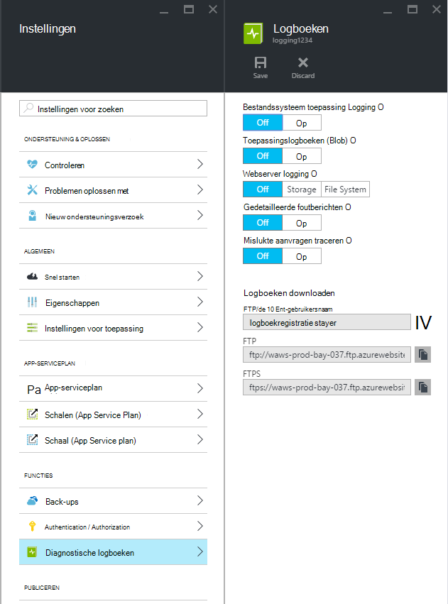
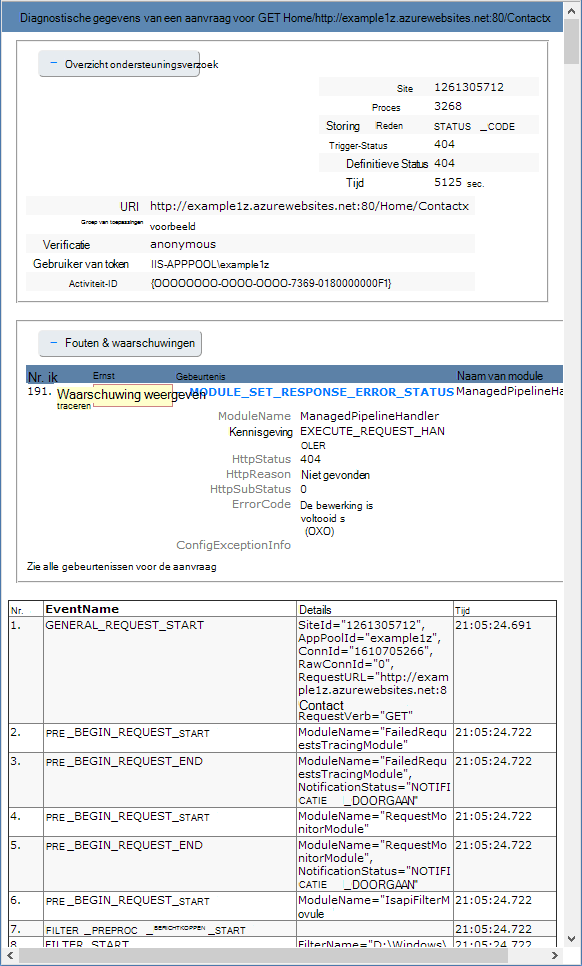

<properties
    pageTitle="Diagnostische logboekregistratie inschakelen voor web apps in Azure App-Service"
    description="Informatie over Diagnostische logboekregistratie inschakelen en instrumentation toevoegen aan uw toepassing, alsmede de toegang tot de informatie die is vastgelegd door Azure."
    services="app-service"
    documentationCenter=".net"
    authors="cephalin"
    manager="wpickett"
    editor="jimbe"/>

<tags
    ms.service="app-service"
    ms.workload="na"
    ms.tgt_pltfrm="na"
    ms.devlang="na"
    ms.topic="article"
    ms.date="06/06/2016"
    ms.author="cephalin"/>

# Diagnostische logboekregistratie inschakelen voor web apps in Azure App-Service

## Overzicht

Azure biedt ingebouwde diagnostische gegevens om te helpen bij het opsporen van fouten in een [web-app App-Service](http://go.microsoft.com/fwlink/?LinkId=529714). In dit artikel leert u hoe diagnostische logboekregistratie inschakelen en instrumentation toevoegen aan uw toepassing, alsmede toegang tot de informatie die is vastgelegd door Azure.

In dit artikel wordt de [Azure Portal](https://portal.azure.com), Azure PowerShell en de Azure opdrachtregelinterface (CLI Azure) werken met diagnostische logboeken. Zie voor meer informatie over het werken met diagnostische logboeken met behulp van Visual Studio [Azure oplossen in Visual Studio](web-sites-dotnet-troubleshoot-visual-studio.md).

[AZURE.INCLUDE [app-service-web-to-api-and-mobile](../../includes/app-service-web-to-api-and-mobile.md)]

## Web server diagnostiek en diagnostiek van toepassing

App Service web apps bieden diagnostische functies voor informatie over de logboeken van de webserver en de webtoepassing. Deze zijn logisch onderverdeeld in **web server** en de **Diagnostische gegevens van toepassing**.

### Diagnostische gegevens van het web server

U kunt inschakelen of uitschakelen van de volgende soorten logboeken:

- **Gedetailleerde logboekregistratie fout** - gedetailleerde informatie voor HTTP-statuscodes die wijzen op een fout opgetreden (statuscode 400 of hoger). Dit kan informatie bevatten die kunt u bepalen waarom de server de foutcode geretourneerd.
- **Aanvragen traceren is mislukt** - gedetailleerde informatie over de mislukte aanvragen, met inbegrip van een trace van de IIS-onderdelen gebruikt voor het verwerken van de aanvraag en de tijd die in elk onderdeel. Dit is handig als u probeert te verhogen de prestaties van de site of identificeren wat de oorzaak is van een specifieke HTTP-fout als resultaat wordt gegeven.
- **Web Server Logging** - informatie over HTTP-transacties met behulp van de [uitgebreide W3C-logboekindeling](http://msdn.microsoft.com/library/windows/desktop/aa814385.aspx). Dit is handig bij het vaststellen van algemene site statistieken zoals het aantal aanvragen dat is verwerkt of hoeveel aanvragen afkomstig zijn van een specifiek IP-adres.

### Diagnostische gegevens van toepassing

Diagnostische gegevens van toepassing kunt u een webtoepassing geproduceerde informatie opnemen. ASP.NET-toepassingen kunnen de klasse [System.Diagnostics.Trace](http://msdn.microsoft.com/library/36hhw2t6.aspx) gebruiken om informatie naar het toepassingslogboek diagnostische gegevens vastleggen. Bijvoorbeeld:

    System.Diagnostics.Trace.TraceError("If you're seeing this, something bad happened");

Tijdens runtime kunt u ophalen van deze logboeken om te helpen bij het oplossen van problemen. Zie [problemen met Azure web apps in Visual Studio](web-sites-dotnet-troubleshoot-visual-studio.md)voor meer informatie.

App Service web apps ook vastleggen implementatiegegevens als u inhoud naar een web app publiceert. Dit gebeurt automatisch en er zijn geen configuratie-instellingen voor logboekregistratie voor implementatie. Implementatie-logboekregistratie kunt u vaststellen waarom een implementatie is mislukt. Bijvoorbeeld als u een script voor aangepaste implementatie gebruikt, kunt u implementatie-registratie om te bepalen waarom het script mislukt.

## Diagnose inschakelen

Als u wilt dat diagnostische gegevens in de [Portal Azure](https://portal.azure.com), gaat u naar het blad voor uw web app en klik op **Instellingen > diagnostische logboeken**.

<!-- todo:cleanup dogfood addresses in screenshot -->

Wanneer u **toepassing diagnostics** inschakelen kiest u ook het **niveau**. Deze instelling kunt u de gegevens die zijn vastgelegd voor **informatieve**, **Waarschuwing** of **fout** informatie wilt filteren. Als dit op **uitgebreide** wordt alle informatie vastleggen door de toepassing wordt geproduceerd.

> [AZURE.NOTE] In tegenstelling tot het wijzigen van het bestand web.config, wordt diagnostische toepassingen inschakelen of wijzigen van het diagnoselogboek van niveaus niet recyclen het toepassingsdomein die binnen de toepassing wordt uitgevoerd.

In het tabblad **configureren** van [klassieke portal](https://manage.windowsazure.com) Web app kunt u **opslagmedium** of **bestandssysteem** voor **Logboekregistratie van webserver**. **Opslag** kunt u een account voor opslag en een blob-container waarin de logboekbestanden worden geschreven. Alle logboeken voor **site diagnostische gegevens** worden geschreven naar het bestandssysteem alleen.

In het tabblad **configureren** van [klassieke portal](https://manage.windowsazure.com) Web app heeft ook aanvullende instellingen voor toepassing diagnostische gegevens:

* **Bestandssysteem** - slaat de gegevens van de diagnostische gegevens van toepassing naar het bestandssysteem web app. Deze bestanden kunnen worden benaderd via FTP of gedownload als een Zip-archief met behulp van de Azure PowerShell of Azure opdrachtregelinterface (CLI Azure).
* **Tabelopslag** - slaat de gegevens van de diagnostische gegevens van toepassing in de opgegeven naam van Azure opslag Account en tabel.
* **Blob-opslag** - slaat de gegevens van de diagnostische gegevens van toepassing in de opgegeven Azure opslag Account en blob-container.
* **De bewaarperiode** - standaard logboeken worden niet automatisch verwijderd uit de **blobopslag**. Selecteer **behoud instellen** en voer het aantal dagen in Logboeken te houden als u wilt automatisch verwijderen van Logboeken.

>[AZURE.NOTE] Als u het [opnieuw genereren van sleutels voor uw opslag-account toegang](storage-create-storage-account.md#view-copy-and-regenerate-storage-access-keys), u opnieuw de respectieve logboekconfiguratie instellen moet naar de bijgewerkte sleutels gebruiken. Om dit te doen:
>
> 1. In het tabblad **configureren** , zodanig dat de respectieve functie **uit**. De instelling voor opslaan.
> 2. Registratie van gegevens in het account-blob storage of de tabel opnieuw inschakelen. De instelling voor opslaan.

Een combinatie van het bestandssysteem,, tabelopslag of blob-opslag tegelijkertijd kan worden ingeschakeld en configuraties voor afzonderlijke logboekbestanden op hebben. U wilt bijvoorbeeld fouten en waarschuwingen naar een blob-opslag als oplossing op lange termijn vastleggen tijdens het inschakelen van logboekregistratie in systeem met een uitgebreid logboek.

Alle drie locaties zorgen de dezelfde basisgegevens voor gebeurtenissen, **tabelopslag** en **blobopslag** om te melden aanvullende informatie zoals de exemplaar-ID, thread-ID en een meer gedetailleerde tijdstempel (tick-indeling) dan de logboekfunctie **bestandssysteem**.

> [AZURE.NOTE] Gegevens die zijn opgeslagen in de **tabelopslag** of **blob-opslag** alleen toegankelijk met een opslag of een toepassing die u direct met deze opslagsystemen werken kunt. Bijvoorbeeld: Visual Studio 2013 bevat een Opslagverkenner die kan worden gebruikt voor het verkennen van de tabel of blob-opslag en HDInsight toegang tot gegevens die zijn opgeslagen in de blobopslag. U kunt ook een toepassing schrijven die Azure opslag opent op een van de [SDK's Azure](/downloads/#).

> [AZURE.NOTE] Diagnostische gegevens kunnen ook worden ingeschakeld vanuit Azure PowerShell met de cmdlet **Set-AzureWebsite** . Als u Azure PowerShell nog niet is geïnstalleerd of het gebruik van uw abonnement Azure niet hebt geconfigureerd, ziet u [hoe Azure PowerShell gebruiken](/develop/nodejs/how-to-guides/powershell-cmdlets/).

##Procedure: logboekbestanden downloaden

Diagnostische gegevens die zijn opgeslagen in het bestandssysteem van de web app toegankelijk zijn via FTP. Het kan ook worden gedownload als een Zip-archief met Azure PowerShell of de opdrachtregelinterface Azure.

De directory-structuur die in de logboeken worden opgeslagen, is als volgt:

* **Toepassingslogboeken** - /LogFiles/Application /. Deze map bevat een of meer tekstbestanden met informatie over geproduceerd door aan te melden voor toepassing.

* **Sporen van de aanvraag is mislukt** - logboekbestanden/W3SVC ### /. Deze map bevat een XSL-bestand en een of meer XML-bestanden. Zorg ervoor dat u het XSL-bestand in dezelfde map downloadt als de XML bestand(en) omdat het XSL-bestand functionaliteit biedt voor het opmaken en het filteren van de inhoud van de XML-bestanden in Internet Explorer wordt bekeken.

* **Gedetailleerde foutenlogboeken** - /LogFiles/DetailedErrors /. Deze map bevat een of meer htm-bestanden vindt u uitgebreide informatie voor HTTP-fouten die zijn opgetreden.

* **Web Server Logs** - /LogFiles/http/RawLogs. Deze map bevat een of meer bestanden met tekst opgemaakt met de [uitgebreide W3C-logboekindeling](http://msdn.microsoft.com/library/windows/desktop/aa814385.aspx).

* **Logboeken voor implementatie** - logboekbestanden/Git. Deze map bevat de logboeken die zijn gegenereerd door de van de interne implementatieprocessen door Azure web apps gebruikt, evenals voor Git implementaties meldt.

### FTP

Ga naar het **Dashboard** van uw web app in de [klassieke portal](https://manage.windowsazure.com)om diagnostische gegevens via FTP. Met de **Diagnostische logboeken van FTP-** koppeling in de sectie **Overzicht** toegang tot de logboekbestanden met FTP. De post **Implementatie/FTP-gebruiker** worden de gebruikersnaam die moet worden gebruikt voor toegang tot de FTP-site.

> [AZURE.NOTE] Als de **Distributie/FTP-gebruiker** is niet ingesteld of als u het wachtwoord voor deze gebruiker bent vergeten, kunt u een nieuwe gebruiker en wachtwoord via de koppeling **implementatie referenties opnieuw instellen** in de sectie **Overzicht** van het **Dashboard**.

### Met Azure PowerShell downloaden

Downloaden van de logboekbestanden, start een nieuw exemplaar van Azure PowerShell en gebruik de volgende opdracht:

    Save-AzureWebSiteLog -Name webappname

Dit bespaart de logboeken voor de web-app die is opgegeven door de **-naam** parameter naar een bestand met de naam **logs.zip** in de huidige map.

> [AZURE.NOTE] Als u Azure PowerShell nog niet is geïnstalleerd of het gebruik van uw abonnement Azure niet hebt geconfigureerd, ziet u [hoe Azure PowerShell gebruiken](/develop/nodejs/how-to-guides/powershell-cmdlets/).

### Azure opdrachtregelinterface downloaden

Het om logboekbestanden te downloaden met de opdrachtregelinterface van Azure, opent u een nieuwe opdrachtprompt, PowerShell, Bash of een sessie en voer de volgende opdracht:

    azure site log download webappname

De logboeken voor het web app met de naam 'webappname' naar een bestand genaamd **diagnostics.zip** in de huidige map wordt opgeslagen.

> [AZURE.NOTE] Als u de Azure opdrachtregelinterface (CLI Azure) niet hebt geïnstalleerd of het gebruik van uw abonnement Azure niet hebt geconfigureerd, Zie [Azure CLI gebruiken](../xplat-cli-install.md).

## Procedure: weergave worden vastgelegd in de inzichten van toepassing

Visual Studio-toepassing inzichten biedt hulpmiddelen voor het filteren en zoeken van Logboeken en de logboeken correleren met aanvragen en andere gebeurtenissen.

1. De toepassing inzichten SDK toevoegen aan het project in Visual Studio.
 * Klik met de rechtermuisknop op uw project en kiest u toevoegen toepassing inzichten in Solution Explorer. U wordt nu door de stappen die een resource inzichten toepassing maken. [Meer informatie](../application-insights/app-insights-asp-net.md)
2. Het pakket traceringslistener toevoegen aan uw project.
 * Uw project met de rechtermuisknop op en kies NuGet pakketten beheren. Selecteer `Microsoft.ApplicationInsights.TraceListener` [meer informatie](../application-insights/app-insights-asp-net-trace-logs.md)
3. Uploaden van uw project en uit te voeren voor het genereren van logboekgegevens.
4. Blader naar uw nieuwe inzichten Application resource in [Azure Portal](https://portal.azure.com/)en **Zoeken**te openen. Hier ziet u de logboekgegevens, samen met de aanvraag, het gebruik en andere telemetrie. Sommige telemetrie duurt een paar minuten om te komen: klik op vernieuwen. [Meer informatie](../application-insights/app-insights-diagnostic-search.md)

[Meer informatie over prestaties bijhouden met inzichten van toepassing](../application-insights/app-insights-azure-web-apps.md)

##Procedure: Stream-Logboeken

Tijdens het ontwikkelen van een toepassing, is het vaak handig om te zien in real-time in de buurt van de logboekfunctie. Dit kunt u doen door de logboekgegevens naar uw ontwikkelomgeving met Azure PowerShell of de opdrachtregelinterface Azure streaming.

> [AZURE.NOTE] Sommige soorten logboekregistratie buffer worden geschreven naar het logboekbestand dat in volgorde van gebeurtenissen in de stroom resulteren kan. Een logboekvermelding toepassing vindt plaats wanneer een gebruiker een pagina bezoekt kan bijvoorbeeld worden weergegeven in de gegevensstroom voordat de bijbehorende HTTP-vermelding voor de pagina aanvraag.

> [AZURE.NOTE] Logboek streaming wordt ook stroomsgewijs verzenden van gegevens weggeschreven naar een tekstbestand dat is opgeslagen in de **D:\\home\\logboekbestanden\\ ** map.

### Streaming met Azure PowerShell

Logboekgegevens streamen, start een nieuw exemplaar van Azure PowerShell en gebruik de volgende opdracht:

    Get-AzureWebSiteLog -Name webappname -Tail

Dit maakt een verbinding met de web-app die is opgegeven door de **-naam** parameter en beginnen met de informatie naar het venster PowerShell streaming, zoals de gebeurtenissen zich op de web app voordoen. Alle gegevens geschreven naar eindigt op .txt of .log htm-bestanden die zijn opgeslagen in de map /LogFiles (home-d:/logboekbestanden) wordt op de lokale console worden gestreamd.

Gebruiken als u wilt filteren van specifieke gebeurtenissen, zoals fouten, het **-bericht** parameter. Bijvoorbeeld:

    Get-AzureWebSiteLog -Name webappname -Tail -Message Error

Als u wilt filteren, logboek voor specifieke typen, zoals HTTP, gebruikt u het **-pad** parameter. Bijvoorbeeld:

    Get-AzureWebSiteLog -Name webappname -Tail -Path http

Gebruik de parameter - ListPath voor een overzicht van de beschikbare paden.

> [AZURE.NOTE] Als u Azure PowerShell nog niet is geïnstalleerd of het gebruik van uw abonnement Azure niet hebt geconfigureerd, ziet u [hoe Azure PowerShell gebruiken](/develop/nodejs/how-to-guides/powershell-cmdlets/).

### Streaming met Azure Interface met opdrachtregel

Om logboekgegevens te streamen, opent u een nieuwe opdrachtprompt, PowerShell, Bash of een sessie en voer de volgende opdracht:

    azure site log tail webappname

Hiermee verbinding maken met de web app met de naam 'webappname' en gaat informatie naar het venster verzenden als de gebeurtenissen zich op de web app voordoen. Alle gegevens geschreven naar eindigt op .txt of .log htm-bestanden die zijn opgeslagen in de map /LogFiles (home-d:/logboekbestanden) wordt op de lokale console worden gestreamd.

Filteren van specifieke gebeurtenissen, zoals fouten, gebruikt u de **--Filter** parameter. Bijvoorbeeld:

    azure site log tail webappname --filter Error

Als u wilt filteren, logboek voor specifieke typen, zoals HTTP, gebruikt u de **--pad** parameter. Bijvoorbeeld:

    azure site log tail webappname --path http

> [AZURE.NOTE] Als u de opdrachtregelinterface Azure niet hebt geïnstalleerd of zijn niet geconfigureerd voor het gebruik van uw abonnement Azure, Zie [hoe te gebruiken Azure opdrachtregelinterface](../xplat-cli-install.md).

##Procedure: diagnostische logboeken begrijpen

### Toepassingslogboeken diagnostische gegevens

Diagnostische gegevens van toepassing wordt informatie opgeslagen in een specifieke indeling voor .NET-toepassingen, afhankelijk van of het opslaan van Logboeken voor het bestandssysteem,, tabelopslag of blob-opslag. De basisset van gegevens die opgeslagen is hetzelfde voor alle drie soorten opslag - de datum en tijd die de gebeurtenis heeft plaatsgevonden, de proces-ID die de gebeurtenis en het gebeurtenistype (informatie, waarschuwing, fout) het gebeurtenisbericht heeft geproduceerd.

__Bestandssysteem__

Elke regel is vastgelegd in het bestandssysteem of ontvangen met streaming niet in de volgende notatie:

    {Date}  PID[{process id}] {event type/level} {message}

Een foutgebeurtenis zou bijvoorbeeld de volgende strekking weergegeven:

    2014-01-30T16:36:59  PID[3096] Error       Fatal error on the page!

Registratie van gegevens in het systeem biedt de meest elementaire gegevens van de drie beschikbare methoden die alleen de tijd, proces-id gebeurtenisniveau en bericht.

__Tabelopslag__

Tijdens de registratie van de tabelopslag, worden extra eigenschappen worden gebruikt ter vergemakkelijking van de gegevens die zijn opgeslagen in de tabel, alsmede de meer gedetailleerde informatie over de gebeurtenis te zoeken. De volgende eigenschappen (kolommen) worden voor elke entiteit (rij) opgeslagen in de tabel gebruikt.

Naam van eigenschap|Indeling/Value
---|---
PartitionKey|Datum en tijd van de gebeurtenis in de indeling yyyyMMddHH
RowKey|Een GUID-waarde die een unieke aanduiding voor deze entiteit
Tijdstempel|De datum en tijd waarop de gebeurtenis is opgetreden
EventTickCount|De datum en tijd waarop de gebeurtenis zich heeft voorgedaan, Tick-indeling (met een grotere nauwkeurigheid)
ApplicationName|De naam van de web app
Niveau|Gebeurtenisniveau (bijvoorbeeld fout, waarschuwing, gegevens)
Gebeurtenis-id|De ID van deze gebeurtenis.

De standaardwaarde is 0 als er geen opgegeven
InstanceId|Exemplaar van de web-app die het zelfs opgetreden op
PID|Proces-ID
TID|De thread-ID van de thread die de gebeurtenis geproduceerd
Bericht|Gebeurtenisbericht details

__BLOB-opslag__

Als logboekregistratie blob-opslag, gegevens opgeslagen in een indeling met door komma's gescheiden waarden (CSV). Vergelijkbaar met tabelopslag, extra velden om meer gedetailleerde informatie over de gebeurtenis worden vastgelegd. De volgende eigenschappen worden gebruikt voor elke rij in de CSV:

Naam van eigenschap|Indeling/Value
---|---
Datum|De datum en tijd waarop de gebeurtenis is opgetreden
Niveau|Gebeurtenisniveau (bijvoorbeeld fout, waarschuwing, gegevens)
ApplicationName|De naam van de web app
InstanceId|Exemplaar van de web-app die de gebeurtenis heeft plaatsgevonden op
EventTickCount|De datum en tijd waarop de gebeurtenis zich heeft voorgedaan, Tick-indeling (met een grotere nauwkeurigheid)
Gebeurtenis-id|De ID van deze gebeurtenis.

De standaardwaarde is 0 als er geen opgegeven
PID|Proces-ID
TID|De thread-ID van de thread die de gebeurtenis geproduceerd
Bericht|Gebeurtenisbericht details

De gegevens die zijn opgeslagen in een blob er ongeveer als volgt:

    date,level,applicationName,instanceId,eventTickCount,eventId,pid,tid,message
    2014-01-30T16:36:52,Error,mywebapp,6ee38a,635266966128818593,0,3096,9,An error occurred

> [AZURE.NOTE] De eerste regel van het logboek wordt de kolomkoppen bevatten, zoals wordt weergegeven in het volgende voorbeeld.

### Sporen van de aanvraag is mislukt

Kan geen verzoek sporen worden opgeslagen in XML-bestanden met de naam __fr ### .xml__. Gemakkelijker om de geregistreerde gegevens weer te geven, krijgt u een XSL-opmaakmodel met de naam __freb.xsl__ in dezelfde map als het XML-bestanden. Een van de XML-bestanden openen in Internet Explorer, wordt het XSL-opmaakmodel gebruiken voor een opgemaakte weergave van de traceergegevens. Dit wordt met de volgende strekking weergegeven:

### Gedetailleerde foutenlogboeken

Gedetailleerde foutenlogboeken worden HTML-documenten met meer gedetailleerde informatie over HTTP-fouten die zijn opgetreden. Omdat ze gewoon HTML-documenten, kunnen worden gelezen met behulp van een webbrowser.

### Web server logs

De web server logs zijn opgemaakt met de [uitgebreide W3C-logboekindeling](http://msdn.microsoft.com/library/windows/desktop/aa814385.aspx). Deze informatie kan worden gelezen met behulp van een teksteditor of met behulp van hulpprogramma's zoals [Log Parser](http://go.microsoft.com/fwlink/?LinkId=246619)geparseerd.

> [AZURE.NOTE] De logboeken die zijn geproduceerd door Azure web apps bieden geen ondersteuning voor de velden __s computernaam__of __ip-s__ __cs-versie__ .

##Volgende stappen

- [Het controleren van Web Apps](/manage/services/web-sites/how-to-monitor-websites/)
- [Problemen met Azure web apps in Visual Studio](web-sites-dotnet-troubleshoot-visual-studio.md)
- [Analyseren web app worden vastgelegd in HDInsight](http://gallery.technet.microsoft.com/scriptcenter/Analyses-Windows-Azure-web-0b27d413)

> [AZURE.NOTE] Als u wilt aan de slag met Azure App-Service voordat u aanmelden voor een account met Azure, gaat u naar de [App-Service probeert](http://go.microsoft.com/fwlink/?LinkId=523751), waar u direct een starter tijdelijk web app in de App-Service maken kunt. Geen creditcard vereist; geen verplichtingen.

## Wat er veranderd
* Zie voor een handleiding voor het wijzigen van Websites met App-Service: [Azure App Service en de Impact op de bestaande Azure Services](http://go.microsoft.com/fwlink/?LinkId=529714)
* Zie voor informatie over de wijziging van de oude portal naar de nieuwe portal: [referentie voor het navigeren in de Azure portal](http://go.microsoft.com/fwlink/?LinkId=529715)
 
