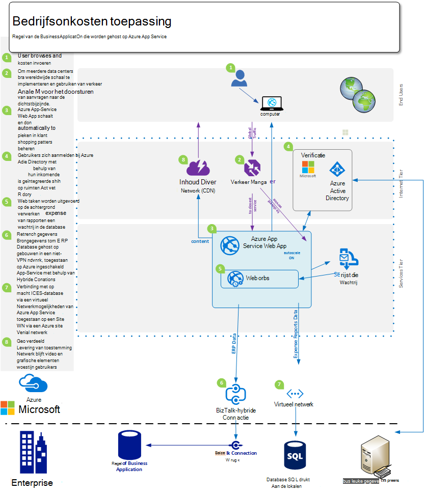
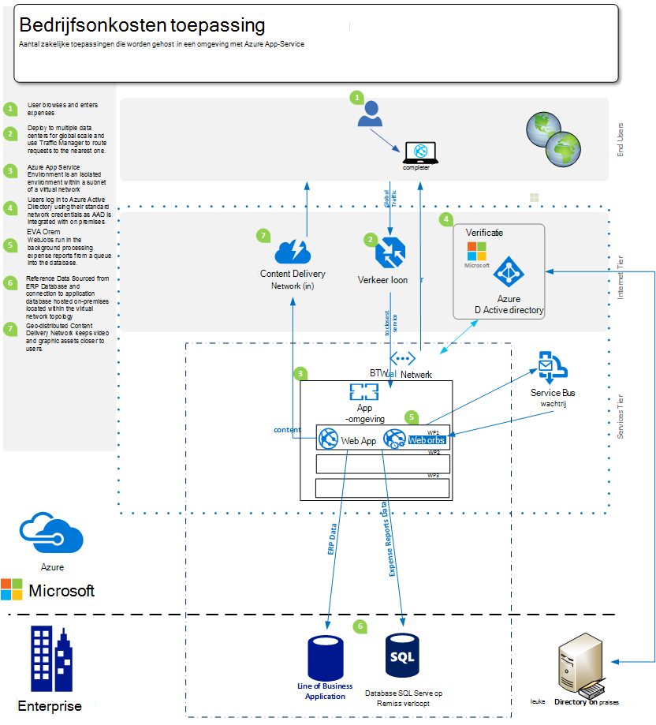
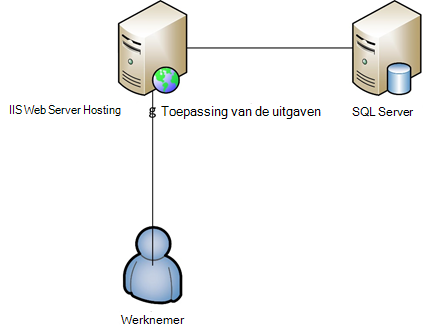

<properties 
    pageTitle="Azure App Web Apps serviceaanbod voor onderneming" 
    description="Laat zien hoe met Azure App Service Web Apps website oplossingen voor uw bedrijf maken" 
    services="app-service\web" 
    documentationCenter="" 
    authors="apwestgarth" 
    manager="wpickett" 
    editor=""/>

<tags 
    ms.service="app-service-web" 
    ms.workload="web" 
    ms.tgt_pltfrm="na" 
    ms.devlang="na" 
    ms.topic="article" 
    ms.date="07/29/2016" 
    ms.author="anwestg"/>

# Azure App Web Apps serviceaanbod voor Enterprise-witboek #

De noodzaak te verlagen en het leveren van IT-oplossingen sneller in een snel evoluerende omgeving maakt nieuwe uitdagingen voor ontwikkelaars, IT-Professionals en Managers. Gebruikers zijn steeds op zoek naar hun lijn van Business (LOB) webtoepassingen te snelle, responsieve en vanaf elk apparaat beschikbaar zijn. Op hetzelfde moment, bedrijven probeert te profiteren van de verhoogde productiviteit en efficiëntie die afkomstig zijn van de integratie met cloud en mobiele services, mogelijk iets eenvoudigs als eenmalige aanmelding via Active Directory wordt gebruikt voor samenwerking in Office365 met behulp van gegevens die zijn opgehaald uit een interne LOB-toepassing die op hun beurt gegevens uit de uitvoering van het bedrijf van televergaderingen worden-apparaten. [Azure App Service Web Apps](http://go.microsoft.com/fwlink/?LinkId=529714) is een enterprise klasse cloud-service voor het ontwikkelen, testen en uitvoeren van web en mobiele toepassingen, Web-API's en algemene websites. Corporate websites, intranetsites, business apps en digitale marketingcampagnes uitvoeren op een wereldwijd netwerk van datacenters geoptimaliseerd voor de omvang en de beschikbaarheid en ondersteuning voor continue integratie kan worden gebruikt en de manier van moderne DevOps.  

Dit witboek benadrukt de mogelijkheden van de service [Web Apps](/services/app-service/web/) is specifiek gericht op actieve LOB-toepassingen, die betrekking hebben op migratie van bestaande webtoepassingen en implementatie van de nieuwe website van LOB-toepassingen op het platform. 

## Doelgroep ##

IT-Professionals, architecten en managers die op zoek zijn om te migreren naar de cloud web werkbelasting die momenteel actief zijn op ruimten. Werkbelasting web kunnen omvatten bedrijf naar werknemer ofwel Business Partners web toepassingen.

## Inleiding ##

App Service Web Apps is een ideaal platform voor het hosten van interne en externe webtoepassingen en -services biedt een voordelige, zeer schaalbare, beheerde oplossing zodat u zich kunt concentreren op het leveren van toegevoegde waarde voor uw gebruikers in plaats van veel tijd besteedt en geld beheren en ondersteunen van afzonderlijke omgevingen. Web Apps biedt een flexibel platform waarop implementeren enterprise toepassingen de mogelijkheid om verder te verifiëren aan de hand van Active Directory voor gebouwen via integratie met Microsoft Azure Active Directory, ondersteuning van eenvoudige en snelle implementaties maken gebruik van uw interne continue integratie en implementatie van praktijken, bij het automatisch schalen om te groeien met de bedrijfsbehoeften - alles op een beheerde platform waarmee u concentreren op uw toepassing en niet uw infrastructuur kunt. 

## Definitie van het probleem ##

Het IT-landschap is snel wijzigen, gebruik van services die automatisch geschaald te verwerken belasting bij een verplaatsing van op traditionele servers hosten met hun hoge kosten op lange levertijden die op verzoek wordt gebruikt. IT-afdelingen zijn wordt gecontroleerd om de kosten te beperken en besteden aan het oppervlak van de infrastructuur en onderhoud met een focus op het verminderen van CAPEX terwijl er meer flexibiliteit. Het einde van de levensduur van oudere infrastructuur platforms, zoals Windows Server 2003, leidt de IT-afdelingen cloud migratie als een mogelijke manier om te voorkomen dat de kosten van het nieuwe lange termijn bekijken. In het verleden, zou CIO beslissingen aanschaffen voor andere afdelingen; echter nemen steeds CMOs- en andere business unit hoofden een meer actieve rol in hoe hun budget is besteed en wat het rendement op hun investering is. Steeds meer moeten bedrijven hun personeelsbestand kunnen worden dan ooit tevoren veel meer mobiele werknemers werkt extern, besteden meer tijd aan klanten die behoefte hebben aan toegang tot systemen probleemloos.

Bedrijf moet wijzigen, maandelijks, wekelijks, dagelijks. Bedrijven zijn op zoek naar instant wereldwijde schaal met regelmatig bijgewerkte services vol met nieuwe functies, die door een derde partij of intern.  In sommige gevallen bedrijven ook op zoek bent naar de mogelijkheden om hun toepassingen isoleren en de toegang tot bronnen en ook gebruik van openbare Cloud-faciliteiten. Gebruikers hebben hogere eisen, met veel gebruikmaking van diensten in hun eigen persoonlijke leven zoals Office365. Toegang hebben tot uitgebreide services vergelijkbare, actueel, functie in het leven van hun werk die ze verwachten. Met deze vraag, IT moet uiterlijk waarmee het bedrijf dit inschakelen door middel van selectie en integratie met derde partij diensten, zorgvuldige selectie van de platforms die u aan de behoeften van het bedrijf, aanpassen kunt terwijl ook wordt met een lagere eigendomskosten betrouwbaar.

Ontwikkelteams willen leveren onmiddellijk voordeel, nieuwe functies leveren op een regelmatige basis. Ze zijn op zoek naar een voordelige, betrouwbare platform dat is geïntegreerd met hun bestaande hulpprogramma's en procedures-ontwikkeling, test, vrijgeven; en werken samen met de IT-afdelingen automatiseert, implementatie, beheer en melding, allemaal met het doel van nul uitvaltijd.

<a href="highlevel" />
## Oplossing van hoog niveau ##

Webplatforms en -kaders worden steeds vaker gebruikt ontwikkelen, testen en zakelijke toepassingen hosten.  Met een typische aantal zakelijke toepassingen, zoals een interne werknemer onkosten-systeem vaak die uitsluitend bestaan uit een web app met een back-database voor het opslaan van de gegevens in verband met de toepassing.

Web App Service Apps is een goede optie voor het hosten van dergelijke toepassingen biedt schaalbare en betrouwbare infrastructuur die wordt beheerd met patches in de buurt van nul handmatige interventie en downtime. De Microsoft Azure-platform biedt veel opslagopties van gegevens ter ondersteuning van webtoepassingen die worden gehost op het Web Apps van Microsoft Azure SQL-Database, een beheerde schaalbaar relationeel database-as-a-service, populaire services van onze partners zoals ClearDB MySQL-Database MongoDB.

Een andere mogelijkheid is om het gebruik van uw bestaande investeringen in gebouwen. In het voorbeeldscenario, een werknemer onkosten-systeem, kunt u uw winkel gegevens binnen uw eigen interne infrastructuur onderhouden. Dit kan zijn voor integratie met interne systemen (rapportage, salaris, facturering, enz.) of om te voldoen aan de eis van een IT governance.  Web Apps biedt een aantal methoden waarmee u verbinding maakt met uw op gebouwen-infrastructuur:

- [App serviceomgevingen](app-service-app-service-environment-intro.md) - App Service omgevingen (ASE) zijn een nieuwe premie-functie die onlangs is toevoegen aan Microsoft Azure App Service aangeboden.  ASEs zorgen voor een volledig geïsoleerd en exclusieve omgeving voor het uitvoeren van Service voor Azure App apps veilig op grote schaal en biedt isolatie en veilige netwerktoegang   
- [Hybride verbindingen](../biztalk-services/integration-hybrid-connection-overview.md) – hybride verbindingen is een functie van Microsoft Azure BizTalk-Services en Web Apps verbinding maken met op locatie middelen veilig, zoals SQL Server, MySQL, Web-API's en aangepaste webservices inschakelen. 
- [Virtueel netwerkintegratie](https://azure.microsoft.com/blog/2014/09/15/azure-websites-virtual-network-integration/) – Web Apps integratie met Azure Virtual Network kunt u uw web app verbinding met een virtueel netwerk van Azure die op hun beurt kunnen worden aangesloten op uw op gebouwen infrastructuur via een VPN website. 

De volgende diagrammen weer een voorbeeld op hoog niveau oplossing met connectiviteitsopties voor bedrijfsruimten bronnen.  Het eerste voorbeeld ziet u hoe dit kan worden bereikt met de standaardfuncties van Azure App Service en de tweede ziet u hoe dit kan worden bereikt met behulp van de premie biedt, omgevingen voor App-Service.

Met behulp van standaard App Service functies:

Met behulp van een App-omgeving:

## Zakelijke voordelen ##

Web App Service Apps biedt tal van voordelen voor uw bedrijf waarmee u uw functie veel rendabeler en flexibeler in te leveren voor de zakelijke behoeften. 

### PaaS-Model ###

Web App Service Apps is gebaseerd op een Platform als servicemodel biedt een aantal besparingen in kosten en efficiëntie.  U hoeft niet langer te besteden uren VMs beheren, patches van besturingssystemen en -kaders. Web Apps is een automatisch patches omgeving waarmee u zich kunt concentreren op het beheren van uw webtoepassingen en geen VMs, waardoor teams vrij om meer zakelijke waarde.

Het PaaS-Model versterking van Web Apps kunnen beroepen van de methodologie van het DevOps om te voldoen aan hun doelstellingen. Dit betekent een bedrijf volledig beheer en integratie in de toepassing volledige levenscyclus, met inbegrip van de ontwikkeling, testen, release, monitoring en beheer en ondersteuning. 

Voor ontwikkelteams, worden continue integratie en implementatie van werkstromen geconfigureerd vanuit Visual Studio Team Services, GitHub, TeamCity, Hudson of BitBucket, het inschakelen van automatische-, test- en implementatieopties waardoor sneller release cycli en verminderen de wrijving die betrokken zijn bij het vrijgeven van in de bestaande infrastructuur. Ook ondersteunt het maken van meerdere testen en staging omgeving voor uw werkstroom release Web Apps, niet langer wilt u reserveren of hardware toewijzen voor deze doeleinden, kunt u zo veel omgevingen zoals u wilt en uw eigen promotievak om los van de workflow te definiëren. Als een bedrijf die wilt kan vrijgeven aan een test-sleuf van bronbeheer, uitvoert in een serie van tests en na succesvolle voltooiing promoveren tot een fase-sleuf en ten slotte naar productie, geen uitval, met het extra voordeel dat webtoepassingen die worden gehost op Web Apps vooraf worden geladen en om de best mogelijke klantervaring hot swap.  Ook kunnen bedrijven gebruik maken van de testen in productie-mogelijkheden van de Service Web-Apps App direct een deel van het verkeer naar een andere sleuf, de wijzigingen, valideren voordat u overschakelt van al het verkeer voor de nieuwe implementatie of al het verkeer naar de vorige installatie herstellen. 

Operations teams kunnen erop vertrouwen dat zij zijn in de best mogelijke positie om te reageren op eventuele problemen met een van de webtoepassingen die worden gehost op Web Apps met de ingebouwde voorzieningen voor bewaking en waarschuwingen. Operations Teams moet al in hebben geïnvesteerd analytics en dergelijke van Microsoft Visual Studio-toepassing inzichten, nieuwe Relic en AppDynamics monitoring oplossingen. Deze worden ook volledig ondersteund op het Web Apps continuïteit en een bekende omgeving van waaruit u uw webtoepassingen controleren inschakelen.

Ten slotte Web Apps biedt functionaliteit voor back-up van uw app(s) en gehoste databases rechtstreeks naar een container Azure Blob-opslag. Om u te voorzien van een eenvoudige manier en zeer voordelige methode te herstellen in noodgevallen, waardoor de noodzaak van een complex van gebouwen, hardware en software.

### Migratie te vereenvoudigen ###

Onderhoud van hardware en rotatie is een belangrijk punt voor bedrijven zoals release cycli voor hardware en besturingssystemen versnellen. Misschien hebt u een aantal servers met Windows Server 2003 R2 die aan het einde van de ondersteuning in 2015 afkomstig zijn, maar ze zijn nog steeds belangrijke toepassingen voor uw bedrijf hosting? Web App Service Apps is een goede kandidaat waarop die web-toepassingen en voor u de hardware business estate rationaliseren. Web Apps hebt u toegang tot een scala aan hardwarespecificaties die worden beheerd en bijgehouden als onderdeel van de service, hoeft u niet te houden in vervanging en beheerkosten als onderdeel van het budget van uw infrastructuur.  Migratie kan worden net zo eenvoudig als een kopie en plakken van uw bestaande implementatie Web Apps of een meer complexe migratie waarbij met behulp van de Web Apps Migration Assistant waarde wordt toegevoegd. Gemigreerde webtoepassingen geniet van het volledige spectrum van Azure services, integratie van aanvullende services voor webtoepassingen. U kunt bijvoorbeeld overwegen Azure Active Directory toegang tot uw toepassing op basis van de gebruikersorganisatie om beveiligingsgroepen toe te voegen. Een ander voorbeeld kunt webcache-Services voor betere prestaties en minder latentie, mits een betere algemene gebruikerservaring worden toegevoegd. 

### Enterprise-klasse Hosting ###

Web App Service Apps biedt een stabiel en betrouwbaar platform dat is aangetoond dat kan worden verwerkt een groot aantal zakelijke moet uit kleine interne ontwikkel- en werkbelasting, zeer geschaalde drukke websites. Met behulp van Web Apps maken gebruik van hetzelfde enterprise class hosting platform dat Microsoft een bedrijf met hoge waarde web werkbelasting. Web Apps, samen met alle services op de Azure platform worden gebouwd met beveiliging en naleving van regelgeving, zoals de ISO (ISO/IEC 27001:2005); Zie [http://aka.ms/azurecompliance](/support/trust-center/compliance/)SOC1 en SOC2 SSAE 16/ISAE 3402 verklaringen, BAA HIPAA, PCI- en Fedramp, uiteindelijk van elk element en de functie voor meer informatie. 

Microsoft Azure-platform kan rol gebaseerd vergunning besturingselementen enterprise niveaus van controle tot bronnen in Web Apps inschakelen. RBAC biedt ondernemingen de kracht om hun eigen toegangsbeleid voor al hun activa in de Azure-omgeving implementeren door gebruikers aan groepen toe te wijzen en op zijn beurt de benodigde machtigingen toewijzen aan deze groepen ten opzichte van de activa zoals een web app. Zie voor meer informatie over RBAC in Azure, [http://aka.ms/azurerbac](../active-directory/role-based-access-control-configure.md). Met behulp van Web Apps, kunt u of uw webtoepassingen worden geïmplementeerd in een veilige omgeving en u hebt volledige controle op welk grondgebied de activa worden geïmplementeerd zijn. 

Azure App serviceomgevingen [http://aka.ms/aseintro](http://aka.ms/aseintro) zijn een nieuwe premium service plan optie voor enterprise klanten die gebruik maken van Azure App Service en deze bieden een volledig geïsoleerd en exclusieve omgeving.  Hierdoor kunnen bedrijven voor de implementatie van toepassingen die u van zeer hoge schaal profiteren kunnen terwijl ook met volledige controle over inkomende en uitgaande netwerkverkeer en ASEs stelt toepassingen in staat om beveiligde verbindingen van hoge snelheid via virtuele netwerken naar bronnen voor gebouwen.

App Service Web Apps kunnen ook volle gebruik te maken van uw investeringen in gebouwen op door de mogelijkheid om een verbinding terug naar uw interne bronnen, zoals uw magazijn of de SharePoint-omgeving te bieden. Zoals besproken in de [oplossing van hoog niveau](#highlevel) kunt u het gebruik van hybride verbindingen en virtuele verbinding met het netwerk te benaderen op lokalen, infrastructuur en diensten.

### Wereldwijde schaal ###

Web App Service Apps is een globale en schaalbare platform, zodat uw webtoepassingen kan worden uitgebreid en aangepast aan de behoeften van een bedrijf groeit snel en met minimale lange termijn planning en kosten. In typische op gebouwen infrastructuur scenario's, uitbreiding en stijging van de vraag zowel lokaal en geografisch zou vereisen een grote hoeveelheid management, planning en te verrichten uitgaven en aanvullende infrastructuur beheren. Web Apps biedt de mogelijkheid voor het schalen van toepassingen met het ebb en de stroom van uw vereisten. Bijvoorbeeld met behulp van de toepassing van de uitgaven als voorbeeld voor het merendeel van de maand zijn lichte gebruikers van de toepassing, maar als de deadline van elke maand voor inzendingen onkosten moeten worden ingevoerd en -gebruik neemt toe op de toepassing, Web Apps heeft de mogelijkheid om automatisch te stellen meer infrastructuur voor uw toepassing en vervolgens zodra het gebruik is weggeëbd opnieuw die kunt uitbreiden naar de infrastructuur van de basislijn u definieert.

Web Apps is beschikbaar in 24 datacenters wereldwijd en groeiende wereldwijd. Zie [http://aka.ms/azlocations](http://aka.ms/azlocations)voor de meest recente lijst van regio's en de locatie. Met Web-Apps kunt uw bedrijf gemakkelijk bereiken wereldwijd bereik en de schaal. Als uw bedrijf in nieuwe regio's groeit, de rapportage dashboards toepassing waarmee u host op het Web Apps kan eenvoudig worden ingezet in extra datacenters en lokale gebruikers veel sneller via de combinatie van Web Apps en Azure verkeer Manager, met het extra voordeel van de schaalbare infrastructuur onder contract en groeien naarmate de behoeften van de wijziging van de regionale kantoren kunnen fungeren.
 
## Details van oplossing ##

Bekijk een voorbeeld van een scenario voor migratie van toepassing. Overzicht van de details van hoe App Service Web Apps-functies worden geleverd te samen geweldige oplossing en zakelijke waarde op te geven.
 
In dit voorbeeld is het aantal zakelijke toepassingen die zullen wij worden besproken een onkostenrapport toepassing waarmee werknemers hun uitgaven voor terugbetaling indienen. De toepassing wordt gehost op een Windows Server 2003 R2 IIS6 uitgevoerd en de database is een SQL Server 2005-database. De reden we oudere server hangt af van de komende einde van Service voor Windows Server 2003 R2 en SQL Server 2005, en we hebben [hulpmiddelen](http://aka.ms/websitesmigration) en [richtlijnen](http://aka.ms/websitesmigrationresources) voor het migreren van de werkbelasting in Azure automatisch. Met dat in gedachten, het patroon dat wordt gebruikt in dit voorbeeld van toepassing op een breed verity van migratiescenario's. 

### Migreren van bestaande toepassing ###

In stap 1 van de algemene oplossing voor het verplaatsen van een toepassing line of business Web Apps is voor het identificeren van de bestaande toepassing activa en architectuur. In het voorbeeld in dit artikel wordt een ASP.NET-webtoepassing die is ondergebracht op één enkele IIS-Server met de database die wordt gehost op een afzonderlijke SQL Server, zoals in de onderstaande afbeelding. Werknemers login aan het systeem met behulp van een combinatie van gebruikersnaam en wachtwoord, deze onkosten invoeren en uploaden gescande kopieën van ontvangsten in de database, voor elk artikel van onkosten. 
 

#### Rekening mee moet houden ####

Bij migratietoepassing in een omgeving van gebouwen, u kunt Denk er enkele beperkingen voor Web Apps. Hier volgen enkele belangrijke onderwerpen houden bij de migratie van toepassingen voor Web Apps ([http://aka.ms/websitesmigrationresources](http://aka.ms/websitesmigrationresources)):

-   Poort bindingen – Web Apps ondersteunt alleen poort 80 voor HTTP en poort 443 voor HTTPS-verkeer. Als uw toepassing een andere poort wordt gebruikt en klik vervolgens eenmaal gemigreerd maakt de toepassing gebruik van poort 80 voor HTTP en poort 443 voor HTTPS-verkeer. Dit is vaak een onschuldig probleem vaak in op ruimten implementaties maken gebruik van verschillende poorten ter voorkoming van het gebruik van domeinnamen, met name in een ontwikkel- en testomgevingen
-   Verificatie: Web Apps ondersteunt anonieme verificatie standaard en Forms-verificatie door een toepassing wordt geïdentificeerd. Web Apps biedt Windows-verificatie wanneer de toepassing alleen met Azure Active Directory en AD FS is geïntegreerd. Dit is een functie die wordt besproken in meer detail [hier](http://aka.ms/azurebizapp) 
-   Assembly's op basis van GAC: Web Apps is niet toegestaan bij de implementatie van assembly's naar de Global Assembly Cache (GAC). Dus als de toepassing wordt gemigreerd maakt gebruik van deze functie op lokalen, kunt u overwegen de assembly's naar de map bin van de toepassing.
-   IIS5-Compatibiliteitsmodus – Web Apps ondersteunt geen IIS5-compatibiliteitsmodus en als zodanig elke instantie Web Apps en alle webtoepassingen onder het bovenliggende Web Apps-instantie in hetzelfde werkproces in een afzonderlijke groep van toepassingen worden uitgevoerd.
-   Gebruik van COM-bibliotheken Web Apps is niet toegestaan voor de registratie van COM-componenten op het platform. Dus als de toepassing gebruik van COM-onderdelen maakt, deze moeten opnieuw worden geschreven in beheerde code en met de toepassing wordt geïmplementeerd.
-   ISAPI-Filters: ISAPI-Filters kunnen worden ondersteund op het Web Apps. Ze moeten worden geïmplementeerd als onderdeel van de toepassing en geregistreerd in het bestand web.config van de webtoepassing. Zie [http://aka.ms/azurewebsitesxdt](web-sites-transform-extend.md)voor meer informatie. 

Uw webtoepassing is gereed voor de Cloud zodra deze onderwerpen zijn beschouwd. En maak je geen zorgen als er bepaalde onderwerpen niet volledig wordt voldaan, het migratieprogramma Qualitative krijgen tot migratie. 

De volgende stappen in het migratieproces worden voor het maken van een web App Service app en Azure SQL-Database. Er zijn verschillende maten van Web Apps exemplaren met een verschillend aantal CPU-kernen en bedragen voor RAM-geheugen beschikbaar om te selecteren op basis van uw behoefte van web-toepassingen. Voor meer informatie en prijzen, Zie [http://aka.ms/azurewebsitesskus](/pricing/details/websites/). Microsoft Azure SQL-Database caters eveneens aan alle behoeften van een bedrijf met verschillende service niveaus en prestaties om te voldoen aan de eisen. Meer informatie vindt op [http://aka.ms/azuresqldbskus](/pricing/details/sql-database/). Eenmaal is gemaakt, wordt de toepassing is geüpload naar de App Service Web Apps, hetzij via FTP of WebDeploy en vervolgens verplaatst naar de database.

De oplossing wordt in deze migratie Azure SQL-Database, maar dat is niet de enige database op Azure wordt ondersteund. Bedrijven kunnen ook maken gebruik van MySQL, MongoDB, Azure DocumentDB en nog veel meer via invoegtoepassingen die kunnen worden aangeschaft in de [Winkel Azure](/marketplace/partner-program/). 

Bij het maken van een SQL-Database Azure zijn een aantal opties beschikbaar voor een bestaande database te importeren vanaf een server op locatie van het genereren van een script van een bestaande database met de [gegevens-tier-toepassing exporteren en importeren](http://aka.ms/dacpac). 

De toepassingsdatabase kosten is gemaakt door een nieuwe Azure SQL-Database te maken, verbinden met de database met behulp van SQL Server Management Studio en voert u een script wilt bouwen schema van de database en gevuld met gegevens uit de database op gebouwen.

De laatste stap in deze eerste fase van de migratie moet het bijwerken van tekenreeksen met de database voor de toepassing. Dit kan worden bereikt via de portal Azure. Voor iedere web app kunt u toepassingsspecifieke instellingen, met inbegrip van eventuele verbindingstekenreeksen verbinding maken met een database die wordt gebruikt door de toepassing wordt gebruikt.

### Alternatieven voor het gebruik van Azure SQL-Database ###

De Azure platform biedt een aantal alternatieven voor Azure SQL-Database gebruiken als een primaire database van web-toepassingen, dit is namelijk verschillende werkbelastingen inschakelen gebruik van een NoSQL oplossing of het platform aan de behoeften van een bedrijf gegevens inschakelen. Bijvoorbeeld, een bedrijf kan gegevens bevatten die niet worden opgeslagen buiten het bedrijf of in een openbare cloud-omgeving en daarom om het gebruik van de database op de gebouwen onderhouden zou uitzien.

#### Verbinding met de bronnen van gebouwen ####
Web App Service Apps biedt meerdere opties voor verbinding met de bronnen van ruimten, zoals databases, waardoor hergebruik van bestaande infrastructuur van hoge waarde. De opties zijn de volgende:

- App Service omgevingen zijn geïsoleerd en gemaakt binnen een subnet van een virtueel netwerk, dus waardoor het milieu om te communiceren met particuliere eindpunten zich binnen hetzelfde virtuele netwerk - [http://aka.ms/appserviceasenetworking](http://aka.ms/appserviceasenetworking)
- Web Apps virtuele netwerkintegratie ondersteunt de integratie van Web Apps en een virtueel netwerk Azure, zodat u toegang tot bronnen in het virtuele netwerk die als verbonden met uw netwerk op ruimten VPN van site naar site, de mogelijkheid een verbinding rechtstreeks naar uw op systemen voor ruimten met.
- Hybride verbindingen zijn een functie van Azure BizTalk-Services en bieden een eenvoudige manier verbinding maken met afzonderlijke in-premises bronnen zoals SQL Server, MySQL, HTTP-Web-API's en de meest aangepaste Web Services.

#### Schaal en herstelling ####

Als een bedrijf haar personeelsbestand, via overnames of natuurlijke organische groei, dus groeit moet web te schalen om te voldoen aan de vereisten van deze nieuwe toepassingen. Inderdaad vandaag is gebruikelijk bij een nog grotere verspreiding van reserveren teams en externe medewerkers, bijvoorbeeld bedrijven met kantoren in de Verenigde Staten, Europa en Azië, met een mobile sales force in veel meer gebieden. Web Apps heeft de mogelijkheid om comfortabel en automatisch verwerken van elastische wijzigingen in de schaal.

App-Service Web Apps kan webtoepassingen worden geconfigureerd voor het automatisch via het portal voor Azure afhankelijk van twee vectoren: geplande tijden of op CPU-gebruik schalen. Web Apps automatisch schalen biedt een voordelige en zeer flexibele manier voor het opvangen van grotere veranderingen in gebruik voor alle zakelijke toepassingen van webtoepassingen zoals onze rapportagesysteem met websites die een hoge burst verkeer voor een korte duur van de promotie optreden marketing kosten. Zie [schaal Websites](web-sites-scale.md)voor meer informatie en advies voor het schalen van toepassingen met behulp van Web Apps.

Naast de schaal flexibiliteit van Web Apps kan het algehele platform bedrijfscontinuïteit en tolerantie tot en met de mogelijke distributie van webtoepassingen en hun activa aan meerdere datacenters en geografische regio's.

## Samenvatting ##
Web App Service Apps biedt een flexibele, voordelige, responsieve oplossing voor de dynamische behoeften van een bedrijf in een snel evoluerende omgeving. Web Apps kunnen bedrijven de productiviteit te verhogen en efficiënt te maken gebruik van een beheerde platform met mogelijkheden voor moderne DevOps en minder handen op beheer, terwijl de onderneming mogelijkheden in de schaal, veerkracht, beveiliging en integratie met activa voor gebouwen.

## Neem nu actie ##
Voor meer informatie over de Azure App Service Web Apps-service, gaat u naar [http://aka.ms/enterprisewebsites](/services/websites/enterprise/) waar die meer informatie kan worden doorgegeven en teken voor een proef vandaag om [http://aka.ms/azuretrial](/pricing/free-trial/) te evalueren van de service en ontdek de voordelen voor uw bedrijf.

[AZURE.INCLUDE [app-service-web-whats-changed](../../includes/app-service-web-whats-changed.md)]

[AZURE.INCLUDE [app-service-web-try-app-service](../../includes/app-service-web-try-app-service.md)]
 
 
