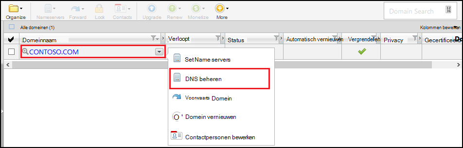
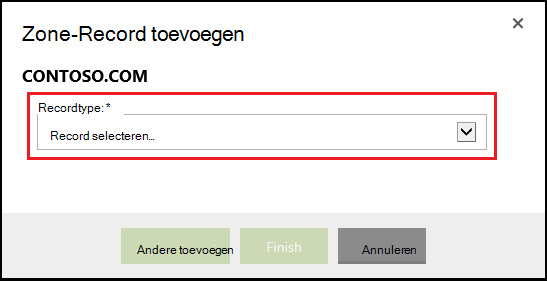
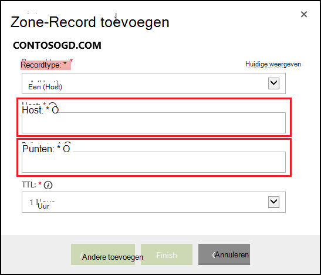

<properties
    pageTitle="Een aangepaste domeinnaam configureren in Azure App Service (GoDaddy)"
    description="Informatie over het gebruik van een domeinnaam van GoDaddy met Azure Web Apps"
    services="app-service"
    documentationCenter=""
    authors="erikre"
    manager="wpickett"
    editor="jimbe"/>

<tags
    ms.service="app-service"
    ms.workload="na"
    ms.tgt_pltfrm="na"
    ms.devlang="na"
    ms.topic="article"
    ms.date="01/12/2016"
    ms.author="cephalin"/>

# Een aangepaste domeinnaam configureren in Azure App Service (ingekocht rechtstreeks van GoDaddy)

[AZURE.INCLUDE [web-selector](../../includes/websites-custom-domain-selector.md)]

[AZURE.INCLUDE [intro](../../includes/custom-dns-web-site-intro.md)]

Als u hebt aangeschaft domein via Azure App Service Web Apps vervolgens verwijzen naar de laatste stap van het [Domein kopen voor Web Apps](custom-dns-web-site-buydomains-web-app.md).

Dit artikel bevat instructies over het gebruik van een aangepaste domeinnaam die rechtstreeks bij [GoDaddy](https://godaddy.com) met [App Service Web Apps](http://go.microsoft.com/fwlink/?LinkId=529714)hebt gekocht.

[AZURE.INCLUDE [introfooter](../../includes/custom-dns-web-site-intro-notes.md)]

##Wat is DNS-records?

[AZURE.INCLUDE [understandingdns](../../includes/custom-dns-web-site-understanding-dns-raw.md)]

## DNS-records voor uw aangepaste domein toevoegen

Om uw aangepaste domein koppelen aan een web app in de App-Service, moet u een nieuwe vermelding in de DNS-tabel voor uw aangepaste domein toevoegen met behulp van hulpmiddelen die door GoDaddy. Gebruik de volgende stappen uit om te zoeken naar de DNS-hulpprogramma's voor GoDaddy.com

1. Meld u aan bij uw account met GoDaddy.com en selecteert u **Mijn Account** en **Mijn domeinen beheren**. Selecteer ten slotte de vervolgkeuzelijst voor de domeinnaam die u wilt gebruiken met uw Azure web app en selecteer **DNS beheren**.

    

2. Op de pagina **Domain details** Ga naar het tabblad **DNS-zonebestand** . Dit is de sectie die wordt gebruikt voor het toevoegen en wijzigen van de DNS-records voor uw domeinnaam.

    

    Selecteer **Record toevoegen** aan een bestaande record toevoegen.

    Voor het **bewerken** van een bestaande record, selecteert u het pictogram naast de record van pen en papier.

    > [AZURE.NOTE] Opmerking voordat u nieuwe records toevoegt, de DNS-records voor populaire subdomeinen ( **Host** in de editor genoemd) zoals **e-mail**, **bestanden**, **e-mail**en anderen al is gemaakt door GoDaddy. Als de naam die u wilt gebruiken al bestaat, wordt de bestaande record in plaats van het maken van een nieuw wijzigen.

4. Wanneer u een record toevoegt, moet u eerst het recordtype te selecteren.

    

    Vervolgens moet u de **Host** (aangepaste domein of subdomein) opgeven en dit **verwijst naar het**.

    

    * Bij het toevoegen van een **A-record (host)** - moet u het veld **Host** instellen op **@** (staat root domeinnaam, bijvoorbeeld **contoso.com**) *(jokertekens voor meerdere subdomeinen, overeenkomen) of het onderliggende domein dat u wilt gebruiken (bijvoorbeeld * *www**.) Stelt u het * *verwijst naar het** veld het IP-adres van uw Azure web app.

    * Bij het toevoegen van een **record CNAME (alias)** - moet u het veld **Host** ingesteld op het onderliggende domein dat u wilt gebruiken. Bijvoorbeeld **www**. U moet het **verwijst naar het** veld ingesteld op de **. azurewebsites.net** de domeinnaam van uw Azure web app. Bijvoorbeeld **contoso.azurewebsites.net**.

5. Klik op **toevoegen**.
6. Selecteer het recordtype **TXT** en geeft u een **Host** -waarde van **@** en **verwijst naar** de waarde ** &lt;yourwebappname&gt;. azurewebsites.net**.

    > [AZURE.NOTE] Deze TXT-record wordt gebruikt door Azure om te verifiëren dat u eigenaar bent van het domein dat wordt beschreven door de A-record of de eerste TXT-record. Nadat het domein is toegewezen aan de web-app in de Portal Azure, kan deze TXT-record vermelding worden verwijderd.

5. Wanneer u klaar bent met het toevoegen of wijzigen van records, klikt u op **Voltooien** om de wijzigingen opslaan.

## Inschakelen van de domeinnaam op uw web app

[AZURE.INCLUDE [modes](../../includes/custom-dns-web-site-enable-on-web-site.md)]

>[AZURE.NOTE] Als u wilt aan de slag met Azure App-Service voordat u aanmelden voor een account met Azure, gaat u naar de [App-Service probeert](http://go.microsoft.com/fwlink/?LinkId=523751), waar u direct een starter tijdelijk web app in de App-Service maken kunt. Geen creditcard vereist; geen verplichtingen.

## Wat er veranderd
* Zie voor een handleiding voor het wijzigen van Websites met App-Service: [Azure App Service en de Impact op de bestaande Azure Services](http://go.microsoft.com/fwlink/?LinkId=529714)
