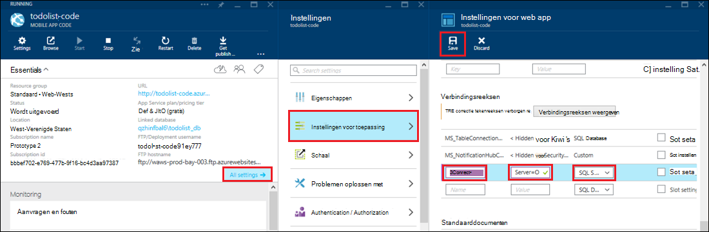

<properties 
    pageTitle="Toegang op ruimten resources hybride verbindingen met Azure App Service" 
    description="Een verbinding maken tussen een web app in Azure App Service en een bron van lokalen die gebruikmaakt van een statisch TCP-poort" 
    services="app-service" 
    documentationCenter="" 
    authors="cephalin" 
    manager="wpickett" 
    editor="mollybos"/>

<tags 
    ms.service="app-service" 
    ms.workload="na" 
    ms.tgt_pltfrm="na" 
    ms.devlang="na" 
    ms.topic="article" 
    ms.date="02/03/2016" 
    ms.author="cephalin"/>

#Toegang op ruimten resources hybride verbindingen met Azure App Service

Alle bronnen op de ruimten die gebruikmaakt van een statisch TCP-poort, zoals SQL Server, MySQL, HTTP-Web-API's en de meeste aangepaste Web Services kunt u een app Azure App-Service. In dit artikel wordt beschreven hoe u een hybride verbinding tussen App-Service en SQL Server-databases in gebouwen te maken.

> [AZURE.NOTE] Het Web Apps gedeelte van de functie hybride verbindingen is alleen beschikbaar in de [Portal Azure](https://portal.azure.com). Zie een verbinding wilt maken in de BizTalk-Services, [Hybride verbindingen](http://go.microsoft.com/fwlink/p/?LinkID=397274). 
> 
> Deze inhoud is ook van toepassing op mobiele Apps in Azure App-Service. 

## Vereisten
- Een abonnement op Azure. Zie voor een gratis abonnement [Gratis evaluatie van Azure](https://azure.microsoft.com/pricing/free-trial/). 
 
    Als u wilt aan de slag met Azure App-Service voordat u aanmelden voor een account met Azure, gaat u naar de [App-Service probeert](http://go.microsoft.com/fwlink/?LinkId=523751), waar u direct een starter tijdelijk web app in de App-Service maken kunt. Geen creditcard vereist; geen verplichtingen.

- Voor het gebruik van een database van SQL Server of SQL Server Express op gebouwen met een hybride-verbinding, moet TCP/IP voor een statische poort worden ingeschakeld. Met behulp van een standaardinstantie van SQL Server wordt aanbevolen, omdat het gebruikmaakt van statische poort 1433. Zie [verbinding maken met een SQL-Server op locatie van een Azure-website met behulp van hybride verbindingen](http://go.microsoft.com/fwlink/?LinkID=397979)voor meer informatie over het installeren en configureren van SQL Server Express voor gebruik met hybride verbindingen.

- De computer waarop u de beschreven op ruimten hybride Connection Manager-agent verderop in dit artikel installeren:

    - Moet verbinding kunnen maken met Azure via poort 5671
    - Kunnen bereiken de *hostnaam*:*poortnummer* van de bron op gebouwen. 

> [AZURE.NOTE] De stappen in dit artikel wordt ervan uitgegaan dat u de browser van de computer die als host voor de agent op ruimten hybride verbinding fungeert gebruikt.

## Een webtoepassing maken in de Portal Azure ##

> [AZURE.NOTE] U kunt als u al een web app of mobiele App back-end in de Azure-Portal die u wilt gebruiken voor deze zelfstudie hebt gemaakt, gaat u verder met het [maken van een hybride en een BizTalk-Service](#CreateHC) en start vanaf daar.

1. Klik op **Nieuw**in de linkerbovenhoek van de [Azure Portal](https://portal.azure.com) > **Web + Mobile** > **Web App**.
    
    ![Nieuwe web app.][NewWebsite]
    
2. Een URL op het **Web app** -blad en klik op **maken**. 
    
    ![Naam van website][WebsiteCreationBlade]
    
3. Na een paar seconden de web app gemaakt en wordt de web app blade weergegeven. Het blad is een verticaal overzicht dashboard waarmee u uw site te beheren.
    
    ![Website met][WebSiteRunningBlade]
    
4. Als u wilt controleren of dat de site live is, kunt u het pictogram **Bladeren** om de standaardpagina weer te geven.
    
    ![Klik op Bladeren om te zien uw web app][Browse]
    
    ![Standaardpagina web app][DefaultWebSitePage]
    
Vervolgens maakt u een hybride-verbinding als een BizTalk-service voor het web app.

## Een hybride verbinding en een BizTalk-Service maken ##

1. Klik op **alle instellingen**in uw web app blade > **netwerk** > **uw verbinding hybride eindpunten configureren**.
    
    ![Hybride verbindingen][CreateHCHCIcon]
    
2. Klik op **toevoegen**op het blad hybride-verbindingen.
    
    <!-- ![Add a hybrid connnection][CreateHCAddHC]
-->
    
3. Het blad van **een verbinding met een hybride toevoegen** wordt geopend.  Is dit uw eerste hybride verbinding de optie **nieuwe hybride verbinding** vooraf geselecteerd en de blade **hybride-verbinding maken** voor u geopend.
    
    ![Een hybride verbinding maken][TwinCreateHCBlades]
    
    Op de **maken hybride verbinding blade**
    - Voor **naam**, Geef een naam voor de verbinding.
    - Voor de **hostnaam**, voer de naam van de computer op de locatie waarop de resource.
    - Voor de **poort**, voer het poortnummer dat de resource op gebouwen (1433 voor een standaardexemplaar van SQL Server) gebruikt.
    - Klik op **Biz Talk Service**

4. Hiermee opent u het blad **BizTalk-Service maken** . Voer een naam voor de BizTalk-service en klik vervolgens op **OK**.
    
    ![BizTalk-service maken][CreateHCCreateBTS]
    
    De blade **BizTalk-Service maken** wordt gesloten en u keert terug naar de blade **hybride-verbinding maken** .
    
5. Op het blad maken hybride verbinding, klikt u op **OK**. 
    
    ![Klik op OK][CreateBTScomplete]
    
6. Wanneer het proces is voltooid, wordt het gebied met meldingen in de Portal meldt dat de verbinding is gemaakt.
    <!---TODO

    Alles werkt niet bij deze stap. Ik kan een BizTalk-service maken in de portal dogfood. Ik overschakelen naar de klassieke portal (volledige portal) en de BizTalk-service gemaakt, maar het werkt niet, kunt u de Processtappen verbinden ze - wanneer u klaar bent met de stap maken hybride conn, krijgt u de volgende fout mislukt hybride verbinding RelecIoudHC te maken. Het brontype kan niet worden gevonden in de naamruimte 'Microsoft.BizTaIkServices voor api versie 2014-06-01'.
    
    De fout geeft aan dat het type, niet het exemplaar kan niet vinden.
    ![Melding voor succes][CreateHCSuccessNotification]
    -->
7. Op de web-app blade wordt het pictogram **hybride verbindingen** nu 1 hybride verbinding is gemaakt.
    
    ![Een hybride verbinding gemaakt][CreateHCOneConnectionCreated]
    
U hebt nu een belangrijk onderdeel van de infrastructuur voor cloud hybride verbinding voltooid. Vervolgens maakt u een bijbehorende op ruimten stuk.

## Installeren van lokalen hybride Verbindingsbeheer om de verbinding te voltooien ##

1. Klik op **alle instellingen**op de web-app-blade > **netwerk** > **uw verbinding hybride eindpunten configureren**. 
    
    ![Pictogram voor hybride][HCIcon]
    
2. Op het blad **hybride verbindingen** geeft de kolom **Status** voor de laatst toegevoegde eindpunt **niet verbonden**. Klik op de verbinding om deze te configureren.
    
    ![Niet verbonden][NotConnected]
    
    De blade hybride verbinding wordt geopend.
    
    ![NotConnectedBlade][NotConnectedBlade]
    
3. Klik op het blad, **Listener-instelling**.
    
    ![Klik op Setup Listener][ClickListenerSetup]
    
4. Hiermee opent u de **verbindingseigenschappen hybride** blade. Kies onder **On-premises hybride-Verbindingsbeheer**, **Klik hier om te installeren**.
    
    ![Klik hier om te installeren][ClickToInstallHCM]
    
5. Kies **uitvoeren** om door te gaan in het dialoogvenster Beveiliging waarschuwing toepassing worden uitgevoerd.
    
    ![Kies uitvoeren om door te gaan][ApplicationRunWarning]
    
6.  Kies **Ja**in het dialoogvenster **Gebruikersaccountbeheer** .
    
    ![Kies Ja][UAC]
    
7. De hybride Connection Manager is gedownload en geïnstalleerd. 
    
    ![Installeren][HCMInstalling]
    
8. Wanneer de installatie is voltooid, klikt u op **sluiten**.
    
    ![Klik op sluiten][HCMInstallComplete]
    
    De kolom **Status** wordt nu **verbonden**op het blad **hybride verbindingen** . 
    
    ![Status verbonden][HCStatusConnected]

Nu de verbinding hybride infrastructuur is voltooid, kunt u een hybride-toepassing die wordt gebruikt. 

>[AZURE.NOTE]In de volgende secties aangegeven hoe een hybride verbinding met een mobiele Apps .NET back-end-project.

## De mobiele App .NET back-end project verbinding maken met de SQL Server-database configureren

In de App-Service is een mobiele Apps .NET back-end project alleen een ASP.NET-webtoepassing met een extra mobiele Apps SDK geïnstalleerd en geïnitialiseerd. Om uw web app gebruiken als een backend voor mobiele toepassingen, moet u [downloaden en initialiseren van de backend Mobile Apps .NET SDK](../app-service-mobile/app-service-mobile-dotnet-backend-how-to-use-server-sdk.md#install-sdk).  

Voor mobiele toepassingen moet u ook een verbindingsreeks voor de database op ruimten te definiëren en de back-end voor het gebruik van deze verbinding wijzigen. 

1. Open het bestand Web.config voor uw mobiele App .NET backend, Ga naar de sectie **connectionStrings** in in Visual Studio Solution Explorer, een nieuwe vermelding SqlClient zoals hieronder, naar de SQL Server-database op ruimten verwijst toevoegen:

        <add name="OnPremisesDBConnection"
         connectionString="Data Source=OnPremisesServer,1433;
         Initial Catalog=OnPremisesDB;
         User ID=HybridConnectionLogin;
         Password=<**secure_password**>;
         MultipleActiveResultSets=True"
         providerName="System.Data.SqlClient" />

    Vervang `<**secure_password**>` in deze tekenreeks met het wachtwoord dat u hebt gemaakt voor *HybridConnectionLogin*.

3. Klik op **Opslaan** in Visual Studio het Web.config-bestand wilt opslaan.

    > [AZURE.NOTE]Deze instelling wordt gebruikt wanneer u op de lokale computer. Wanneer in Azure, is deze instelling genegeerd door de instelling gedefinieerd in de portal.

4. De **modellen** -map en open het bestand data model, die in *Context.cs eindigt*.

6. De constructor **DbContext** exemplaar om te slagen voor de waarde wijzigen `OnPremisesDBConnection` aan de basis **DbContext** constructor vergelijkbaar met het volgende fragment:

        public class hybridService1Context : DbContext
        {
            public hybridService1Context()
                : base("OnPremisesDBConnection")
            {
            }
        }

    De service wordt nu gebruikt voor de nieuwe verbinding met de SQL Server-database.

## De backend mobiele App voor het gebruik van de verbindingsreeks op locatie bijwerken

Vervolgens moet u de instelling van een app voor deze nieuwe verbindingsreeks toevoegen zodat deze kan worden gebruikt in Azure.  

1. Terug in de [Azure portal](https://portal.azure.com) in de web app back-end-code voor uw mobiele App, klikt u op **alle instellingen**en vervolgens de **instellingen van toepassing**.

3. Schuif in de blade **Web app instellingen** naar **tekenreeksen** en voeg een nieuwe **SQL Server** -verbindingsreeks met de naam `OnPremisesDBConnection` met een waarde zoals `Server=OnPremisesServer,1433;Database=OnPremisesDB;User ID=HybridConnectionsLogin;Password=<**secure_password**>`.

    Vervangen `<**secure_password**>` met beveiligd-wachtwoordverificatie voor uw database op gebouwen.

    

2. Druk op **Opslaan** de verbindingstekenreeks die u zojuist hebt gemaakt en hybride verbinding op te slaan.

U kunt op dit moment het serverproject publiceren en testen van de nieuwe verbinding met uw bestaande Apps voor mobiele clients. Gegevens worden gelezen uit en opgeslagen in de database op ruimten is de hybride verbinding.

## Volgende stappen ##

- Zie voor meer informatie over het maken van een ASP.NET-webtoepassing die gebruikmaakt van een hybride-verbinding [verbinding maken met een SQL-Server op ruimten van een website Azure hybride verbindingen](http://go.microsoft.com/fwlink/?LinkID=397979). 

### Aanvullende bronnen

[Hybride verbindingen-overzicht](http://go.microsoft.com/fwlink/p/?LinkID=397274)

[Josh Twist introduceert hybride verbindingen (video Channel 9)](http://channel9.msdn.com/Shows/Azure-Friday/Josh-Twist-introduces-hybrid-connections)

[Website van hybride verbindingen](https://azure.microsoft.com/services/biztalk-services/)

[BizTalk-Services: Dashboard, Monitor, schaal, configureren en verbinding Hybrid tabbladen](../biztalk-services/biztalk-dashboard-monitor-scale-tabs.md)

[Bouwen van een Real-World hybride Cloud met naadloze overdraagbaarheid van toepassing (video Channel 9)](http://channel9.msdn.com/events/TechEd/NorthAmerica/2014/DCIM-B323#fbid=)

[Verbinding maken met een SQL-Server in de ruimten van Azure Mobile Services met behulp van hybride verbindingen (video Channel 9)](http://channel9.msdn.com/Series/Windows-Azure-Mobile-Services/Connect-to-an-on-premises-SQL-Server-from-Azure-Mobile-Services-using-Hybrid-Connections)

## Wat er veranderd
* Zie voor een handleiding voor het wijzigen van Websites met App-Service: [Azure App Service en de Impact op de bestaande Azure Services](http://go.microsoft.com/fwlink/?LinkId=529714)

<!-- IMAGES -->
[New]:./media/web-sites-hybrid-connection-get-started/B01New.png
[NewWebsite]:./media/web-sites-hybrid-connection-get-started/B02NewWebsite.png
[WebsiteCreationBlade]:./media/web-sites-hybrid-connection-get-started/B03WebsiteCreationBlade.png
[WebSiteRunningBlade]:./media/web-sites-hybrid-connection-get-started/B04WebSiteRunningBlade.png
[Browse]:./media/web-sites-hybrid-connection-get-started/B05Browse.png
[DefaultWebSitePage]:./media/web-sites-hybrid-connection-get-started/B06DefaultWebSitePage.png
[CreateHCHCIcon]:./media/web-sites-hybrid-connection-get-started/C01CreateHCHCIcon.png
[CreateHCAddHC]:./media/web-sites-hybrid-connection-get-started/C02CreateHCAddHC.png
[TwinCreateHCBlades]:./media/web-sites-hybrid-connection-get-started/C03TwinCreateHCBlades.png
[CreateHCCreateBTS]:./media/web-sites-hybrid-connection-get-started/C04CreateHCCreateBTS.png
[CreateBTScomplete]:./media/web-sites-hybrid-connection-get-started/C05CreateBTScomplete.png
[CreateHCSuccessNotification]:./media/web-sites-hybrid-connection-get-started/C06CreateHCSuccessNotification.png
[CreateHCOneConnectionCreated]:./media/web-sites-hybrid-connection-get-started/C07CreateHCOneConnectionCreated.png
[HCIcon]:./media/web-sites-hybrid-connection-get-started/D01HCIcon.png
[NotConnected]:./media/web-sites-hybrid-connection-get-started/D02NotConnected.png
[NotConnectedBlade]:./media/web-sites-hybrid-connection-get-started/D03NotConnectedBlade.png
[ClickListenerSetup]:./media/web-sites-hybrid-connection-get-started/D04ClickListenerSetup.png
[ClickToInstallHCM]:./media/web-sites-hybrid-connection-get-started/D05ClickToInstallHCM.png
[ApplicationRunWarning]:./media/web-sites-hybrid-connection-get-started/D06ApplicationRunWarning.png
[UAC]:./media/web-sites-hybrid-connection-get-started/D07UAC.png
[HCMInstalling]:./media/web-sites-hybrid-connection-get-started/D08HCMInstalling.png
[HCMInstallComplete]:./media/web-sites-hybrid-connection-get-started/D09HCMInstallComplete.png
[HCStatusConnected]:./media/web-sites-hybrid-connection-get-started/D10HCStatusConnected.png
 