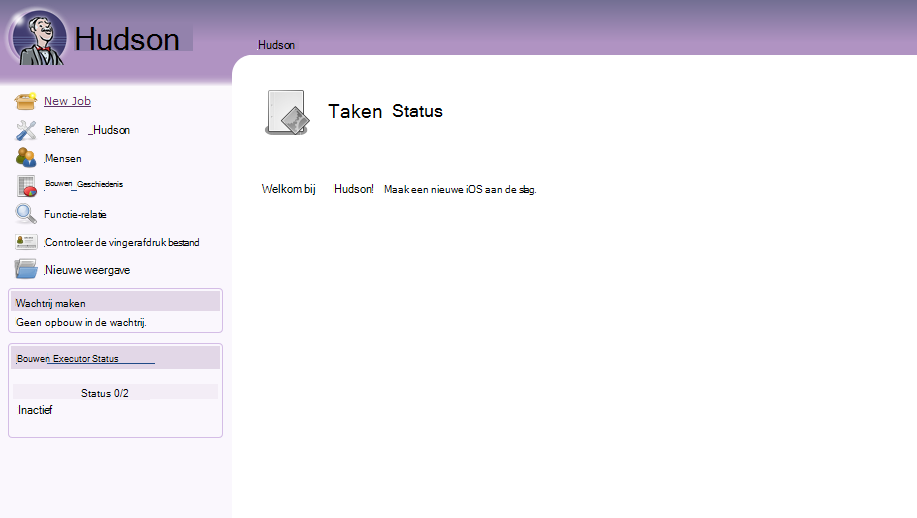
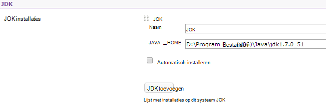
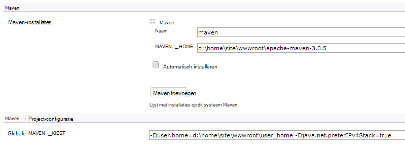

<properties 
    pageTitle="Een aangepaste Java web app uploaden naar Azure" 
    description="In deze zelfstudie wordt beschreven hoe u een aangepaste Java web app uploaden naar Azure App Service Web Apps." 
    services="app-service\web" 
    documentationCenter="java" 
    authors="rmcmurray" 
    manager="wpickett" 
    editor=""/>

<tags 
    ms.service="app-service-web" 
    ms.workload="web" 
    ms.tgt_pltfrm="na" 
    ms.devlang="Java" 
    ms.topic="article" 
    ms.date="08/11/2016" 
    ms.author="robmcm"/>

# Een aangepaste Java web app uploaden naar Azure

In dit onderwerp wordt uitgelegd hoe u een aangepaste Java web app uploaden naar [Azure App Service] Web Apps. Bevat gegevens met betrekking tot een website of web app voor Java en ook enkele voorbeelden voor specifieke toepassingen.

Opmerking Azure biedt een manier voor het maken van Java web apps met behulp van de gebruikersinterface voor de Azure-Portal configuratie en de markt Azure zoals beschreven bij het [maken van een Java web app in Azure App-Service](web-sites-java-get-started.md). Deze zelfstudie is voor scenario's waarin u niet wilt gebruiken de Azure Portal-configuratie UI of de markt Azure.  

## Configuratie-instructies

De volgende tabel ziet de instellingen voor aangepaste Java web apps op Azure verwacht.

- De HTTP-poort wordt gebruikt door het proces van Java dynamisch toegewezen.  Het proces moet via de poort van de omgevingsvariabele `HTTP_PLATFORM_PORT`.
- Alle listen poorten dan de enkele HTTP-listener moeten worden uitgeschakeld.  In Tomcat, die bestaat uit het afsluiten, HTTPS en AJP poorten.
- De container moet worden geconfigureerd voor alleen IPv4-verkeer.
- De opdracht wordt **gestart** voor de toepassing moet worden ingesteld in de configuratie.
- Mappen met toepassingen schrijven toestemming moet zich bevinden in de Azure web app van de map met inhoud, die **D:\home**is.  De omgevingsvariabele `HOME` verwijst naar D:\home.  

U kunt omgevingsvariabelen zoals vereist in het bestand web.config instellen.

## configuratie van web.config-httpPlatform

De volgende informatie beschrijft de indeling van de **httpPlatform** in web.config.
                                 
**argumenten** (Standaard = ""). Argumenten voor het uitvoerbare bestand of script dat is opgegeven in de instelling van de **processPath** .

Voorbeelden (met **processPath** opgenomen):

    processPath="%HOME%\site\wwwroot\bin\tomcat\bin\catalina.bat"
    arguments="start"
    
    processPath="%JAVA_HOME\bin\java.exe"
    arguments="-Djava.net.preferIPv4Stack=true -Djetty.port=%HTTP\_PLATFORM\_PORT% -Djetty.base=&quot;%HOME%\site\wwwroot\bin\jetty-distribution-9.1.0.v20131115&quot; -jar &quot;%HOME%\site\wwwroot\bin\jetty-distribution-9.1.0.v20131115\start.jar&quot;"

**processPath** - pad naar het uitvoerbare bestand of script dat een proces luistert naar HTTP-verzoeken wordt gestart.

Voorbeelden:

    processPath="%JAVA_HOME%\bin\java.exe"

    processPath="%HOME%\site\wwwroot\bin\tomcat\bin\startup.bat"

    processPath="%HOME%\site\wwwroot\bin\tomcat\bin\catalina.bat"
                                                                                       
**rapidFailsPerMinute** (Standaard = 10.) Het aantal keren dat het proces dat is opgegeven in **processPath** vastlopen per minuut is toegestaan. Als deze limiet wordt overschreden, wordt het proces voor de rest van de minuut starten **HttpPlatformHandler** gestopt.
                                    
**requestTimeout** (Standaard = "00: 02:00".) Duur waarvoor **HttpPlatformHandler** op een reactie van het proces luistert wacht op `%HTTP_PLATFORM_PORT%`.

**startupRetryCount** (Standaard = 10.) Aantal keren **die httpplatformhandler** probeert te starten van het proces dat is opgegeven in **processPath**. Zie **startupTimeLimit** voor meer informatie.

**startupTimeLimit** (Standaard = 10 seconden.) De duur die **HttpPlatformHandler** wordt gewacht op het uitvoerbare bestand/script starten een proces luistert op de poort.  Als deze termijn wordt overschreden, wordt **HttpPlatformHandler** het proces beëindigen en probeer het nog **startupRetryCount** keer starten.
                                                                                      
**stdoutLogEnabled** (Standaard = "true".) Als true, **stdout** en **stderr** voor het proces dat is opgegeven met de instelling **processPath** wordt omgeleid naar het bestand dat is opgegeven in **stdoutLogFile** (Zie punt **stdoutLogFile** ).
                                    
**stdoutLogFile** (Default="d:\home\LogFiles\httpPlatformStdout.log".) Absoluut pad waarvoor **stdout** en **stderr** van het proces voor **processPath** worden geregistreerd.
                                    
> [AZURE.NOTE] `%HTTP_PLATFORM_PORT%`is de speciale aanduiding die moet worden opgegeven als onderdeel van de **argumenten** , of als onderdeel van de lijst van **httpPlatform** **environmentVariables** . Dit wordt vervangen door een intern gegenereerde poort door **HttpPlatformHandler** zodat het proces dat is opgegeven met **processPath** op deze poort luisteren kunt.

## Implementatie

Java gebaseerde web apps gemakkelijk kunnen worden geïmplementeerd door middel van de meeste van dezelfde middelen die worden gebruikt met Internet Information Services (IIS) op basis van webtoepassingen.  FTP, Git en Kudu worden allemaal ondersteund als mechanismen voor implementatie, is de geïntegreerde SCM-mogelijkheid voor web apps. WebDeploy werkt als een protocol, maar als Java niet is ontwikkeld in Visual Studio WebDeploy komt niet overeen met Java web app implementatie use-cases.

## Toepassingsconfiguratie-voorbeelden

Configuratie is voor de volgende toepassingen, een web.config-bestand en de toepassing beschikbaar als voorbeelden laten zien hoe u uw Java-toepassing op Web Apps van App-Service inschakelen.

### Tomcat
Er zijn twee varianten van de Tomcat die worden geleverd bij de Service Web-Apps App, is het nog steeds heel mogelijk voor het uploaden van klant specifieke exemplaren. Hieronder volgt een voorbeeld van een installatie van Tomcat met een ander Java Virtual Machine (JVM).

    <?xml version="1.0" encoding="UTF-8"?>
    <configuration>
      <system.webServer>
        <handlers>
          <add name="httpPlatformHandler" path="*" verb="*" modules="httpPlatformHandler" resourceType="Unspecified" />
        </handlers>
        <httpPlatform processPath="%HOME%\site\wwwroot\bin\tomcat\bin\startup.bat" 
            arguments="">
          <environmentVariables>
            <environmentVariable name="CATALINA_OPTS" value="-Dport.http=%HTTP_PLATFORM_PORT%" />
            <environmentVariable name="CATALINA_HOME" value="%HOME%\site\wwwroot\bin\tomcat" />
            <environmentVariable name="JRE_HOME" value="%HOME%\site\wwwroot\bin\java" /> <!-- optional, if not specified, this will default to %programfiles%\Java -->
            <environmentVariable name="JAVA_OPTS" value="-Djava.net.preferIPv4Stack=true" />
          </environmentVariables>
        </httpPlatform>
      </system.webServer>
    </configuration>

Aan de Tomcat zijn er een paar wijzigingen in de configuratie die moet worden gemaakt. De server.xml moet worden bewerkt om in te stellen:

-   Shutdown poort = -1
-   HTTP-connector poort = ${port.http}
-   HTTP-connector adres = "127.0.0.1"
-   Reactie op HTTPS en AJP-connectors
-   De IPv4-instelling kan ook worden ingesteld in het catalina.properties-bestand waar u kunt toevoegen`java.net.preferIPv4Stack=true`
    
Direct3d-oproepen worden niet ondersteund op het Web Apps van App-Service. Schakel de toevoegen de volgende Java-optie moet uw toepassing dergelijke oproepen:`-Dsun.java2d.d3d=false`

### Jetty

Zoals het geval is voor Tomcat, kunnen klanten hun eigen exemplaren kunnen uploaden voor Jetty. Bij het uitvoeren van de volledige installatie van Jetty, eruit de configuratie als volgt:

    <?xml version="1.0" encoding="UTF-8"?>
    <configuration>
      <system.webServer>
        <handlers>
          <add name="httppPlatformHandler" path="*" verb="*" modules="httpPlatformHandler" resourceType="Unspecified" />
        </handlers>
        <httpPlatform processPath="%JAVA_HOME%\bin\java.exe" 
             arguments="-Djava.net.preferIPv4Stack=true -Djetty.port=%HTTP_PLATFORM_PORT% -Djetty.base=&quot;%HOME%\site\wwwroot\bin\jetty-distribution-9.1.0.v20131115&quot; -jar &quot;%HOME%\site\wwwroot\bin\jetty-distribution-9.1.0.v20131115\start.jar&quot;"
            startupTimeLimit="20"
          startupRetryCount="10"
          stdoutLogEnabled="true">
        </httpPlatform>
      </system.webServer>
    </configuration>

De Jetty-configuratie moet worden gewijzigd in de start.ini in te stellen `java.net.preferIPv4Stack=true`.

### Springboot
Ophalen van een Springboot moet toepassing waarop u uw JAR- of WAR-bestand uploaden en het volgende web.config-bestand toe te voegen. Het bestand web.config terechtkomt in de wwwroot-map. Pas de argumenten van de JAR-bestand in het volgende voorbeeld dat het JAR-bestand bevindt zich in de wwwroot-map en wijs in het bestand web.config.  

    <?xml version="1.0" encoding="UTF-8"?>
    <configuration>
      <system.webServer>
        <handlers>
          <add name="httpPlatformHandler" path="*" verb="*" modules="httpPlatformHandler" resourceType="Unspecified" />
        </handlers>
        <httpPlatform processPath="%JAVA_HOME%\bin\java.exe"
            arguments="-Djava.net.preferIPv4Stack=true -Dserver.port=%HTTP_PLATFORM_PORT% -jar &quot;%HOME%\site\wwwroot\my-web-project.jar&quot;">
        </httpPlatform>
      </system.webServer>
    </configuration>

### Hudson

Onze test gebruikt de oorlog Hudson 3.1.2 en het standaardexemplaar Tomcat 7.0.50 maar zonder dingen instellen met behulp van de gebruikersinterface.  Hudson is een software tool bouwen en wordt aanbevolen op specifieke gevallen waarbij de vlag **AlwaysOn** kan worden ingesteld op de web app installeren.

1. Maak een map met **webapps** (als deze niet al aanwezig waren) in de hoofdmap van uw web app, dat wil zeggen, **d:\home\site\wwwroot**, en Hudson.war in **d:\home\site\wwwroot\webapps**te plaatsen.
2. Download apache maven 3.0.5 (compatibel met de Hudson) en plaatst u deze in **d:\home\site\wwwroot**.
3. Web.config maken in **d:\home\site\wwwroot** en plak de volgende inhoud in het:
    
        <?xml version="1.0" encoding="UTF-8"?>
        <configuration>
          <system.webServer>
            <handlers>
              <add name="httppPlatformHandler" path="*" verb="*" 
        modules="httpPlatformHandler" resourceType="Unspecified" />
            </handlers>
            <httpPlatform processPath="%AZURE_TOMCAT7_HOME%\bin\startup.bat"
        startupTimeLimit="20"
        startupRetryCount="10">
        <environmentVariables>
          <environmentVariable name="HUDSON_HOME" 
        value="%HOME%\site\wwwroot\hudson_home" />
          <environmentVariable name="JAVA_OPTS" 
        value="-Djava.net.preferIPv4Stack=true -Duser.home=%HOME%/site/wwwroot/user_home -Dhudson.DNSMultiCast.disabled=true" />
        </environmentVariables>            
            </httpPlatform>
          </system.webServer>
        </configuration>

    De web app kan op dit moment opnieuw worden gestart om de wijzigingen.  Verbinding maken met http://yourwebapp/hudson Hudson te starten.

4. Nadat Hudson zichzelf configureert, ziet u het volgende scherm:

    
    
5. Toegang tot de configuratiepagina van Hudson: **Hudson beheren**, en klik op **Systeem configureren**.
6. De JDK configureren als volgt:

    

7. Maven configureren als volgt:

    

8. De instellingen opslaan. Hudson worden nu geconfigureerd en klaar voor gebruik.

Zie voor meer informatie over Hudson, [http://hudson-ci.org](http://hudson-ci.org).

### Liferay

Liferay wordt ondersteund op het Web Apps van App-Service. Omdat Liferay veel geheugen vereist kan, wordt de web app moet worden uitgevoerd op een middelgrote of grote specifieke werknemer, die onvoldoende geheugen. Liferay duurt ook enkele minuten om op te starten. Daarom is het aanbevolen dat u de web app ingesteld op **Altijd op**.  

Liferay 6.1.2 die community Edition GA3 gebundeld met Tomcat, zijn de volgende bestanden na het downloaden van Liferay bewerkt:

**Server.XML**

- Afsluiten-poort wijzigen in -1.
- Wijzigen van HTTP-connector      `<Connector port="${port.http}" protocol="HTTP/1.1" connectionTimeout="600000" address="127.0.0.1" URIEncoding="UTF-8" />`
- Commentaar uit de AJP-connector.

Maak een bestand met de naam **portal-ext.properties**in de map **liferay\tomcat-7.0.40\webapps\ROOT\WEB-INF\classes** . Dit bestand moet een regel bevatten zoals hier:

    liferay.home=%HOME%/site/wwwroot/liferay

Op dezelfde directory niveau als de map tomcat-7.0.40, maakt u een bestand met de naam **web.config** met de volgende inhoud:

    <?xml version="1.0" encoding="UTF-8"?>
    <configuration>
      <system.webServer>
        <handlers>
    <add name="httpPlatformHandler" path="*" verb="*"
         modules="httpPlatformHandler" resourceType="Unspecified" />
        </handlers>
        <httpPlatform processPath="%HOME%\site\wwwroot\tomcat-7.0.40\bin\catalina.bat" 
                      arguments="run" 
                      startupTimeLimit="10" 
                      requestTimeout="00:10:00" 
                      stdoutLogEnabled="true">
          <environmentVariables>
      <environmentVariable name="CATALINA_OPTS" value="-Dport.http=%HTTP_PLATFORM_PORT%" />
      <environmentVariable name="CATALINA_HOME" value="%HOME%\site\wwwroot\tomcat-7.0.40" />
            <environmentVariable name="JRE_HOME" value="D:\Program Files\Java\jdk1.7.0_51" /> 
            <environmentVariable name="JAVA_OPTS" value="-Djava.net.preferIPv4Stack=true" />
          </environmentVariables>
        </httpPlatform>
      </system.webServer>
    </configuration>

Onder het blok **httpPlatform** de **requestTimeout** is ingesteld op ' 00: 10:00 ".  Vervolgens ziet u waarschijnlijk een time-outfouten terwijl Liferay is bootstrappen, maar kan worden verminderd.  Als deze waarde wordt gewijzigd, moet vervolgens de **connectionTimeout** in de tomcat server.xml ook worden gewijzigd.  

Hierbij moet worden opgemerkt dat de JRE_HOME environnment varariable is opgegeven in de bovenstaande web.config om te verwijzen naar de 64-bits JDK. De standaardwaarde is 32-bits, maar omdat Liferay een hoge mate van geheugen vereist kan, verdient het gebruik van de 64-bits JDK.

Als u deze wijzigingen opnieuw uw web app met Liferay, open vervolgens de http://yourwebapp. De portal van Liferay is beschikbaar vanuit de hoofdmap van het web app. 

## Volgende stappen

Zie voor meer informatie over Liferay, [http://www.liferay.com](http://www.liferay.com).

Zie voor meer informatie over Java, [Java Developer Center](/develop/java/).

[AZURE.INCLUDE [app-service-web-whats-changed](../../includes/app-service-web-whats-changed.md)]

[AZURE.INCLUDE [app-service-web-try-app-service](../../includes/app-service-web-try-app-service.md)]
 
 
<!-- External Links -->
[Azure App-Service]: http://go.microsoft.com/fwlink/?LinkId=529714
