<properties 
    pageTitle="Een onderneming web app migreren naar Azure App Service" 
    description="Ziet u hoe snel migreren van bestaande IIS-websites naar Azure App Service Web-Apps Web Apps migratie-assistent gebruiken" 
    services="app-service" 
    documentationCenter="" 
    authors="cephalin" 
    writer="cephalin" 
    manager="wpickett" 
    editor=""/>

<tags 
    ms.service="app-service" 
    ms.workload="na" 
    ms.tgt_pltfrm="na" 
    ms.devlang="na" 
    ms.topic="article" 
    ms.date="07/01/2016" 
    ms.author="cephalin"/>

# Een onderneming web app migreren naar Azure App Service

U kunt gemakkelijk uw bestaande websites die worden uitgevoerd op Internet Information Service (IIS) 6 of hoger om [App Service Web Apps](http://go.microsoft.com/fwlink/?LinkId=529714)te migreren. 

>[AZURE.IMPORTANT] Windows Server 2003 ondersteuning op 14 juli-2015 geëindigd. Als u momenteel uw websites op een IIS-server host is Windows Server 2003, Web Apps is een laag risico, lage kosten en lage wrijving manier om online uw websites en Web Apps Migration Assistant kan helpen bij het migratieproces voor u. 

[Web Apps migratie-assistent](https://www.movemetothecloud.net/) kan uw installatie van IIS server analyseren, bepalen welke sites kunnen worden gemigreerd naar App Service elementen kunnen niet worden gemigreerd of niet worden ondersteund op het platform te markeren en vervolgens uw websites en de bijbehorende databases naar Azure migreren.

[AZURE.INCLUDE [app-service-web-to-api-and-mobile](../../includes/app-service-web-to-api-and-mobile.md)]

## Elementen gecontroleerd tijdens de analyse compatibiliteit ##
De migratie-assistent maakt een rapport gereedheid voor het identificeren van alle mogelijke oorzaken voor bezorgdheid of belemmeringen waardoor een succesvolle migratie van IIS voor ruimten met Azure App Service Web Apps. Enkele van de belangrijkste items rekening houden met zijn:

-   Poort bindingen – Web Apps ondersteunt alleen poort 80 voor HTTP en poort 443 voor HTTPS-verkeer. Verschillende poortconfiguraties wordt genegeerd en het verkeer wordt doorgestuurd naar 80 of 443. 
-   Verificatie: Web Apps ondersteunt anonieme verificatie en verificatie van formulieren door een toepassing aangegeven. Windows-verificatie kan worden gebruikt door de integratie met Azure Active Directory en AD FS alleen. Alle andere vormen van verificatie -, bijvoorbeeld basisverificatie - worden momenteel niet ondersteund. 
-   Globale Assembly-Cache (GAC) – de GAC wordt niet ondersteund in Web Apps. Als uw toepassing verwijst naar assembly's die u gewoonlijk aan de GAC implementeert, moet u naar de map bin in Web Apps implementeren. 
-   IIS5-Compatibiliteitsmodus: dit wordt niet ondersteund in Web Apps. 
-   Groepen van toepassingen – In Web Apps, elke site en de onderliggende toepassingen in dezelfde groep van toepassingen worden uitgevoerd. Als uw site meerdere onderliggende toepassingen gebruikmaken van meerdere groepen van toepassingen heeft, samenvoegen tot een enkele groep van toepassingen met algemene instellingen of migreren van elke aanvraag om een afzonderlijke webtoepassing.
-   COM-componenten: Web Apps is niet toegestaan voor de registratie van COM-componenten op het platform. Als uw websites of toepassingen gebruik van een COM-onderdelen maken, moet u ze in beheerde code herschrijven en ze implementeren met de website of toepassing.
-   ISAPI-Filters: Web Apps kan ondersteunen het gebruik van ISAPI-Filters. U moet het volgende doen:
    -   implementeren van de dll-bestanden met uw web app 
    -   Registreer de dll-bestanden met behulp van [Web.config](http://www.iis.net/configreference/system.webserver/isapifilters)
    -   Plaats een applicationHost.xdt bestand in de hoofdmap van de site met de volgende inhoud:

            <?xml version="1.0"?>
            <configuration xmlns:xdt="http://schemas.microsoft.com/XML-Document-Transform">
            <configSections>
                <sectionGroup name="system.webServer">
                  <section name="isapiFilters" xdt:Transform="SetAttributes(overrideModeDefault)" overrideModeDefault="Allow" />
                </sectionGroup>
              </configSections>
            </configuration>

        Zie [de website Microsoft Azure transformeren](http://blogs.msdn.com/b/waws/archive/2014/06/17/transform-your-microsoft-azure-web-site.aspx)voor meer voorbeelden van het gebruik van transformaties van XML-Document met uw website.

-   Andere onderdelen zoals SharePoint, front page-serverextensies (FPSE), FTP-, SSL-certificaten worden niet gemigreerd.

## Het gebruik van de Web Apps Migration-Assistant ##
Deze sectie doorlopen een voorbeeld om te migreren van een paar websites die gebruikmaken van SQL Server-database en wordt uitgevoerd op een Windows Server 2003 R2 (IIS 6.0) op de lokale computer:

1.  Op de IIS-server of de clientcomputer gaat u naar [https://www.movemetothecloud.net/](https://www.movemetothecloud.net/) 

    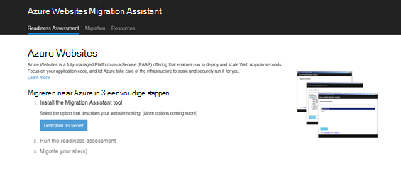

2.  Web Apps migratie-assistent installeren door te klikken op de knop van de **IIS-Server toegewezen** . Meer opties zijn beschikbaar in de nabije toekomst. 
4.  Klik op de knop Web Apps migratie-assistent installeren op uw computer **Installeren** .

    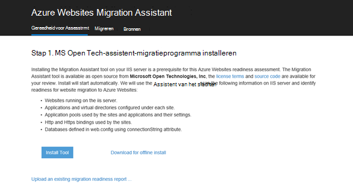

    >[AZURE.NOTE] U kunt ook klikken op **downloaden voor off line installeren** om te downloaden van een ZIP-bestand voor het installeren op servers die geen verbinding met het internet. Of kunt u **een bestaand rapport van migration readiness uploaden**, is een geavanceerde optie voor het werken met een bestaand migration readiness rapport die u eerder hebt gegenereerd (wordt later uitgelegd).

5.  Klik in het scherm **Toepassing installeren** op **installeren** op uw computer installeren. Het zal ook bijbehorende afhankelijkheden, zoals Web implementeren, DacFX en IIS installeren indien nodig. 

    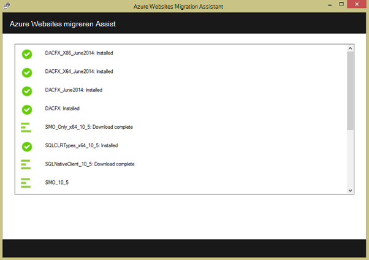

    Eenmaal geïnstalleerd, Web Apps migratie-assistent wordt automatisch gestart.
  
6.  Kies **sites migreren en databases van een externe server naar Azure**. De beheerdersreferenties voor de externe server en klik op **Doorgaan**. 

    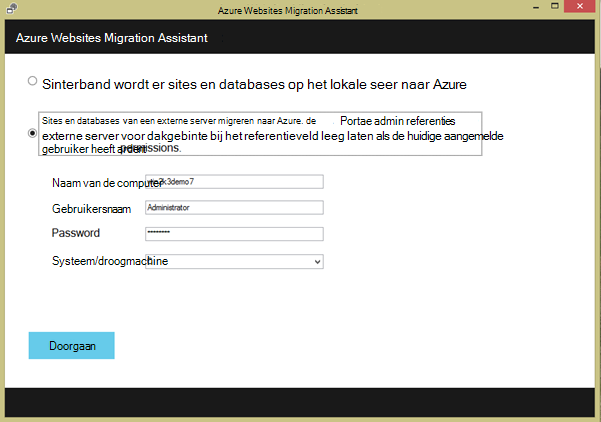

    Natuurlijk kunt u voor het migreren van de lokale server. De externe optie is handig wanneer u wilt migreren van websites van de IIS-server van een productie.
 
    Op dit moment het migratieprogramma te zullen inspecteren de configuratie van de IIS-server, zoals Sites, toepassingen, toepassingen en afhankelijkheden voor kandidaat-websites voor migratie. 

8.  Het screenshot hieronder toont drie websites – **Standaardwebsite**, **TimeTracker**en **CommerceNet4**. Alle hebben een gekoppelde database die u wilt migreren. Selecteer alle websites die u wilt analyseren en klik vervolgens op **volgende**.

    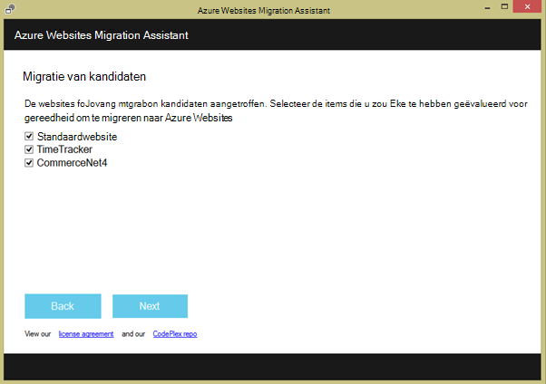
 
9.  Klik op **uploaden** om het rapport readiness uploaden. Als u het **bestand lokaal opslaan**klikt, kunt u het migratieprogramma later opnieuw uitvoeren en het rapport opgeslagen readiness uploaden zoals eerder is opgemerkt.

    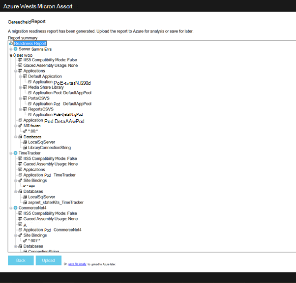
 
    Nadat u het rapport readiness uploaden, is Azure voert analyse van de gereedheid en toont u de resultaten. Lees de details van de beoordeling voor elke website en zorg ervoor dat u begrijpt of alle problemen zijn opgelost voordat u verdergaat. 
 
    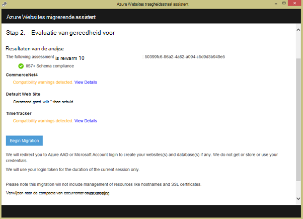

12. Klik op **Beginnen migreren** om de migratie te starten. U wordt nu omgeleid naar Azure aan te melden bij uw account. Het is belangrijk dat u zich aanmelden met een account met een geldig abonnement met Azure. Als u nog geen een Azure account kunt vervolgens u aanmelden voor een gratis proefperiode [hier](https://azure.microsoft.com/pricing/free-trial/?WT.srch=1&WT.mc_ID=SEM_). 

13. Selecteer de rekening van de huurder, Azure abonnement en regio moet worden gebruikt voor het gemigreerde Azure web apps en databases, en klik op **Migratie Start**. Kunt u de websites later migreren.

    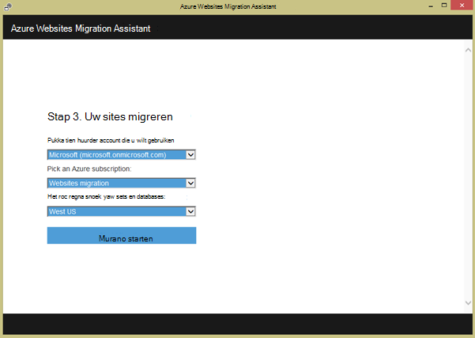

14. In het volgende scherm kunt u wijzigingen aanbrengen in de standaardinstellingen voor migratie, zoals:

    - Gebruik een bestaande Azure SQL-Database of een nieuwe Azure SQL-database en de referenties te configureren
    - Selecteer de websites migreren
    - namen definiëren voor de Azure web apps en hun gekoppelde SQL-databases
    - de globale instellingen en het niveau van de site instellingen aanpassen

    Het screenshot hieronder toont de websites die zijn geselecteerd om te migreren met de standaardinstellingen.

    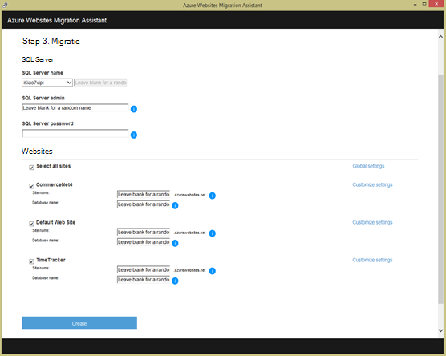

    >[AZURE.NOTE] het selectievakje **Azure Active Directory inschakelen** in aangepaste instellingen integreert de Azure web app met [Azure Active Directory](active-directory-whatis.md) (de **Default Directory**). Zie voor meer informatie over gesynchroniseerd Azure Active Directory met uw lokale Active Directory, [Directory-integratie](http://msdn.microsoft.com/library/jj573653).

16.  Als u de gewenste wijzigingen hebt gemaakt, klikt u op **maken** om het migratieproces start. Het migratieprogramma Azure web app en de Azure SQL-Database maken en vervolgens publiceren van de website-inhoud en databases. De voortgang van de migratie wordt duidelijk weergegeven in het hulpprogramma voor migratie en er verschijnt een overzichtsscherm aan het einde, welke details de sites worden gemigreerd, of ze geslaagd zijn, koppelingen naar de zojuist gemaakte Azure web apps. 

    Als er een fout tijdens de migratie optreedt, wordt het migratieprogramma duidelijk fout en rollback de wijzigingen. Ook mogelijk het rapport rechtstreeks naar het technische team verzenden door te klikken op de knop **Rapport verzenden** met de vastgelegde fout call-stack en bouwen van de hoofdtekst van het bericht. 

    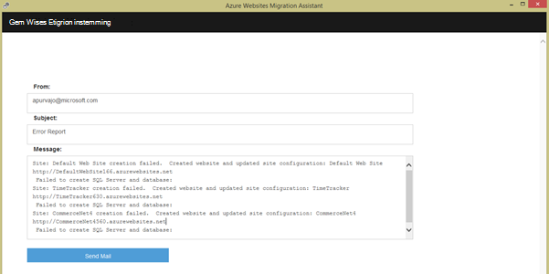

    Als migratie is geslaagd zonder fouten, u kunt ook klikken op de knop **Feedback geven** om eventuele feedback rechtstreeks te. 
 
20. Klik op de koppelingen naar de Azure web apps en controleer of dat de migratie is voltooid.

21. Nu kunt u de gemigreerde web apps in Azure App-Service beheren. Log in op de [Portal Azure](https://portal.azure.com)hiervoor.

22. In de Portal Azure opent de blade Web Apps om te zien de gemigreerde websites (weergegeven als web apps), klik vervolgens op een van hen om te beginnen met het beheren van de web-app, zoals het configureren van continue publishing, het maken van back-ups, autoscaling, controle gebruik of prestaties.

    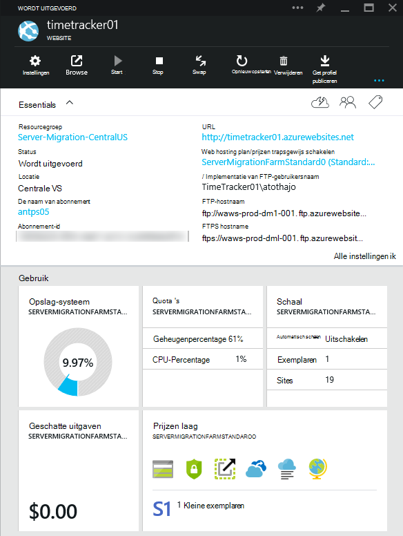

>[AZURE.NOTE] Als u wilt aan de slag met Azure App-Service voordat u aanmelden voor een account met Azure, gaat u naar de [App-Service probeert](http://go.microsoft.com/fwlink/?LinkId=523751), waar u direct een starter tijdelijk web app in de App-Service maken kunt. Geen creditcard vereist; geen verplichtingen.

## Wat er veranderd
* Zie voor een handleiding voor het wijzigen van Websites met App-Service: [Azure App Service en de Impact op de bestaande Azure Services](http://go.microsoft.com/fwlink/?LinkId=529714)
 
