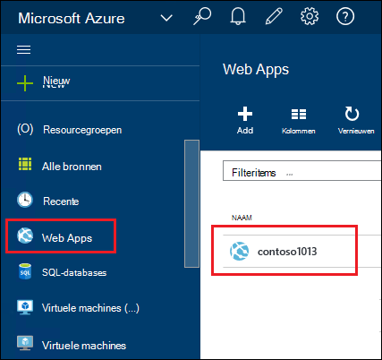
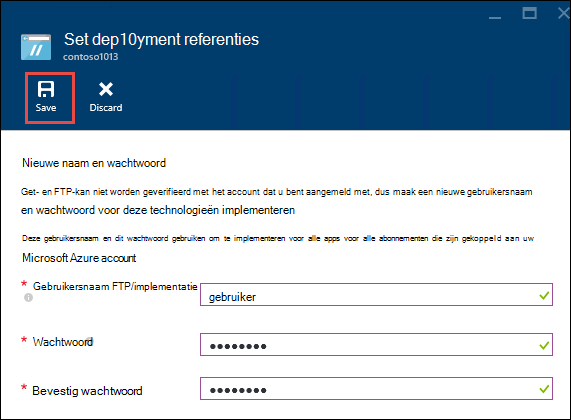
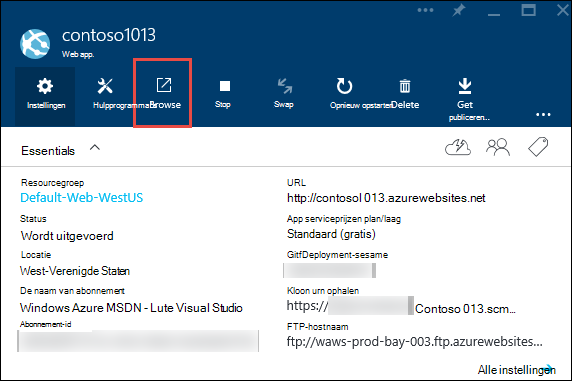
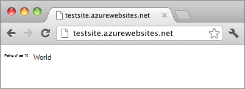

<properties
    pageTitle="Maak een Node.js web app in Azure App Service | Microsoft Azure"
    description="Informatie over het implementeren van een toepassing Node.js naar een web app in Azure App-Service."
    services="app-service\web"
    documentationCenter="nodejs"
    authors="rmcmurray"
    manager="wpickett"
    editor=""/>

<tags
    ms.service="app-service-web"
    ms.workload="web"
    ms.tgt_pltfrm="na"
    ms.devlang="nodejs"
    ms.topic="hero-article"
    ms.date="08/11/2016"
    ms.author="robmcm"/>

# Een Node.js web app in Azure App Service maken

> [AZURE.SELECTOR]
- [.NET](web-sites-dotnet-get-started.md)
- [Node.js](web-sites-nodejs-develop-deploy-mac.md)
- [Java](web-sites-java-get-started.md)
- [PHP - Git](web-sites-php-mysql-deploy-use-git.md)
- [PHP - FTP](web-sites-php-mysql-deploy-use-ftp.md)
- [Python](web-sites-python-ptvs-django-mysql.md)

Deze zelfstudie laat zien hoe een eenvoudige [Node.js](http://nodejs.org) toepassing maken en deze implementeren in een [web app](app-service-web-overview.md) in [Azure App-Service](../app-service/app-service-value-prop-what-is.md) met behulp van [Git](http://git-scm.com). De instructies in deze handleiding kunnen op elk besturingssysteem dat Node.js waarop kan worden gevolgd.

U leert:

* Het maken van een web app in Azure App-Service via de Portal Azure.
* Informatie over het implementeren van een toepassing Node.js web App naar de web-app Git repository pushen.

De voltooide toepassing korte string "hello world" naar de browser geschreven.

![Een browser 'Hello World' wordt weergegeven.][helloworld-completed]

Zie [Node.js Developer Center](/develop/nodejs/)voor zelfstudies en voorbeeldcode met complexe toepassingen met Node.js of andere onderwerpen over het gebruik van Node.js in Azure.

> [AZURE.NOTE]
> Als u deze zelfstudie hebt voltooid, moet u een account van Microsoft Azure. Als u geen account hebt, kunt u [uw voordelen van Visual Studio abonnee te activeren](/en-us/pricing/member-offers/msdn-benefits-details/?WT.mc_id=A261C142F) of [Aanmelden voor een gratis proefversie](/en-us/pricing/free-trial/?WT.mc_id=A261C142F).
>
> Als u aan de slag met Azure App-Service wilt voordat u zich voor een account met Azure aanmeldt, gaat u naar de [App-Service probeert](http://go.microsoft.com/fwlink/?LinkId=523751). Daar kunt u onmiddellijk maken een tijdelijk starter web app in de App-Service — geen creditcard vereist en geen verplichtingen.

## Een web app maken en publiceren van Git inschakelen

Volg deze stappen voor het maken van een web app in Azure App Service en Git publiceren inschakelen. 

[GIT](http://git-scm.com/) is een gedistribueerd versiebeheersysteem die u gebruiken kunt voor de implementatie van uw Website Azure. Slaat u de code die u voor uw web app in een lokaal Git repository schrijft en u zult uw code op Azure implementeren door te drukken op een externe dataopslag. Deze methode van deployment is een functie van web apps in App-Service.  

1. Aanmelden bij de [Azure Portal](https://portal.azure.com).

2. Klik op het pictogram **+ nieuwe** op de bovenkant van de Portal Azure links.

3. **Web + Mobile**op en klik vervolgens op **Web app**.

    ![][portal-quick-create]

4. Voer een naam voor het web app in het **Web app** .

    Deze naam moet uniek zijn in het domein azurewebsites.net omdat de URL van de web app {naam}. azurewebsites.net. Als de naam die u invoert niet uniek is, wordt een rood uitroepteken weergegeven in het tekstvak.

5. Selecteer een **abonnement**.

6. Een **Resourcegroep** selecteren of een nieuwe maken.

    Zie voor meer informatie over resourcegroepen [Azure Resource Manager-overzicht](../azure-resource-manager/resource-group-overview.md).

7. Een **App plan/locatie** selecteren of een nieuwe maken.

    Zie voor meer informatie over App serviceplannen [Azure App Service plannen-overzicht](../azure-web-sites-web-hosting-plans-in-depth-overview.md)

8. Klik op **maken**.
   
    ![][portal-quick-create2]

    In een korte periode, meestal minder dan een minuut, Azure is voltooid de nieuwe web app maken.

9. Klik op **Web apps > {uw nieuwe web app}**.

    

10. Klik op het onderdeel **distributie** in de blade **Web app** .

    ![][deployment-part]

11. Klik op **Kies bron** in het blad **Doorlopend implementatie**

12. **Lokale Git Repository**op en klik vervolgens op **OK**.

    ![][setup-git-publishing]

13. Implementatie referenties instellen als u dat nog niet hebt gedaan.

    een. Klik in de Web app-blade **Instellingen > referenties implementatie**.

    ![][deployment-credentials]
 
    b. Maak een gebruikersnaam en wachtwoord. 
    
    

14. In de Web app blade, klikt u op **Instellingen**en klik vervolgens op **Eigenschappen**.
 
    Als u wilt publiceren, gaat u naar een externe Git repository push. De URL van de opslagplaats wordt vermeld onder **GIT URL**. U gebruikt deze URL later in de zelfstudie.

    ![][git-url]

## Bouwen en testen van de toepassing lokaal

In dit gedeelte maakt u een bestand **server.js** met een enigszins gewijzigde versie van het voorbeeld "Hello World" uit [nodejs.org]. De code voegt process.env.PORT toe als de poort voor luisteren wanneer een Azure web app wordt uitgevoerd.

1. Maak een map met de naam *helloworld*.

2. Gebruik een teksteditor voor het maken van een nieuw bestand met de naam **server.js** in de directory *helloworld* .

2. Kopieer de volgende code in het bestand **server.js** en sla het bestand:

        var http = require('http')
        var port = process.env.PORT || 1337;
        http.createServer(function(req, res) {
          res.writeHead(200, { 'Content-Type': 'text/plain' });
          res.end('Hello World\n');
        }).listen(port);

3. De opdrachtregel te openen en de volgende opdracht gebruiken om de web app lokaal starten.

        node server.js

4. Open uw webbrowser en Ga naar http://localhost:1337. 

    Een webpagina die wordt weergegeven "Hello World" wordt weergegeven, zoals in de volgende schermafdruk.

    ![Een browser 'Hello World' wordt weergegeven.][helloworld-localhost]

## Publiceer de toepassing

1. Git installeren als u dat nog niet hebt gedaan.

    Zie de [Git downloadpagina](http://git-scm.com/download)voor installatie-instructies voor uw platform.

1. Mappen naar de map **helloworld** wijzigen vanaf de opdrachtregel en voer de volgende opdracht in een lokaal Git repository initialiseren.

        git init

2. De volgende opdrachten gebruiken om bestanden aan de bibliotheek toevoegen:

        git add .
        git commit -m "initial commit"

3. Voeg een Git remote voor updates pushen naar de web-app die u eerder hebt gemaakt met de volgende opdracht:

        git remote add azure [URL for remote repository]

4. Uw wijzigingen naar Azure duwen met de volgende opdracht:

        git push azure master

    Wordt u gevraagd het wachtwoord dat u eerder hebt gemaakt. De uitvoer is vergelijkbaar met het volgende voorbeeld.

        Counting objects: 3, done.
        Delta compression using up to 8 threads.
        Compressing objects: 100% (2/2), done.
        Writing objects: 100% (3/3), 374 bytes, done.
        Total 3 (delta 0), reused 0 (delta 0)
        remote: New deployment received.
        remote: Updating branch 'master'.
        remote: Preparing deployment for commit id '5ebbe250c9'.
        remote: Preparing files for deployment.
        remote: Deploying Web.config to enable Node.js activation.
        remote: Deployment successful.
        To https://user@testsite.scm.azurewebsites.net/testsite.git
         * [new branch]      master -> master

5. Klik op de knop **Bladeren** op het **Web App** -gedeelte in de Azure portal uw app.

    

    

## Wijzigingen publiceren voor uw toepassing

1. Het **server.js** bestand in een teksteditor openen en wijzigen in "Hello World\n" 'Hallo Azure\n'. 

2. Sla het bestand.

2. Mappen naar de map **helloworld** wijzigen en voer de volgende opdrachten vanaf de opdrachtregel:

        git add .
        git commit -m "changing to hello azure"
        git push azure master

    Wordt u gevraagd om uw wachtwoord opnieuw.

3. Vernieuw het browservenster dat u naar de URL van de web-app gegaan.

    ![Een webpagina weergeven 'Hallo Azure'][helloworld-completed]

## Een implementatie terugdraaien

Van de bladeserver **Web app** kunt u **Instellingen > doorlopende implementatie** voor een overzicht van de geschiedenis van de implementatie in de blade **implementaties** . Als u terugkeren naar een eerdere installatie wilt, kunt u selecteren en klik op **opnieuw** in het blad **Implementaties** .

## Volgende stappen

U hebt een Node.js toepassing naar een web app in Azure App-Service geïmplementeerd. Zie voor meer informatie over hoe de App Service web apps Node.js toepassingen uitvoeren, [Azure App Service Web Apps: Node.js](http://blogs.msdn.com/b/silverlining/archive/2012/06/14/windows-azure-websites-node-js.aspx) en [een Node.js versie in een toepassing Azure op te geven](../nodejs-specify-node-version-azure-apps.md).

Node.js biedt een uitgebreid ecosysteem van modules die kunnen worden gebruikt door uw toepassingen. Zie meer informatie over de werking van Web Apps met modules, [modules met Azure-toepassingen met behulp van Node.js](../nodejs-use-node-modules-azure-apps.md).

Als u problemen met uw toepassing ondervindt nadat deze is geïmplementeerd in Azure, Zie [hoe u fouten opsporen in een toepassing Node.js in Azure App-Service](web-sites-nodejs-debug.md) voor meer informatie over het oplossen van het probleem.

In dit artikel wordt de Azure-Portal voor het maken van een web app. U kunt ook de [opdrachtregelinterface Azure](../xplat-cli-install.md) of [Azure PowerShell](../powershell-install-configure.md) bewerkingen uitvoeren.

Zie voor meer informatie over het ontwikkelen van toepassingen op Azure Node.js [Node.js Developer Center](/develop/nodejs/).

[helloworld-completed]: ./media/web-sites-nodejs-develop-deploy-mac/helloazure.png
[helloworld-localhost]: ./media/web-sites-nodejs-develop-deploy-mac/helloworldlocal.png
[portal-quick-create]: ./media/web-sites-nodejs-develop-deploy-mac/create-quick-website.png
[portal-quick-create2]: ./media/web-sites-nodejs-develop-deploy-mac/create-quick-website2.png
[setup-git-publishing]: ./media/web-sites-nodejs-develop-deploy-mac/setup_git_publishing.png
[go-to-dashboard]: ./media/web-sites-nodejs-develop-deploy-mac/go_to_dashboard.png
[deployment-part]: ./media/web-sites-nodejs-develop-deploy-mac/deployment-part.png
[deployment-credentials]: ./media/web-sites-nodejs-develop-deploy-mac/deployment-credentials.png
[git-url]: ./media/web-sites-nodejs-develop-deploy-mac/git-url.png
