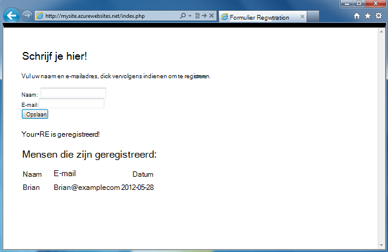
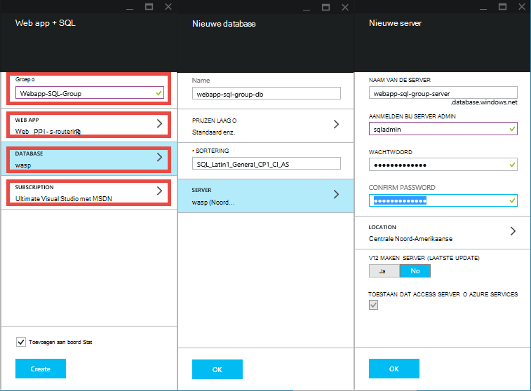
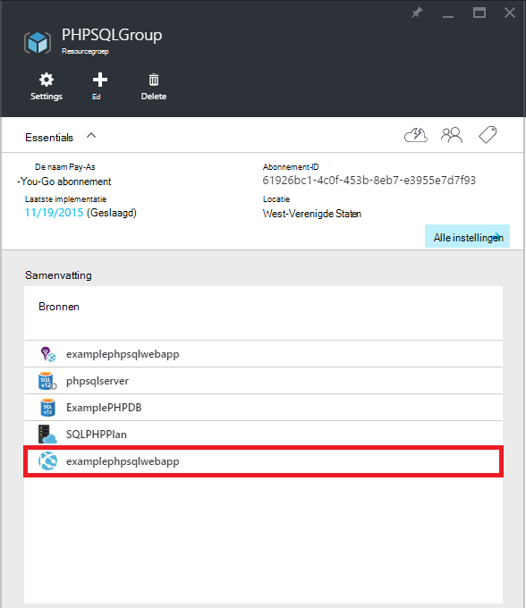
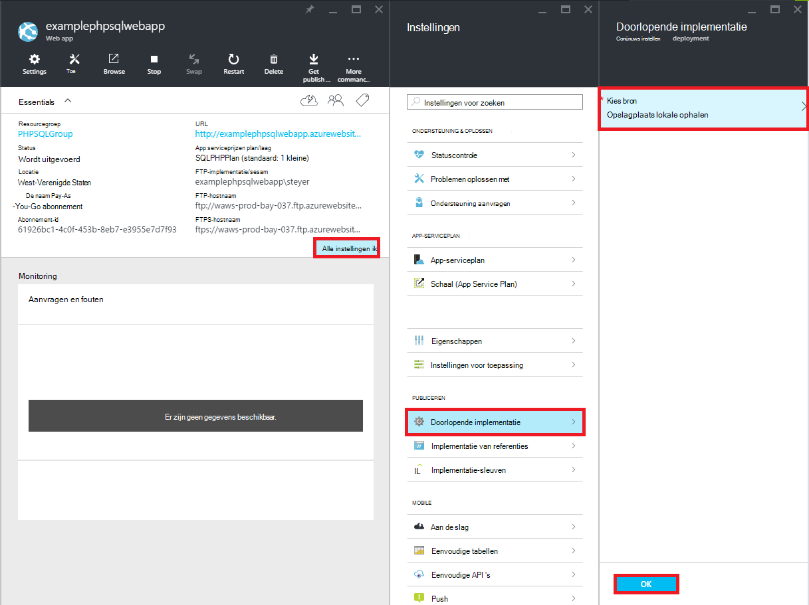
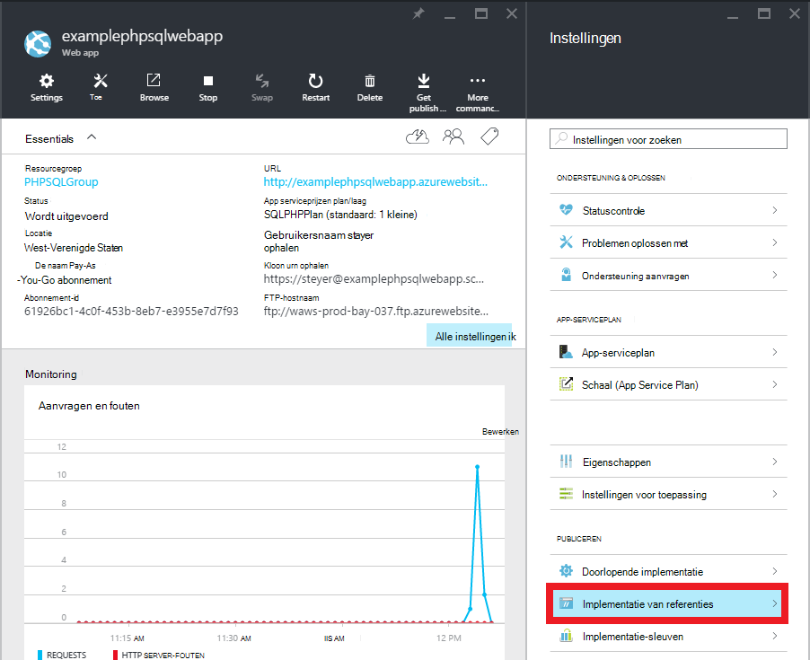
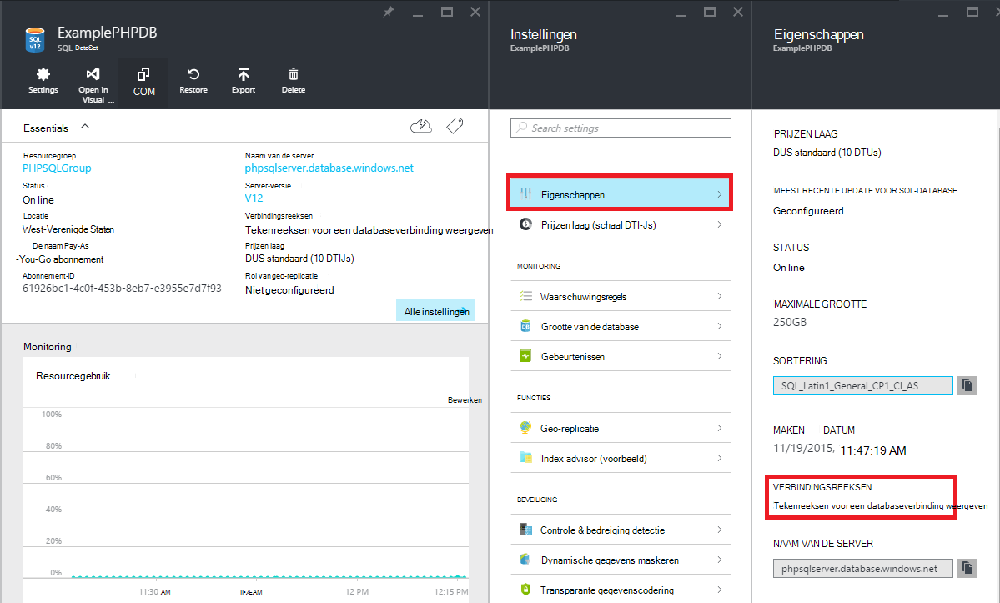

<properties 
    pageTitle="Een PHP-SQL web app maken en implementeren met Azure App Service via Git" 
    description="Een zelfstudie waarin wordt gedemonstreerd hoe een PHP web app waarin gegevens worden opgeslagen in Azure SQL-Database maken en gebruiken van Git distributie naar Azure App-Service." 
    services="app-service\web, sql-database" 
    documentationCenter="php" 
    authors="rmcmurray" 
    manager="wpickett" 
    editor=""/>

<tags 
    ms.service="app-service-web" 
    ms.workload="web" 
    ms.tgt_pltfrm="na" 
    ms.devlang="PHP" 
    ms.topic="article" 
    ms.date="08/11/2016" 
    ms.author="robmcm"/>

# Een PHP-SQL web app maken en implementeren met Azure App Service via Git

Deze zelfstudie ziet u hoe een PHP web app in [Azure App-Service](http://go.microsoft.com/fwlink/?LinkId=529714) die is verbonden met Azure SQL-Database maken en implementeren met behulp van Git. In deze zelfstudie wordt ervan uitgegaan dat u beschikt over [PHP][install-php], [SQL Server Express][install-SQLExpress], wordt het [Microsoft-stuurprogramma voor SQL Server voor PHP](http://www.microsoft.com/download/en/details.aspx?id=20098)en [Git] [ install-git] op uw computer geïnstalleerd. Bij de voltooiing van deze handleiding, hebt u een PHP-SQL web app met Azure.

> [AZURE.NOTE]
> U kunt installeren en configureren van PHP, SQL Server Express en de Drivers voor Microsoft SQL Server voor PHP met de [Microsoft Web Platform Installer](http://www.microsoft.com/web/downloads/platform.aspx).

U leert:

* Het maken van een Azure web app en een SQL-Database via de [Portal Azure](http://go.microsoft.com/fwlink/?LinkId=529715). Omdat PHP is standaard ingeschakeld in App Service Web Apps, vereist geen speciale uw PHP-code uit te voeren.
* Het publiceren en Azure met Git de toepassing opnieuw te publiceren.
 
Door deze zelfstudie te volgen, bouwt u een eenvoudig registratie-webtoepassing in PHP. De toepassing zal worden gehost op een Website Azure. Een schermafbeelding van de voltooide toepassing lager is dan:

[AZURE.INCLUDE [create-account-and-websites-note](../../includes/create-account-and-websites-note.md)]

>[AZURE.NOTE] Als u wilt aan de slag met Azure App-Service voordat u aanmelden voor een account met Azure, gaat u naar de [App-Service probeert](http://go.microsoft.com/fwlink/?LinkId=523751), waar u direct een starter tijdelijk web app in de App-Service maken kunt. Geen creditcard vereist; geen verplichtingen.

##Een Azure web app maken en publiceren van Git instellen

Ga als volgt te werk om een Azure web app en een SQL-Database te maken:

1. Log in op de [Azure Portal](https://portal.azure.com/).

2. Open de Azure markt door te klikken op het pictogram **Nieuw** op de bovenkant van het dashboard, links, klik op **Alles selecteren** naast Marketplace en **Web + Mobile**selecteren.
    
3. Selecteer in de markt, **Web + Mobile**.

4. Klik op het pictogram **Web app + SQL** .

5. Selecteer na het lezen van de beschrijving van de Web app + SQL app **maken**.

6. Klik op elk deel ( **Web App****Resourcegroep** **Database**en **abonnement**) en typ of Selecteer de waarden voor de vereiste velden:
    
    - Voer een URL-naam van uw keuze   
    - Referenties voor de database configureren
    - Selecteer de regio die het dichtst bij u

    

7. Klik op **maken**als u klaar bent voor het definiëren van de web app.

    Wanneer de web app is gemaakt, wordt de knop **meldingen** flash een groene **SUCCES** en de resource groep blade openen om zowel het web app en de SQL-database weergeven in de groep.

4. Klik op de web-app-pictogram in de blade resource-groep voor het openen van de web-app blade.

    

5. In de **Instellingen** klikt u op **doorlopend implementatie** > **configureren instellingen vereist**. **Lokale Git Repository** en klik op **OK**.

    

    Als u niet een Git repository voordat hebt ingesteld, moet u een gebruikersnaam en wachtwoord opgeven. Hiertoe klikt u op **Instellingen** > **implementatie referenties** in de web-app blade.

    

6. Klik in het op **Instellingen** van **Eigenschappen** voor een overzicht van de Git externe URL die u gebruiken wilt voor de implementatie van uw app PHP later.

##SQL-Database-verbindingsgegevens ophalen

Verbinding maken met het exemplaar van SQL-Database die is gekoppeld aan uw web app, het zal de verbindingsgegevens die u hebt opgegeven tijdens het maken van de database nodig. Als u de verbindingsgegevens voor de SQL-Database, als volgt te werk:

1. Terug in de resourcegroep blade, klikt u op het pictogram van de SQL-database.

2. Klik op **Instellingen**in de SQL-database-blade > **Eigenschappen**, klikt u op **weergeven van tekenreeksen voor een databaseverbinding**. 

    
    
3. Van de **PHP** -sectie van het dialoogvenster wordt geopend, noteer de waarden voor `Server`, `SQL Database`, en `User Name`. U gebruikt deze waarden later bij het publiceren van uw PHP web app met Azure App-Service.

##Bouwen en testen van de toepassing lokaal

De aanvraag is een eenvoudig PHP-toepassing waarmee u registreren voor een evenement door middel van uw naam en e-mailadres. Informatie over vorige geregistreerde wordt weergegeven in een tabel. Registratie-informatie wordt opgeslagen in een SQL-Database-instantie. De toepassing bestaat uit twee bestanden (kopiëren en plakken code hieronder):

* **index.php**: een formulier voor registratie en een tabel met informatie over de registrant wordt weergegeven.
* **CreateTable.php**: Hiermee maakt u de SQL-Database-tabel voor de toepassing. Dit bestand wordt slechts eenmaal worden gebruikt.

Als de toepassing lokaal uitvoert, de volgende stappen uit te voeren. Houd er rekening mee dat deze stappen wordt ervan uitgegaan dat u PHP en SQL Server Express ingesteld op uw lokale computer hebt en dat u de [PDO extensie voor SQL Server]hebt ingeschakeld[pdo-sqlsrv].

1. Maken van een SQL Server-database genaamd `registration`. U kunt dit doen vanuit de `sqlcmd` de opdrachtprompt met de volgende opdrachten:

        >sqlcmd -S localhost\sqlexpress -U <local user name> -P <local password>
        1> create database registration
        2> GO   

2. In de hoofdmap van de toepassing maakt twee bestanden erin - een met de naam `createtable.php` en een met de naam `index.php`.

3. Open de `createtable.php` -bestand in een teksteditor of de IDE en voeg de volgende code toe. Deze code wordt gebruikt voor het maken van de `registration_tbl` tabel de `registration` database.

        <?php
        // DB connection info
        $host = "localhost\sqlexpress";
        $user = "user name";
        $pwd = "password";
        $db = "registration";
        try{
            $conn = new PDO( "sqlsrv:Server= $host ; Database = $db ", $user, $pwd);
            $conn->setAttribute( PDO::ATTR_ERRMODE, PDO::ERRMODE_EXCEPTION );
            $sql = "CREATE TABLE registration_tbl(
            id INT NOT NULL IDENTITY(1,1) 
            PRIMARY KEY(id),
            name VARCHAR(30),
            email VARCHAR(30),
            date DATE)";
            $conn->query($sql);
        }
        catch(Exception $e){
            die(print_r($e));
        }
        echo "<h3>Table created.</h3>";
        ?>

    U moet de waarden voor <code>$user</code> en <code>$pwd</code> met uw lokale SQL Server-gebruikersnaam en wachtwoord.

4. Typ de volgende opdracht in een terminal in de hoofdmap van de toepassing:

        php -S localhost:8000

4. Open een webbrowser en Ga naar **http://localhost:8000/createtable.php**. Hiermee maakt u de `registration_tbl` tabel in de database.

5. Open het **index.php** bestand in een teksteditor of de IDE en de eenvoudige HTML- en CSS-code voor de pagina (de PHP-code wordt toegevoegd in latere stappen) toe te voegen.

        <html>
        <head>
        <Title>Registration Form</Title>
        
        </head>
        <body>
        <h1>Register here!</h1>
        
Fill in your name and email address, then click <strong>Submit</strong> to register.

        <form method="post" action="index.php" enctype="multipart/form-data" >
              Name  <input type="text" name="name" id="name"/> 
              Email <input type="text" name="email" id="email"/> 
              <input type="submit" name="submit" value="Submit" />
        </form>
        <?php

        ?>
        </body>
        </html>

6. Toevoegen van PHP-code, PHP-code voor de verbinding met de database.

        // DB connection info
        $host = "localhost\sqlexpress";
        $user = "user name";
        $pwd = "password";
        $db = "registration";
        // Connect to database.
        try {
            $conn = new PDO( "sqlsrv:Server= $host ; Database = $db ", $user, $pwd);
            $conn->setAttribute( PDO::ATTR_ERRMODE, PDO::ERRMODE_EXCEPTION );
        }
        catch(Exception $e){
            die(var_dump($e));
        }

    Nogmaals, moet u de waarden voor <code>$user</code> en <code>$pwd</code> met uw lokale MySQL gebruikersnaam en wachtwoord.

7. Voeg na de database verbinding code, code voor het invoegen van registratie-informatie in de database.

        if(!empty($_POST)) {
        try {
            $name = $_POST['name'];
            $email = $_POST['email'];
            $date = date("Y-m-d");
            // Insert data
            $sql_insert = "INSERT INTO registration_tbl (name, email, date) 
                           VALUES (?,?,?)";
            $stmt = $conn->prepare($sql_insert);
            $stmt->bindValue(1, $name);
            $stmt->bindValue(2, $email);
            $stmt->bindValue(3, $date);
            $stmt->execute();
        }
        catch(Exception $e) {
            die(var_dump($e));
        }
        echo "<h3>Your're registered!</h3>";
        }

8. Ten slotte, na de code, code voor het ophalen van gegevens uit de database toevoegen.

        $sql_select = "SELECT * FROM registration_tbl";
        $stmt = $conn->query($sql_select);
        $registrants = $stmt->fetchAll(); 
        if(count($registrants) > 0) {
            echo "<h2>People who are registered:</h2>";
            echo "<table>";
            echo "<tr><th>Name</th>";
            echo "<th>Email</th>";
            echo "<th>Date</th></tr>";
            foreach($registrants as $registrant) {
                echo "<tr><td>".$registrant['name']."</td>";
                echo "<td>".$registrant['email']."</td>";
                echo "<td>".$registrant['date']."</td></tr>";
            }
            echo "</table>";
        } else {
            echo "<h3>No one is currently registered.</h3>";
        }

U kunt nu bladeren naar **http://localhost:8000/index.php** om de toepassing te testen.

##Publiceer de toepassing

Nadat u uw toepassing lokaal hebt getest, kunt u deze publiceren naar App Service Web Apps met behulp van Git. U moet eerst de verbindingsgegevens voor de database in de toepassing bijwerken. Met behulp van u verkregen informatie voor de databaseverbinding eerder (in de sectie **gegevens van SQL-Database ophalen** ), werken de volgende informatie in **zowel** de `createdatabase.php` en `index.php` bestanden met de juiste waarden:

    // DB connection info
    $host = "tcp:<value of Server>";
    $user = "<value of User Name>";
    $pwd = "<your password>";
    $db = "<value of SQL Database>";

> [AZURE.NOTE]
> In de <code>$host</code>, de waarde van de Server moet worden voorafgegaan door <code>tcp:</code>.

U bent nu gereed Git publicatie instellen en publiceer de toepassing.

> [AZURE.NOTE]
> Dit zijn de stappen aan het einde van de sectie **een Azure web app maken en publiceren van Git instellen** hierboven vermeld.

1. Open GitBash (of een terminal als Git in de `PATH`), mappen naar de hoofdmap van de toepassing (de map **registratie** ) wijzigen en voer de volgende opdrachten:

        git init
        git add .
        git commit -m "initial commit"
        git remote add azure [URL for remote repository]
        git push azure master

    U wordt gevraagd het wachtwoord dat u eerder hebt gemaakt.

2. Ga naar **http://[web app name].azurewebsites.net/createtable.php** voor het maken van de SQL-database-tabel voor de toepassing.
3. Ga naar **http://[web app name].azurewebsites.net/index.php** om te beginnen met de toepassing.

Nadat u de toepassing hebt gepubliceerd, kunt u beginnen met het aanbrengen van wijzigingen in deze en Git met publiceren. 

##Wijzigingen publiceren voor uw toepassing

Om wijzigingen te publiceren naar de toepassing, de volgende stappen uit:

1. Wijzigingen aanbrengen in uw toepassing lokaal.
2. Open GitBash (of een terminal, it Git is in uw `PATH`), wijzigt u mappen in de hoofdmap van de toepassing en voer de volgende opdrachten:

        git add .
        git commit -m "comment describing changes"
        git push azure master

    U wordt gevraagd het wachtwoord dat u eerder hebt gemaakt.

3. Ga naar **http://[web app name].azurewebsites.net/index.php** om uw wijzigingen te bekijken.

## Wat er veranderd
* Zie voor een handleiding voor het wijzigen van Websites met App-Service: [Azure App Service en de Impact op de bestaande Azure Services](http://go.microsoft.com/fwlink/?LinkId=529714)

[install-php]: http://www.php.net/manual/en/install.php
[install-SQLExpress]: http://www.microsoft.com/download/details.aspx?id=29062
[install-Drivers]: http://www.microsoft.com/download/details.aspx?id=20098
[install-git]: http://git-scm.com/
[pdo-sqlsrv]: http://php.net/pdo_sqlsrv
 
