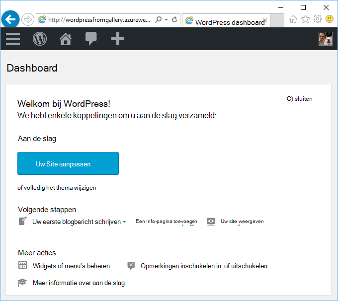
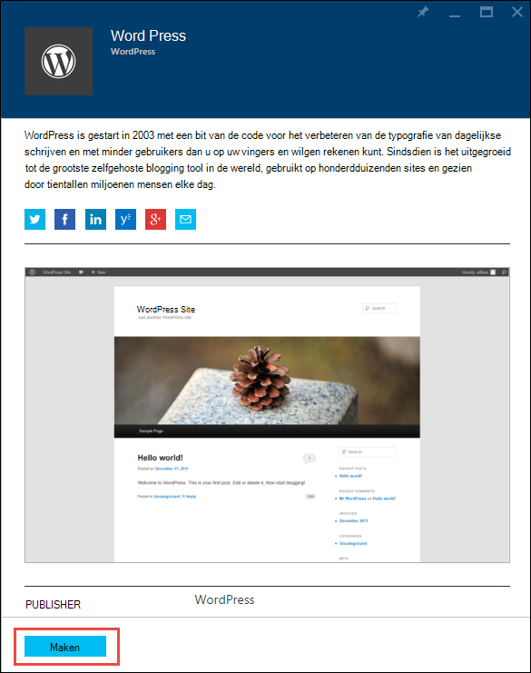
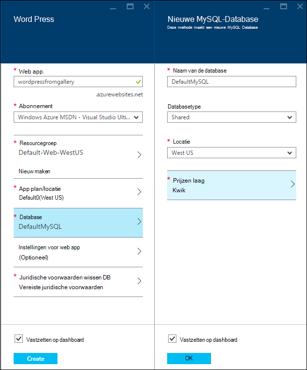
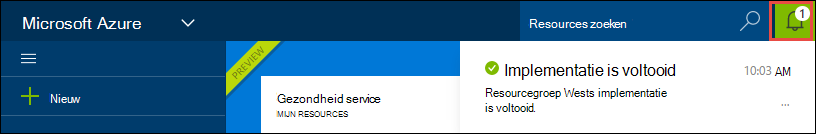
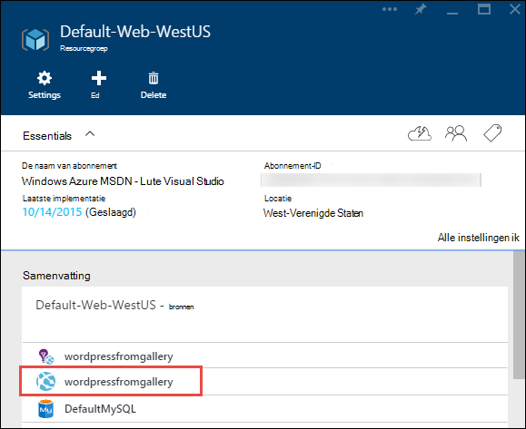
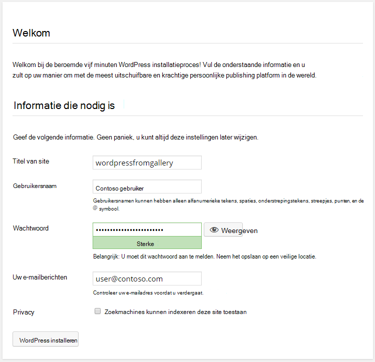

<properties
    pageTitle="Het maken van een WordPress web app in Azure App Service | Microsoft Azure"
    description="Informatie over het maken van een nieuwe Azure web app voor een WordPress blog met behulp van de Portal Azure."
    services="app-service\web"
    documentationCenter="php"
    authors="rmcmurray"
    manager="wpickett"
    editor=""/>

<tags
    ms.service="app-service-web"
    ms.workload="na"
    ms.tgt_pltfrm="na"
    ms.devlang="PHP"
    ms.topic="hero-article"
    ms.date="08/11/2016"
    ms.author="robmcm"/>

# Het maken van een WordPress web app in Azure App-Service

[AZURE.INCLUDE [tabs](../../includes/app-service-web-get-started-nav-tabs.md)]

Deze zelfstudie laat zien hoe een WordPress blogsite van Azure Marketplace te implementeren.

Wanneer u met de zelfstudie bent klaar hebt u uw eigen WordPress blogsite up en uitgevoerd in de cloud.

U leert:

* Het zoeken naar een sjabloon in de markt Azure.
* Het maken van een web app in Azure App-Service die is gebaseerd op de sjabloon.
* Het Azure App Service-instellingen configureren voor de nieuwe web app en de database.

De markt Azure beschikbaar voor tal van populaire web apps ontwikkeld door Microsoft, andere bedrijven en initiatieven van open source software. De web-apps zijn gebaseerd op een breed scala van populaire frameworks, zoals [PHP](/develop/nodejs/) in deze WordPress bijvoorbeeld [.NET](/develop/net/), [Node.js](/develop/nodejs/), [Java](/develop/java/)en [Python](/develop/python/), om een paar te noemen. Is de browser die u voor de [Azure Portal gebruikt](https://portal.azure.com/)maken van een web app van Azure Marketplace alleen software die u nodig hebt. 

De WordPress-site die u in deze zelfstudie implementeert gebruikt MySQL voor de database. Als u gebruiken voor de database SQL-Database wilt, Zie [Nami Project](http://projectnami.org/). **Nami Project** is ook beschikbaar via de markt.

> [AZURE.NOTE]
> Als u deze zelfstudie hebt voltooid, moet u een account van Microsoft Azure. Als u geen account hebt, kunt u [uw voordelen van Visual Studio abonnee te activeren](/pricing/member-offers/msdn-benefits-details/?WT.mc_id=A261C142F) of [Aanmelden voor een gratis proefversie](/en-us/pricing/free-trial/?WT.mc_id=A261C142F).
>
> Als u aan de slag met Azure App-Service wilt voordat u zich voor een account met Azure aanmeldt, gaat u naar de [App-Service probeert](http://go.microsoft.com/fwlink/?LinkId=523751). Daar kunt u onmiddellijk maken een tijdelijk starter web app in de App-Service — geen creditcard vereist en geen verplichtingen.

## Selecteer WordPress en voor Azure App-Service configureren

1. Log in op de [Azure Portal](https://portal.azure.com/).

2. Klik op **Nieuw**.
    
    ![Nieuw maken][5]
    
3. Zoeken naar **WordPress**en klik vervolgens op **WordPress**. Als u wilt SQL-Database gebruiken in plaats van MySQL **Project Nami**zoeken.

    ![WordPress uit lijst][7]
    
5. Na het lezen van de beschrijving van de WordPress app, klikt u op **maken**.

    

4. Voer een naam voor het web app in het **Web app** .

    Deze naam moet uniek zijn in het domein azurewebsites.net omdat de URL van de web app {naam}. azurewebsites.net. Als de naam die u invoert niet uniek is, wordt een rood uitroepteken weergegeven in het tekstvak.

8. Als u meer dan één abonnement hebt, kiest u de gewenste. 

5. Een **Resourcegroep** selecteren of een nieuwe maken.

    Zie voor meer informatie over resourcegroepen [Azure Resource Manager-overzicht](../azure-resource-manager/resource-group-overview.md).

5. Een **App plan/locatie** selecteren of een nieuwe maken.

    Zie voor meer informatie over App serviceplannen [Azure App Service plannen-overzicht](../azure-web-sites-web-hosting-plans-in-depth-overview.md) 

7. Klik op **Database**en in de **Nieuwe MySQL Database** blade geeft de vereiste waarden voor het configureren van de MySQL-database.

    een. Voer een nieuwe naam of laat de standaardnaam.

    b. Laat het **Type Database** ingesteld op **gedeeld**.

    c. Kies de locatie van een door die u voor het web app gekozen.

    d. Kies een prijzen laag. Kwik (gratis met de minimale toegestane verbindingen en ruimte op de schijf) is geen probleem voor deze zelfstudie.

8. Klik op **OK**in het blad **Nieuwe MySQL-Database** . 

8. In de blade **WordPress** akkoord met de juridische voorwaarden en klik vervolgens op **maken**. 

    

    Azure App-Service maakt normaal gesproken de web-app in minder dan een minuut. U kunt de voortgang bekijken door te klikken op de bell-pictogram aan de bovenkant van de portal-pagina.

    

## Opzetten en beheren van uw WordPress web app
    
7. Als het web app maken is voltooid, Ga in de Azure-Portal voor de bronnengroep waarin u de toepassing hebt gemaakt en u ziet de web app en de database.

    De extra bron met het gloeilampje is [Inzichten van toepassing](/services/application-insights/), dat monitoring diensten voor uw web app.

1. Klik in de blade **resourcegroep** op de regel web app.

    

2. Klik op **Bladeren**in het Web app-blade.

    ![URL van de site][browse]

3. Op de pagina **Welkom** WordPress, voert u de configuratiegegevens die zijn vereist voor WordPress en klik vervolgens op **WordPress installeren**.

    

4. Meld u aan met de referenties die u hebt gemaakt op de pagina **Welkom** .  

5. Hiermee opent u de pagina van de Dashboard-site.    

    

## Volgende stappen

U kunt het maken en implementeren van een PHP web app uit de galerie hebt gezien. Zie de [PHP Developer Center](/develop/php/)voor meer informatie over het gebruik van PHP in Azure.

Zie de koppelingen aan de linkerkant van de pagina (voor windows browser breed) voor meer informatie over het werken met App Service Web Apps of aan de bovenkant van de pagina (voor smalle vensters). 

## Wat er veranderd
* Zie [Azure App Service en de gevolgen voor bestaande Azure Services](http://go.microsoft.com/fwlink/?LinkId=529714)voor een hulplijn naar de wijziging van Websites met App-Service.

[5]: ./media/web-sites-php-web-site-gallery/startmarketplace.png
[7]: ./media/web-sites-php-web-site-gallery/search-web-app.png
[browse]: ./media/web-sites-php-web-site-gallery/browse-web.png
