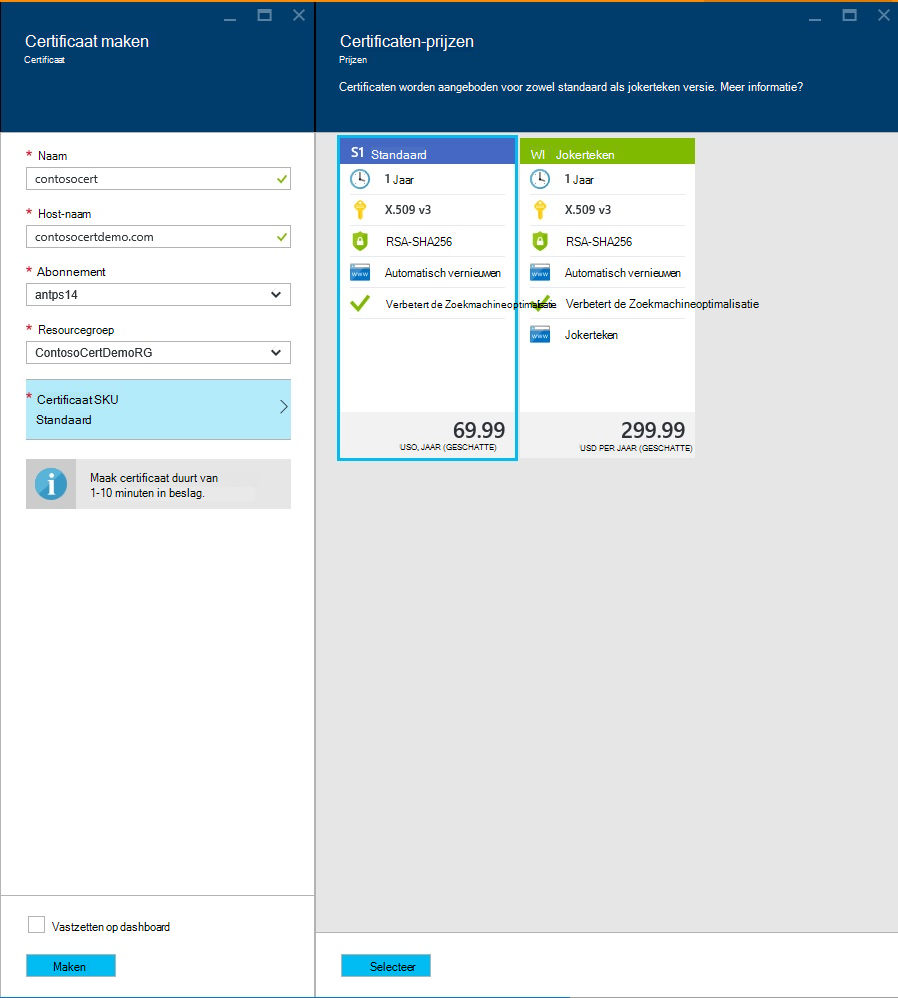

<properties
    pageTitle="Kopen en een SSL-certificaat voor uw Azure App-Service configureren"
    description="Informatie over het kopen en het configureren van een SSL-certificaat voor uw Azure App-Service."
    services="app-service"
    documentationCenter=".net"
    authors="apurvajo"
    manager="stefsch"
    editor="cephalin"
    tags="buy-ssl-certificates"/>

<tags
    ms.service="app-service"
    ms.workload="na"
    ms.tgt_pltfrm="na"
    ms.devlang="na"
    ms.topic="article"
    ms.date="09/19/2016"
    ms.author="apurvajo"/>

#Kopen en een SSL-certificaat voor uw Azure App-Service configureren

> [AZURE.SELECTOR]
- [SSL-cert in Azure kopen](web-sites-purchase-ssl-web-site.md)
- [Gebruik SSL-certificaat van elders](web-sites-configure-ssl-certificate.md)

Standaard **[Azure App-Service](http://go.microsoft.com/fwlink/?LinkId=529714)** al ingeschakeld HTTPS voor uw web app met een wildcard certificaat voor de *. azurewebsites.net domein. Als u niet dat een aangepast domein te configureren wilt, kunt vervolgens u profiteren van het standaard-HTTPS-certificaat. Als u echter alle * [Jokertekendomeinen](https://casecurity.org/2014/02/26/pros-and-cons-of-single-domain-multi-domain-and-wildcard-certificates), het is niet zo veilig als met behulp van een aangepaste domein met uw eigen certificaat. Azure App-Service biedt u nu een heel eenvoudige manier aan te schaffen en een SSL-certificaat van Azure Portal zonder de portal beheren.  
In dit artikel wordt uitgelegd hoe om te kopen en een SSL-certificaat configureren voor uw **[Azure App Service](http://go.microsoft.com/fwlink/?LinkId=529714)** in 3 eenvoudige stappen. 

> [AZURE.NOTE]
> SSL-certificaten voor aangepaste domeinnamen kan niet worden gebruikt met een vrije en gemeenschappelijke web app. Moet u uw web app voor Basic, Standard of Premium modus hoeveel u voor uw abonnement gefactureerd kan worden gewijzigd. Zie **[Web Apps prijzen Details](https://azure.microsoft.com/pricing/details/web-sites/)** voor meer informatie.

##Overzicht
> [AZURE.NOTE]
> Neem niet proberen te kopen van een SSL-certificaat met een abonnement beschikt niet over een actieve Credit Card is gekoppeld. Dit kan resulteren in uw abonnement wordt uitgeschakeld. 

##<a>Kopen, opslaan en toewijzen van een SSL-certificaat voor uw aangepaste domein</a>
Als u HTTPS voor een aangepaste domein, bijvoorbeeld contoso.com, moet u eerst ** [een aangepaste domeinnaam configureren in Azure App Service.](web-sites-custom-domain-name.md)**

Voordat u een SSL-certificaat aanvraagt, moet u eerst bepalen welke domeinnamen worden beveiligd door het certificaat. Dit veld bepaalt welk type certificaat u moet aanvragen. Als u hoeft alleen maar een enkele domeinnaam, bijvoorbeeld contoso.com of www.contoso.com een (eenvoudige) standaard secure is certificaat voldoende. Als u nodig hebt voor het beveiligen van meerdere domeinnamen zoals contoso.com en www.contoso.com mail.contoso.com, vervolgens krijgt u een **- [certificaat met jokertekens](http://en.wikipedia.org/wiki/Wildcard_certificate)**

##Stap 0: Bestelt SSL certificaat

In deze stap leert u hoe u een Order plaatsen voor een SSL-certificaat van uw keuze.

1.  In **[Azure Portal](https://portal.azure.com/)**klikt u op Bladeren en typt u "Certificaten App Service" in de zoekbalk en 'Certificaten App Service' selecteert in het resultaat en klik op toevoegen. 

    

    

2.  Voer **beschrijvende naam** voor uw SSL-certificaat.

3.  Voer de **naam van de Host**
> [AZURE.NOTE]
    Dit is een van de meest kritieke onderdelen van het inkoopproces. Zorg ervoor dat u invoert correct hostnaam (aangepaste domein) die u wilt beveiligen met dit certificaat. De Host-naam met WWW toevoegen **Niet** . Als uw aangepaste domeinnaam www.contoso.com is contoso.com Geef in het veld naam van Host, wordt het betreffende certificaat www en de hoofdmap domeinen beschermen. 
    
4.  Selecteer uw **abonnement**. 

    Als er meerdere abonnementen, Controleer of voor het maken van een SSL-certificaat in het abonnement op die u hebt gebruikt voor uw aangepaste domein of Web App in kwestie.
       
5.  Selecteer of maak een **resourcegroep**.

    Resourcegroepen kunnen u verwante Azure om bronnen te beheren als een eenheid en zijn handig bij het maken van op rollen gebaseerde toegang (RBAC) regels voor uw toepassingen. Zie uw Azure resources beheren voor meer informatie.
     
6.  Selecteer de **SKU-certificaat** 

    Ten slotte selecteert u het certificaat SKU die past bij uw behoefte en klik op maken. Vandaag, kunt Azure App-Service u twee verschillende SKU's • S1 – standaardcertificaat met een geldigheid van 1 jaar en automatische vernieuwing  
           • W1 – jokerteken certificaat met 1 jaar geldig en automatische vernieuwing      
    Zie **[Web Apps prijzen Details](https://azure.microsoft.com/pricing/details/web-sites/)** voor meer informatie.

> [AZURE.NOTE]
> Maken van het SSL-certificaat wordt van 1 tot en met 10 minuten duren. Dit proces uitvoert meerdere stappen op de achtergrond die anders erg lastig handmatig uitvoeren.  

##Stap 1: Het certificaat opslaan in Azure sleutel kluis

In deze stap leert u hoe een winkel een SSL-certificaat dat u hebt aangeschaft om Azure sleutel kluis van uw keuze te plaatsen.

1.  Na de aankoop van het SSL-certificaat is moet u handmatig blade **App Service certificaten** bron openen door te bladeren naar het opnieuw (Zie stap 1 hierboven)   

    

    U ziet dat certificaatstatus **' Issuance in behandeling '** omdat er weinig meer stappen die u voltooien moet voordat u kunt beginnen met deze certificaten.
 
2. Klik op **' certificaat configureren '** in de certificaateigenschappen blade en klik op **"stap 1: Store"** voor dit certificaat in Azure sleutel kluis.

3.  Van Blade **"sleutel kluis Status"** Klik op **' sleutel kluis opslagplaats '** de kluis van een bestaande sleutel voor dit certificaat **of "nieuwe sleutel kluis maken"** voor het maken van nieuwe sleutel kluis binnen dezelfde groep van abonnement en resource kiezen.
 
    
 
    > [AZURE.NOTE]
    Azure sleutel kluis heeft minimale kosten voor het opslaan van dit certificaat. **[Azure sleutel kluis prijzen Details](https://azure.microsoft.com/pricing/details/key-vault/)** bekijken voor meer informatie.

4. Zodra u de sleutel kluis opslagplaats voor dit certificaat in hebt geselecteerd, gaat u vooruit en opslaan door te klikken op de knop **'Opslaan'** boven **' sleutel kluis Status '** blade.  

    Deze moet stap voor het opslaan van het certificaat dat u hebt gekocht met Azure sleutel kluis van uw keuze voltooien. Na het vernieuwen van de bladeserver, ziet u groene controleren tegen deze stap ook markeren.
    
##Stap 2: Controleer of de eigendom van het domein

In deze stap leert u het domein eigenaarcontrole voor een SSL-certificaat dat u alleen een order geplaatst voor uitvoeren. 

1.  Klik op **' stap 2: Controleer of '** stap uit het blad **'Certificaat-configuratie'** . Er zijn 4 soorten domein verificatie ondersteund door certificaten voor App-Service.

    * **App-Service controleren** 
    
        * Dit is de meest geschikte proces als u al **uw aangepaste domein toegewezen aan de Service App Apps.** Met deze methode wordt een lijst van alle App Service toepassingen die aan deze criteria voldoen. 
           Bijvoorbeeld, in dit geval **contosocertdemo.com** is een aangepast domein toegewezen aan App Service App **'ContosoCertDemo'** genoemd en vandaar dat is de enige App Service App hier vermeld. Als er meerdere regio implementatie, zou vervolgens het deze vermelden alle tussen de regio's.
        
           De verificatiemethode is alleen beschikbaar voor Standard (standaard) certificaat aankopen. Voor certificaten met jokerteken, overslaan en verplaatsen naar de optie B, C of D hieronder.
        * Klik op de knop **"Controleren"** om deze stap te voltooien.
        * Klik op **'Refresh'** de status van het certificaat bijwerken nadat de verificatie is voltooid. Het kan enkele minuten duren voordat verificatie te voltooien.
        
             

    * **Domeinverificatie** 

        * Dit is de meest geschikte proces **alleen als** u **[uw aangepaste domein gekocht van Azure App Service.](custom-dns-web-site-buydomains-web-app.md)**
        
        * Klik op de knop **"Controleren"** om deze stap te voltooien.
        
        * Klik op **'Refresh'** de status van het certificaat bijwerken nadat de verificatie is voltooid. Het kan enkele minuten duren voordat verificatie te voltooien.

    * **Controle e-mail**
        
        * Verificatie-e-mailadres is reeds verstuurd naar de e-mailadres(sen) die zijn gekoppeld aan dit domein aangepast.
         
        * Open het e-mailbericht en klik op de bevestigingslink voltooien de stap van bevestiging. 
        
        * Als u de e-mail verificatie opnieuw verzenden klikt u op de knop **' E-mail verzenden '** .
         
    * **Handmatige controle**    
                 
        1. **HTML-webpagina's controleren**
        
            * Maak een HTML-bestand met de naam **{Domein verificatie Token}**.html (u kunt het token van hij domein controle Status Blade kopiëren)
            
            * Inhoud van dit bestand moet de naam van het **Domein verificatie Token**exact dezelfde.
            
            * Uploaden van dit bestand in de hoofdmap van de webserver die als host fungeert voor uw domein.
            
            * Klik op **'Refresh'** de status van het certificaat bijwerken nadat de verificatie is voltooid. Het kan enkele minuten duren voordat verificatie te voltooien.
            
            Bijvoorbeeld, als u een standaardindeling voor certificaten voor contosocertdemo.com met domein verificatie Token **'cAGgQrKc koopt'** vervolgens een webpagina verzoek tot **'http://contosocertdemo.com/cAGgQrKc.html'** weer **cAGgQrKc.**
        2. **Verificatie via DNS TXT-Record**

            * Met uw DNS-beheer, maken een TXT-record voor het subdomein **'DZC'** met een waarde gelijk is aan het **domein verificatie Token.**
            
            * Klik op **'Refresh'** de status van het certificaat bijwerken nadat de verificatie is voltooid. Het kan enkele minuten duren voordat verificatie te voltooien.
                              
            Bijvoorbeeld, om te kunnen uitvoeren van validatie voor een wildcard certificaat met hostnaam ** \*. contosocertdemo.com** of ** \*. subdomain.contosocertdemo.com** en **cAGgQrKc**domein verificatie Token, moet u een TXT-record maken op dzc.contosocertdemo.com met de waarde **cAGgQrKc.**     

##Stap 3: Een certificaat toewijzen aan de Service App App

In deze stap leert u het toewijzen van dit nieuwe certificaat aan uw Service App Apps gekocht. 

> [AZURE.NOTE]
> Voordat u de stappen in deze sectie, moet een aangepaste domeinnaam hebt gekoppeld aan uw toepassing. Voor meer informatie, Zie ** [voor een web app. een aangepaste domeinnaam configureren](web-sites-custom-domain-name.md)**

1.  Open het **in uw browser [Portal Azure.](https://portal.azure.com/)**
2.  Klik op de optie **App Service** aan de linkerkant van de pagina.
3.  Klik op de naam van uw app die u wilt dit certificaat toewijzen. 
4.  Klik in de **Instellingen**op **SSL-certificaten**
5.  Klik op **Certificaat importeren App-Service** en selecteer het certificaat dat u zojuist hebt ingekocht

    

6. In de **serverbindingen voor ssl** -afdeling Klik op **Bindingen toevoegen**
7. Gebruik de vervolgkeuzelijsten te selecteren de naam van het domein te beveiligen met SSL en het certificaat te gebruiken in de blade **SSL-Binding toevoegen** . U kunt ook selecteren of u de **[Server naam aanduiding (SNI)](http://en.wikipedia.org/wiki/Server_Name_Indication)** of IP-gebaseerde SSL.

    

       •    IP based SSL associates a certificate with a domain name by mapping the dedicated public IP address of the server to the domain name. This requires each domain name (contoso.com, fabricam.com, etc.) associated with your service to have a dedicated IP address. This is the traditional          method of associating SSL certificates with a web server.
       •    SNI based SSL is an extension to SSL and **[Transport Layer Security](http://en.wikipedia.org/wiki/Transport_Layer_Security)** (TLS) that allows multiple domains to share the same IP address, with separate security certificates for each domain. Most modern browsers (including Internet Explorer, Chrome, Firefox and Opera) support SNI, however older browsers may not support SNI. For more information on SNI, see the **[Server Name Indication](http://en.wikipedia.org/wiki/Server_Name_Indication)** article on Wikipedia.
       
7. Klik op **Binding toevoegen** om de wijzigingen opslaan en SSL in te schakelen.

Als u **IP-gebaseerde SSL** hebt geselecteerd en uw aangepaste domein is geconfigureerd met een A-record, moet u de volgende extra stappen uitvoeren:

* Na het configureren van een IP-gebaseerde SSL-binding, een specifieke IP-adres is toegewezen aan uw app. Dit IP-adres kunt u vinden op de pagina **aangepaste domein** onder instellingen van uw app, rechts boven de sectie **hostnamen** . Deze wordt weergegeven als het **Externe IP-adres**
    
    

    Houd er rekening mee dat dit IP-adres anders dan het virtuele IP-adres dat eerder is gebruikt is voor het configureren van de A-record voor uw domein. Als u geconfigureerd voor gebruik op basis van SSL SNI of niet zijn geconfigureerd voor gebruik van SSL, geen adres voor deze vermelding wordt weergegeven.
    
2. Met behulp van de hulpprogramma's die door uw domeinregistratieservice naam wijzigen de A-record voor uw aangepaste domeinnaam om te verwijzen naar het IP-adres uit de vorige stap.
Op dit punt moet u kunnen bezoeken uw app met HTTPS:// in plaats van HTTP:// om te controleren of het certificaat juist is geconfigureerd.

##Sleutel en het certificaat te synchroniseren

1. Om veiligheidsredenen, als u ooit uw certificaat vervolgens gewoon sleutel optie **' sleutel en Sync '** uit **"eigenschappen voor certificaat"** Blade. 

2. Klik op de knop **"Sleutel"** om het proces start. Dit proces kan 1-10 minuten in beslag nemen. 

    

3. Sleutels van het certificaat, wordt het certificaat met een nieuw certificaat uitgegeven door de certificeringsinstantie ongedaan.
4. U wordt niet afgeschreven voor de Rekeying voor de levensduur van het certificaat. 
5. Sleutels van het certificaat gaat tot en met de status in behandeling uitgifte. 
6. Moet dat u met dit certificaat om onderbrekingen van de service te voorkomen dat resources synchroniseren zodra het certificaat gereed is.
7. Synchronisatie-optie is niet beschikbaar voor certificaten die nog niet zijn toegewezen aan de Web App. 

## Meer bronnen ##
- [HTTPS voor een app in Azure App-Service inschakelen](web-sites-configure-ssl-certificate.md)
- [Kopen en een aangepaste domeinnaam in Azure App-Service configureren](custom-dns-web-site-buydomains-web-app.md)
- [Microsoft Azure Vertrouwenscentrum](/support/trust-center/security/)
- [Configuratie-opties in Azure websites ontgrendeld](http://azure.microsoft.com/blog/2014/01/28/more-to-explore-configuration-options-unlocked-in-windows-azure-web-sites/)
- [Azure Management Portal](https://manage.windowsazure.com)

>[AZURE.NOTE] Als u wilt aan de slag met Azure App-Service voordat u aanmelden voor een account met Azure, gaat u naar de [App-Service probeert](http://go.microsoft.com/fwlink/?LinkId=523751), waar u direct een starter tijdelijk web app in de App-Service maken kunt. Geen creditcard vereist; geen verplichtingen.

