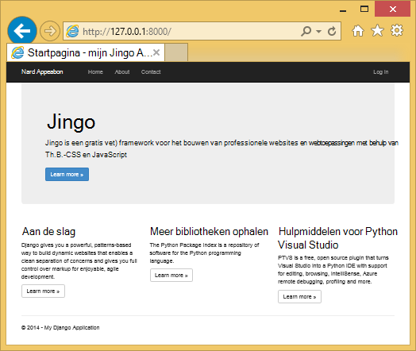

<properties
    pageTitle="Web apps maken met Django in Azure"
    description="Een zelfstudie bevat een inleiding tot het uitvoeren van een Python web app in Azure App Service Web Apps."
    services="app-service\web"
    documentationCenter="python"
    tags="python"
    authors="huguesv" 
    manager="wpickett" 
    editor=""/>

<tags
    ms.service="app-service-web"
    ms.workload="web"
    ms.tgt_pltfrm="na"
    ms.devlang="python"
    ms.topic="hero-article" 
    ms.date="02/19/2016"
    ms.author="huvalo"/>

# Web apps maken met Django in Azure

In deze zelfstudie wordt beschreven hoe aan de slag met [Azure App Service Web Apps](http://go.microsoft.com/fwlink/?LinkId=529714)Python. Web Apps biedt beperkte gratis hosting en snelle implementatie en kunt u Python! Als uw app groeit, kunt u overschakelen naar betaalde hosting en kunt u met alle andere Azure diensten integreren.

Maakt u een toepassing met het Django web framework (Zie alternatieve versies van deze zelfstudie voor [kolf](web-sites-python-create-deploy-flask-app.md) en [fles](web-sites-python-create-deploy-bottle-app.md)). U maakt het web app van Azure Marketplace, Git distributie instellen en klonen lokaal in de bibliotheek. Vervolgens wordt de toepassing lokaal uitvoeren, wijzigingen aanbrengen, doorvoeren en deze push naar Azure. De zelfstudie laat zien hoe dit doen vanuit Windows of Mac/Linux.

[AZURE.INCLUDE [create-account-and-websites-note](../../includes/create-account-and-websites-note.md)]

>[AZURE.NOTE] Als u wilt aan de slag met Azure App-Service voordat u aanmelden voor een account met Azure, gaat u naar de [App-Service probeert](http://go.microsoft.com/fwlink/?LinkId=523751), waar u direct een starter tijdelijk web app in de App-Service maken kunt. Geen creditcard vereist; geen verplichtingen.

## Vereisten

- Windows, Mac of Linux
- Python 2.7 of 3.4
- setuptools, pip, virtualenv (alleen Python 2.7)
- GIT
- [Python-hulpprogramma's voor Visual Studio][] (PTVS) - Let op: dit is optioneel

**Opmerking**: TFS publiceren wordt momenteel niet ondersteund voor Python projecten.

### Windows

Als u nog niet Python 2.7 of 3,4 geïnstalleerd (32-bits), wordt u aangeraden [Azure SDK for Python 2.7] of [Azure SDK for Python 3.4] met Web Platform Installer installeren. Hiermee installeert u de 32-bits versie van Python, setuptools, pip, virtualenv enz (32-bits Python is wat er op de Azure host-computers geïnstalleerd). U kunt ook Python ophalen van [python.org].

Git aangeraden Git voor [Windows] of [GitHub voor Windows]. Als u Visual Studio gebruikt, kunt u de geïntegreerde ondersteuning van Git.

We adviseren u ook te installeren van [Python extra 2.2 voor Visual Studio]. Dit is optioneel, maar als u beschikt over [Visual Studio], met inbegrip van de vrije Visual Studio Community 2013 of Visual Studio Express 2013 voor Web, Hierdoor krijgt u een geweldige Python IDE.

### Mac/Linux

U moet Python en Git al geïnstalleerd, maar hebt u Python 2.7 of 3.4.

## Web App maken op de Portal

De eerste stap bij het maken van uw app is voor het maken van de web-app via de [Portal Azure](https://portal.azure.com).

1. Log in op de Azure-Portal en klik op de knop **Nieuw** in de linkerbenedenhoek.
3. Typ in het zoekvak "python".
4. **Django** (uitgegeven door PTVS) selecteren in de zoekresultaten en klik op **maken**.
5. De nieuwe Django-app, zoals het maken van een nieuwe App Service plan en een nieuwe bronnengroep voor deze configureren. Klik vervolgens op **maken**.
6. Git publiceren voor uw nieuwe web app configureren aan de hand van de instructies op de [Lokale Git distributie naar Azure App-Service](app-service-deploy-local-git.md).

## Overzicht

### GIT repository-inhoud

Hier volgt een overzicht van de bestanden vindt u in de eerste Git repository, die we in de volgende sectie zult klonen.

    \app\__init__.py
    \app\forms.py
    \app\models.py
    \app\tests.py
    \app\views.py
    \app\static\content\
    \app\static\fonts\
    \app\static\scripts\
    \app\templates\about.html
    \app\templates\contact.html
    \app\templates\index.html
    \app\templates\layout.html
    \app\templates\login.html
    \app\templates\loginpartial.html
    \DjangoWebProject\__init__.py
    \DjangoWebProject\settings.py
    \DjangoWebProject\urls.py
    \DjangoWebProject\wsgi.py

Belangrijkste bron voor de toepassing. Bestaat uit 3 pagina's (index over contact) met een master-indeling. Statische inhoud en scripts bevatten bootstrap, jquery, modernizr en reageren.

    \manage.py

Lokaal beheer en ondersteuning van de ontwikkeling. Gebruik deze optie om de toepassing lokaal wordt uitgevoerd, synchroniseert de database, enz.

    \db.sqlite3

Standaard-database. Bevat de benodigde tabellen voor de toepassing uit te voeren, maar bevat geen gebruikers (de database voor het maken van een gebruiker synchroniseren).

    \DjangoWebProject.pyproj
    \DjangoWebProject.sln

Project-bestanden voor gebruik met [Python Tools voor Visual Studio].

    \ptvs_virtualenv_proxy.py

IIS-proxy voor virtuele omgevingen en PTVS ondersteuning voor foutopsporing op afstand.

    \requirements.txt

Externe pakketten die door deze toepassing nodig is. Het implementatiescript pip worden de pakketten die worden vermeld in dit bestand te installeren.

    \web.2.7.config
    \web.3.4.config

IIS-configuratiebestanden. Een script voor de implementatie wordt gebruikt de juiste web.x.y.config en als web.config te kopiëren.

### Optionele bestanden - implementatie aanpassen

[AZURE.INCLUDE [web-sites-python-django-customizing-deployment](../../includes/web-sites-python-django-customizing-deployment.md)]

### Optionele bestanden - Python runtime

[AZURE.INCLUDE [web-sites-python-customizing-runtime](../../includes/web-sites-python-customizing-runtime.md)]

### Aanvullende bestanden op de server

Sommige bestanden op de server aanwezig, maar worden niet toegevoegd aan de git repository. Deze worden gemaakt door een script voor de implementatie.

    \web.config

IIS-configuratiebestand. Gemaakt op basis van de web.x.y.config op elke implementatie.

    \env\

Python virtuele omgeving. Tijdens de implementatie wordt gemaakt als een compatibele virtuele omgeving op het web app nog niet bestaat. Pakketten die worden vermeld in requirements.txt pip geïnstalleerd zijn, maar pip installatie overgeslagen als de pakketten worden geïnstalleerd.

De volgende 3 secties wordt beschreven hoe verder te gaan met de ontwikkeling van de web app onder 3 verschillende omgevingen:

- Windows met Python's voor Visual Studio
- Windows via de opdrachtregel
- Mac/Linux met de opdrachtregel

## Web app ontwikkeling Python - Windows - hulpprogramma's voor Visual Studio

### De opslagplaats klonen

Eerst de bibliotheek met behulp van de URL die u op de Portal Azure klonen. Zie [Lokale Git distributie naar Azure App-Service](app-service-deploy-local-git.md)voor meer informatie.

Open het oplossingsbestand (.sln) die is opgenomen in de hoofdmap van de opslagplaats.

### Virtuele omgeving maken

Nu maken we een virtuele omgeving voor plaatselijke ontwikkeling. Klik met de rechtermuisknop op **Python omgevingen** Selecteer **Toevoegen virtuele omgeving...**.

- Controleer of de naam van het milieu is `env`.

- Selecteer de basis-interpreter. Controleer of u dezelfde versie van Python, die is geselecteerd voor uw web app (in runtime.txt of de bladeserver **Instellingen** van uw web app in de Portal Azure).

- Controleer of de optie voor het downloaden en installeren van pakketten is ingeschakeld.

Klik op **maken**. Dit maakt de virtuele omgeving, en afhankelijkheden die zijn vermeld in de requirements.txt te installeren.

### Een beheerder maken

De database die wordt meegeleverd met de toepassing beschikt niet over een supergebruiker gedefinieerd. De functionaliteit voor aanmelden in de toepassing of de Django admin interface (als u besluit te kunnen) gebruiken, moet u een supergebruiker maakt.

Uitvoeren vanaf de opdrachtregel uit vanuit de projectmap:

    env\scripts\python manage.py createsuperuser

Volg de aanwijzingen voor het instellen van de gebruikersnaam, wachtwoord, enz.

### Uitgevoerd met ontwikkelingsserver

Druk op F5 om foutopsporing starten en uw webbrowser wordt automatisch geopend op de pagina lokaal uitgevoerd.

U kunt onderbrekingspunten instellen in de bronnen, gebruikt u windows controle, enz. Zie de [Python Tools voor Visual Studio-documentatie] voor meer informatie over de diverse functies.

### Wijzigingen aanbrengen

U kunt nu experimenteren met het aanbrengen van wijzigingen in de toepassingsbronnen en/of sjablonen.

Nadat u uw wijzigingen hebt getest, ze hebt toegewezen aan de Git repository:

### Meer pakketten installeren

Uw toepassing mogelijk afhankelijkheden dan Python en Django.

U kunt extra pakketten met pip installeren. Een pakket installeren, klik met de rechtermuisknop op de virtuele omgeving en selecteer **Python pakket installeren**.

Voer bijvoorbeeld de Azure SDK installeren voor Python, waarmee u toegang krijgt tot Azure opslag, service bus en andere Azure diensten, `azure`:

Klik met de rechtermuisknop op de virtuele omgeving en selecteer **Generate requirements.txt** requirements.txt bijwerken.

Vervolgens wijzigingen van de requirements.txt aan het Git repository.

### Implementeren op Azure

Om de implementatie van een trigger, klik op **Sync** of **Push**. Sync biedt zowel een push- en een pull.

De eerste implementatie zal enige tijd duren, zoals het maakt een virtuele omgeving, pakketten installeren, enz.

Visual Studio, de voortgang van de installatie wordt niet weergegeven. Als u dat wilt de uitvoer, Zie de sectie over [Probleemoplossing - implementatie](#troubleshooting-deployment).

Ga naar de URL Azure om uw wijzigingen te bekijken.

## Web app ontwikkeling - Windows - opdrachtregel

### De opslagplaats klonen

Eerst de bibliotheek met behulp van de URL die u op de Portal Azure klonen en de Azure opslagplaats toevoegen als een externe. Zie [Lokale Git distributie naar Azure App-Service](app-service-deploy-local-git.md)voor meer informatie.

    git clone <repo-url>
    cd <repo-folder>
    git remote add azure <repo-url>

### Virtuele omgeving maken

Maken we een nieuwe virtuele omgeving voor ontwikkelingsdoeleinden (kan niet worden toegevoegd aan de bibliotheek). Virtuele omgevingen in Python zijn niet ook nergens anders, zodat iedere ontwikkelaar aan de toepassing werkt hun eigen lokaal maken zal.

Controleer of u dezelfde versie van Python, die is geselecteerd voor uw web app (in runtime.txt of de bladeserver instellingen van uw web app in de Portal Azure).

Voor Python 2.7:

    c:\python27\python.exe -m virtualenv env

Voor Python 3.4:

    c:\python34\python.exe -m venv env

Alle externe pakketten vereist door de toepassing installeren. U kunt het bestand requirements.txt in de hoofdmap van de opslagplaats de pakketten te installeren in uw virtuele omgeving:

    env\scripts\pip install -r requirements.txt

### Een beheerder maken

De database die wordt meegeleverd met de toepassing beschikt niet over een supergebruiker gedefinieerd. De functionaliteit voor aanmelden in de toepassing of de Django admin interface (als u besluit te kunnen) gebruiken, moet u een supergebruiker maakt.

Uitvoeren vanaf de opdrachtregel uit vanuit de projectmap:

    env\scripts\python manage.py createsuperuser

Volg de aanwijzingen voor het instellen van de gebruikersnaam, wachtwoord, enz.

### Uitgevoerd met ontwikkelingsserver

U kunt de toepassing onder een ontwikkelingsserver met de volgende opdracht starten:

    env\scripts\python manage.py runserver

De URL wordt weergegeven door de console en de server poort luistert naar:

Open vervolgens uw webbrowser naar deze URL.

### Wijzigingen aanbrengen

U kunt nu experimenteren met het aanbrengen van wijzigingen in de toepassingsbronnen en/of sjablonen.

Nadat u uw wijzigingen hebt getest, ze hebt toegewezen aan de Git repository:

    git add <modified-file>
    git commit -m "<commit-comment>"

### Meer pakketten installeren

Uw toepassing mogelijk afhankelijkheden dan Python en Django.

U kunt extra pakketten met pip installeren. Bijvoorbeeld, als u wilt de Azure SDK installeren voor Python, waarmee u toegang krijgt tot Azure opslag, service bus en andere Azure diensten, typt u:

    env\scripts\pip install azure

Zorg ervoor dat requirements.txt:

    env\scripts\pip freeze > requirements.txt

Wijzigingen:

    git add requirements.txt
    git commit -m "Added azure package"

### Implementeren op Azure

Als u wilt activeren in een implementatie, push-de wijzigingen naar Azure:

    git push azure master

Ziet u de uitvoer van het script voor implementatie, met inbegrip van de virtuele omgeving maken, installatie van pakketten, het maken van web.config.

Ga naar de URL Azure om uw wijzigingen te bekijken.

## Web app ontwikkeling - Mac/Linux - opdrachtregel

### De opslagplaats klonen

Eerst de bibliotheek met behulp van de URL die u op de Portal Azure klonen en de Azure opslagplaats toevoegen als een externe. Zie [Lokale Git distributie naar Azure App-Service](app-service-deploy-local-git.md)voor meer informatie.

    git clone <repo-url>
    cd <repo-folder>
    git remote add azure <repo-url>

### Virtuele omgeving maken

Maken we een nieuwe virtuele omgeving voor ontwikkelingsdoeleinden (kan niet worden toegevoegd aan de bibliotheek). Virtuele omgevingen in Python zijn niet ook nergens anders, zodat iedere ontwikkelaar aan de toepassing werkt hun eigen lokaal maken zal.

Controleer of u dezelfde versie van Python, die is geselecteerd voor uw web app (in runtime.txt of de bladeserver instellingen van uw web app in de Portal Azure).

Voor Python 2.7:

    python -m virtualenv env

Voor Python 3.4:

    python -m venv env

of

    pyvenv env

Alle externe pakketten vereist door de toepassing installeren. U kunt het bestand requirements.txt in de hoofdmap van de opslagplaats de pakketten te installeren in uw virtuele omgeving:

    env/bin/pip install -r requirements.txt

### Een beheerder maken

De database die wordt meegeleverd met de toepassing beschikt niet over een supergebruiker gedefinieerd. De functionaliteit voor aanmelden in de toepassing of de Django admin interface (als u besluit te kunnen) gebruiken, moet u een supergebruiker maakt.

Uitvoeren vanaf de opdrachtregel uit vanuit de projectmap:

    env/bin/python manage.py createsuperuser

Volg de aanwijzingen voor het instellen van de gebruikersnaam, wachtwoord, enz.

### Uitgevoerd met ontwikkelingsserver

U kunt de toepassing onder een ontwikkelingsserver met de volgende opdracht starten:

    env/bin/python manage.py runserver

De URL wordt weergegeven door de console en de server poort luistert naar:

Open vervolgens uw webbrowser naar deze URL.

### Wijzigingen aanbrengen

U kunt nu experimenteren met het aanbrengen van wijzigingen in de toepassingsbronnen en/of sjablonen.

Nadat u uw wijzigingen hebt getest, ze hebt toegewezen aan de Git repository:

    git add <modified-file>
    git commit -m "<commit-comment>"

### Meer pakketten installeren

Uw toepassing mogelijk afhankelijkheden dan Python en Django.

U kunt extra pakketten met pip installeren. Bijvoorbeeld, als u wilt de Azure SDK installeren voor Python, waarmee u toegang krijgt tot Azure opslag, service bus en andere Azure diensten, typt u:

    env/bin/pip install azure

Zorg ervoor dat requirements.txt:

    env/bin/pip freeze > requirements.txt

Wijzigingen:

    git add requirements.txt
    git commit -m "Added azure package"

### Implementeren op Azure

Als u wilt activeren in een implementatie, push-de wijzigingen naar Azure:

    git push azure master

Ziet u de uitvoer van het script voor implementatie, met inbegrip van de virtuele omgeving maken, installatie van pakketten, het maken van web.config.

Ga naar de URL Azure om uw wijzigingen te bekijken.

## Het oplossen van problemen - installatie van het pakket

[AZURE.INCLUDE [web-sites-python-troubleshooting-package-installation](../../includes/web-sites-python-troubleshooting-package-installation.md)]

## Het oplossen van problemen - virtuele omgeving

[AZURE.INCLUDE [web-sites-python-troubleshooting-virtual-environment](../../includes/web-sites-python-troubleshooting-virtual-environment.md)]

## Het oplossen van problemen - statische bestanden

Django heeft het concept van het verzamelen van statische bestanden. Dit neemt alle de statische bestanden van de oorspronkelijke locatie en kopieert deze naar één map. Voor deze toepassing, worden ze gekopieerd naar `/static`.

Dit gebeurt omdat statische bestanden afkomstig uit verschillende Django 'apps zijn'. Bijvoorbeeld bevinden de statische bestanden uit de beheerinterface Django zich in een submap van de bibliotheek Django van de virtuele omgeving. Statische bestanden afkomstig van deze toepassing bevinden zich in `/app/static`. Als u meer Django 'apps' gebruikt, hebt u statische bestanden in meerdere plaatsen.

Wanneer de toepassing wordt uitgevoerd in de foutopsporingsmodus, dient de toepassing de statische bestanden van de oorspronkelijke locatie.

Wanneer de toepassing wordt uitgevoerd in de release-modus, de toepassing heeft **geen** statische bestanden dienen. Het is de verantwoordelijkheid van de webserver de bestanden moeten worden verzonden. Voor deze toepassing dient IIS de statische bestanden van `/static`.

De collectie van statische bestanden gebeurt automatisch als onderdeel van een script voor de implementatie, uit te schakelen eerder verzamelde bestanden. Dit betekent dat de collectie vindt plaats op elke implementatie, implementatie, iets langzamer, maar garandeert wel dat verouderde bestanden niet beschikbaar is, een potentieel beveiligingsprobleem te voorkomen.

Als u verzamelen van statische bestanden voor de toepassing van Django overslaan wilt:

    \.skipDjango

Vervolgens moet u de collectie op uw lokale computer handmatig te doen:

    env\scripts\python manage.py collectstatic

Verwijder de `\static` map van `.gitignore` en toevoegen aan de Git repository.

## -Problemen met instellingen oplossen

Verschillende instellingen voor de toepassing kunnen worden gewijzigd in `DjangoWebProject/settings.py`.

Voor het gemak van de ontwikkelaar de foutopsporingsmodus is ingeschakeld. Een leuk neveneffect dat is dat u zult zien van afbeeldingen en andere statische inhoud als lokaal uitgevoerd zonder dat u voor het verzamelen van statische bestanden.

Debug-modus uitschakelen:

    DEBUG = False

Wanneer foutopsporing is uitgeschakeld, de waarde voor `ALLOWED_HOSTS` moet worden bijgewerkt met de hostnaam Azure. Bijvoorbeeld:

    ALLOWED_HOSTS = (
        'pythonapp.azurewebsites.net',
    )

of inschakelen:

    ALLOWED_HOSTS = (
        '*',
    )

Mogelijk wilt u iets moeilijker te behandelen schakelen tussen foutopsporing en release-modus en de hostnaam ophalen in de praktijk.

U kunt omgevingsvariabelen via de Azure portal pagina **configureren** , instellen in de sectie **Toepassingsinstellingen** .  Dit is handig voor het instellen van waarden die u niet wilt weergeven in de bronnen (verbindingsreeksen, wachtwoorden, enzovoort) of wilt u anders instellen tussen Azure en uw lokale computer. In `settings.py`, kunt u de omgevingsvariabelen met query `os.getenv`.

## Met behulp van een Database

De database die is opgenomen in de toepassing is een sqlite database. Dit is een handige en nuttige standaarddatabase te gebruiken voor ontwikkeling, zoals bijna geen installatie vereist. De database is opgeslagen in het bestand db.sqlite3 in de projectmap.

Azure biedt databaseservices die gemakkelijk te gebruiken vanuit een toepassing Django. Zelfstudies voor het gebruik van [SQL-Database] en [MySQL] vanuit een toepassing Django tonen de stappen moet u de databaseservice maken, de database wijzigen in `DjangoWebProject/settings.py`, en de bibliotheken installeren.

Natuurlijk, als u liever uw eigen databaseservers beheren, kunt u doen met behulp van Windows of Linux virtuele machines die worden uitgevoerd op Azure.

## Django Admin Interface

Zodra u begint met het bouwen van uw modellen, zult u de database met gegevens wordt gevuld. Een eenvoudige manier toevoegen en bewerken van inhoud interactief is met de beheerinterface van Django.

De code voor de admin-interface die is toegelicht in de toepassingsbronnen, maar het duidelijk gemarkeerd zodat u kunt eenvoudig inschakelen (zoeken naar 'admin').

Nadat deze ingeschakeld, de database synchroniseren, de toepassing wordt uitgevoerd en Ga naar `/admin`.

## Volgende stappen

Klik op deze koppelingen voor meer informatie over Django en Python's voor Visual Studio:

- [Django-documentatie]
- [Python-hulpprogramma's voor Visual Studio-documentatie]

Voor meer informatie over het gebruik van SQL-Database en MySQL:

- [Django en MySQL op Azure met Python's voor Visual Studio]
- [Django en de SQL-Database op Azure met Python's voor Visual Studio]

Zie de [Python Developer Center](/develop/python/)voor meer informatie.

## Wat er veranderd
* Zie voor een handleiding voor het wijzigen van Websites met App-Service: [Azure App Service en de Impact op de bestaande Azure Services](http://go.microsoft.com/fwlink/?LinkId=529714)

<!--Link references-->
[Django en MySQL op Azure met Python's voor Visual Studio]: web-sites-python-ptvs-django-mysql.md
[Django en de SQL-Database op Azure met Python's voor Visual Studio]: web-sites-python-ptvs-django-sql.md
[SQL-Database]: web-sites-python-ptvs-django-sql.md
[MySQL]: web-sites-python-ptvs-django-mysql.md

<!--External Link references-->
[Azure SDK for Python 2.7]: http://go.microsoft.com/fwlink/?linkid=254281
[Azure SDK for Python 3.4]: http://go.microsoft.com/fwlink/?linkid=516990
[Python.org]: http://www.python.org/
[GIT voor Windows]: http://msysgit.github.io/
[GitHub voor Windows]: https://windows.github.com/
[Python-hulpprogramma's voor Visual Studio]: http://aka.ms/ptvs
[Python Tools 2.2 voor Visual Studio]: http://go.microsoft.com/fwlink/?LinkID=624025
[Visual Studio]: http://www.visualstudio.com/
[Python-hulpprogramma's voor Visual Studio-documentatie]: http://aka.ms/ptvsdocs
[Django-documentatie]: https://www.djangoproject.com/
