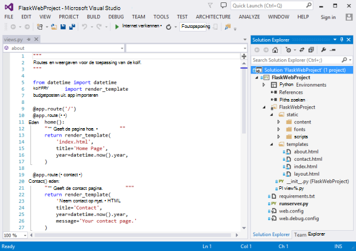
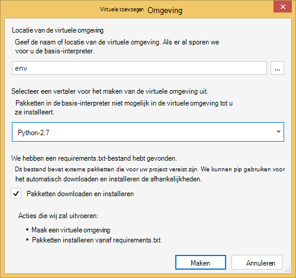
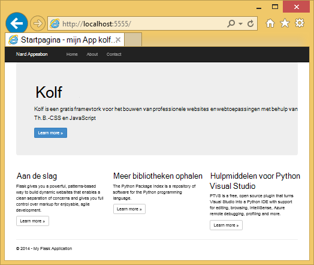
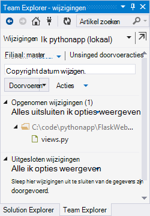
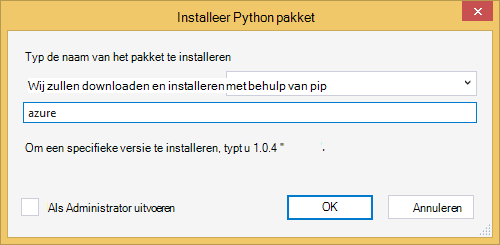
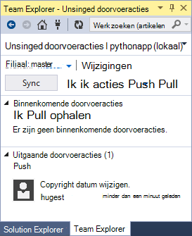
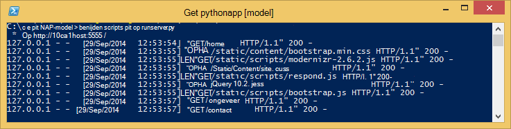
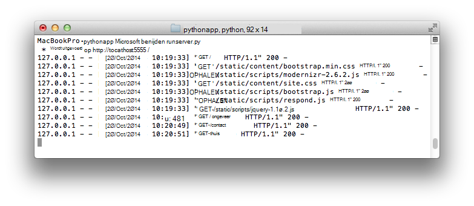
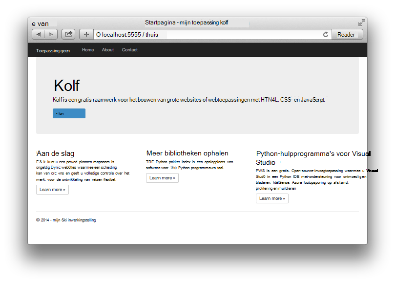

<properties 
    pageTitle="Web apps maken met de kolf in Azure" 
    description="Een zelfstudie bevat een inleiding tot het uitvoeren van een Python web app op Azure." 
    services="app-service\web" 
    documentationCenter="python"
    tags="python"
    authors="huguesv" 
    manager="wpickett" 
    editor=""/>

<tags 
    ms.service="app-service-web" 
    ms.workload="web" 
    ms.tgt_pltfrm="na" 
    ms.devlang="python" 
    ms.topic="article" 
    ms.date="02/20/2016"
    ms.author="huvalo"/>

# Web apps maken met de kolf in Azure

In deze zelfstudie wordt beschreven hoe aan de slag met Python in [Azure App Service Web Apps](http://go.microsoft.com/fwlink/?LinkId=529714).  Web Apps biedt beperkte gratis hosting en snelle implementatie en kunt u Python!  Als uw app groeit, kunt u overschakelen naar betaalde hosting en kunt u met alle andere Azure diensten integreren.

Maakt u een toepassing met behulp van de kolf web framework (Zie alternatieve versies van deze zelfstudie voor [Django](web-sites-python-create-deploy-django-app.md) en [fles](web-sites-python-create-deploy-bottle-app.md)).  U maakt de website uit de galerie met Azure, Git distributie instellen en klonen lokaal in de bibliotheek.  Vervolgens wordt de toepassing lokaal uitvoeren, wijzigingen aanbrengen, doorvoeren en deze push naar Azure.  De zelfstudie laat zien hoe dit doen vanuit Windows of Mac/Linux.

[AZURE.INCLUDE [create-account-and-websites-note](../../includes/create-account-and-websites-note.md)]

>[AZURE.NOTE] Als u wilt aan de slag met Azure App-Service voordat u aanmelden voor een account met Azure, gaat u naar de [App-Service probeert](http://go.microsoft.com/fwlink/?LinkId=523751), waar u direct een starter tijdelijk web app in de App-Service maken kunt. Geen creditcard vereist; geen verplichtingen.

## Vereisten

- Windows, Mac of Linux
- Python 2.7 of 3.4
- setuptools, pip, virtualenv (alleen Python 2.7)
- GIT
- [Python-hulpprogramma's voor Visual Studio][] (PTVS) - Let op: dit is optioneel

**Opmerking**: TFS publiceren wordt momenteel niet ondersteund voor Python projecten.

### Windows

Als u nog niet Python 2.7 of 3,4 geïnstalleerd (32-bits), wordt u aangeraden [Azure SDK for Python 2.7] of [Azure SDK for Python 3.4] met Web Platform Installer installeren.  Hiermee installeert u de 32-bits versie van Python, setuptools, pip, virtualenv enz (32-bits Python is wat er op de Azure host-computers geïnstalleerd).  U kunt ook Python ophalen van [python.org].

Git aangeraden Git voor [Windows] of [GitHub voor Windows].  Als u Visual Studio gebruikt, kunt u de geïntegreerde ondersteuning van Git.

We adviseren u ook te installeren van [Python extra 2.2 voor Visual Studio].  Dit is optioneel, maar als u beschikt over [Visual Studio], met inbegrip van de vrije Visual Studio Community 2013 of Visual Studio Express 2013 voor Web, Hierdoor krijgt u een geweldige Python IDE.

### Mac/Linux

U moet Python en Git al geïnstalleerd, maar hebt u Python 2.7 of 3.4.

## Web app maken op de Azure-Portal

De eerste stap bij het maken van uw app is voor het maken van de web-app via de [Portal Azure](https://portal.azure.com). 

1. Log in op de Azure-Portal en klik op de knop **Nieuw** in de linkerbenedenhoek. 
2. Klik op **Web + Mobile**.
3. Typ in het zoekvak "python".
4. **Kolf**selecteren in de zoekresultaten en klik op **maken**.
5. De nieuwe kolf app, zoals het maken van een nieuwe App Service plan en een nieuwe bronnengroep voor deze configureren. Klik vervolgens op **maken**.
6. Git publiceren voor uw nieuwe web app configureren aan de hand van de instructies op de [Lokale Git distributie naar Azure App-Service](app-service-deploy-local-git.md).

## Overzicht

### GIT repository-inhoud

Hier volgt een overzicht van de bestanden vindt u in de eerste Git repository, die we in de volgende sectie zult klonen.

    \FlaskWebProject\__init__.py
    \FlaskWebProject\views.py
    \FlaskWebProject\static\content\
    \FlaskWebProject\static\fonts\
    \FlaskWebProject\static\scripts\
    \FlaskWebProject\templates\about.html
    \FlaskWebProject\templates\contact.html
    \FlaskWebProject\templates\index.html
    \FlaskWebProject\templates\layout.html

Belangrijkste bron voor de toepassing.  Bestaat uit 3 pagina's (index over contact) met een master-indeling.  Statische inhoud en scripts bevatten bootstrap, jquery, modernizr en reageren.

    \runserver.py

Serverondersteuning voor plaatselijke ontwikkeling. Gebruik deze optie als u de toepassing lokaal uitvoeren.

    \FlaskWebProject.pyproj
    \FlaskWebProject.sln

Project-bestanden voor gebruik met [Python Tools voor Visual Studio].

    \ptvs_virtualenv_proxy.py

IIS-proxy voor virtuele omgevingen en PTVS ondersteuning voor foutopsporing op afstand.

    \requirements.txt

Externe pakketten die door deze toepassing nodig is. Het implementatiescript pip worden de pakketten die worden vermeld in dit bestand te installeren.
 
    \web.2.7.config
    \web.3.4.config

IIS-configuratiebestanden.  Een script voor de implementatie wordt gebruikt de juiste web.x.y.config en als web.config te kopiëren.

### Optionele bestanden - implementatie aanpassen

[AZURE.INCLUDE [web-sites-python-customizing-deployment](../../includes/web-sites-python-customizing-deployment.md)]

### Optionele bestanden - Python runtime

[AZURE.INCLUDE [web-sites-python-customizing-runtime](../../includes/web-sites-python-customizing-runtime.md)]

### Aanvullende bestanden op de server

Sommige bestanden op de server aanwezig, maar worden niet toegevoegd aan de git repository.  Deze worden gemaakt door een script voor de implementatie.

    \web.config

IIS-configuratiebestand.  Gemaakt op basis van de web.x.y.config op elke implementatie.

    \env\

Python virtuele omgeving.  Tijdens de implementatie wordt gemaakt als een compatibele virtuele omgeving op de app nog niet bestaat.  Pakketten die worden vermeld in requirements.txt pip geïnstalleerd zijn, maar pip installatie overgeslagen als de pakketten worden geïnstalleerd.

De volgende 3 secties wordt beschreven hoe verder te gaan met de ontwikkeling van de web app onder 3 verschillende omgevingen:

- Windows met Python's voor Visual Studio
- Windows via de opdrachtregel
- Mac/Linux met de opdrachtregel

## Web app ontwikkeling Python - Windows - hulpprogramma's voor Visual Studio

### De opslagplaats klonen

Eerst de bibliotheek met behulp van de URL die u op de Portal Azure klonen. Zie [Lokale Git distributie naar Azure App-Service](app-service-deploy-local-git.md)voor meer informatie.

Open het oplossingsbestand (.sln) die is opgenomen in de hoofdmap van de opslagplaats.

### Virtuele omgeving maken

Nu maken we een virtuele omgeving voor plaatselijke ontwikkeling.  Klik met de rechtermuisknop op **Python omgevingen** Selecteer **Toevoegen virtuele omgeving...**.

- Controleer of de naam van het milieu is `env`.

- Selecteer de basis-interpreter.  Controleer of u dezelfde versie van Python, die is geselecteerd voor uw web app (in runtime.txt of de bladeserver **Instellingen** van uw web app in de Portal Azure).

- Controleer of de optie voor het downloaden en installeren van pakketten is ingeschakeld.

Klik op **maken**.  Dit maakt de virtuele omgeving, en afhankelijkheden die zijn vermeld in de requirements.txt te installeren.

### Uitgevoerd met ontwikkelingsserver

Druk op F5 om foutopsporing starten en uw webbrowser wordt automatisch geopend op de pagina lokaal uitgevoerd.

U kunt onderbrekingspunten instellen in de bronnen, gebruikt u windows controle, enz.  Zie de [Python Tools voor Visual Studio-documentatie] voor meer informatie over de diverse functies.

### Wijzigingen aanbrengen

U kunt nu experimenteren met het aanbrengen van wijzigingen in de toepassingsbronnen en/of sjablonen.

Nadat u uw wijzigingen hebt getest, ze hebt toegewezen aan de Git repository:

### Meer pakketten installeren

Uw toepassing mogelijk afhankelijkheden dan Python en kolf.

U kunt extra pakketten met pip installeren.  Een pakket installeren, klik met de rechtermuisknop op de virtuele omgeving en selecteer **Python pakket installeren**.

Voer bijvoorbeeld de Azure SDK installeren voor Python, waarmee u toegang krijgt tot Azure opslag, service bus en andere Azure diensten, `azure`:

Klik met de rechtermuisknop op de virtuele omgeving en selecteer **Generate requirements.txt** requirements.txt bijwerken.

Vervolgens wijzigingen van de requirements.txt aan het Git repository.

### Implementeren op Azure

Om de implementatie van een trigger, klik op **Sync** of **Push**.  Sync biedt zowel een push- en een pull.

De eerste implementatie zal enige tijd duren, zoals het maakt een virtuele omgeving, pakketten installeren, enz.

Visual Studio, de voortgang van de installatie wordt niet weergegeven.  Als u dat wilt de uitvoer, Zie de sectie over [Probleemoplossing - implementatie](#troubleshooting-deployment).

Ga naar de URL Azure om uw wijzigingen te bekijken.

## Web app ontwikkeling - Windows - opdrachtregel

### De opslagplaats klonen

Eerst de bibliotheek met behulp van de URL die u op de Portal Azure klonen en de Azure opslagplaats toevoegen als een externe. Zie [Lokale Git distributie naar Azure App-Service](app-service-deploy-local-git.md)voor meer informatie.

    git clone <repo-url>
    cd <repo-folder>
    git remote add azure <repo-url> 

### Virtuele omgeving maken

Maken we een nieuwe virtuele omgeving voor ontwikkelingsdoeleinden (kan niet worden toegevoegd aan de bibliotheek).  Virtuele omgevingen in Python zijn niet ook nergens anders, zodat iedere ontwikkelaar aan de toepassing werkt hun eigen lokaal maken zal.

Controleer of u dezelfde versie van Python, die is geselecteerd voor uw web app (in runtime.txt of de bladeserver **Instellingen** van uw web app in de Portal Azure).

Voor Python 2.7:

    c:\python27\python.exe -m virtualenv env

Voor Python 3.4:

    c:\python34\python.exe -m venv env

Alle externe pakketten vereist door de toepassing installeren. U kunt het bestand requirements.txt in de hoofdmap van de opslagplaats de pakketten te installeren in uw virtuele omgeving:

    env\scripts\pip install -r requirements.txt

### Uitgevoerd met ontwikkelingsserver

U kunt de toepassing onder een ontwikkelingsserver met de volgende opdracht starten:

    env\scripts\python runserver.py

De URL wordt weergegeven door de console en de server poort luistert naar:

Open vervolgens uw webbrowser naar deze URL.

### Wijzigingen aanbrengen

U kunt nu experimenteren met het aanbrengen van wijzigingen in de toepassingsbronnen en/of sjablonen.

Nadat u uw wijzigingen hebt getest, ze hebt toegewezen aan de Git repository:

    git add <modified-file>
    git commit -m "<commit-comment>"

### Meer pakketten installeren

Uw toepassing mogelijk afhankelijkheden dan Python en kolf.

U kunt extra pakketten met pip installeren.  Bijvoorbeeld, als u wilt de Azure SDK installeren voor Python, waarmee u toegang krijgt tot Azure opslag, service bus en andere Azure diensten, typt u:

    env\scripts\pip install azure

Zorg ervoor dat requirements.txt:

    env\scripts\pip freeze > requirements.txt

Wijzigingen:

    git add requirements.txt
    git commit -m "Added azure package"

### Implementeren op Azure

Als u wilt activeren in een implementatie, push-de wijzigingen naar Azure:

    git push azure master

Ziet u de uitvoer van het script voor implementatie, met inbegrip van de virtuele omgeving maken, installatie van pakketten, het maken van web.config.

Ga naar de URL Azure om uw wijzigingen te bekijken.

## Web app ontwikkeling - Mac/Linux - opdrachtregel

### De opslagplaats klonen

Eerst de bibliotheek met behulp van de URL die u op de Portal Azure klonen en de Azure opslagplaats toevoegen als een externe. Zie [Lokale Git distributie naar Azure App-Service](app-service-deploy-local-git.md)voor meer informatie.

    git clone <repo-url>
    cd <repo-folder>
    git remote add azure <repo-url> 

### Virtuele omgeving maken

Maken we een nieuwe virtuele omgeving voor ontwikkelingsdoeleinden (kan niet worden toegevoegd aan de bibliotheek).  Virtuele omgevingen in Python zijn niet ook nergens anders, zodat iedere ontwikkelaar aan de toepassing werkt hun eigen lokaal maken zal.

Controleer of u dezelfde versie van Python, die is geselecteerd voor uw web app (in runtime.txt of de bladeserver **Instellingen** van uw web app in de Portal Azure).

Voor Python 2.7:

    python -m virtualenv env

Voor Python 3.4:

    python -m venv env
of pyvenv env

Alle externe pakketten vereist door de toepassing installeren. U kunt het bestand requirements.txt in de hoofdmap van de opslagplaats de pakketten te installeren in uw virtuele omgeving:

    env/bin/pip install -r requirements.txt

### Uitgevoerd met ontwikkelingsserver

U kunt de toepassing onder een ontwikkelingsserver met de volgende opdracht starten:

    env/bin/python runserver.py

De URL wordt weergegeven door de console en de server poort luistert naar:

Open vervolgens uw webbrowser naar deze URL.

### Wijzigingen aanbrengen

U kunt nu experimenteren met het aanbrengen van wijzigingen in de toepassingsbronnen en/of sjablonen.

Nadat u uw wijzigingen hebt getest, ze hebt toegewezen aan de Git repository:

    git add <modified-file>
    git commit -m "<commit-comment>"

### Meer pakketten installeren

Uw toepassing mogelijk afhankelijkheden dan Python en kolf.

U kunt extra pakketten met pip installeren.  Bijvoorbeeld, als u wilt de Azure SDK installeren voor Python, waarmee u toegang krijgt tot Azure opslag, service bus en andere Azure diensten, typt u:

    env/bin/pip install azure

Zorg ervoor dat requirements.txt:

    env/bin/pip freeze > requirements.txt

Wijzigingen:

    git add requirements.txt
    git commit -m "Added azure package"

### Implementeren op Azure

Als u wilt activeren in een implementatie, push-de wijzigingen naar Azure:

    git push azure master

Ziet u de uitvoer van het script voor implementatie, met inbegrip van de virtuele omgeving maken, installatie van pakketten, het maken van web.config.

Ga naar de URL Azure om uw wijzigingen te bekijken.

## Het oplossen van problemen - installatie van het pakket

[AZURE.INCLUDE [web-sites-python-troubleshooting-package-installation](../../includes/web-sites-python-troubleshooting-package-installation.md)]

## Het oplossen van problemen - virtuele omgeving

[AZURE.INCLUDE [web-sites-python-troubleshooting-virtual-environment](../../includes/web-sites-python-troubleshooting-virtual-environment.md)]

## Volgende stappen

Klik op deze koppelingen voor meer informatie over de kolf en Python Tools voor Visual Studio: 
 
- [Kolf documentatie]
- [Python-hulpprogramma's voor Visual Studio-documentatie]

Voor meer informatie over het gebruik van Azure tabelopslag en MongoDB:

- [Kolf en MongoDB op Azure met Python's voor Visual Studio]
- [Kolf en Azure tabelopslag op Azure met Python's voor Visual Studio]

Zie ook de [Python Developer Center](/develop/python/)voor meer informatie.

## Wat er veranderd
* Zie voor een handleiding voor het wijzigen van Websites met App-Service: [Azure App Service en de Impact op de bestaande Azure Services](http://go.microsoft.com/fwlink/?LinkId=529714)

<!--Link references-->
[Kolf en MongoDB op Azure met Python's voor Visual Studio]: https://github.com/microsoft/ptvs/wiki/Flask-and-MongoDB-on-Azure
[Kolf en Azure tabelopslag op Azure met Python's voor Visual Studio]: web-sites-python-ptvs-flask-table-storage.md

<!--External Link references-->
[Azure SDK for Python 2.7]: http://go.microsoft.com/fwlink/?linkid=254281
[Azure SDK for Python 3.4]: http://go.microsoft.com/fwlink/?linkid=516990
[Python.org]: http://www.python.org/
[GIT voor Windows]: http://msysgit.github.io/
[GitHub voor Windows]: https://windows.github.com/
[Python-hulpprogramma's voor Visual Studio]: http://aka.ms/ptvs
[Python Tools 2.2 voor Visual Studio]: http://go.microsoft.com/fwlink/?LinkID=624025
[Visual Studio]: http://www.visualstudio.com/
[Python-hulpprogramma's voor Visual Studio-documentatie]: http://aka.ms/ptvsdocs
[Kolf documentatie]: http://flask.pocoo.org/ 
 
