<properties 
    pageTitle="Fles en Azure tabelopslag op Azure met Python's 2.2 voor Visual Studio" 
    description="Informatie over het gebruik van de Python's voor Visual Studio een fles-toepassing waarin gegevens worden opgeslagen in Azure tabelopslag maken en implementeren van de web app voor Azure App Service Web Apps." 
    services="app-service\web" 
    documentationCenter="python" 
    authors="huguesv" 
    manager="wpickett" 
    editor=""/>

<tags 
    ms.service="app-service-web" 
    ms.workload="web" 
    ms.tgt_pltfrm="na" 
    ms.devlang="python" 
    ms.topic="article" 
    ms.date="07/07/2016"
    ms.author="huvalo"/>

# Fles en Azure tabelopslag op Azure met Python's 2.2 voor Visual Studio 

In deze zelfstudie gebruiken we [Python Tools voor Visual Studio] voor het maken van een eenvoudige polls web app met behulp van een van de voorbeeldsjablonen PTVS. Deze zelfstudie is ook beschikbaar als een [video](https://www.youtube.com/watch?v=GJXDGaEPy94).

De polls web app definieert een abstractie voor de opslagplaats, zodat u gemakkelijk tussen de verschillende soorten opslaglocaties (In het geheugen, opslag van de tabel Azure, MongoDB schakelen kunt).

We leert het maken van een account Azure opslag, het configureren van de web app voor het gebruik van Azure tabelopslag en de web app publiceren naar [Azure App Service Web Apps](http://go.microsoft.com/fwlink/?LinkId=529714).

Zie de [Python Developer Center] voor meer artikelen waarin de ontwikkeling van Azure App Service Web Apps met fles, fles en Django web-kaders, MongoDB, Azure tabelopslag, MySQL en SQL-Database Services met PTVS. Dit artikel is gericht op App-Service, zijn de stappen vergelijkbaar bij het ontwikkelen van [Azure Cloud Services].

## Vereisten

 - Visual Studio 2015
 - [Python Tools 2.2 voor Visual Studio]
 - [Python Tools 2.2 voor voorbeelden van Visual Studio VSIX]
 - [Azure SDK-hulpprogramma's voor VS 2015]
 - [Python 2.7 32-bits] of [32-bits 3.4 Python]

[AZURE.INCLUDE [create-account-and-websites-note](../../includes/create-account-and-websites-note.md)]

>[AZURE.NOTE] Als u wilt aan de slag met Azure App-Service voordat u aanmelden voor een account met Azure, gaat u naar de [App-Service probeert](http://go.microsoft.com/fwlink/?LinkId=523751), waar u direct een starter tijdelijk web app in de App-Service maken kunt. Geen creditcard vereist; geen verplichtingen.

## Het Project maken

In deze sectie maken we een Visual Studio-project met behulp van een voorbeeldsjabloon. We maken een virtuele omgeving en vereiste pakketten te installeren. Vervolgens zullen we de toepassing lokaal met behulp van de standaard-opslagplaats in het geheugen uitgevoerd.

1.  Selecteer **bestand** **Nieuw Project**in Visual Studio.

1.  De project-sjablonen uit de [Python extra 2.2 voor Visual Studio monsters VSIX] zijn beschikbaar onder **Python**, **monsters**. **Polls fles Web Project** en klik op OK om het project te maken.

    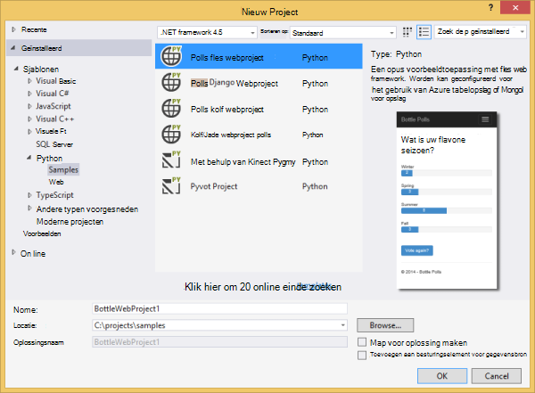

1.  U wordt gevraagd of u externe pakketten installeren. Selecteer **installeren in een virtuele omgeving**.

    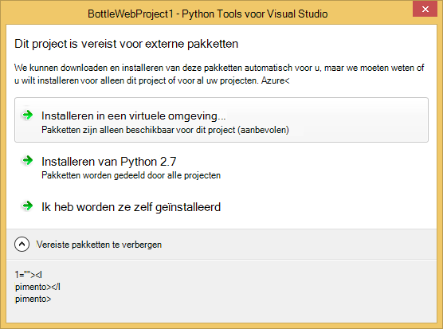

1.  **Python 2.7** of **Python 3.4** selecteren als de basis-interpreter.

    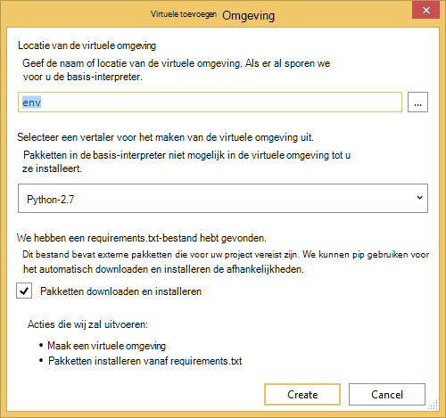

1.  Bevestigen dat de toepassing werkt door te drukken op `F5`. De toepassing gebruikt een opslagplaats in het geheugen die geen configuratie vereist. De gegevens worden verwijderd wanneer de webserver wordt gestopt.

1.  **Monster Polls maken**, klik op een poll en stem.

    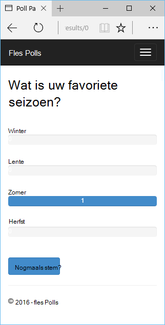

## Maak een Account Azure opslag

Opslagbewerkingen gebruiken, moet u een account Azure opslag. Door de volgende stappen kunt u een account voor opslag.

1.  Meld u aan bij de [Azure Portal](https://portal.azure.com/).

1. Klik op het pictogram **Nieuw** op de bovenste links van de Portal, klik vervolgens op **gegevens- en** > **Opslag Account**.  Klik op de knop **maken** , de opslag account een unieke naam geven en een nieuwe [resourcegroep](../azure-resource-manager/resource-group-overview.md) maken voor het.

    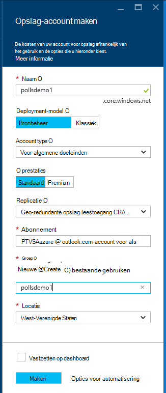

    Wanneer de opslag-account is gemaakt, de knop **meldingen** knippert groen **SUCCES** en blade opslag-account is geopend om te tonen dat het deel uitmaakt van de nieuwe resourcegroep die u hebt gemaakt.

1. Klik op het onderdeel **toegangstoetsen** in blade opslag-account. Let op de accountnaam en key1.

    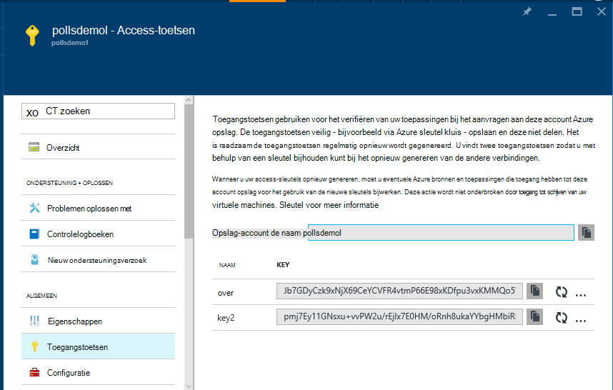

    Moeten we deze informatie voor het configureren van uw project in de volgende sectie.

## Het Project configureren

In deze sectie zullen we onze toepassing voor het gebruik van de opslag-account die we zojuist hebben gemaakt te configureren. Vervolgens zullen we de toepassing lokaal uitvoeren.

1.  Klik met de rechtermuisknop op het projectknooppunt in de Solution Explorer en selecteer **Eigenschappen**in Visual Studio. Klik op het tabblad **Foutopsporing** .

    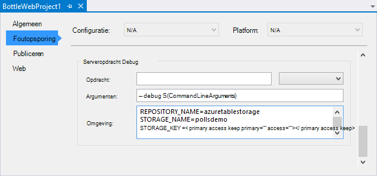

1.  Stel de waarden van omgevingsvariabelen vereist door de toepassing in **De Server-opdracht Debug** **omgeving**.

        REPOSITORY_NAME=azuretablestorage
        STORAGE_NAME=<storage account name>
        STORAGE_KEY=<primary access key>

    Hierdoor wordt de omgevingsvariabelen ingesteld wanneer u de **Foutopsporing Start**. Als u wilt dat de variabelen worden ingesteld wanneer u **Start zonder foutopsporing**, dezelfde waarden onder de **Serveropdracht uitvoeren** ook.

    Ook kunt u omgevingsvariabelen via het Configuratiescherm van Windows. Dit is een betere optie als u wilt voorkomen dat het opslaan van referenties in de broncode / project-bestand. Opmerking u moet Visual Studio voor de nieuwe Omgevingswaarden zijn beschikbaar om de toepassing te starten.

1.  De code waarmee de opslagplaats Azure tabelopslag is in **models/azuretablestorage.py**. Raadpleeg de [documentatie] voor meer informatie over het gebruik van de Service van Python tabel.

1.  Start de toepassing met `F5`. Polls die zijn gemaakt met **Voorbeeldgegevens Polls maken** en de gegevens van de stemming zal worden geserialiseerd Azure tabel opgeslagen.

    > [AZURE.NOTE] De Python 2.7 virtuele omgeving mogelijk het einde van een uitzondering in Visual Studio.  Druk op `F5` om door te gaan met het laden van de webproject. 

1.  Ga naar de pagina **over** om te controleren of de toepassing gebruikmaakt van de bibliotheek **Azure tabelopslag** .

    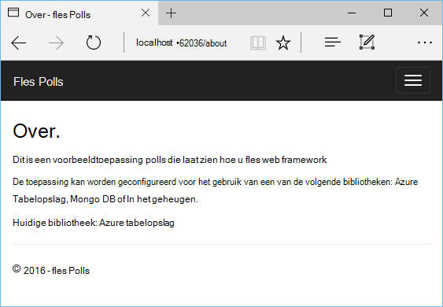

## Bekijk de Azure tabelopslag

Het is eenvoudig bekijken en bewerken van opslag-tabellen met behulp van Cloud Explorer in Visual Studio. In dit gedeelte gebruiken we Server Explorer om de inhoud van de tabellen controleert toepassing weer te geven.

> [AZURE.NOTE] Hiervoor moet Microsoft Azure-hulpprogramma's worden geïnstalleerd die beschikbaar zijn als onderdeel van de [SDK voor .NET Azure].

1.  **Cloud Explorer**openen. Vouw **Opslag rekeningen**, uw opslag account, klik op **tabellen**.

    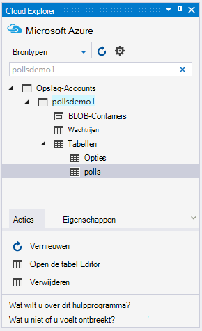

1.  Dubbelklik op de tabel **polls** of **keuzen** weer te geven van de inhoud van de tabel in een documentvenster en entiteiten toevoegen/verwijderen/bewerken.

    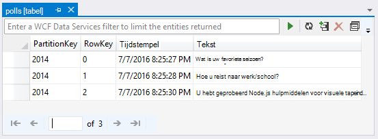

## De web app publiceren naar Azure App Service

De Azure .NET SDK biedt een eenvoudige manier om uw web app met Azure App Service implementeren.

1.  In de **Solution Explorer**met de rechtermuisknop op het projectknooppunt en selecteer **publiceren**.

    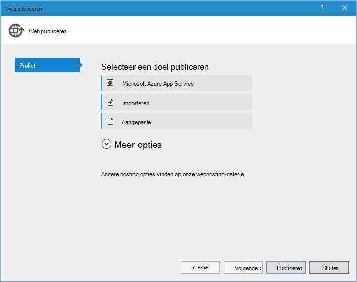

1.  Klik op **Microsoft Azure Web Apps**.

1.  Klik op **Nieuw** te maken van een nieuwe web app.

1.  Vul de volgende velden in en klik op **maken**.
    -   **Web App naam**
    -   **App-serviceplan**
    -   **Resourcegroep**
    -   **Regio**
    -   Laat de **databaseserver** ingesteld op **geen database**

1.  Alle overige standaardwaarden accepteren en klik op **publiceren**.

1.  Uw webbrowser wordt automatisch geopend op de gepubliceerde web app. Als u de pagina, ziet u dat de bibliotheek **In het geheugen** , niet de opslagplaats **Azure tabelopslag** wordt gebruikt.

    Dat komt doordat de omgevingsvariabelen zijn niet ingesteld op het Web Apps exemplaar in Azure App-Service, zodat u de standaardwaarden die zijn opgegeven in **settings.py**wordt gebruikt.

## Configureer het exemplaar Web Apps

In deze sectie zullen we omgevingsvariabelen voor het Web Apps-exemplaar configureren.

1.  Open in [Azure Portal], de web-app blade door te klikken op **Bladeren** > **App Services** > de naam van uw web app.

1.  Uw webtoepassing blade, **Alle instellingen**, klik op **Instellingen van de toepassing**.

1.  Ga naar de sectie **Instellingen voor toepassing** en stel de waarden voor **OPSLAGPLAATS\_naam**, **opslag\_naam** en **opslag\_sleutel** zoals beschreven in de sectie **configureren van het project** hierboven.

    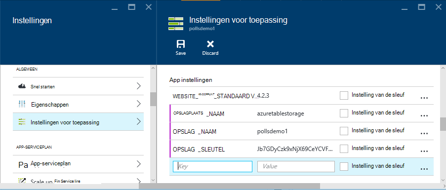

1.  Klik op **Opslaan**. Nadat u hebt ontvangen meldingen dat de wijzigingen zijn toegepast, klikt u op op de **Bladeren** van de belangrijkste Web app-blade.

1.  Hier ziet u de web app werkt zoals verwacht, met de opslagplaats **Azure tabelopslag** .

    Gefeliciteerd!

    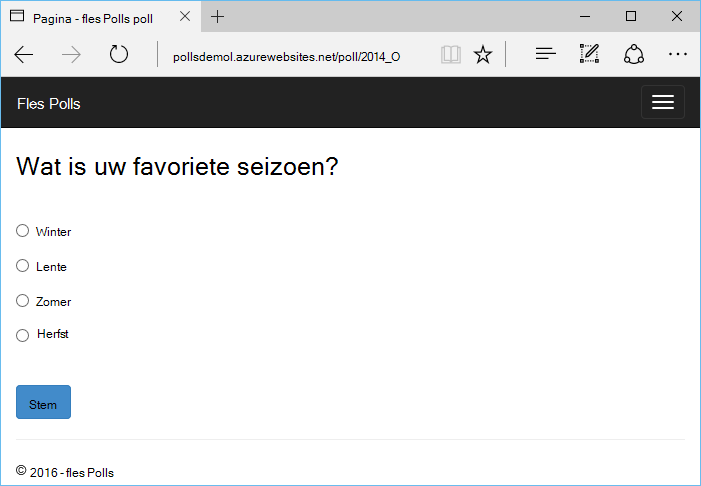

## Volgende stappen

Klik op deze koppelingen voor meer informatie over Python's voor Visual Studio, fles en Azure tabel opslaan.

- [Python-hulpprogramma's voor Visual Studio-documentatie]
  - [Website-projecten]
  - [Cloud serviceprojecten]
  - [Foutopsporing op afstand op Microsoft Azure]
- [Documentatie van de fles]
- [Azure opslag]
- [Azure SDK for Python]
- [Het gebruik van de tabel Storage-Service van Python]

## Wat er veranderd
* Zie voor een handleiding voor het wijzigen van Websites met App-Service: [Azure App Service en de Impact op de bestaande Azure Services](http://go.microsoft.com/fwlink/?LinkId=529714)

<!--Link references-->
[Python voor ontwikkelaars]: /develop/python/
[Azure Cloud Services]: ../cloud-services-python-ptvs.md
[documentatie]: ../storage-python-how-to-use-table-storage.md
[Het gebruik van de tabel Storage-Service van Python]: ../storage-python-how-to-use-table-storage.md

<!--External Link references-->
[Azure Portal]: https://portal.azure.com
[Azure SDK voor .NET]: http://azure.microsoft.com/downloads/
[Python-hulpprogramma's voor Visual Studio]: http://aka.ms/ptvs
[Python Tools 2.2 voor Visual Studio]: http://go.microsoft.com/fwlink/?LinkId=624025
[Python Tools 2.2 voor voorbeelden van Visual Studio VSIX]: http://go.microsoft.com/fwlink/?LinkId=624025
[Azure SDK-hulpprogramma's voor VS 2015]: http://go.microsoft.com/fwlink/?LinkId=518003
[Python 2.7 32-bits]: http://go.microsoft.com/fwlink/?LinkId=517190 
[Python 3.4 32-bits]: http://go.microsoft.com/fwlink/?LinkId=517191
[Python-hulpprogramma's voor Visual Studio-documentatie]: http://aka.ms/ptvsdocs
[Documentatie van de fles]: http://bottlepy.org/docs/dev/index.html
[Foutopsporing op afstand op Microsoft Azure]: http://go.microsoft.com/fwlink/?LinkId=624026
[Website-projecten]: http://go.microsoft.com/fwlink/?LinkId=624027
[Cloud serviceprojecten]: http://go.microsoft.com/fwlink/?LinkId=624028
[Azure opslag]: http://azure.microsoft.com/documentation/services/storage/
[Azure SDK for Python]: https://github.com/Azure/azure-sdk-for-python
 
