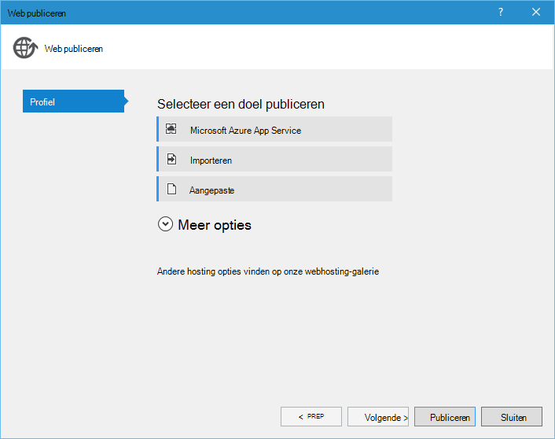

<properties 
    pageTitle="Django en MySQL op Azure met Python's 2.2 voor Visual Studio" 
    description="Informatie over het gebruik van de Python's voor Visual Studio voor het maken van een Django web app waarin gegevens worden opgeslagen in een MySQL-database-instantie en deze implementeren in Azure App Service Web Apps." 
    services="app-service\web" 
    documentationCenter="python" 
    authors="huguesv" 
    manager="wpickett" 
    editor=""/>

<tags 
    ms.service="app-service-web" 
    ms.workload="web" 
    ms.tgt_pltfrm="na" 
    ms.devlang="python"
    ms.topic="get-started-article" 
    ms.date="07/07/2016"
    ms.author="huvalo"/>

# Django en MySQL op Azure met Python's 2.2 voor Visual Studio 

[AZURE.INCLUDE [tabs](../../includes/app-service-web-get-started-nav-tabs.md)]

In deze zelfstudie gebruikt u [Python Tools voor Visual Studio] (PTVS) voor het maken van een eenvoudige polls web app met behulp van een van de voorbeeldsjablonen PTVS. U leert het gebruik van een MySQL-service in Azure, het configureren van de web app voor het gebruik van MySQL en de web app publiceren naar [Azure App Service Web Apps](http://go.microsoft.com/fwlink/?LinkId=529714).

> [AZURE.NOTE] De informatie in deze handleiding is ook beschikbaar in de volgende video:
> 
> [2.1 PTVS: Django app met MySQL][video]

Zie de [Python Developer Center] voor meer artikelen waarin de ontwikkeling van Azure App Service Web Apps met PTVS met fles, fles en Django web frameworks, met Azure tabelopslag, MySQL en SQL-Database. Dit artikel is gericht op App-Service, zijn de stappen vergelijkbaar bij het ontwikkelen van [Azure Cloud Services].

## Vereisten

 - Visual Studio 2015
 - [Python 2.7 32-bits] of [32-bits 3.4 Python]
 - [Python Tools 2.2 voor Visual Studio]
 - [Python Tools 2.2 voor voorbeelden van Visual Studio VSIX]
 - [Azure SDK-hulpprogramma's voor VS 2015]
 - Django 1,9 of hoger

[AZURE.INCLUDE [create-account-and-websites-note](../../includes/create-account-and-websites-note.md)]

<!-- This note should not render as part of the the previous include. -->

> [AZURE.NOTE] Als u wilt aan de slag met Azure App-Service voordat u aanmelden voor een account met Azure, gaat u naar de [App-Service probeert](http://go.microsoft.com/fwlink/?LinkId=523751), waar u direct een starter tijdelijk web app in de App-Service maken kunt. Geen creditcard is vereist en geen verplichtingen noodzakelijk zijn.

## Het Project maken

In dit gedeelte maakt u een Visual Studio-project met behulp van een voorbeeldsjabloon. U maakt een virtuele omgeving en vereiste pakketten te installeren. U maakt een lokale database met behulp van sqlite. Vervolgens kunt u de toepassing lokaal uitvoeren.

1. Selecteer **bestand** **Nieuw Project**in Visual Studio.

1. De project-sjablonen uit de [Python extra 2.2 voor Visual Studio monsters VSIX] zijn beschikbaar onder **Python**, **monsters**. **Polls Django Web Project** en klik op OK om het project te maken.

    

1. U wordt gevraagd of u externe pakketten installeren. Selecteer **installeren in een virtuele omgeving**.

    

1. **Python 2.7** of **Python 3.4** selecteren als de basis-interpreter.

    

1. Klik met de rechtermuisknop op het projectknooppunt in de **Solution Explorer**, selecteer **Python**en selecteer **Django migreren**.  Selecteer **Django-beheerder maken**.

1. Hiermee opent u een Django-beheerconsole en maak een sqlite database in de projectmap. Volg de aanwijzingen voor het maken van een gebruiker.

1. Bevestigen dat de toepassing werkt door te drukken op `F5`.

1. Klik op **aanmelden** op de navigatiebalk aan de bovenkant.

    

1. Voer de referenties voor de gebruiker die u hebt gemaakt toen u de database gesynchroniseerd.

    

1. Klik op **voorbeeld Polls te maken**.

    

1. Klik op een poll en stem.

    

## Maak een MySQL-Database

Voor de database maakt u een gehoste ClearDB MySQL-database op Azure.

Als alternatief kunt u uw eigen virtuele Machine uitgevoerd in Azure, maken en vervolgens installeren en beheren van MySQL.

U kunt een database maken met een gratis plan door de volgende stappen.

1. Log in op de [Azure Portal].

1. Klik op **Nieuw**, boven in het navigatiedeelvenster en vervolgens klikt u op **gegevens- en**en klik op **MySQL-Database**. 

1. De nieuwe MySQL-database configureren door het maken van een nieuwe bronnengroep en selecteert u de geschikte locatie voor het.

1. Zodra de MySQL-database is gemaakt, klikt u op **Eigenschappen** in het blad van de database.

1. Gebruik de knop kopiëren naar de waarde van de **VERBINDINGSREEKS** op het Klembord plaatsen.

## Het Project configureren

In deze sectie, zult u onze web app voor het gebruik van de MySQL-database die u zojuist hebt gemaakt. U kunt ook extra Python pakketten vereist voor het gebruik van MySQL-databases met Django installeren. Vervolgens kunt u de web app lokaal uitvoeren.

1. Open **settings.py**, vanuit de map *ProjectName* in Visual Studio. Tijdelijk de verbindingsreeks in de editor te plakken. De verbindingsreeks is in de volgende notatie:

        Database=<NAME>;Data Source=<HOST>;User Id=<USER>;Password=<PASSWORD>

    Wijzig de standaarddatabase- **ENGINE** gebruikt MySQL en stel de waarden voor **naam**, **gebruiker**, **wachtwoord** en **HOST** van de **CONNECTIONSTRING**.

        DATABASES = {
            'default': {
                'ENGINE': 'django.db.backends.mysql',
                'NAME': '<Database>',
                'USER': '<User Id>',
                'PASSWORD': '<Password>',
                'HOST': '<Data Source>',
                'PORT': '',
            }
        }

1. In **Omgevingen met Python**, Solution Explorer met de rechtermuisknop op de virtuele omgeving en selecteer **Python pakket installeren**.

1. Installeer het pakket `mysqlclient` met **pip**.

    

1. Klik met de rechtermuisknop op het projectknooppunt in de **Solution Explorer**, selecteer **Python**en selecteer **Django migreren**.  Selecteer **Django-beheerder maken**.

    Hiermee maakt u de tabellen voor de MySQL-database die u in de vorige sectie hebt gemaakt. Volg de aanwijzingen voor het maken van een gebruiker die aan de gebruiker in de sqlite database gemaakt in de eerste sectie van dit artikel.

1. Start de toepassing met `F5`. Polls die zijn gemaakt met **Voorbeeldgegevens Polls maken** en de gegevens van de stemming wordt in de database MySQL worden geserialiseerd.

## De web app publiceren naar Azure App Service

De Azure .NET SDK biedt een eenvoudige manier om uw web app met Azure App Service implementeren.

1. In de **Solution Explorer**met de rechtermuisknop op het projectknooppunt en selecteer **publiceren**.

    

1. Klik op **Microsoft Azure App-Service**.

1. Klik op **Nieuw** te maken van een nieuwe web app.

1. Vul de volgende velden in en klik op **maken**:
    - **Web App naam**
    - **App-serviceplan**
    - **Resourcegroep**
    - **Regio**
    - Laat de **databaseserver** ingesteld op **geen database**

1. Alle overige standaardwaarden accepteren en klik op **publiceren**.

1. Uw webbrowser wordt automatisch geopend op de gepubliceerde web app. Hier ziet u de web app werkt zoals verwacht, met behulp van de **MySQL** -database op Azure.

    

    Gefeliciteerd! U hebt uw MySQL-gebaseerd web app naar Azure gepubliceerd.

## Volgende stappen

Klik op deze koppelingen voor meer informatie over Python's voor Visual Studio, Django en MySQL.

- [Python-hulpprogramma's voor Visual Studio-documentatie]
  - [Website-projecten]
  - [Cloud serviceprojecten]
  - [Foutopsporing op afstand op Microsoft Azure]
- [Django-documentatie]
- [MySQL]

Zie de [Python Developer Center](/develop/python/)voor meer informatie.

<!--Link references-->

[Python voor ontwikkelaars]: /develop/python/
[Azure Cloud Services]: ../cloud-services-python-ptvs.md

<!--External Link references-->

[Azure Portal]: https://portal.azure.com
[Python-hulpprogramma's voor Visual Studio]: http://aka.ms/ptvs
[Python Tools 2.2 voor Visual Studio]: http://go.microsoft.com/fwlink/?LinkID=624025
[Python Tools 2.2 voor voorbeelden van Visual Studio VSIX]: http://go.microsoft.com/fwlink/?LinkID=624025
[Azure SDK-hulpprogramma's voor VS 2015]: http://go.microsoft.com/fwlink/?LinkId=518003
[Python 2.7 32-bits]: http://go.microsoft.com/fwlink/?LinkId=517190 
[Python 3.4 32-bits]: http://go.microsoft.com/fwlink/?LinkId=517191
[Python-hulpprogramma's voor Visual Studio-documentatie]: http://aka.ms/ptvsdocs
[Foutopsporing op afstand op Microsoft Azure]: http://go.microsoft.com/fwlink/?LinkId=624026
[Website-projecten]: http://go.microsoft.com/fwlink/?LinkId=624027
[Cloud serviceprojecten]: http://go.microsoft.com/fwlink/?LinkId=624028
[Django-documentatie]: https://www.djangoproject.com/
[MySQL]: http://www.mysql.com/
[video]: http://youtu.be/oKCApIrS0Lo
