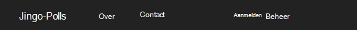

<properties 
    pageTitle="Django en de SQL-Database op Azure met Python's 2.2 voor Visual Studio" 
    description="Informatie over het gebruik van de Python's voor Visual Studio voor het maken van een Django web app waarin gegevens worden opgeslagen in een SQL-database-instantie en deze implementeren in Azure App Service Web Apps." 
    services="app-service\web" 
    tags="python"
    documentationCenter="python" 
    authors="huguesv" 
    manager="wpickett" 
    editor=""/>

<tags 
    ms.service="app-service-web" 
    ms.workload="web" 
    ms.tgt_pltfrm="na" 
    ms.devlang="python" 
    ms.topic="article" 
    ms.date="07/07/2016"
    ms.author="huguesv"/>

# Django en de SQL-Database op Azure met Python's 2.2 voor Visual Studio 

In deze zelfstudie gebruiken we [Python Tools voor Visual Studio] voor het maken van een eenvoudige polls web app met behulp van een van de voorbeeldsjablonen PTVS. Deze zelfstudie is ook beschikbaar als een [video](https://www.youtube.com/watch?v=ZwcoGcIeHF4).

We leert hoe u met een SQL-database die wordt gehost op Azure, het configureren van de web app voor het gebruik van een SQL-database en de web app publiceren naar [Azure App Service Web Apps](http://go.microsoft.com/fwlink/?LinkId=529714).

Zie de [Python Developer Center] voor meer artikelen die betrekking hebben op de ontwikkeling van Azure App Service Web Apps met PTVS met fles, fles en Django web frameworks, met Azure tabelopslag, MySQL-en SQL-Database. Dit artikel is gericht op App-Service, zijn de stappen vergelijkbaar bij het ontwikkelen van [Azure Cloud Services].

## Vereisten

 - Visual Studio 2015
 - [Python 2.7 32-bits]
 - [Python Tools 2.2 voor Visual Studio]
 - [Python Tools 2.2 voor voorbeelden van Visual Studio VSIX]
 - [Azure SDK-hulpprogramma's voor VS 2015]
 - Django 1,9 of hoger

[AZURE.INCLUDE [create-account-and-websites-note](../../includes/create-account-and-websites-note.md)]

>[AZURE.NOTE] Als u wilt aan de slag met Azure App-Service voordat u aanmelden voor een account met Azure, gaat u naar de [App-Service probeert](http://go.microsoft.com/fwlink/?LinkId=523751), waar u direct een starter tijdelijk web app in de App-Service maken kunt. Geen creditcard vereist; geen verplichtingen.

## Het Project maken

In deze sectie maken we een Visual Studio-project met behulp van een voorbeeldsjabloon. We maken een virtuele omgeving en vereiste pakketten te installeren. Maken we een lokale database met behulp van sqlite. Vervolgens zullen we de web app lokaal uitvoeren.

1.  Selecteer **bestand** **Nieuw Project**in Visual Studio.

1.  De project-sjablonen uit de [Python extra 2.2 voor Visual Studio monsters VSIX] zijn beschikbaar onder **Python**, **monsters**. **Polls Django Web Project** en klik op OK om het project te maken.

    

1.  U wordt gevraagd of u externe pakketten installeren. Selecteer **installeren in een virtuele omgeving**.

    

1.  Selecteer de basis-interpreter **Python 2.7** .

    

1.  Klik met de rechtermuisknop op het projectknooppunt in de **Solution Explorer**, selecteer **Python**en selecteer **Django migreren**.  Selecteer **Django-beheerder maken**.

1.  Hiermee opent u een Django-beheerconsole en maak een sqlite database in de projectmap. Volg de aanwijzingen voor het maken van een gebruiker.

1.  Zorg ervoor dat de toepassing werkt door op <kbd>F5</kbd>te drukken.

1.  Klik op **aanmelden** op de navigatiebalk aan de bovenkant.

    

1.  Voer de referenties voor de gebruiker die u hebt gemaakt toen u de database gesynchroniseerd.

    

1.  Klik op **voorbeeld Polls te maken**.

    

1.  Klik op een poll en stem.

    

## Een SQL-Database maken

Voor de database maken we een Azure SQL-database.

U kunt een database maken door de volgende stappen.

1.  Meld u aan bij de [Azure Portal].

1.  Klik op **Nieuw**onder aan het navigatiedeelvenster. , klikt u op **gegevens- en** > **SQL-Database**.

1.  De nieuwe SQL-Database configureren door het maken van een nieuwe bronnengroep en selecteert u de geschikte locatie voor het.

1.  Als de SQL-Database is gemaakt, klikt u op **openen in Visual Studio** in het blad van de database.
2.  Klik op **de firewall configureren**.
3.  In het blad **Firewallinstellingen** toevoegen dat een firewallregel met **START** en **END onderzoektijdvak** ingesteld op het openbare IP-adres van de computer van de ontwikkeling. Klik op **Opslaan**.

    Hierdoor kunnen verbindingen met de databaseserver vanaf de ontwikkelcomputer.

4.  In de database-blade **Eigenschappen**Klik **tekenreeksen voor een databaseverbinding wordt weergegeven**. 

2.  Gebruik de knop kopiëren naar de waarde van **ADO.NET** op het Klembord plaatsen.

## Het Project configureren

In deze sectie zullen we onze web app voor het gebruik van de SQL-database die we zojuist hebben gemaakt te configureren. We zullen ook extra Python pakketten vereist voor het gebruik van SQL-databases met Django installeren. Vervolgens zullen we de web app lokaal uitvoeren.

1.  Open **settings.py**, vanuit de map *ProjectName* in Visual Studio. Tijdelijk de verbindingsreeks in de editor te plakken. De verbindingsreeks is in de volgende notatie:

        Server=<ServerName>,<ServerPort>;Database=<DatabaseName>;User ID=<UserName>;Password={your_password_here};Encrypt=True;TrustServerCertificate=False;Connection Timeout=30;

Bewerk de definitie van `DATABASES` gebruik van de bovenstaande waarden.

        DATABASES = {
            'default': {
                'ENGINE': 'sql_server.pyodbc',
                'NAME': '<DatabaseName>',
                'USER': '<UserName>',
                'PASSWORD': '{your_password_here}',
                'HOST': '<ServerName>',
                'PORT': '<ServerPort>',
                'OPTIONS': {
                    'driver': 'SQL Server Native Client 11.0',
                    'MARS_Connection': 'True',
                }
            }
        }

1.  In **Omgevingen met Python**, Solution Explorer met de rechtermuisknop op de virtuele omgeving en selecteer **Python pakket installeren**.

1.  Installeer het pakket `pyodbc` met **pip**.

    

1.  Installeer het pakket `django-pyodbc-azure` met **pip**.

    

1.  Klik met de rechtermuisknop op het projectknooppunt in de **Solution Explorer**, selecteer **Python**en selecteer **Django migreren**.  Selecteer **Django-beheerder maken**.

    Hiermee maakt u de tabellen van de SQL-database die we in de vorige sectie hebt gemaakt. Volg de aanwijzingen voor het maken van een gebruiker die aan de gebruiker in de sqlite database gemaakt in de eerste sectie.

1.  Start de toepassing met `F5`. Polls die zijn gemaakt met **Voorbeeldgegevens Polls maken** en de gegevens van de stemming wordt in de SQL-database worden geserialiseerd.

## De web app publiceren naar Azure App Service

De Azure .NET SDK biedt een eenvoudige manier om uw web web app voor Azure App Service Web Apps implementeren.

1.  In de **Solution Explorer**met de rechtermuisknop op het projectknooppunt en selecteer **publiceren**.

    

1.  Klik op **Microsoft Azure Web Apps**.

1.  Klik op **Nieuw** te maken van een nieuwe web app.

1.  Vul de volgende velden in en klik op **maken**.
    -   **Web App naam**
    -   **App-serviceplan**
    -   **Resourcegroep**
    -   **Regio**
    -   Laat de **databaseserver** ingesteld op **geen database**

1.  Alle overige standaardwaarden accepteren en klik op **publiceren**.

1.  Uw webbrowser wordt automatisch geopend op de gepubliceerde web app. U ziet de web app werkt zoals verwacht, met behulp van de **SQL** -database die wordt gehost op Azure.

    Gefeliciteerd!

    

## Volgende stappen

Klik op deze koppelingen voor meer informatie over Python's voor Visual Studio, Django en SQL-Database.

- [Python-hulpprogramma's voor Visual Studio-documentatie]
  - [Website-projecten]
  - [Cloud serviceprojecten]
  - [Foutopsporing op afstand op Microsoft Azure]
- [Django-documentatie]
- [SQL-Database]

## Wat er veranderd
* Zie voor een handleiding voor het wijzigen van Websites met App-Service: [Azure App Service en de Impact op de bestaande Azure Services](http://go.microsoft.com/fwlink/?LinkId=529714)

<!--Link references-->
[Python voor ontwikkelaars]: /develop/python/
[Azure Cloud Services]: ../cloud-services-python-ptvs.md

<!--External Link references-->
[Azure Portal]: https://portal.azure.com
[Python-hulpprogramma's voor Visual Studio]: http://aka.ms/ptvs
[Python Tools 2.2 voor Visual Studio]: http://go.microsoft.com/fwlink/?LinkID=624025
[Python Tools 2.2 voor voorbeelden van Visual Studio VSIX]: http://go.microsoft.com/fwlink/?LinkID=624025
[Azure SDK-hulpprogramma's voor VS 2015]: http://go.microsoft.com/fwlink/?LinkId=518003
[Python 2.7 32-bits]: http://go.microsoft.com/fwlink/?LinkId=517190 
[Python-hulpprogramma's voor Visual Studio-documentatie]: http://aka.ms/ptvsdocs
[Foutopsporing op afstand op Microsoft Azure]: http://go.microsoft.com/fwlink/?LinkId=624026
[Website-projecten]: http://go.microsoft.com/fwlink/?LinkId=624027
[Cloud serviceprojecten]: http://go.microsoft.com/fwlink/?LinkId=624028
[Django-documentatie]: https://www.djangoproject.com/
[SQL-Database]: /documentation/services/sql-database/
