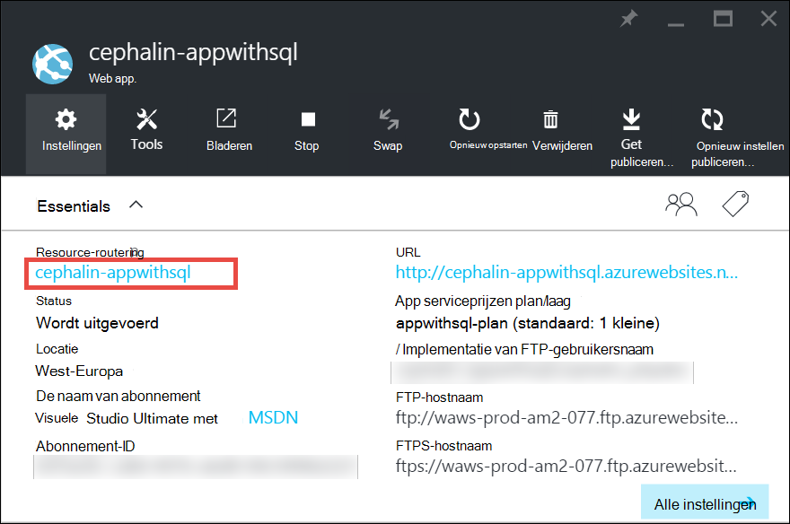

<properties
    pageTitle="Schaal van een app in Azure | Microsoft Azure"
    description="Informatie over het schalen van een app in de App-Service Azure capaciteit en functies toevoegen."
    services="app-service"
    documentationCenter=""
    authors="cephalin"
    manager="wpickett"
    editor="mollybos"/>

<tags
    ms.service="app-service"
    ms.workload="na"
    ms.tgt_pltfrm="na"
    ms.devlang="na"
    ms.topic="article"
    ms.date="07/05/2016"
    ms.author="cephalin"/>

# Schaal van een app in Azure #

In dit artikel wordt beschreven hoe u voor het schalen van uw app in Azure App-Service. Er zijn twee werkstromen voor schaal, scale up en geschaald uitbreiden en in dit artikel worden de schaal van een workflow.

- [Schalen](https://en.wikipedia.org/wiki/Scalability#Horizontal_and_vertical_scaling): meer CPU, geheugen, schijfruimte en extra functies zoals specifieke virtuele machines (VMs), aangepaste domeinen en certificaten, staging-sleuven en autoscaling ophalen. U laat de prijzen laag van de App serviceplan dat u uw app te behoort wijzigen.
- [Geschaald uitbreiden](https://en.wikipedia.org/wiki/Scalability#Horizontal_and_vertical_scaling): verhoog het aantal exemplaren van VM die uw toepassing uitvoeren.
Kunt u de schaal van maar liefst 20 exemplaren, afhankelijk van de prijzen laag. [App serviceomgevingen](../app-service/app-service-app-service-environments-readme.md) in **Premium** laag verder vergroot u uw aantal schalen voor 50 exemplaren. Voor meer informatie over het schalen, Zie [schalen exemplaar aantal handmatig of automatisch](../monitoring-and-diagnostics/insights-how-to-scale.md). U vindt er uit autoscaling, die is geschaald exemplaar aantal automatisch op basis van vooraf gedefinieerde regels en schema's.

De schaalinstellingen seconden duren voordat alleen van toepassing en zijn van invloed op alle apps in uw [serviceplan App](../app-service/azure-web-sites-web-hosting-plans-in-depth-overview.md).
Ze hoeft u de code wijzigen of implementeren van uw toepassing.

Zie voor meer informatie over de prijzen en kenmerken van afzonderlijke App serviceplannen [App prijzen servicegegevens](/pricing/details/web-sites/).  

> [AZURE.NOTE] Voordat u een App serviceplan uit de **vrije** laag activeert, moet u eerst verwijderen de [uitgavenlimieten](/pricing/spending-limits/) in plaats voor uw abonnement op Azure. Zie [Microsoft Azure abonnementen]wilt bekijken of wijzigen van opties voor uw abonnement op Microsoft Azure App Service,[azuresubscriptions].

## De prijzen laag schalen

1. Open in uw browser de [Azure portal][portal].

2. In van uw app blade, klikt u op **alle instellingen**en klikt u op **Schaal omhoog**.

    ![Als u wilt schalen van uw app Azure navigeren.][ChooseWHP]

4. Kies uw laag en klik vervolgens op **selecteren**.

    Het tabblad **meldingen** knippert groen **SUCCES** nadat de bewerking voltooid is.

## Verwante bronnen schalen
Als uw toepassing afhankelijk van andere services, zoals Azure SQL-Database of Azure opslag is, kunt u ook die bronnen op basis van uw behoeften schalen. Deze bronnen niet worden geschaald met de App serviceplan en moeten afzonderlijk worden geschaald.

1. In de **Essentials**, klikt u op de koppeling van de **resourcegroep** .

    

2. In de **Samenvatting** van de **resourcegroep** blade, klikt u op een bron die u wilt schalen. Het volgende screenshot toont de bron van een SQL-Database en een resource opslag Azure.

    

3. De bron van een SQL-Database, klikt u op **Instellingen** > trapsgewijs**prijzen laag** voor het schalen van de prijzen.

    

    U kunt ook [geo-replicatie](../sql-database/sql-database-geo-replication-overview.md) inschakelen voor uw exemplaar van de SQL-Database.

    Klik op **Instellingen**voor een resource opslag Azure > **configuratie** voor het schalen van uw opslagmogelijkheden.

    

## Meer informatie over functies voor ontwikkelaars
Afhankelijk van de prijzen laag zijn de volgende ontwikkelaar-georiënteerde functies beschikbaar:

### Bitness ###

- Voor de niveaus **Basic**, **Standard**en **Premium** ondersteuning voor 64-bits en 32-bits toepassingen.
- De **vrije** en **gedeelde** plan lagen ondersteunen alleen 32-bits toepassingen.

### Ondersteuning voor foutopsporing ###

- Debugger-ondersteuning is beschikbaar voor de **vrije**, **gedeeld**en **elementaire** modi op een verbinding per App serviceplan.
- Debugger-ondersteuning is beschikbaar voor de **Standard** - en **Premium** -modi op vijf gelijktijdige verbindingen per App serviceplan.

## Meer informatie over andere functies

- Zie voor gedetailleerde informatie over alle overige functies in de App Service plannen, met inbegrip van prijzen en functies van belang zijn voor alle gebruikers (inclusief ontwikkelaars) [Prijzen Details van App](/pricing/details/web-sites/).

>[AZURE.NOTE] Als u aan de slag met Azure App-Service wilt voordat u zich voor een account met Azure aanmeldt, gaat u naar de [App-Service probeert](http://go.microsoft.com/fwlink/?LinkId=523751) waar u onmiddellijk een tijdelijk starter web app in de App-Service maken kunt. Geen creditcards zijn vereist en er zijn geen verplichtingen.

## Volgende stappen

- Zie [Microsoft Azure gratis](/pricing/free-trial/)aan de slag met Azure.
- Ga naar de volgende koppelingen voor meer informatie over prijzen, ondersteuning en SLA.

    [Gegevensoverdracht prijsdetails](/pricing/details/data-transfers/)

    [Microsoft Azure ondersteuningsplannen](/support/plans/)

    [Service Level Agreements](/support/legal/sla/)

    [SQL Database prijzen Details](/pricing/details/sql-database/)

    [Virtuele Machine en Cloud Service formaten voor Microsoft Azure][vmsizes]

    [Details van Service App prijzen](/pricing/details/app-service/)

    [App Service prijsdetails - SSL-verbindingen](/pricing/details/web-sites/#ssl-connections)

- Zie voor informatie over Azure App Service aanbevolen procedures, waaronder het bouwen van de architectuur van een schaalbare en robuuste [Best Practices: Azure App Service Web Apps](http://blogs.msdn.com/b/windowsazure/archive/2014/02/10/best-practices-windows-azure-websites-waws.aspx).

- Zie de volgende bronnen voor video's over schaling App Service apps:

    - [Bij het schalen van Azure Websites - met Stefan Schackow](/documentation/videos/azure-web-sites-free-vs-standard-scaling/)
    - [Auto Scaling Azure Websites, CPU of geplande - met Stefan Schackow](/documentation/videos/auto-scaling-azure-web-sites/)
    - [Hoe Azure Websites schaal - met Stefan Schackow](/documentation/videos/how-azure-web-sites-scale/)

<!-- LINKS -->
[vmsizes]:/pricing/details/app-service/
[SQLaccountsbilling]:http://go.microsoft.com/fwlink/?LinkId=234930
[azuresubscriptions]:http://go.microsoft.com/fwlink/?LinkID=235288
[portal]: https://portal.azure.com/

<!-- IMAGES -->
[ChooseWHP]: ./media/web-sites-scale/scale1ChooseWHP.png
[ChooseBasicInstances]: ./media/web-sites-scale/scale2InstancesBasic.png
[SaveButton]: ./media/web-sites-scale/05SaveButton.png
[BasicComplete]: ./media/web-sites-scale/06BasicComplete.png
[ScaleStandard]: ./media/web-sites-scale/scale3InstancesStandard.png
[Autoscale]: ./media/web-sites-scale/scale4AutoScale.png
[SetTargetMetrics]: ./media/web-sites-scale/scale5AutoScaleTargetMetrics.png
[SetFirstRule]: ./media/web-sites-scale/scale6AutoScaleFirstRule.png
[SetSecondRule]: ./media/web-sites-scale/scale7AutoScaleSecondRule.png
[SetThirdRule]: ./media/web-sites-scale/scale8AutoScaleThirdRule.png
[SetRulesFinal]: ./media/web-sites-scale/scale9AutoScaleFinal.png
[ResourceGroup]: ./media/web-sites-scale/scale10ResourceGroup.png
[ScaleDatabase]: ./media/web-sites-scale/scale11SQLScale.png
[GeoReplication]: ./media/web-sites-scale/scale12SQLGeoReplication.png
