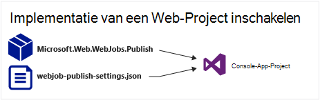

<properties 
    pageTitle="Implementeren met behulp van Visual Studio WebJobs" 
    description="Informatie over het implementeren van Azure WebJobs naar Azure App Service Web Apps met behulp van Visual Studio." 
    services="app-service" 
    documentationCenter="" 
    authors="tdykstra" 
    manager="wpickett" 
    editor="jimbe"/>

<tags 
    ms.service="app-service" 
    ms.devlang="dotnet" 
    ms.topic="article" 
    ms.tgt_pltfrm="na" 
    ms.workload="na" 
    ms.date="04/27/2016" 
    ms.author="tdykstra"/>

# Implementeren met behulp van Visual Studio WebJobs

## Overzicht

In dit onderwerp wordt uitgelegd hoe u met behulp van Visual Studio een Console Application-project op een web app in de [App-Service](http://go.microsoft.com/fwlink/?LinkId=529714) als een [Azure-WebJob](http://go.microsoft.com/fwlink/?LinkId=390226)implementeren. Zie voor meer informatie over het implementeren van WebJobs met behulp van de [Portal Azure](https://portal.azure.com) [achtergrondtaken uitvoeren met WebJobs](web-sites-create-web-jobs.md).

Visual Studio een project WebJobs-consoletoepassing implementeert, worden twee taken uitgevoerd:

* Runtime-bestanden gekopieerd naar de geschikte map in de web app (*App_Data/taken/continue* voor continue WebJobs, *App_Data, taken/geactiveerd* voor geplande en on-demand-WebJobs).
* [Taken van Taakplanner Azure](#scheduler) ingesteld voor WebJobs die zijn gepland op bepaalde tijden worden uitgevoerd. (Dit is niet nodig voor continue WebJobs.)

Een project WebJobs ingeschakeld, heeft de volgende items toegevoegd:

* De [Microsoft.Web.WebJobs.Publish](http://www.nuget.org/packages/Microsoft.Web.WebJobs.Publish/) NuGet package.
* Een bestand met [webjob-publiceren settings.json](#publishsettings) met implementatie- en scheduler-instellingen. 

U kunt deze items toevoegen aan een bestaande Console Application-project of een sjabloon gebruiken voor het maken van een nieuw project in de Console WebJobs-toepassingen. 

U kunt implementeren van een project als een WebJob op zichzelf of op een webproject koppelen zodat deze automatisch geïmplementeerd zodra u de webproject implementeert. Als u wilt projecten koppelen, bevat Visual Studio de naam van het project WebJobs ingeschakeld in een bestand [webjobs-list.json](#webjobslist) in de webproject.

## Vereisten

WebJobs implementatiefuncties zijn beschikbaar in Visual Studio 2015 tijdens de installatie van de SDK Azure voor .NET:

* [Azure SDK voor .NET (Visual Studio 2015)](http://go.microsoft.com/fwlink/?linkid=518003).

## Implementatie van WebJobs voor een bestaande Console Application-project inschakelen

U hebt twee opties:

* [Inschakelen automatische implementatie met een webproject](#convertlink).

    Een bestaand project voor de toepassing van de Console zo configureren dat deze automatisch wordt gedistribueerd als een WebJob bij het implementeren van een webproject. Gebruik deze optie als u wilt uw WebJob uitvoeren in de dezelfde web app waarin u de verwante webtoepassing uitvoeren.

* [Implementatie zonder een webproject mogelijk te maken](#convertnolink).

    Configureren van een bestaande Console Application-project te implementeren als een WebJob, met geen koppeling naar een webproject. Gebruik deze optie als u wilt uitvoeren in een web app een WebJob, met geen webtoepassing die wordt uitgevoerd in de web app. U kunt dit doen om het schalen van uw resources WebJob onafhankelijk van de middelen van uw webtoepassing te kunnen.

### Automatische WebJobs-implementatie met een webproject inschakelen
  
1. Klik met de rechtermuisknop op het webproject in de **Solution Explorer**en klik vervolgens op **toevoegen** > **Bestaand Project als Azure WebJob**.

    
    
    Het dialoogvenster [Azure WebJob toevoegen](#configure) wordt weergegeven.

1. Selecteer in de vervolgkeuzelijst **de naam van Project** de Console Application-project als een WebJob toe te voegen.

    

2. Vul het dialoogvenster [Azure WebJob toevoegen](#configure) en klik vervolgens op **OK**. 

### WebJobs-implementatie zonder een webproject inschakelen
  
1. Klik met de rechtermuisknop op de Console Application-project in de **Solution Explorer**en klik op **publiceren als Azure WebJob**. 

    
    
    Het dialoogvenster [Azure WebJob toevoegen](#configure) wordt weergegeven, met het project dat is geselecteerd in het vak **naam van het Project** .

2.  Vul het dialoogvenster [Azure WebJob toevoegen](#configure) en klik vervolgens op **OK**.

    De wizard **Publiceren** wordt weergegeven.  Als u niet dat onmiddellijk publiceren wilt, moet u de wizard sluiten. De instellingen die u hebt ingevoerd, worden opgeslagen voor wanneer u dat voor de [implementatie van het project wilt](#deploy).

## Maak een nieuw project met WebJobs ingeschakeld

U kunt de Console Application projectsjabloon gebruiken en WebJobs implementatie mogelijk te maken, zoals wordt beschreven in [de vorige sectie](#convert)te maken van een nieuwe WebJobs is ingeschakeld. Als alternatief kunt u de sjabloon WebJobs nieuw project:

* [Gebruik de sjabloon WebJobs nieuw project voor een onafhankelijke WebJob](#createnolink)

    Een project maken en configureren implementeren met zichzelf als een WebJob, met geen koppeling naar een webproject. Gebruik deze optie als u wilt uitvoeren in een web app een WebJob, met geen webtoepassing die wordt uitgevoerd in de web app. U kunt dit doen om het schalen van uw resources WebJob onafhankelijk van de middelen van uw webtoepassing te kunnen.

* [Gebruik de sjabloon WebJobs nieuw project voor een WebJob gekoppeld aan een webproject](#createlink)

    Een project maken dat is geconfigureerd om automatisch als een WebJob wanneer een webproject in dezelfde oplossing wordt geïmplementeerd. Gebruik deze optie als u wilt uw WebJob uitvoeren in de dezelfde web app waarin u de verwante webtoepassing uitvoeren.

> [AZURE.NOTE] De sjabloon WebJobs nieuw project automatisch NuGet pakketten worden geïnstalleerd en bevat code in *Program.cs* voor de [WebJobs SDK](http://www.asp.net/aspnet/overview/developing-apps-with-windows-azure/getting-started-with-windows-azure-webjobs). Als u niet wilt gebruiken, de WebJobs SDK of wilt gebruiken van een geplande en niet continu WebJob, of wijzig de `host.RunAndBlock` -instructie in de *Program.cs*.

### Gebruik de sjabloon WebJobs nieuw project voor een onafhankelijke WebJob
  
1. Klik op **bestand** > **Nieuw Project**, en klik vervolgens in het dialoogvenster **Nieuw Project** op **wolk** > **WebJob voor Microsoft Azure**.

    
    
2. Volg de aanwijzingen hierboven om [Het project een onafhankelijk WebJobs project consoletoepassing](#convertnolink).

### Gebruik de sjabloon WebJobs nieuw project voor een WebJob gekoppeld aan een webproject

1. Klik met de rechtermuisknop op het webproject in de **Solution Explorer**en klik vervolgens op **toevoegen** > **Nieuwe Azure WebJob Project**.

    

    Het dialoogvenster [Azure WebJob toevoegen](#configure) wordt weergegeven.

2. Vul het dialoogvenster [Azure WebJob toevoegen](#configure) en klik vervolgens op **OK**.

## Het dialoogvenster Azure WebJob toevoegen

Het dialoogvenster **Toevoegen Azure WebJob** kunt u met WebJob-naam en de instellingen voor uw WebJob plannen. 

De velden in dit dialoogvenster overeenkomen met velden in het dialoogvenster **Nieuwe taak** van de Portal Azure. Zie [achtergrondtaken uitvoeren met WebJobs](web-sites-create-web-jobs.md)voor meer informatie.

Voor een geplande WebJob (niet voor continue WebJobs) maakt Visual Studio een job [Scheduler Azure](/services/scheduler/) collectie als een nog niet bestaat, wordt een taak gemaakt in de collectie:

* De collectie van de job scheduler is met de naam *WebJobs-{regionname}* waarbij *{regionname}* naar het gebied het web verwijst app wordt gehost in. Bijvoorbeeld: WebJobs WestUS.
* De geplande taak met de naam *{webappname}-{webjobname}*. Bijvoorbeeld: MyWebApp MyWebJob. 
 
>[AZURE.NOTE]
> 
>* Zie voor meer informatie over de implementatie van de opdrachtregel [inschakelen vanaf de opdrachtregel of continue levering van Azure WebJobs](/blog/2014/08/18/enabling-command-line-or-continuous-delivery-of-azure-webjobs/).
>* Als u een **Terugkerende taak** configureren en terugkeerfrequentie ingesteld op een aantal minuten, is de Azure Scheduler-service niet beschikbaar. Andere frequenties (uren, dagen, enzovoort) zijn gratis.
>* Als u een WebJob implementeren en u wilt wijzigen van het type WebJob en opnieuw distribueren, moet u het bestand webjobs-publiceren settings.json te verwijderen. Dit brengt Visual Studio weergeven de opties voor publiceren, zodat kunt u het type WebJob.
>* Als u een WebJob implementeren en later de uitvoeringsmodus van doorlopende niet-doorlopende of omgekeerd wijzigt, maakt Visual Studio een nieuwe WebJob in Azure, wanneer u opnieuw implementeren. Als u een andere schema-instellingen wijzigen, maar laat dezelfde modus uitvoert of het schakelen tussen gepland en op verzoek, Visual Studio werkt u de bestaande taak in plaats van een nieuwe maken.

## webjob-publiceren settings.json

Als u een Console voor de implementatie van WebJobs configureren, kan Visual Studio installeert u het pakket [Microsoft.Web.WebJobs.Publish](http://www.nuget.org/packages/Microsoft.Web.WebJobs.Publish/) NuGet en planning informatie opgeslagen in een bestand *webjob-publiceren-settings.json* in de *Eigenschappen* van het project WebJobs. Hier volgt een voorbeeld van het bestand:

        {
          "$schema": "http://schemastore.org/schemas/json/webjob-publish-settings.json",
          "webJobName": "WebJob1",
          "startTime": "2014-06-23T00:00:00-08:00",
          "endTime": "2014-06-27T00:00:00-08:00",
          "jobRecurrenceFrequency": "Minute",
          "interval": 5,
          "runMode": "Scheduled"
        }

U kunt dit bestand rechtstreeks bewerken en Visual Studio biedt IntelliSense. Het schema van het bestand is opgeslagen in [http://schemastore.org](http://schemastore.org/schemas/json/webjob-publish-settings.json) en er kan worden weergegeven.  

>[AZURE.NOTE]
>
>* Als u een **Terugkerende taak** configureren en terugkeerfrequentie ingesteld op een aantal minuten, is de Azure Scheduler-service niet beschikbaar. Andere frequenties (uren, dagen, enzovoort) zijn gratis.

## webjobs list.json

Als u een project WebJobs ingeschakeld aan een webproject koppelt, wordt Visual Studio de naam van het project WebJobs opgeslagen in een bestand *webjobs-list.json* in de map van het webproject *Eigenschappen* . De lijst kan meerdere WebJobs projecten bevatten zoals in het volgende voorbeeld wordt getoond:

        {
          "$schema": "http://schemastore.org/schemas/json/webjobs-list.json",
          "WebJobs": [
            {
              "filePath": "../ConsoleApplication1/ConsoleApplication1.csproj"
            },
            {
              "filePath": "../WebJob1/WebJob1.csproj"
            }
          ]
        }

U kunt dit bestand rechtstreeks bewerken en Visual Studio biedt IntelliSense. Het schema van het bestand is opgeslagen in [http://schemastore.org](http://schemastore.org/schemas/json/webjobs-list.json) en er kan worden weergegeven.
  
## Implementeren van een project WebJobs

Een project van WebJobs die u hebt gekoppeld aan een webproject implementeert automatisch aan het webproject. Zie voor meer informatie over de implementatie van de web project [implementatie van Web Apps](web-sites-deploy.md).

Implementatie van een WebJobs-project zelf, met de rechtermuisknop op het project in de **Solution Explorer**en klik op **publiceren als Azure WebJob**. 

    
Voor een onafhankelijke WebJob, dezelfde wizard **Web publiceren** die wordt gebruikt voor webprojecten wordt weergegeven, maar met minder instellingen beschikbaar om te wijzigen.

## Volgende stappen

Dit artikel is uitgelegd hoe u kunt WebJobs implementeren met behulp van Visual Studio. Zie voor meer informatie over het implementeren van Azure WebJobs [WebJobs Azure - aanbevolen Resources - implementatie](http://www.asp.net/aspnet/overview/developing-apps-with-windows-azure/azure-webjobs-recommended-resources#deploying).
