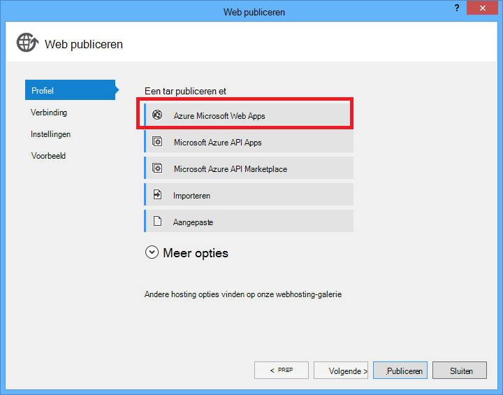

<properties
    pageTitle="Een .NET WebJob in Azure App Service maken | Microsoft Azure"
    description="Maak een meerlaags app met behulp van ASP.NET MVC en Azure. De front end uitgevoerd in een web app in Azure App-Service en de backend wordt uitgevoerd met een WebJob. De toepassing gebruikt de entiteit Framework, SQL-Database, en wachtrijen Azure opslag en BLOB's."
    services="app-service"
    documentationCenter=".net"
    authors="tdykstra"
    manager="wpickett"
    editor="mollybos"/>

<tags
    ms.service="app-service"
    ms.workload="na"
    ms.tgt_pltfrm="na"
    ms.devlang="na"
    ms.topic="article"
    ms.date="10/28/2016"
    ms.author="tdykstra"/>

# Een .NET WebJob in Azure App-Service maken

Deze zelfstudie laat zien hoe code schrijven voor een eenvoudige meerlaags ASP.NET MVC 5 toepassing die gebruikmaakt van de [WebJobs SDK](websites-dotnet-webjobs-sdk.md).

Het doel van de [WebJobs SDK](websites-webjobs-resources.md) is voor het vereenvoudigen van de code die u voor veelvoorkomende taken schrijft die een WebJob kunt uitvoeren, zoals beeldverwerking, verwerking van de wachtrij, RSS aggregatie, onderhoud van bestanden en e-mails verzenden. De WebJobs SDK bevat ingebouwde voorzieningen voor het werken met Azure opslag en Service Bus voor het plannen van taken en het afhandelen van fouten en voor veel andere veelvoorkomende scenario's. Bovendien ontworpen om te worden verlengd, en er is een [open source opslagplaats voor uitbreidingen](https://github.com/Azure/azure-webjobs-sdk-extensions/wiki/Binding-Extensions-Overview).

De voorbeeldtoepassing is een bulletinboard reclame. Gebruikers kunnen uploaden van afbeeldingen voor advertenties en een back-end-proces de afbeeldingen worden geconverteerd naar miniaturen. De lijstpagina ad ziet u de miniaturen en de pagina ad details ziet u de volledige grootte afbeelding. Hier is een screenshot:

Deze voorbeeldtoepassing werkt met [Azure wachtrijen](http://www.asp.net/aspnet/overview/developing-apps-with-windows-azure/building-real-world-cloud-apps-with-windows-azure/queue-centric-work-pattern) en [Azure BLOB's](http://www.asp.net/aspnet/overview/developing-apps-with-windows-azure/building-real-world-cloud-apps-with-windows-azure/unstructured-blob-storage). De zelfstudie laat zien hoe de toepassing [Azure App Service](http://go.microsoft.com/fwlink/?LinkId=529714) en [Azure SQL-Database](http://msdn.microsoft.com/library/azure/ee336279)distribueren.

## Vereisten

De zelfstudie wordt ervan uitgegaan dat u weet hoe u werkt met [ASP.NET MVC 5](http://www.asp.net/mvc/tutorials/mvc-5/introduction/getting-started) projecten in Visual Studio.

De zelfstudie is geschreven voor Visual Studio 2013. Als u nog geen Visual Studio hebt, zal het u automatisch geïnstalleerd tijdens de installatie van de SDK Azure voor .NET.

De zelfstudie met Visual Studio 2015 kan worden gebruikt, maar voordat u de toepassing uitvoeren lokaal u moet wijzigen de `Data Source` onderdeel van de verbindingsreeks van SQL Server LocalDB in de bestanden Web.config en App.config van `Data Source=(localdb)\v11.0` op `Data Source=(LocalDb)\MSSQLLocalDB`. 

> [AZURE.NOTE] Een Azure-account voor het voltooien van deze zelfstudie hebt u nodig:
  >
  > + U kunt [gratis een Azure account openen](https://azure.microsoft.com/pricing/free-trial/?WT.mc_id=A261C142F): krijgt u credits kunt u uitproberen betaalde Azure services en zelfs nadat ze gebruikt omhoog kunt u de account en gebruik gratis Azure services, zoals Websites. Uw creditcard wordt nooit afgeschreven, tenzij u expliciet de instellingen wijzigen en ten laste van vragen.
  >
  > + Kunt u de [voordelen van MSDN subscriber activeren](https://azure.microsoft.com/pricing/member-offers/msdn-benefits-details/?WT.mc_id=A261C142F): uw MSDN-abonnement biedt u credits elke maand die u voor betaalde Azure services gebruiken kunt.
  >
  >Als u wilt aan de slag met Azure App-Service voordat u aanmelden voor een account met Azure, gaat u naar de [App-Service probeert](http://go.microsoft.com/fwlink/?LinkId=523751), waar u direct een starter tijdelijk web app in de App-Service maken kunt. Geen creditcard vereist; geen verplichtingen.

## U leert

De zelfstudie wordt beschreven hoe de volgende taken uitvoeren:

* Uw computer voor de ontwikkeling van Azure inschakelen door het installeren van de SDK Azure.
* Een consoletoepassing project maken dat automatisch wordt geïmplementeerd als een Azure-WebJob wanneer u het bijbehorende project implementeert.
* Een WebJobs SDK backend lokaal op de ontwikkelcomputer testen.
* Een toepassing met een WebJobs-end publiceren naar een web app in de App-Service.
* Uploaden van bestanden en deze opslaan in de Azure Blob-service.
* Gebruik de SDK Azure WebJobs werken met wachtrijen Azure opslag en BLOB's.

## Toepassingsarchitectuur

De voorbeeldtoepassing wordt tijdens stillegging van de CPU-intensieve werk van het maken van miniaturen in een back-end verwerking het [patroon van de wachtrij-georiënteerde werk](http://www.asp.net/aspnet/overview/developing-apps-with-windows-azure/building-real-world-cloud-apps-with-windows-azure/queue-centric-work-pattern) .

De app bevat advertenties in een SQL-database met behulp van entiteit Framework Code eerst de tabellen maken en toegang tot de gegevens. Voor elke advertentie, in de database opgeslagen twee URL's: een voor de afbeelding op volledig scherm en een miniatuur.

Wanneer een gebruiker een afbeelding uploadt, de web app de afbeelding wordt opgeslagen in een [blob-Azure](http://www.asp.net/aspnet/overview/developing-apps-with-windows-azure/building-real-world-cloud-apps-with-windows-azure/unstructured-blob-storage)en de ad-informatie wordt opgeslagen in de database met een URL die naar de blob verwijst. Geschreven op hetzelfde moment, een bericht naar een wachtrij Azure. In een back-end-proces wordt uitgevoerd als een WebJob Azure, de wachtrij voor nieuwe berichten controleert of de WebJobs SDK. Wanneer een nieuw bericht wordt weergegeven, is de WebJob een miniatuur voor die afbeelding gemaakt en bijgewerkt met de miniaturen URL database voor deze advertentie. Hier is een diagram dat laat zien hoe de onderdelen van de toepassing werken:

[AZURE.INCLUDE [install-sdk](../../includes/install-sdk-2015-2013.md)]

De zelfstudie instructies gelden voor Azure SDK voor .NET 2.7.1 of hoger.

## Maak een account Azure opslag

Een account Azure opslag bevat bronnen voor wachtrij- en blob-gegevens opslaan in de cloud. Het wordt ook gebruikt door de WebJobs SDK voor het opslaan van logboekgegevens voor het dashboard.

In een concrete toepassing, moet u meestal gescheiden boekhouding voor toepassing gegevens versus logboekgegevens, en aparte rekeningen voor testgegevens versus productiegegevens maken. Voor deze zelfstudie kunt u slechts één account.

1. Open het venster **Server Explorer** in Visual Studio.

2. Klik met de rechtermuisknop op het knooppunt **Azure** en klik vervolgens op **verbinding maken met Microsoft Azure**.

3. Log in met uw referenties Azure.

5. **Opslag** met de rechtermuisknop onder het knooppunt Azure en klik vervolgens op **Opslag Account maken**.

3. Voer een naam voor de account van de opslag in het dialoogvenster **Opslag Account maken** .

    De naam moet uniek zijn (geen andere Azure opslag account kan dezelfde naam hebben). U krijgt een kans om het te wijzigen als die naam al in gebruik is.

    De URL voor toegang tot uw account opslag worden *{naam}*. core.windows.net.

5. De vervolgkeuzelijst **regio of een groep affiniteit** aan de regio die het dichtst bij u ingesteld.

    Deze instelling bepaalt welke Azure datacenter host uw account opslag. Uw keuze won't merkbaar verschil maken voor deze zelfstudie. Voor een web app van productie wilt u echter uw account opslag in dezelfde regio latentie en gegevens egress kosten minimaliseren en uw webserver. De web-app (die u later maakt) datacenter moet zo dicht mogelijk bij de toegang tot de web app om Latentie minimaliseren browsers.

6. De vervolgkeuzelijst voor **replicatie** ingesteld op **lokaal overbodig**.

    Als geo-replicatie voor een opslag-account is ingeschakeld, wordt de opgeslagen inhoud gerepliceerd naar een secundaire datacenter failover naar die locatie in het geval van een grote ramp in de primaire locatie inschakelen. Geo-replicatie kan extra kosten verbonden. Voor test- en accounts wilt u over het algemeen niet betalen voor geo-replicatie. Zie voor meer informatie [maken, beheren, of een opslag account verwijderen](../storage-create-storage-account/#replication-options).

5. Klik op **maken**.

    

## De toepassing downloaden

1. Download en unzip de [oplossing wordt voltooid](http://code.msdn.microsoft.com/Simple-Azure-Website-with-b4391eeb).

2. Start Visual Studio.

3. Kies in het menu **bestand** **openen > Project-oplossing**, navigeer naar waar u de oplossing hebt gedownload, en open vervolgens het oplossingsbestand.

4. Druk op CTRL + SHIFT + B om de oplossing te bouwen.

    Standaard worden NuGet package inhoud die niet is opgenomen in het *zip-* bestand automatisch hersteld door Visual Studio. Als de pakketten niet herstellen, ze handmatig installeren door te gaan naar het dialoogvenster **Beheren NuGet pakketten voor oplossing** en op de knop **herstellen** klikken rechtsboven.

5. Zorg dat de **ContosoAdsWeb** is geselecteerd als het project is gestart in de **Solution Explorer**.

## De toepassing configureren voor gebruik van uw account opslag

1. Open het bestand *Web.config* in het ContosoAdsWeb-project.

    Het bestand bevat een SQL-verbindingsreeks en een verbindingsreeks Azure opslag voor het werken met blobs en wachtrijen.

    De SQL-verbindingsreeks verwijst naar een database van [SQL Server Express-LocalDB](http://msdn.microsoft.com/library/hh510202.aspx) .

    De verbindingsreeks opslag is een voorbeeld van tijdelijke aanduidingen voor de opslag account naam en toegang tot de sleutel. U kunt dit vervangen door een verbindingsreeks met de naam en de sleutel van uw account opslag.  

    <pre class="prettyprint">&lt;connectionStrings&gt;
   &lt;naam = "ContosoAdsContext" connectionString = "Data Source = \v11.0 (localdb); De eerste catalogus = ContosoAds; Geïntegreerde beveiliging = True; Voor MultipleActiveResultSets = True; "providerName="System.Data.SqlClient "/&gt;
   &lt;naam = connectionString"AzureWebJobsStorage"=" DefaultEndpointsProtocol = https; Accountnaam =<mark>[accountnaam]</mark>; AccountKey =<mark>[accesskey]</mark>"/&gt; 
    &lt;/connectionStrings      &gt;</pre>

    De verbindingsreeks opslag is standaard de naam AzureWebJobsStorage omdat dat de naam die wordt gebruikt voor de WebJobs SDK. Dezelfde naam wordt hier gebruikt, zodat er slechts één verbinding string-waarde ingesteld in de Azure-omgeving.

2. In **Server Explorer**met de rechtermuisknop op uw account opslag onder het knooppunt **opslag** en klik vervolgens op **Eigenschappen**.

    

3. In het venster **Eigenschappen** Klik op **Opslag Account sleutels**en klik op het weglatingsteken.

    

4. Kopieer de **verbindingsreeks**.

    

5. De verbindingsreeks voor de opslag in het *Web.config* -bestand vervangen door de verbindingstekenreeks die u zojuist hebt gekopieerd. Zorg ervoor dat u alles wat tussen de aanhalingstekens staat, maar niet inclusief de aanhalingstekens voordat u gaat plakken.

6. Open het bestand *App.config* in het ContosoAdsWebJob-project.

    Dit bestand heeft twee tekenreeksen voor opslag, één voor de toepassingsgegevens en één voor logboekregistratie. Kunt u aparte opslag rekeningen voor de registratie- en toepassingsgegevens en kunt u [meerdere accounts voor opslag van gegevens](https://github.com/Azure/azure-webjobs-sdk/blob/master/test/Microsoft.Azure.WebJobs.Host.EndToEndTests/MultipleStorageAccountsEndToEndTests.cs). Voor deze zelfstudie kunt u een account met één opslag. Tekenreeksen voor de hebben tijdelijke aanduidingen voor de opslag-account. 
    <pre class="prettyprint">&lt;configuratie&gt; 
    &lt;connectionStrings&gt;
   &lt;naam = connectionString "AzureWebJobsDashboard" = "DefaultEndpointsProtocol = https; Accountnaam =<mark>[accountnaam]</mark>; AccountKey<mark>[accesskey]</mark>= "/&gt;
   &lt;naam = connectionString"AzureWebJobsStorage"=" DefaultEndpointsProtocol = https; Accountnaam =<mark>[accountnaam]</mark>; AccountKey<mark>[accesskey]</mark>= "/&gt;
   &lt;naam ="ContosoAdsContext"connectionString =" Data Source = \v11.0 (localdb); De eerste catalogus = ContosoAds; Geïntegreerde beveiliging = True; Voor MultipleActiveResultSets = True; " /&gt; 
    &lt;/connectionStrings&gt;
   &lt;opstarten&gt;
   &lt;supportedRuntime versie = "v4.0" sku = ". NETFramework, versie v4.5 = "/&gt; 
    &lt;/startup&gt;
&lt;/Configuration                             &gt;</pre>

    Standaard zoekt de WebJobs SDK tekenreeksen met de naam AzureWebJobsStorage en AzureWebJobsDashboard. Als alternatief kunt u de [winkel de verbinding string, maar u wilt en doorgegeven in expliciet naar de `JobHost` object](websites-dotnet-webjobs-sdk-storage-queues-how-to.md#config).

7. Beide opslag verbindingsreeksen vervangen door de verbindingstekenreeks die u eerder hebt gekopieerd.

8. Sla uw wijzigingen.

## De toepassing lokaal uitvoeren

1. Om de web frontend van de toepassing wordt gestart, drukt u op CTRL + F5.

    De standaardbrowser wordt geopend aan de introductiepagina. (Het webproject wordt uitgevoerd omdat u het starten van project hebt aangebracht.)

    

2. Starten in de backend van de WebJob van de toepassing, het ContosoAdsWebJob-project in de **Solution Explorer**met de rechtermuisknop en klik vervolgens op **Debug** > **nieuwe sessie starten**.

    Een toepassingsvenster console opent en toont logboekberichten die aangeeft dat het SDK-JobHost WebJobs-object is begonnen uit te voeren.

    

3. Klik op **een advertentie maken**in uw browser.

4. Testgegevens invoeren en selecteer een afbeelding te uploaden en klik vervolgens op **maken**.

    

    De app gaat u naar de pagina Index, maar toont niet een miniatuur voor de nieuwe advertentie omdat die verwerking is nog niet is gebeurd.

    Ondertussen, na een korte wachttijd logboekregistratie in een bericht in het consolevenster van de toepassing aangegeven dat een bericht queue is ontvangen en verwerkt zijn.

    

5. Als de logboekberichten in het consolevenster van toepassing, de indexpagina vernieuwen om te de miniatuur weergegeven.

    

6. Klik op **Details** voor uw advertentie om de afbeelding op volledig scherm.

    

U hebt is de toepassing uitvoeren op de lokale computer en deze met behulp van een SQL Server-database zich bevindt op uw computer, maar werken met wachtrijen en BLOB's de cloud. In de volgende sectie kunt u de toepassing uitvoert in de cloud, met behulp van een wolk database als BLOB's cloud en wachtrijen.  

## De toepassing wordt uitgevoerd in de cloud

U kunt de volgende stappen uit om de toepassing wordt uitgevoerd in de cloud gaat doen:

* Op het Web Apps implementeren. Visual Studio maakt automatisch een nieuw web app in de App-Service en een SQL-Database-instantie.
* Configureer de web app om uw Azure SQL database- en opslagtechnologie account te gebruiken.

Nadat u sommige advertenties tijdens de uitvoering in de cloud hebt gemaakt, bekijkt u het dashboard WebJobs SDK als u wilt zien van de rijke controlefuncties die te bieden heeft.

### Op het Web Apps implementeren

1. Sluit de browser en het consolevenster van toepassing.

2. In de **Solution Explorer**met de rechtermuisknop op het ContosoAdsWeb-project en klik vervolgens op **publiceren**.

3. In het **profiel** stap van de wizard **Publiceren** , klikt u op **Microsoft Azure web apps**.

    

4. Aanmelden bij Azure als u nog niet bent aangemeld.

5. Klik op **Nieuw**.

    Het dialoogvenster lijkt enigszins verschillen, afhankelijk van welke versie van de SDK voor .NET Azure, die u hebt geïnstalleerd.

    

6. Voer een unieke naam in het vak **Web app naam** in het dialoogvenster **Create web app op Microsoft Azure** .

    De volledige URL bestaat uit wat u hier invoert, plus. azurewebsites.net (zoals weergegeven naast het vak **Web app naam** ). Als de naam van de web app ContosoAds is, wordt de URL ContosoAds.azurewebsites.net niet.

7. Kies in de vervolgkeuzelijst [App serviceplan](../app-service/azure-web-sites-web-hosting-plans-in-depth-overview.md) **plan voor nieuwe App-Service maken**. Voer een naam voor het plan App Service, zoals ContosoAdsPlan.

8. Kies **nieuwe resourcegroep maken**in de vervolgkeuzelijst van de [resourcegroep](../azure-resource-manager/resource-group-overview.md) .

9. Voer een naam voor de resourcegroep, zoals ContosoAdsGroup.

10. Kies in de keuzelijst **regio** dezelfde regio die u hebt gekozen voor uw account opslag.

    Deze instelling bepaalt welke Azure datacenter in uw web app wordt uitgevoerd. De web app en opslag rekening houden in het datacenter van dezelfde minimaliseert gegevens en latentie egress kosten.

11. Kies in de vervolgkeuzelijst **databaseserver** **maken nieuwe server**.

12. Voer een naam voor de databaseserver, zoals contosoadsserver + een nummer of de naam uniek te maken de naam van de server. 

    De naam moet uniek zijn. Kan bevatten kleine letters, cijfers en streepjes. Het mag niet een streepje. 

    Ook als uw abonnement al een server heeft, kunt u deze server uit de vervolgkeuzelijst.

12. Beheerder **Database een gebruikersnaam** en **wachtwoord**invoeren.

    Als u een **nieuwe Database van SQL server** u zijn niet verplicht een bestaande naam en wachtwoord hier geselecteerd, bent u een nieuwe naam en het wachtwoord die u nu definieert om later te gebruiken wanneer u de database opent. Als u een server die u eerder hebt gemaakt, wordt u gevraagd het wachtwoord voor de gebruikersaccount met beheerdersrechten hebt gemaakt.

13. Klik op **maken**.

    

    Visual Studio maakt de oplossing, het webproject, de web app in Azure en de Azure SQL Database-instantie.

14. In de **verbinding** stap van de wizard **Publiceren** , klikt u op **volgende**.

    

15. Schakel het selectievakje **Gebruik deze verbindingsreeks bij uitvoering** in de stap van de **Instellingen** en klik op **volgende**.

    

    U hoeft niet het dialoogvenster publiceren op de SQL-verbindingsreeks omdat u die waarde in de omgeving van Azure later stelt gebruiken.

    De waarschuwingen op deze pagina kunt u negeren.

    * Normaal gesproken de opslag account u gebruikt wanneer uitgevoerd in Azure van wilt gebruiken afwijken zou als lokaal wordt uitgevoerd, maar voor deze zelfstudie u dezelfde die in beide omgevingen. De verbindingsreeks AzureWebJobsStorage hoeft dus niet te worden omgezet. Zelfs als u account gebruiken een andere opslag in de cloud wilt, wouldn't moet u de verbindingstekenreeks transformeren omdat de toepassing een Azure-omgeving instellen gebruikt wanneer deze wordt uitgevoerd in Azure. Ziet u dit later in de zelfstudie.

    * Voor deze zelfstudie is die u wilt niet worden wijzigingen aangebracht in het gegevensmodel gebruikt voor de database ContosoAdsContext, dus er is niet nodig entiteit Framework Code eerste migraties te gebruiken voor de implementatie. Code maakt eerst automatisch nieuwe database de eerste keer de toepassing probeert toegang te krijgen tot de SQL-gegevens.

    Voor deze zelfstudie worden de standaardwaarden van de opties onder **Opties voor publiceren** fijn.

16. Klik op **Voorbeeld Start**in de stap **voorbeeld** .

    

    U kunt geen databases wordt gepubliceerd de waarschuwing negeren. Entiteit Framework Code eerste wordt gemaakt van de database. het hoeft niet te worden gepubliceerd.

    Het voorbeeldvenster toont dat binaire bestanden en configuratiebestanden van het WebJob-project worden gekopieerd naar de map *app_data\jobs\continuous* van de web app.

    

17. Klik op **publiceren**.

    Visual Studio de toepassing implementeert en de URL van de startpagina in de browser wordt geopend.

    Niet mogelijk de web app gebruiken totdat u verbindingsreeksen in de Azure-omgeving in de volgende sectie instellen. U ziet een foutpagina of de startpagina afhankelijk van web app en database maken van opties die u eerder hebt gekozen.

### Configureer de web app om uw Azure SQL database- en opslagtechnologie account te gebruiken.

Het is wordt aangeraden om [te voorkomen dat gevoelige informatie zoals verbindingsreeksen in bestanden die zijn opgeslagen in de bron code opslagplaatsen te plaatsen](http://www.asp.net/aspnet/overview/developing-apps-with-windows-azure/building-real-world-cloud-apps-with-windows-azure/source-control#secrets). Azure biedt een manier om dat te doen: u kunt koppeling-reeks en andere instellingswaarden in de Azure-omgeving en API's van ASP.NET-configuratie automatisch halen deze waarden als de toepassing wordt uitgevoerd in Azure. U kunt deze waarden in Azure instellen met behulp van **Server Explorer**, de Portal Azure, Windows PowerShell of de opdrachtregelinterface van cross-platform. Zie voor meer informatie [hoe tekenreeksen van toepassingen en verbinding tekenreeksen werken](/blog/2013/07/17/windows-azure-web-sites-how-application-strings-and-connection-strings-work/).

In deze sectie kunt u **Server Explorer** connection string-waarden instellen in Azure.

7. In **Server Explorer**met de rechtermuisknop op uw web app onder **Azure > App Service > {de resourcegroep}**, en klik vervolgens op **Weergave-instellingen**.

    Het **Azure Web App** -venster wordt geopend op het tabblad **configuratie** .

9. Wijzig de naam van de verbindingsreeks van de DefaultConnection in ContosoAdsContext.

    Deze verbindingsreeks Azure automatisch gemaakt wanneer u de web app met een gekoppelde database, gemaakt zodat er al de juiste verbinding string-waarde. Voor wat de code is op zoek naar wilt alleen de naam wijzigen.

9. Twee nieuwe verbindingsreeks met de naam AzureWebJobsStorage en AzureWebJobsDashboard toevoegen. Type ingesteld op aangepast en de connection string-waarde ingesteld op dezelfde waarde die u eerder hebt gebruikt voor de bestanden *Web.config* en *App.config* . (Zorg ervoor dat u de volledige verbindingsreeks, niet alleen de toegangstoets bevatten en niet de aanhalingstekens opnemen.)

    Deze tekenreeksen worden gebruikt door de WebJobs SDK, één toepassingsgegevens en één voor logboekregistratie. Zoals u eerder hebt gezien, wordt voor de toepassingsgegevens ook gebruikt door het web-front-end-code.

9. Klik op **Opslaan**.

    

10. In **Server Explorer**met de rechtermuisknop op de web app en klik vervolgens op **stoppen**.

12. Nadat de web app stopt, opnieuw met de rechtermuisknop op de web app en klik op **starten**.

    De WebJob wordt automatisch gestart wanneer u publiceert, maar stopt wanneer u een configuratie wijzigen. Om deze opnieuw te starten moet u de web app opnieuw of start de WebJob in de [Portal Azure](http://go.microsoft.com/fwlink/?LinkId=529715). Het is over het algemeen aanbevolen opnieuw op te starten van de web app na een configuratiewijziging.

9. Vernieuw het browservenster met de web app-URL in de adresbalk.

    De introductiepagina wordt weergegeven.

10. Maak een advertentie, als toen u de toepassing lokaal uitgevoerd.

    Zonder een miniatuur in eerste instantie ziet u de Index-pagina.

11. Vernieuw de pagina na een paar seconden en de miniatuur wordt weergegeven.

    Als de miniatuur wordt weergegeven, moet u wellicht wacht een minuut of zo voor de WebJob op te starten. Als na een tijd nog steeds niet wordt weergegeven de miniatuur als u de pagina vernieuwt, de WebJob mogelijk niet automatisch gestart. In dat geval gaat u naar het tabblad WebJobs in de [klassieke portal](https://manage.windowsazure.com) -pagina voor uw web app en klik vervolgens op **starten**.

### De WebJobs SDK dashboard weergeven

1. Selecteer uw web app in de [klassieke portal](https://manage.windowsazure.com).

2. Klik op het tabblad **WebJobs** .

3. Klik op de URL in de kolom logboeken voor uw WebJob.

    

    Hiermee opent u een nieuwe browser tab aan het dashboard WebJobs SDK. Het dashboard ziet u dat de WebJob wordt uitgevoerd en geeft een lijst van functies in uw code die de SDK WebJobs geactiveerd.

4. Klik op een van de functies voor informatie over de uitvoering ervan.

    

    

    De knop **Replay-functie** op deze pagina zorgt ervoor dat het framework SDK WebJobs aanroepen van de functie opnieuw en geeft u een kans om de gegevens eerst doorgegeven aan de functie te wijzigen.

>[AZURE.NOTE] Wanneer u klaar bent met testen, het web app en het exemplaar van de SQL-Database verwijderen. De web app is gratis, maar het exemplaar van de SQL-Database en de opslag-account (minimale vanwege de kleine omvang) kosten toenemen. Ook als u de web app actief laat, kunt iedereen vindt u de URL van uw maken en weergeven van advertenties. Ga naar het tabblad **Dashboard** voor uw web app in de klassieke portal en klik vervolgens op de knop **verwijderen** onder aan de pagina. Vervolgens kunt u een selectievakje in de SQL-Database-instantie op hetzelfde moment verwijderen. Als u alleen tijdelijk wil voorkomen dat anderen toegang krijgen tot het web app wilt, klikt u op **stoppen** . In dat geval blijven kosten toenemen voor rekening van de SQL-Database en opslag. U kunt een vergelijkbare procedure om de SQL-database- en opslagtechnologie account verwijderen wanneer u ze niet meer nodig.

## De toepassing zelf maken

In deze sectie kunt u de volgende taken uitvoeren:

* Maak een Visual Studio-oplossing met een webproject.
* Voeg een class library-project voor de data access-laag die wordt gedeeld tussen front-end- en back-end.
* Een Console Application-project voor de back-end toevoegen met de implementatie van WebJobs ingeschakeld.
* NuGet pakketten toevoegen.
* Set projectverwijzingen.
* Toepassingsbestanden en de configuratie van de gedownloade toepassing waarmee u hebt gewerkt in de vorige sectie van de zelfstudie kopiëren.
* Bekijk de onderdelen van de code die met Azure BLOB's en wachtrijen en de WebJobs SDK werken.

### Een Visual Studio-oplossing met een webproject en class library-project maken

1. Kies **Nieuw**in Visual Studio > **Project** in het menu **bestand** .

2. Kies in het dialoogvenster **Nieuw Project** **Visual C#** > **Web** > **ASP.NET-webtoepassingen**.

3. Geef het project ContosoAdsWeb, de naam van de oplossing van ContosoAdsWebJobsSDK (de naam van de oplossing als u deze wilt opslaan in dezelfde map als het gedownloade oplossing wijzigen) en klik vervolgens op **OK**.

    

5. In het dialoogvenster **Nieuw Project voor ASP.NET** , kiest u de sjabloon MVC en schakel het selectievakje **Host in de cloud** onder **Microsoft Azure**.

    **Host in de cloud** kunt Visual Studio voor het automatisch maken van een nieuwe Azure web app en de SQL-Database. Aangezien u al eerder hebt gemaakt deze, hoeft u niet nu uitvoeren als u het project wordt gemaakt. Schakel het selectievakje in als u wilt voor het maken van een nieuw. U kunt vervolgens configureren het nieuwe web app en de SQL-database de dezelfde manier als eerder wanneer u de toepassing hebt gedistribueerd.

5. Klik op **verificatie wijzigen**.

    

7. **Geen verificatie**kiest in het dialoogvenster **Verificatie wijzigen** en klik op **OK**.

    

8. Klik op **OK**in het dialoogvenster **Nieuw Project voor ASP.NET** .

    Visual Studio maakt de oplossing en het webproject.

9. In de **Solution Explorer**met de rechtermuisknop op de oplossing (niet in het project) en kies **toevoegen** > **Nieuw Project**.

11. Kies in het dialoogvenster **Nieuw Project toevoegen** , **Visual C#** > **Windows-bureaublad** > **Class Library** -sjabloon.  

10. Geef het project de *ContosoAdsCommon*en klik vervolgens op **OK**.

    Dit project wordt de context van het kader van de entiteit en het gegevensmodel waarmee de front-end- en back-end zal bevatten. Als alternatief kan u de EF-gerelateerde klassen definiëren in het webproject en verwijzen naar dat project van het project WebJob. Maar vervolgens het WebJob-project een verwijzing naar het web samenstellen die niet noodzakelijk zou zijn.

### Toevoegen van een consoletoepassing project met WebJobs implementatie ingeschakeld

1. Klik met de rechtermuisknop op het webproject (niet de oplossing of het project class library) en klik vervolgens op **toevoegen** > **Nieuwe Azure WebJob Project**.

    

2. Voer in het dialoogvenster **Toevoegen Azure WebJob** ContosoAdsWebJob als de **naam van het Project** en de **naam WebJob**. Laat de **WebJob modus uitvoeren** ingesteld op **Doorlopend uitgevoerd**.

3.  Klik op **OK**.

    Visual Studio maakt een consoletoepassing die is geconfigureerd als een WebJob implementeren wanneer u het webproject implementeert. Als u wilt dat deze de volgende taken uitgevoerd na het maken van het project:

    * *Webjob-publiceren settings.json* bestand in de map WebJob project eigenschappen toegevoegd.
    * Een *webjobs-list.json* -bestand in de map web project eigenschappen toegevoegd.
    * Het Microsoft.Web.WebJobs.Publish NuGet package geïnstalleerd in het WebJob-project.

    Zie [het implementeren van WebJobs met behulp van Visual Studio](websites-dotnet-deploy-webjobs.md)voor meer informatie over deze wijzigingen.

### NuGet pakketten toevoegen

De nieuwe project-sjabloon voor een project WebJob installeert automatisch de WebJobs SDK NuGet package [Microsoft.Azure.WebJobs](http://www.nuget.org/packages/Microsoft.Azure.WebJobs) en de bijbehorende afhankelijkheden.

Een van de WebJobs SDK afhankelijkheden die automatisch wordt geïnstalleerd in het WebJob-project is Azure opslag Client Library (SCL). U moet echter toe te voegen aan het webproject werken met blobs en wachtrijen.

1. Open het dialoogvenster **Beheren NuGet pakketten** voor de oplossing.

2. Selecteer in het linkerdeelvenster **geïnstalleerde pakketten**.

3. Zoek het pakket *Azure opslag* en klik vervolgens op **beheren**.

4. Schakel het selectievakje **ContosoAdsWeb** in het vak **Projecten selecteren** en klik op **OK**.

    Alle drie projecten met het kader van de entiteit kunt werken met gegevens in een SQL-Database.

5. Selecteer in het linkerdeelvenster **Online**.

6. Het pakket *EntityFramework* NuGet zoeken en installeren in alle drie projecten.

### Set projectverwijzingen

Web- en WebJob projecten werken met de SQL-database, zodat beide een verwijzing naar het project ContosoAdsCommon moeten.

1. In het ContosoAdsWeb-project, een verwijzing ingesteld naar het ContosoAdsCommon-project. (Klik met de rechtermuisknop op het ContosoAdsWeb-project en klik vervolgens op **toevoegen** > **verwijzing**. Selecteer in het dialoogvenster **Reference Manager** **oplossing** > **projecten** > **ContosoAdsCommon**, en klik vervolgens op **OK**.)

1. In het ContosoAdsWebJob-project, een verwijzing ingesteld naar het ContosAdsCommon-project.

    Het WebJob-project moet verwijzingen voor het werken met afbeeldingen en voor het openen van verbindingsreeksen.

3. In het ContosoAdsWebJob-project, kunt u een verwijzing instellen naar `System.Drawing` en `System.Configuration`.

### En de configuratie-bestanden toevoegen

Deze zelfstudie toont niet [MVC controllers en weergaven met behulp van steigers maken](http://www.asp.net/mvc/tutorials/mvc-5/introduction/getting-started), [die met SQL Server-databases werkt entiteit Framework-code te schrijven](http://www.asp.net/mvc/tutorials/getting-started-with-ef-using-mvc)of [de basisbeginselen van asynchrone programmering in ASP.NET 4.5](http://www.asp.net/aspnet/overview/developing-apps-with-windows-azure/building-real-world-cloud-apps-with-windows-azure/web-development-best-practices#async). Nog moet doen is zodat de code en configuratie bestanden kopiëren van de gedownloade oplossing in de nieuwe oplossing. Nadat u dat hebt gedaan, wordt in de volgende secties weergeven en uitleggen van de belangrijkste onderdelen van de code.

Bestanden toevoegen aan een project of een map, klik met de rechtermuisknop op het project of de map en klik op **toevoegen** > **Bestaand Item**. Selecteer de bestanden die u wilt gebruiken en klik op **toevoegen**. Als wordt gevraagd of u bestaande bestanden wilt vervangen, klikt u op **Ja**.

1. Verwijder het bestand *Class1.cs* in het ContosoAdsCommon-project, en in plaats daarvan de volgende bestanden toevoegen uit het gedownloade project.

    - *AD.cs*
    - *ContosoAdscontext.cs*
    - *BlobInformation.cs*  

2. In het ContosoAdsWeb-project toevoegen de volgende bestanden uit de gedownloade project.

    - *Web.config*
    - *Global.asax.cs*  
    - In de map *Controllers* : *AdController.cs*
    - In de map *Views\Shared* : *_Layout.cshtml* -bestand
    - In de map *Views\Home* : *Index.cshtml*
    - In de map *Views\Ad* (de map eerst maken): vijf *.cshtml* bestanden  

3. In het ContosoAdsWebJob-project toevoegen de volgende bestanden uit de gedownloade project.

    - *App.config* (het type filter om **Alle bestanden**te wijzigen)
    - *Program.cs*
    - *Functions.cs*

Nu kunt u maken, uitvoeren en implementeren van de toepassing volgens de instructies eerder in de zelfstudie. Alvorens dit te doen, kunt u echter de WebJob die nog steeds wordt uitgevoerd in de eerste web app die u geïmplementeerd om te stoppen. Anders verwerkt die WebJob berichten lokaal of door de toepassing die wordt uitgevoerd in een nieuw web app, aangezien alles met behulp van dezelfde account opslag gemaakt.

## Bekijk de toepassingscode

In de volgende secties wordt uitgelegd dat de code voor het werken met de WebJobs SDK en de opslag van Azure BLOB's en wachtrijen.

> [AZURE.NOTE] Ga naar de secties [Program.cs en Functions.cs](#programcs) voor de code voor de WebJobs SDK.

### ContosoAdsCommon - Ad.cs

Het Ad.cs-bestand definieert een enum-waarde voor ad-categorieën en een klasse POCO entiteit voor ad-informatie.

        public enum Category
        {
            Cars,
            [Display(Name="Real Estate")]
            RealEstate,
            [Display(Name = "Free Stuff")]
            FreeStuff
        }

        public class Ad
        {
            public int AdId { get; set; }

            [StringLength(100)]
            public string Title { get; set; }

            public int Price { get; set; }

            [StringLength(1000)]
            [DataType(DataType.MultilineText)]
            public string Description { get; set; }

            [StringLength(1000)]
            [DisplayName("Full-size Image")]
            public string ImageURL { get; set; }

            [StringLength(1000)]
            [DisplayName("Thumbnail")]
            public string ThumbnailURL { get; set; }

            [DataType(DataType.Date)]
            [DisplayFormat(DataFormatString = "{0:yyyy-MM-dd}", ApplyFormatInEditMode = true)]
            public DateTime PostedDate { get; set; }

            public Category? Category { get; set; }
            [StringLength(12)]
            public string Phone { get; set; }
        }

### ContosoAdsCommon - ContosoAdsContext.cs

De klasse ContosoAdsContext geeft aan dat de Ad-klasse wordt gebruikt in een DbSet-collectie, die het kader van de entiteit worden opgeslagen in een SQL-database.

        public class ContosoAdsContext : DbContext
        {
            public ContosoAdsContext() : base("name=ContosoAdsContext")
            {
            }
            public ContosoAdsContext(string connString)
                : base(connString)
            {
            }
            public System.Data.Entity.DbSet<Ad> Ads { get; set; }
        }

De klasse heeft twee constructors. De eerste door het webproject wordt gebruikt en de naam van een verbindingsreeks die is opgeslagen in het Web.config-bestand of de Azure runtime-omgeving. De tweede constructor kunt u in de werkelijke verbindingsreeks doorgeven. Die door het WebJob-project is nodig omdat het geen een Web.config-bestand. U eerder hebt gezien waar deze verbindingsreeks is opgeslagen en ziet u hoe de code haalt de verbindingsreeks als deze de klasse DbContext instantieert.

### ContosoAdsCommon - BlobInformation.cs

De `BlobInformation` klasse wordt gebruikt voor het opslaan van informatie over een blob afbeelding in een bericht wachtrij.

        public class BlobInformation
        {
            public Uri BlobUri { get; set; }

            public string BlobName
            {
                get
                {
                    return BlobUri.Segments[BlobUri.Segments.Length - 1];
                }
            }
            public string BlobNameWithoutExtension
            {
                get
                {
                    return Path.GetFileNameWithoutExtension(BlobName);
                }
            }
            public int AdId { get; set; }
        }

### ContosoAdsWeb - Global.asax.cs

Code die wordt aangeroepen vanuit de `Application_Start` methode maakt u een container van de blob *afbeeldingen* en een wachtrij voor *afbeeldingen* als deze nog niet bestonden. Dit zorgt ervoor dat wanneer u met een nieuwe account voor de opslag start, de vereiste blob container en wachtrij worden automatisch gemaakt.

De code haalt de toegang tot de account opslag met behulp van de verbindingsreeks voor de opslag van het bestand *Web.config* of Azure runtime-omgeving.

        var storageAccount = CloudStorageAccount.Parse
            (ConfigurationManager.ConnectionStrings["AzureWebJobsStorage"].ToString());

Vervolgens wordt een verwijzing naar de container *afbeeldingen* blob, de container wordt gemaakt als deze nog niet bestaat en toegangsmachtigingen ingesteld op de nieuwe container. Nieuwe containers kunnen standaard alleen toegang door clients met opslag referenties BLOB's. De web app moet de BLOB's naar openbare URL's die naar de afbeelding BLOB's verwijzen met afbeeldingen kunnen worden weergegeven.

        var blobClient = storageAccount.CreateCloudBlobClient();
        var imagesBlobContainer = blobClient.GetContainerReference("images");
        if (imagesBlobContainer.CreateIfNotExists())
        {
            imagesBlobContainer.SetPermissions(
                new BlobContainerPermissions
                {
                    PublicAccess = BlobContainerPublicAccessType.Blob
                });
        }

Dezelfde code wordt een verwijzing naar de wachtrij *thumbnailrequest* en maakt u een nieuwe wachtrij. In dit geval is geen verandering machtigingen nodig. 

        CloudQueueClient queueClient = storageAccount.CreateCloudQueueClient();
        var imagesQueue = queueClient.GetQueueReference("thumbnailrequest");
        imagesQueue.CreateIfNotExists();

### ContosoAdsWeb - _Layout.cshtml

Het bestand *_Layout.cshtml* wordt de naam van de app in de koptekst en voettekst en maakt een "Advertenties" menu-item.

### ContosoAdsWeb - Views\Home\Index.cshtml

Het bestand *Views\Home\Index.cshtml* wordt de categoriekoppelingen op de introductiepagina weergegeven. De koppelingen geven de integer-waarde van de `Category` enum in een querystring-variabele naar de indexpagina van advertenties.

        <li>@Html.ActionLink("Cars", "Index", "Ad", new { category = (int)Category.Cars }, null)</li>
        <li>@Html.ActionLink("Real estate", "Index", "Ad", new { category = (int)Category.RealEstate }, null)</li>
        <li>@Html.ActionLink("Free stuff", "Index", "Ad", new { category = (int)Category.FreeStuff }, null)</li>
        <li>@Html.ActionLink("All", "Index", "Ad", null, null)</li>

### ContosoAdsWeb - AdController.cs

De constructor roept het bestand in de *AdController.cs* de `InitializeStorage` methode Azure opslag Client Library-objecten waarmee een API voor het werken met blobs en wachtrijen te maken.

De code wordt een verwijzing naar de container van de blob *afbeeldingen* vervolgens zoals u eerder in *Global.asax.cs*. Terwijl u dat doet, wordt een standaard [beleid opnieuw](http://www.asp.net/aspnet/overview/developing-apps-with-windows-azure/building-real-world-cloud-apps-with-windows-azure/transient-fault-handling) voor een web app. Het standaardbeleid voor exponentiële backoff opnieuw kan vastlopen van het web app voor meer dan een minuut op herhaalde pogingen van een tijdelijke fout. Het hier opgegeven beleid voor opnieuw wacht 3 seconden na elk voor maximaal 3 pogingen proberen.

        var blobClient = storageAccount.CreateCloudBlobClient();
        blobClient.DefaultRequestOptions.RetryPolicy = new LinearRetry(TimeSpan.FromSeconds(3), 3);
        imagesBlobContainer = blobClient.GetContainerReference("images");

Vergelijkbare code wordt een verwijzing naar de wachtrij voor *afbeeldingen* .

        CloudQueueClient queueClient = storageAccount.CreateCloudQueueClient();
        queueClient.DefaultRequestOptions.RetryPolicy = new LinearRetry(TimeSpan.FromSeconds(3), 3);
        imagesQueue = queueClient.GetQueueReference("blobnamerequest");

De meeste van de code van de controller is typisch voor het werken met een entiteit Framework gegevensmodel met behulp van een DbContext-klasse. Een uitzondering is de HttpPost `Create` methode uploadt een bestand en slaat het op in de blob-opslag. De binder model biedt een [HttpPostedFileBase](http://msdn.microsoft.com/library/system.web.httppostedfilebase.aspx) -object met de methode.

        [HttpPost]
        [ValidateAntiForgeryToken]
        public async Task<ActionResult> Create(
            [Bind(Include = "Title,Price,Description,Category,Phone")] Ad ad,
            HttpPostedFileBase imageFile)

Als de gebruiker een bestand te uploaden hebt geselecteerd, de code uploadt het bestand opgeslagen in een blob en Ad-databaserecord bijwerkt met een URL die naar de blob verwijst.

        if (imageFile != null && imageFile.ContentLength != 0)
        {
            blob = await UploadAndSaveBlobAsync(imageFile);
            ad.ImageURL = blob.Uri.ToString();
        }

De code voor het uploaden is in de `UploadAndSaveBlobAsync` methode. Het maakt een GUID-naam voor de blob, uploadt u slaat het bestand op en retourneert een verwijzing naar de opgeslagen blob.

        private async Task<CloudBlockBlob> UploadAndSaveBlobAsync(HttpPostedFileBase imageFile)
        {
            string blobName = Guid.NewGuid().ToString() + Path.GetExtension(imageFile.FileName);
            CloudBlockBlob imageBlob = imagesBlobContainer.GetBlockBlobReference(blobName);
            using (var fileStream = imageFile.InputStream)
            {
                await imageBlob.UploadFromStreamAsync(fileStream);
            }
            return imageBlob;
        }

Na de HttpPost `Create` methode uploadt een blob en de database wordt bijgewerkt, wordt een bericht wachtrij in kennis te stellen van de back-end proces dat een afbeelding gereed voor conversie naar een miniatuur is gemaakt.

        BlobInformation blobInfo = new BlobInformation() { AdId = ad.AdId, BlobUri = new Uri(ad.ImageURL) };
        var queueMessage = new CloudQueueMessage(JsonConvert.SerializeObject(blobInfo));
        await thumbnailRequestQueue.AddMessageAsync(queueMessage);

De code voor de HttpPost `Edit` methode is vergelijkbaar met dien verstande dat als de gebruiker een nieuw bestand selecteert alle BLOB's die al bestaan voor deze advertentie moeten worden verwijderd.

        if (imageFile != null && imageFile.ContentLength != 0)
        {
            await DeleteAdBlobsAsync(ad);
            imageBlob = await UploadAndSaveBlobAsync(imageFile);
            ad.ImageURL = imageBlob.Uri.ToString();
        }

Hier is de code die BLOB's worden verwijderd wanneer u een advertentie verwijderen:

        private async Task DeleteAdBlobsAsync(Ad ad)
        {
            if (!string.IsNullOrWhiteSpace(ad.ImageURL))
            {
                Uri blobUri = new Uri(ad.ImageURL);
                await DeleteAdBlobAsync(blobUri);
            }
            if (!string.IsNullOrWhiteSpace(ad.ThumbnailURL))
            {
                Uri blobUri = new Uri(ad.ThumbnailURL);
                await DeleteAdBlobAsync(blobUri);
            }
        }
        private static async Task DeleteAdBlobAsync(Uri blobUri)
        {
            string blobName = blobUri.Segments[blobUri.Segments.Length - 1];
            CloudBlockBlob blobToDelete = imagesBlobContainer.GetBlockBlobReference(blobName);
            await blobToDelete.DeleteAsync();
        }

### ContosoAdsWeb - Views\Ad\Index.cshtml en Details.cshtml

Het bestand *Index.cshtml* bevat miniaturen met de andere ad-gegevens:

        

Het bestand *Details.cshtml* wordt de afbeelding op volledig scherm weergegeven:

        

### ContosoAdsWeb - Views\Ad\Create.cshtml en Edit.cshtml

De bestanden *Create.cshtml* en *Edit.cshtml* geven de codering waarmee u de controller voor de `HttpPostedFileBase` object.

        @using (Html.BeginForm("Create", "Ad", FormMethod.Post, new { enctype = "multipart/form-data" }))

Een `<input>` element instrueert de browser een dialoogvenster bestand selecteren.

        <input type="file" name="imageFile" accept="image/*" class="form-control fileupload" />

### ContosoAdsWebJob - Program.cs

Wanneer de WebJob wordt gestart, wordt de `Main` methode roept de SDK WebJobs `JobHost.RunAndBlock` methode om te beginnen met de uitvoering van de functies van de huidige thread uitgevoerd.

        static void Main(string[] args)
        {
            JobHost host = new JobHost();
            host.RunAndBlock();
        }

### ContosoAdsWebJob - Functions.cs - GenerateThumbnail-methode

De WebJobs SDK roept deze methode wanneer u een wachtrij-bericht wordt ontvangen. De methode maakt u een miniatuur en plaatst u de miniatuur van de URL in de database.

        public static void GenerateThumbnail(
        [QueueTrigger("thumbnailrequest")] BlobInformation blobInfo,
        [Blob("images/{BlobName}", FileAccess.Read)] Stream input,
        [Blob("images/{BlobNameWithoutExtension}_thumbnail.jpg")] CloudBlockBlob outputBlob)
        {
            using (Stream output = outputBlob.OpenWrite())
            {
                ConvertImageToThumbnailJPG(input, output);
                outputBlob.Properties.ContentType = "image/jpeg";
            }

            // Entity Framework context class is not thread-safe, so it must
            // be instantiated and disposed within the function.
            using (ContosoAdsContext db = new ContosoAdsContext())
            {
                var id = blobInfo.AdId;
                Ad ad = db.Ads.Find(id);
                if (ad == null)
                {
                    throw new Exception(String.Format("AdId {0} not found, can't create thumbnail", id.ToString()));
                }
                ad.ThumbnailURL = outputBlob.Uri.ToString();
                db.SaveChanges();
            }
        }

* De `QueueTrigger` kenmerk zorgt ervoor dat de WebJobs SDK met deze methode wordt aangeroepen wanneer een nieuw bericht in de wachtrij van de thumbnailrequest wordt ontvangen.

        [QueueTrigger("thumbnailrequest")] BlobInformation blobInfo,

    De `BlobInformation` in het bericht wachtrij-object automatisch in gedeserialiseerd is de `blobInfo` parameter. Wanneer de methode is voltooid, wordt het bericht wachtrij verwijderd. Als de methode mislukt voordat deze is voltooid, wordt het bericht wachtrij niet verwijderd. na het verstrijken van een lease van 10 minuten, wordt het bericht uitgebracht om opnieuw worden opgenomen en verwerkt. Deze reeks won't voor onbepaalde tijd worden herhaald als u een bericht altijd een uitzondering veroorzaakt. Na 5 mislukte pogingen voor het verwerken van een bericht, het bericht wordt verplaatst naar een wachtrij met de naam {wachtrijnaam}-poison. Het maximum aantal pogingen kan worden geconfigureerd.

* De twee `Blob` kenmerken bevatten objecten die afhankelijk zijn van BLOB's: aan de bestaande afbeelding blob en één met een nieuwe miniatuur blob die door de methode gemaakt.

        [Blob("images/{BlobName}", FileAccess.Read)] Stream input,
        [Blob("images/{BlobNameWithoutExtension}_thumbnail.jpg")] CloudBlockBlob outputBlob)

    BLOB namen zijn afkomstig uit de eigenschappen van de `BlobInformation` object ontvangen in het bericht van de wachtrij (`BlobName` en `BlobNameWithoutExtension`). Om de volledige functionaliteit van de Client-bibliotheek van opslag kunt u de `CloudBlockBlob` klasse met BLOB's werken. Als u opnieuw gebruiken, programmacode die is geschreven om te werken wilt met `Stream` -objecten kunt u de `Stream` klasse.

Zie de volgende bronnen voor meer informatie over het schrijven van functies die gebruikmaken van WebJobs SDK kenmerken:

* [Azure wachtrij opslag gebruiken met de WebJobs SDK](websites-dotnet-webjobs-sdk-storage-queues-how-to.md)
* [Azure blob-opslag gebruiken met de WebJobs SDK](websites-dotnet-webjobs-sdk-storage-blobs-how-to.md)
* [Azure tabelopslag gebruiken met de WebJobs SDK](websites-dotnet-webjobs-sdk-storage-tables-how-to.md)
* [Het gebruik van Azure Service Bus met de WebJobs SDK](websites-dotnet-webjobs-sdk-service-bus.md)

> [AZURE.NOTE]
>
> * Als uw web app wordt uitgevoerd op meerdere VMs, meerdere WebJobs tegelijk uitvoert en in sommige gevallen kan dit resulteren in dezelfde gegevens meerdere keren verwerkt. Dit is geen probleem als u de ingebouwde wachtrij, blob en triggers-Service Bus. De SDK zorgt ervoor dat uw functies wordt verwerkt slechts eenmaal voor elk bericht of blob.
>
> * Zie voor meer informatie over het implementeren van correcte afsluiting [Systeem correct wordt afgesloten](websites-dotnet-webjobs-sdk-storage-queues-how-to.md#graceful).
>
> * De code in de `ConvertImageToThumbnailJPG` (wordt niet getoond) methode worden klassen gebruikt in de `System.Drawing` -naamruimte voor eenvoud. De klassen in deze naamruimte zijn echter ontworpen voor gebruik met Windows Forms. Ze worden niet ondersteund voor gebruik in een Windows- of ASP.NET-service. Zie [Dynamische afbeelding genereren](http://www.hanselman.com/blog/BackToBasicsDynamicImageGenerationASPNETControllersRoutingIHttpHandlersAndRunAllManagedModulesForAllRequests.aspx) en [Diep in grootte van afbeeldingen aanpassen](http://www.hanselminutes.com/313/deep-inside-image-resizing-and-scaling-with-aspnet-and-iis-with-imageresizingnet-author-na)voor meer informatie over opties voor beeldbewerking.

## Volgende stappen

In deze zelfstudie hebt u een eenvoudige meerlagige toepassing die gebruikmaakt van de WebJobs SDK voor back-end verwerking gezien. In deze sectie vindt enkele suggesties voor meer informatie over ASP.NET meerlagige toepassingen en WebJobs.

### Ontbrekende functies

De toepassing is eenvoudig gehouden voor een introductie zelfstudie. In een concrete toepassing zou u [afhankelijkheid injectie](http://www.asp.net/mvc/tutorials/hands-on-labs/aspnet-mvc-4-dependency-injection) en de [opslagplaats en de eenheid van patronen werken](http://www.asp.net/mvc/tutorials/getting-started-with-ef-using-mvc/advanced-entity-framework-scenarios-for-an-mvc-web-application#repo)implementeren, gebruiken [een interface voor de registratie van](http://www.asp.net/aspnet/overview/developing-apps-with-windows-azure/building-real-world-cloud-apps-with-windows-azure/monitoring-and-telemetry#log) [Eerste migraties van EF Code](http://www.asp.net/mvc/tutorials/getting-started-with-ef-using-mvc/migrations-and-deployment-with-the-entity-framework-in-an-asp-net-mvc-application) gebruiken voor het beheren van veranderingen in objectmodel en [Tolerantie van EF-verbinding](http://www.asp.net/mvc/tutorials/getting-started-with-ef-using-mvc/connection-resiliency-and-command-interception-with-the-entity-framework-in-an-asp-net-mvc-application) gebruiken voor het beheer van tijdelijke netwerkfouten.

### WebJobs schalen

WebJobs uitvoeren in de context van een web app en niet afzonderlijk zijn schaalbaar. Als u een standaard web app-exemplaar hebt, hebt u slechts één exemplaar van de achtergrondproces uitgevoerd en bepaalde server resources (CPU, geheugen, enz.) die anders beschikbaar zijn zou voor web-inhoud wordt gebruikt.

Verkeer is afhankelijk van het tijdstip van de dag of de dag van de week en de back-end verwerking moet u kunt wachten, kunt u uw WebJobs uit te voeren op momenten weinig verkeer kan plannen. Als de belasting nog steeds te hoog is voor deze oplossing, kunt u de back-end uitvoeren als een WebJob in een afzonderlijk web app speciaal voor dat doel. U kunt vervolgens uw back-end web app onafhankelijk schalen vanuit uw frontend web app.

Zie voor meer informatie [WebJobs schalen](websites-webjobs-resources.md#scale).

### Vermijden van web app time-out voor afsluiten-keuzelijsten

Om te controleren of uw WebJobs altijd worden uitgevoerd en u hebt uitgevoerd op alle exemplaren van uw web app, de [AlwaysOn](http://weblogs.asp.net/scottgu/archive/2014/01/16/windows-azure-staging-publishing-support-for-web-sites-monitoring-improvements-hyper-v-recovery-manager-ga-and-pci-compliance.aspx) -functie in te schakelen.

### Met behulp van de SDK WebJobs buiten WebJobs

Een programma dat gebruikmaakt van de WebJobs SDK heeft geen in Azure in een WebJob uit te voeren. Kan lokaal uitgevoerd en dit kan ook in andere omgevingen, zoals een werknemer Cloud-Service of een Windows-service uitgevoerd. Echter u kunt alleen toegang tot het dashboard WebJobs SDK via een Azure web app. U moet verbinding maken met de web app de opslag account die u gebruikt door de verbindingsreeks AzureWebJobsDashboard op het tabblad **configureren** van de klassieke portal voor het gebruik van het dashboard. U kunt vervolgens aan het Dashboard ophalen met behulp van de volgende URL:

https://{webappname}.SCM.azurewebsites.NET/azurejobs/#/Functions

Zie [een dashboard voor plaatselijke ontwikkeling bij de WebJobs SDK](http://blogs.msdn.com/b/jmstall/archive/2014/01/27/getting-a-dashboard-for-local-development-with-the-webjobs-sdk.aspx)voor meer informatie, maar er wordt een oude naam voor de verbinding.

### Meer WebJobs documentatie

Zie [WebJobs Azure-documentatie](http://go.microsoft.com/fwlink/?LinkId=390226)voor meer informatie.
