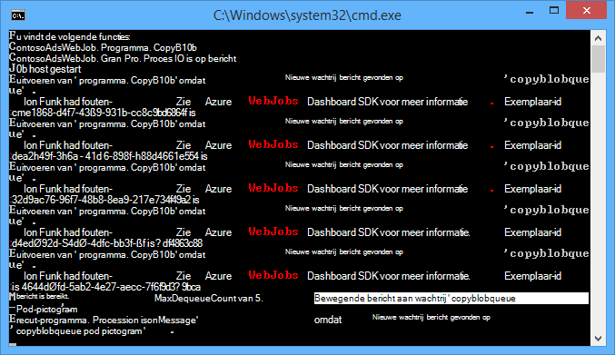
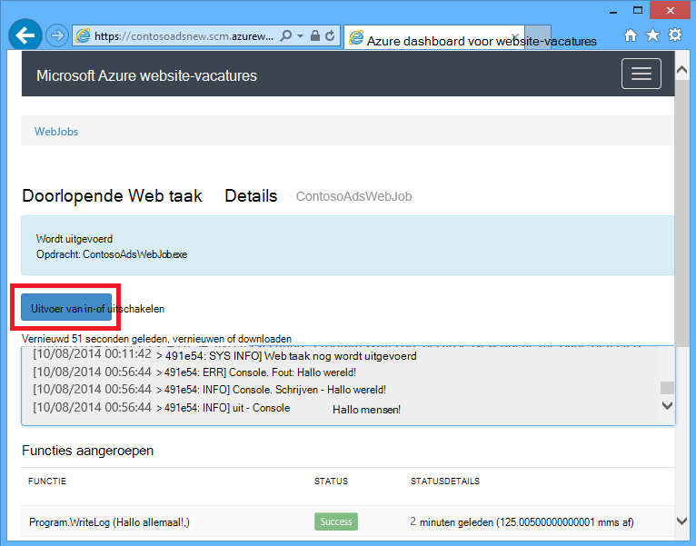
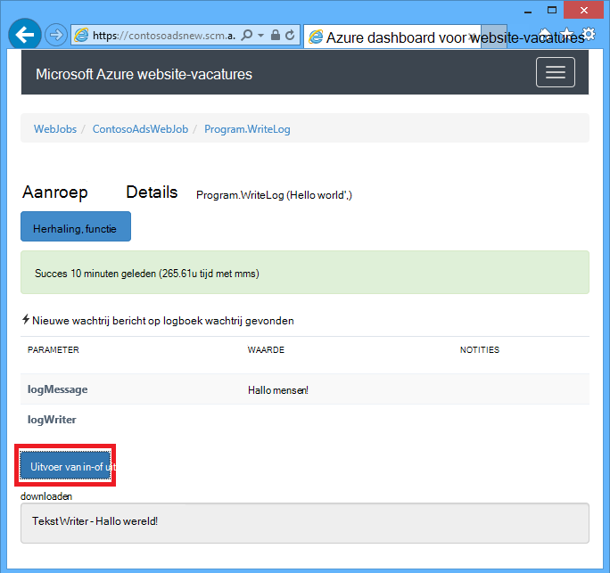
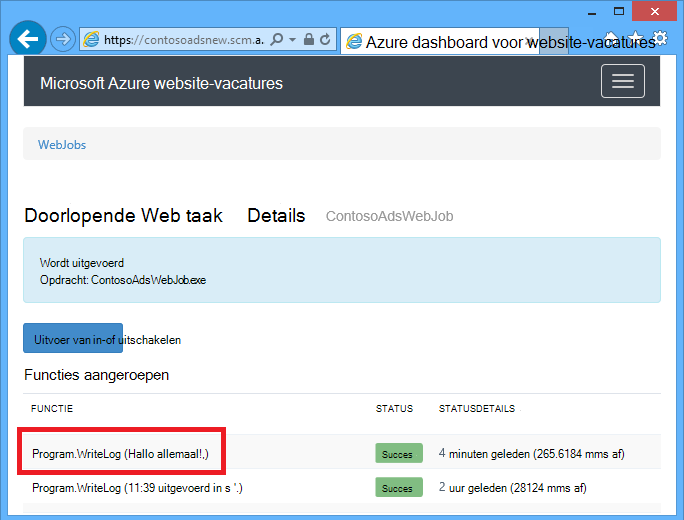
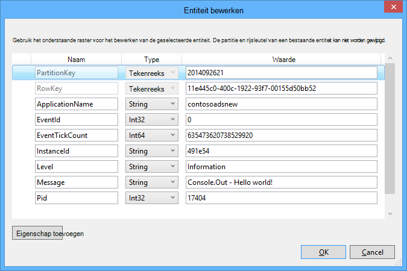
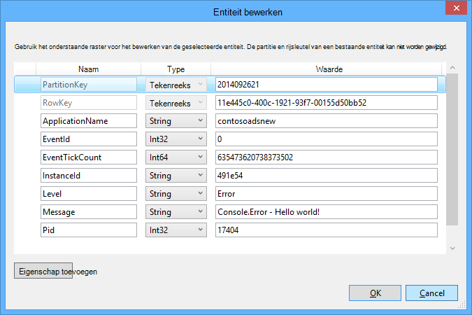

<properties 
    pageTitle="Azure wachtrij opslag gebruiken met de WebJobs SDK" 
    description="Informatie over opslag Azure wachtrij gebruiken met de WebJobs SDK. Maken en verwijderen van wachtrijen; invoegen, kort weergeven, ophalen en verwijderen van berichten, en nog veel meer." 
    services="app-service\web, storage" 
    documentationCenter=".net" 
    authors="tdykstra" 
    manager="wpickett" 
    editor="jimbe"/>

<tags 
    ms.service="app-service-web" 
    ms.workload="web" 
    ms.tgt_pltfrm="na" 
    ms.devlang="dotnet" 
    ms.topic="article" 
    ms.date="06/01/2016" 
    ms.author="tdykstra"/>

# <a name="how-to-use-azure-queue-storage-with-the-webjobs-sdk"></a>Azure wachtrij opslag gebruiken met de WebJobs SDK

## <a name="overview"></a>Overzicht

Deze handleiding bevat C# codevoorbeelden waarin wordt aangegeven hoe de Azure WebJobs SDK versie 1.x met de Azure queue storage-service.

De handleiding wordt ervan uitgegaan dat u weet [hoe u een WebJob-project in Visual Studio met tekenreeksen die naar uw account opslag verwijzen maken](websites-dotnet-webjobs-sdk-get-started.md#configure-storage) of [meerdere accounts voor opslag](https://github.com/Azure/azure-webjobs-sdk/blob/master/test/Microsoft.Azure.WebJobs.Host.EndToEndTests/MultipleStorageAccountsEndToEndTests.cs).

De meeste van de codefragmenten weergeven alleen functies, niet de code waarmee de `JobHost` object, zoals in dit voorbeeld:

        static void Main(string[] args)
        {
            JobHost host = new JobHost();
            host.RunAndBlock();
        }
        
De handleiding bevat de volgende onderwerpen:

-   [Hoe een functie wordt geactiveerd wanneer een wachtrij-bericht is ontvangen.](#trigger)
    - String-berichten
    - POCO-berichten
    - Async-functies
    - Het kenmerk QueueTrigger met werkt typen
    - Polling-algoritme
    - Meerdere exemplaren
    - Parallelle uitvoering
    - Wachtrij of wachtrij bericht metagegevens ophalen
    - Systeem correct wordt afgesloten
-   [Een bericht wachtrij tijdens het verwerken van een wachtrij maken](#createqueue)
    - String-berichten
    - POCO-berichten
    - Maak meerdere berichten of in de asynchrone functies
    - Het kenmerk wachtrij met werkt typen
    - Kenmerken WebJobs SDK in de hoofdtekst van een functie te gebruiken
-   [Het lezen en schrijven van BLOB's tijdens het verwerken van een wachtrij](#blobs)
    - String-berichten
    - POCO-berichten
    - Het kenmerk Blob met werkt typen
-   [Verwerking van gevaarlijke berichten](#poison)
    - Verwerken van verontreinigde berichten automatisch
    - Verwerken van verontreinigde berichten handmatig
-   [Het configuratie-opties instellen](#config)
    - Verbindingsreeksen SDK instellen in code
    - QueueTrigger-instellingen configureren
    - Waarden instellen voor WebJobs SDK constructor parameters in de code
-   [Hoe u handmatig een functie activeren](#manual)
-   [Het schrijven van logboekbestanden](#logs) 
-   [Het afhandelen van fouten en time-outs configureren](#errors)
-   [Volgende stappen](#nextsteps)

## <a id="trigger"></a>Hoe een functie wordt geactiveerd wanneer een wachtrij-bericht is ontvangen.

Als u wilt een functie schrijven die de WebJobs SDK wordt aangeroepen wanneer een wachtrij-bericht wordt ontvangen, gebruikt u de `QueueTrigger` kenmerk. De constructor kenmerk tekenreeksparameter een waarmee de naam van de wachtrij op te vragen. U kunt ook de [naam van de wachtrij dynamisch instellen](#config).

### <a name="string-queue-messages"></a>String-berichten

In het volgende voorbeeld bevat de wachtrij een Tekenreeksbericht, dus `QueueTrigger` wordt toegepast op een parameter string met de naam `logMessage` die de inhoud van het bericht wachtrij bevat. De functie [wordt een logboek voor het Dashboard](#logs).
 

        public static void ProcessQueueMessage([QueueTrigger("logqueue")] string logMessage, TextWriter logger)
        {
            logger.WriteLine(logMessage);
        }

Naast `string`, de parameter kan bestaan uit een matrix van bytes, een `CloudQueueMessage` object of een POCO die u definieert.

### <a name="poco-plain-old-clr-objecthttpenwikipediaorgwikiplainoldclrobject-queue-messages"></a>POCO [(gewone oude CLR-Object](http://en.wikipedia.org/wiki/Plain_Old_CLR_Object)) berichten in de wachtrij

In het volgende voorbeeld bevat het bericht wachtrij JSON voor een `BlobInformation` object met een `BlobName` eigenschap. Het object wordt automatisch deserializes door de SDK.

        public static void WriteLogPOCO([QueueTrigger("logqueue")] BlobInformation blobInfo, TextWriter logger)
        {
            logger.WriteLine("Queue message refers to blob: " + blobInfo.BlobName);
        }

De SDK gebruikt de [Newtonsoft.Json NuGet package](http://www.nuget.org/packages/Newtonsoft.Json) serialiseren en terugconverteren van berichten. Als u berichten in wachtrij plaatsen in een programma dat de WebJobs SDK maakt geen gebruik van maakt, kunt u code zoals in het volgende voorbeeld voor het maken van een bericht POCO wachtrij met de SDK parseren kunt. 

        BlobInformation blobInfo = new BlobInformation() { BlobName = "log.txt" };
        var queueMessage = new CloudQueueMessage(JsonConvert.SerializeObject(blobInfo));
        logQueue.AddMessage(queueMessage);

### <a name="async-functions"></a>Async-functies

De volgende asynchrone functie [schrijft een logboek voor het Dashboard](#logs).

        public async static Task ProcessQueueMessageAsync([QueueTrigger("logqueue")] string logMessage, TextWriter logger)
        {
            await logger.WriteLineAsync(logMessage);
        }

Asynchrone functies duurt een [annulering token](http://www.asp.net/mvc/overview/performance/using-asynchronous-methods-in-aspnet-mvc-4#CancelToken), zoals in het volgende voorbeeld wordt een blob gekopieerd. (Voor een uitleg van de `queueTrigger` tijdelijke aanduiding, Zie de sectie [BLOB's](#blobs) .)

        public async static Task ProcessQueueMessageAsyncCancellationToken(
            [QueueTrigger("blobcopyqueue")] string blobName, 
            [Blob("textblobs/{queueTrigger}",FileAccess.Read)] Stream blobInput,
            [Blob("textblobs/{queueTrigger}-new",FileAccess.Write)] Stream blobOutput,
            CancellationToken token)
        {
            await blobInput.CopyToAsync(blobOutput, 4096, token);
        }

### <a id="qtattributetypes"></a>Het kenmerk QueueTrigger met werkt typen

U kunt `QueueTrigger` met de volgende typen:

* `string`
* Een geserialiseerd als JSON POCO-type
* `byte[]`
* `CloudQueueMessage`

### <a id="polling"></a>Polling-algoritme

De SDK implementeert een willekeurige exponentiële back-off-algoritme het effect van niet-actieve wachtrij polling op transactie opslagkosten verminderen.  Wanneer een bericht wordt gevonden, wordt de SDK Wacht twee seconden en wordt er gecontroleerd of een ander bericht. Wacht ongeveer vier seconden voordat het opnieuw te proberen als er geen bericht is gevonden. De tijd blijft na opeenvolgende mislukte pogingen om een bericht wachtrij te verhogen totdat de maximale wachttijd, namelijk één minuut bereikt. [De maximale wachttijd kan worden geconfigureerd](#config).

### <a id="instances"></a>Meerdere exemplaren

Als uw web app op meerdere instanties wordt uitgevoerd, een continue WebJob wordt uitgevoerd op elke computer en elke machine zal wachten voor triggers en functies uitvoert. De trigger WebJobs SDK wachtrij automatisch wordt voorkomen dat een functie een bericht wachtrij verwerken meerdere keren; functies hoeft niet te worden geschreven om te worden idempotency is ingeschakeld. Als u ervoor wilt zorgen dat slechts één exemplaar van een functie wordt uitgevoerd, zelfs als er meerdere exemplaren van de host web app zijn, kunt u de `Singleton` kenmerk. 

### <a id="parallel"></a>Parallelle uitvoering

Als er meerdere functies in een andere wachtrij luisteren, belt de SDK ze parallel als berichten gelijktijdig worden ontvangen. 

Hetzelfde geldt wanneer meerdere berichten zijn ontvangen voor één wachtrij. De SDK haalt een batch voor 16 berichten tegelijk en standaard wordt de functie die ze parallel verwerkt uitgevoerd. De [grootte van de partij kan worden geconfigureerd](#config). Als het nummer wordt verwerkt naar beneden tot de helft van de grootte van de partij, worden de SDK haalt een andere batch en start de verwerking van die berichten. Daarom is het maximum aantal gelijktijdige berichten per functie verwerkt een anderhalf maal de grootte van de partij. Deze limiet geldt afzonderlijk voor elke functie die is een `QueueTrigger` kenmerk. 

Als u geen parallelle uitvoering voor berichten die worden ontvangen in een wachtrij wilt, kunt u de batchgrootte instellen op 1. Zie ook **meer controle over de verwerking van de wachtrij** in [Azure WebJobs SDK 1.1.0 RTM](/blog/azure-webjobs-sdk-1-1-0-rtm/).

### <a id="queuemetadata"></a>Wachtrij of wachtrij bericht metagegevens ophalen

U kunt de volgende berichteigenschappen opvragen door parameters toe te voegen aan de methodehandtekening:

* `DateTimeOffset`expirationTime
* `DateTimeOffset`insertionTime
* `DateTimeOffset`nextVisibleTime
* `string`queueTrigger (bevat de tekst van bericht)
* `string`ID
* `string`popReceipt
* `int`dequeueCount

Als u werken rechtstreeks met de Azure opslag API wilt, kunt u ook toevoegen een `CloudStorageAccount` parameter.

In het volgende voorbeeld worden alle metagegevens van deze naar een INFO-toepassingslogboek geschreven. In het voorbeeld bevat zowel logMessage als queueTrigger de inhoud van het bericht van de wachtrij.

        public static void WriteLog([QueueTrigger("logqueue")] string logMessage,
            DateTimeOffset expirationTime,
            DateTimeOffset insertionTime,
            DateTimeOffset nextVisibleTime,
            string id,
            string popReceipt,
            int dequeueCount,
            string queueTrigger,
            CloudStorageAccount cloudStorageAccount,
            TextWriter logger)
        {
            logger.WriteLine(
                "logMessage={0}\n" +
            "expirationTime={1}\ninsertionTime={2}\n" +
                "nextVisibleTime={3}\n" +
                "id={4}\npopReceipt={5}\ndequeueCount={6}\n" +
                "queue endpoint={7} queueTrigger={8}",
                logMessage, expirationTime,
                insertionTime,
                nextVisibleTime, id,
                popReceipt, dequeueCount,
                cloudStorageAccount.QueueEndpoint,
                queueTrigger);
        }

Dit is een monster logboek geschreven door de voorbeeldcode:

        logMessage=Hello world!
        expirationTime=10/14/2014 10:31:04 PM +00:00
        insertionTime=10/7/2014 10:31:04 PM +00:00
        nextVisibleTime=10/7/2014 10:41:23 PM +00:00
        id=262e49cd-26d3-4303-ae88-33baf8796d91
        popReceipt=AgAAAAMAAAAAAAAAfc9H0n/izwE=
        dequeueCount=1
        queue endpoint=https://contosoads.queue.core.windows.net/
        queueTrigger=Hello world!

### <a id="graceful"></a>Systeem correct wordt afgesloten

Een functie die wordt uitgevoerd in een continue WebJob accepteert een `CancellationToken` parameter waarmee het besturingssysteem op de hoogte stellen van de functie als de WebJob wordt beëindigd. U kunt dit bericht om ervoor te zorgen dat de functie niet wordt onverwacht beëindigd op een manier die blijven de gegevens in een inconsistente toestand.

In het volgende voorbeeld ziet u hoe om te controleren voor beëindiging van een dreigende WebJob in een functie.

    public static void GracefulShutdownDemo(
                [QueueTrigger("inputqueue")] string inputText,
                TextWriter logger,
                CancellationToken token)
    {
        for (int i = 0; i < 100; i++)
        {
            if (token.IsCancellationRequested)
            {
                logger.WriteLine("Function was cancelled at iteration {0}", i);
                break;
            }
            Thread.Sleep(1000);
            logger.WriteLine("Normal processing for queue message={0}", inputText);
        }
    }

**Opmerking:** Het Dashboard mogelijk niet correct weergegeven de status en de uitvoer van de functies die zijn afgesloten.
 
Zie voor meer informatie [WebJobs systeem correct wordt afgesloten](http://blog.amitapple.com/post/2014/05/webjobs-graceful-shutdown/#.VCt1GXl0wpR).   

## <a id="createqueue"></a>Een bericht wachtrij tijdens het verwerken van een wachtrij maken

Als u wilt een functie schrijven die een nieuw bericht in de wachtrij wordt gemaakt, gebruikt u de `Queue` kenmerk. Net als `QueueTrigger`, u in de naam van de wachtrij als een tekenreeks doorgeven of u kunt [de naam van de wachtrij dynamisch instellen](#config).

### <a name="string-queue-messages"></a>String-berichten

In het volgende voorbeeld niet async maakt een nieuw bericht in de wachtrij in de wachtrij met de naam 'outputqueue' met dezelfde inhoud als de wachtrij bericht in de wachtrij met de naam 'inputqueue'. (Gebruik voor asynchrone functies `IAsyncCollector<T>` zoals verderop in deze sectie wordt weergegeven.)


        public static void CreateQueueMessage(
            [QueueTrigger("inputqueue")] string queueMessage,
            [Queue("outputqueue")] out string outputQueueMessage )
        {
            outputQueueMessage = queueMessage;
        }
  
### <a name="poco-plain-old-clr-objecthttpenwikipediaorgwikiplainoldclrobject-queue-messages"></a>POCO [(gewone oude CLR-Object](http://en.wikipedia.org/wiki/Plain_Old_CLR_Object)) berichten in de wachtrij

Een wachtrij om bericht te maken dat een POCO in plaats van een tekenreeks bevat, het type POCO als een uitvoerparameter doorgeven om de `Queue` kenmerkconstructie.
 
        public static void CreateQueueMessage(
            [QueueTrigger("inputqueue")] BlobInformation blobInfoInput,
            [Queue("outputqueue")] out BlobInformation blobInfoOutput )
        {
            blobInfoOutput = blobInfoInput;
        }

De SDK serialiseert automatisch de JSON-object. Een wachtrij-bericht wordt altijd gemaakt, zelfs als het object null is.

### <a name="create-multiple-messages-or-in-async-functions"></a>Maak meerdere berichten of in de asynchrone functies

Om meerdere berichten maken, maken het parametertype voor de wachtrij uitvoer `ICollector<T>` of `IAsyncCollector<T>`, zoals in het volgende voorbeeld wordt weergegeven.

        public static void CreateQueueMessages(
            [QueueTrigger("inputqueue")] string queueMessage,
            [Queue("outputqueue")] ICollector<string> outputQueueMessage,
            TextWriter logger)
        {
            logger.WriteLine("Creating 2 messages in outputqueue");
            outputQueueMessage.Add(queueMessage + "1");
            outputQueueMessage.Add(queueMessage + "2");
        }

Elk bericht wachtrij wordt onmiddellijk gemaakt wanneer de `Add` methode wordt aangeroepen.

### <a name="types-that-the-queue-attribute-works-with"></a>Typen die geschikt is voor de wachtrij kenmerk

U kunt de `Queue` kenmerk voor de volgende parameter:

* `out string`(bericht wachtrij maakt als parameterwaarde niet null is wanneer de functie eindigt)
* `out byte[]`(werkt als `string`) 
* `out CloudQueueMessage`(werkt als `string`) 
* `out POCO`(een serialiseerbaar type een bericht maken met een null-object als de parameter null is wanneer de functie eindigt)
* `ICollector`
* `IAsyncCollector`
* `CloudQueue`(voor het maken van berichten handmatig rechtstreeks via de API van Azure opslag)

### <a id="ibinder"></a>Kenmerken WebJobs SDK in de hoofdtekst van een functie te gebruiken

Als u werken in de functie wilt voordat u een kenmerk WebJobs SDK, zoals `Queue`, `Blob`, of `Table`, kunt u de `IBinder` interface.

In het volgende voorbeeld wordt een invoerwachtrij bericht en maakt u een nieuw bericht met dezelfde inhoud in een wachtrij voor uitvoer. De wachtrijnaam uitvoer wordt ingesteld door de code in de hoofdtekst van de functie.

        public static void CreateQueueMessage(
            [QueueTrigger("inputqueue")] string queueMessage,
            IBinder binder)
        {
            string outputQueueName = "outputqueue" + DateTime.Now.Month.ToString();
            QueueAttribute queueAttribute = new QueueAttribute(outputQueueName);
            CloudQueue outputQueue = binder.Bind<CloudQueue>(queueAttribute);
            outputQueue.AddMessage(new CloudQueueMessage(queueMessage));
        }

De `IBinder` interface kan ook worden gebruikt met de `Table` en `Blob` kenmerken.

## <a id="blobs"></a>Het lezen en schrijven van BLOB's en tabellen bij het verwerken van een wachtrij

De `Blob` en `Table` kenmerken kunnen u lezen en schrijven van BLOB's en tabellen. De voorbeelden in deze sectie van toepassing op de BLOB's. Voor codevoorbeelden waarin wordt aangegeven hoe u processen starten als BLOB's worden gemaakt of bijgewerkt, Zie [het gebruik van Azure blobopslag met de WebJobs SDK](websites-dotnet-webjobs-sdk-storage-blobs-how-to.md)en voor codevoorbeelden die lezen en schrijven van tabellen, [Azure tabelopslag met de WebJobs SDK gebruiken](websites-dotnet-webjobs-sdk-storage-tables-how-to.md).

### <a name="string-queue-messages-triggering-blob-operations"></a>Wachtrijberichten String bewerkingen blob activeren

Voor een wachtrij-bericht met een tekenreeks, `queueTrigger` is een tijdelijke aanduiding die u kunt gebruiken in de `Blob` van het kenmerk `blobPath` -parameter die de inhoud van het bericht bevat. 

In het volgende voorbeeld wordt `Stream` objecten lezen en schrijven van BLOB's. Het bericht van de wachtrij is de naam van een blob die zich in de container textblobs. Een kopie van de blob met '-nieuwe ' toegevoegd aan de naam in dezelfde container wordt gemaakt. 

        public static void ProcessQueueMessage(
            [QueueTrigger("blobcopyqueue")] string blobName, 
            [Blob("textblobs/{queueTrigger}",FileAccess.Read)] Stream blobInput,
            [Blob("textblobs/{queueTrigger}-new",FileAccess.Write)] Stream blobOutput)
        {
            blobInput.CopyTo(blobOutput, 4096);
        }

De `Blob` kenmerk constructor wordt een `blobPath` parameter die de naam van de container en de blob. Zie voor meer informatie over deze tijdelijke aanduiding [gebruiken Azure blobopslag met de SDK van WebJobs](websites-dotnet-webjobs-sdk-storage-blobs-how-to.md), 

Wanneer het kenmerk wordt verfraaid een `Stream` object, een andere constructor parameter geeft u de `FileAccess` modus als lezen, schrijven of lezen/schrijven. 

In het volgende voorbeeld wordt een `CloudBlockBlob` te verwijderen van een blob object. Het bericht van de wachtrij is de naam van de blob.

        public static void DeleteBlob(
            [QueueTrigger("deleteblobqueue")] string blobName,
            [Blob("textblobs/{queueTrigger}")] CloudBlockBlob blobToDelete)
        {
            blobToDelete.Delete();
        }

### <a id="pocoblobs"></a>POCO [(gewone oude CLR-Object](http://en.wikipedia.org/wiki/Plain_Old_CLR_Object)) berichten in de wachtrij

Voor een POCO als JSON in het bericht wachtrij opgeslagen, kunt u tijdelijke aanduidingen die de naam van het object in de `Queue` van het kenmerk `blobPath` parameter. U kunt ook [metagegevens wachtrijnamen](#queuemetadata) gebruiken als tijdelijke aanduidingen. 

In het volgende voorbeeld wordt een blob kopieert naar een nieuwe blob met een andere extensie. Het bericht van de wachtrij is een `BlobInformation` -object met `BlobName` en `BlobNameWithoutExtension` eigenschappen. De namen van eigenschappen worden gebruikt als tijdelijke aanduidingen in de blob-pad voor de `Blob` kenmerken. 
 
        public static void CopyBlobPOCO(
            [QueueTrigger("copyblobqueue")] BlobInformation blobInfo,
            [Blob("textblobs/{BlobName}", FileAccess.Read)] Stream blobInput,
            [Blob("textblobs/{BlobNameWithoutExtension}.txt", FileAccess.Write)] Stream blobOutput)
        {
            blobInput.CopyTo(blobOutput, 4096);
        }

De SDK gebruikt de [Newtonsoft.Json NuGet package](http://www.nuget.org/packages/Newtonsoft.Json) serialiseren en terugconverteren van berichten. Als u berichten in wachtrij plaatsen in een programma dat de WebJobs SDK maakt geen gebruik van maakt, kunt u code zoals in het volgende voorbeeld voor het maken van een bericht POCO wachtrij met de SDK parseren kunt.

        BlobInformation blobInfo = new BlobInformation() { BlobName = "boot.log", BlobNameWithoutExtension = "boot" };
        var queueMessage = new CloudQueueMessage(JsonConvert.SerializeObject(blobInfo));
        logQueue.AddMessage(queueMessage);

Als u werken in de functie wilt voor een blob binden aan een object, kunt u het kenmerk in de hoofdtekst van de functie, [zoals eerder voor het kenmerk van de wachtrij](#ibinder).

### <a id="blobattributetypes"></a>U het kenmerk Blob met kunt typen
 
De `Blob` kenmerk kan worden gebruikt met de volgende typen:

* `Stream`(Lees- of schrijfbewerkingen zijn, opgegeven met de parameter van de constructor FileAccess)
* `TextReader`
* `TextWriter`
* `string`(lezen)
* `out string`(schrijven, alleen als de tekenreeksparameter niet null is wanneer de functie resulteert in een blob maakt)
* POCO (lezen)
* uit POCO (schrijven; altijd een blob wordt gemaakt, wordt gemaakt als null-object als parameter POCO null is, de functie als resultaat wordt gegeven)
* `CloudBlobStream`(schrijven)
* `ICloudBlob`(Lees- of schrijftoegang)
* `CloudBlockBlob`(Lees- of schrijftoegang) 
* `CloudPageBlob`(Lees- of schrijftoegang) 

## <a id="poison"></a>Verwerking van gevaarlijke berichten

*Gevaarlijke berichten*, worden berichten waarvan de inhoud zorgt ervoor een functie dat niet genoemd. Wanneer de functie is mislukt, wordt het bericht wachtrij wordt niet verwijderd en uiteindelijk is opgenomen, waardoor de cyclus worden herhaald. De SDK kan automatisch de cyclus onderbreken na een beperkt aantal iteraties, of u kunt dit handmatig doen.

### <a name="automatic-poison-message-handling"></a>Verwerken van verontreinigde berichten automatisch

De SDK wordt een functie maximaal 5 keer aanroept voor het verwerken van een wachtrij. Als de vijfde poging mislukt, wordt het bericht verplaatst naar een wachtrij poison. [Het maximum aantal pogingen kan worden geconfigureerd](#config). 

De wachtrij verontreinigd is met de naam *{originalqueuename}*-poison. U kunt schrijven een functie op berichten uit de wachtrij verontreinigd door deze registratie of het verzenden van een melding die handmatige aandacht nodig is. 

In het volgende voorbeeld de `CopyBlob` functie, mislukken wanneer een bericht wachtrij bevat de naam van een blob die niet bestaat. Wanneer dat gebeurt, wordt het bericht uit de wachtrij copyblobqueue verplaatst naar de wachtrij copyblobqueue poison. De `ProcessPoisonMessage` verontreinigd bericht vervolgens aanmeldt.

        public static void CopyBlob(
            [QueueTrigger("copyblobqueue")] string blobName,
            [Blob("textblobs/{queueTrigger}", FileAccess.Read)] Stream blobInput,
            [Blob("textblobs/{queueTrigger}-new", FileAccess.Write)] Stream blobOutput)
        {
            blobInput.CopyTo(blobOutput, 4096);
        }
        
        public static void ProcessPoisonMessage(
            [QueueTrigger("copyblobqueue-poison")] string blobName, TextWriter logger)
        {
            logger.WriteLine("Failed to copy blob, name=" + blobName);
        }

De volgende illustratie toont de console-uitvoer van deze functies wanneer een poison-bericht wordt verwerkt.



### <a name="manual-poison-message-handling"></a>Verwerken van verontreinigde berichten handmatig

Krijgt u het aantal keren dat een bericht trok voor verwerking door het toevoegen van een `int` parameter met de naam `dequeueCount` aan de functie. U kunt vervolgens de wachtrij halen telling in de functiecode te controleren en uitvoeren van uw eigen poison afhandeling van berichten als het getal groter is dan een drempelwaarde, zoals in het volgende voorbeeld.

        public static void CopyBlob(
            [QueueTrigger("copyblobqueue")] string blobName, int dequeueCount,
            [Blob("textblobs/{queueTrigger}", FileAccess.Read)] Stream blobInput,
            [Blob("textblobs/{queueTrigger}-new", FileAccess.Write)] Stream blobOutput,
            TextWriter logger)
        {
            if (dequeueCount > 3)
            {
                logger.WriteLine("Failed to copy blob, name=" + blobName);
            }
            else
            {
            blobInput.CopyTo(blobOutput, 4096);
            }
        }

## <a id="config"></a>Het configuratie-opties instellen

U kunt de `JobHostConfiguration` type in te stellen van de volgende configuratieopties:

* De SDK-verbindingsreeksen in code instellen.
* Configureren `QueueTrigger` instellingen, zoals het maximum aantal uit de wachtrij halen.
* Namen van wachtrijen ophalen van configuratie.

### <a id="setconnstr"></a>Verbindingsreeksen SDK instellen in code

De SDK-verbindingsreeksen instellen in code kunt u uw eigen verbinding tekenreeksnamen in configuratiebestanden of omgevingsvariabelen, zoals in het volgende voorbeeld wordt getoond.

        static void Main(string[] args)
        {
            var _storageConn = ConfigurationManager
                .ConnectionStrings["MyStorageConnection"].ConnectionString;
        
            var _dashboardConn = ConfigurationManager
                .ConnectionStrings["MyDashboardConnection"].ConnectionString;
        
            var _serviceBusConn = ConfigurationManager
                .ConnectionStrings["MyServiceBusConnection"].ConnectionString;
        
            JobHostConfiguration config = new JobHostConfiguration();
            config.StorageConnectionString = _storageConn;
            config.DashboardConnectionString = _dashboardConn;
            config.ServiceBusConnectionString = _serviceBusConn;
            JobHost host = new JobHost(config);
            host.RunAndBlock();
        }

### <a id="configqueue"></a>QueueTrigger-instellingen configureren

U kunt de volgende instellingen die voor de verwerking van de wachtrij berichten gelden configureren:

- Het maximum aantal berichten die gelijktijdig worden parallel uitgevoerd worden opgenomen (standaard is 16).
- Het maximum aantal pogingen voordat een bericht wachtrij wordt verzonden naar een wachtrij poison (de standaardwaarde is 5).
- De maximale wachttijd voordat het opnieuw polling wanneer een wachtrij leeg is (de standaardinstelling is 1 minuut).

In het volgende voorbeeld ziet u hoe u deze instellingen configureren:

        static void Main(string[] args)
        {
            JobHostConfiguration config = new JobHostConfiguration();
            config.Queues.BatchSize = 8;
            config.Queues.MaxDequeueCount = 4;
            config.Queues.MaxPollingInterval = TimeSpan.FromSeconds(15);
            JobHost host = new JobHost(config);
            host.RunAndBlock();
        }

### <a id="setnamesincode"></a>Waarden instellen voor WebJobs SDK constructor parameters in de code

Soms wilt u een wachtrijnaam, een blob-naam of de container opgeven of een tabel de naam in plaats van harde code code. Bijvoorbeeld: u kunt opgeven voor de naam van de wachtrij `QueueTrigger` in een configuratie-bestand of de omgeving variabele. 

U kunt dit doen door doorgeven in een `NameResolver` object toe aan de `JobHostConfiguration` type. U de speciale tijdelijke aanduidingen omgeven door tekenen procent (%) in de WebJobs SDK kenmerk constructor parameters opnemen en uw `NameResolver` code geeft de werkelijke waarden worden gebruikt in plaats van de tijdelijke aanduidingen.

Stel bijvoorbeeld dat u wilt gebruiken een wachtrij met de naam logqueuetest in de testomgeving en één met de naam logqueueprod in de productie. In plaats van een hardcoded wachtrijnaam die u wilt de naam opgeven van een vermelding in de `appSettings` -collectie die de werkelijke wachtrijnaam zou hebben. Als de `appSettings` sleutel logqueue, wordt de functie eruit als in het volgende voorbeeld.

        public static void WriteLog([QueueTrigger("%logqueue%")] string logMessage)
        {
            Console.WriteLine(logMessage);
        }

Uw `NameResolver` klasse kan vervolgens de naam van de wachtrij ophalen `appSettings` zoals in het volgende voorbeeld wordt getoond:

        public class QueueNameResolver : INameResolver
        {
            public string Resolve(string name)
            {
                return ConfigurationManager.AppSettings[name].ToString();
            }
        }

Geeft u de `NameResolver` in klasse aan de `JobHost` object, zoals in het volgende voorbeeld wordt getoond.

        static void Main(string[] args)
        {
            JobHostConfiguration config = new JobHostConfiguration();
            config.NameResolver = new QueueNameResolver();
            JobHost host = new JobHost(config);
            host.RunAndBlock();
        }
 
**Opmerking:** Wachtrij-, tabel- en blob-namen worden herleid, telkens wanneer een functie wordt aangeroepen, maar de blob container namen worden omgezet, alleen wanneer de toepassing wordt gestart. U kunt de containernaam blob niet wijzigen terwijl de taak wordt uitgevoerd. 

## <a id="manual"></a>Hoe u handmatig een functie activeren

Gebruiken als u wilt een functie handmatig activeren, de `Call` of `CallAsync` methode op de `JobHost` object en de `NoAutomaticTrigger` kenmerken van de functie, zoals in het volgende voorbeeld. 

        public class Program
        {
            static void Main(string[] args)
            {
                JobHost host = new JobHost();
                host.Call(typeof(Program).GetMethod("CreateQueueMessage"), new { value = "Hello world!" });
            }
        
            [NoAutomaticTrigger]
            public static void CreateQueueMessage(
                TextWriter logger, 
                string value, 
                [Queue("outputqueue")] out string message)
            {
                message = value;
                logger.WriteLine("Creating queue message: ", message);
            }
        }

## <a id="logs"></a>Het schrijven van logboekbestanden

Het Dashboard ziet u Logboeken op twee plaatsen: de pagina voor de WebJob en de pagina voor een specifieke WebJob-aanroep. 





Uitvoer van Console-methoden die u in een functie aanroepen of in de `Main()` wordt weergegeven in de Dashboard-pagina voor de WebJob, niet in de pagina voor het oproepen van een bepaalde methode. Uitvoer van de TextWriter-object dat u van een parameter in de methodehandtekening ontvangt wordt weergegeven op de pagina van het Dashboard voor een methodeaanroep.

Console-uitvoer kan niet worden gekoppeld aan een bepaalde methode aanroepen omdat de Console één thread, is terwijl veel functies tegelijkertijd kunnen worden uitgevoerd. Daarom is de SDK vindt u elke functie-aanroep met zijn eigen unieke logboek writer-object.

Gebruiken om te schrijven [traceringslogboeken toepassing](web-sites-dotnet-troubleshoot-visual-studio.md#logsoverview), `Console.Out` (wordt gemaakt van logboekbestanden die zijn gemarkeerd als INFO) en `Console.Error` (maakt u zich aanmeldt als fout gemarkeerd). Een alternatief is het [traceren of TraceSource](http://blogs.msdn.com/b/mcsuksoldev/archive/2014/09/04/adding-trace-to-azure-web-sites-and-web-jobs.aspx), biedt uitgebreid-, waarschuwings- en kritische niveaus naast Info en fout. Toepassing traceringslogboeken worden weergegeven in de logboekbestanden web app, Azure tabellen, of Azure BLOB's afhankelijk van hoe u uw Azure web app configureren. Geldt voor alle uitvoer van de Console, weergegeven de meest recente 100 toepassingslogboeken ook in de Dashboard-pagina voor de WebJob, niet op de pagina voor een functie-aanroep. 

Console-uitvoer wordt weergegeven in het Dashboard alleen als het programma wordt uitgevoerd in een WebJob Azure niet als het programma wordt uitgevoerd, lokaal of in een andere omgeving.

Uitschakelen van logboekregistratie voor scenario's hoge doorvoer dashboard. De SDK schrijft logboekbestanden naar de opslag en deze activiteit kan de prestaties nadelig beïnvloeden wanneer u veel berichten verwerkt. Als logboekregistratie wilt uitschakelen, stelt u de verbindingsreeks dashboard op null, zoals in het volgende voorbeeld wordt getoond.

        JobHostConfiguration config = new JobHostConfiguration();       
        config.DashboardConnectionString = "";        
        JobHost host = new JobHost(config);
        host.RunAndBlock();

In het volgende voorbeeld ziet u verschillende manieren naar Logboeken geschreven:

        public static void WriteLog(
            [QueueTrigger("logqueue")] string logMessage,
            TextWriter logger)
        {
            Console.WriteLine("Console.Write - " + logMessage);
            Console.Out.WriteLine("Console.Out - " + logMessage);
            Console.Error.WriteLine("Console.Error - " + logMessage);
            logger.WriteLine("TextWriter - " + logMessage);
        }

In de WebJobs SDK Dashboard, de uitvoer van de `TextWriter` wanneer u naar de pagina voor een bepaald gaat object wordt functie aanroepen en klik op **Uitvoer van in-of uitschakelen**:




In het Dashboard van de SDK WebJobs de laatste 100 regels van de Console-uitvoer weergeven van wanneer u gaat u naar de pagina van de WebJob (niet voor de functie-aanroep) en klik op **Uitvoer van in-of uitschakelen**.
 


In een doorlopende WebJob weergegeven toepassingslogboeken in data/taken/continue /*{webjobname}*/job_log.txt in het bestandssysteem van de web app.

        [09/26/2014 21:01:13 > 491e54: INFO] Console.Write - Hello world!
        [09/26/2014 21:01:13 > 491e54: ERR ] Console.Error - Hello world!
        [09/26/2014 21:01:13 > 491e54: INFO] Console.Out - Hello world!

In een Azure blob-het uiterlijk van de toepassing Logboeken als volgt: 2014-09-26T21:01:13,Information,contosoadsnew,491e54,635473620738373502,0,17404,17,Console.Write - Hallo allemaal!, 2014-09-26T21:01:13,Error,contosoadsnew,491e54,635473620738373502,0,17404,19,Console.Error - Hallo allemaal!, 2014-09-26T21:01:13,Information,contosoadsnew,491e54,635473620738529920,0,17404,17,Console.Out - Hallo allemaal!,

En in een tabel Azure de `Console.Out` en `Console.Error` ziet er zo uit logboeken:





Als u uw eigen logger aansluit wilt, Zie [dit voorbeeld](http://github.com/Azure/azure-webjobs-sdk-samples/blob/master/BasicSamples/MiscOperations/Program.cs).

## <a id="errors"></a>Het afhandelen van fouten en time-outs configureren

De WebJobs SDK bevat ook een [time-out](http://github.com/Azure/azure-webjobs-sdk-samples/blob/master/BasicSamples/MiscOperations/Functions.cs) kenmerk kunt u een functie om te worden geannuleerd als er binnen een opgegeven tijd niet wordt voltooid. En als u verhogen van een waarschuwing wilt wanneer er te veel fouten gebeuren binnen een bepaalde periode, kunt u de `ErrorTrigger` kenmerk. Hier volgt een [voorbeeld van de ErrorTrigger](https://github.com/Azure/azure-webjobs-sdk-extensions/wiki/Error-Monitoring).

```
public static void ErrorMonitor(
[ErrorTrigger("00:01:00", 1)] TraceFilter filter, TextWriter log,
[SendGrid(
    To = "admin@emailaddress.com",
    Subject = "Error!")]
 SendGridMessage message)
{
    // log last 5 detailed errors to the Dashboard
   log.WriteLine(filter.GetDetailedMessage(5));
   message.Text = filter.GetDetailedMessage(1);
}
```

U kunt ook dynamisch uitschakelen en inschakelen van functies om te bepalen of ze kunnen worden geactiveerd, met behulp van een configuratie switch die mogelijk een app instellen of de naam van een omgevingsvariabele. Zie voor een voorbeeld van code, het `Disable` attribuut in [de opslagplaats van de monsters WebJobs SDK](https://github.com/Azure/azure-webjobs-sdk-samples/blob/master/BasicSamples/MiscOperations/Functions.cs).

## <a id="nextsteps"></a>Volgende stappen

Deze handleiding heeft verstrekt codevoorbeelden waarin wordt aangegeven hoe u veelvoorkomende scenario's voor het werken met Azure wachtrijen verwerken. Zie voor meer informatie over het gebruik van Azure WebJobs en de WebJobs SDK [Azure WebJobs aanbevolen bronnen](http://go.microsoft.com/fwlink/?linkid=390226).
 
