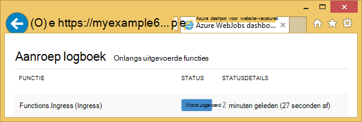
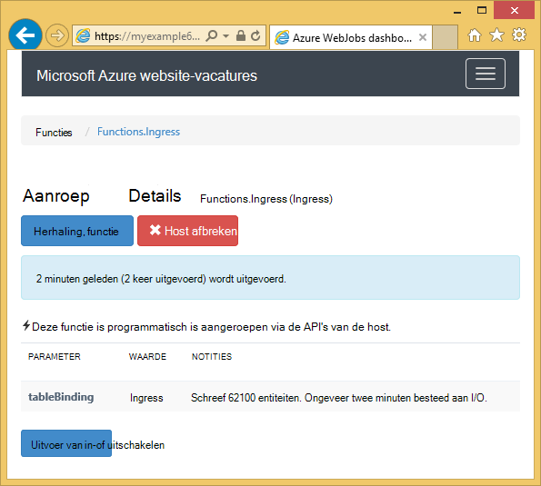
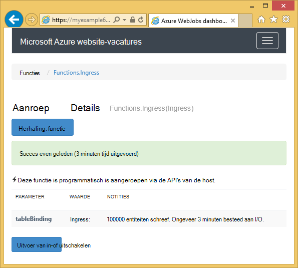

<properties 
    pageTitle="Azure tabelopslag gebruiken met de WebJobs SDK" 
    description="Informatie over het Azure tabelopslag gebruiken met de WebJobs SDK. Tabellen maken en bestaande tabellen lezen entiteiten toevoegen aan tabellen." 
    services="app-service\web, storage" 
    documentationCenter=".net" 
    authors="tdykstra" 
    manager="wpickett" 
    editor="jimbe"/>

<tags 
    ms.service="app-service-web" 
    ms.workload="web" 
    ms.tgt_pltfrm="na" 
    ms.devlang="dotnet" 
    ms.topic="article" 
    ms.date="06/01/2016" 
    ms.author="tdykstra"/>

# Azure tabelopslag gebruiken met de WebJobs SDK

## Overzicht

Deze handleiding bevat C# codevoorbeelden die hoe lezen en schrijven van Azure opslag tabellen tonen met behulp van [WebJobs SDK](websites-dotnet-webjobs-sdk.md) versie 1.x.

De handleiding wordt ervan uitgegaan dat u weet [hoe u een WebJob-project in Visual Studio met tekenreeksen die naar uw account opslag verwijzen maken](websites-dotnet-webjobs-sdk-get-started.md) of [meerdere accounts voor opslag](https://github.com/Azure/azure-webjobs-sdk/blob/master/test/Microsoft.Azure.WebJobs.Host.EndToEndTests/MultipleStorageAccountsEndToEndTests.cs).
        
Sommige van de codefragmenten tonen de `Table` kenmerk gebruikt voor functies die [handmatig wordt genoemd](websites-dotnet-webjobs-sdk-storage-queues-how-to.md#manual), dat wil zeggen, niet met behulp van een van de kenmerken van de trigger. 

## Entiteiten toevoegen aan een tabel

U kunt entiteiten toevoegen aan een tabel met de `Table` met het kenmerk een `ICollector<T>` of `IAsyncCollector<T>` parameter waar `T` geeft het schema van de entiteiten die u wilt toevoegen. De constructor kenmerk tekenreeksparameter een waarmee de naam van de tabel. 

In het volgende voorbeeld wordt `Person` entiteiten aan een tabel met de naam *Ingress*.

        [NoAutomaticTrigger]
        public static void IngressDemo(
            [Table("Ingress")] ICollector<Person> tableBinding)
        {
            for (int i = 0; i < 100000; i++)
            {
                tableBinding.Add(
                    new Person() { 
                        PartitionKey = "Test", 
                        RowKey = i.ToString(), 
                        Name = "Name" }
                    );
            }
        }

Meestal het type u gebruiken met `ICollector` is afgeleid van `TableEntity` of geïmplementeerd `ITableEntity`, maar deze niet hoeven te worden. Een van de volgende `Person` werk met de code die wordt weergegeven in de voorgaande klassen `Ingress` methode.

        public class Person : TableEntity
        {
            public string Name { get; set; }
        }

        public class Person
        {
            public string PartitionKey { get; set; }
            public string RowKey { get; set; }
            public string Name { get; set; }
        }

Als u werken rechtstreeks met de Azure opslag API wilt, kunt u toevoegen een `CloudStorageAccount` -parameter voor de handtekening van de methode.

## Realtime-controle

Omdat gegevens ingress-functies worden vaak grote hoeveelheden gegevens verwerken, kunt u het dashboard WebJobs SDK real-time bewaking verkregen gegevens. De sectie **Aanroep logboek** kunt u zien als de functie is nog actief.

De pagina **Details van de aanroep** van de functie voortgang (aantal entiteiten geschreven) rapporteert terwijl deze wordt uitgevoerd en hebt u de mogelijkheid om af te breken op deze. 

Wanneer de functie is voltooid, meldt de **Aanroep** pagina het aantal rijen is geschreven.

## Het lezen van meerdere entiteiten uit een tabel

Gebruiken om te lezen in een tabel, de `Table` attribuut met een `IQueryable<T>` parameter waar `T` is afgeleid van `TableEntity` of geïmplementeerd `ITableEntity`.

In het volgende voorbeeld leest en worden alle rijen van de `Ingress` tabel:
 
        public static void ReadTable(
            [Table("Ingress")] IQueryable<Person> tableBinding,
            TextWriter logger)
        {
            var query = from p in tableBinding select p;
            foreach (Person person in query)
            {
                logger.WriteLine("PK:{0}, RK:{1}, Name:{2}", 
                    person.PartitionKey, person.RowKey, person.Name);
            }
        }

### Een enkele entiteit te lezen uit een tabel

Er is een `Table` attribuutconstructor met twee extra parameters die u u de partitie en rijsleutel opgeven kunt als u wilt binden aan een entiteit één tabel.

In het volgende voorbeeld wordt rij in een tabel voor een `Person` entiteit op basis van partitie-toets en de rij sleutelwaarden in een wachtrij bericht ontvangen:  

        public static void ReadTableEntity(
            [QueueTrigger("inputqueue")] Person personInQueue,
            [Table("persontable","{PartitionKey}", "{RowKey}")] Person personInTable,
            TextWriter logger)
        {
            if (personInTable == null)
            {
                logger.WriteLine("Person not found: PK:{0}, RK:{1}",
                        personInQueue.PartitionKey, personInQueue.RowKey);
            }
            else
            {
                logger.WriteLine("Person found: PK:{0}, RK:{1}, Name:{2}",
                        personInTable.PartitionKey, personInTable.RowKey, personInTable.Name);
            }
        }

De `Person` heeft geen klasse in dit voorbeeld voor het implementeren van `ITableEntity`.

## Het gebruik van de API van .NET opslag direct te werken met een tabel

U kunt ook de `Table` van het kenmerk met een `CloudTable` -object voor meer flexibiliteit bij het werken met een tabel.

De volgende code wordt een `CloudTable` object één enkele entiteit toevoegen aan de tabel *Ingress* . 
 
        public static void UseStorageAPI(
            [Table("Ingress")] CloudTable tableBinding,
            TextWriter logger)
        {
            var person = new Person()
                {
                    PartitionKey = "Test",
                    RowKey = "100",
                    Name = "Name"
                };
            TableOperation insertOperation = TableOperation.Insert(person);
            tableBinding.Execute(insertOperation);
        }

Voor meer informatie over het gebruik van de `CloudTable` object, Zie [tabelopslag van .NET gebruiken](../storage/storage-dotnet-how-to-use-tables.md). 

## Verwante onderwerpen waarvoor het artikel wachtrijen

Voor informatie over het afhandelen van tabellen verwerken die zijn gegenereerd door een bericht wachtrij of voor de WebJobs SDK scenario's niet voor tabel verwerking, Zie [How to use Azure wachtrij opslag met de WebJobs SDK](websites-dotnet-webjobs-sdk-storage-queues-how-to.md). 

Onderwerpen in dit artikel zijn de volgende:

* Async-functies
* Meerdere exemplaren
* Systeem correct wordt afgesloten
* Kenmerken WebJobs SDK in de hoofdtekst van een functie te gebruiken
* De SDK-verbindingsreeksen instellen in code
* Waarden instellen voor WebJobs SDK constructor parameters in de code
* Handmatig een functie activeren
* Schrijven van Logboeken

## Volgende stappen

Deze handleiding heeft verstrekt codevoorbeelden waarin wordt aangegeven hoe u veelvoorkomende scenario's voor het werken met Azure tabellen verwerken. Zie voor meer informatie over het gebruik van Azure WebJobs en de WebJobs SDK [Azure WebJobs aanbevolen bronnen](http://go.microsoft.com/fwlink/?linkid=390226).
 
