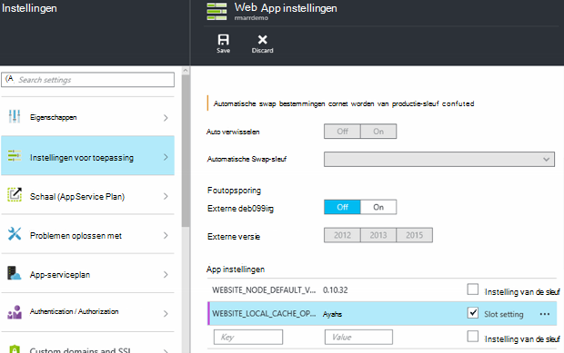

<properties
   pageTitle="Azure lokale Cache van de Service App-overzicht | Microsoft Azure"
   description="Dit artikel wordt beschreven hoe u kunt inschakelen, grootte en de status van de functie van de lokale Cache van Azure App Service opvragen"
   services="app-service"
   documentationCenter="app-service"
   authors="SyntaxC4"
   manager="yochayk"
   editor=""
   tags="optional"
   keywords=""/>

<tags
   ms.service="app-service"
   ms.devlang="multiple"
   ms.topic="article"
   ms.tgt_pltfrm="na"
   ms.workload="na"
   ms.date="03/04/2016"
   ms.author="cfowler"/>

# <a name="azure-app-service-local-cache-overview"></a>Azure App lokale Cache van de Service-overzicht

Azure web app inhoud is opgeslagen op de opslag van Azure en zichtbaar is boven op een duurzame manier aandeel in de inhoud. Dit ontwerp is bedoeld om te werken met een groot aantal toepassingen en heeft de volgende kenmerken:  

* De inhoud wordt verdeeld over meerdere exemplaren van de virtuele machine (VM) van de web app.
* De inhoud is duurzaam en kan worden gewijzigd door het uitvoeren van webtoepassingen.
* Logboekbestanden en bestanden voor diagnostische gegevens zijn beschikbaar onder de dezelfde map voor gedeelde inhoud.
* De map inhoud publiceren van nieuwe inhoud rechtstreeks worden bijgewerkt. U kunt direct via de SCM-website en de web-app met dezelfde inhoud weergeven (meestal enkele technologieën zoals ASP.NET initiëren web app opnieuw op sommige wijzigingen in bestanden met de meest recente informatie ophalen).

Veel web apps gebruiken een of meer van deze functies, moeten bepaalde web apps een krachtige, alleen-lezen inhoud winkel die ze uit met hoge beschikbaarheid uitvoeren mogen. Deze apps kunnen profiteren van een VM-sessie van een specifieke lokale cache.

De functie van de lokale Cache van Azure App-Service biedt een webweergave van de rol van de inhoud. Deze inhoud is een cache schrijven-maar-negeren van de inhoud van uw opslag die asynchroon is gemaakt bij het opstarten van de site. Wanneer de cache klaar is, wordt de site als u wilt uitvoeren op de inhoud in cache ingeschakeld. Webtoepassingen die worden uitgevoerd op een lokale Cache hebben de volgende voordelen:

* Ze zijn immuun voor vertragingstijden die optreden wanneer ze toegang inhoud op opslag Azure tot.
* Ze zijn ongevoelig voor de geplande upgrades of ongeplande storingen en eventuele andere onderbrekingen met Azure opslag die zich voordoen op servers die de inhoud delen.
* Ze hebben minder app opnieuw wordt opgestart als gevolg van wijzigingen van opslagruimte delen.

## <a name="how-local-cache-changes-the-behavior-of-app-service"></a>Hoe lokale Cache verandert het gedrag van de App

* De lokale cache is een kopie van de mappen /site en /siteextensions van het web app. Deze wordt gemaakt op het lokale exemplaar van de VM op web app opstarten. De grootte van de lokale cache per web app is standaard beperkt tot 300 MB, maar u maximaal 1 GB kunt vergroten.
* De lokale cache is lezen / schrijven. Echter worden, alle wijzigingen genegeerd wanneer de web app virtuele machines verplaatst of opnieuw wordt gestart. Gebruik geen lokale Cache voor apps die bedrijfskritieke gegevens opslaan in het archief van de inhoud.
* Web apps kunnen doorgaan met het schrijven van logboekbestanden en diagnostische gegevens net zo uit als op dit moment. Gegevens- en logboekbestanden, worden lokaal opgeslagen op de VM. Vervolgens worden deze gekopieerd via regelmatig naar de gedeelde inhoud winkel. De kopie naar de gedeelde inhoud winkel is een beste inspanning--schrijven achterkanten verloren verschuldigd aan een plotselinge crash van een VM-sessie kunnen worden.
* Er is een wijziging in de mapstructuur van de gegevens en logboekbestanden mappen voor webtoepassingen die gebruikmaken van lokale Cache. Er zijn nu submappen in de logboekbestanden en de gegevens opslagmappen die volgen op het naampatroon van "eenduidig identificatienummer" + tijdstempel. Elk van de submappen komt overeen met een VM-sessie waar de web app wordt uitgevoerd of is uitgevoerd.  
* Publicatie wijzigingen in de web-app via een van de mechanismen voor publiceren wordt naar de gedeelde inhoud winkel gepubliceerd. Dit is inherent aan het ontwerp omdat we willen dat de gepubliceerde inhoud op duurzaamheid. De lokale cache van de web app vernieuwen, moet deze opnieuw worden gestart. Is dit een grote stap lijkt? Als u wilt de levenscyclus van naadloze, Zie de informatie verderop in dit artikel.
* D:\Home verwijst naar de lokale cache. D:\Local blijft de tijdelijke opslag van de VM-specifieke aan te wijzen.
* De standaardweergave van de SCM-site blijven die van de opslag van gedeelde inhoud.

## <a name="enable-local-cache-in-app-service"></a>Lokale Cache in App-Service inschakelen

U kunt lokale Cache configureren met behulp van een combinatie van gereserveerde app instellingen. U kunt deze app instellingen configureren met behulp van de volgende methoden:

* [Azure portal](#Configure-Local-Cache-Portal)
* [Azure Resource Manager](#Configure-Local-Cache-ARM)

### <a name="configure-local-cache-by-using-the-azure-portal"></a>Lokale Cache configureren met behulp van de portal voor Azure
<a name="Configure-Local-Cache-Portal"></a>

U kunt lokale Cache inschakelen op basis van per-web-app met behulp van deze instelling app:`WEBSITE_LOCAL_CACHE_OPTION` = `Always`  



### <a name="configure-local-cache-by-using-azure-resource-manager"></a>Lokale Cache met Azure Resource Manager configureren
<a name="Configure-Local-Cache-ARM"></a>

```
...

{
    "apiVersion": "2015-08-01",
    "type": "config",
    "name": "appsettings",
    "dependsOn": [
        "[resourceId('Microsoft.Web/sites/', variables('siteName'))]"
    ],
    "properties": {
        "WEBSITE_LOCAL_CACHE_OPTION": "Always",
        "WEBSITE_LOCAL_CACHE_SIZEINMB": "300"
    }
}

...
```

## <a name="change-the-size-setting-in-local-cache"></a>Wijzig de instelling in de lokale Cache

Standaard is de lokale cache **300 MB**. Dit omvat de /site en /siteextensions-mappen die zijn gekopieerd uit het archief van de inhoud, alsmede lokaal gemaakte mappen logboeken en gegevens. Om deze limiet verhogen, gebruikt u de instelling app `WEBSITE_LOCAL_CACHE_SIZEINMB`. U kunt de grootte van maximaal **1 GB** (1000 MB) per web app verhogen.

## <a name="best-practices-for-using-app-service-local-cache"></a>Aanbevolen procedures voor het gebruik van App lokale Cache van de Service

Wij raden aan dat lokale Cache te in combinatie met de functie voor [Staging-omgevingen gebruiken](../app-service-web/web-sites-staged-publishing.md) .

* Voeg de _sticky_ app instelling `WEBSITE_LOCAL_CACHE_OPTION` met de waarde `Always` in de sleuf van uw **productie** . Als u gebruikmaakt van `WEBSITE_LOCAL_CACHE_SIZEINMB`, ook als een sticky instelling in de sleuf van uw productie toevoegen.
* Maak een **Staging** -sleuf en publiceren naar de Staging-sleuf. De staging-sleuf lokale Cache gebruiken om te schakelen van de levensduur van een naadloze build-implementatie test voor gefaseerde installatie als u de voordelen van de lokale Cache voor de productie-sleuf doorgaans niet wordt ingesteld.
*   Test uw site tegen de Staging-sleuf.  
*   Wanneer u klaar bent, geven een [bewerking wisselen](../app-service-web/web-sites-staged-publishing.md#to-swap-deployment-slots) tussen de sleuven van de ontwikkel- en productiecomputers.  
*   Instellingen voor Plaktoetsen zijn naam en sticky naar een sleuf. Dus wanneer de Staging-sleuf wordt omgezet in productie, worden overgenomen door de lokale Cache-instellingen voor toepassing. De nieuwe verwisselde productie sleuf na enkele minuten wordt uitgevoerd tegen de lokale cache en wordt opgewarmd als onderdeel van de sleuf warmup na wisselen. Als de swap sleuf voltooid is, wordt dus de sleuf van de productie uitgevoerd tegen de lokale cache.

## <a name="frequently-asked-questions-faq"></a>Veelgestelde vragen (FAQ)

### <a name="how-can-i-tell-if-local-cache-applies-to-my-web-app"></a>Hoe kan ik zien als de lokale Cache van toepassing op mijn web app.

Als uw web app een hoogwaardige, betrouwbare content store moet maakt geen gebruik van de inhoud winkel kritieke gegevens tijdens runtime te schrijven en kleiner dan 1 GB in de totale grootte is, is het antwoord "Ja"! Als u de totale grootte van de mappen /site en /siteextensions, kunt u de site-extensie "Azure Web Apps gebruik van de schijf".  

### <a name="how-can-i-tell-if-my-site-has-switched-to-using-local-cache"></a>Hoe kan ik zien als Mijn site is overgeschakeld naar de lokale Cache gebruikt

Als u de functie van de lokale Cache met tijdelijke omgevingen, de swap-bewerking kan pas worden voltooid lokale Cache is opgewarmd. U kunt de omgevingsvariabele werknemer proces controleren om te controleren of uw site wordt uitgevoerd tegen de lokale Cache, `WEBSITE_LOCALCACHE_READY`. Volg de instructies op de pagina [werknemer proces omgevingsvariabele](https://github.com/projectkudu/kudu/wiki/Process-Threads-list-and-minidump-gcdump-diagsession#process-environment-variable) voor toegang tot de variabele proces werknemer op meerdere exemplaren.  

### <a name="i-just-published-new-changes-but-my-web-app-does-not-seem-to-have-them-why"></a>Ik heb zojuist nieuwe wijzigingen hebt gepubliceerd, maar mijn web app niet lijkt te zijn. Waarom?

Als uw web app wordt de lokale Cache gebruikt, moet u opnieuw uw site als u de meest recente wijzigingen. Geen wijzigingen wilt publiceren naar een productiesite? Zie de opties van de sleuf in de vorige sectie voor beste praktijken.

### <a name="where-are-my-logs"></a>Waar zijn mijn Logboeken?

Met lokale Cache, zien uw logboeken en mappen er iets anders uit. De structuur van de submappen blijft echter hetzelfde, behalve dat de submappen onder een submap met de indeling 'unieke VM id"+ tijdstempel zijn surfen.

### <a name="i-have-local-cache-enabled-but-my-web-app-still-gets-restarted-why-is-that-i-thought-local-cache-helped-with-frequent-app-restarts"></a>Ik heb lokale Cache is ingeschakeld, maar nog steeds mijn web app wordt gestart. Waarom is dat? Ik dacht dat lokale Cache geholpen met frequente app opnieuw wordt opgestart.

Lokale Cache voorkomen dat opslag-gerelateerde web app opnieuw wordt opgestart. Uw web app kan nog steeds opnieuw wordt opgestart worden tijdens de geplande infrastructuur upgrades van de VM. De algehele app opnieuw wordt opgestart die met lokale Cache ingeschakeld optreden moet minder zijn.
