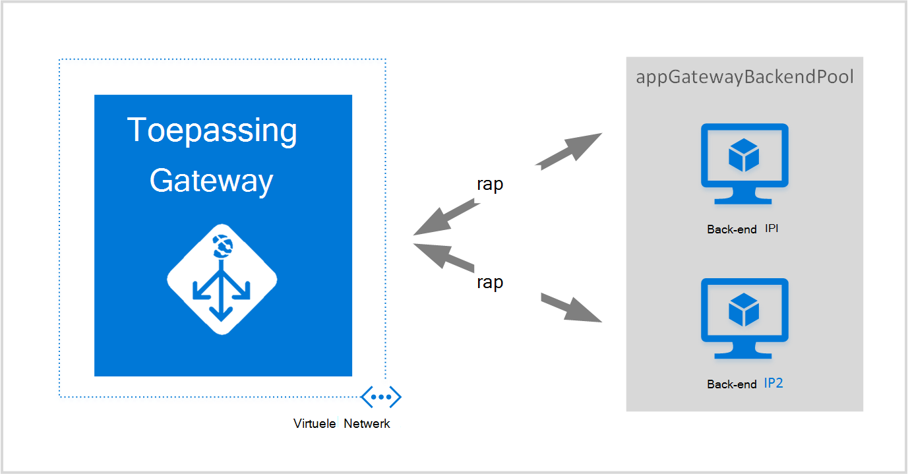
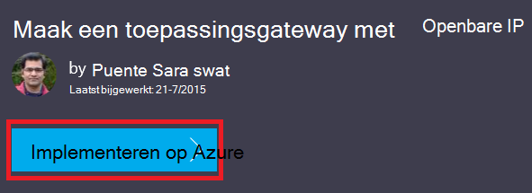
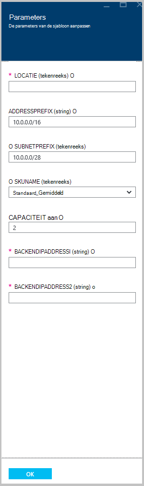

<properties
   pageTitle="Een toepassingsgateway maken met behulp van bronbeheer Azure sjablonen | Microsoft Azure"
   description="Deze pagina bevat instructies voor het maken van een toepassingsgateway Azure-met behulp van de sjabloon Azure Resource Manager"
   documentationCenter="na"
   services="application-gateway"
   authors="georgewallace"
   manager="carmonm"
   editor="tysonn"/>
<tags
   ms.service="application-gateway"
   ms.devlang="na"
   ms.topic="article"
   ms.tgt_pltfrm="na"
   ms.workload="infrastructure-services"
   ms.date="10/25/2016"
   ms.author="gwallace"/>

# Een toepassingsgateway maken met behulp van de sjabloon Azure Resource Manager

> [AZURE.SELECTOR]
- [Azure portal](application-gateway-create-gateway-portal.md)
- [Azure PowerShell voor bronbeheer](application-gateway-create-gateway-arm.md)
- [Azure klassieke PowerShell](application-gateway-create-gateway.md)
- [Sjabloon voor Azure Resource Manager](application-gateway-create-gateway-arm-template.md)
- [Azure CLI](application-gateway-create-gateway-cli.md)

Azure Application Gateway is een laag 7 load balancer. Biedt failover, HTTP-verzoeken prestaties routering tussen verschillende servers, of ze nu op de cloud of op locatie. Application Gateway biedt vele functies van Application Delivery Controller (ADC) met inbegrip van HTTP-taakverdeling, op basis van een cookie sessie affiniteit, Secure Sockets Layer (SSL)-offload, aangepaste gezondheid sondes, ondersteuning voor meerdere locaties en vele andere. Ga voor een volledige lijst van ondersteunde functies naar [Gateway: overzicht](application-gateway-introduction.md)

U informatie over het downloaden en een bestaande sjabloon Azure Resource Manager van GitHub aanpassen en implementeren van de sjabloon van GitHub, PowerShell en de CLI Azure.

Als u alleen maar de sjabloon Azure Resource Manager rechtstreeks vanuit de GitHub zonder enige wijzigingen implementeert, gaat u voor de implementatie van een sjabloon van GitHub.

## Scenario

In dit scenario wordt u:

- Maak een toepassingsgateway met twee exemplaren.
- Maak een virtueel netwerk met de naam VirtualNetwork1 met een gereserveerd blok CIDR van 10.0.0.0/16.
- Maak een subnet genaamd Appgatewaysubnet dat 10.0.0.0/28 als de CIDR-blok gebruikt.
- Instellen twee, eerder geconfigureerd back-end-IP-adressen voor de webservers die u wilt verdelen van het verkeer. In dit voorbeeld sjabloon zijn de back-end-IP-adressen 10.0.1.10 en 10.0.1.11.

>[AZURE.NOTE] Deze instellingen zijn de parameters voor deze sjabloon. Als u de sjabloon aanpast, kunt u regels en de listener de SSL waarmee het azuredeploy.json wordt geopend.

## Download en begrijpen van de sjabloon Azure Resource Manager

De bestaande sjabloon Azure Resource Manager een virtueel netwerk en twee subnetten maken van GitHub, breng de gewenste wijzigingen kunt u wilt en deze opnieuw gebruiken, kunt u downloaden. Gebruik hiervoor de volgende stappen uit:

1. Ga naar de [Application Gateway maken](https://github.com/Azure/azure-quickstart-templates/tree/master/101-application-gateway-create).
2. Klik op **azuredeploy.json**en klik vervolgens op **RAW**.
3. Sla het bestand op een lokale map op uw computer.
4. Als u bekend met sjablonen Azure Resource Manager bent, gaat u verder met stap 7.
5. Open het bestand dat u hebt opgeslagen en bekijk de inhoud onder **parameters** in regel 5. Azure Resource Manager Sjabloonparameters geven een tijdelijke aanduiding voor waarden die kunnen worden ingevuld tijdens de implementatie.

  	| Parameter | Beschrijving |
  	|---|---|
  	| **locatie** | Azure regio waar de toepassingsgateway is gemaakt |
  	| **VirtualNetwork1** | Naam voor de nieuwe virtuele netwerk |
  	| **addressPrefix** | Ruimte voor het virtuele netwerk in CIDR-indeling |
  	| **ApplicationGatewaysubnet** | Naam voor het subnet application gateway |
  	| **subnetPrefix** | CIDR blokkeren voor het subnet application gateway |
  	| **skuname** | SKU exemplaar grootte |
  	| **capaciteit** | Aantal exemplaren |
  	| **backendaddress1** | IP-adres van de eerste webserver |
  	| **backendaddress2** | IP-adres van de tweede webserver |

    >[AZURE.IMPORTANT] Azure Resource Manager sjablonen bijgehouden in de GitHub kunnen wijzigen. Zorg ervoor dat u de sjabloon controleren voordat u deze gebruikt.

6. Controleer de inhoud van de **bronnen** en u ziet het volgende:

    - **type**. Het soort resource wordt gemaakt door de sjabloon. In dit geval is het type **Microsoft.Network/applicationGateways**, die een toepassingsgateway vertegenwoordigt.
    - **naam**. De naam van de resource. Let op het gebruik van **[parameters('applicationGatewayName')]**, wat betekent dat de naam wordt ingebracht door u of door een parameterbestand tijdens de implementatie.
    - **Eigenschappen**. Lijst met eigenschappen voor de resource. Met deze sjabloon maakt gebruik van het virtuele netwerk en openbare IP-adres tijdens gateway maken van de toepassing.

7. Ga naar [https://github.com/Azure/azure-quickstart-templates/blob/master/101-application-gateway-create/](https://github.com/Azure/azure-quickstart-templates/blob/master/101-application-gateway-create).
8. Klik op **azuredeploy-paremeters.json**en klik vervolgens op **RAW**.
9. Sla het bestand op een lokale map op uw computer.
10. Open het bestand dat u hebt opgeslagen en bewerkt u de waarden voor de parameters. De volgende waarden gebruiken voor de implementatie van de toepassingsgateway in ons scenario beschreven.

        {
        "$schema": "http://schema.management.azure.com/schemas/2015-01-01/deploymentParameters.json#",
        {
        "location" : {
        "value" : "West US"
        },
        "addressPrefix": {
        "value": "10.0.0.0/16"
        },
        "subnetPrefix": {
        "value": "10.0.0.0/24"
        },
        "skuName": {
        "value": "Standard_Small"
        },
        "capacity": {
        "value": 2
        },
        "backendIpAddress1": {
        "value": "10.0.1.10"
        },
        "backendIpAddress2": {
        "value": "10.0.1.11"
        }
        }

11. Sla het bestand. De JSON-sjabloon en het sjabloon parameter kunt u testen met behulp van online JSON validatie hulpmiddelen zoals [JSlint.com](http://www.jslint.com/).

## De sjabloon Azure bronnenbeheerder geïmplementeerd met PowerShell

Als u nooit Azure PowerShell gebruikt nog, Zie [het installeren en configureren van Azure PowerShell](../powershell-install-configure.md) en volg de instructies in Azure ondertekenen en selecteer uw abonnement.

### Stap 1

    Login-AzureRmAccount

### Stap 2

Controleer de abonnementen voor de account.

    Get-AzureRmSubscription

U wordt gevraagd te verifiëren met uw referenties.

### Stap 3

Kies welke van uw Azure-abonnementen te gebruiken.

    Select-AzureRmSubscription -Subscriptionid "GUID of subscription"

### Stap 4

Indien nodig, een resourcegroep maken met behulp van de cmdlet **New-AzureResourceGroup** . In het volgende voorbeeld kunt u een groep genaamd AppgatewayRG in de Oost-Amerikaanse locatie maken.

    New-AzureRmResourceGroup -Name AppgatewayRG -Location "East US"

Voer de cmdlet **New-AzureRmResourceGroupDeployment** voor de implementatie van de nieuwe virtuele netwerk met behulp van de vorige sjabloon en parameterbestanden u hebt gedownload en gewijzigd.

    New-AzureRmResourceGroupDeployment -Name TestAppgatewayDeployment -ResourceGroupName AppgatewayRG `
        -TemplateFile C:\ARM\azuredeploy.json -TemplateParameterFile C:\ARM\azuredeploy-parameters.json

## De sjabloon Azure Resource Manager implementeren met behulp van de CLI Azure

Volg de onderstaande stappen voor de implementatie van de bronnenbeheerder Azure sjabloon die u hebt gedownload met behulp van de CLI Azure:

### Stap 1

Als u nooit CLI Azure gebruikt nog, Zie [installeren en configureren van de CLI Azure](../xplat-cli-install.md) en volg de instructies tot aan het punt waar u uw Azure-account en abonnement.

### Stap 2

Voer de opdracht **azure config-modus** wilt overschakelen naar de modus Resource Manager, zoals hieronder wordt weergegeven.

    azure config mode arm

Dit is de verwachte output van de bovenstaande opdracht:

    info:   New mode is arm

### Stap 3

Indien nodig voert u de opdracht **azure groep maken** om een nieuwe resourcegroep maken zoals hieronder wordt weergegeven. U ziet de uitvoer van de opdracht. De lijst die wordt weergegeven nadat u de parameters die worden gebruikt door de uitvoer wordt uitgelegd. Ga naar [Azure Resource-beheer-overzicht](../azure-resource-manager/resource-group-overview.md)voor meer informatie over resourcegroepen.

    azure group create -n appgatewayRG -l eastus

**-n (of -naam)**. De naam voor de nieuwe resourcegroep. Voor ons scenario is *appgatewayRG*.

**-l (of--locatie)**. Azure regio waar de nieuwe resourcegroep wordt gemaakt. Voor ons scenario is *eastus*.

### Stap 4

Voer de cmdlet **implementatie azure groep maken** voor de implementatie van de nieuwe virtuele netwerk met behulp van de sjabloon en parameter bestanden u hebt gedownload en hierboven is gewijzigd. De lijst die wordt weergegeven nadat u de parameters die worden gebruikt door de uitvoer wordt uitgelegd.

    azure group deployment create -g appgatewayRG -n TestAppgatewayDeployment -f C:\ARM\azuredeploy.json -e C:\ARM\azuredeploy-parameters.json

## De sjabloon Azure Resource Manager implementeren met behulp van de klik te implementeren

Klik hier om te implementeren, is een andere manier Azure Resource Manager-sjablonen. Het is gemakkelijk te gebruiken sjablonen met Azure portal.

### Stap 1

Ga naar [een toepassingsgateway met openbare IP-maken](https://azure.microsoft.com/documentation/templates/101-application-gateway-public-ip/).

### Stap 2

Klik **op Azure implementeren**.

### Stap 3

Vul de parameters voor de sjabloon voor de implementatie van de portal en klik op **OK**.

### Stap 4

**Juridische voorwaarden** en klik op **kopen**.

### Stap 5

Klik op de aangepaste implementatie-blade **maken**.

## Volgende stappen

Als u wilt voor het configureren van SSL-offload, Zie [configureren een toepassingsgateway voor SSL-offload](application-gateway-ssl.md).

Als u configureren een toepassingsgateway wilt gebruiken met een interne taakverdeling, Zie [maken een toepassingsgateway met interne taakverdeling (ILB)](application-gateway-ilb.md).

Als u meer informatie over het algemeen balancing opties laden, gaat u naar:

- [Azure Load Balancer](https://azure.microsoft.com/documentation/services/load-balancer/)
- [Azure verkeer Manager](https://azure.microsoft.com/documentation/services/traffic-manager/)
