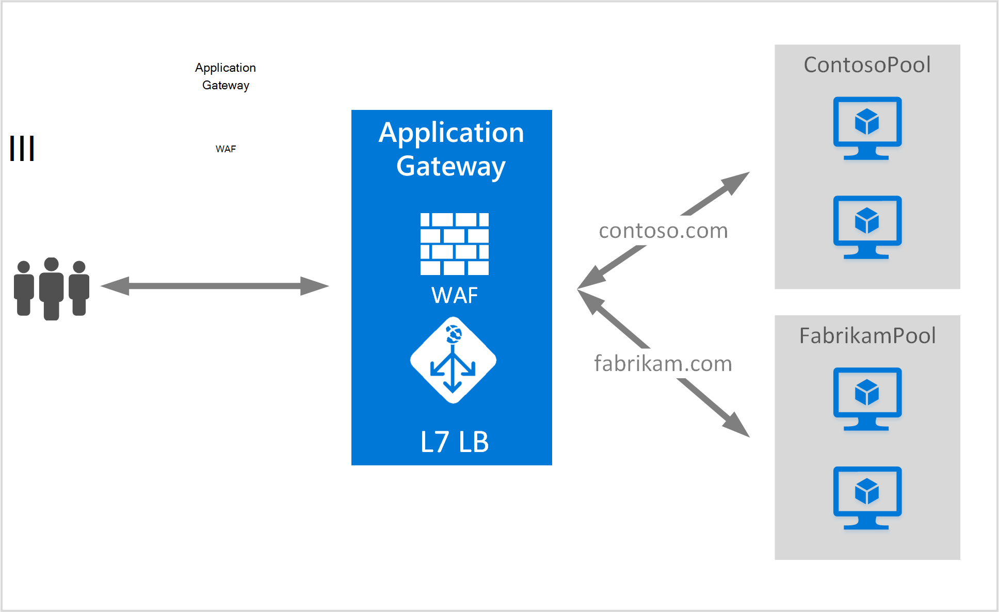

<properties
   pageTitle="Een toepassingsgateway voor het onderbrengen van meerdere sites maken | Microsoft Azure"
   description="Deze pagina bevat instructies voor het maken, een Azure application gateway voor het hosten van meerdere webtoepassingen op de dezelfde gateway configureren."
   documentationCenter="na"
   services="application-gateway"
   authors="amsriva"
   manager="rossort"
   editor="amsriva"/>
<tags
   ms.service="application-gateway"
   ms.devlang="na"
   ms.topic="article"
   ms.tgt_pltfrm="na"
   ms.workload="infrastructure-services"
   ms.date="10/25/2016"
   ms.author="amsriva"/>

# Een toepassingsgateway als host voor meerdere webtoepassingen maken

> [AZURE.SELECTOR]
- [Azure portal](application-gateway-create-multisite-portal.md)
- [Azure PowerShell voor bronbeheer](application-gateway-create-multisite-azureresourcemanager-powershell.md)

Meerdere site hosting, kunt u meer dan één webtoepassing op de dezelfde toepassingsgateway implementeren. Dit is afhankelijk van de aanwezigheid van host-header in de binnenkomende HTTP-verzoek om te bepalen welke listener verkeer ontvangt. De listener stuurt vervolgens verkeer naar de juiste back-end-toepassingen zoals ingesteld in de definitie van de gateway. In webtoepassingen SSL is ingeschakeld, is de toepassingsgateway gebaseerd op uitbreiding van de Server naam aanduiding (SNI) kiest u de juiste listener voor de Internet-verkeer. Vaak gebruikt voor het hosten van meerdere site is om te laden voor verschillende webdomeinen aan groepen van verschillende back-end-server aanvragen. Op dezelfde manier kunnen meerdere domeinen van het hoofddomein hetzelfde ook worden gehost op de dezelfde toepassingsgateway.

## Scenario

In het volgende voorbeeld fungeert toepassingsgateway verkeer voor contoso.com en fabrikam.com met groepen van twee back-end-server: contoso server-groep en de fabrikam server-groep. Soortgelijke setup kan worden gebruikt om host subdomeinen, zoals app.contoso.com en blog.contoso.com.

## Voordat u begint

1. Installeer de nieuwste versie van de Azure PowerShell-cmdlets met behulp van de Web Platform Installer. U kunt downloaden en installeren van de meest recente versie van de **Windows PowerShell** -sectie van de [pagina met Downloads](https://azure.microsoft.com/downloads/).
2. De servers die zijn toegevoegd aan de groep back-end gebruiken de toepassingsgateway moeten bestaan of hebben de eindpunten ervan gemaakt in het virtuele netwerk in een afzonderlijk subnet of met een openbaar IP-/ VIP toegewezen.

## Vereisten

- **Back-end server-groep:** De lijst met IP-adressen van de back-end servers. De IP-adressen ofwel moeten behoren tot het virtuele netwerk subnet of moeten een openbaar IP/VIP. FQDN-naam kan ook worden gebruikt.
- **Instellingen voor back-end server toepassingen:** Elke groep heeft als poort, protocol en affiniteit op basis van een cookie-instellingen. Deze instellingen zijn gekoppeld aan een groep en worden toegepast op alle servers in de groep.
- **Front-poort:** Dit wordt de openbare poort op de toepassingsgateway wordt geopend. Verkeer treft deze poort en wordt vervolgens omgeleid naar een van de back-end servers.
- **Listener:** De listener is een front-end-poort, een protocol (Http of Https, deze waarden zijn hoofdlettergevoelig), en de SSL-certificaat (als het configureren van SSL-offload). Voor toepassing met meerdere locaties-gateways worden hostnaam en SNI indicatoren ook toegevoegd.
- **Regel:** De regel wordt de listener van de groep back-end-server gekoppeld en wordt gedefinieerd welke groep met back-end-server verkeer moet worden besteed aan wanneer deze een bepaalde listener.

## Een toepassingsgateway maken

Dit zijn de stappen die nodig zijn voor het maken van een toepassingsgateway:

1. Een resourcegroep maken voor Resource Manager.
2. Een virtueel netwerk, subnetten en openbare IP-voor de toepassingsgateway maken.
3. Het object application gateway configuratie gemaakt.
4. Maak een toepassingsbron gateway.

## Een resourcegroep maken voor bronbeheer

Let erop dat u de nieuwste versie van Azure PowerShell. Meer informatie is beschikbaar op [Met behulp van Windows PowerShell met Resource Manager](../powershell-azure-resource-manager.md).

### Stap 1

Log in op Azure

    Login-AzureRmAccount

U wordt gevraagd te verifiëren met uw referenties.

### Stap 2

Controleer de abonnementen voor de account.

    Get-AzureRmSubscription

### Stap 3

Kies welke van uw Azure-abonnementen te gebruiken.

    Select-AzureRmSubscription -SubscriptionName "Name of subscription"

### Stap 4

Een resourcegroep (overslaan deze stap als u een bestaande bronnengroep) maken.

    New-AzureRmResourceGroup -Name appgw-RG -location "West US"

U kunt ook ook labels voor een bronnengroep voor toepassingsgateway maken:

    $resourceGroup = New-AzureRmResourceGroup -Name appgw-RG -Location "West US" -Tags @{Name = "testtag"; Value = "Application Gateway multiple site"}

Azure Resource Manager vereist dat alle bronnengroepen van een locatie opgeven. Deze locatie wordt gebruikt als de standaardlocatie voor resources in die groep. Zorg ervoor dat alle opdrachten voor het maken van een toepassingsgateway dezelfde resourcegroep gebruiken.

In het bovenstaande voorbeeld wij een resourcegroep 'appgw-RG"met een plaats van 'West ons' genoemd.

>[AZURE.NOTE] Als u een aangepaste sonde voor uw toepassingsgateway configureren, Zie [maken een toepassingsgateway met aangepaste sondes met PowerShell](application-gateway-create-probe-ps.md). Ga naar de [aangepaste sondes en de statuscontrole](application-gateway-probe-overview.md) voor meer informatie.

## Een virtueel netwerk en de subnetten maken

In het volgende voorbeeld ziet u hoe een virtueel netwerk maken met behulp van bronbeheer. Twee subnetten zijn gemaakt in deze stap. Het eerste subnet is voor de toepassingsgateway zelf. Toepassingsgateway vereist zijn eigen subnet te houden van de instanties. Alleen andere toepassingsgateways kunnen worden ingezet in het desbetreffende subnet. Het tweede subnet wordt gebruikt om de toepassing back-end servers.

### Stap 1

Het adres bereik 10.0.0.0/24 toewijzen aan de variabele subnet moet worden gebruikt voor het opslaan van de toepassingsgateway.

    $subnet = New-AzureRmVirtualNetworkSubnetConfig -Name appgatewaysubnet -AddressPrefix 10.0.0.0/24

### Stap 2

Het adres bereik 10.0.1.0/24 toewijzen aan de variabele subnet2 wordt gebruikt voor de back-end-toepassingen.

    $subnet2 = New-AzureRmVirtualNetworkSubnetConfig -Name backendsubnet -AddressPrefix 10.0.1.0/24

### Stap 3

Een virtueel netwerk met de naam 'appgwvnet' in de resource-groep 'appgw-rg' voor de regio West VS is met het voorvoegsel 10.0.0.0/16 met subnetmasker 10.0.0.0/24, maken en 10.0.1.0/24.

    $vnet = New-AzureRmVirtualNetwork -Name appgwvnet -ResourceGroupName appgw-RG -Location "West US" -AddressPrefix 10.0.0.0/16 -Subnet $subnet,$subnet2

### Stap 4

Een subnet-variabele voor de volgende stappen die een toepassingsgateway maakt toewijzen.

    $appgatewaysubnet = Get-AzureRmVirtualNetworkSubnetConfig -Name appgatewaysubnet -VirtualNetwork $vnet
    $backendsubnet = Get-AzureRmVirtualNetworkSubnetConfig -Name backendsubnet -VirtualNetwork $vnet

## Maak een openbaar IP-adres voor de front-configuratie

Maak een openbaar IP-bron "publicIP01" in de resource-groep 'appgw-rg' voor de regio West VS.

    $publicip = New-AzureRmPublicIpAddress -ResourceGroupName appgw-RG -name publicIP01 -location "West US" -AllocationMethod Dynamic

Een IP-adres is toegewezen aan de toepassingsgateway wanneer de service wordt gestart.

## Toepassingsconfiguratie-gateway maken

U moet alle configuratie-items instellen voordat u de toepassingsgateway maakt. De volgende stappen maakt de configuratie-items die nodig zijn voor een gateway-toepassingsbron.

### Stap 1

Een toepassing IP-configuratie van de standaardgateway met de naam 'gatewayIP01' maken. Als toepassingsgateway wordt gestart, neemt een IP-adres van het subnet is geconfigureerd en netwerkverkeer doorsturen naar de IP-adressen in de back-end-IP-adresgroep. Houd er rekening mee dat elk exemplaar één IP-adres wordt.

    $gipconfig = New-AzureRmApplicationGatewayIPConfiguration -Name gatewayIP01 -Subnet $appgatewaysubnet

### Stap 2

De back-end-IP-adresgroep met de naam 'pool01' en 'pool2' met IP-adressen configureren "10.0.1.100, 10.0.1.101,10.0.1.102" voor "pool1" en "10.0.1.103, 10.0.1.104, 10.0.1.105" voor "pool2".

    $pool1 = New-AzureRmApplicationGatewayBackendAddressPool -Name pool01 -BackendIPAddresses 10.0.1.100, 10.0.1.101, 10.0.1.102
    $pool2 = New-AzureRmApplicationGatewayBackendAddressPool -Name pool02 -BackendIPAddresses 10.0.1.103, 10.0.1.104, 10.0.1.105

In dit voorbeeld zijn er twee back-end-toepassingen voor het routeren van netwerkverkeer op basis van de gevraagde website. Een groep van toepassingen ontvangt verkeer van site 'contoso.com' en andere toepassingen ontvangt verkeer van site 'fabrikam.com'. U moet vervangen door het vorige IP-adressen als u wilt uw eigen eindpunten toepassing IP-adres toevoegen. In plaats van interne IP-adressen, kan u ook openbare IP-adressen, de FQDN-naam of van een VM NIC voor backend instanties gebruiken. Gebruik "-BackendFQDNs" parameter in PowerShell FQDN-namen in plaats van IP-adressen opgeven.

### Stap 3

Application gateway instelling 'poolsetting01' en 'poolsetting02' voor het netwerkverkeer verdeeld in de back-end-toepassingen configureren. In dit voorbeeld kunt u instellingen voor verschillende back-end-toepassingen voor de back-end-toepassingen configureren. Elke back-end-toepassingen hebben een eigen back-end-toepassingen instellen.

    $poolSetting01 = New-AzureRmApplicationGatewayBackendHttpSettings -Name "besetting01" -Port 80 -Protocol Http -CookieBasedAffinity Disabled -RequestTimeout 120
    $poolSetting02 = New-AzureRmApplicationGatewayBackendHttpSettings -Name "besetting02" -Port 80 -Protocol Http -CookieBasedAffinity Enabled -RequestTimeout 240

### Stap 4

De front-IP configureren met het openbare IP-eindpunt.

    $fipconfig01 = New-AzureRmApplicationGatewayFrontendIPConfig -Name "frontend1" -PublicIPAddress $publicip

### Stap 5

De front-poort voor een application-gateway configureren.

    $fp01 = New-AzureRmApplicationGatewayFrontendPort -Name "fep01" -Port 443

### Stap 6

Configureer de twee SSL-certificaten voor de twee websites gaan we in dit voorbeeld worden ondersteund. Is één certificaat voor contoso.com verkeer en de andere voor fabrikam.com verkeer. Deze certificaten moeten een certificeringsinstantie certificaten voor uw websites. Zelfondertekende certificaten worden ondersteund, maar niet aanbevolen voor het verkeer van de productie.

    $cert01 = New-AzureRmApplicationGatewaySslCertificate -Name contosocert -CertificateFile <file path> -Password <password>
    $cert02 = New-AzureRmApplicationGatewaySslCertificate -Name fabrikamcert -CertificateFile <file path> -Password <password>

### Stap 7

Twee listeners voor de twee websites in het volgende voorbeeld configureren. In deze stap configureert u de listeners voor openbare IP-adres, poort en host gebruikt voor het binnenkomende verkeer wordt ontvangen. HostName-parameter is vereist voor ondersteuning van meerdere site en moet worden ingesteld op de juiste website waarvoor het verkeer wordt ontvangen. De parameter RequireServerNameIndication moet worden ingesteld op true voor websites die ondersteuning nodig hebt voor SSL in een scenario met meerdere host. Als SSL-ondersteuning vereist is, moet u ook het SSL-certificaat dat wordt gebruikt voor het beveiligen van verkeer voor die webtoepassing opgeven. De combinatie van FrontendIPConfiguration, FrontendPort en host-naam moet uniek zijn voor een listener. Elke listener kan een certificaat te ondersteunen.

    $listener01 = New-AzureRmApplicationGatewayHttpListener -Name "listener01" -Protocol Https -FrontendIPConfiguration $fipconfig01 -FrontendPort $fp01 -HostName "contoso11.com" -RequireServerNameIndication true  -SslCertificate $cert01
    $listener02 = New-AzureRmApplicationGatewayHttpListener -Name "listener02" -Protocol Https -FrontendIPConfiguration $fipconfig01 -FrontendPort $fp01 -HostName "fabrikam11.com" -RequireServerNameIndication true -SslCertificate $cert02

### Stap 8

Twee regel instelling voor de twee webtoepassingen maken in het volgende voorbeeld. Een regel gekoppeld aan listeners, back-end-toepassingen en HTTP-instellingen. In deze stap configureert u de toepassingsgateway voor het gebruik van elementaire regel voor routering, één voor elke website. Verkeer naar elke website wordt ontvangen door de listener geconfigureerd en wordt vervolgens omgeleid naar de geconfigureerde backend van toepassingen met behulp van de eigenschappen die zijn opgegeven in de BackendHttpSettings.

    $rule01 = New-AzureRmApplicationGatewayRequestRoutingRule -Name "rule01" -RuleType Basic -HttpListener $listener01 -BackendHttpSettings $poolSetting01 -BackendAddressPool $pool1
    $rule02 = New-AzureRmApplicationGatewayRequestRoutingRule -Name "rule02" -RuleType Basic -HttpListener $listener02 -BackendHttpSettings $poolSetting02 -BackendAddressPool $pool2

### Stap 9

Het aantal exemplaren en de grootte voor de toepassingsgateway configureren.

    $sku = New-AzureRmApplicationGatewaySku -Name "Standard_Medium" -Tier Standard -Capacity 2

## Toepassingsgateway maken

Een toepassingsgateway maken met alle configuratieobjecten van de voorgaande stappen.

    $appgw = New-AzureRmApplicationGateway -Name appgwtest -ResourceGroupName appgw-RG -Location "West US" -BackendAddressPools $pool1,$pool2 -BackendHttpSettingsCollection $poolSetting01, $poolSetting02 -FrontendIpConfigurations $fipconfig01 -GatewayIpConfigurations $gipconfig -FrontendPorts $fp01 -HttpListeners $listener01, $listener02 -RequestRoutingRules $rule01, $rule02 -Sku $sku -SslCertificates $cert01, $cert02

>[AZURE.IMPORTANT] Inrichten van Application Gateway is een langdurige bewerking en kan enige tijd duren.

## Toepassing-gateway, DNS-naam verkrijgen

Zodra de gateway is gemaakt, is de volgende stap voor het configureren van de front-end voor communicatie. Als u een openbaar IP-adres gebruikt, moet toepassingsgateway een dynamisch toegewezen DNS-naam, niet milieuvriendelijk is. Om eindgebruikers de toepassingsgateway een CNAME-record kunt vertrekken kan worden gebruikt om te verwijzen naar het openbare eindpunt van de toepassingsgateway. [Een aangepaste domeinnaam in Azure configureren](../cloud-services/cloud-services-custom-domain-name-portal.md). U doet dit door details van de toepassingsgateway en de bijbehorende IP/DNS-naam met behulp van het element PublicIPAddress is gekoppeld aan de toepassingsgateway worden opgehaald. DNS-naam van de van de toepassingsgateway moet worden gebruikt voor het maken van een CNAME-record die naar deze DNS-naam de twee toepassingen verwijst. Het gebruik van A-records wordt niet aanbevolen, omdat de VIP bij opnieuw opstarten van application gateway kan veranderen.
    
    Get-AzureRmPublicIpAddress -ResourceGroupName appgw-RG -Name publicIP01
        
    Name                     : publicIP01
    ResourceGroupName        : appgw-RG
    Location                 : westus
    Id                       : /subscriptions/<subscription_id>/resourceGroups/appgw-RG/providers/Microsoft.Network/publicIPAddresses/publicIP01
    Etag                     : W/"00000d5b-54ed-4907-bae8-99bd5766d0e5"
    ResourceGuid             : 00000000-0000-0000-0000-000000000000
    ProvisioningState        : Succeeded
    Tags                     : 
    PublicIpAllocationMethod : Dynamic
    IpAddress                : xx.xx.xxx.xx
    PublicIpAddressVersion   : IPv4
    IdleTimeoutInMinutes     : 4
    IpConfiguration          : {
                                 "Id": "/subscriptions/<subscription_id>/resourceGroups/appgw-RG/providers/Microsoft.Network/applicationGateways/appgwtest/frontendIP
                               Configurations/frontend1"
                               }
    DnsSettings              : {
                                 "Fqdn": "00000000-0000-xxxx-xxxx-xxxxxxxxxxxx.cloudapp.net"
                               }

## Volgende stappen

Informatie over het beveiligen van uw websites met [Application Gateway - Web Application Firewall](application-gateway-webapplicationfirewall-overview.md)