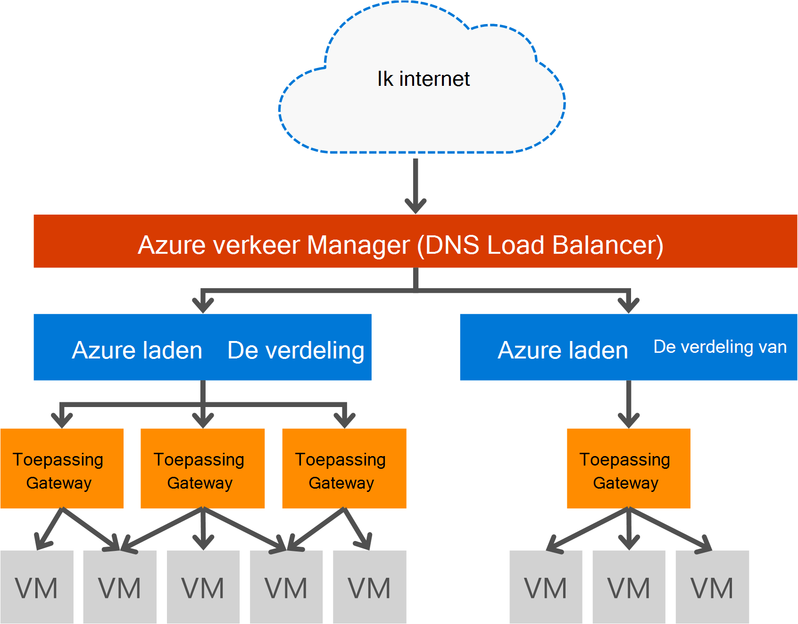

<properties
   pageTitle="Inleiding tot toepassingsgateway | Microsoft Azure"
   description="Deze pagina bevat een overzicht van de toepassingsgateway service voor taakverdeling layer 7 inclusief de grootte van de gateway, HTTP affiniteit voor taakverdeling, op basis van een cookie sessie te laden en SSL-offload."
   documentationCenter="na"
   services="application-gateway"
   authors="georgewallace"
   manager="carmonm"
   editor="tysonn"/>
<tags
   ms.service="application-gateway"
   ms.devlang="na"
   ms.topic="hero-article"
   ms.tgt_pltfrm="na"
   ms.workload="infrastructure-services"
   ms.date="10/25/2016"
   ms.author="gwallace"/>

# Gateway: overzicht

## Wat is een toepassingsgateway

Microsoft Azure Application Gateway biedt Application Delivery Controller (ADC) als een service, biedt verschillende layer 7 taakverdeling mogelijkheden voor uw toepassing. Hiermee kunnen klanten web-farm productiviteit optimaliseren door offloading CPU intensieve SSL-beëindiging op de Gateway-toepassing. Biedt ook andere Layer 7 routing mogelijkheden met inbegrip van round-robin distributie van inkomend verkeer, op basis van cookie sessie affiniteit, URL-pad op basis van routing en mogelijkheid voor het hosten van meerdere websites achter één toepassingsgateway. Toepassingsgateway heeft ook een web application firewall (WAF) die uw toepassing tegen de meeste van de OWASP top 10 veelvoorkomende web beveiligingslekken beschermt. Toepassingsgateway kan worden geconfigureerd als internet-gateway tegenoverliggende, interne enige gateway of een combinatie van beide. Toepassingsgateway volledig Azure wordt beheerd, schaalbaar en uiterst beschikbaar. Het biedt uitgebreide reeks diagnostische gegevens en logboekregistratie mogelijkheden voor een betere beheerbaarheid. Application gateway werkt met virtuele machines, cloud services en intern of extern gerichte webtoepassingen.

Application Gateway is een speciale virtuele toestel voor uw toepassing en bestaat uit van meerdere exemplaren van de werknemer voor schaalbaarheid en beschikbaarheid. Bij het maken van een toepassingsgateway is een eindpunt (openbare VIP of interne ILB IP) die zijn gekoppeld en die wordt gebruikt voor netwerkverkeer dat ingress. Deze VIP of ILB IP wordt geleverd door de Load Balancer Azure op het transportniveau van (TCP/UDP) en die alle binnenkomende netwerkverkeer wordt verdeeld door de werknemer toepassingsgateway exemplaren. De Application Gateway vervolgens het HTTP/HTTPS-verkeer op basis van de configuratie, of u nu een virtuele machine, routes cloud-service, intern of extern IP-adres. Voor de SLA en prijzen, verwijzen naar de pagina's [SLA](https://azure.microsoft.com/support/legal/sla/) en [prijzen](https://azure.microsoft.com/pricing/details/application-gateway/) .

## Functies

Toepassingsgateway ondersteunt momenteel laag 7 toepassing levering met de volgende functies:

- Webtoepassingen beschermt **[Web Application Firewall (voorbeeld)](application-gateway-webapplicationfirewall-overview.md)** - de web application firewall (WAF) in Azure toepassingsgateway tegen veelvoorkomende aanvallen zoals SQL injection aanvallen via cross-site scripting en sessie hijacks.
- **Taakverdeling voor HTTP** - Application Gateway biedt round robin-taakverdeling. Taakverdeling op laag 7 wordt uitgevoerd en wordt gebruikt voor HTTP (S) verkeer.
- **Op basis van een cookie sessie affiniteit** - deze functie is handig wanneer u wilt houden een gebruikerssessie op dezelfde back-end. Met behulp van gateway beheerde cookies, kan de Gateway van de toepassing rechtstreeks gegevensverkeer vanuit een gebruikerssessie op dezelfde back-end voor verwerking. Deze functie is van belang in gevallen waar de sessiestatus lokaal op de back-end-server voor een gebruikerssessie opgeslagen.
- **[Secure Sockets Layer (SSL)-offload](application-gateway-ssl-arm.md)** - deze functie wordt de kostbare aangelegenheid van HTTPS-verkeer uit uw webservers te decoderen. De webserver de SSL-verbinding op de Gateway van de toepassing wordt beëindigd en het verzoek om niet-versleutelde server doorsturen, is unburdened door de decodering.  Het antwoord toepassingsgateway opnieuw gecodeerd voordat deze naar de client verzonden. Deze functie is handig in situaties waar de back-end bevindt zich in hetzelfde beveiligde virtuele netwerk als de Gateway voor toepassing in Azure.
- **[End-to-End SSL](application-gateway-backend-ssl.md)** - Application Gateway ondersteunt codering van begin tot eind van het verkeer. Toepassingsgateway doet dit door de SSL-verbinding op de toepassingsgateway wordt beëindigd. De gateway vervolgens regels voor de routering van toepassing is op het verkeer opnieuw decodeert het pakket en stuurt het pakket door naar de juiste back-end op basis van de regels voor routing gedefinieerd. Geen antwoord van de webserver wordt doorlopen hetzelfde proces aan de eindgebruiker.
- **[Inhoud routering op basis van URL](application-gateway-url-route-overview.md)** - deze functie biedt de mogelijkheid aan verschillende backend-servers gebruiken voor ander verkeer. Netwerkverkeer voor een map op de webserver of een CDN kan worden doorgestuurd naar een andere back-end, vermindering van onnodige belasting van backends die niet aan specifieke inhoud voldoen.
- **[Site over meerdere Routering](application-gateway-multi-site-overview.md)** - Application gateway kunt u maximaal 20 websites op een enkele toepassingsgateway consolideren.
- **[Ondersteuning voor Websocket](application-gateway-websocket.md)** - een andere handige functie van Application Gateway is de native ondersteuning voor Websocket.
- **[Statuscontrole](application-gateway-probe-overview.md)** - Application gateway biedt standaard statuscontrole van de back-end en aangepaste sondes te controleren voor meer specifieke scenario's.

## Voordelen

Toepassingsgateway is nuttig voor:

- Toepassingen waarvoor aanvragen van dezelfde gebruiker/client sessie dezelfde back-end virtuele machine te bereiken. Voorbeelden van deze toepassingen zou worden shopping cart apps en web-e-mailservers.
- Toepassingen die u wilt vrijmaken van webserver-farms van SSL-beëindiging overhead.
- Toepassingen, zoals een netwerk leveren van inhoud waarvoor meerdere HTTP-aanvragen op de langdurige TCP-verbinding worden doorgestuurd of laden aan verschillende backend-servers in evenwicht.
- Toepassingen die ondersteuning bieden voor websocket verkeer
- Gemeenschappelijke aanvallen beschermen webtoepassingen zoals SQL injectie aanvallen via cross-site scripting en hijacks van de sessie.

Toepassingsgateway taakverdeling als een service Azure beheerd kunnen inrichten van een laag 7 load balancer achter de taakverdelingsvoorziening Azure software. Beheer van netwerkverkeer kan worden gebruikt voor het voltooien van het scenario zoals in de volgende afbeelding. Wanneer Manager verkeer omleiden en beschikbaarheid, taakverdeling in de regio, schaalbaarheid en beschikbaarheid biedt en toepassingsgateway biedt cross regio laag 7 taakverdeling.

[AZURE.INCLUDE [load-balancer-compare-tm-ag-lb-include.md](../../includes/load-balancer-compare-tm-ag-lb-include.md)]

## Gateway-formaten en exemplaren

Toepassingsgateway is momenteel verkrijgbaar in drie formaten: klein, middelgroot en groot. Exemplaar van kleine omvang zijn bedoeld voor de ontwikkeling en testen scenario's.

Er zijn momenteel twee SKU's voor toepassingsgateway: WAF en standaard.

U kunt maximaal 50 Toepassingsgateways per abonnement maken en de toepassingsgateway van elke kan maximaal 10 exemplaren hebben. De toepassingsgateway van elke kan bestaan uit 20 HTTP-listeners. Ga naar de [Grenzen van de Service](../azure-subscription-service-limits.md#application-gateway) -pagina voor een volledige lijst van gateway limieten van toepassing.

De volgende tabel ziet u een doorvoer van de gemiddelde prestaties voor elk exemplaar van application gateway:

| Pagina van de back-end antwoord | Kleine | Gemiddeld | Grote|
|---|---|---|---|
| 6K | 7,5 Mbps | 13 Mbps | 50 Mbps |
|100K | 35 Mbps | 100 Mbps| 200 Mbps |

>[AZURE.NOTE] Deze waarden zijn bij benadering waarden voor een doorvoer van toepassingsgegevens van gateway. De werkelijke doorvoer hangt af van verschillende details van de omgeving, zoals gemiddelde paginagrootte, locatie van de back-end-instanties en de verwerkingstijd voor een pagina. Voor exacte prestaties cijfers, uw eigen tests moet worden uitgevoerd, deze waarden zijn alleen beschikbaar voor de capaciteitsplanning richtlijnen.

## Statuscontrole

Automatisch wordt de status van de back-end-instanties basic Azure toepassingsgateway of aangepaste gezondheid sondes. Met behulp van sondes gezondheid zo dat alleen gezonde hosts op verkeer reageren. Zie [Application Gateway gezondheid controleren-overzicht](application-gateway-probe-overview.md)voor meer informatie.

## Het configureren en beheren

Toepassingsgateway kan voor het eindpunt hebben een openbaar IP-adres en/of particuliere IP-configuratie. Toepassingsgateway is in een virtueel netwerk in een eigen subnet geconfigureerd. Het subnet gemaakt of gebruikt voor application gateway geen andere soorten resources, de enige bronnen die zijn toegestaan in het subnet zijn andere Toepassingsgateways. De back-end beveiliging van uw back-end-bronnen kunnen servers worden opgenomen in een ander subnet in hetzelfde virtuele netwerk als de toepassingsgateway. Deze extra subnet is die het niet nodig zijn voor de back-end-toepassingen als de toepassingsgateway het IP-adres kunt bereiken toepassingsgateway kan ADC mogelijkheden bieden voor de back-end servers.

U kunt maken en beheren van een toepassingsgateway met REST API's, PowerShell cmdlets, Azure CLI of [Azure portal](https://portal.azure.com/).

## Volgende stappen

Na het leren over Application gateway, kunt u [een toepassingsgateway maken](application-gateway-create-gateway-portal.md) of u kunt naar de werklast HTTPS-verbindingen [maken een toepassingsgateway SSL-offload](application-gateway-ssl-arm.md) .

Meer informatie over het maken van een toepassingsgateway bewerkingsplankoppelingen op URL gebaseerde inhoud, gaat u naar [een toepassingsgateway met routering op basis van een URL maken](application-gateway-create-url-route-arm-ps.md) voor meer informatie.

