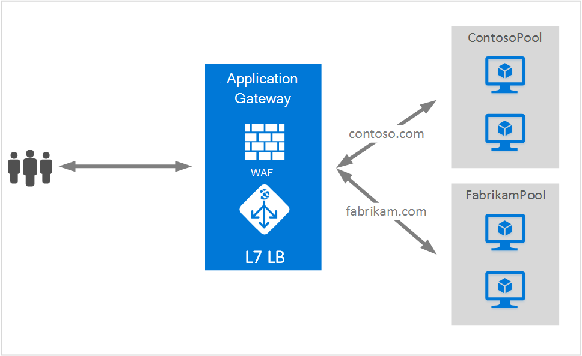

<properties
   pageTitle="Meerdere sites onderbrengen op een toepassingsgateway | Microsoft Azure"
   description="Deze pagina biedt een overzicht van de site met meerdere Application Gateway ondersteuning."
   documentationCenter="na"
   services="application-gateway"
   authors="amsriva"
   manager="rossort"
   editor="amsriva"/>
<tags
   ms.service="application-gateway"
   ms.devlang="na"
   ms.topic="hero-article"
   ms.tgt_pltfrm="na"
   ms.workload="infrastructure-services"
   ms.date="10/25/2016"
   ms.author="amsriva"/>

# Toepassingsgateway meerdere site hosting

Meerdere site hosting, kunt u meer dan één webtoepassing op hetzelfde exemplaar van de toepassing-gateway configureren. Met deze functie kunt u een meer efficiënte replicatietopologie voor de distributie van maximaal 20 websites toe te voegen aan een toepassingsgateway configureren. Elke website kan worden omgeleid naar een eigen groep met back-end. In het volgende voorbeeld fungeert toepassingsgateway verkeer voor contoso.com en fabrikam.com uit groepen van twee back-end-server ContosoServerPool en FabrikamServerPool genoemd.

Aanvragen voor http://contoso.com worden gerouteerd naar de ContosoServerPool en http://fabrikam.com worden doorgestuurd naar FabrikamServerPool.

Op dezelfde manier kunnen twee subdomeinen van hetzelfde bovenliggende domein worden gehost op de dezelfde toepassingsimplementatie gateway. Voorbeelden van het gebruik van subdomeinen kunnen http://blog.contoso.com en http://app.contoso.com die worden gehost op een gateway-implementatie van één toepassing bevatten.

## Host-headers en de Server naam aanduiding (SNI)

Er zijn drie algemene mechanismen voor het inschakelen van meerdere site hosting op dezelfde infrastructuur.

1. Host meerdere webtoepassingen elk op een uniek IP-adres.
2. Hostnaam gebruiken als host voor meerdere webtoepassingen op hetzelfde IP-adres.
3. Verschillende poorten gebruikt als host voor meerdere webtoepassingen op hetzelfde IP-adres.

Een toepassingsgateway haalt momenteel één openbaar IP-adres waarop het verkeer wordt geluisterd. Daarom ondersteunt meerdere toepassingen, wordt elk met een eigen IP-adres momenteel niet ondersteund. Toepassingsgateway ondersteunt meerdere toepassingen hosten elke luisteren op verschillende poorten, maar in dit scenario zou moeten accepteren verkeer op poorten met niet-standaard toepassingen en is het vaak niet een gewenste configuratie. Application Gateway steunt op HTTP 1.1-host-headers als host voor websites op dezelfde openbare IP-adres en poort. De sites die worden gehost op een toepassingsgateway kunnen ook ondersteuning voor SSL-offload met TLS Server naam aanduiding (SNI) extensie. In dit scenario betekent dat de client-browser en back-end web-farm moet ondersteuning voor HTTP/1.1 en TLS-extensie zoals gedefinieerd in RFC 6066.

## Listener, configuratie-element

Bestaande HTTPListener, configuratie-element is verbeterd ter ondersteuning van de host en de server naam aanduiding elementen, die wordt gebruikt door de toepassing toegang tot de route-verkeer naar de juiste back-end-toepassingen. In het volgende voorbeeld wordt het fragment van HttpListeners-element van het sjabloonbestand.

    "httpListeners": [
                {
                    "name": "appGatewayHttpsListener1",
                    "properties": {
                        "FrontendIPConfiguration": {
                            "Id": "/subscriptions/<subid>/resourceGroups/<rgName>/providers/Microsoft.Network/applicationGateways/applicationGateway1/frontendIPConfigurations/DefaultFrontendPublicIP"
                        },
                        "FrontendPort": {
                            "Id": "/subscriptions/<subid>/resourceGroups/<rgName>/providers/Microsoft.Network/applicationGateways/applicationGateway1/frontendPorts/appGatewayFrontendPort443'"
                        },
                        "Protocol": "Https",
                        "SslCertificate": {
                            "Id": "/subscriptions/<subid>/resourceGroups/<rgName>/providers/Microsoft.Network/applicationGateways/applicationGateway1/sslCertificates/appGatewaySslCert1'"
                        },
                        "HostName": "contoso.com",
                        "RequireServerNameIndication": "true"
                    }
                },
                {
                    "name": "appGatewayHttpListener2",
                    "properties": {
                        "FrontendIPConfiguration": {
                            "Id": "/subscriptions/<subid>/resourceGroups/<rgName>/providers/Microsoft.Network/applicationGateways/applicationGateway1/frontendIPConfigurations/appGatewayFrontendIP'"
                        },
                        "FrontendPort": {
                            "Id": "/subscriptions/<subid>/resourceGroups/<rgName>/providers/Microsoft.Network/applicationGateways/applicationGateway1/frontendPorts/appGatewayFrontendPort80'"
                        },
                        "Protocol": "Http",
                        "HostName": "fabrikam.com",
                        "RequireServerNameIndication": "false"
                    }
                }
            ],

U kunt [Bronbeheer sjabloon met behulp van meerdere site die als host fungeert](https://github.com/Azure/azure-quickstart-templates/blob/master/201-application-gateway-multihosting) voor een complete implementatie op basis van een sjabloon bezoeken.

## Regel voor routering

Er is geen wijziging in de routing-regel vereist. De routing-regel 'Basic' moet blijven om te koppelen van de betreffende site een listener voor de bijbehorende backend-adresgroep worden gekozen.

    "requestRoutingRules": [
    {
        "name": "<ruleName1>",
        "properties": {
            "RuleType": "Basic",
            "httpListener": {
                "id": "/subscriptions/<subid>/resourceGroups/<rgName>/providers/Microsoft.Network/applicationGateways/applicationGateway1/httpListeners/appGatewayHttpsListener1')]"
            },
            "backendAddressPool": {
                "id": "/subscriptions/<subid>/resourceGroups/<rgName>/providers/Microsoft.Network/applicationGateways/applicationGateway1/backendAddressPools/ContosoServerPool')]"
            },
            "backendHttpSettings": {
                "id": "/subscriptions/<subid>/resourceGroups/<rgName>/providers/Microsoft.Network/applicationGateways/applicationGateway1/backendHttpSettingsCollection/appGatewayBackendHttpSettings')]"
            }
        }

    },
    {
        "name": "<ruleName2>",
        "properties": {
            "RuleType": "Basic",
            "httpListener": {
                "id": "/subscriptions/<subid>/resourceGroups/<rgName>/providers/Microsoft.Network/applicationGateways/applicationGateway1/httpListeners/appGatewayHttpListener2')]"
            },
            "backendAddressPool": {
                "id": "/subscriptions/<subid>/resourceGroups/<rgName>/providers/Microsoft.Network/applicationGateways/applicationGateway1/backendAddressPools/FabrikamServerPool')]"
            },
            "backendHttpSettings": {
                "id": "/subscriptions/<subid>/resourceGroups/<rgName>/providers/Microsoft.Network/applicationGateways/applicationGateway1/backendHttpSettingsCollection/appGatewayBackendHttpSettings')]"
            }
        }

    }
    ]

## Volgende stappen

Na het leren over meerdere site die als host optreedt, gaat u naar [een toepassingsgateway met meerdere site hosting maken](application-gateway-create-multisite-azureresourcemanager-powershell.md) een toepassingsgateway met ondersteuning voor meer dan één webtoepassing maken.
