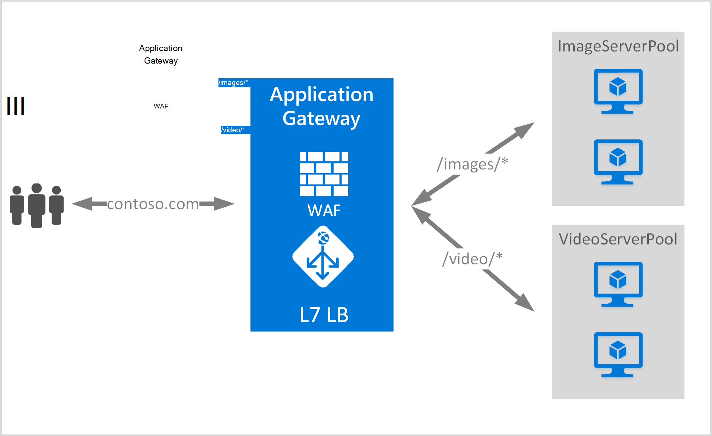

<properties
   pageTitle="Op URL gebaseerde inhoud Routering-overzicht | Microsoft Azure"
   description="Deze pagina bevat een overzicht van de inhoud routering op basis van de URL-Gateway, UrlPathMap configuratie en de regel PathBasedRouting."
   documentationCenter="na"
   services="application-gateway"
   authors="georgewallace"
   manager="carmonm"
   editor="tysonn"/>
<tags
   ms.service="application-gateway"
   ms.devlang="na"
   ms.topic="hero-article"
   ms.tgt_pltfrm="na"
   ms.workload="infrastructure-services"
   ms.date="10/25/2016"
   ms.author="gwallace"/>

# URL-pad gebaseerde routering-overzicht

URL-pad gebaseerde routering kunt u route verkeer naar back-end-server-toepassingen op basis van URL-paden van de aanvraag. Een van de scenario's is op route verzoeken om verschillende typen inhoud aan verschillende backend server-toepassingen.
In het volgende voorbeeld Application Gateway fungeert voor contoso.com uit groepen van drie back-end-server verkeer bijvoorbeeld: VideoServerPool, ImageServerPool en DefaultServerPool.

Aanvragen voor http://contoso.com/video* worden gerouteerd naar de VideoServerPool, en http://contoso.com/images* worden doorgestuurd naar ImageServerPool. Als geen van de patronen pad overeenkomt met DefaultServerPool geselecteerd.

## UrlPathMap, configuratie-element

UrlPathMap-element wordt gebruikt om patronen naar back-end-server groep toewijzingen pad opgeven. In het volgende voorbeeld wordt het fragment van urlPathMap-element van het sjabloonbestand.

    "urlPathMaps": [
    {
    "name": "<urlPathMapName>",
    "id": "/subscriptions/<subscriptionId>/../microsoft.network/applicationGateways/<gatewayName>/ urlPathMaps/<urlPathMapName>",
    "properties": {
        "defaultBackendAddressPool": {
            "id": "/subscriptions/<subscriptionId>/../microsoft.network/applicationGateways/<gatewayName>/backendAddressPools/<poolName>"
        },
        "defaultBackendHttpSettings": {
            "id": "/subscriptions/<subscriptionId>/../microsoft.network/applicationGateways/<gatewayName>/backendHttpSettingsList/<settingsName>"
        },
        "pathRules": [
            {
                "paths": [
                    <pathPattern>
                ],
                "backendAddressPool": {
                    "id": "/subscriptions/<subscriptionId>/../microsoft.network/applicationGateways/<gatewayName>/backendAddressPools/<poolName2>"
                },
                "backendHttpsettings": {
                    "id": "/subscriptions/<subscriptionId>/../microsoft.network/applicationGateways/<gatewayName>/backendHttpsettingsList/<settingsName2>"
                },

            },

        ],

    }
    }
    

>[AZURE.NOTE] PathPattern: Deze instelling is een lijst van patronen pad aan. Elk moet beginnen met / en de enige plaats waar een ' * ' is toegestaan is op het einde volgt een "/". De tekenreeks die is ingevoerd in het pad matcher omvat niet alle tekst na de eerste? of # en deze tekens zijn hier niet toegestaan. 

U kunt een [Resource Manager-sjabloon gebruikt op basis van URL-routering](https://azure.microsoft.com/documentation/templates/201-application-gateway-url-path-based-routing) voor meer informatie kunt uitchecken.

## PathBasedRouting regel

RequestRoutingRule van het type PathBasedRouting wordt gebruikt voor het binden van een listener aan een urlPathMap. Alle aanvragen die worden ontvangen voor deze listener worden gerouteerd op basis van beleid dat is opgegeven in urlPathMap.
Fragment van de PathBasedRouting-regel:

    "requestRoutingRules": [
    {

    "name": "<ruleName>",
    "id": "/subscriptions/<subscriptionId>/../microsoft.network/applicationGateways/<gatewayName>/requestRoutingRules/<ruleName>",
    "properties": {
        "ruleType": "PathBasedRouting",
        "httpListener": {
            "id": "/subscriptions/<subscriptionId>/../microsoft.network/applicationGateways/<gatewayName>/httpListeners/<listenerName>"
        },
        "urlPathMap": {
            "id": "/subscriptions/<subscriptionId>/../microsoft.network/applicationGateways/<gatewayName>/ urlPathMaps/<urlPathMapName>"
        },

    }
    
## Volgende stappen

Na het leren over inhoud routering op basis van een URL, gaat u naar [een toepassingsgateway met routering op basis van een URL maken](application-gateway-create-url-route-portal.md) een toepassingsgateway met URL-regels voor routing maken.
