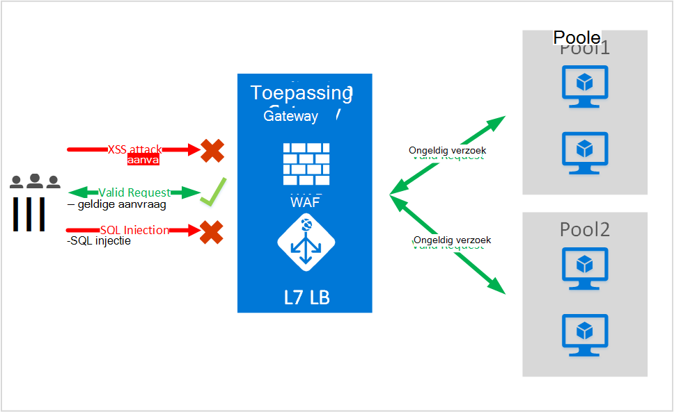
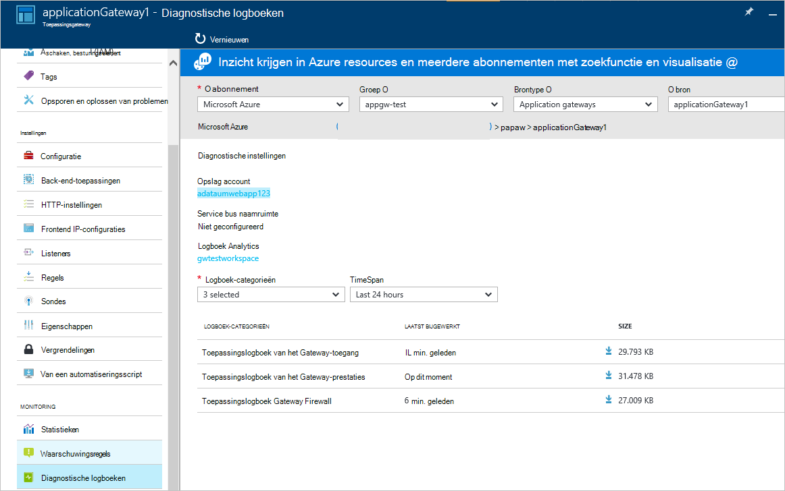

<properties
   pageTitle="Inleiding tot de Web Application Firewall (WAF) voor Application Gateway | Microsoft Azure"
   description="Deze pagina bevat een overzicht van de Web Application Firewall (WAF) voor Application Gateway "
   documentationCenter="na"
   services="application-gateway"
   authors="amsriva"
   manager="rossort"
   editor="amsriva"/>
<tags
   ms.service="application-gateway"
   ms.devlang="na"
   ms.topic="hero-article"
   ms.tgt_pltfrm="na"
   ms.workload="infrastructure-services"
   ms.date="10/25/2016"
   ms.author="amsriva"/>

# Application Gateway Web Application Firewall (voorbeeld)

Web application firewall (WAF) is een functie van azure application gateway die bescherming biedt tegen de webtoepassingen die gebruikmaken van application gateway voor standaard functies van Application Delivery Control (ADC). Web application firewall wordt beschermd tegen de meeste van de OWASP top 10 veelvoorkomende web beveiligingslekken. Webtoepassingen worden steeds vaker doelwit van aanvallen die algemeen bekende beveiligingslekken worden misbruikt. Tussen deze cracks gemeenschappelijke SQL injection-aanvallen, aanvallen via cross-site scripting mogelijk om een paar te noemen. Dergelijke aanvallen in de toepassingscode kan lastig zijn en rigoureuze onderhoud, patches en het toezicht op meerdere lagen van de Toepassingstopologie is mogelijk. Een gecentraliseerde web application firewall te beschermen tegen aanvallen via Internet security management veel eenvoudiger maakt en resulteert in betere assurance naar de toepassing tegen de bedreigingen van indringers. Een WAF oplossing kan ook bedreigd sneller reageren door het patchen van een bekend probleem op een centrale locatie ten opzichte van afzonderlijke webtoepassingen beveiligen. Bestaande toepassingsgateways kunnen eenvoudig worden geconverteerd naar een toepassingsgateway web application firewall.

Application Gateway fungeert als een application delivery controller en biedt SSL-beëindiging, op basis van een cookie sessie affiniteit, round robin verdeling van de belasting, inhoud gebaseerde routering, mogelijkheid voor het hosten van meerdere websites en beveiligingsverbeteringen. Verbeterde beveiliging aangeboden door toepassingsgateway omvatten SSL beheer van begin tot eind SSL-ondersteuning. We zijn toepassing beveiligingsmogelijkheden van onze service versterken door de invoering van WAF (web application firewall) rechtstreeks geïntegreerd in de ADC aanbieden. Dit biedt een eenvoudig te configureren, centrale locatie voor het beheren en beveiligen van uw webtoepassingen tegen veelvoorkomende web beveiligingslekken.

WAF bij application gateway configureren biedt de volgende voordelen u:

- Uw webtoepassing beschermen tegen beveiligingslekken web en aanvallen zonder wijziging van de back-end-code.
- Meerdere toepassingen tegelijk achter een toepassingsgateway beschermen. Toepassingsgateway ondersteunt maximaal 20 websites achter één gateway kan alle beschermd zijn tegen aanvallen van web hosting.
- Uw webtoepassing tegen aanvallen met behulp van real-time rapport gegenereerd door gateway WAF toepassingslogboeken controleren.
- Bepaalde besturingselementen conformiteit moeten alle internet gerichte eindpunten worden beschermd door een WAF-oplossing. Met behulp van application gateway met WAF ingeschakeld, voldoet u aan deze vereisten voldoen.

## Overzicht

Application Gateway WAF wordt aangeboden in een nieuwe SKU (WAF SKU) en is vooraf geconfigureerd met ModSecurity en OWASP Core regelset basislijn bescherming biedt tegen de meeste van de OWASP top 10 veelvoorkomende web beveiligingslekken.

- SQL injection bescherming
- Cross-site scripting-bescherming
- Gemeenschappelijke Web Attacks bescherming als opdracht injectie, HTTP-aanvraag smokkelen, HTTP-antwoord opsplitsen, en extern bestand opgenomen aanval
- Bescherming tegen overtredingen van het HTTP-protocol
- Bescherming tegen het HTTP-protocol anomalieën zoals ontbrekende host gebruikersagent en accepteer headers
- HTTP-DoS bescherming, met inbegrip van HTTP-overstroming en langzame preventie van DoS van HTTP
- Preventie tegen bots, crawlers en scanners
- Detectie van algemene toepassing gebruikers (dat wil zeggen Apache, IIS, etc)

## WAF-modi

Application Gateway WAF kan worden geconfigureerd voor uitvoering in de volgende twee modi:

- **Detectie-modus** – wanneer uitgevoerd in de detectie-modus Application Gateway WAF bewaakt en registreert alle dreiging waarschuwingen in een logboekbestand. U moet ervoor zorgen dat Diagnostische logboekregistratie voor Application Gateway is ingeschakeld met behulp van de diagnostische sectie. Ook moet u ervoor zorgen dat het logboek WAF is geselecteerd en ingeschakeld.
- **'-Modus** – wanneer uitgevoerd in de modus voor preventie, Application Gateway actief blokkeert aanvallen en indringers gedetecteerd door de regels. De aanvaller ontvangt een uitzondering 403 toegang door onbevoegden en wordt de verbinding verbroken. Meld dergelijke aanvallen in de logboeken WAF blijft '-modus.

## Application Gateway WAF rapporten

Application Gateway WAF biedt gedetailleerde rapporten over elke bedreiging die wordt gedetecteerd. Logboekregistratie is geïntegreerd met Azure diagnostische logboeken en waarschuwingen worden vastgelegd in een json-indeling.

    {
        "resourceId": "/SUBSCRIPTIONS/<subscriptionId>/RESOURCEGROUPS/<resourceGroupName>/PROVIDERS/MICROSOFT.NETWORK/APPLICATIONGATEWAYS/<applicationGatewayName>",
        "operationName": "ApplicationGatewayFirewall",
        "time": "2016-09-20T00:40:04.9138513Z",
        "category": "ApplicationGatewayFirewallLog",
        "properties":     {
            "instanceId":"ApplicationGatewayRole_IN_0",
            "clientIp":"108.41.16.164",
            "clientPort":1815,
            "requestUri":"/wavsep/active/RXSS-Detection-Evaluation-POST/",
            "ruleId":"OWASP_973336",
            "message":"XSS Filter - Category 1: Script Tag Vector",
            "action":"Logged",
            "site":"Global",
            "message":"XSS Filter - Category 1: Script Tag Vector",
            "details":{"message":" Warning. Pattern match "(?i)(<script","file":"/owasp_crs/base_rules/modsecurity_crs_41_xss_attacks.conf","line":"14"}}
    }

## Application Gateway WAF SKU prijzen

Bij het voorbeeld zijn er geen extra kosten voor het gebruik van de Gateway WAF van toepassing. U blijft op bestaande Basic SKU kosten in rekening worden gebracht. We communiceren de SKU WAF toeslagen bij NH. Klanten die gekozen hebben voor de implementatie van Application Gateway in WAF SKU begint WAF SKU prijzen alleen na aankondiging NH toerekenen.

## Volgende stappen

Ga na meer informatie over de mogelijkheden van WAF, naar [het Web Application Firewall op Application Gateway configureren](application-gateway-web-application-firewall-portal.md).
