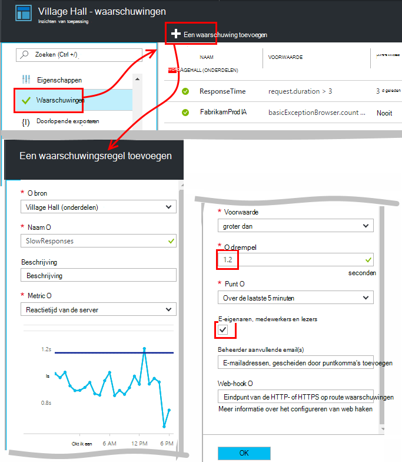
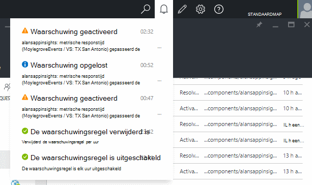
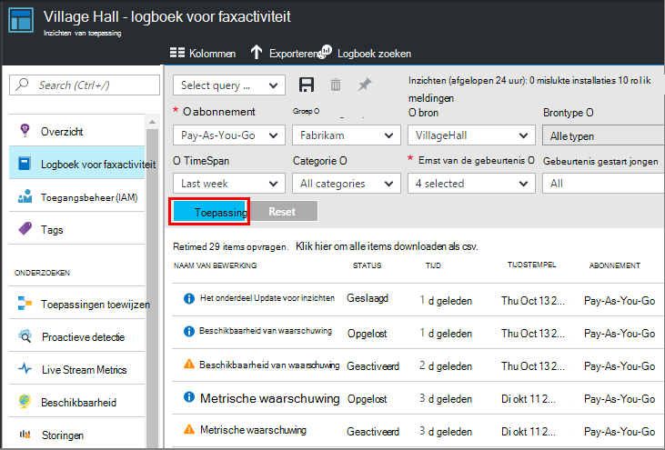

<properties 
    pageTitle="Stel signalen in inzichten toepassing | Microsoft Azure" 
    description="Ontvang een bericht over de trage responstijden, uitzonderingen en andere prestaties of het gebruik van wijzigingen in uw web app." 
    services="application-insights" 
    documentationCenter=""
    authors="alancameronwills" 
    manager="douge"/>

<tags 
    ms.service="application-insights" 
    ms.workload="tbd" 
    ms.tgt_pltfrm="ibiza" 
    ms.devlang="na" 
    ms.topic="article" 
    ms.date="10/14/2016" 
    ms.author="awills"/>
 
# Stel signalen in inzichten van toepassing

[Visual Studio-toepassing inzichten] [ start] u attent kunnen maken op wijzigingen in de prestaties of het gebruik van statistieken in uw web app. 

Toepassing inzichten bewaakt uw live app op een [breed scala aan platforms] [ platforms] bij het vaststellen van prestatieproblemen met en gebruikspatronen te begrijpen.

Er zijn drie soorten meldingen:

* **Metrische meldingen** geven wanneer een metric een drempelwaarde voor een bepaalde periode - bijvoorbeeld responstijden, telt het aantal uitzonderingen, CPU-gebruik of paginaweergaven snijdt. 
* [**Web-tests** ] [ availability] laat u weten wanneer uw site is niet beschikbaar op het internet, of reageert traag. [Meer informatie][availability].
* [**Proactieve diagnostische gegevens**](app-insights-proactive-diagnostics.md) automatisch kunnen worden geconfigureerd om u te waarschuwen over de van ongebruikelijke prestatiepatronen.

We richten ons op metrische waarschuwingen in dit artikel.

## Een waarschuwing voor een Metric instellen

Open de waarschuwingsregels blade en gebruik vervolgens de knop toevoegen. 

* De bron voordat de andere eigenschappen instellen. **Kies de bron '(componenten)'** als u waarschuwingen instellen voor prestatie- of gebruiksrapport maatstaven.
* De naam die u aan de waarschuwing toewijst moet uniek zijn binnen de groep (niet alleen uw toepassing).
* Let erop dat u Let op de eenheden waarin u wordt gevraagd de drempelwaarde in te voeren.
* Als u het selectievakje "... e-eigenaars", worden waarschuwingen verzonden per e-mail aan iedereen die toegang tot deze resourcegroep heeft. Vouw deze reeks mensen, toevoegen aan de [resourcegroep of het abonnement](app-insights-resources-roles-access-control.md) (niet de bron).
* Als u 'Extra e-mails' opgeeft, wordt waarschuwingen toegezonden aan de personen of groepen (al dan niet u gecontroleerd het vak "email eigenaren..."). 
* Een [webhook adres](../monitoring-and-diagnostics/insights-webhooks-alerts.md) instellen als u een web app die op berichten reageert hebt ingesteld. Deze worden aangeroepen wanneer de waarschuwing wordt geactiveerd (die is geactiveerd) en wanneer het probleem is opgelost. (Maar houd er rekening mee dat op dit moment, query-parameters niet via als webhook eigenschappen doorgegeven worden.)
* U kunt uitschakelen of inschakelen van de waarschuwing: de knoppen aan de bovenkant van het blad.

*Ik zie de knop Waarschuwing toevoegen.* 

- Gebruikt u een organisatie-account? U kunt waarschuwingen instellen als u de eigenaar of Inzender toegang tot deze bron van toepassing. Bekijk de toegangsbeheer-blade. [Meer informatie over toegangsbeheer][roles].

> [AZURE.NOTE] In de blade waarschuwingen ziet u dat er al een waarschuwing instellen is: [Proactieve diagnostische gegevens](app-insights-proactive-failure-diagnostics.md). Dit is een automatische melding die controleert van een specifieke metric, aanvraag is mislukt.. Tenzij u de proactieve waarschuwing uitschakelen, hoeft u niet uw eigen waarschuwing instellen op verzoek mislukt.. 

## Zie waarschuwingen

U ontvang een e-mail wanneer een waarschuwing wijzigingen staat tussen niet actief en actief. 

De huidige status van elke melding wordt weergegeven in de blade waarschuwingsregels.

Er is een overzicht van de recente activiteiten in de waarschuwingen-omlaag:

De historie van wijzigingen wordt in het logboek voor faxactiviteit:

## Waarschuwingen

* Een melding kent drie statussen: 'Nooit geactiveerd', 'Geactiveerd' en 'Opgelost'. Geactiveerde wijze de door u opgegeven voorwaarde is waar, wanneer deze voor het laatst is geëvalueerd.

* Een melding wordt gegenereerd wanneer een waarschuwing de status verandert. (Als de waarschuwing voorwaarde al true was wanneer u de waarschuwing hebt gemaakt, mogelijk niet krijgt u een melding totdat de voorwaarde onwaar gaat.)

* Elke kennisgeving wordt een e-mailbericht gegenereerd als u het vak e-mailberichten controleren of e-mailadressen verstrekt. U kunt ook de vervolgkeuzelijst meldingen bekijken.

* Een waarschuwing wordt telkens opnieuw geëvalueerd die metric, maar niet anders aankomt.

* De evaluatie aggregeert de metrische gegevens over de voorgaande periode en vergelijkt deze met de drempel om de nieuwe status te bepalen.

* De periode die u kiest, bepaalt het interval waarover worden gegevens samengevoegd. Heeft geen invloed op hoe vaak de waarschuwing wordt geëvalueerd: dat hangt af van de frequentie van de aankomst van de statistieken.

* Als er geen gegevens voor een bepaalde metriek gedurende een bepaalde periode komt, is de kloof verschillende effecten op alert evaluatie en de grafieken in metrische explorer. Als er geen gegevens langer dan de controle-interval van de grafiek, wordt gezien wordt de grafiek in metrische explorer, de waarde 0. Maar een waarschuwing op basis van dezelfde metric is niet opnieuw worden beoordeeld en de status van de waarschuwing blijft ongewijzigd. 

    Wanneer de gegevens uiteindelijk aankomt, springt de grafiek naar een andere waarde dan nul. De waarschuwing wordt geëvalueerd op basis van de gegevens die beschikbaar zijn voor de periode die u hebt opgegeven. Als de nieuwe gegevens beschikbaar zijn in de periode, de statistische waarde gebaseerd slechts op punt van gegevens.

* Een waarschuwing kan vaak knipperen tussen lidstaten alert en gezond, zelfs als u een lange periode. Dit kan gebeuren als de metrische waarde rond de drempel rust. Er is geen hysteresis in de drempel: de overgang naar de waarschuwing op dezelfde waarde als de overgang naar gezonde gebeurt.

## Wat zijn goede waarschuwingen instellen?

Dit is afhankelijk van uw toepassing. Beginnen met, is het beter niet te veel parameters instellen. Even uw metrische grafieken kijken terwijl uw toepassing wordt uitgevoerd, om een idee krijgen hoe het werkt normaal. Zo kunt u zoeken naar manieren om de prestaties te verbeteren. Vervolgens waarschuwingen instellen kunt u zien wanneer de cijfers buiten de normale zone gaat. 

Populaire waarschuwingen bevatten:

* [Browser metrics][client], met name Browser **pagina laden tijden**, zijn goed voor webtoepassingen. Als uw pagina een heleboel scripts heeft, moet u letten, **browser uitzonderingen**. Deze maatstaven en waarschuwingen krijgen, als u hebt voor het instellen van een [webpagina controleren][client].
* **Reactietijd van de server** voor het servergedeelte van webtoepassingen. En het instellen van waarschuwingen, houden een oog op deze metrische gegevens om weer te geven als deze onevenredig hoge aanvraag tarieven verschilt: dat kan erop wijzen dat uw toepassing geen bronnen wordt uitgevoerd. 
* **Uitzonderingen** - Zie, hebt u enkele [Extra instellingen](app-insights-asp-net-exceptions.md)doen.

Vergeet niet dat [proactieve failure rate diagnostische gegevens](app-insights-proactive-failure-diagnostics.md) automatisch de snelheid waarmee uw app op aanvragen met fout codes reageert controleren. 

## Automatisering

* [PowerShell gebruiken voor het instellen van waarschuwingen automatiseren](app-insights-powershell-alerts.md)
* [Webhooks gebruiken om automatisch te reageren op signalen](../monitoring-and-diagnostics/insights-webhooks-alerts.md)

## Zie ook

* [Beschikbaarheid van web-tests](app-insights-monitor-web-app-availability.md)
* [Instellen van waarschuwingen automatiseren](app-insights-powershell-alerts.md)
* [Proactieve diagnostische gegevens](app-insights-proactive-diagnostics.md) 

<!--Link references-->

[availability]: app-insights-monitor-web-app-availability.md
[client]: app-insights-javascript.md
[platforms]: app-insights-platforms.md
[roles]: app-insights-resources-roles-access-control.md
[start]: app-insights-overview.md

 