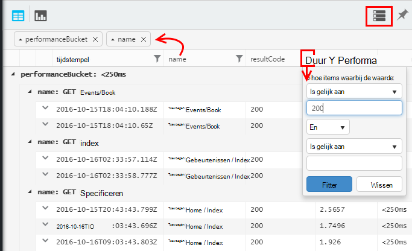

<properties 
    pageTitle="Een rondleiding door Analytics in inzichten toepassing | Microsoft Azure" 
    description="Korte monsters van alle belangrijke query's in Analytics, de krachtige zoekfunctie van inzichten van toepassing." 
    services="application-insights" 
    documentationCenter=""
    authors="alancameronwills" 
    manager="douge"/>

<tags 
    ms.service="application-insights" 
    ms.workload="tbd" 
    ms.tgt_pltfrm="ibiza" 
    ms.devlang="na" 
    ms.topic="article" 
    ms.date="10/15/2016" 
    ms.author="awills"/>


 
# <a name="a-tour-of-analytics-in-application-insights"></a>Een rondleiding door Analytics in inzichten van toepassing


[Analytics](app-insights-analytics.md) is de krachtige zoekfunctie van [Inzichten van toepassing](app-insights-overview.md). Deze pagina's beschrijven de lanquage Analytics query.


* **[Bekijk de inleidende video](https://applicationanalytics-media.azureedge.net/home_page_video.mp4)**.
* **[Test drive Analytics op onze gesimuleerde gegevens](https://analytics.applicationinsights.io/demo)** als uw app is niet van gegevens naar inzichten toepassing nog verzenden.


U gaat nu een beknopt overzicht van enkele eenvoudige query's om u aan de slag.

## <a name="connect-to-your-application-insights-data"></a>Verbinding maken met de gegevens van uw toepassing inzichten

Open Analytics uit van uw app [Overzicht blade](app-insights-dashboards.md) in inzichten van toepassing:


    
## <a name="takeapp-insights-analytics-referencemdtake-operator-show-me-n-rows"></a>[Nemen](app-insights-analytics-reference.md#take-operator): n rijen weergeven

Gegevenspunten die bewerkingen van gebruikers (meestal HTTP-aanvragen dat is ontvangen door uw web app) worden opgeslagen in een tabel met de naam `requests`. Elke rij is een telemetrie gegevens ontvangen van de SDK toepassing inzichten in uw app.

Laten we eerst een paar monster rijen van de tabel:


> [AZURE.NOTE] Plaats de cursor ergens in het overzicht voordat u klikt op Start. U kunt splitsen, een verklaring over meer dan één regel, maar geen lege regels opnemen in een instructie. Lege regels zijn een handige manier om meerdere afzonderlijke query's in het venster.


Kies kolommen en sleept u deze groeperen op kolommen filteren: 




Vouw elk item om de details te bekijken:
 


> [AZURE.NOTE] Klik op de kop van een kolom om de resultaten beschikbaar in de webbrowser opnieuw rangschikken. Maar houd er rekening mee dat voor een grote resultaatset, het aantal rijen is gedownload naar de browser beperkt wordt. Op deze manier sorteren niet altijd u de werkelijke hoogste of laagste items weergeven. Gebruiken om items te sorteren op betrouwbare wijze, de `top` of `sort` operator. 

## <a name="topapp-insights-analytics-referencemdtop-operator-and-sortapp-insights-analytics-referencemdsort-operator"></a>[Boven](app-insights-analytics-reference.md#top-operator) - en [sorteren](app-insights-analytics-reference.md#sort-operator)

`take`is handig om een snel voorbeeld van een resultaat, maar de rijen uit de tabel wordt in een willekeurige volgorde. Als u een gesorteerde weergave, gebruikt `top` (voor een voorbeeld) of `sort` (over de hele tabel).

De eerste n rijen besteld door een bepaalde kolom weergeven:

```AIQL

    requests | top 10 by timestamp desc 
```

* *Syntaxis:* De meeste operators hebben trefwoord parameters, zoals `by`.
* `desc`aflopende volgorde = `asc` = oplopend.


`top...`is een manier meer zodat de melding `sort ... | take...`. We kunnen schrijven:

```AIQL

    requests | sort by timestamp desc | take 10
```

Het resultaat is hetzelfde, maar zou iets langzamer uitgevoerd. (U kunt ook schrijven `order`, dat is een alias van `sort`.)

De kolomkoppen in de tabelweergave kunnen ook worden gebruikt voor het sorteren van de resultaten op het scherm. Maar natuurlijk, als u hebt gebruikt `take` of `top` voor het ophalen van alleen maar een deel van een tabel, u zult alleen volgorde de records die u hebt opgehaald.


## <a name="projectapp-insights-analytics-referencemdproject-operator-select-rename-and-compute-columns"></a>[Project](app-insights-analytics-reference.md#project-operator): selecteren, wijzigen en berekenen van kolommen

Gebruik [`project`](app-insights-analytics-reference.md#project-operator) uit kolommen u wilt kiezen:

```AIQL

    requests | top 10 by timestamp desc
             | project timestamp, name, resultCode
```


U kunt ook namen van kolommen wijzigen en nieuwe te definiëren:

```AIQL

    requests 
  	| top 10 by timestamp desc 
  	| project  
            name, 
            response = resultCode,
            timestamp, 
            ['time of day'] = floor(timestamp % 1d, 1s)
```


* [Kolomnamen](app-insights-analytics-reference.md#names) mogen spaties bevatten of als ze worden tussen haakjes als volgt: `['...']` of`["..."]`
* `%`is de gebruikelijke modulo operator. 
* `1d`(dat is een cijfer, en vervolgens een had') is een letterlijke timespan betekent één dag. Hier volgen enkele meer timespan letterlijke waarden: `12h`, `30m`, `10s`, `0.01s`.
* `floor`(alias `bin`) wordt afgerond op het dichtstbijzijnde veelvoud van de basiswaarde u waarde. Dus `floor(aTime, 1s)` wordt afgerond op het dichtstbijzijnde tweede keer.

[Expressies](app-insights-analytics-reference.md#scalars) zijn alle gebruikelijke operatoren (`+`, `-`,...), en er is een aantal handige functies.

    

## <a name="extendapp-insights-analytics-referencemdextend-operator-compute-columns"></a>[Uitbreiden](app-insights-analytics-reference.md#extend-operator): kolommen berekenen

Als u alleen kolommen toevoegen aan een bestaande wilt, gebruikt u [`extend`](app-insights-analytics-reference.md#extend-operator):

```AIQL

    requests 
  	| top 10 by timestamp desc
  	| extend timeOfDay = floor(timestamp % 1d, 1s)
```

Met behulp van [`extend`](app-insights-analytics-reference.md#extend-operator) is minder uitgebreid dan [`project`](app-insights-analytics-reference.md#project-operator) als u wilt de bestaande kolommen behouden.


## <a name="summarizeapp-insights-analytics-referencemdsummarize-operator-aggregate-groups-of-rows"></a>[Samenvatten](app-insights-analytics-reference.md#summarize-operator): groepen rijen samenvoegen

`Summarize`een *aggregatie* worden toegepast op groepen rijen. 

Bijvoorbeeld de tijd uw web app nodig is om te reageren op een verzoek wordt gerapporteerd in het veld `duration`. We zien de gemiddelde responstijd op alle aanvragen:


Of we het resultaat kan opdelen in verzoeken van verschillende namen:


`Summarize`verzamelt de gegevenspunten in de stroom in groepen waarvoor de `by` component gelijkmatig wordt geëvalueerd. Elke waarde in de `by` - de naam van de bewerking in het bovenstaande voorbeeld - expressie resulteert in een rij in de resultaattabel. 

Of we kunnen resultaten groeperen op tijd van de dag:


U ziet hoe we maken gebruik van de `bin` functie (aka `floor`). Als we net `by timestamp`, elke ingevoerde rij zou uiteindelijk in zijn eigen kleine groep. Voor een continue scalaire als tijden of getallen, hebben we doorlopend bereik op te splitsen in een beheersbaar aantal discrete waarden en `bin` -dat is gewoon de bekende afronden naar beneden `floor` werken - is de eenvoudigste manier om dat te doen.

We kunnen dezelfde techniek gebruiken ter vermindering van het bereiken van tekenreeksen:


Merk op dat u kunt `name=` voor het instellen van de naam van een resultaatkolom in de statistische expressies of in de component door.

## <a name="counting-sampled-data"></a>Gegevens tellen bemonsterd

`sum(itemCount)`is de aanbevolen aggregatie voor het tellen van gebeurtenissen. In veel gevallen itemCount == 1, zodat de functie gewoon van het aantal rijen in de groep tellen. Maar wanneer [de bemonstering](app-insights-sampling.md) uitgevoerd wordt, slechts een fractie van de oorspronkelijke gebeurtenissen bewaard als gegevenspunten in de toepassing van inzichten, zodat voor elk gegevenspunt dat u ziet, er zijn `itemCount` gebeurtenissen. 

Bijvoorbeeld, als de bemonstering verwijdert 75% van de oorspronkelijke gebeurtenissen en klik vervolgens op itemCount == 4 in de ingehouden records - dat wil zeggen voor elke record ingehouden, zijn er vier originele records. 

Adaptieve bemonstering wordt itemCount zijn hoger tijdens perioden wanneer uw toepassing veel wordt gebruikt.

Berekening van het itemCount dus resulteert in een goede schatting van het oorspronkelijke aantal gebeurtenissen.


Er is ook een `count()` aggregatie (en een aantal bewerking), voor de gevallen waarin u echt wilt om het aantal rijen in een groep.


Er is een scala aan [functies van aggregatie](app-insights-analytics-reference.md#aggregations).


## <a name="charting-the-results"></a>De resultaten voor grafieken


```AIQL

    exceptions 
       | summarize count()  
         by bin(timestamp, 1d)
```

Resultaten worden standaard weergegeven als een tabel:


Wij kunnen nu beter dan de tabelweergave. Bekijk de resultaten in het diagram met de verticale balk, optie:


Merk op dat hoewel we niet de resultaten sorteren op tijd (zoals u kunt zien in de tabel), datum/tijd in de grafiekweergave altijd worden weergegeven in de juiste volgorde.


## <a name="whereapp-insights-analytics-referencemdwhere-operator-filtering-on-a-condition"></a>[Waar](app-insights-analytics-reference.md#where-operator): filteren van een voorwaarde

Als u hebt ingesteld dat inzichten van de toepassing controle voor de zijden van de [client](app-insights-javascript.md) en de server van uw app, sommige van de telemetrie in de database afkomstig zijn van browsers.

We gaan nu kijken alleen uitzonderingen van browsers worden gerapporteerd:

```AIQL

    exceptions 
  	| where client_Type == "Browser" 
  	|  summarize count() 
       by client_Browser, outerMessage 
```


De `where` operator werkt met een Boole-expressie. Hier volgen enkele belangrijke punten over deze:

 * `and`, `or`: Booleaanse operatoren
 * `==`, `<>` : gelijk aan en niet gelijk aan
 * `=~`, `!=` : niet-hoofdlettergevoelige tekenreeks gelijk is en niet gelijk. Er zijn nog veel meer string vergelijkingsoperatoren.

Lees alles over [scalaire expressies](app-insights-analytics-reference.md#scalars).

### <a name="filtering-events"></a>Gebeurtenissen filteren

Mislukte aanvragen zoeken:

```AIQL

    requests 
  	| where isnotempty(resultCode) and toint(resultCode) >= 400
```

`responseCode`heeft type string, dus we [deze](app-insights-analytics-reference.md#casts) voor een numerieke vergelijking moeten.

Samenvatting van de antwoorden van de andere:

```AIQL

    requests
  	| where isnotempty(resultCode) and toint(resultCode) >= 400
  	| summarize count() 
      by resultCode
```

## <a name="timecharts"></a>Timecharts

Weergeven hoeveel gebeurtenissen er elke dag zijn:

```AIQL

    requests
      | summarize event_count=count()
        by bin(timestamp, 1d)
```

Selecteer de optie grafiek weergeven:


## <a name="multiple-series"></a>Meerdere reeksen 

Meerdere expressies in de `summarize` wordt gemaakt van meerdere kolommen.

Meerdere expressies in de `by` component maakt meerdere rijen, één voor elke combinatie van waarden.


```AIQL

    requests
  	| summarize count(), avg(duration) 
      by bin(timestamp, 1d), client_StateOrProvince, client_City 
  	| order by timestamp asc, client_StateOrProvince, client_City
```


### <a name="segment-a-chart-by-dimensions"></a>Een grafiek in segmenten per dimensie

Als u een tabel met een kolom string en een numerieke kolom grafiek, kunt u de tekenreeks gebruikt numerieke gegevens splitsen in afzonderlijke reeksen punten. Als er meer dan één tekenreeks kolom, kunt u welke kolom moet worden gebruikt als de discriminator. 


### <a name="display-multiple-metrics"></a>Meerdere parameters weergeven

U kunt elke combinatie van deze weergeven als u een tabel grafiek die meer dan één numerieke kolom naast de tijdstempel.


U moet niet splitsen selecteren voordat u kunt meerdere numerieke kolommen die u niet splitsen door een tekenreeks kolom op hetzelfde moment als het weergeven van meer dan één numerieke kolom selecteren. 


## <a name="daily-average-cycle"></a>Dagelijkse gemiddelde cyclus

Hoe gebruik variëren over de gemiddelde dag?

Aantal aanvragen op dat moment modulo één dag voor binned in uren:

```AIQL

    requests
  	| extend hour = floor(timestamp % 1d , 1h) 
          + datetime("2016-01-01")
  	| summarize event_count=count() by hour
```


>[AZURE.NOTE] Zoals u ziet, hebben we op dit moment tijdsduur converteren naar datum/tijd wilt weergeven in de grafieken.


## <a name="compare-multiple-daily-series"></a>Vergelijk meerdere dagelijkse reeksen

Hoe gebruik variëren in de tijd van de dag in verschillende landen?

```AIQL

 requests  | where tostring(operation_SyntheticSource)
     | extend hour= floor( timestamp % 1d , 1h)
           + datetime("2001-01-01")
     | summarize event_count=count() 
       by hour, client_CountryOrRegion 
     | render timechart
```


## <a name="plot-a-distribution"></a>Uitzetten van een verdeling

Hoeveel sessies er zijn van een andere lengte?

```AIQL

    requests 
  	| where isnotnull(session_Id) and isnotempty(session_Id) 
  	| summarize min(timestamp), max(timestamp) 
      by session_Id 
  	| extend sessionDuration = max_timestamp - min_timestamp 
  	| where sessionDuration > 1s and sessionDuration < 3m 
  	| summarize count() by floor(sessionDuration, 3s) 
  	| project d = sessionDuration + datetime("2016-01-01"), count_
```

De laatste regel is vereist voor het omzetten van datum/tijd. Momenteel worden de x-as van een grafiek wordt weergegeven als een scalaire alleen als het een datum/tijd.

De `where` component one-shot sessies worden uitgesloten (sessionDuration == 0) en de lengte van de x-as ingesteld.


## <a name="percentilesapp-insights-analytics-referencemdpercentiles"></a>[Percentielen](app-insights-analytics-reference.md#percentiles)

Welke bereiken van duur omvatten verschillende percentages van sessies?

Gebruik de bovenstaande query, maar de laatste regel vervangen door:

```AIQL

    requests 
  	| where isnotnull(session_Id) and isnotempty(session_Id) 
  	| summarize min(timestamp), max(timestamp) 
      by session_Id 
  	| extend sesh = max_timestamp - min_timestamp 
  	| where sesh > 1s
  	| summarize count() by floor(sesh, 3s) 
  	| summarize percentiles(sesh, 5, 20, 50, 80, 95)
```

We hebben ook de bovengrens verwijderd in de where-component, zodat de juiste cijfers, met inbegrip van alle sessies met meer dan één aanvraag ophalen:


Waaruit blijkt dat:

* 5% van de sessies hebben een looptijd van minder dan 3 minuten 34s; 
* 50% van de sessies laatste minnutes minder dan 36;
* 5% van de sessies laatste meer dan 7 dagen

Als u een afzonderlijke verdeling voor elk land, we net hebben om te vatten de client_CountryOrRegion kolom afzonderlijk door middel van beide operatoren:

```AIQL

    requests 
  	| where isnotnull(session_Id) and isnotempty(session_Id) 
  	| summarize min(timestamp), max(timestamp) 
      by session_Id, client_CountryOrRegion
  	| extend sesh = max_timestamp - min_timestamp 
  	| where sesh > 1s
  	| summarize count() by floor(sesh, 3s), client_CountryOrRegion
  	| summarize percentiles(sesh, 5, 20, 50, 80, 95)
      by client_CountryOrRegion
```


## <a name="joinapp-insights-analytics-referencemdjoin"></a>[Join](app-insights-analytics-reference.md#join)

We hebben toegang tot verschillende tabellen, met inbegrip van aanvragen en uitzonderingen.

Zoekt de uitzonderingen die verband houden met een aanvraag die een fout antwoord geretourneerd, kunnen we de tabellen samenvoegen op `session_Id`:

```AIQL

    requests 
  	| where toint(responseCode) >= 500 
  	| join (exceptions) on operation_Id 
  	| take 30
```


Het is raadzaam om te gebruiken `project` selecteren van kolommen moet voordat u de join uitvoert.
In de dezelfde componenten we de naam van de tijdstempelkolom.


## <a name="letapp-insights-analytics-referencemdlet-clause-assign-a-result-to-a-variable"></a>[Laat](app-insights-analytics-reference.md#let-clause): een resultaat toewijzen aan een variabele

Gebruik [laten](./app-insights-analytics-reference.md#let-statements) voor het scheiden van de onderdelen van de vorige expressie. De resultaten zijn niet gewijzigd:

```AIQL

    let bad_requests = 
      requests
        | where  toint(resultCode) >= 500  ;
    bad_requests
  	| join (exceptions) on session_Id 
  	| take 30
```

> Tip: In de Analytics-client niet plaatsen lege regels tussen de delen van deze. Zorg ervoor dat alles uitvoeren.


## <a name="accessing-nested-objects"></a>Geneste objecten openen

Geneste objecten zijn gemakkelijk toegankelijk. Bijvoorbeeld, in de stroom uitzonderingen ziet u gestructureerde objecten als volgt:


U kunt het afvlakken kiest de eigenschappen die u interesseert:

```AIQL

    exceptions | take 10
  	| extend method1 = tostring(details[0].parsedStack[1].method)
```

Houd er rekening mee dat u wilt [converteren](app-insights-analytics-reference.md#casts) naar het juiste type te gebruiken.

## <a name="custom-properties-and-measurements"></a>Aangepaste eigenschappen en metingen

Als uw toepassing [aangepaste afmetingen (eigenschappen) en aangepaste metingen](app-insights-api-custom-events-metrics.md#properties) wordt gekoppeld aan gebeurtenissen, dan ziet u in de `customDimensions` en `customMeasurements` objecten.


Bijvoorbeeld, als uw app omvat:

```C#

    var dimensions = new Dictionary<string, string> 
                     {{"p1", "v1"},{"p2", "v2"}};
    var measurements = new Dictionary<string, double>
                     {{"m1", 42.0}, {"m2", 43.2}};
    telemetryClient.TrackEvent("myEvent", dimensions, measurements);
```

Deze waarden in Analytics uitpakken:

```AIQL

    customEvents
  	| extend p1 = customDimensions.p1, 
      m1 = todouble(customMeasurements.m1) // cast to expected type

``` 

## <a name="tables"></a>Tabellen

De stroom van telemetrie ontvangen van uw app is toegankelijk via verschillende tabellen. Het schema van de eigenschappen die beschikbaar zijn voor elke tabel is aan de linkerkant van het venster zichtbaar.

### <a name="requests-table"></a>Tabel aanvragen

Het aantal HTTP-aanvragen voor uw web app en een segment met de paginanaam:


De aanvragen die de meeste niet vinden:


### <a name="custom-events-table"></a>Aangepaste gebeurtenissentabel

Als u [TrackEvent()](app-insights-api-custom-events-metrics.md#track-event) gebruikt voor het verzenden van uw eigen gebeurtenissen, vindt u in deze tabel. 

We nemen een voorbeeld waar uw code app deze regels bevat:

```C#

    telemetry.TrackEvent("Query", 
       new Dictionary<string,string> {{"query", sqlCmd}},
       new Dictionary<string,double> {
           {"retry", retryCount},
           {"querytime", totalTime}})
```

De frequentie van deze gebeurtenissen worden weergegeven:
 


Maten en dimensies ophalen van de gebeurtenissen:


### <a name="custom-metrics-table"></a>Aangepaste metrics tabel

Als u [TrackMetric()](app-insights-api-custom-events-metrics.md#track-metric) gebruikt voor het verzenden van uw eigen metrische waarden, zult u de resultaten in de stroom van de **customMetrics** . Bijvoorbeeld:  


> [AZURE.NOTE] In [Explorer Metrics](app-insights-metrics-explorer.md)alle aangepaste metingen die zijn gekoppeld aan elk type telemetrie samen weergegeven in de blade metrische gegevens samen met parameters die worden verzonden met behulp van `TrackMetric()`. Maar in Analytics, aangepaste metingen nog steeds gekoppeld aan wat voor soort telemetrie ze werden uitgevoerd op - gebeurtenissen of aanvragen, enzovoort -terwijl metrics verzonden door TrackMetric worden weergegeven in hun eigen stroom.

### <a name="performance-counters-table"></a>Prestaties tellers tabel

[Prestatiemeteritems](app-insights-performance-counters.md) weergegeven basissysteem metrics voor uw app, zoals CPU, geheugen en netwerkgebruik. U kunt de SDK voor het verzenden van extra items, inclusief uw eigen aangepaste tellers.

Het schema **performanceCounters** beschrijft de `category`, `counter` naam, en `instance` van de prestatieobjecten. Instantienamen teller zijn alleen van toepassing op sommige prestatiemeters en geven meestal de naam van het proces de telling betrekking heeft. De telemetrie voor elke toepassing ziet u alleen de items voor die toepassing. Bijvoorbeeld, als u wilt zien zijn welke items beschikbaar: 


Een grafiek van het beschikbare geheugen ophalen over de afgelopen periode: 


Net als andere telemetrie, **performanceCounters** ook een kolom is `cloud_RoleInstance` die aangeeft dat de identiteit van de hostcomputer waarop de toepassing wordt uitgevoerd. Voorbeeld, vergelijk de prestaties van uw app op verschillende computers: 


### <a name="exceptions-table"></a>Uitzonderingentabel

[Uitzonderingen worden gemeld door uw app](app-insights-asp-net-exceptions.md) zijn beschikbaar in deze tabel. 

Deelnemen aan op operation_Id om het HTTP-verzoek dat uw app is in behandeling bij de uitzondering voorgedaan:


### <a name="browser-timings-table"></a>Browser tijdsinstellingen tabel

`browserTimings`pagina laden gegevens verzameld in browsers voor gebruikers bevat.

[Instellen van uw app voor client-side telemetrie](app-insights-javascript.md) deze gegevens zien. 

Het schema bevat [cijfers die aangeeft dat de lengtes van de verschillende fasen van de pagina laden](app-insights-javascript.md#page-load-performance). (Ze niet geven aan hoe lang die de gebruikers een pagina lezen.)  

De popularities van de verschillende pagina's weergeven en tijden voor elke pagina te laden:


### <a name="availbility-results-table"></a>Tabel met resultaten Availbility

`availabilityResults`toont de resultaten van uw [web-tests](app-insights-monitor-web-app-availability.md). Elke uitvoering van de tests van de locatie van elke proef wordt afzonderlijk vermeld. 


### <a name="dependencies-table"></a>Tabel van afhankelijkheden

Bevat de resultaten van gesprekken dat uw app kunt u databases en REST API's en andere TrackDependency() aanroepen.

### <a name="traces-table"></a>Tabel van sporen

Bevat de telemetrie verzonden door uw app met TrackTrace() of [kaderregelingen logboekregistratie](app-insights-asp-net-trace-logs.md).

## <a name="dashboards"></a>Dashboards

U kunt de resultaten op een dashboard vastmaken om uw belangrijkste grafieken en tabellen samen te brengen.

* [Azure gedeelde dashboard](app-insights-dashboards.md#share-dashboards): klik op het pictogram van de PIN-code. Voordat u dit doet, moet u een gedeelde dashboard hebben. Open in de Azure portal of een dashboard maken en klik op delen.
* [Dashboard voor Power BI](app-insights-export-power-bi.md): klik op exporteren, Power BI-Query. Een voordeel van dit alternatief is dat u uw query naast een andere resultaten van een zeer breed scala van bronnen kunt weergeven.


## <a name="next-steps"></a>Volgende stappen

* [Naslaggids voor Analytics](app-insights-analytics-reference.md)

[AZURE.INCLUDE [app-insights-analytics-footer](../../includes/app-insights-analytics-footer.md)]


