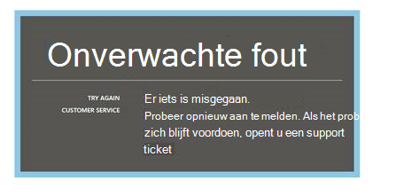
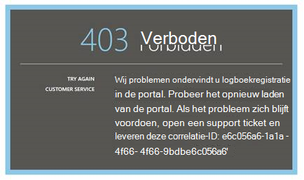
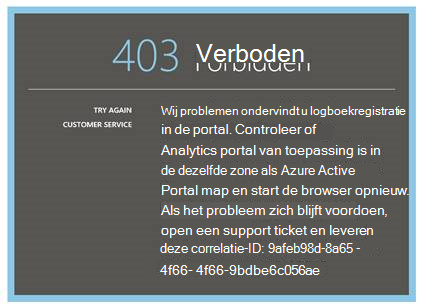
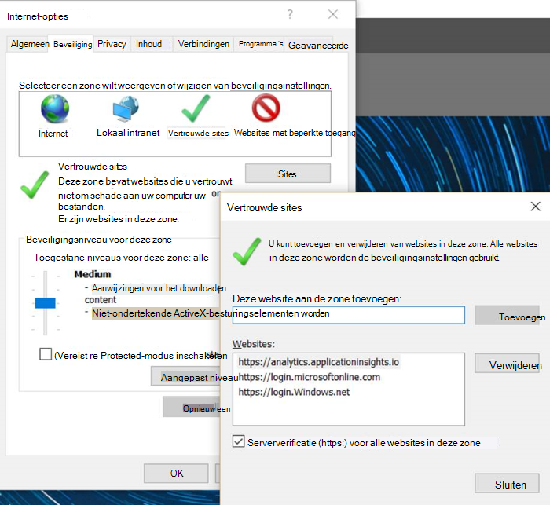
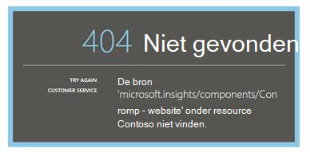
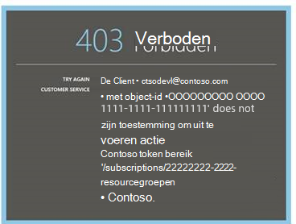
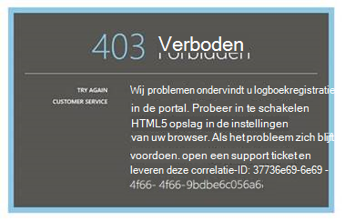
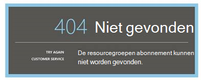
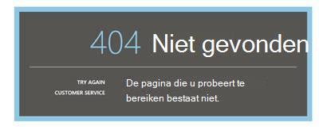

<properties 
    pageTitle="Problemen met Analytics - de krachtige zoekfunctie van toepassing inzichten | Microsoft Azure" 
    description="Problemen met de toepassing inzichten analytics? Start hier. " 
    services="application-insights" 
    documentationCenter=""
    authors="alancameronwills" 
    manager="douge"/>

<tags 
    ms.service="application-insights" 
    ms.workload="tbd" 
    ms.tgt_pltfrm="ibiza" 
    ms.devlang="na" 
    ms.topic="article" 
    ms.date="07/11/2016" 
    ms.author="awills"/>

# Problemen oplossen met Analytics in inzichten van toepassing

Problemen met de [toepassing inzichten Analytics](app-insights-analytics.md)? Start hier. Analytics is de krachtige zoekfunctie van Visual Studio-toepassing inzichten.

## Limieten

* Queryresultaten zijn momenteel beperkt tot alleen gedurende een week van oude gegevens.
* We testen op browsers: meest recente edities van chroom, rand en Internet Explorer.

## Bekende niet-compatibele browser-extensies

* Ghostery

De extensie uitschakelen of een andere browser gebruikt.

##'Onverwachte fout'

Er is een interne fout opgetreden tijdens runtime portal – niet-verwerkte uitzondering.

* Reinig de cache van de browser. 

## 403... Probeer het opnieuw laden

Een verificatie gerelateerd is een fout opgetreden (tijdens de verificatie of tijdens het genereren van access token). De portal kan er niet kan herstellen zonder het wijzigen van browserinstellingen.

* Controleer of [indirecte cookies zijn ingeschakeld](#cookies) in de browser. 

## 403... beveiligingszone controleren

Een verificatie gerelateerd is een fout opgetreden (tijdens de verificatie of tijdens het genereren van access token). De portal kan er niet kan herstellen zonder het wijzigen van browserinstellingen.

1. Controleer of [indirecte cookies zijn ingeschakeld](#cookies) in de browser. 

2. Hebt u een favoriet, bladwijzer of koppeling opgeslagen gebruikt voor het openen van het portaal Analytics? Bent u aangemeld bij andere referenties dan u gebruikt wanneer u de koppeling opgeslagen?

2. Probeer een browservenster in-particuliere/incognito (na het sluiten van alle vensters). U hebt uw referenties op te geven. 

2. Een andere (gewone) venster geopend en Ga naar [Azure](https://portal.azure.com). Afmelden. Open uw link en meld u aan met de juiste referenties.

2. Rand en Internet Explorer-gebruikers kunnen deze fout ook ophalen als vertrouwde zone-instellingen worden niet ondersteund.

    Controleer of u zowel [Analytics portal](https://analytics.applicationinsights.io) en [portal Azure Active Directory](https://portal.azure.com) in de dezelfde zone:

 * Open **Internet-opties**, **beveiliging**, **Vertrouwde sites**, **Sites**in Internet Explorer:

    

    In de lijst Websites als een van de volgende URL's opgenomen zijn, zorg dat de andere zijn opgenomen:

    https://Analytics.applicationinsights.IO 
   https://login.microsoftonline.com 
   https://login.Windows.NET

## 404... Bron niet gevonden

Bron van toepassing is verwijderd uit de inzichten van de toepassing en niet meer beschikbaar. Dit kan gebeuren als u de URL naar de pagina Analytics opgeslagen.

## 403... Er wordt geen toelating

U bent niet gemachtigd om deze toepassing te openen in Analytics.

* Kom je aan de koppeling van iemand anders? Vraag hen om ervoor te zorgen dat de [lezers of inzenders voor de resourcegroep](app-insights-resources-roles-access-control.md).
* U de koppeling met andere referenties opslaan? Open de [Azure portal](https://portal.azure.com), log uit en probeer deze koppeling weer de juiste referenties opgeeft.

## 403... HTML5 opslag

Onze portal gebruikt HTML5, localStorage en sessionStorage.

* Chroom: Instellingen, privacy, instellingen van de inhoud.
* Internet Explorer: Internet-opties, tabblad Geavanceerd, beveiliging, DOM opslag inschakelen

## 404... Abonnement is niet gevonden

De URL is ongeldig. 

* Open de bron app in de [portal Application inzichten](https://portal.azure.com). Klik de knop Analytics gebruiken.

## ... de 404 pagina niet bestaat.

De URL is ongeldig.

* Open de bron app in de [portal Application inzichten](https://portal.azure.com). Klik de knop Analytics gebruiken.

## Cookies van derden inschakelen

  Zie [cookies van derden uitschakelen](http://www.digitalcitizen.life/how-disable-third-party-cookies-all-major-browsers), maar u ziet dat we ze nodig hebben om in te **schakelen** .

## Als laatste redmiddel    

[Contact met ons opnemen](app-insights-get-dev-support.md).
 
[AZURE.INCLUDE [app-insights-analytics-footer](../../includes/app-insights-analytics-footer.md)]

