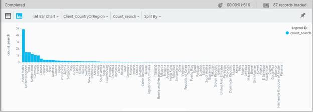

<properties 
    pageTitle="Met behulp van Analytics - de krachtige zoekfunctie van toepassing inzichten | Microsoft Azure" 
    description="Met behulp van de Analytics, krachtige diagnostische zoekfunctie van inzichten van toepassing. " 
    services="application-insights" 
    documentationCenter=""
    authors="danhadari" 
    manager="douge"/>

<tags 
    ms.service="application-insights" 
    ms.workload="tbd" 
    ms.tgt_pltfrm="ibiza" 
    ms.devlang="na" 
    ms.topic="article" 
    ms.date="10/21/2016" 
    ms.author="awills"/>

# Door middel van analyses in inzichten van toepassing

[Analytics](app-insights-analytics.md) is de krachtige zoekfunctie van [Inzichten van toepassing](app-insights-overview.md). Deze pagina's beschrijven de querytaal Analytics.

* **[Bekijk de inleidende video](https://applicationanalytics-media.azureedge.net/home_page_video.mp4)**.
* **[Test drive Analytics op onze gesimuleerde gegevens](https://analytics.applicationinsights.io/demo)** als uw app is niet van gegevens naar inzichten toepassing nog verzenden.

## Open Analytics

Klik op Analytics home resource in toepassing inzichten van uw app.

De in line zelfstudie kunt u enkele ideeën over wat u kunt doen.

Er is een [meer uitgebreide rondleiding hier](app-insights-analytics-tour.md).

## Uw telemetrie opvragen

### Een query schrijven

Beginnen met de namen van een van de tabellen die worden vermeld op de linkerkant (of het [bereik](app-insights-analytics-reference.md#range-operator) of de [Unie](app-insights-analytics-reference.md#union-operator) operators). Gebruik `|` voor het maken van een pijplijn van [operatoren](app-insights-analytics-reference.md#queries-and-operators). IntelliSense vraagt u met de operatoren en enkele van de expressie-elementen die u kunt gebruiken.

Zie de [Naslaggids](app-insights-analytics-reference.md)en [Analytics taal overzicht](app-insights-analytics-tour.md) .

### Een query uitvoeren

1. U kunt afzonderlijke regeleinden in een query.
2. Plaats de cursor in of aan het einde van de query die u wilt uitvoeren.
3. Klik op Go om de query uitvoert.
4. Plaats geen lege regels in uw query. U kunt meerdere afzonderlijke query's in één query tabblad door deze te scheiden met lege regels houden. Alleen de regel met de cursor wordt uitgevoerd.

### Een query opslaan

1. De huidige querybestand opslaan.
2. Open een opgeslagen query-bestand.
3. Maak een nieuwe querybestand.

## Zie de details

Elke rij in de resultaten van de volledige lijst met eigenschappen weer. Verder kunt u de eigenschap die is een gestructureerde waarde - bijvoorbeeld, aangepaste afmetingen of de stack aanbieding in een uitzondering uitbreiden.

 

## Rangschik de resultaten

U kunt sorteren, filteren, pagineren en de resultaten van de query te groeperen.

> [AZURE.NOTE] Sorteren, groeperen en filteren in de browser uitvoeren niet opnieuw van de query. Zij alleen de resultaten die zijn geretourneerd door de laatste query opnieuw te rangschikken. 
> 
> Schrijven om deze taken uitvoeren op de server voordat de resultaten zijn, de query met de operators [sorteren](app-insights-analytics-reference.md#sort-operator), [samenvatten](app-insights-analytics-reference.md#summarize-operator) en [waar](app-insights-analytics-reference.md#where-operator) .

Kies de kolommen die u wilt bekijken, sleept u de kolomkoppen om ze opnieuw te rangschikken en het formaat van kolommen wijzigen door de randen te slepen.

### Items sorteren en filteren

De resultaten sorteren door te klikken op de kop van een kolom. Klik nogmaals om de andere manier sorteren en op een derde tijd terugkeren naar de oorspronkelijke volgorde die door de query worden geretourneerd.

Via het filterpictogram uw zoekopdracht verfijnen.

### Items groeperen

Op meer dan één kolom wilt sorteren, groeperen gebruiken. Deze eerst inschakelen en vervolgens sleept u kolomkoppen in de ruimte boven de tabel.

### Sommige resultaten ontbreken?

Er is een limiet van ongeveer 10 k rijen op de resultaten van de portal. Een waarschuwing wordt weergegeven als u over de limiet gaan. Als dat gebeurt, weergegeven de resultaten in de tabel sorteren niet altijd u alle werkelijke eerste of laatste resultaten. 

Het is raadzaam om te voorkomen dat de limiet te raken. Gebruik operatoren, zoals:

* [waar tijdstempel > ago(3d)](app-insights-analytics-reference.md#where-operator)
* [Top 100 met tijdstempel](app-insights-analytics-reference.md#top-operator) 
* [100 nemen](app-insights-analytics-reference.md#take-operator)
* [samenvatten](app-insights-analytics-reference.md#summarize-operator) 

## Diagrammen

Het type diagram dat u wilt selecteren:

Als u meerdere kolommen van het juiste type hebt, kunt u de x en y-as en een kolom van de dimensies die u wilt de resultaten op te splitsen.

Standaard worden in eerste instantie weergegeven als een tabel en u het diagram handmatig selecteren. Maar u kunt het [genereren van de richtlijn](app-insights-analytics-reference.md#render-directive) aan het einde van een query een diagram selecteert.

## Vastzetten op dashboard

U een diagram kunt vastmaken of tabel op een van de [gedeelde dashboards](app-insights-dashboards.md) - alleen op de pin. (U moet wellicht [upgrade dat uw app in de prijzen pakket](app-insights-pricing.md) om deze functie inschakelen.) 

Dit betekent dat wanneer u een dashboard voor het controleren van de prestaties of het gebruik van de webservices samenstellen, u vrij complexe analyse naast de andere criteria opnemen kunt. 

Als er vier of minder kolommen, kunt u een tabel aan het dashboard, vastmaken. Alleen de bovenste zeven rijen worden weergegeven.

#### Dashboard vernieuwen

De grafiek is vastgemaakt aan het dashboard wordt automatisch vernieuwd door de query opnieuw uitgevoerd ongeveer elk half uur.

#### Automatische vereenvoudigingen

In sommige gevallen worden bepaalde vereenvoudigingen toegepast op een grafiek wanneer u aan een dashboard vastmaken.

Wanneer de pin een grafiek waarin een groot aantal aparte (meestal een staafdiagram) opslaglocaties de opslaglocaties minder gevulde automatisch gegroepeerd in één veld "overige" opslaglocatie. Bijvoorbeeld deze query:

    requests | summarize count_search = count() by client_CountryOrRegion

Analytics weergegeven als volgt:

maar wanneer u aan een dashboard vastmaken, als volgt uitziet:

## Exporteren naar Excel

Nadat u een query hebt uitgevoerd, kunt u een CSV-bestand downloaden. Klik op **exporteren naar Excel**.

## Exporteren naar Power BI

Plaats de cursor in een query en kies **exporteren naar Power BI**.

U kunt de query uitvoeren in Power BI. U kunt het vernieuwen van een schema instellen.

U kunt met Power BI, dashboards die samenbrengen van gegevens uit verschillende bronnen maken.

[Meer informatie over het exporteren naar Power BI](app-insights-export-power-bi.md)

[AZURE.INCLUDE [app-insights-analytics-footer](../../includes/app-insights-analytics-footer.md)]

